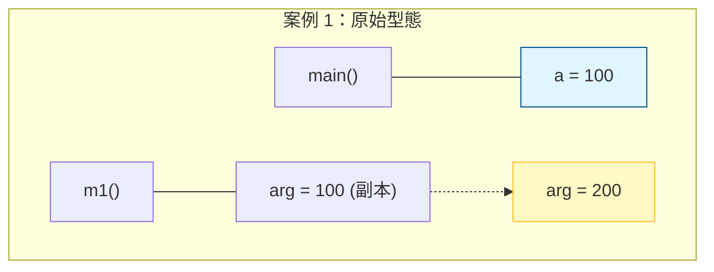
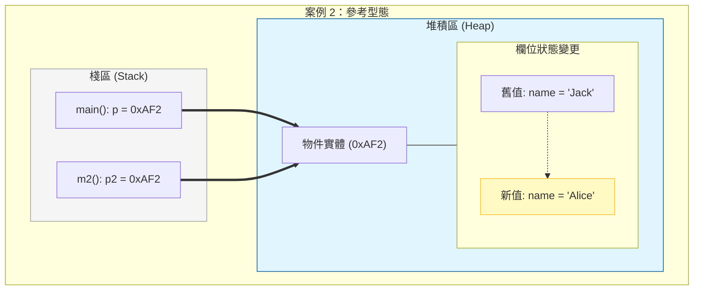
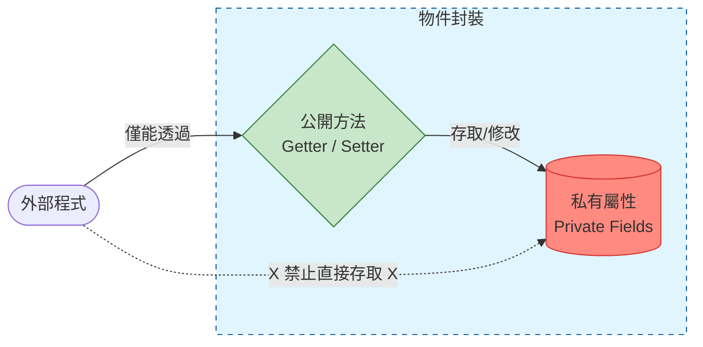
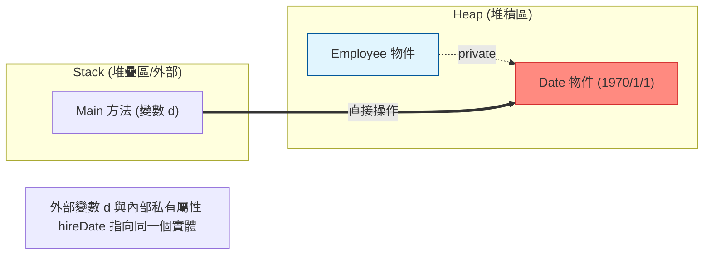
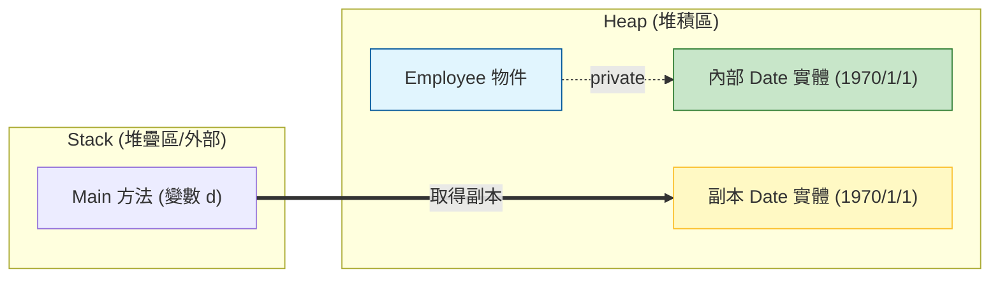
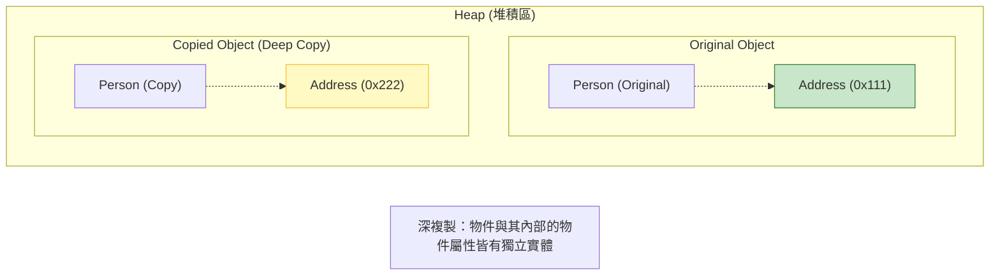
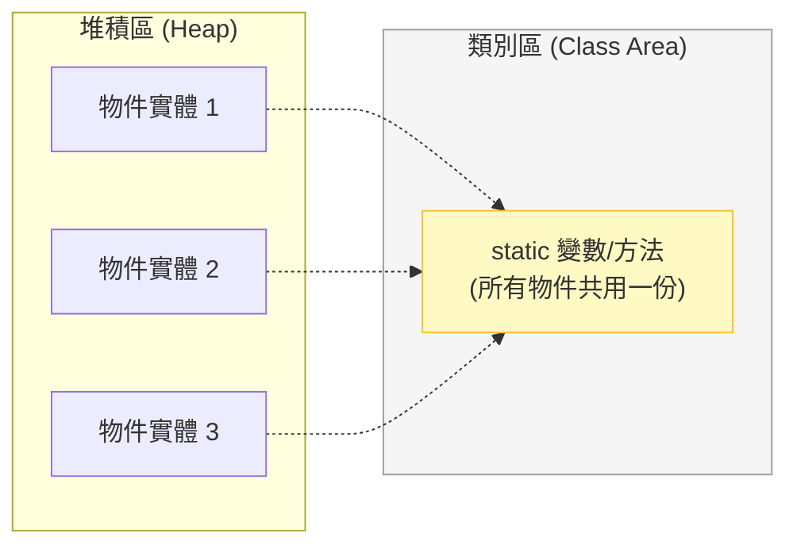
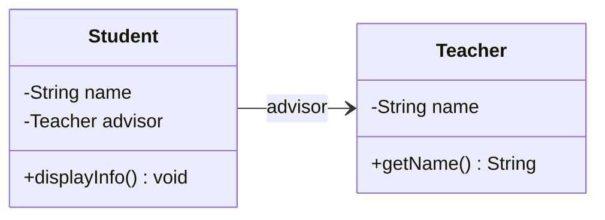
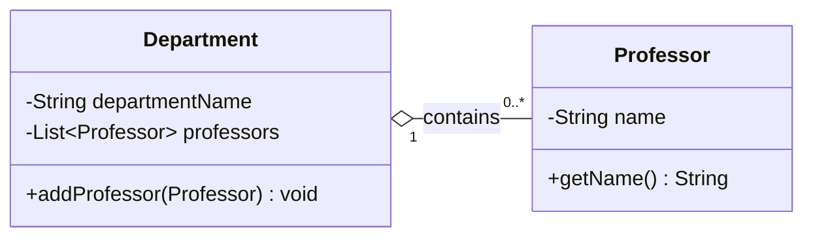
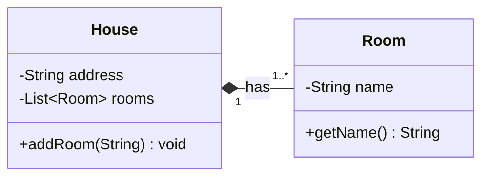

# Ch01: 基礎物件設計

**目標：** 介紹物件的基本概念，如何設計類別與物件，並掌握封裝的原則。

## **1.1 物件與類別的基本概念**  

### 1.1.1 物件與類別（Class）  
- **物件（Object）：** 物件是 **具有特定屬性（Attributes）和行為（Behaviors）** 的實體。  
  - 例如：「一台汽車」是一個物件，它有**顏色、型號、速度**（屬性），並且能**加速、剎車**（行為）。  
- **類別（Class）：** 類別是**物件的藍圖（Blueprint）或模板**，用來定義物件的屬性與行為。  
  - 例如：「汽車類別（Car）」描述了所有汽車應該具備的屬性（顏色、型號）和行為（加速、剎車），而**每一台特定的汽車**就是這個類別產生的**物件**。

> [!TIP]
> **命名慣例 (Naming Convention)**：
> - **類別 (Class)**：使用 **PascalCase** (大駝峰)，如 `Car`、`StudentManager`。
> - **變數與方法**：使用 **camelCase** (小駝峰)，如 `myCar`、`displayInfo()`。

📌 **比較：**  
|      | 類別（Class）                      | 物件（Object）                                |
| ---- | ---------------------------------- | --------------------------------------------- |
| 定義 | 一種抽象概念，描述物件的結構與行為 | 具體的實例，由類別建立                        |
| 作用 | 設計藍圖（Blueprint）              | 實際應用（Instance）                          |
| 範例 | `Car` 類別定義所有汽車的基本特徵   | `myCar = new Car("Toyota", "Red")` 是一個物件 |

---

### **1.1.2 Java 的類別與物件**  
在 Java 中，類別是用 `class` 關鍵字來定義的，而物件則是用 `new` 關鍵字來建立。  

📌 **範例：定義類別與建立物件**  
```java
// 定義一個類別
class Car {
    // 屬性（Attributes）
    String brand; // 汽車品牌
    String color; // 顏色
    
    // 建構子（Constructor）
    Car(String brand, String color) {
        this.brand = brand;
        this.color = color;
    }
    
    // 方法（Methods）
    void displayInfo() {
        System.out.println("這是一台 " + color + " 的 " + brand);
    }
}

public class Main {
    public static void main(String[] args) {
        // 建立物件
        Car myCar = new Car("Toyota", "紅色");
        
        // 呼叫物件的方法
        myCar.displayInfo();
    }
}
```

> [!WARNING]
> **未初始化的風險**：
> 若在 Java 中宣告了類別型態變數但未用 `new` 分配記憶體（如 `Car myCar;`），嘗試存取它會導致 `NullPointerException` (空指標異常)。

📌 **輸出：**  
```
這是一台 紅色 的 Toyota
```
---

### 1.1.3 Java 類別型態與原生型態

在 Java 中，資料型態主要分為 **原生型態（Primitive Types）** 和 **類別型態（Reference Types）**。以下是它們的主要說明與差別：

#### 原生型態

- **定義：**  
  原生型態是 Java 提供的基本資料型態，直接儲存實際的值，而不是物件的參考。

- **常見類型：**  
  - 整數型：`byte`、`short`、`int`、`long`
  - 浮點型：`float`、`double`
  - 字元型：`char`
  - 布林型：`boolean`

- **特性：**
  - **記憶體配置：** 儲存在堆疊（stack）或方法區（局部變數區），直接存放數值，不需要額外的記憶體管理。
  - **效率高：** 操作速度快，因為不涉及物件的建立與垃圾回收。
  - **沒有方法：** 原生型態不是物件，因此不能直接呼叫方法。例如，無法對 `int` 呼叫 `intValue()`（不過可以使用對應的包裝類別）。

- **例子：**
  ```java
  int a = 10;
  double b = 3.14;
  boolean flag = true;
  ```

#### 類別型態

- **定義：**  
  類別型態指的是由類別所建立的物件或陣列。當宣告一個變數為類別型態時，實際上該變數儲存的是物件在記憶體中的參考（位址）。

- **常見類型：**
  - 使用者自訂類別（例如 `Person`、`Car`）
  - 標準函式庫中的類別（例如 `String`、`Integer`、`ArrayList`）
  - 陣列（Array）

- **特性：**
  - **記憶體配置：** 物件本身存在於堆積（heap）中，變數中保存的是物件的參考（指向物件的位址）。
  - **可以呼叫方法：** 由於物件包含資料和行為，可以透過方法操作物件。
  - **預設值：** 如果未初始化，類別型態的變數預設為 `null`。
  - **垃圾回收：** 當物件不再被任何變數參考時，垃圾回收器會自動回收這部分記憶體。

- **例子：**
  ```java
  // 自訂類別
  public class Person {
      private String name;
      
      public Person(String name) {
          this.name = name;
      }
      
      public String getName() {
          return name;
      }
  }

  // 使用類別型態
  Person p = new Person("Alice");
  System.out.println(p.getName()); // 輸出：Alice
  
### 1.1.4 Java 包裝類別

在 Java 中，**Wrapper Class**（包裝類別）是用來將原生型態（primitive types）的值包裝成物件的類別。這樣的設計讓原生型態可以享有物件的特性，例如可以呼叫方法、參與泛型集合（如 ArrayList）等。

1. **對應關係：**  
   Java 為每個原生型態都提供了對應的包裝類別：
   - `byte` → `Byte`
   - `short` → `Short`
   - `int` → `Integer`
   - `long` → `Long`
   - `float` → `Float`
   - `double` → `Double`
   - `char` → `Character`
   - `boolean` → `Boolean`

2. **自動裝箱與拆箱（Auto-boxing & Unboxing）：**  
   從 Java 5 開始，引入了自動裝箱（auto-boxing）和自動拆箱（unboxing）的功能：
   - **自動裝箱：** 原生型態自動轉換成對應的包裝類別物件。
     ```java
     Integer i = 10; // 原生 int 10 被自動包裝成 Integer 物件
     ```
   - **自動拆箱：** 包裝類別物件自動轉換成對應的原生型態值。
     ```java
     int a = i; // 將 Integer 物件自動拆箱成 int 值
     ```

#### **補充觀念：記憶體模型（Stack vs. Heap）**
為什麼原生型態與類別型態的行為不同？這涉及到 Java 的記憶體操作方式：

- **堆疊（Stack）：** 
  - 儲存 **局部變數（Local Variables）** 與 **方法呼叫（Method Calls）**。
  - 當你宣告 `int a = 10;` 時，數值 `10` 會直接存在 Stack 中。
- **堆積（Heap）：** 
  - 儲存所有 **物件實體（Object Instances）**。
  - 當你執行 `Person p = new Person("Alice");` 時，物件實體存在 Heap，而變數 `p` 存在 Stack 中，它儲存的是指向 Heap 的 **記憶體位址（Reference）**。

> [!NOTE]
> 這解釋了為什麼將一個物件變數傳遞給方法時，方法內部的修改會影響原物件——因為傳遞的是「位址」，兩者指向同一個實體。

3. **優點與應用：**  
   - **集合應用：** Java 的集合框架（如 `ArrayList`）只能處理物件，無法直接存放原生型態，因此必須使用包裝類別。
   - **工具方法：** 每個包裝類別都提供了許多實用的方法，例如解析字串成數字（`Integer.parseInt("123")`）、數學運算、比較等。
   - **不可變性：** 大部分包裝類別都是不可變的（immutable），確保資料一旦建立後不會被更改。

4. **注意事項：**  
   - 包裝類別在進行數值操作時可能會涉及額外的性能成本（例如裝箱和拆箱）。
   - 在使用自動裝箱與拆箱時要注意 `null` 值可能引發 `NullPointerException`。

**範例：**

```java
public class WrapperExample {
    public static void main(String[] args) {
        // 自動裝箱：將原生 int 轉換成 Integer 物件
        Integer numObj = 100;
        // 自動拆箱：將 Integer 物件轉換回原生 int
        int num = numObj;

        // 使用包裝類別的方法：解析字串為整數
        String strNumber = "123";
        int parsedNumber = Integer.parseInt(strNumber);
        System.out.println("Parsed number: " + parsedNumber);

        // 集合中只能使用物件，所以必須使用 Integer 而非 int
        ArrayList<Integer> numbers = new ArrayList<>();
        numbers.add(10); // 自動裝箱發生
        numbers.add(20);
        numbers.forEach(n -> System.out.println("Number: " + n));
    }
}
```

### 1.1.4 物件的屬性與行為

**（1）屬性（Attributes，或稱為 Fields, Properties）**  
- 屬性用來存儲物件的狀態，例如汽車的品牌、顏色、速度等資訊。  
- 在 Java 中，屬性通常使用**變數**來表示，例如：  
  ```java
  String brand;  // 品牌
  String color;  // 顏色
  int speed;     // 速度
  ```

**（2）行為（Behavior）**  
- 行為代表物件可以執行的動作，例如汽車可以加速、剎車、變換顏色等。  
- 在 Java 中，行為通常使用**方法（Method）**來實作，例如：  
  ```java
  void accelerate() {
      speed += 10;
      System.out.println("車子加速，現在的速度是：" + speed);
  }
  ```

---

### **1.1.5 物件 vs. 資料結構的差異**
在傳統的 **資料結構** 設計中，資料和行為通常是分開的，例如：
```java
class CarData {
    String brand;
    String color;
}
void paintCar(CarData car, String newColor) {
    car.color = newColor;
}
```
在**物件導向**的設計中，資料和行為被封裝在一起：
```java
class Car {
    String brand;
    String color;

    void paint(String newColor) {
        this.color = newColor;
    }
}
```
📌 **比較：**  
|                | 資料結構設計               | 物件導向設計           |
| -------------- | -------------------------- | ---------------------- |
| **資料與行為** | 資料與操作方法分開         | 物件內部包含資料與行為 |
| **可擴展性**   | 變更功能時，須修改多個函式 | 只需修改類別內的方法   |
| **封裝性**     | 易暴露內部結構             | 良好的封裝，降低耦合   |

---

### **1.1.6 現代 Java 專用：Java Records (Java 14+)**
在現代 Java 開發中，若一個類別只是單純地用來「攜帶資料」（Data Carrier），例如儲存汽車資訊或學生資料，我們可以使用 **Record** 來簡化程式碼。

Record 會自動生成屬性（private final 且不可變）、建構子、Getter、`toString()`、`equals()` 與 `hashCode()`。

📌 **範例：使用 Record 定義汽車資料**
```java
public record CarRecord(String brand, String color) { }

public class Main {
    public static void main(String[] args) {
        CarRecord myCar = new CarRecord("Toyota", "紅色");
        
        // 注意：Record 的 Getter 命名方式是直接用屬性名，而不是 getBrand()
        System.out.println(myCar.brand()); 
        System.out.println(myCar); // 自動生成漂亮的 toString()
    }
}
```
> [!TIP]
> 當你只需要設計一個簡單的資料結構，而不需要複雜的行為（Behavior）時，Record 是非常優雅的選擇。

---

### 1.1.7 物件導向的優勢
物件導向設計（OOP）帶來幾個重要的好處：
1. **封裝（Encapsulation）：**  
   - 物件內部的屬性可被隱藏，外部只能透過公開的方法來操作，提高安全性。
2. **重用性（Reusability）：**  
   - 一個類別可以被多次使用，減少重複開發。
3. **可擴展性（Extensibility）：**  
   - 可以透過**繼承（Inheritance）**來擴充類別，實現更靈活的設計。
4. **易維護性（Maintainability）：**  
   - 物件導向的程式較容易理解、修改與擴充。

---

### 🎯 總結 1.1
✅ **類別（Class）** 是物件的藍圖，定義物件的屬性與行為。  
✅ **物件（Object）** 是類別的實體，每個物件有獨立的屬性與行為。  
✅ 物件導向設計（OOP）提升**封裝性、重用性、可擴展性**，讓程式更易維護。  

### 🔍 觀念測驗 1.1
1️⃣ **關於物件和類別，下列敘述何者正確？**  
   A)物件是類別的模板，而類別是物件的實例  
   B)類別可以擁有多個物件，但每個物件只能屬於一個類別  
   C)物件可以修改類別的定義  
   D)Java 物件必須在定義類別時就創建  

2️⃣ **以下哪一項不屬於物件型態？**  
   A)Person
   B)String
   C)Integer
   D)int age

3️⃣ **當我們用 `new` 關鍵字建立物件時，會發生什麼事情？**  
   A)建立一個新的類別  
   B)建立一個新的物件並分配記憶體  
   C)呼叫類別的靜態方法  
   D)將物件存入 `.java` 檔案  

---

<details>
<summary>👉 點擊查看答案</summary>

**👉 答案：**
* 1️⃣ B)類別可以擁有多個物件，但每個物件只能屬於一個類別  
* 2️⃣ D)int 是原生型態 
* 3️⃣ B)建立一個新的物件並分配記憶體  
</details>

---

### ✍ 練習 1.1

#### 📌 練習 1.1.1：類別與物件的基本使用  
請撰寫一個 Java 類別 `Person`，該類別應包含：  
- 兩個屬性：`name`（姓名，字串）和 `age`（年齡，整數）。  
- 一個建構子來初始化這些屬性。  
- 一個 `introduce()` 方法，輸出該人的姓名與年齡，例如：  
  ```plaintext
  大家好，我叫 Alice，今年 25 歲。
  ```  
- 在 `main()` 方法中建立兩個 `Person` 物件並呼叫 `introduce()` 方法。  

---

#### 📌 練習 1.1.2：物件的行為  
請設計一個 `BankAccount` 類別，包含以下內容：  
- 屬性：`accountNumber`（帳號，字串）、`balance`（餘額，浮點數）。  
- 方法：
  - `deposit(double amount)`：存款，增加 `balance`。  
  - `withdraw(double amount)`：提款，若 `balance` 不足則顯示「餘額不足」。  
  - `displayBalance()`：顯示目前的餘額。  
- 在 `main()` 方法中，建立一個帳戶，進行存款、提款與顯示餘額操作。

---

#### 📌 練習 1.1.3：物件 vs. 資料結構  
1. 在不使用物件導向的情況下（僅使用變數和函式），設計一個程式來管理學生的姓名與分數，並提供一個函式來計算平均分數。
2. 接著，將程式改寫為物件導向的方式，並比較兩種方式的優缺點。

---

## 1.2 類別與物件之實作

### 1.2.1 類別的定義與成員

Java 中的類別由**屬性、方法和建構子** 組成。  
```java
class ClassName {
    // 屬性 (fields)
    資料型別 屬性名稱;
    
    // 建構子 (constructor)
    ClassName(參數) {
        // 初始化屬性
    }
    
    // 方法 (method)
    回傳型別 方法名稱(參數) {
        // 方法邏輯
    }
}
```
**範例：**
```java
class Car {
    String brand;  // 屬性
    int speed;
    
    // 建構子
    Car(String brand, int speed) {
        this.brand = brand;
        this.speed = speed;
    }
    
    // 方法
    void accelerate() {
        speed += 10;
        System.out.println(brand + " 加速中，目前速度：" + speed);
    }
}
```

---

### 1.2.2 建構子與 this
建構子用來初始化物件：
```java
class Person {
    String name;
    
    // 建構子
    Person(String name) {
        this.name = name;  // this 指向當前物件
    }
}
```
📌 **關鍵字 `this` 用來區分屬性與參數**，防止變數名稱衝突。

> [!NOTE]
> **為什麼要寫 `this`？**
> 在建構子 `Person(String name)` 中，參數名與成員變數名相同。`this.name` 代表物件的屬性，而單純的 `name` 則代表傳入的參數。

---

### 1.2.3 屬性的封裝與存取修飾子
Java 提供四種存取修飾子：
| 修飾子    | 同類別內 | 同 package | 子類別(註) | 其他類別 |
| --------- | -------- | ---------- | ------ | -------- |
| private   | ✅        | ❌          | ❌      | ❌        |
| default   | ✅        | ✅          | ❌      | ❌        |
| protected | ✅        | ✅          | ✅      | ❌        |
| public    | ✅        | ✅          | ✅      | ✅        |

註：子類別表示在不同 package 下的子類別

📌 範例：
```java
class Person {
    private String name;  // 私有屬性

    // 提供公開的方法存取 name
    public void setName(String name) {
        this.name = name;
    }

    public String getName() {
        return name;
    }
}
```
**封裝的好處：**
- **防止不當存取**（避免不合理的值被設定）
- **提高可維護性**（程式更易讀）

---

### 1.2.4 靜態成員（Static）

- `static` 修飾的屬性和方法**屬於類別本身**，不需要建立物件即可使用。
- **適用場景：** 計數器、常數、工具方法等。

📌 **範例：**
```java
class Counter {
    static int count = 0; // 類別變數
    
    Counter() {
        count++;
    }
}
public class Main {
    public static void main(String[] args) {
        new Counter();
        new Counter();
        System.out.println("建立的物件數量：" + Counter.count); // 輸出 2
    }
}
```

---

### 🎯 總結 1.2
✅ **類別的結構** 包含屬性、建構子、方法。  
✅ **封裝（Encapsulation）** 使用 `private` 保護屬性，透過 `get/set` 方法存取。  
✅ **靜態成員（Static）** 屬於類別，不需實例化即可使用。

### 🔍 觀念測驗 1.2
**1️⃣ 下面哪個關於 Java 類別的描述是正確的？**  
A)類別內的 `private` 屬性可以被外部類別直接存取。  
B)物件的方法只能使用該物件的屬性，不能修改它們。  
C)`static` 方法不能存取非靜態成員變數。  
D)`this` 關鍵字只能用在 `static` 方法內。  

---

**2️⃣ `static` 變數的特性是什麼？**  
A)每個物件都會有自己獨立的 `static` 變數。  
B)`static` 變數屬於整個類別，而不是某個特定的物件。  
C)`static` 變數必須在建立物件時初始化。  
D)`static` 變數無法被修改。  

**3️⃣ 下列有關 `this` 關鍵字的描述，何者錯誤？**  
A)`this` 用於指向當前物件的實例。  
B)`this` 可以用來區分類別屬性與方法參數。  
C)`this` 只能用於建構子內，不能用在其他方法中。  
D)`this` 不能在 `static` 方法內使用。  

---

<details>
<summary>👉 點擊查看答案</summary>

**👉 答案：** 

1️⃣C)`static` 方法不能存取非靜態成員變數。  
2️⃣B)`static` 變數屬於整個類別，而不是某個特定的物件。  
3️⃣C)`this` 只能用於建構子內，不能用在其他方法中。（錯誤，`this` 也可以在一般方法中使用）
</details>

---

### ✍ 練習 1.2

#### 📌 練習 1.2.1：定義類別與使用建構子
請設計一個 `Car` 類別，該類別應包含：  
1. 兩個私有屬性：`brand`（品牌，字串）和 `speed`（速度，整數）。  
2. 一個建構子來初始化這些屬性。  
3. 提供 `getBrand()` 和 `setBrand(String brand)` 方法來存取 `brand`。  
4. 提供 `accelerate(int increase)` 方法來增加 `speed`，每次調用應該輸出當前速度。如果車速度超過 120，則輸出「車速過快，無法新增」。  
5. 在 `main()` 方法中，建立 `Car` 物件並測試其功能。  

**範例輸出（執行 `accelerate(10)` 三次後）：**  
```plaintext
目前速度：10 km/h  
目前速度：20 km/h  
目前速度：30 km/h  
```

---

#### 📌 練習 1.2.2：靜態變數與方法
請設計一個 `Student` 類別，該類別應包含：  
1. `name`（學生姓名，字串）和 `score`（分數，整數）兩個屬性。  
2. `static` 變數 `totalStudents`，計算目前創建的學生數量。  
3. `displayInfo()` 方法，輸出學生姓名和分數。  
4. `static` 方法 `getTotalStudents()`，返回 `totalStudents` 的值。  
5. 在 `main()` 方法中，建立多個學生物件，並測試 `totalStudents` 是否正確計數。  

---

#### 📌 練習 1.2.3：封裝與 `this`
請設計一個 `BankAccount` 類別，該類別應包含：  
1. 私有屬性 `accountNumber`（帳號，字串）和 `balance`（餘額，浮點數）。  
2. 建構子，使用 `this` 關鍵字來初始化屬性。  
3. `deposit(double amount)` 方法，允許存款，增加 `balance`。  
4. `withdraw(double amount)` 方法，允許提款，但若 `balance` 不足則顯示「餘額不足」。  
5. `displayBalance()` 方法，顯示目前的餘額。  
6. 在 `main()` 方法中，建立一個 `BankAccount` 物件，進行存款、提款與餘額顯示測試。  


## **1.3 方法與參數**  

在 Java 中，「方法」(Method) 是一組可以執行特定操作的程式碼區塊，類似於其他語言中的「函式」(Function)。方法可以幫助我們將程式碼模組化，提升程式的可讀性與重用性。本章節將介紹方法的基本語法、參數傳遞方式、回傳值、方法的重載 (Overloading) 以及可見性修飾詞。

---

### 1.3.1. 方法的基本結構

> [!NOTE]
> 方法是物件間溝通的介面。

Java 方法的基本語法如下：
```java
修飾詞 回傳型別 方法名稱(參數列表) {
    // 方法內部的程式碼
    return 回傳值; // (如果回傳型別不是 void)
}
```
- **修飾詞 (Modifier)**：例如 `public`, `private`, `static` 等，決定方法的可見範圍與屬性。
- **回傳型別 (Return Type)**：方法執行後回傳的資料型別，若無回傳值則使用 `void`。
- **方法名稱 (Method Name)**：命名規則與變數相同，通常使用小駝峰命名法 (camelCase)。
- **參數列表 (Parameter List)**：列出方法的輸入變數，格式為 `(資料型別 變數名稱, ...)`，可以為空。
- **方法主體 (Method Body)**：包含要執行的程式碼。
- **return**：如果方法有回傳值，必須使用 `return` 返回結果。

📍 **範例：定義並呼叫方法**
```java
public class MathUtil {
    // 加法方法
    public static int add(int a, int b) {
        return a + b;
    }

    public static void main(String[] args) {
        int sum = add(10, 20); // 呼叫方法
        System.out.println("加法結果：" + sum);
    }
}
```

---

### 1.3.2 方法的參數傳遞
Java 方法的參數傳遞採用 **值傳遞 (Pass by Value)**，這表示當你傳遞變數到方法時，Java 會建立變數的「複製」，方法內的變數變動不影響原變數。






📍 **基本型別的傳遞 (不會影響原變數)**
```java
public class Test {
    public static void m1(int arg) {
        arg = 200;
        System.out.println(arg); // 只改變副本，不影響原變數
    }

    public static void main(String[] args) {
        int a = 100;
        m1(a);
        System.out.println("a 的值：" + a); // 結果仍為 100
    }
}
```

📍 **參考型別的傳遞 (影響原物件內容)**
```java
class Person {
    String name;
}

public class Test {
    public static void m2(Person p2) {
        p2.name = "Alice"; // 修改物件屬性，影響原物件
    }

    public static void main(String[] args) {
        Person p = new Person("Jack");
        m2(p);
        System.out.println("p.name：" + p.name); // 結果變為 "Alice"
    }
}
```
➡ **基本型別傳遞的是「值」，但物件 (參考型別) 傳遞的是「參考的值」，會影響原物件內容。**

---

### 1.3.3 方法的回傳值
方法可以有回傳值，也可以沒有 (`void`)。

📍 **有回傳值的方法**
```java
public static int square(int num) {
    return num * num; // 回傳平方值
}
```

📍 **沒有回傳值的方法**
```java
public static void greet(String name) {
    System.out.println("Hello, " + name + "!");
}
```

---

### 1.3.4 方法的重載 
Java 支援「方法重載」(Method Overloading)，即**相同方法名稱但不同參數列表**的方法。

📍 **方法重載範例**
```java
public class OverloadExample {
    public static int add(int a, int b) {
        return a + b;
    }

    public static double add(double a, double b) {
        return a + b;
    }

    public static String add(String a, String b) {
        return a + b;
    }

    public static void main(String[] args) {
        System.out.println(add(5, 10));        // 呼叫 int 版本
        System.out.println(add(5.5, 2.3));    // 呼叫 double 版本
        System.out.println(add("Hello, ", "World!")); // 呼叫 String 版本
    }
}
```
➡ 方法的回傳型別不同**不構成重載**，唯有**參數數量或型別不同**才算是合法的重載。

---

### 🔍 觀念測驗 1.3  

1️⃣ **下列哪一個方法定義是錯誤的？**  
A)`void printMessage(String msg) { System.out.println(msg); }`  
B)`int add(int a, int b) { return a + b; }`  
C)`static double square(double x) { return x * x; }`  
D)`public double toString() { return this.value; }`  

2️⃣ **Java 方法的參數預設傳遞方式是？**  
A)變數的參考傳遞（pass by reference）  
B)變數的值傳遞（pass by value）  
C)依變數型別決定傳遞方式  
D)Java 不支援方法參數  

3️⃣ **下列哪一種方法重載 (Overloading) 是合法的？**  
A)`int add(int a, int b) {...}` 和 `double add(int a, int b) {...}`  
B)`int add(int a, int b) {...}` 和 `int add(double a, double b) {...}`  
C)`int add(int a, int b) {...}` 和 `int add(int a, int b, int c) {...}`  
D)B)和 C) 

---

<details>
<summary>👉 點擊查看答案</summary>

👉 答案
1. D)`toString()` 方法為 Java 內建 Object 的方法，在參數一樣的情況下，回傳型態不可不同。
2. B)Java 採用 **值傳遞 (Pass by Value)** ➡ 但對於物件參數，傳遞的是「參考的值」。
3. D)`B)和 (C)`➡ 方法重載需**改變參數數量或型別**，回傳型別不同**不能**構成重載。
</details>

---

### ✍ 練習 1.3

#### 📌 練習 1.3.1：方法基本操作
請實作一個 `Calculator` 類別，包含：
- `add(int, int)`：回傳兩數相加的結果。
- `subtract(int, int)`：回傳兩數相減的結果。
- `multiply(int, int)`：回傳兩數相乘的結果。
- `divide(int, int)`：當除數為 0 時，回傳 0，否則回傳商。

#### 📌 練習 1.3.2：值傳遞與參考傳遞
1. 建立 `Person` 類別，包含 `name` 和 `age` 屬性。
2. 建立 `modify(Person p)` 方法，修改 `p.name` 為 `"Alice"`。
3. 測試 `modify()` 是否影響原 `Person` 物件的 `name` 值。

#### 📌 練習 1.3.3：方法重載
上述練習中的 `Person` 類別，請改寫為使用方法重載的方式 (print())。

---

## 1.4 封裝與存取控制

封裝（Encapsulation）是物件導向程式設計（OOP）的四大核心概念之一，其主要目的是將物件的狀態（屬性）與行為（方法）包裝在同一個單位中，同時隱藏內部實作細節，只提供必要的介面與存取方式。這樣可以有效地保護資料，避免外部程式直接修改物件內部狀態，減少耦合性並提升程式的維護性與安全性。



### 1.4.1 封裝的概念
- **封裝（Encapsulation）**：將物件的資料（屬性）與行為（方法）集中管理，隱藏內部的實作細節，僅對外提供有限的操作介面。
- **好處：**
  - **保護資料安全**：防止外部程式直接修改物件狀態，避免不合法的操作。
  - **降低耦合性**：內部實作細節改變不會影響外部程式，方便維護與擴充。
  - **提高可讀性**：將物件的功能集中在一起，使程式邏輯更清晰。

### 1.4.2 存取控制

在 Java 中，存取控制（Access Control）可以透過修飾子來實現，不同的存取修飾子決定了類別、屬性或方法的可見範圍：

| 修飾子    | 同類別內 | 同 package | 子類別(註) | 其他類別 |
| --------- | -------- | ---------- | ------ | -------- |
| private   | ✅        | ❌          | ❌      | ❌        |
| default   | ✅        | ✅          | ❌      | ❌        |
| protected | ✅        | ✅          | ✅      | ❌        |
| public    | ✅        | ✅          | ✅      | ✅        |

註：子類別表示在不同 package 下的子類別

- **private**：僅能在本類別中存取。
- **default**（沒有修飾子）：在同一 package 中存取。
- **protected**：同一 package 以及子類別可存取。
- **public**：在任何地方皆可存取。

### 1.4.3 Getter 與 Setter 方法
為了實現封裝，我們通常將物件的屬性設為 private，並透過 public 的 getter 與 setter 方法來存取與修改屬性值。

📌 **範例：**
```java
public class Person {
    // 私有屬性
    private String name;
    private int age;

    // 建構子
    public Person(String name, int age) {
        this.name = name;
        this.age = age;
    }

    // Getter 方法：取得 name
    public String getName() {
        return name;
    }

    // Setter 方法：設定 name
    public void setName(String name) {
        this.name = name;
    }

    // Getter 方法：取得 age
    public int getAge() {
        return age;
    }

    // Setter 方法：設定 age，並進行簡單檢查
    public void setAge(int age) {
        if(age >= 0) {  // 確保年齡不為負數
            this.age = age;
        } else {
            System.out.println("年齡必須為非負數");
        }
    }
    
    // 顯示資訊的方法
    public void displayInfo() {
        System.out.println("姓名：" + name + "，年齡：" + age);
    }
}
```

在上例中，`name` 與 `age` 屬性被宣告為 private，只有透過 public 的 getter 與 setter 方法才能讀取或修改。這樣可以在 setter 中加入驗證邏輯，防止不正確的數值進入物件內部。

### 1.4.4 隱私洩漏

在 Java 中，Getter 方法通常用於讓外部存取類別內部的私有屬性，但若直接回傳那些屬性本身，而該屬性又是可變（mutable）的物件，就可能導致所謂的 **privacy leak**（隱私洩漏）。

---

#### **隱私洩漏的發生情形**

- **直接回傳可變物件：**  
  如果 Getter 方法直接回傳物件的參考，而這個物件是可變的（例如：陣列、集合、或自訂的可變類別），那麼呼叫者就可以透過這個參考修改物件的內容，進而改變該類別的內部狀態。這樣就違反了封裝原則，並可能導致意料之外的行為。

- **舉例說明：**  
  假設有一個類別內部有一個 `Date` 物件，若直接回傳此物件，外部程式碼可以修改這個日期，進而影響類別內部的狀態。
  
  ```java
  public class Employee {
      private Date hireDate;
      
      public Employee(Date hireDate) {
          // 假設 hireDate 為傳入的參考
          this.hireDate = hireDate;
      }
      
      // 直接回傳 hireDate 的參考
      public Date getHireDate() {
          return hireDate;
      }
  }
  ```
  
  使用者可以這樣做：
  
  ```java
  Employee emp = new Employee(new Date());
  Date d = emp.getHireDate();
  d.setTime(0);  // 修改了內部 hireDate 的值
  ```
  
  這樣，原本應該由 `Employee` 類別控制的狀態就被外部直接更改，造成隱私洩漏。



---

#### **如何避免隱私洩漏**

- **返回防禦性複製（Defensive Copy）：**  
  在 Getter 方法中，不直接返回內部物件的參考，而是返回一個新的複製物。這樣外部即使修改該複製物，也不會影響原本的內部物件。

  ```java
  public class Employee {
      private Date hireDate;
      
      public Employee(Date hireDate) {
          // 建議在建構子中也進行複製
          this.hireDate = new Date(hireDate.getTime());
      }
      
      public Date getHireDate() {
          // 返回防禦性複製
          return new Date(hireDate.getTime());
      }
  }
  ```
  

  
- **不可變物件：**  
  盡量使用不可變的物件（Immutable Objects）作為內部狀態，例如 `String` 或設計自己的不可變類別，這樣即使直接回傳也不會造成資料被修改。

```java
String a = "this is a book"
a.append(", not a pen");
// a=?
```    
append後 a 字串變化了嗎？**沒有!**。真實的運作是先產生一個新的字串，它的內容是 **this is a book, not a pen**。所以上述的程式碼應改為以下才有意義。

```java
String a = "this is a book"
b = a.append(", not a pen"); // ok
```     

---

### 🔍 觀念測驗 1.4

1️⃣ **下列哪個修飾子能夠使類別成員只能在該類別內存取？**  
A)public  
B)protected  
C)default  
D)private  


2️⃣ **使用 getter 與 setter 方法的主要好處是什麼？**
A)允許直接存取所有屬性  
B)強制外部類別使用特定格式存取資料  
C)提供封裝，保護資料的完整性與安全性  
D)減少程式碼長度  


3️⃣ **如果一個屬性宣告為 protected，那麼下列敘述正確的是？**  
A)該屬性只能在本類別內存取  
B)該屬性在同一個 package 內和所有子類別中皆可存取  
C)該屬性可以被任何類別存取  
D)該屬性在不同 package 中的子類別也無法存取  

---

<details>
<summary>👉 點擊查看答案</summary>

正確答案：
1. D)private
2. C)提供封裝，保護資料的完整性與安全性
3. B)該屬性在同一個 package 內和所有子類別中皆可存取
</details>

---

### ✍ 練習 1.4

#### 📌 練習 1.4.1：設計 Student 類別
請設計一個 `Student` 類別，要求如下：
- **屬性：**  
  - `private String id`：學生學號  
  - `private String name`：學生姓名  
  - `private double gpa`：學生 GPA  
- **建構子：** 使用上述屬性進行初始化
- **方法：**  
  - `public String getId()` 與 `public void setId(String id)`  
  - `public String getName()` 與 `public void setName(String name)`  
  - 在 setter 中，檢查 GPA 是否在 0.0 到 4.0 之間，否則輸出錯誤訊息
  - `public double getGpa()` 與 `public void setGpa(double gpa)`
  - `public void displayStudentInfo()`：顯示學生的所有資訊

在 `main()` 方法中建立至少兩個 `Student` 物件，並測試 getter 與 setter 的功能。

---

#### 📌 練習 1.4.2：資料驗證與封裝
修改下列程式碼，使其符合封裝原則，並在 setter 中加入驗證邏輯：
```java
class BankAccount {
    double balance;

    BankAccount(double balance) {
        this.balance = balance;
    }
}

public class Main {
    public static void main(String[] args) {
        BankAccount account = new BankAccount(1000);
        account.balance = -500; // 不合理的餘額
        System.out.println("餘額：" + account.balance);
    }
}
```
要求：  
1. 將 `balance` 改為 private。  
2. 提供 `getBalance()` 與 `setBalance(double balance)` 方法，並在 setter 中檢查餘額不得為負數。  
3. 修改 `main()` 方法以使用 getter 與 setter。

---

#### 📌 練習 1.4.3：protected 存取修飾子
1. 在上述練習 1.4.2 中，將 `balance` 改為 protected，並在 `BankAccount` 類別中建立一個 `protected void deposit(double amount)` 方法，用於增加餘額。然後在 `main()` 方法中建立 `BankAccount` 物件，並測試 `protected` 存取修飾子的功能。
2. 在不同目錄下建立一個 `BankAccount` 的子類別，並在子類別中建立一個 `protected void deposit(double amount)` 方法，用於增加餘額。然後在 `main()` 方法中建立 `BankAccount` 物件，並測試 `protected` 存取修飾子的功能。

## 1.5 建構子與物件初始化

在 Java 中，**建構子（Constructor）** 是一個特殊的方法，用於初始化新建立的物件。當使用 `new` 關鍵字建立物件時，系統會依序進行記憶體分配、執行初始化區塊，然後呼叫建構子來設定物件初始狀態。本節將探討以下三個主題：

- **預設建構子 vs. 自訂建構子**
- **建構子多載（Constructor Overloading）**
- **`this` 關鍵字的使用**

---

### 1.5.1 預設建構子 vs. 自訂建構子

#### 預設建構子
- 當你在類別中**未明確定義任何建構子**時，Java 編譯器會自動提供一個無參數的預設建構子。
- 預設建構子會將物件的成員變數初始化為其預設值（例如：數值型別為 `0`、布林型別為 `false`、參考型別為 `null`）。

**範例：**
```java
public class Animal {
    private String species;
    private int age;
    
    // 沒有自訂建構子時，Java 會自動生成類似以下的預設建構子：
    // public Animal() { }
    
    public void display() {
        System.out.println("Species: " + species + ", Age: " + age);
    }
    
    public static void main(String[] args) {
        // 呼叫預設建構子建立物件
        Animal animal = new Animal();
        animal.display();  // 輸出：Species: null, Age: 0
    }
}
```

#### 自訂建構子
- 當你定義自己的建構子時，就可以指定初始值或執行特定的初始化動作。
- 一旦你定義了**任何一個**建構子，Java 就不再自動生成預設建構子（除非你顯式定義）。

**範例：**
```java
public class Animal {
    private String species;
    private int age;
    
    // 自訂建構子：初始化物件時直接設定 species 與 age
    public Animal(String species, int age) {
        this.species = species;
        this.age = age;
    }
    
    public void display() {
        System.out.println("Species: " + species + ", Age: " + age);
    }
    
    public static void main(String[] args) {
        // 使用自訂建構子建立物件
        Animal lion = new Animal("Lion", 5);
        lion.display();  // 輸出：Species: Lion, Age: 5
    }
}
```

> [!CAUTION]
> 注意：當我們自訂了建構子，Java 就不再自動生成預設建構子。

---

### 1.5.2 建構子多載

- **建構子多載（Constructor Overloading）** 指的是在同一個類別中定義多個建構子，但每個建構子的參數列表必須不同（參數數量、型別或順序）。
- 多載的建構子讓你可以根據不同需求提供不同的初始化方式。

**範例：**
```java
public class Book {
    private String title;
    private String author;
    private double price;
    
    // 無參數建構子，設定預設值
    public Book() {
        this("Unknown Title", "Unknown Author", 0.0);
    }
    
    // 帶一個參數的建構子，只設定書名，其他使用預設值
    public Book(String title) {
        this(title, "Unknown Author", 0.0);
    }
    
    // 帶兩個參數的建構子
    public Book(String title, String author) {
        this(title, author, 0.0);
    }
    
    // 帶全部參數的建構子
    public Book(String title, String author, double price) {
        this.title = title;
        this.author = author;
        this.price = price;
    }
    
    public void display() {
        System.out.println("Title: " + title + ", Author: " + author + ", Price: $" + price);
    }
    
    public static void main(String[] args) {
        Book b1 = new Book();
        Book b2 = new Book("Java Programming");
        Book b3 = new Book("Effective Java", "Joshua Bloch");
        Book b4 = new Book("Clean Code", "Robert C. Martin", 42.95);
        
        b1.display();
        b2.display();
        b3.display();
        b4.display();
    }
}
```

在這個例子中，我們定義了四個建構子，讓使用者可以根據需要提供不同數量的參數來初始化 `Book` 物件。

---

### 1.5.3 `this` 關鍵字的使用

`this` 關鍵字有幾種常見用途：

1. **區分成員變數與參數**  
   當建構子或方法的參數名稱與成員變數相同時，可以使用 `this` 來區分。例如：
   ```java
   public class Person {
       private String name;
       private int age;
       
       public Person(String name, int age) {
           // 這裡 this.name 指的是成員變數，而 name 指的是參數
           this.name = name;
           this.age = age;
       }
   }
   ```

2. **呼叫同一類別中的另一個建構子**  
   可以使用 `this(參數列表)` 來呼叫同一類別中另一個建構子，此呼叫必須是建構子中的第一行程式碼。
   ```java
   public class Point {
       private int x;
       private int y;
       
       // 帶參數建構子
       public Point(int x, int y) {
           this.x = x;
           this.y = y;
       }
       
       // 無參數建構子，使用 this() 呼叫帶參數建構子設定預設值
       public Point() {
           this(0, 0);  // 呼叫上面的建構子
       }
       
       public void display() {
           System.out.println("Point(" + x + ", " + y + ")");
       }
       
       public static void main(String[] args) {
           Point p1 = new Point();
           Point p2 = new Point(5, 10);
           p1.display();  // 輸出：Point(0, 0)
           p2.display();  // 輸出：Point(5, 10)
       }
   }
   ```

3. **返回當前物件的參考**  
   在某些情況下，`this` 可以用於返回當前物件的引用，方便方法鏈（method chaining）。
   ```java
   public class Builder {
       private String value;
       
       public Builder setValue(String value) {
           this.value = value;
           return this;  // 返回當前物件，使多個方法可以連續呼叫
       }
       
       public void display() {
           System.out.println("Value: " + value);
       }
       
       public static void main(String[] args) {
           Builder b = new Builder();
           b.setValue("Hello").display();  // 方法鏈呼叫
       }
   }
   ```

### 1.5.4 複製建構子

在 Java 中，**複製建構子**（Copy Constructor）是一種特殊的建構子，它接受同一類別型態的物件作為參數，並利用該物件的資料來初始化新物件。雖然 Java 不像 C++ 那樣內建自動的複製建構子，但我們可以手動定義一個複製建構子，以實現物件複製的功能。

#### 主要用途

1. **物件複製**  
   透過複製建構子，可以創建與現有物件內容相同的新物件。這在需要保留原物件不變且希望修改副本時非常有用。

2. **淺複製與深複製**  
   - **淺複製（Shallow Copy）：** 僅複製基本資料型態和物件引用。若物件中含有指向其他物件的引用，則複製後新物件與原物件共用相同的參考。  
   - **深複製（Deep Copy）：** 除了複製基本資料型態外，也對引用的物件進行複製，確保新物件與原物件完全獨立。

---

#### 範例：簡單的複製建構子

下面是一個簡單的 `Person` 類別，該類別定義了兩個屬性 `name` 與 `age`，並提供了複製建構子來創建物件副本：

```java
public class Person {
    private String name;
    private int age;

    // 一般建構子
    public Person(String name, int age) {
        this.name = name;
        this.age = age;
    }

    // 複製建構子 (Copy Constructor)
    public Person(Person other) {
        // 對於不可變物件，如 String，直接複製引用就足夠了
        this.name = other.name;
        this.age = other.age;
    }

    // 供測試用的方法：顯示物件資訊
    public void displayInfo() {
        System.out.println("Name: " + name + ", Age: " + age);
    }

    public static void main(String[] args) {
        Person original = new Person("Alice", 30);
        Person copy = new Person(original);

        original.displayInfo(); // 輸出：Name: Alice, Age: 30
        copy.displayInfo();     // 輸出：Name: Alice, Age: 30
    }
}
```

在上述範例中，複製建構子 `Person(Person other)` 會接受一個現有的 `Person` 物件，並將其 `name` 與 `age` 複製給新建立的物件。

---

#### 淺複製 vs. 深複製

如果類別中有可變的物件屬性，僅僅複製引用（即淺複製）可能會導致兩個物件共用同一個內部狀態。這時候，你可能需要進行深複製，為內部的物件也建立獨立的副本。例如：

```java
public class Address {
    private String city;
    
    public Address(String city) {
        this.city = city;
    }
    
    // 複製建構子：實現深複製
    public Address(Address other) {
        this.city = other.city;
    }
    
    public String getCity() {
        return city;
    }
}

public class Person {
    private String name;
    private int age;
    private Address address;

    public Person(String name, int age, Address address) {
        this.name = name;
        this.age = age;
        this.address = address;
    }

    // 複製建構子，進行深複製
    public Person(Person other) {
        this.name = other.name;
        this.age = other.age;
        // 為 address 也建立一個新的副本
        this.address = new Address(other.address);
    }
    
    public void displayInfo() {
        System.out.println("Name: " + name + ", Age: " + age + ", City: " + address.getCity());
    }
    
    public static void main(String[] args) {
        Address addr = new Address("New York");
        Person original = new Person("Alice", 30, addr);
        Person copy = new Person(original);
        
        original.displayInfo(); // 輸出：Name: Alice, Age: 30, City: New York
        copy.displayInfo();     // 輸出：Name: Alice, Age: 30, City: New York
        
        // 若進行修改，兩個物件間不互相影響 (因為 address 為深複製)
    }
}
```



在這個例子中，`Person` 的複製建構子同時對 `Address` 進行深複製，確保 `original` 與 `copy` 的地址資料互不干擾。


### 🎯 總結 1.5
- **複製建構子** 是一個接受同類型物件作為參數的特殊建構子，用於複製物件的狀態。
- 它可以實現 **淺複製**（僅複製引用）或 **深複製**（複製所有內部可變物件），視情況而定。
- 複製建構子使得創建新物件的副本變得簡單且直觀，特別是在需要保留原物件不變的情況下。

---

### 🔍 觀念測驗 1.5

1️⃣ **如果一個類別中沒有定義任何建構子，Java 編譯器會：**
A)報錯，因為必須明確定義建構子  
B)自動生成一個無參數的預設建構子  
C)自動生成一個帶有所有成員變數參數的建構子  
D)需要手動呼叫超類別的建構子  

2️⃣ **下列哪個敘述正確描述了建構子多載（Constructor Overloading）的概念？**  
A)建構子必須具有相同的參數列表才能構成多載  
B)建構子多載指在同一類別中定義多個建構子，但必須有不同的參數列表  
C)建構子多載可以透過不同的返回型別來區分  
D)建構子多載只能定義一個無參數建構子和一個帶參數建構子  

3️⃣ **在建構子中使用 `this(參數列表)` 的主要目的為何？**
A)呼叫超類別的建構子  
B)呼叫同一類別中另一個建構子，避免重複程式碼  
C)指向當前物件的成員變數  
D)用於返回當前物件的參考  

---

<details>
<summary>👉 點擊查看答案</summary>

答案
1. B)自動生成一個無參數的預設建構子
2. B)建構子多載指在同一類別中定義多個建構子，但必須有不同的參數列表
3. B)呼叫同一類別中另一個建構子，避免重複程式碼
</details>

---

### ✍ 練習 1.5

#### 📌 練習 1.5.1：設計 Person 類別
請設計一個 `Person` 類別，要求如下：
- **屬性：**  
  - `private String name`  
  - `private int age`
- **建構子：**  
  - 定義一個無參數建構子，將 `name` 設為 `"Unknown"` 且 `age` 設為 `0`  
  - 定義一個帶參數建構子，根據傳入的參數初始化 `name` 與 `age`
- **方法：**  
  - `public void displayInfo()`：輸出 `name` 與 `age`
- **要求：**  
  在 `main()` 方法中建立兩個 `Person` 物件，分別使用無參數和帶參數建構子，並呼叫 `displayInfo()` 驗證初始化是否正確。

---

#### 📌 練習 1.5.2：使用建構子多載與 `this()`
請設計一個 `Rectangle` 類別，要求如下：
- **屬性：**  
  - `private int width`  
  - `private int height`
- **建構子：**  
  - 定義一個帶參數建構子，接收寬度與高度，並初始化對應屬性  
  - 定義一個無參數建構子，使用 `this(預設寬度, 預設高度)` 呼叫帶參數建構子，設定寬度和高度皆為 10
- **方法：**  
  - `public void display()`：顯示矩形的寬度與高度
- **要求：**  
  在 `main()` 方法中分別建立使用無參數和帶參數的 `Rectangle` 物件，並驗證初始化結果是否正確。

---

#### 📌 練習 1.5.3：實例初始化區塊與建構子的執行順序
請設計一個 `Counter` 類別，要求如下：
- **屬性：**  
  - `private int count`
- **初始化：**  
  - 使用實例初始化區塊將 `count` 設定為 `100`  
- **建構子：**  
  - 定義一個無參數建構子，在建構子中印出 `count` 的值
- **要求：**  
  在 `main()` 方法中建立 `Counter` 物件，觀察並驗證實例初始化區塊與建構子執行的順序與結果。

```java
class Counter {
    private int count;

    // 實例初始化區塊
    {
        count = 100;
        System.out.println("實例初始化區塊：count 設定為 " + count);
    }

    public Counter() {
        System.out.println("建構子：count 的值為 " + count);
    }

    public static void main(String[] args) {
        Counter c = new Counter();
    }
}
```

---
## **1.6 靜態成員與類別方法**

在 Java 中，`static` 關鍵字用來宣告靜態成員，也稱為類別成員。這些成員屬於整個類別，而非單一的物件實例。這一章節將深入探討：

- **static 修飾詞的用途**
- **靜態方法 (static methods) 與物件方法 (instance methods) 的差異**
- **以 Math 類別作為例子**

---

### **1.6.1 static 修飾詞的用途**



- **靜態成員（Static Members）**：  
  靜態變數與靜態方法屬於整個類別，而不是單一物件。這意味著所有物件共用同一份靜態成員資料。

  **用途：**
  - **共享資料**：例如計數器，所有物件共享同一數值。
  - **工具方法**：不需要建立物件即可呼叫的方法，如數學運算、字串處理等。

- **宣告方式：**
  ```java
  public class Example {
      // 靜態變數（類別變數）
      public static int counter = 0;
      
      // 靜態方法（類別方法）
      public static void displayCounter() {
          System.out.println("Counter: " + counter);
      }
  }
  ```

---

### **1.6.2 靜態方法 vs. 物件方法**

- **靜態方法（Static Methods）：**
  - 屬於類別本身，不需要建立物件即可呼叫。
  - 靜態方法中無法使用 `this` 及存取非靜態成員，因為它們與具體的物件無關。
  - 範例呼叫：`ClassName.methodName();`

- **物件方法（Instance Methods）：**
  - 屬於物件實例，必須透過建立物件後才能呼叫。
  - 可以存取該物件的實例變數和其他物件方法。
  - 範例呼叫：`objectName.methodName();`

**範例說明：**
```java
public class Sample {
    // 靜態變數：所有 Sample 物件共享
    public static int staticCount = 0;
    
    // 物件變數：每個 Sample 物件各自擁有
    public int instanceCount = 0;
    
    // 靜態方法：無法存取 instanceCount
    public static void incrementStatic() {
        staticCount++;
        // 下面這行會編譯錯誤：無法從靜態方法存取非靜態變數
        // instanceCount++;
    }
    
    // 物件方法：可以存取靜態和非靜態成員
    public void incrementInstance() {
        instanceCount++;
        staticCount++;
    }
    
    public static void main(String[] args) {
        // 呼叫靜態方法，不需要建立物件
        Sample.incrementStatic();
        System.out.println("Static Count: " + Sample.staticCount); // 輸出：1
        
        // 建立物件呼叫物件方法
        Sample s1 = new Sample();
        s1.incrementInstance();
        System.out.println("s1 Instance Count: " + s1.instanceCount); // 輸出：1
        System.out.println("Static Count: " + Sample.staticCount);      // 輸出：2
        
        Sample s2 = new Sample();
        s2.incrementInstance();
        System.out.println("s2 Instance Count: " + s2.instanceCount); // 輸出：1
        System.out.println("Static Count: " + Sample.staticCount);      // 輸出：3
    }
}
```

> [!CAUTION]
> 以下幾點注意：
> 
> * 靜態方法不可存取物件變數 (instance variable)
> * 靜態方法不可呼叫物件方法 (instance method)
> * **原因**：因為靜態成員在類別載入時就存在，而物件成員必須在 `new` 之後才存在。

---

### **1.6.3 Math 類別的例子**

Java 中的 `Math` 類別是一個典型的工具類別，其所有方法都被宣告為靜態的。這使得我們可以直接呼叫 `Math` 類別的方法而無需建立物件，例如：

- **常用方法：**
  - `Math.sqrt(double a)`：計算平方根。
  - `Math.pow(double a, double b)`：計算 a 的 b 次方。
  - `Math.random()`：生成 0.0 到 1.0 之間的隨機數。

**範例：**
```java
public class MathExample {
    public static void main(String[] args) {
        double value = 16.0;
        double sqrtValue = Math.sqrt(value); // 呼叫靜態方法，計算平方根
        double powerValue = Math.pow(2, 3);    // 計算 2^3 = 8
        double randomValue = Math.random();    // 生成隨機數
        
        System.out.println("sqrt(" + value + ") = " + sqrtValue);
        System.out.println("2^3 = " + powerValue);
        System.out.println("Random Value: " + randomValue);
    }
}
```
在上述範例中，我們直接通過類別名稱 `Math` 來呼叫其靜態方法，這正是靜態方法的一大特點。

---

### 🔍 觀念測驗 1.6

1️⃣ **下列關於 `static` 修飾詞的敘述，何者正確？**
A)靜態成員屬於每個物件實例，各自擁有獨立副本。  
B)靜態方法可以直接存取非靜態變數。  
C)靜態成員屬於整個類別，所有物件共享同一份資料。  
D)靜態方法必須先建立物件才能被呼叫。  

2️⃣ **下列哪一項是靜態方法與物件方法的主要區別？**
A)靜態方法可以使用 `this` 關鍵字，而物件方法不能。  
B)物件方法屬於類別本身，而靜態方法屬於物件實例。  
C)靜態方法在類別載入時就存在，而物件方法必須透過物件建立後才能呼叫。  
D)靜態方法可以直接存取物件方法中的非靜態變數。  

3️⃣ **以下有關 Math 類別的描述，哪一項是正確的？**
A)Math 類別中的所有方法都是物件方法，因此需要建立 Math 物件。  
B)Math 類別中的方法都是靜態方法，可以直接使用類別名稱呼叫。  
C)Math 類別提供了一個預設建構子，可用於初始化數學常數。  
D)Math 類別僅包含靜態變數，沒有方法。  

---

<details>
<summary>👉 點擊查看答案</summary>

**正確答案：** 
1. C)靜態成員屬於整個類別，所有物件共享同一份資料。
2. C)靜態方法在類別載入時就存在，而物件方法必須透過物件建立後才能呼叫。
3. B)Math 類別中的方法都是靜態方法，可以直接使用類別名稱呼叫。
</details>

---

### ✍ 練習 1.6

#### 📌 練習 1.6.1：設計一個工具類別
請設計一個 `StringUtil` 工具類別，要求如下：
- **方法：**  
  - 定義一個靜態方法 `reverse(String s)`，用以回傳反轉後的字串。
  - 定義一個靜態方法 `isEmpty(String s)`，檢查字串是否為空或 `null`。
- **要求：**  
  在 `main()` 方法中測試這些靜態方法，展示它們的使用。

---

#### 📌 練習 1.6.2：比較靜態變數與物件變數
請設計一個 `Counter` 類別，要求如下：
- **屬性：**  
  - `private static int totalCount`：用來計算所有物件共用的計數器。
  - `private int instanceCount`：用來計算每個物件自身的計數器。
- **建構子：**  
  每建立一個 `Counter` 物件，則：
  - `totalCount` 加 1。
  - `instanceCount` 初始化為 1。
- **方法：**  
  - `public void increment()`：將 `instanceCount` 加 1，並同步將 `totalCount` 加 1。
  - `public void display()`：顯示該物件的 `instanceCount` 以及目前的 `totalCount`。
- **要求：**  
  在 `main()` 方法中建立多個 `Counter` 物件，並透過呼叫 `increment()` 及 `display()` 觀察靜態與物件成員的差異。

---

#### 📌 練習 1.6.3：利用 Math 類別進行數學運算
請撰寫一個程式，要求如下：
- 從鍵盤讀取一個正數，計算並顯示其平方根與立方（即三次方）的值。
- 使用 `Math.sqrt()` 及 `Math.pow()` 方法進行運算，並直接使用這些靜態方法，不建立 Math 物件。

## **1.7 物件之間的關係**

在物件導向程式設計中，物件之間的關係定義了它們如何互動與依賴。主要有三種關係：  
- **關聯（Association）：** 描述物件彼此間的互動關係。  
- **聚合（Aggregation）：** 表示一個物件包含另一個物件，但所包含的物件可獨立存在。  
- **組合（Composition）：** 表示一個物件「擁有」另一個物件，所包含的物件與整體有非常強的生命週期依賴關係。

---

### 1.7.1 關聯

**定義：**  
關聯（Association）描述兩個或多個物件之間的互動或連結關係。例如，一位教師與學生之間的關係，或者一個司機與他的車輛之間的關係。  
- **雙向關聯：** 物件之間彼此認識與互動。  
- **單向關聯：** 一個物件認識另一個物件，但反之則不一定知道。

**範例：**  
```java
public class Teacher {
    private String name;
    
    public Teacher(String name) {
        this.name = name;
    }
    
    public String getName() {
        return name;
    }
}

public class Student {
    private String name;
    // 單向關聯：每個 Student 擁有一位 Teacher 作為導師
    private Teacher advisor;
    
    public Student(String name, Teacher advisor) {
        this.name = name;
        this.advisor = advisor;
    }
    
    public void displayInfo() {
        System.out.println("Student: " + name + ", Advisor: " + advisor.getName());
    }
    
    public static void main(String[] args) {
        Teacher t = new Teacher("Mr. Smith");
        Student s = new Student("Alice", t);
        s.displayInfo();
    }
}
```
在上述例子中，`Student` 與 `Teacher` 之間就存在一種關聯關係。



---

### 1.7.2 聚合

**定義：**  
聚合（Aggregation）是一種特殊的關聯，描述一個物件包含另一個物件，但這兩者之間有獨立的生命週期。  
- **範例：** 一個系所（Department）包含多位教授（Professor），但教授可以不依賴於某個系所獨立存在。

**範例：**  


```java
import java.util.ArrayList;
import java.util.List;

public class Professor {
    private String name;
    
    public Professor(String name) {
        this.name = name;
    }
    
    public String getName() {
        return name;
    }
}

public class Department {
    private String departmentName;
    // 聚合：Department 擁有多個 Professor，但教授本身可以獨立於 Department 存在
    private List<Professor> professors;
    
    public Department(String departmentName) {
        this.departmentName = departmentName;
        this.professors = new ArrayList<>();
    }
    
    public void addProfessor(Professor prof) {
        professors.add(prof);
    }
    
    public void displayDepartment() {
        System.out.println("Department: " + departmentName);
        System.out.println("Professors:");
        for(Professor prof : professors) {
            System.out.println("- " + prof.getName());
        }
    }
    
    public static void main(String[] args) {
        Department csDept = new Department("Computer Science");
        Professor p1 = new Professor("Dr. Johnson");
        Professor p2 = new Professor("Dr. Lee");
        
        csDept.addProfessor(p1);
        csDept.addProfessor(p2);
        csDept.displayDepartment();
    }
}
```

---

### 1.7.3 組合

**定義：**  
組合（Composition）也是一種「擁有」的關係，但相較於聚合，組合具有更強的依賴性。  
- **特點：**  
  - 所包含的物件（部分）與整體（整體物件）有同樣的生命週期。  
  - 當整體物件被銷毀時，部分物件也隨之消失。  
- **範例：** 一棟房子（House）包含房間（Room），如果房子不存在，房間也無法獨立存在。

**範例：**  


```java
import java.util.ArrayList;
import java.util.List;

public class Room {
    private String name;
    
    public Room(String name) {
        this.name = name;
    }
    
    public String getName() {
        return name;
    }
}

public class House {
    private String address;
    // 組合：House 擁有房間，房間的存在依賴於 House
    private List<Room> rooms;
    
    public House(String address) {
        this.address = address;
        this.rooms = new ArrayList<>();
    }
    
    // 組合核心：外部不傳入 Room 物件，而是由 House 內部自行建立處理
    public void addRoom(String roomName) {
        rooms.add(new Room(roomName));
    }
    
    public void displayHouse() {
        System.out.println("House at " + address + " has the following rooms:");
        for(Room room : rooms) {
            System.out.println("- " + room.getName());
        }
    }
    
    public static void main(String[] args) {
        House house = new House("123 Main St");
        
        // 由 House 內部建立 Room，展現其依賴關係
        house.addRoom("Living Room");
        house.addRoom("Kitchen");
        house.displayHouse();
    }
}
```
在這個例子中，`Room` 物件是 `House` 的一部分，當 `House` 被銷毀時，其包含的 `Room` 也隨之消失。

---

### 🔍 觀念測驗 1.7

1️⃣ **下列哪一項最能描述「關聯（Association）」的特性？**
A)一個物件包含另一個物件，且部分的生命週期依賴於整體  
B)物件之間僅僅是互相認識，彼此獨立存在  
C)一個物件與另一個物件完全不可分離  
D)物件必須透過繼承來建立關係  

2️⃣ **聚合（Aggregation）與組合（Composition）主要的區別在於：**
A)聚合描述的是「擁有」關係，而組合描述的是「使用」關係  
B)聚合中的部分可以獨立存在，而組合中的部分不能獨立存在  
C)聚合只能是單向關聯，組合則必須是雙向關聯  
D)聚合需要透過接口實現，組合則不需要  

3️⃣ **以下敘述何者最符合組合（Composition）的特性？**
A)一個課程（Course）擁有多位老師（Teacher），但老師可以獨立於課程存在。  
B)一個汽車（Car）由引擎（Engine）構成，當汽車不存在時，引擎也不存在。  
C)一個圖書館（Library）與其書籍（Book）之間沒有生命週期上的依賴關係。  
D)兩個獨立的應用程式透過接口共享數據。  

<details>
<summary>👉 點擊查看答案</summary>

**正確答案：** 
1. B)物件之間僅僅是互相認識，彼此獨立存在
2. B)聚合中的部分可以獨立存在，而組合中的部分不能獨立存在
3. B)一個汽車（Car）由引擎（Engine）構成，當汽車不存在時，引擎也不存在。
</details>

---

### ✍ 練習 1.7

#### 📌 練習 1.7.1：建立關聯
請設計一個簡單的「公司（Company）」與「員工（Employee）」系統，要求如下：
- 定義 `Company` 類別，包含屬性 `companyName` 與 `List<Employee>`。
- 定義 `Employee` 類別，包含屬性 `name` 與 `position`。
- 在 `Company` 中提供方法來新增員工及顯示公司所有員工資訊。
- 在 `main()` 方法中建立一個 `Company` 物件，新增多個 `Employee` 物件，並顯示其資訊。

---

#### 📌 練習 1.7.2：實作聚合
請設計一個「學校（School）」與「老師（Teacher）」的系統，要求如下：
- 定義 `Teacher` 類別，包含屬性 `name` 與 `subject`。
- 定義 `School` 類別，包含屬性 `schoolName` 與 `List<Teacher>`，並提供方法添加老師與顯示所有老師資訊。
- 在 `main()` 方法中，建立一個 `School` 物件，新增數位 `Teacher` 物件，展示聚合關係。

---

#### 📌 練習 1.7.3：實作組合
請設計一個「電腦（Computer）」與「組件（Component）」的系統，要求如下：
- 定義 `Component` 類別，包含屬性 `componentName` 與 `specification`。
- 定義 `Computer` 類別，包含屬性 `computerName` 與 `List<Component>`。  
  **提示：** 當建立 `Computer` 物件時，必須透過建構子或方法來初始化其所有組件，並確保組件與電腦具有相同的生命週期。
- 在 `main()` 方法中，建立一個 `Computer` 物件，為其添加多個 `Component` 物件，並顯示整台電腦的配置信息。
---


## 1.8 Java 的泛型

泛型（Generics）是 Java 提供的一種機制，使得類別、介面與方法可以定義參數化的類型，使其能夠適用於不同的數據類型，而無需編寫多個版本的相同程式碼。泛型的主要目標是提高程式碼的**重用性、型別安全性**，並**減少類型轉換**的需求。

泛型的優勢
- **型別安全（Type Safety）**  
  在編譯階段檢查類型錯誤，避免 `ClassCastException`。
- **消除類型轉換（Eliminate Casting）**  
  使用泛型時，不需要在存取時進行類型轉換，提高可讀性與執行效能。
- **程式碼重用（Code Reusability）**  
  使用相同的類別或方法來處理不同的數據類型，減少重複程式碼。

---

### 1.8.1a 泛型類別
泛型類別允許我們在類別宣告時指定類型參數。

**範例：定義一個泛型類別**
```java
// 定義泛型類別，T 代表類型參數
public class Box<T> {
    private T value; // value 的類型是 T

    public void setValue(T value) {
        this.value = value;
    }

    public T getValue() {
        return value;
    }
}

public class Main {
    public static void main(String[] args) {
        Box<Integer> intBox = new Box<>(); // 指定 T 為 Integer
        intBox.setValue(100);
        System.out.println(intBox.getValue());

        Box<String> strBox = new Box<>(); // 指定 T 為 String
        strBox.setValue("Hello Generics");
        System.out.println(strBox.getValue());
    }
}
```
**執行結果**
```
100
Hello Generics
```
此範例中，`Box<T>` 是一個泛型類別，其中 `T` 是類型參數，在實例化 `Box` 時，具體類型 `Integer` 或 `String` 被替換到 `T`。

---

### 1.8.1b 泛型與集合物件

**泛型（Generics）** 在 Java 中**最常用於集合類別（Collections）**，例如 `ArrayList`、`HashMap`、`HashSet` 等。Java 集合框架（Java Collections Framework, JCF）大量使用泛型，以提供類型安全（Type Safety）並減少類型轉換（Casting）。

#### 1. 為什麼 Java 集合需要泛型？
在 Java 5 之前，`ArrayList` 等集合類別的元素類型是 `Object`，這導致：
- **需要手動進行類型轉換**
- **無法在編譯階段檢查類型錯誤**
- **可能發生 `ClassCastException`**

**範例：沒有泛型的 `ArrayList`（Java 5 之前）**
```java
import java.util.ArrayList;

public class OldArrayListExample {
    public static void main(String[] args) {
        ArrayList list = new ArrayList(); // 沒有泛型，預設為 Object
        list.add("Hello");
        list.add(100); // 可以加入不同類型的物件

        String str = (String) list.get(0); // 需要手動轉型
        System.out.println(str);

        // 可能導致 ClassCastException
        String num = (String) list.get(1); // 錯誤！整數不能轉換為字串
        System.out.println(num);
    }
}
```
**執行結果**
```
Hello
Exception in thread "main" java.lang.ClassCastException: java.lang.Integer cannot be cast to java.lang.String
```
這種寫法容易出錯，因為 `list` 可以存放任何類型的物件，程式在執行時才發現錯誤。

---

#### 2. 使用泛型的 `ArrayList`（Java 5+）
為了避免上述問題，Java **引入了泛型**，使集合類別可以指定類型，避免手動轉型並在編譯時檢查類型錯誤。

**範例：使用泛型的 `ArrayList`**
```java
import java.util.ArrayList;

public class GenericArrayListExample {
    public static void main(String[] args) {
        // 使用泛型，限定 ArrayList 只能存放 String
        ArrayList<String> list = new ArrayList<>();
        list.add("Hello");
        list.add("World");

        // 取出的元素自動是 String，無需手動轉型
        String str = list.get(0);
        System.out.println(str);

        // list.add(100); // ❌ 編譯錯誤！因為 100 不是 String
    }
}
```
**優勢**
* **類型安全**：`ArrayList<String>` 只能存放 `String`，無法加入 `Integer`。  
* **無需類型轉換**：不需要 `(String) list.get(0);`，提高可讀性與效能。  
* **在編譯階段檢查錯誤**，降低 `ClassCastException` 風險。

#### 3. 常見的泛型集合類別
Java 集合框架（JCF）中的主要類別都支援泛型，例如：
| **集合類別**    | **描述**       | **範例**                                          |
| --------------- | -------------- | ------------------------------------------------- |
| `ArrayList<T>`  | 可變長度的陣列 | `ArrayList<Integer> list = new ArrayList<>();`    |
| `LinkedList<T>` | 雙向鏈結串列   | `LinkedList<String> queue = new LinkedList<>();`  |
| `HashSet<T>`    | 不重複元素集合 | `HashSet<Double> set = new HashSet<>();`          |
| `HashMap<K, V>` | 鍵值對映       | `HashMap<String, Integer> map = new HashMap<>();` |

#### 4. 泛型應用在 `HashMap<K, V>`
`HashMap<K, V>` 使用**兩個泛型參數**，`K` 代表**鍵**，`V` 代表**值**。

**範例：使用泛型的 `HashMap`**
```java
import java.util.HashMap;

public class GenericHashMapExample {
    public static void main(String[] args) {
        // HashMap<Key, Value>，Key 為 String，Value 為 Integer
        HashMap<String, Integer> scores = new HashMap<>();
        scores.put("Alice", 90);
        scores.put("Bob", 85);
        scores.put("Charlie", 88);

        // 透過 Key 取值，不需要手動轉型
        int aliceScore = scores.get("Alice");
        System.out.println("Alice's score: " + aliceScore);
    }
}
```
**執行結果**
```
Alice's score: 90
```
* **型別安全**，不能插入 `scores.put(123, "hello")`。  
* **在編譯時檢查類型錯誤**。

#### 5. 泛型與 `for-each` 迴圈
當集合類別使用泛型時，可以搭配 `for-each` 迴圈來簡化迭代操作。

**範例：使用 `for-each` 搭配泛型**
```java
import java.util.ArrayList;

public class GenericForEachExample {
    public static void main(String[] args) {
        ArrayList<Double> numbers = new ArrayList<>();
        numbers.add(10.5);
        numbers.add(20.3);
        numbers.add(30.1);

        // 使用 for-each 迴圈遍歷
        for (double num : numbers) {
            System.out.println(num);
        }
    }
}
```
**執行結果**
```
10.5
20.3
30.1
```
✅ **無需轉型，直接取得 `double` 值**。


#### 6. 泛型與 `Collections` 工具類
Java 提供 `Collections` 類別，支援泛型集合的操作，例如排序、搜尋等。

**範例：使用 `Collections.sort()`**
```java
import java.util.ArrayList;
import java.util.Collections;

public class GenericCollectionsExample {
    public static void main(String[] args) {
        ArrayList<Integer> numbers = new ArrayList<>();
        numbers.add(42);
        numbers.add(15);
        numbers.add(78);

        // 使用 Collections.sort() 排序
        Collections.sort(numbers);
        System.out.println(numbers);
    }
}
```
**執行結果**
```
[15, 42, 78]
```
✅ **`Collections.sort()` 可排序泛型集合中的元素**。  
✅ **型別安全，避免錯誤類型的比較**。

> [!NOTE]
> **想一想：`ArrayList` 本身有排序功能嗎？**
> 
> *   **不自動排序**：`ArrayList` 是動態陣列，它會按照你「加入」的順序來儲存元素。它並不像 `TreeSet` 那樣會自動維持排序。
> *   **排序方式**：
>     1.  **使用 `Collections.sort(list)`**：這是傳統的做法（如上例），適用於所有 `List` 實作。
>     2.  **使用 `list.sort(Comparator)`**：自 Java 8 起，`List` 介面新增了 `sort` 方法。例如 `numbers.sort(null);` 也可以達到字母排序的效果。也可以定義 `Comparator` 來實現自訂排序。
> *   **結論**：`ArrayList` 本身定位為「可變長度的陣列」，排序是「額外」的操作，而非內建的自動行為。

---

### 🎯 小結 
| **特點**             | **優勢**                                                 |
| -------------------- | -------------------------------------------------------- |
| **泛型與集合類別**   | 使 `ArrayList`、`HashMap` 等更加安全                     |
| **型別安全**         | 在編譯時檢查類型錯誤，避免 `ClassCastException`          |
| **不需手動轉型**     | `String s = list.get(0);` 直接取值，無需 `(String)` 轉型 |
| **提高程式碼可讀性** | 透過 `ArrayList<String>` 直接知道集合的類型              |

### 1.8.2 泛型方法
泛型方法（Generic Method）允許方法使用獨立於類別的類型參數，使方法可以適用於不同類型的數據。在 Java 的泛型方法宣告中，<T> 放在 void 之前的原因是：明確告知編譯器這是一個泛型方法，並且 T 是該方法專屬的類型參數。

**範例：定義泛型方法**
```java
public class GenericMethodExample {
    // 定義一個泛型方法
    public static <T> void printArray(T[] array) {
        for (T item : array) {
            System.out.print(item + " ");
        }
        System.out.println();
    }

    public static void main(String[] args) {
        Integer[] intArray = {1, 2, 3, 4, 5};
        String[] strArray = {"A", "B", "C"};

        printArray(intArray);
        printArray(strArray);
    }
}
```
**執行結果**
```
1 2 3 4 5 
A B C 
```
在 `printArray` 方法中，`<T>` 宣告了泛型類型 `T`，允許該方法接收任何類型的陣列。

---

### 1.8.3 泛型介面
泛型也可以應用於介面（Generic Interface），使介面能夠適用於不同的數據類型。

**範例：定義泛型介面**
```java
// 定義泛型介面
public interface Container<T> {
    void add(T item);
    T get(int index);
}

// 實作泛型介面
class StringContainer implements Container<String> {
    private List<String> items = new ArrayList<>();

    @Override
    public void add(String item) {
        items.add(item);
    }

    @Override
    public String get(int index) {
        return items.get(index);
    }
}

public class Main {
    public static void main(String[] args) {
        Container<String> container = new StringContainer();
        container.add("Hello");
        container.add("World");

        System.out.println(container.get(0)); // Hello
        System.out.println(container.get(1)); // World
    }
}
```
在這個例子中，`Container<T>` 是一個泛型介面，而 `StringContainer` 則將 `T` 指定為 `String` 來實作這個介面。

---

### 1.8.4 泛型的邊界
有時，我們希望限制泛型的類型，使其必須是某個類別的子類別或實作某個介面。此機制稱為泛型的邊界（Bounded Type Parameters）

**範例：使用 extends 限制類型**
```java
// 只允許 T 為 Number 的子類別（如 Integer、Double）
public class MathUtil<T extends Number> {
    private T number;

    public MathUtil(T number) {
        this.number = number;
    }

    public double square() {
        return number.doubleValue() * number.doubleValue();
    }
}

public class Main {
    public static void main(String[] args) {
        MathUtil<Integer> intMath = new MathUtil<>(10);
        MathUtil<Double> doubleMath = new MathUtil<>(3.5);

        System.out.println(intMath.square());   // 100.0
        System.out.println(doubleMath.square()); // 12.25
    }
}
```
這裡 `T extends Number` 表示 `T` 只能是 `Number` 的子類別，例如 `Integer` 或 `Double`，確保 `doubleValue()` 方法可以被使用。

---

### 1.8.5 泛型的通配符
通配符（Wildcard） `?` 表示不確定的類型，用於允許方法或結構接受不同類型的泛型參數。

**上限通配符 `? extends T`（Upper Bounded Wildcard）**
允許接受 `T` 或 `T` 的子類別。
```java
public static void printNumbers(List<? extends Number> list) {
    for (Number num : list) {
        System.out.println(num);
    }
}

public static void main(String[] args) {
    List<Integer> intList = Arrays.asList(1, 2, 3);
    List<Double> doubleList = Arrays.asList(1.1, 2.2, 3.3);

    printNumbers(intList);
    printNumbers(doubleList);
}
```

**下限通配符 `? super T`（Lower Bounded Wildcard）**
允許接受 `T` 或 `T` 的超類別。
```java
public static void addNumbers(List<? super Integer> list) {
    list.add(10);
    list.add(20);
}
```
這表示 `list` 至少是 `Integer` 的超類別（如 `List<Number>`）。

以下是關於泛型語法的整理：
    
| 語法 | 意義 | 範例 |
| --- | --- | --- |
| `<T>` | 泛型類型參數 | `class Box<T>` |
| `<T extends Number>` | 泛型類型參數，且必須是 `Number` 的子類別 | `class MathUtil<T extends Number>` |
| `<T super Integer>` | 泛型類型參數，且必須是 `Integer` 的超類別 | `class AddUtil<T super Integer>` |
| `<? extends T>` | 上限通配符，允許接受 `T` 或 `T` 的子類別 | `List<? extends Number>` |
| `<? super T>` | 下限通配符，允許接受 `T` 或 `T` 的超類別 | `List<? super Integer>` |

---

### 1.8.7 結論
- 泛型提供了型別安全與程式碼重用的能力。
- 泛型可用於**類別、方法、介面**等。
- **邊界（extends、super）**可限制類型參數的範圍。
- Java 泛型在運行時會進行**型別擦除**。


### 🔍 觀念測驗 1.8

1. 以下哪一種聲明是正確的泛型類定義？  
A)`public class Box<T> { private T item; }`  
B)`public class Box<T extends Number> { private T item; }`  
C)`public class Box<T super Integer> { private T item; }`  
D)以上皆是  

2. 關於 Java 泛型，以下敘述何者正確？  
A)Java 泛型支援基本類型，如 `List<int>`。  
B)`List<?>` 允許添加任何類型的元素。  
C)`List<? extends Number>` 允許讀取 `Number` 或其子類，但不能寫入（除了 `null`）。  
D)Java 的泛型是運行時機制，因此 `T.class` 是合法的。  

3. 給定以下程式碼：
```java
class A<T> {
    T value;
    A(T value) { this.value = value; }
    T getValue() { return value; }
}
```
以下哪個敘述是正確的？  

A)`A<String> a = new A<>("Hello");` 是合法的。  
B)`A<int> a = new A<>(10);` 是合法的。  
C)`A<?> a = new A<>(10);` 可以呼叫 `getValue()` 並返回 `int`。  
D)泛型類無法使用構造函數初始化。  

<details>
<summary>👉 點擊查看答案</summary>

**正確答案：**
1. A)(B)
2. (C)
3. (A)
</details>

---

### ✍ 練習 1.8

#### 📌 練習 1.8.1：設計泛型類 Pair
請設計一個泛型類 `Pair<T, U>`，用來存儲一對值，並提供 `getFirst()` 和 `getSecond()` 方法來獲取這兩個值。

#### 📌 練習 1.8.2：實作泛型方法 swap
請實作一個泛型方法 `swap`，能夠交換陣列中的兩個元素。例如：
```java
Integer[] arr = {1, 2, 3, 4};
swap(arr, 1, 3);
System.out.println(Arrays.toString(arr)); // 輸出: [1, 4, 3, 2]
```

#### 📌 練習 1.8.3：實作泛型類 Box with Comparable  
請實作一個泛型類 `Box<T extends Comparable<T>>`，並提供 `compare(Box<T> other)` 方法，讓 `Box<T>` 物件可以與另一個 `Box<T>` 物件比較大小。  

---

## 1.9 其他

### 1.9.1 Java 命名慣例

以下是常用的 Java 命名慣例，可協助你撰寫清晰且一致的程式碼：

---

#### 1. 類別 (Classes) 與 介面 (Interfaces)

- **類別命名：**  
  - 使用大駝峰式（PascalCase），每個單字的第一個字母都大寫。  
  - 類別名稱通常以名詞表示，例如：`Person`、`StudentManager`、`Car`。

- **介面命名：**  
  - 也使用大駝峰式。  
  - 有時介面名稱會以形容詞或能力來命名，如 `Runnable`、`Serializable`。  
  - 部分團隊或框架可能會在介面名稱前加 `I` 前綴（例如 `IShape`），但 Java 標準慣例並不要求這麼做。

---

#### 2. 方法 (Methods) 與 變數 (Variables)

- **方法命名：**  
  - 使用小駝峰式（camelCase），第一個字母小寫，後續單字第一個字母大寫。  
  - 方法名稱應該是動詞或動詞片語，能夠描述該方法執行的操作，例如：`calculateTotal()`、`printInfo()`、`getName()`、`setAge()`。

- **變數命名：**  
  - 同樣採用小駝峰式。  
  - 變數名稱應清楚描述其用途，如：`counter`、`studentName`、`listOfItems`。

---

#### 3. 常數 (Constants)

- **常數命名：**  
  - 使用全大寫字母，並用底線 `_` 分隔單字。  
  - 常數通常宣告為 `static final`，例如：`MAX_SIZE`、`DEFAULT_TIMEOUT`、`PI`。

---

#### 4. 套件 (Packages)

- **套件命名：**  
  - 套件名稱全小寫，通常以組織的反向網域名稱作為前綴，再依功能或模組劃分，例如：  
    - `com.example.project`  
    - `org.companyname.module.submodule`

---

#### 5. 泛型 (Generics)

- **泛型型別參數：**  
  - 常用單一大寫字母表示，例如：`T` (代表 Type)、`E` (代表 Element)、`K` (代表 Key)、`V` (代表 Value)。  
  - 如果有多個參數，則依序使用 `T, U, V` 等。

---

#### 6. 命名規範的一些補充

- **避免使用縮寫：**  
  除非縮寫非常常見且易於理解，否則盡量使用完整單字以提升可讀性。例如，儘量避免使用 `cnt` 來代表 `counter`。

- **一致性：**  
  在整個專案中保持一致的命名規則，這有助於其他開發者理解和維護程式碼。

- **描述性：**  
  命名應盡量描述變數或方法的用途，避免過於簡略的名稱，例如使用 `calculateInterest()` 比起 `calcInt()` 更易於理解。


下面提供一份教材介紹，內容涵蓋 Java 的控制結構與迴圈，以及輸入與輸出（I/O）的基本語法，適合初學者用來建立對 Java 語法的基本認識。

---

### 1.9.2 控制結構

控制結構用來根據條件執行不同程式碼區塊，或決定程式的執行流程。常見的控制結構包括：

#### if - else 語句

- **if 語句**：根據布林條件判斷是否執行某段程式碼。
  
  ```java
  int score = 85;
  if (score >= 60) {
      System.out.println("及格");
  }
  ```
  
- **if - else 語句**：根據條件分支處理。
  
  ```java
  int score = 55;
  if (score >= 60) {
      System.out.println("及格");
  } else {
      System.out.println("不及格");
  }
  ```

- **if - else if - else**：用於多重條件判斷。

  ```java
  int score = 75;
  if (score >= 90) {
      System.out.println("優秀");
  } else if (score >= 75) {
      System.out.println("良好");
  } else if (score >= 60) {
      System.out.println("及格");
  } else {
      System.out.println("不及格");
  }
  ```

#### switch 語句

- **switch** 用於對一個變數的多個值進行判斷，較適合於有限的選項。

  ```java
  int day = 3;
  switch(day) {
      case 1:
          System.out.println("星期一");
          break;
      case 2:
          System.out.println("星期二");
          break;
      case 3:
          System.out.println("星期三");
          break;
      default:
          System.out.println("未知的星期");
  }
  ```

- **注意事項**：
  - 每個 case 後面通常需要 `break`（除非刻意落空）。
  - `switch` 支援的型別有 `int`、`char`、`String`（自 Java 7 起）等。

---

### 1.9.3 迴圈語法

迴圈用於重複執行程式碼區塊，直到滿足特定條件為止。主要的迴圈有：

#### for 迴圈

- 適用於已知執行次數的情境。  
- 語法範例：

  ```java
  // 從 0 到 4 共執行 5 次
  for (int i = 0; i < 5; i++) {
      System.out.println("i = " + i);
  }
  ```

#### while 迴圈

- 當條件為真時，持續執行迴圈區塊。  
- 語法範例：

  ```java
  int count = 0;
  while (count < 5) {
      System.out.println("count = " + count);
      count++;
  }
  ```

#### do - while 迴圈

- 先執行一次迴圈區塊，再根據條件決定是否繼續。  
- 語法範例：

  ```java
  int num = 0;
  do {
      System.out.println("num = " + num);
      num++;
  } while (num < 5);
  ```

#### 增強 for 迴圈 (for-each)

- 用於遍歷陣列或集合，語法簡潔。
  
  ```java
  int[] numbers = {10, 20, 30, 40, 50};
  for (int n : numbers) {
      System.out.println("Number: " + n);
  }
  ```

- **注意事項**：增強 for 迴圈適用於遍歷集合，但無法直接修改陣列中的元素（除非你透過索引）。

---

### 1.9.4 輸入與輸出

Java 提供了多種方式進行資料的輸入與輸出，其中最常見的方式包括：

#### 輸出

- **System.out.println()**：輸出一行資料並換行。
  
  ```java
  System.out.println("Hello, Java!");
  ```

- **System.out.print()**：輸出資料但不換行。
  
  ```java
  System.out.print("Hello, ");
  System.out.print("Java!");
  ```

- **格式化輸出**：使用 `System.out.printf()` 可輸出格式化字串。
  
  ```java
  int x = 10;
  double y = 3.1415;
  System.out.printf("x = %d, y = %.2f\n", x, y);
  ```

#### toString()物件輸出

在 Java 中，當你嘗試印出物件時，例如使用 `System.out.println(object)`，編譯器會自動呼叫該物件的 `toString()` 方法來取得其字串表示。若沒有特別覆寫（Override）這個方法，預設會印出物件的類別名稱與雜湊碼（hash code），這通常並不是我們想要的資訊。

**1. 預設的 toString() 方法**

每個物件都繼承自 `java.lang.Object` 類別，而 `Object` 類別中已經定義了 `toString()` 方法。預設的實現大致如下：

```java
public String toString() {
    return getClass().getName() + "@" + Integer.toHexString(hashCode());
}
```

因此，若你不覆寫 `toString()` 方法，印出物件時會得到類似 `MyClass@1a2b3c4` 這樣的結果。

**2. 覆寫 toString() 方法**

為了能夠印出物件更有意義的資訊，我們通常會在自己的類別中覆寫 `toString()` 方法。覆寫後，你可以根據物件的屬性組合出一個易讀的描述。

**範例：**

```java
public class Person {
    private String name;
    private int age;

    public Person(String name, int age) {
        this.name = name;
        this.age = age;
    }
    
    // 覆寫 toString() 方法
    @Override
    public String toString() {
        return "Person{name='" + name + "', age=" + age + "}";
    }
    
    public static void main(String[] args) {
        Person p = new Person("Alice", 30);
        // 直接印出物件會呼叫 toString()
        System.out.println(p); // 輸出：Person{name='Alice', age=30}
    }
}
```

在此例中，透過覆寫 `toString()`，當我們印出 `Person` 物件時，就能清楚看到物件內部的資訊，而非預設的記憶體位址表示。

**3. toString() 的應用與注意事項**

- **除錯時的便利性：**  
  覆寫 `toString()` 可讓除錯時更快速了解物件狀態。

- **自動呼叫：**  
  許多工具（如日誌系統、字串串接）會自動呼叫 `toString()` 方法，故設計一個良好的 `toString()` 方法能提升程式可讀性與維護性。

- **避免洩漏敏感資訊：**  
  當覆寫 `toString()` 時，要小心不要意外輸出不該公開的敏感資料（例如密碼、私人 ID 等）。

- **使用 IDE 自動產生：**  
  現代 IDE（如 IntelliJ IDEA、Eclipse）通常提供自動生成 `toString()` 方法的功能，依據選定的屬性自動產生格式化字串，可作為初步參考，再根據需求進行調整。

#### 輸入

- **Scanner 類別**：`java.util.Scanner` 是最常用來從鍵盤讀取輸入的工具。

  ```java
  import java.util.Scanner;
  
  public class InputExample {
      public static void main(String[] args) {
          // 建立 Scanner 物件，使用 System.in 作為輸入來源
          Scanner scanner = new Scanner(System.in);
          
          System.out.print("請輸入一個整數：");
          int number = scanner.nextInt();
          
          System.out.print("請輸入一個字串：");
          // next() 讀取單一單詞，若要讀取整行可以用 nextLine()
          String text = scanner.next();
          
          System.out.println("您輸入的整數是：" + number);
          System.out.println("您輸入的字串是：" + text);
          
          scanner.close();
      }
  }
  ```

- **BufferedReader 與 InputStreamReader**：另一種讀取輸入的方法，特別適合於需要讀取大量資料或對效能要求較高時使用。

  ```java
  import java.io.BufferedReader;
  import java.io.IOException;
  import java.io.InputStreamReader;
  
  public class BufferedReaderExample {
      public static void main(String[] args) {
          BufferedReader reader = new BufferedReader(new InputStreamReader(System.in));
          System.out.print("請輸入一行文字：");
          try {
              String line = reader.readLine();
              System.out.println("您輸入的是：" + line);
          } catch (IOException e) {
              e.printStackTrace();
          }
      }
  }
  ```

### 🔍 觀念測驗 1.9

1️⃣ `while` 迴圈和 `do-while` 迴圈的主要差異是什麼？  
A)`while` 迴圈一定會執行至少一次，而 `do-while` 可能不執行。  
B)`do-while` 迴圈一定會執行至少一次，而 `while` 可能不執行。  
C)`while` 迴圈不能使用 `break`，但 `do-while` 可以。  
D)兩者沒有任何差異，可以互換使用。  


2️⃣ 下列哪一個 `for` 迴圈的變數 `i` 會從 10 遞減到 1？  

A)`for (int i = 10; i >= 1; i--)`  
B)`for (int i = 10; i >= 1; --i)`  
C)`for (int i = 1; i <= 10; i++)`  
D)`for (int i = 10; i > 0; i--)`  

3️⃣ 在 Java 迴圈中，`break` 和 `continue` 的作用分別是什麼？  

A)`break` 會跳出當前的迴圈，而 `continue` 會跳出整個方法。  
B)`break` 會跳出當前的迴圈，而 `continue` 會跳過當前迴圈的剩餘程式碼並進入下一次迴圈。  
C)`break` 會跳出所有的巢狀迴圈，而 `continue` 只影響內層迴圈。  
D)兩者作用相同，都是結束當前迴圈的執行。  

---

<details>
<summary>👉 點擊查看答案</summary>

答案：
1. `(B)`
2. `B)(D)`
3. `(B)`
</details>

---

### ✍ 練習 1.9

#### 📌 練習 1.9.1：基本迴圈練習
請使用 `for` 迴圈印出從 1 到 100 中，所有可以被 3 整除的數字。
**輸出範例：**
```
3 6 9 12 ... 99
```
#### 📌 練習 1.9.2：含 Java 輸入輸出  
請撰寫一個程式，讓使用者輸入一個正整數 `n`，然後使用 `while` 迴圈計算並輸出 `1 + 2 + ... + n` 的總和。

**輸入範例：**
```
請輸入一個正整數: 10
```
**輸出範例：**
```
總和為: 55
```

#### 📌 練習 1.9.3：巢狀迴圈   
請使用 `for` 迴圈印出以下格式的乘法表（九九乘法表）：
```
1 x 1 = 1
1 x 2 = 2
...
9 x 9 = 81
```

## 1.10 Intellij/Java 安裝與使用

### Java 版本

Java 目前有許多版本，每個版本的主要功能更新和改善都會有所不同。以下是對主要版本（包括 LTS 版本）的簡要介紹，並包括在 IntelliJ 上下載時應選擇的版本：

#### Java 8 (LTS)
- **發布時間**：2014年3月
- **主要更新**：
  - **Lambda 表達式**：Java 8 引入了 Lambda 表達式，這是對函數式編程的支持，讓代碼更加簡潔和表達力強。
  - **Stream API**：Stream API 使得集合操作更加靈活，能進行更多的數據處理操作（如過濾、映射等）。
  - **新時間 API**：提供了新的時間和日期 API（`java.time`），解決了舊版 `Date` 和 `Calendar` 的一些問題。
  - **默認方法**：允許接口定義默認方法實現，使得接口更具彈性。

- **使用建議**：由於是 LTS（長期支持）版本，Java 8 仍然是許多企業和開發者的首選，特別是需要穩定和長期支持的情況下。

#### Java 9
- **發布時間**：2017年9月
- **主要更新**：
  - **模組系統（Java Platform Module System, JPMS）**：Java 9 引入了模組化系統，將 JDK 分割成了多個模組，有助於提高應用的可維護性和性能。
  - **JShell**：提供了交互式命令行工具，讓開發者能夠快速測試 Java 代碼片段。

- **使用建議**：Java 9 引入了大量新特性，但由於它並非 LTS 版本，許多公司可能會選擇跳過這個版本，直到需要特定功能時才會使用。

#### Java 10
- **發布時間**：2018年3月
- **主要更新**：
  - **局部變量類型推斷（`var`）**：引入了 `var` 關鍵字，讓開發者在聲明變量時可以省略類型，讓代碼更加簡潔。

- **使用建議**：Java 10 只是較小的更新，並不是 LTS 版本，適合需要使用新語言特性的開發者，但對於長期穩定性需求的項目，建議選擇 LTS 版本。

#### Java 11 (LTS)
- **發布時間**：2018年9月
- **主要更新**：
  - **移除不必要的功能**：一些過時的功能（如 Java EE 模塊）被移除，從而簡化了 JDK。
  - **新 API**：新增了許多新的 API 以改善性能和開發效率，例如改進的字符串處理和 HTTP 客戶端 API。
  - **ZGC**：引入了 Z Garbage Collector（ZGC），一種低延遲垃圾回收器。

- **使用建議**：Java 11 是另一個 LTS 版本，因此適合需要長期支持的企業應用。

#### Java 12
- **發布時間**：2019年3月
- **主要更新**：
  - **Shenandoah 垃圾回收器**：另一種低延遲垃圾回收器的引入。
  - **JVM 常規性能提升**：進行了多項優化，使得 Java 應用的運行效率更高。

- **使用建議**：由於 Java 12 不是 LTS 版本，對於長期運行的應用不建議使用。

#### Java 13 和 14
- **發布時間**：2019年9月（Java 13），2020年3月（Java 14）
- **主要更新**：
  - **增強的 Switch 表達式**：讓 `switch` 語句更加靈活，能夠返回值並且支持多條語句。
  - **JEP 355**：為了提升 Java 的性能，加入了新特性，如 `Text Blocks` 和增強的異常處理。

- **使用建議**：這些版本都不是 LTS 版本，適合需要快速採用新特性的開發者，但對於穩定性要求高的項目，建議使用 LTS 版本。

#### Java 15
- **發布時間**：2020年9月
- **主要更新**：
  - **隱式和顯式的數據類型封裝**：Java 15 引入了封裝的 `sealed` 類型，可以讓類型繼承層次結構更加可控。
  - **移除 RMI 激活**：從 Java 15 開始，移除了過時的 RMI 激活功能。

- **使用建議**：Java 15 並非 LTS 版本，適合追求最新功能的開發者，但一般不建議用於生產環境。

#### Java 16
- **發布時間**：2021年3月
- **主要更新**：
  - **JEP 396（強封裝的 JDK）**：更強化了 JDK 的封裝，提升了安全性。
  - **JEP 394（移除 SecurityManager）**：移除了 `SecurityManager`，讓 Java 更加簡潔和現代化。

- **使用建議**：此版本是短期支持版本，建議有特殊需求的開發者使用。

#### Java 17 (LTS)
- **發布時間**：2021年9月
- **主要更新**：
  - **移除 `Applets`**：Java 17 移除了 Applet 支持，標誌著一個歷史性變化。
  - **增強的 `JEP 356`**：強化了對密碼學算法的支持，提升了性能。
  - **JEP 382（JVM 支持新版 JIT 編譯）**：提升了 JIT 編譯器性能。

- **使用建議**：Java 17 是最新的 LTS 版本，適合長期使用的項目，並且比 Java 8 有更多現代化的功能。

#### 下載建議：在 IntelliJ 上選擇合適的版本
- **對於大多數學習者**：強烈建議選擇 **Java 21 (LTS)** 或 **Java 17 (LTS)**。Java 21 是目前最穩定的長期支持版本，包含了許多現代特性且與多數框架相容。
- **Java 8 (LTS)**：除非是維護極度老舊的系統，否則不建議初學者從此版本開始，因為許多現代語法（如 Records, var, 簡化 switch）在此版本皆無法使用。

在 IntelliJ 中，你可以透過 `File -> Project Structure -> SDKs -> Add SDK` 直接下載 Amazon Corretto 或 Oracle JDK。

Java 目前的版本確實已經進入到了 **Java 23**，並且從 **Java 17** 開始，Oracle 的發佈策略也改變了，Java 在 17 到 23 之間並沒有 LTS（長期支持）版本。這些版本都是「非 LTS」版本，即每個版本的支持周期較短，通常為半年。

#### Java 17 到 23 之間沒有 LTS 的情況：
- Oracle 在 **Java 17** 提供了最後一個 LTS 版本，之後的 **Java 18, 19, 20, 21, 22, 23** 都是非 LTS 版本。這些版本的更新周期較短，通常是每個版本約 6 個月就會推出新版本。
- 非 LTS 版本主要針對新功能、性能改進和一些實驗性特性進行快速迭代更新，這對於探索新特性或需要快速迭代的開發者來說是有價值的，但對於企業級應用而言，使用非 LTS 版本可能會有風險，因為支持周期短。

#### Amazon Corretto、JetBrains Runtime（JBR）、Oracle JDK 的差異：
1. **Oracle JDK**：
   - 這是 Java 的官方版本，Oracle 提供的商業支持。
   - 每個 LTS 版本（例如 Java 8 和 Java 11）都會有至少 8 年的支持（包括公共和商業支持）。
   - 非 LTS 版本的支持周期較短，一般僅有 6 個月。
   - 需要注意的是，Oracle JDK 從 Java 11 開始是需要付費的商業支持的，這是與免費開源版本的區別。

2. **Amazon Corretto**：
   - Amazon Corretto 是 Amazon 提供的 OpenJDK 版本，並且是完全免費的。
   - 它支持所有 Java 版本，並且對 LTS 版本（如 Java 8 和 Java 11）提供了長期支持（包括安全更新）。
   - 如果你的應用程序基於 AWS 或 Amazon 環境運行，使用 Corretto 可以很好地集成和優化雲端環境。

3. **JetBrains Runtime (JBR)**：
   - JetBrains Runtime 是 JetBrains 團隊基於 OpenJDK 構建的 JDK，主要用於 IntelliJ IDEA 等 JetBrains 開發工具的運行時環境。
   - 它的目標是提升 IDE 的性能和穩定性，並且作為內嵌 JDK 用於 JetBrains 的 IDE。對於一般 Java 開發而言，JBR 可能不太適合作為獨立的開發 JDK 使用，但如果你主要是用 IntelliJ 開發，JBR 可能會提供更好的整合體驗。

#### 如何選擇：
- **如果你需要穩定性和長期支持**：選擇 **Oracle JDK 17（LTS）** 或 **Amazon Corretto 17（LTS）** 會比較合適。這些版本有較長的支持周期，並且得到了很多企業的廣泛使用，對於長期運行的項目比較合適。
- **如果你想探索新功能，並且不介意更新頻繁**：選擇 **Java 18 到 Java 23**（非 LTS版本）可以讓你使用最新的功能和改進，但需要注意更新周期較短，對於生產環境不建議頻繁更換。
- **如果你的主要開發環境是 IntelliJ IDEA**：你可以選擇 **JetBrains Runtime (JBR)**，這是為 IntelliJ 提供的 JDK，能夠提供最佳的整合體驗。通常，如果你已經在使用 IntelliJ 開發，這也是一個不錯的選擇。

### 🎯 總結 1.9
- **企業和長期支持需求**：選擇 **Oracle JDK 17 (LTS)** 或 **Amazon Corretto 17 (LTS)**。
- **對最新特性有需求的開發者**：選擇 **Java 18, 19, 20, 21, 22, 23**（非 LTS 版本），但需要留意更新周期。
- **在 IntelliJ 中開發，尋求最佳集成體驗**：選擇 **JetBrains Runtime (JBR)**。

在 IntelliJ 中下載 JDK 時，根據這些需求選擇對應的版本即可。如果你只是學習或開發一般應用，建議選擇 LTS 版本（例如 **Java 17**），這樣會更加穩定。

---

### 1. 安裝 Java Development Kit (JDK)
1. **下載 JDK**：
   - 前往 [Oracle 官網](https://www.oracle.com/java/technologies/javase-jdk11-downloads.html) 下載 JDK。或者，選擇 OpenJDK（如 [AdoptOpenJDK](https://adoptopenjdk.net/)）。
   - 根據系統選擇適合的版本。強烈建議使用 LTS（長期支持）版本，例如 JDK 11 或 JDK 17。

2. **安裝 JDK**：
   - 根據操作系統完成安裝步驟。安裝時記住安裝路徑，之後會配置環境變數。

3. **配置環境變數**（Windows 系統）：
   - 在「控制面板」中，進入「系統」->「進階系統設定」，然後點擊「環境變數」。
   - 在「系統變數」中，新增 `JAVA_HOME`，並將其值設為 JDK 安裝目錄的路徑。
   - 同時，在「Path」變數中新增 `%JAVA_HOME%\bin`。

4. **測試安裝**：
   - 開啟終端或命令提示字元，輸入 `java -version` 來檢查 Java 是否安裝成功。

### 2. 安裝 IntelliJ IDEA
1. **下載 IntelliJ IDEA**：
   - 進入 [IntelliJ IDEA 官方網站](https://www.jetbrains.com/idea/download/)。
   - 根據系統選擇適合的版本（Windows、macOS 或 Linux）。如果是初學者，可以選擇免費的 Community 版本。
   - 點選「Download」，並根據提示完成安裝。

2. **安裝 IntelliJ IDEA**：
   - 下載完成後，啟動安裝程式並按照步驟完成安裝過程。安裝過程中，你可以選擇與其他 IDE（如 Eclipse）兼容的選項，或是配置快捷方式。

3. **啟動 IntelliJ IDEA**：
   - 安裝完成後，啟動 IntelliJ IDEA。首次啟動會提示選擇配寘（如是否導入舊設定），可根據需求進行設定。


### 3. Maven 專案的概念
1. **什麼是 Maven**：
   - Maven 是一個專案管理工具，主要用來管理 Java 項目的構建、依賴、測試等過程。它通過 `pom.xml` 文件來定義專案的依賴關係、構建規則等。
   
2. **Maven 的主要功能**：
   - **構建管理**：Maven 會自動下載所需的庫和依賴，並根據配置的建構生命周期進行項目構建。
   - **依賴管理**：Maven 會從中央倉庫下載依賴的庫，並自動處理依賴關係。
   - **插件支持**：Maven 可以通過插件來擴展功能，例如執行測試、打包等。

3. **如何建立 Maven 專案**：
   - 在 IntelliJ IDEA 中，你可以直接使用 Maven 專案模板來創建一個新的 Java 專案。
   - 選擇「File」->「New」->「Project」，然後選擇「Maven」，根據提示完成項目創建。
   - Maven 項目會自動生成一個 `pom.xml` 文件，其中定義了項目的基本信息、依賴和插件等配置。

4. **pom.xml 文件的基本結構**：
   - `pom.xml` 文件是 Maven 專案的核心配置文件，其中包含了專案的基本元數據、依賴、構建配置等。
   - 一個簡單的 `pom.xml` 範例如下：
   ```xml
   <project xmlns="http://maven.apache.org/POM/4.0.0"
            xmlns:xsi="http://www.w3.org/2001/XMLSchema-instance"
            xsi:schemaLocation="http://maven.apache.org/POM/4.0.0 http://maven.apache.org/xsd/maven-4.0.0.xsd">
       <modelVersion>4.0.0</modelVersion>

       <groupId>com.example</groupId>
       <artifactId>myproject</artifactId>
       <version>1.0-SNAPSHOT</version>

       <dependencies>
           <!-- 在這裡定義依賴 -->
       </dependencies>
   </project>
   ```