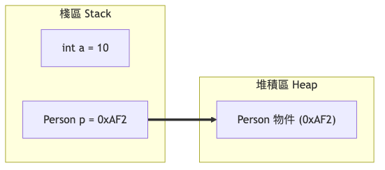
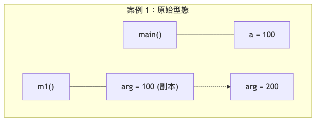
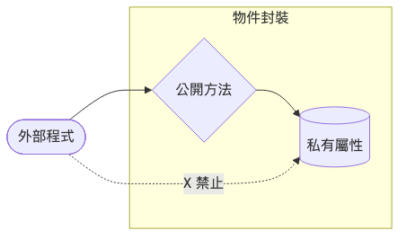
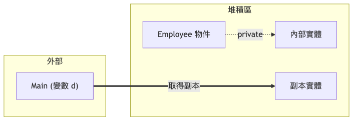
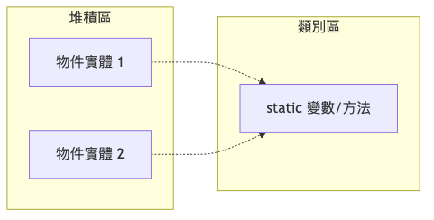

# Ch01: 基礎物件設計

### 物件導向程式設計 (OOP) 基礎

講師: [薛念林]
日期: 2026-03-04

---

## 學習目標

1. 了解物件與類別的基本概念。
2. 掌握 Java 類別的定義與物件實作。
3. 理解方法、參數傳遞（值傳遞 vs 參考傳遞）。
4. 掌握封裝（Encapsulation）原則與存取控制。
5. 學習建構子、靜態成員及物件間的關係。
6. 認識 Java 泛型（Generics）的基礎應用。

---

## 1.1 物件與類別的基本概念

### 什麼是物件 (Object)？
- 具有 **屬性 (Attributes)** 與 **行為 (Behaviors)** 的實體。
- 例如：「一台汽車」
  - 屬性：顏色、型號、速度。
  - 行為：加速、剎車。

### 什麼是類別 (Class)？
- 物件的 **藍圖 (Blueprint)** 或模板。
- 定義了所有同類物件應該具備的屬性與行為。

---

### 📌 類別 vs. 物件

|      | 類別 (Class)                      | 物件 (Object)                                |
| ---- | ---------------------------------- | --------------------------------------------- |
| 定義 | 抽象概念，描述結構與行為           | 具體的實例，由類別建立                        |
| 作用 | 設計藍圖 (Blueprint)              | 實際應用 (Instance)                          |
| 範例 | `Car` 類別定義汽車特徵             | `myCar` 是 Toyota, 紅色的一個實體             |

---

### Java 中的類別與物件實作

```java
class Car {
    String brand; // 屬性
    String color; 
    
    Car(String brand, String color) { // 建構子
        this.brand = brand;
        this.color = color;
    }
    
    void displayInfo() { // 行為 (方法)
        System.out.println("這是一台 " + color + " 的 " + brand);
    }
}
```

---

### 資料型態：原生型態 vs. 類別型態

- **原生型態 (Primitive Types)**:
  - `int`, `double`, `boolean`, `char` ...
  - 直接儲存數值，存放在 **Stack**。
- **類別型態 (Reference Types)**:
  - 物件、陣列、自訂類別。
  - 變數儲存的是 **參考 (位址)**，實體存放在 **Heap**。

---

### 記憶體模型 (Memory Model)



---

---

### ❓ 互動問題 1.1

**關於物件和類別，下列敘述何者正確？**

A) 物件是類別的模板，而類別是物件的實例
B) 類別可以擁有多個物件，但每個物件只能屬於一個類別
C) 物件可以修改類別的定義
D) Java 物件必須在定義類別時就創建

---

### 💡 解答 1.1

**答案：B**

- 類別就像印章的圖案（藍圖），物件就像印出來的圖案（實體）。
- 一個印章（類別）可以印出很多個圖案（物件）。

---

## 1.2 類別與物件之實作

### 類別的成員
- **屬性 (Fields)**：儲存資料。
- **建構子 (Constructor)**：初始化物件。
- **方法 (Methods)**：定義行為。

### `this` 關鍵字
- 指向「當前物件」的實例。
- 常用於區分 **成員變數** 與 **參數**。

---

### 存取修飾子 (Access Modifiers)

| 修飾子    | 同類別 | 同 package | 子類別 | 其他類別 |
| --------- | ------ | ---------- | ------ | -------- |
| private   | ✅      | ❌          | ❌      | ❌        |
| default   | ✅      | ✅          | ❌      | ❌        |
| protected | ✅      | ✅          | ✅      | ❌        |
| public    | ✅      | ✅          | ✅      | ✅        |

---

### ❓ 互動問題 1.2

**`static` 變數的特性是什麼？**

A) 每個物件都會有自己獨立的 `static` 變數
B) `static` 變數屬於整個類別，而不是某個特定的物件
C) `static` 變數必須在建立物件時初始化
D) `static` 變數無法被修改

---

### 💡 解答 1.2

**答案：B**

- `static` 成員（變數或方法）是由所有該類別的物件 **共享** 的。
- 它可以直接透過 `類別名稱.變數名` 來存取。

---

## 1.3 方法與參數

### 方法的基本結構
```java
修飾詞 回傳型別 方法名稱(參數列表) {
    // 程式碼
    return 回傳值;
}
```

### 傳參機制：值傳遞 (Pass by Value)
- Java **永遠** 是值傳遞。
- **原生型態**：傳遞數值的副本（修改不影響外部）。
- **類別型態**：傳遞「位址」的副本（修改物件內容會影響外部）。

---

### 傳遞機制示意圖



---

---

### 方法重載 (Method Overloading)
- **同名方法**，但 **參數列表不同** (數量或型別)。
- 注意：僅回傳型別不同不構成重載！

```java
int add(int a, int b) { ... }
double add(double a, double b) { ... } // OK
String add(int a, int b) { ... } // Error: 只有回傳型別不同
```

---

### ❓ 互動問題 1.3

**當你將一個物件變數傳入方法時，為什麼在方法內修改物件屬性會影響到外部？**

A) 因為 Java 是 Pass by Reference
B) 因為傳入的是該物件的一個「位址副本」，兩者指向同一個 Heap 空間
C) 因為物件是儲存在 Stack 中的
D) 因為方法內部的變數是靜態的

---

### 💡 解答 1.3

**答案：B**

- 雖然傳遞的是副本（值傳遞），但這個「值」剛好是物件的 **記憶體位址**。
- 因此，方法內的操作會作用在同一個實體物件上。

---

## 1.4 封裝與存取控制

### 封裝 (Encapsulation) 的核心
- **隱藏內部細節**，提供 **公開介面**。
- 屬性通常設為 `private`。
- 提供 `public` 的 **Getter** 與 **Setter**。

### 好處
- 防止不當資料（如年齡設為負數）。
- 降低模組間的耦合度。

---

---

### 隱私洩漏 (Privacy Leak)
- **警告**：如果 Getter 直接回傳一個 **可變物件 (Mutable Object)** 的參考，外部就能繞過 Setter 直接修改內部狀態。
- **解決方案**：
  - 返回 **防禦性複製 (Defensive Copy)**。
  - 使用 **不可變物件 (Immutable Object)**，如 `String`。

---

### 防禦性複製 (Defensive Copy)



---

---

### ❓ 互動問題 1.4

**為了避免「隱私洩漏 (Privacy Leak)」，當屬性是 `Date` 物件時，Getter 應該如何撰寫？**

A) `return this.date;`
B) `return new Date(this.date.getTime());`
C) `return (Object)this.date;`
D) `return null;`

---

### 💡 解答 1.4

**答案：B**

- 使用 `new Date(...)` 建立一個內容相同的「新物件」並回傳。
- 這樣外部修改回傳的物件時，不會影響到類別內部的原始資料。

---

## 1.5 建構子與物件初始化

### 建構子的特性
- 名稱與類別名稱完全相同。
- 沒有回傳型別（連 `void` 都沒有）。
- 用於初始化物件狀態。

### 建構子多載與 `this()`
- 可以在一個建構子內使用 `this(...)` 呼叫同類別的另一個建構子。
- 必須是該建構子的 **第一行**。

---

### 複製建構子 (Copy Constructor)
- 接受一個同型態的物件作為參數。
- 用於建立一個與原物件內容相同的獨立副本。
- **深複製 (Deep Copy)** vs. **淺複製 (Shallow Copy)**。

---

## 1.6 靜態成員與類別方法

### `static` 關鍵字
- **屬於類別**，而不屬於特定物件。
- **所有物件共享** 同一份記憶體空間。

---

### 靜態成員記憶體配置



---

### 靜態方法 (Static Methods)
- 直接透過 `類別名稱.方法()` 呼叫。
- **限制**：
  - 不能存取非靜態成員 (Instance members)。
  - 不能使用 `this` 關鍵字。

---

### 工具類別範例：`Math`
- `Math.sqrt(16.0)` // 計算平方根
- `Math.pow(2, 3)`  // 2 的 3 次方
- `Math.random()`   // 0.0 ~ 1.0 隨機數
- 這些方法都是 `static`，不需要 `new Math()`。

---

### ❓ 互動問題 1.6

**為什麼「靜態方法」不能直接呼叫「物件方法 (Instance Method)」？**

A) 因為靜態方法比較慢
B) 因為物件方法可能有副作用
C) 因為靜態方法在類別載入時就存在，而物件方法必須先有 `new` 出來的物件才能存在
D) 因為 Java 規格書禁止

---

### 💡 解答 1.6

**答案：C**

- 靜態成員存在時，電腦可能還沒有建立任何物件。
- 所以靜態方法不知道要對「哪一個」物件的屬性或方法進行操作。

---

## 1.7 物件之間的關係

### 1. 關聯 (Association)
- 物件之間「互相認識」或互動。
- 例如：老師與學生。

### 2. 聚合 (Aggregation) - "Has-a"
- 弱擁有關係，部分 **可以脫離** 整體獨立存在。
- 例如：系所與名教授。

### 3. 組合 (Composition) - "Part-of"
- 強擁有關係，部分 **不能脫離** 整體獨立存在。
- 例如：房子與房間。

---

### 物件關係圖示

| 關係類型 | 描述 | 範例 |
| :--- | :--- | :--- |
| **關聯 (Association)** | 雙方互相認識 | `Student` <--> `Teacher` |
| **聚合 (Aggregation)** | 弱擁有，部分可獨立存在 | `Dept` o-- `Professor` |
| **組合 (Composition)** | 強擁有，生命週期一致 | `House` *-- `Room` |

---

---

### ❓ 互動問題 1.7

**下列哪一項最符合「組合 (Composition)」的特性？**

A) 一個課程擁有多位老師，老師可獨立存在
B) 一台電腦由組件構成，當電腦銷毀時，內部組件實體也隨之消亡 (生命週期一致)
C) 兩個應用程式透過 API 溝通
D) 老師與學生互相知道對方的名字

---

### 💡 解答 1.7

**答案：B**

- 組合強調「生命週期一致性」。
- 在 Java 實作中，通常在「整體」的建構子內 `new` 出「部分」物件。

---

## 1.8 Java 泛型 (Generics)

### 為什麼需要泛型？
- **型別安全 (Type Safety)**：編譯時期就檢查型別錯誤。
- **消除類型轉換 (Eliminate Casting)**：不需要寫 `(String)list.get(0)`。
- **程式碼重用**：一個類別處理多種型別。

### 語法範例
```java
ArrayList<String> list = new ArrayList<>();
list.add("Hello");
String s = list.get(0); // 不需要強制轉型
```

---

### 泛型與集合 (Collections)
| 集合類別 | 描述 |
| --- | --- |
| `ArrayList<T>` | 動態陣列 |
| `HashMap<K, V>` | 鍵值對 (Key-Value) |
| `HashSet<T>` | 不重複集合 |

### 型別擦除 (Type Erasure)
- 泛型資訊僅存在於 **編譯時期**。
- 運行時會被「擦除」為 `Object`，以相容舊版 Java。

---

### ❓ 互動問題 1.8

**下列哪一種泛型宣告是「非法」的？**

A) `ArrayList<String> list`
B) `ArrayList<int> list`
C) `HashMap<String, Integer> map`
D) `Box<Object> box`

---

### 💡 解答 1.8

**答案：B**

- 泛型 **不支持原生型態 (Primitive Types)**。
- 必須使用對應的 **包裝類別 (Wrapper Class)**，如 `Integer` 代替 `int`。

---

## 1.9 命名慣例、控制結構與 I/O

### 命名慣例 (Naming Convention)
- **類別**：PascalCase (如 `HelloWorld`)
- **方法/變數**：camelCase (如 `calculateSum`)
- **常數**：UPPER_CASE (如 `PI`)

### 輸入與輸出
- **輸出**：`System.out.println()`
- **輸入**：`Scanner sc = new Scanner(System.in);`

---

### ❓ 互動問題 1.9

**關於 `while` 迴圈與 `do-while` 迴圈的主要差異，下列何者正確？**

A) `while` 保證至少執行一次
B) `do-while` 保證至少執行一次
C) `while` 不能用 `break`
D) 兩者完全相同

---

### 💡 解答 1.9

**答案：B**

- `do-while` 是「先做再算」，所以不管條件如何，一定會先執行第一次程式碼區塊。

---

## 1.10 開發環境設定

### 下載建議
- 強烈建議使用 **Java 21 (LTS)** 或 **Java 17 (LTS)**。
- IDE 推薦：**IntelliJ IDEA** (提供最佳的 Java 開發體驗)。

### Maven 簡介
- 專案管理工具，負責：
  - 構建管理。
  - **依賴管理** (自動下載需要的庫)。
  - `pom.xml` 是 Maven 的心臟。

---

# 課程總結

- 物件是實體，類別是藍圖。
- 封裝保護資料，隱藏實作。
- 靜態成員屬於類別。
- 泛型提升型別安全性。
- 好的命名慣例是專業程式碼的第一步。

---

## **Q & A**

感謝大家的參與！
如果有任何問題，歡迎提問。
