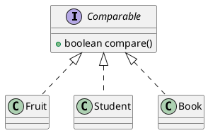
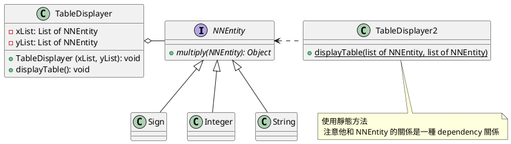
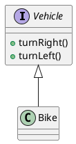

###### tags: `OOSE`

# Ch02 物件導向設計

@nlhsueh 

## 2.1 虛虛實實：抽象與繼承

:::success
* 何謂繼承，如何應用？
* 繼承時子類別該如何設計建構子？
* 父類別與子類別的宣告與生成該注意什麼？型態的轉換規則為何？
* 子類別該如何保存父類別既有功能下延伸功能？
* 抽象類別、抽象方法的意義為何？使用時機為何？
:::

### 2.1.1 類別繼承

當類別 B 繼承  類別 A 時，表示 B 具備 A 的特性，不用再重複的寫一次，並且可以擴充自己的特性。

```java=
class A {
  public void m1() {...}
}

class B extends A { //類別繼承
  public void m2() {  //新增方法
    ...
  }
}

B b = new B();
b.m1(); // => ok
b.m2(); // => ok
```

A 稱為父類別，B 稱為子類別

:::info
子類別的物件生成時，其建構子會呼叫父類別建構子。
:::


```java=
class Vehicle {
  int speed;
  public Vehicle(int speed) {
     this.speed = speed;
  }   
}

class Bike extends Vehicle {
  int seatHeight;

  public Bike(int seatHeight) {
    super();
    this.seatHeight = seatHeight;
  }

  void setHeight(int) {
    this.seatHeight = seatHeight;
  }
}
```

:question: 上述程式會產生編譯錯誤，為什麼？

:::spoiler 提示
父類別並沒有不帶參數的建構子。需改為：
```java
  public Bike(int speed, int seatHeight) {
    super(speed);
    this.seatHeight = seatHeight;
  }
```
:::


### 2.1.2 方法覆蓋

```java=
class A {
  public void m1() { print A }
}

class B extends A {
  public void m1() {  //覆蓋方法
      print B
  }
  public void m2() {  //新增方法
    ...
  }
}
```

執行：
```java=
A a = new A();
a.m1(); // => print A

B b = new B();
b.m1(); // => print B
```


### 2.1.3 型態轉換

不要讓 compiler 不開心。假設 Engineer 是 Person 的子類別:

```java=
class Person {}
class Engineer extends Person {}

Person a = new Person(); //當然 ok
Person a = (Person) new Engineer(); //ok, upcasting
Person a = new Engineer(); //ok, upcasting, (Person) 可以省略

Engineer b = new Engineer(); //當然 ok
Engineer b = new Person(); //compiler error
Engineer b = (Engineer) new Person(); //downcasting, runtime error

Person a = new Engineer();
Engineer b = (Engineer)a; //downcasting, compiler, runtime ok
```


Engineer 繼承 Person 後具備 Person 的特性，所以 Engineer 可以做 Person 所有的事，反之 Person 無法做所有 Engineer 的事。

:::info
B b = new A()：把一個 弱A 當成一個 強B，產生編譯錯誤。
:::

例子：

```java=
Cat mao = new Cat();
Animal mimi = mao; //upcasting (把一個比較低階的物件給比較高階的類別）
//給 mao 多取一個名字 mimi, 並告訴大家 mimi 是一個動物

Cat jaja = mimi; // 編譯錯誤
Cat jaja = (Cat) mimi; //downcasting
//mimi 又多了一個名字 jaja, 並且告訴大家 jaja 是一支貓
```

### 2.1.4 擴充的應用範例


`StringTokenizer` 可以把一串字串做解析：

* `StringTokenizer(String a)` 生成物件時帶入所要解析的字。
* `nextToken()` 會傳回下一個字。
* `hasMoreToken()` 判斷是否還有未解析的字，true 時表示還有。false 表示已經到最後一個字了。


> Extend StringTokenizer to EnhancedStringTokenizer

* 進階字串處理器 `EnhancedStringTokenizer`。除了可以做字串的解析以外，還可以回傳目前解析的字串集（以陣列的方式回傳）。

```java=
import java.util.StringTokenizer;

public class EnhancedStringTokenizer extends StringTokenizer {
    private String[] a;
    private int count;

    // enhance the constructor
    public EnhancedStringTokenizer(String theString ) {
        super(theString);
        a = new String[countTokens( )];
        count = 0;
    }

    // enhance nextToken
    public String nextToken( )    {
        String token = super.nextToken( );
        // 以下是添增的功能
        a[count++] = token;
        return token;
    }

    // new method
    public String[] tokensSoFar( ) {
        String[] arrayToReturn = new String[count];
        for (int i = 0; i < count; i++)
            arrayToReturn[i] = a[i];
        return arrayToReturn;
    }
}

class Main {
   public static void main(String args[]) {
      String s = "I love apple";
      EnhancedStringTokenizer tokenizer = new EnhancedStringTokenizer(s);
      while ( tokenizer.hasMoreTokens()) { // call parent's function
         System.out.println(tokenizer.nextToken()); // call child's function
         printSoFar(tokenizer.tokensSoFar()); // call child's (new defined) function
      }   
   }
   static void printSoFar(String[] ss) {
      for (String s: ss) System.out.println(s);
   }
}
```

### 2.1.5 抽象方法與類別

抽象類別無法產生物件，但可被繼承，例如交通工具 Vehicle 可分為 Bike 和 Car, 是一種完全分類，不會有物件從 Vehicle 產生出來。

抽象方法 宣告方法的的介面（參數及回傳型態），但不具備實作（implementation）。例如所有的交通工具都會向左轉，向右轉，但怎麼做則由子類別自己定義。

```java=
abstract class Vehicle { //抽象類別
   private String ID;
   public abstract void turnLeft(); //抽象方法
   public abstract void turnRight(); //抽象方法
   public String getID() { //具體方法
      return ID;
   }   
}

class Bike extends Vehicle {
   public void turnLeft() {
       ... //腳踏車的左轉方法
   }
   public void turnRight() {
       ... //腳踏車的右轉方法
   }
}

class Car extends Vehicle {
   public void turnLeft() {
       ... //汽車的左轉方法
   }
   public void turnRight() {
       ... //汽車的右轉方法
   }
   public void backward() { //new method
       ... //汽車倒車的方法
   }
}
```

:::info
抽象類別是一個半成品，等待子類別去完成。
:::

### 2.1.test 觀念測驗

#### test.2.1.01
**關於 Java 的類別繼承，以下哪一項是正確的？**  
   A) Java 支援多重繼承（multiple inheritance）  
   B) `final` 關鍵字可用來防止類別被繼承  
   C) `private` 方法可以被子類別覆寫（override）  
   D) 抽象類別（abstract class）無法包含已實作的方法  

#### test.2.1.02
**以下關於方法覆蓋（Method Overriding）說法正確的是？**  
   A) 子類別的覆蓋方法可以擴大訪問權限，例如從 `protected` 改為 `public`  
   B) `@Override` 註解是強制性的，否則無法覆蓋  
   C) 子類別的覆蓋方法可以減小訪問權限，例如從 `public` 改為 `private`  
   D) 父類別的方法若標記為 `static`，子類別仍然可以覆蓋  

#### test.2.1.03
**以下哪個 Java 程式碼片段會產生編譯錯誤？**  
   ```java
   class Animal {
       public void speak() {
           System.out.println("Animal speaks");
       }
   }

   class Dog extends Animal {
       private void speak() {  // (X)
           System.out.println("Dog barks");
       }
   }
   ```
   為什麼？  
   A) `speak()` 方法的返回類型不同  
   B) 子類別的 `speak()` 方法無法縮小訪問權限  
   C) `speak()` 方法必須標記為 `static`  
   D) `Dog` 不能繼承 `Animal`  


#### test.2.1.04
**型態轉換（Type Casting）時，何時會發生 `ClassCastException`？**  
   A) 向下轉型（downcasting）時，若物件實際類型與目標類型不匹配  
   B) 向上轉型（upcasting）時，若目標類型不匹配  
   C) 任何時候執行 `instanceof` 之前  
   D) 只有當類別包含 `static` 方法時  


#### test.2.1.05
**關於 Java 的多態性（Polymorphism），以下說法正確的是？**  
   A) 只有介面（interface）才能實現多態性  
   B) 方法超載（method overloading）與方法覆蓋（method overriding）都能實現多態性  
   C) 多態性只適用於靜態方法（static methods）  
   D) `final` 類別可以被繼承但不能被實例化  

---

參考答案：B, A, B, A, B  

---

#### test.2.1.05
**Java 中，以下何者正確：**
1. 抽象類別內至少有一抽象方法 
2. 抽象類別多個抽象方法，也可以沒有
3. 抽象類別可以有多個個具體方法 ，也可以沒有
4. 具體類別不可以有任何抽象方法
5. 抽象類別不能直接生成物件; 具體類別可以

#### test.2.1.06
**B 是 A 的子類別，下列何者正確？**

```java
1. public B do1() { return new A(); } 
2. public String m1(int i) {return "1"; } 
3. public private String m2(String s1, String s2) {return s2;} 
4. public A do2() { return new B(); } 
```

### 2.1.lab 練習

#### lab2.1.01 方法覆蓋
**問題描述：**  
請建立一個 `Shape` 類別，並讓 `Rectangle` 類別繼承 `Shape`，然後覆寫 `area()` 方法，使其返回矩形的面積。

**範例輸入輸出：**
```java
Shape s = new Rectangle(5, 10);
System.out.println(s.area());  // 輸出: 50.0
```

---

#### lab2.1.02 型態轉換
**問題描述：**  
請建立一個 `Animal` 父類別，以及 `Dog` 和 `Cat` 子類別。  
1. 建立一個 `speak()` 方法，並讓 `Dog` 和 `Cat` 覆寫該方法。  
2. 使用向上轉型（upcasting）與向下轉型（downcasting）來呼叫子類別的方法。  
3. 使用 `instanceof` 確保轉型安全。  

**範例輸入輸出：**
```java
Animal a = new Dog();
a.speak();  // 輸出: "Dog barks"

if (a instanceof Dog) {
    Dog d = (Dog) a;
    d.speak();  // 輸出: "Dog barks"
}
```

---

#### lab2.1.03 覆寫 `toString()`
**問題描述：**  
請建立 `Person` 類別，包含 `name` 和 `age` 屬性，並覆寫 `toString()` 方法，使其輸出 `"Name: XXX, Age: YYY"`。  

**範例輸入輸出：**
```java
Person p = new Person("Alice", 25);
System.out.println(p);  
// 輸出: "Name: Alice, Age: 25"
```

這些題目涵蓋了**類別繼承、方法覆蓋、型態轉換**的核心概念，適合作為學習 Java 物件導向的練習！ 🚀

#### lab2.1.04 Fruit parser
擴充 StringTokenizer 為 FruitParser，字串中若有水果名稱，可以透過固定的介面取得水果的名稱。請應用 StringTokenizer 既有的方法 (hasMoreToken(), nextToken() 等方法)。

```java
public class FruitParser extends StringTokenizer {
    String[] fruit_set = { "apple", "avocado", "banana", "cherry", "coconut", "jujube", "durian", "grape", "grapefruit",
			"guava", "lemon", "lichee", "orange", "kiwi" };
	
    public String[] getFruits() {
        // ?
    }

    public static void main(String[] args) {
        String s = "I like apple, banana, and orange. Marry like kiwi";
        FruitParser f = new FruitParser(s);
        String[] fruits = f.getFruits();		
    }
}
```
:::


## 2.2 一法多形：多型

一個方法（method）可以有很多的形式/實作方法。

```java=
class A {
  void m1() {
      print A;
  }
}

class B extends A {
  void m1() {
      print B;
  }
}

class Client {
  void op1(A a) {
    a.m1();
  }
}
```


對 Client 的 op1 而言，a 可能是一個 A 的物件或是 B 的物件，取決於 runtime 時帶進的物件。不要以為 a 的 type 是 A，就認為它會執行 print A。runtime 時才做 binding, 稱之為 **dynamic binding**。

```java=
Client c = new C();
c.op1(new A()) => print A
c.op1(new B()) => print B
```

汽車的例子：
```java=
class VehicleController {
  void manage(Vehicle v) {
     v.turnLeft();
  }   
}
``` 

### 2.2.test 觀念測驗

#### test2.2.01 

以下會印出什麼   
```java= 
public class Game {
  public static void main(String[] args) {
    ChessBoard cb = new LongChessBoard();
    cb.show();
  }
}
class ChessBoard{
  public void show() { System.out.println ("一般象棋");}
}
class LongChessBoard extends ChessBoard{
  private void show() { System.out.println("長棋");}
}
```

#### test2.2.02
**以下會出現什麼訊息？**
```java=
class A {
   public A() {
      System.out.println("hi");
   }
}
class B extends A {
}

public class Main {
     public static void main(String[] arg) {
          B b = new B();
     }
}
```
:::spoiler 提示
子類別會自動的呼叫父類別的預設建構子。所以會印出 hi
:::

#### test2.2.03
**回答以下問題：**
```java
class A {
    int max(int x, int y) {
      if (x>y) return x;
      else return y;
   }
}
class B extends A {
    int max(int x, int y) {
      return super.max(y, x) - 10;
    }
}
A a = new B();
a.max(100,20)=?
```

#### test2.2.04
**回答以下問題**

我們宣告 print(Object) 於下方。以下哪些不會造成 compiler 錯誤 
```java
public static void print(Object x) {...}
```
1. print(new Object());
2. print(new Employee());
3. print(12);
4. print("abc");
5. print(new Integer(12));	

### 2.2.lab 練習

#### lab2.2.01
People 內部宣告一個 `boolean overWeight()` 的抽象方法。People 的建構子會帶入身高體重。Student 和 Athlete 都是 People 的子類別，前者的 bmi > 24 時過重，後者超過 22 時過重。請實作之。


## 2.3 無色無相：介面

介面定義一個規格，一個多個物件之間彼此溝通的規格，但他僅定義規格，並不描述其實作方法。Java 中介面的宣告如下：

```java=
interface E {
   public void m1();
   public void m2();
}
```

m1() m2() 都是抽象的，但我們不需要寫 abstract。請注意介面內只宣告它所提供的方法，及這些方法的使用方式(signature，即該方法的參數型態即傳回型態)。所有的方法內皆沒有實作。當一類別實作一介面時，所使用的關鍵字是 `implements`。

當一個類別實踐一個介面，表示它必須實踐這個規格。D 必定要實作 m1() 與 m2()，因為這兩個方法都宣告在介面 E 中。

```java=
public class D implements E {
  public void m1() {
    ... //實作
  }
  public void m2() {
    ... //實作
  }
}

class Client { //Client 是介面的使用者   
   void m (E e} {
       e.m1();
   }   
}
```


:::info
* 能做什麼，是類別
* 該做什麼，是介面
* 能做什麼，又該做什麼，是抽象類別
:::

```plantuml
interface Vehicle {
    +left() {abstract}
    +right() {abstract}
}

class Car implements Vehicle {
    +left()
    +right()    
}
class Bike implements Vehicle {
    +left()
    +right()    
}
```

```plantuml
abstract Vehicle {
    countWheel
    color
    ---
    +left() {abstract}
    +right() {abstract}
}

class Car extends Vehicle {
    +left()
    +right()    
}
class Bike extends Vehicle {
    +left()
    +right()    
}

```

### 介面實踐與使用

:::info
* 一個好的建築，需要有一個人會蓋，一個人會欣賞。
* 一個介面，需要有類別去實作，也需要有 client 去使用。
:::


只要能實踐 E 的物件， m1() 都可以呼叫使用。

### 繼承和實作的異同

* 兩者都具備多型，也就是說，當 `class C extends D implements E`, 則 `c instanceof D`, `c instanceof E` 都是 true;
* extends 享受到 code reuse 的好處，但 implements 沒有（因為 interface 內沒有程式碼），它只有被規範**要去履行介面所定義的功能**。


:::info
他一生下來，就背負著「皇帝」的使命，對它來說，是一種責任，一種規範。從這個觀點來看，皇命是一個介面（規格）實踐。
:::

:::info
他一生下來，就擁有龐大的繼承資源，即使什麼都不會做，很多是還是順理成章的完成了。從這個觀點來看，皇命是一個資源的繼承。
:::


### 2.3.1 多重繼承

Java 所謂的多重繼承是指多重的介面繼承。一個類別可以實作很多的介面，但只能繼承一個類別。類別 G 繼承類別 C 並實作介面 E 與 F 是被允許的。

```java=
public class G extends C implements E, F {
  public void op1() {
     ...
  }
  public void op2() {
     ...
  }
  public void op4() {
     ...
  }
}
```

請注意 C, E, F 中同時都定義了方法 op2()，但這並不會造成任何的混淆，因為 op2() 都是抽象的，並沒有任何的實作。如果讓 G 同時繼承 C 與 A 則會編譯失敗，因為Java並不允許同時繼承兩個類別。

```java=
  interface Vehicle {
     // 右轉最大角度常數
     public final static int MAX_TURN_ANGLE = 60;
     
     // 一定要能右轉，左轉
     public void turnRight();
     public void turnLeft(); 
  }
```


### 2.3.2 介面的應用：best

假設我們要寫一個副程式來找到三個整數中最大的一個，相信這很簡單：

```java=
   public int best(int x, int y, int z) {
      if (x > y) {
          if (x > z) ? return x: return z;
      }
      else if (y > z ) {
         return y;
      }
      else return z;
   }         
```

如果要比較的不是一般數字呢？

:::info
一般化：整數比較 $\Longrightarrow$ 物件比較
:::

#### Comparable 介面

任何物品只要符合 `Comparable` 的介面都是可以比較的。針對 Comparable 我們設計一個 `best(x, y, z)` 的方法來比較三個物品，該方法將回傳最「好」的物件。

```java=
interface Comparable {
    public boolean betterThan(Comparable x);
}

class Util {
    public static Object best(Comparable x, Comparable y, Comparable z) {
        if (x.betterThan(y)) {
            if (x.betterThan(z))
                return x;
            else
                return z;
        } else if (y.betterThan(z)) {
            return y;
        } else
            return z;
    }
}
```

如果我想比較水果，我該如何修改以下的 Fruit 類別？我們只要定義什麼是「好水果」即可，下面的例子是以 sweetDegree (甜度) 作為好水果的標準。

```java
class Fruit implements Comparable {
    String name;
    int price;
    int sweetDegree;
    int waterDegree;

    public static void main(String args[]) {
        Fruit f1 = new Fruit(12), f2 = new Fruit(23), f3 = new Fruit(9);
        Fruit best = (Fruit) Util.best(f1, f2, f3);
    }

    public boolean betterThan(Comparable x) {
        if (x instanceof Fruit)
            if (this.sweetDegree > ((Fruit) x).sweetDegree)
                return true;
            else
                return false;
        else {
            System.out.println("錯誤的比較");
            return false;
        }
    }

    public Fruit(int sweetDegree) {
        this.sweetDegree = sweetDegree;
    }
} 
```



設計一個 Student 的類別，也透過 `Comparable` 介面、`Util.best` 來比較學生（以學生的成績作為比較的基準）。

:::warning
Student 和 Fruit 都實踐了 `Comparable`，那 Student 可以和 Fruit 相互比較嗎？如果不能，上述的程式需要如何修改？
:::

:::warning
上述的程式的優點為何？從 reuse 的角度來看，我們 reuse 了什麼？
:::

:::success
:thinking_face: Collections.sort()

Study [This example](https://medium.com/@thecodebean/java-object-sorting-explained-using-comparable-and-comparator-03b93b988f75)

Think: how the Java API design the framework?
:::

### 2.3.3 介面內的常數

Interface 可以宣告常數
```java=
interface Vehicle {
    //右轉最大角度
     public final static int MAX_TURN_ANGLE = 60;
     public void turnRight();
}
```

只能宣告常數，不能宣告 instance variable。


### 2.3.4 抽象的應用：NNEntity

大家都寫過 99 乘法表:

```
    1   2   3   4   5   6   7   8   9
    ==================================
1   1   2   3   4   5   6   7   8   9
2   2   4   6   8   10  12  14  16  18
3   3   6   9   12  15  18  21  24  27
4   4   8   12  16  20  24  28  32  36
5   5   10  15  20  25  30  35  40  45
6   6   12  18  24  30  36  42  48  54
7   7   14  21  28  35  42  49  56  63
8   8   16  24  32  40  48  56  64  72
9   9   18  27  36  45  54  63  72  81
```

我們現在把這個程式「一般化」（generalization）-- 變成 NN 乘法表。這很很簡單，參數變化就可以做到。

```java=
public void multiply(int x, int y) {
   ...
}   
```

ps. NN 只是取名，上例我們的變數 xy, 表示我們可以做一個 1..x, 1..y 的乘法表。例如 34 乘法表：

```
    1   2   3  
    ==========
1   1   2   3 
2   2   4   6 
3   3   6   9 
4   4   8   12
```


那我們再把這個問題更一般化些：如果「乘」的主體不限定是整數呢？例如字串相乘，什麼是字串相乘？我們需要依據我們的需求來做定義：在此定義為「字串相連」。也可以「顏色相乘」，其效果就是顏色相混。也可以是「化學物質」想混合。如何進行這個設計讓重用性高一點？

```
字串相'乘'
    ab     xy      pq  
    ==================
ab  abab   abxy   abpq 
xy  xyab   xyxy   xypq
pq  pqab   pqxy   pqpq
```


:::info
一般化：9\*9 $\Longrightarrow$ N\*N $\Longrightarrow$ 物件 **R** 物件
:::

:::info
以下是局部的程式碼，該如何設計 NNEntity? 整數 (NNInteger)、字串 (NNString)、顏色 (NNColor) 又該如何設計？
:::

顏色的混和：

```
顏色相'乘'
     紅色    綠色   黃色
     ==================
紅色  紅色    棕色   橙色
綠色  棕色    綠色   黃綠
黃色  橙色    黃綠   黃色
```


#### 一個抽象的 NNEntity，都會「乘」
```java
abstract class NNEntity {
    public abstract NNEntity multiply(NNEntity otherone);
}
```

#### 整數的「乘」
```java
class NNInteger extends NNEntity {
	private int number;

	public NNInteger(int number) {
		this.number = number;
	}

	public NNInteger(NNInteger copy) {
		this(copy.number);
	}

	// 數字相乘
	public NNEntity multiply(NNEntity otherone) {
		if (otherone == null) {
			return null;
		} else if (getClass() != otherone.getClass()) {
			return null;
		} else {
			NNInteger otherone2 = (NNInteger) otherone;
			return new NNInteger(this.number * otherone2.number);
		}
	}

	public String toString() {
		return Integer.toString(number);
	}
}
```

#### 字串的「乘」

```java
class NNString extends NNEntity {
	private String words;

	public NNString(String words) {
		this.words = words;
	}

	public NNString(NNString copy) {
		this(copy.words);
	}

	// 字串相連
	public NNEntity multiply(NNEntity otherone) {
		if (otherone == null) {
			return null;
		} else if (getClass() != otherone.getClass()) {
			return null;
		} else {
			NNString otherone2 = (NNString) otherone;
			return new NNString(this.words + otherone2.words);
		}
	}

	public String toString() {
		return words;
	}
}
```

#### 不論是哪一種型態，TableDisplayer 都一樣

```java=
class TableDisplayer {
    public static void multiplyAndShow(NNEntity[] xList, NNEntity[] yList) {
        /* Multiply */
        NNEntity[][] table = new NNEntity[yList.length][xList.length];
        for (int i = 0; i < yList.length; i++) {
            for (int j = 0; j < xList.length; j++) {
                table[i][j] = xList[j].multiply(yList[i]);
            }
        }
        /* Show */
        System.out.printf("%7s", "");
        for (int i = 0; i < xList.length; i++) {
            System.out.printf("%7s", xList[i]);
        }
        System.out.println();
        for (int i = 0; i < yList.length; i++) {
            System.out.printf("%7s", yList[i]);
            for (int j = 0; j < xList.length; j++) {
                System.out.printf("%7s", table[i][j]);
            }
            System.out.println();
        }
        System.out.println();
    }
}
```
#### 主程式
```java=
package basic;
/*
 * This is an ERROR code, for students to fix
 */
public class NNMultiplication {
    public static void main(String[] args) {
        // 整數對整數
        NNEntity[] xListA = { new NNInteger(2), new NNInteger(3), new NNInteger(5), new NNInteger(6), new NNInteger(10) };
        NNEntity[] yListA = { new NNInteger(7), new NNInteger(2), 	new NNInteger(3), new NNInteger(4), new NNInteger(8) };
        TableDisplayer.multiplyAndShow(xListA, yListA);

        // 字串對字串        
        NNEntity[] xListB = { new NNString("Q"), new NNString("D"), new NNString("T"), new NNString("H"), new NNString("Z") };
        NNEntity[] yListB = { new NNString("Y"), new NNString("D"), new NNString("Z"), new NNString("V"), new NNString("B") };
        TableDisplayer.multiplyAndShow(xListB, yListB);

        // 顏色對顏色
        NNEntity[] xListC = { new NNColor("Red"), new NNColor("Red"), new NNColor("Red"), new NNColor("Green"), new NNColor("Blue") };
        NNEntity[] yListC = { new NNColor("Green"), new NNColor("Blue"), new NNColor("Red"), new NNColor("Blue"), new NNColor("Green") };
        TableDisplayer.multiplyAndShow(xListC, yListC);
    }
}
```

:::warning
這樣的程式重用了什麼？
:::

:::warning
上述程式 NNEntity 可否改為 interface? 請實做看看
:::


也試著說明 NNEntity 如何實踐物件特性：封裝、繼承、介面、多型。

### 2.3.test 觀念測驗

#### test2.3.01
設計以下問題：宣告一個 Moveable 的介面，應用在 Chess 系統。

#### test2.3.02

從以下項目比較 class, abstract class, interface：
* 可具備抽象方法
* 可具備 "非" 抽象方法
* 可生成物件
* 可具備實體變數
* 可具備常數
* 是一種型態

:::spoiler 提示
| -                    | class | abs class | interface |
| -------------------- | ----- | --------- | --------- |
| 可具備抽象方法       | x     | v         | v         |
| 可具備 "非" 抽象方法 | v     | v         | x         |
| 可生成物件           | v     | x         | x         |
| 可具備實體變數       | v     | v         | x         |
| 可具備常數           | v     | v         | v         |
| 是一種型態           | v     | v         | v         |
:::

#### test2.3.03
**回答以下問題**

介面會有實作者 (implementer) 和用戶 (client)。下面程式中，哪個是實作者？哪個是用戶?
```java
interface IA {
   void m1();
}
class A implements IA {}
class B {
   void m2(IA a) {
      a.m1();
   }
}
```

#### test2.3.04 

請改以 interface 的方式重新設計：A 不要直接對 B, 而是對 「會做 m1()」 的物件。

```java
 class A {
     void op1(B b) {
        ...
        b.m1();
     }
 }
 class B {
    public void m1() {
       ...
    }
 }
```

#### test2.3.05
**以下哪裡錯？**

下述程式為某系統的部分程式碼，是否會發生編譯錯誤？執行錯誤？

```java=
interface IA {
  void m1();
}

class B {
    void m1(IA a) {
      a.m1();
    }
}
```

#### test2.3.06
**以下程式有哪些錯誤？**

```java
interface IA {
    private int x = 100;
    int y;
    int z=100;
    public static final int P = 200;
    public void m1();
    
    protected void m2();
    int m3() {
      return 100;
    }

    void m4();
}

interface IB extends IA {
    void m5();
}

class B implements IA {
    public void m1() {}
    int m3() {}
}

class C implements IB {
    public void m5() {}
}

abstract class D implements IA {
    abstract public void m1();
    void m4() {} //注意沒有 public
}

class D {
   void m1() {
       System.out.println(IA.z + "");
   }

   void m2() {
       IA a = new B();
       a.m1();
   }

   void m3() {
       IA a = new IA();
       a.m1();
   }
}
```

**Hint:**
```java=
String s = super.nextToken();	
```    

### 2.3.lab 練習
#### lab2.3.01 SuperStringTokenizer

請寫一個 `SuperStringTokenizer`, 它除了可以解析字元以外,還會把 解析的字元轉成大寫回傳回來。
* 透過繼承 `SuperStringTokenzier` 繼承 `StringTokenizer` 來實作。(注意 `SuperStringTokenizer` 將 override 父類別的 nextToken()
* 透過委託 `SuperStringTokenizer` 將 **包含** `StringTokenizer`。你一樣要宣告一個 `nextToken()` 來傳回每一個大寫字元的 token。	


:::success
##### EX-lucky-number
請參考  NNEntity 的例子，製作一個星座速配幸運號碼表，例如 巨蟹座X雙子座 => 06220522 % 144 => 10 是此搭配的幸運號碼，其中0622是巨蟹的起始日，0522是雙子的起始日，% 表示取餘數。
* TableDisplay 可以用 System.out.print 來輸出此幸運號碼表; 但以 HTML table 的方式輸出更好。
:::

:::spoiler Hint

:::


## 2.3 Python 物件導向

### 2.3.1 繼承

* `class Engineer(Person)` 表示 Engineer 繼承了 Person
* `super().__init__()` 來呼叫父類別的建構子
* `@abstractmethod` 來表示抽象類別，要 import `abstractmethod`; 程式碼內為 `pass`
* 繼承 `ABC` 表示設計一個介面。ABC 為 `Abstract Base Class`

以 `Person` 為例，製作一個抽象類別，其下有 `Engineer` 及 `Manager` 兩個子類別，來說明繼承：


```python=
class Person:
    def __init__(self, name, age):
        self.name = name
        self.age = age

    def display(self):
        print(f"{self.name} is {self.age} years old.")

class Engineer(Person):
    def __init__(self, name, age, expertise):
        super().__init__(name, age)
        self.expertise = expertise
        self.projects = []

    def display(self):
        print(f"{self.name} is an engineer with expertise in {self.expertise} and is currently working on {len(self.projects)} projects.")
        super().display()

    def add_project(self, project):
        self.projects.append(project)

class Manager(Person):
    def __init__(self, name, age, department):
        super().__init__(name, age)
        self.department = department
        self.subordinates = []

    def display(self):
        print(f"{self.name} is a manager of the {self.department} department and has {len(self.subordinates)} subordinates.")
        super().display()

    def add_subordinate(self, subordinate):
        self.subordinates.append(subordinate)
```

用圖片更容易看得出關係：
```plantuml
class Person {
    name: String
    age: int
    + __init__()
    + display()
}

class Engineer extends Person {
    expertise: String
    + display()
    + add_project()
}

class Manager extends Person {
    department: String
    + display()
    + add_subordinate()
}
```

以下為呼叫端：
```python=
# 建立 Engineer 和 Manager 物件
engineer = Engineer("Alice", 30, "software development")
manager = Manager("Bob", 40, "marketing")

# 添加 Engineer 的專案
engineer.add_project("Project A")
engineer.add_project("Project B")

# 添加 Manager 的下屬
manager.add_subordinate("Tom")
manager.add_subordinate("Jerry")

# 呼叫 display 方法
engineer.display()  # Alice is an engineer with expertise in software development and is currently working on 2 projects. Alice is 30 years old.
manager.display()   # Bob is a manager of the marketing department and has 2 subordinates. Bob is 40 years old.
```


在這個範例中，我們將 Engineer 和 Manager 類別中新增了一些屬性和方法。在 Engineer 類別中，我們新增了一個 projects 屬性，它是一個列表，用於儲存工程師正在參與的專案。我們也新增了一個 `add_project()` 方法，用於向工程師的專案列表中添加新專案。在 Manager 類別中，我們新增了一個 subordinates 屬性，它是一個列表，用於儲存該經理的下屬。我們也新增了一個 `add_subordinate()` 方法，用於向經理的下屬列表中添加新下屬。


### 2.3.2 介面

Python 有介面（Interface）的概念，不過與 Java 不同，Python 的介面是一種純抽象的基礎類別（Abstract Base Class; `ABC`），並且不需要使用特定的關鍵字定義介面。

在 Python 中，您可以使用 abc 模組定義抽象基礎類別，並使用 @abstractmethod 裝飾器來標記抽象方法。以下是一個範例：

```python=
from abc import ABC, abstractmethod

class MyInterface(ABC):

    @abstractmethod
    def method1(self):
        pass

    @abstractmethod
    def method2(self, arg):
        pass
```

這裡定義了一個名為 MyInterface 的抽象基礎類別，並包含兩個抽象方法 method1 和 method2。請注意，這些方法沒有實際的實作，而是使用 pass 關鍵字表示這是一個空方法。

在您需要實現這個介面的類別中，需要繼承 MyInterface 並實現所有的抽象方法。如果某個類別沒有實現所有抽象方法，那麼它也會被視為抽象類別。

```python=
class MyClass(MyInterface):

    def method1(self):
        # 實現 method1 的程式碼

    def method2(self, arg):
        # 實現 method2 的程式碼
```

這裡定義了一個名為 MyClass 的類別，它繼承自 MyInterface，並實現了所有抽象方法。這樣 MyClass 就可以被視為一個實現了 MyInterface 的類別了。


以上面 Person 的例子來說，如果我們

```python=
from abc import ABC, abstractmethod

class Vehicle(ABC):
    @abstractmethod
    def turnRight(self):
        pass
    
    @abstractmethod
    def turnLeft(self):
        pass
    
```




### 2.3.lab 小節練習

:::success
:basketball: EX-male-female
* Person 有身高體重等資訊，有兩個子類別：Male and Female，其 BMI 計算方式都一樣，但高低標不同。請設計一個類別架構來檢查 Person 的健康狀況。
* 同上，設計一個 list 存放一群人的資訊，依據 BMI 由高至低進行排序，並且給予呈現出給予的健康建議。
:::

## 2.EX 綜合練習

### EX2.1
:::success
:basketball: EX-share-area
* 建立一個 `Shape` 的介面，裡面有 `getArea()` 來回傳面積
* 建立圓形 (`Circle`)、正方形(`Square`)、矩形(`Rectangle`)、三角形(`Triangle`)等圖形的類別，實作Shape
* 請以 Java 及 Python 完成此練習
:::

### EX2.2
:::success
:basketball: EX-compare-student
* 應用 `Comparable（內有 int compareTo(Comparable) 方法)` 介面來寫一個排序的程式，並且用來排序以下的物件。
	* 一個類別 Student, 裡面的屬性包含身高、體重、成績，如果 「身高+成績-體重」 比較較高，則較好。
	* 請以 selection sort 來完成此作業	
:::

### EX2.3
:::success
:basketball: :basketball: :basketball: EX-abstract-chess
* 考慮一個象棋翻棋遊戲，32 個棋子會隨機的落在 4*8的棋盤上。透過 Chess 的建構子產生這些棋子並隨機編排位置，再印出這些棋子的名字、位置
	* ChessGame
	    * void showAllChess(); 
	    * void generateChess();
	* Chess: 
	    * Chess(name, weight, side, loc); 
	    * String toString();	
* 同上， 
    * ChessGame 繼承一個抽象的 AbstractGame; AbstractGame 宣告若干抽象的方法：
        * setPlayers(Player, Player)
        * boolean gameOver()
        * boolean move(int location)
* 撰寫一個簡單版、非 GUI 介面的 Chess 系統。使用者可以在 console 介面輸入所要選擇的棋子的位置 (例如 A2, B3)，若該位置的棋子未翻開則翻開，若以翻開則系統要求輸入目的的位置進行移動或吃子，如果不成功則系統提示錯誤回到原來狀態。每個動作都會重新顯示棋盤狀態。
* 規則：請參考 [這裏](https://zh.wikipedia.org/wiki/%E6%9A%97%E6%A3%8B#%E5%8F%B0%E7%81%A3%E6%9A%97%E6%A3%8B)

```
   1   2   3  4   5  6   7   8
A  ＿  兵  ＿  車  Ｘ  ＿  象  Ｘ
B  Ｘ  ＿  包  Ｘ  士  ＿  馬  Ｘ   
C  象  兵  Ｘ  車  馬  ＿  ＿  將 
D  Ｘ  包  ＿  士  兵  Ｘ  ＿  Ｘ  
```
:::
