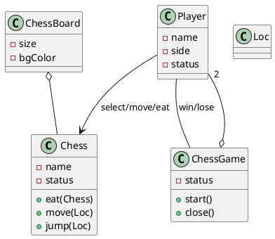
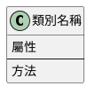
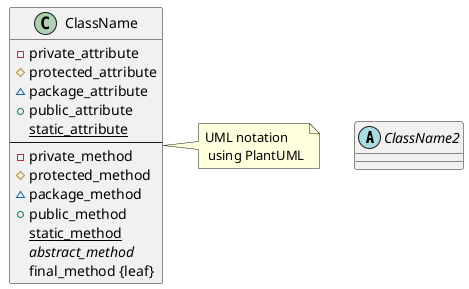
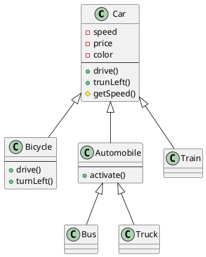
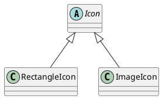
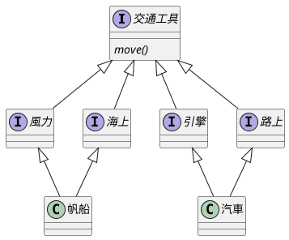
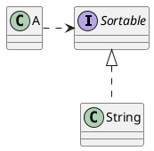
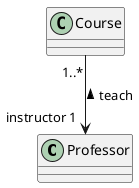
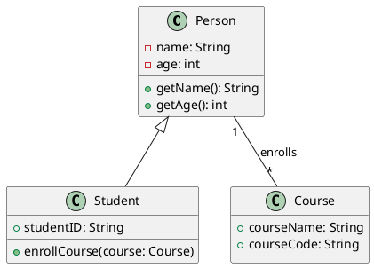

###### tags: `OOSE`

# Ch04 靜態圖模

[參考 GitHub](https://github.com/nlhsueh/teach_sw_fw/tree/main)

我們必須在一定的抽象程度下去思考一個系統，用機器語言來思考一個系統是最糟的方式，因為機器語言是給機器看的。高階的語言例如Java等物件導向的語言雖然高階，但仍適合機器看而非人類。物件導向的模組語言提供一個符合人類思考的抽象層級來幫助我們分析設計一個系統。目前最廣為使用的模組語言是 **統一模組語言(Unified Modeling Language；UML)**，它是一種圖形化的模組語言，不同角色的工程師可以在不同的階段利用它來視覺化系統、分析系統、建構系統與製作系統文件。UML是設計樣式的基礎，因為設計樣式在說明解決方式時都是以模組的方式呈現的。

> 請至 [StarUML](https://staruml.io/) 下載 StarUML 作為繪製工具。

> 本講義所繪製的 UML 圖形採用 [PlantUML](https://plantuml.com/en/)

## 4.1 類別圖 I: 類別

結構模組是物件導向系統中最常見的模組，它不僅可以描述問題領域的概念及系統靜態結構，更是物件導向程式設計的基礎。以下介紹類別圖的幾個用途。

### 4.1.1 類別圖的用途

類別圖是物件觀念中一個非常重要的角色，它提供以下的功能：

- 概念模組
- 瞭解軟體系統的設計結構
- 資料庫綱要模組化


#### 概念模組(Conceptual Modeling)

在系統發展生命週期中，概念模組是位於需求擷取之後、物件分析之前，是需求分析一個很重要的步驟。概念模組是一個幫助分析師瞭解、分析問題領域(problem domain)的重要方法，這裡所謂的問題領域是指系統開發所涵蓋的企業規則、專業領域知識及相關概念之間的關係等。例如設計會計系統就必須瞭解會計領域的借貸原則、設備的折舊計算等；設計學術會議管理系統，就必須瞭解學術會議進行的流程與方法。

概念模組後所產生的規格稱為概念圖(conceptual model)，主要由概念與關聯所構成。「概念」是問題領域中所涵蓋的想法、事件、關係、動作或真實的事物，只要它對這個問題領域而言是特別且具意義的，都有可能被模組在概念圖中。分析師可以從使用案例中去尋找概念，通常是文中的名詞。下圖是一個象棋系統的概念模組，Game有一個 ChessBoard 和 Players，一個ChessBoard 有 Chesses，Player 可以 `select` 或 `move` 或 `eat` Chesses，Game和Player之間有 win/lose 的關係，ChessBoard有大小、背景顏色的屬性，Chess則有吃、移動、跳的行為。
 

<!--  -->



Fig_象棋系統的概念圖
 
#### 瞭解軟體系統的設計結構

在物件導向系統中，功能是靠一群物件和其他元素(介面、元件等)共同合作達成的。在類別圖中，我們可以瞭解類別間靜態的合作關係 。在往後談到設計樣式的章節中，我們多以類別圖來表現一個設計樣式的結構，也同時表現該設計樣式的精神。

UML的類別圖不僅可以做為概念圖，也可以作**設計**之用。設計與概念模組的最大差別在於設計模組從軟體系統的角度來看模組，而非概念性的模組。所以，一些軟體特有的觀念，例如屬性的可視性、方法的參數型態及物件間的相依關係等都可以明確的表達出來。

類別圖在整個設計週期中是不斷被修改調整的，初期是作為概念模組，在設計階段時被精鍊 (refine) 為設計模組，最後到實作階段就成了真實存在的物件導向程式，如下表。


|      | 概念模組                               | 設計模組               | 實際程式                 |
| ---- | -------------------------------------- | ---------------------- | ------------------------ |
| 時機 | 分析階段                               | 設計階段               | 實作階段                 |
| 目的 | 瞭解問題領域                           | 物件如何合作以解決問題 | 物件如何實作以解決問題   |
| 重點 | 真實世界的概念，非軟體元素& 架構的討論 | 軟體元素，例如Button   | 真實的語法               |
| 結構 | 屬性、關聯、可不含方法                 | 屬性、關聯、方法       | 屬性、方法、真實的演算法 |


#### 資料庫綱要模組化 (Database Schema Modeling)

有了剛剛概念模組的觀念後，其實就不難理解為什麼類別圖也可以分析資料庫的綱要，因為資料庫的綱要分析常常都是從概念模組開始的。由概念模組得到資料庫綱要的原則整理如下：


- 一個概念對應一個資料庫表格。
- 概念內的屬性對應資料庫表格內的欄位。
- 概念圖內的一對一關係與多對一關係對應資料庫表格內的外鍵(foreign key)。
- 概念圖內多對多關係對應一個資料庫表格。


此時類別圖的角色是類似ER圖 (Entity Relationship Diagram) 的，主要差別在於類別是允許有方法，而ER圖中的Entity是沒有方法的。簡單的說，類別圖的表達能力較 ER diagram 強，可以用以設計資料庫。


類別圖圖示一覽


### 4.1.2 類別與物件


在物件導向方法論中，物件是所有觀念的核心，因為系統的最基本組成單位是物件。相對於類別，物件是真實存在的事物，而類別是一群具有相同屬性與行為的物件的集合。類別可能是

| 型態 | 範例                                                                                   |
| ---- | -------------------------------------------------------------------------------------- |
| 物體 | 包含真實物體，如電腦、大樓、收據、人等，及抽象物體，如電腦系統內的游標、按鈕、面版等。 |
| 組織 | 如大學、公司、會計部門等。                                                             |
| 角色 | 如執行長、會計師、工程師等。                                                           |
| 概念 | 家族、流程、工作等。                                                                   |
| 事件 | 包含真實事件如選舉、意外等，及抽象事件如電腦系統內的滑鼠移動、鍵盤輸入等。             |


一般而言，類別都是名詞，具有屬性與提供服務，也具有明確定義的自身行為。但也有例外，尤其是在設計階段，為了讓系統更有彈性許多類別的宣告不一定會有屬性。我們會在稍後設計樣式的章節看到這些實例。

**物件是類別的實體**，類別則是物件的概念描述。電腦是一個類別，但你正在使用的電腦 – 一個真實存在的東西 – 是一個物件。同理，「人」是一個概念，抽象的代表一群有頭有手、能動能唱、具有思考能力的動物。人是一個類別，而「張三」，一個具體存在的事物則是人的實例，是一個物件。


Fig_類別物件可以是真實世界物體或觀念的對應


 
#### 類別
 
一個類別表示一群具有相同屬性、關聯、方法及相同意義的物件。在UML中，類別用一個矩型表示，可以分為三個區塊。在分析時，並不一定要將三個區塊都劃出來。通常我們會選擇性的隱藏部份的區塊以強調特別的模組特色。每個區塊的說明如下：

- 第一區塊「==類別名稱==」是不可缺少的區塊，它的主要作用是給類別一個清楚並且容易識別的名稱，通常是個名詞，例如汽車、電腦等都是合適的類別名稱。第一區塊除了描述類別名稱外，也可以加入 stereotype 來描述這個類別是屬於哪一類型的類別。
- 第二區塊是「==屬性==」，用以描述該類別的相關屬性，例如汽車具備的屬性就有型號、汽缸數、里程數等相關的屬性。
- 第三區塊描述此類別的「==方法==」，用以描述可以作用在這個類別上的方法或此類別具備的功能。例如汽車具備發動、行駛、轉彎等方法或功能。


Fig_類別的宣告


#### 屬性
描述一個類別的特性。一個類別可以有很多或沒有任何的屬性。一旦你定義了一個類別的屬性，此類別的所有實例將會擁有這個屬性，並遵守這些特性的限制。舉例來說，一款車(類別)有有它的長度、氣缸數、配備、最高速度等，這些都是它的特性，屬於這款車的任何一輛車(實例)都將具備這些特性，但每個特色的值可能不一樣，例如A車的最高速是100mile/hour，B車的最高速是120 mile/hour。

在UML中，屬性描述在第二個區塊。屬性的相關特性可定義如下：

`[可視性] 屬性名稱 [多樣性] [:型態] [=初始值] [{特性字串}]`

說明：在中刮號([])內的表示可有可無，例如可視性、多樣性等。屬性名稱沒有被中刮號刮起來，表示它是必要的。

以下幾個例子說明幾種類別的宣告方式：


| 宣告                    | 意義                       |
| ----------------------- | -------------------------- |
| telphone                | 只有屬性名稱               |
| +telphone               | 屬性名稱、可視性           |
| telphone: String        | 屬性名稱、型態             |
| telphone[2..4]: Port    | 屬性名稱、多樣性、型態     |
| telphone: String= null  | 屬性名稱、型態、預設名稱   |
| telphone[2..4] readOnly | 屬性名稱、多樣性、特性字串 |


在系統分析階段，通常只會有屬性名稱、型態被描述。其他特性，通常到設計階段或實作階段才作規劃。

#### 可視性(visibility) 

可視性描述屬性是否能被其它的類別「看」的到(這是一個比較生動的字眼，真正的意義是其他類別使否能夠參考或修改此一屬性的值)。UML定義了四個可視性：


- **私有**(private)：只有該類別本身可以使用此一屬性。UML用「-」來表示。
- **保護**(protected)：只有該屬性的後代類別(descendant of classes)可以使用此一屬性。UML用「\#」來表示。
- **公開**(public)：其他類別都可以使用此屬性。UML用「+」來表示。
- **套件**(package)：同一個套件的類別可以使用此屬性。UML用「$\sim$」來表示。


<!--  -->



屬性與方法的可視性

 
#### 多樣性(multiplicity)
多樣性一般用於描述類別間的關聯在數量上的特性，亦可用在屬性上，用以描述一個屬性的數量。上面的範例 `telphone[2..4]` 即表示多樣性。


### 4.1.3 方法

方法用來描述一個類別的行為特性。方法通常都是動詞，代表該類別可以提供的服務。


- **功能**：執行該物件具備的功能。例如 Square 類別具有 `computeArea(int width, int height)`來計算它的面積。
- **查詢**：查詢該物件的狀態，通常以is開頭，例如在 Book 類別中定義 `isBorrowed()`來查詢一本書目前的借閱狀態。
- **狀態設定**：設定物件的值狀態，通常以set 開頭，例如 `setColor()`, `setBackground()`等。


UML中方法的宣告語法如下

`[可視性] 方法名稱 [(參數列)] [: 傳回型態] [(特性字串)]`

| 方法                           | 說明               |
| ------------------------------ | ------------------ |
| display()                      | 只有方法名稱       |
| + display()                    | 方法名稱、可視性   |
| display (i: integer, s:String) | 方法名稱、型態     |
| getPasswd(): String            | 方法名稱、傳回型態 |
| display() \{leaf\}             | 方法名稱、特性字串 |


#### 可視性(visibility)
可視性描述方法是否能被其它的類別「看」得到，亦即，是否可以呼叫此方法。與屬性一樣，UML對方法定義了四個可視性：


- 私有(private)：只有該類別本身可以呼叫此方法。UML用「-」來表示。請注意私有的方法是連子類別也不能呼叫使用的。
- 保護(protected)：只有該類別或其後代類別(descendant of classes)可以呼叫此方法。UML用「\#」來表示。
- 公開(public)：其他類別都可以呼叫此方法。UML用「+」來表示。
- 套件(package)：同一個套件的類別可以呼叫此方法。UML用「$\sim$」來表示。


```java
class TestVisibility {
   void testPrivateAttribute() {
      People p = new People(); //宣告一個People的類別
      p.SSN="S123456789"; //錯誤！SSN是一個私有屬性,不可以直接存取
   }
}
```


<!-- 在類別內的方法區塊中，除了描述一個個的方法外，一樣可以有stereotype來做分類。圖 \ref{fig_stereotype} 中的$\ll$ $\gg$ 表示一個 Stereotype。$\ll$ constructor$\gg$表示 \textit{Book(): void} 與 \textit{Book(name): void} 都是建構子。
 
\begin{figure}[ht]
\begin{center}
\includegraphics[width=0.4\columnwidth]{uml/stereotype.png}
\caption{刻版（Stereotype）}
\label{fig_stereotype}
\end{center}
\end{figure} -->


### 4.1.test 測驗
- 類別圖不能表現一個物件類別的：
	- 屬性
	- 功能
	- 責任
	- 演算法
- 下列何者不是一個屬性的可視性? 
	- public,
	- private,
	- protected,
	- transparent,	
- 同上，`#` 表示哪一種可視性？	

### 4.1.lab 練習

#### 4.1.lab01
用 UML 設計出一個 People 的 class。
- 請安裝 [StarUML](http://staruml.io/)，並應用此工具繪製圖。

#### 4.1.lab02
用 UML 描繪一個資料結構中的 **Stack**。

在程式設計中，Stack 是一種資料結構，具有 **先進後出** (LIFO) 的特性。 所謂的先進後出，是指越早進入 Stack 的資料要比較晚才能取出來。 舉例來說，如果我們在一根直立的木棍上，依序放入很多甜甜圈，當你想取出最底下的甜甜圈時，就一定要先拿走在它之上的甜甜圈，這就是先進後出的概念。

Stack 的屬性如下：
* **後進先出**：Stack 中的資料是以 LIFO 的方式存取。 最新的資料會被放在 Stack 的頂端，而最舊的資料會被放在 Stack 的底部。
* **大小有限**：Stack 的大小通常是固定的，但在某些情況下也可以是動態的。

Stack 的方法如下：
* **Push()**：將資料放入 Stack 的頂端。
* **Pop()**：從 Stack 的頂端取出資料。
* **Peek()**：查看 Stack 頂端的資料，但不取出。
* **IsEmpty()**：檢查 Stack 是否為空。
* **IsFull()**：檢查 Stack 是否已滿。

以下是一些 Stack 的實作方法：
* **陣列**：可以使用陣列來實作 Stack。 陣列的最後一個元素會作為 Stack 的頂端。
* **鏈結串列**：可以使用鏈結串列來實作 Stack。 鏈結串列的最後一個節點會作為 Stack 的頂端。

## 4.2 類別圖 II: 關係

物件不會單獨的存在，它會和系統中的其他物件產生關係。在UML中，關係（relationship）可以分為三大類：一般化關係(generalization)、關聯關係(association)與依靠關係（dependency）。
 
### 4.2.1 一般化關係

一般化關係（generalization）描述一般化事物(general element)與相對特殊事物(specific element)之間的關係。比方說**機車與汽車都是車子的一種，車子即是機車與汽車的一般化，而機車與汽車則相對性的為其特殊化}。我們稱特殊化的類別為一般化類別的子類別(subclass/child class)；反之，一般化類別為特殊化類別的父類別(superclass/parent class)。在UML中，一般化的關係用一個三角形表示，如圖所示。
 
#### 特殊化關係 (specialization)

將一群類別共同的特性與行為抽取出來獨立成為一個類別的動作稱為一般化；反之，將一個類別分成許多子類別動作稱為特殊化。下圖中，車子可以分為卡車、腳踏車與汽車就是一種特殊化。從另一個角度來看，卡車、腳踏車與汽車都是車子，這則是一種一般化。一般化與特殊化是一體兩面、共同存在的。

在物件導向的系統設計中，我們可以先建立一個較為抽象的類別，透過特殊化逐步的建立子類別，進而完成一個類別階層(class hierarchy)；亦可以先建立一群較明細的類別並透過一般化來建立類別階層。雙方向並行的方式也是常見的。

> 一般化關係和特殊化關係式一體兩面的。

<!--  -->



Fig: 汽車的繼承樹

#### 繼承 

在物件導向技術中，一般化關係伴隨著繼承（**inheritance**）的機制。繼承使得子類別擁有父類別的功能，而不需再實作一次。如汽車的例子中，當我們宣告 Bus 繼承 Vehicle時，Automobile就具備所有 Car 的特色 – 如汽缸數、速度、與價格等；也同時具備所有 VehicleCar 的功能，如啟動、開車、左右轉等。

```java
Bus b = new Bus(); //宣告一個Bus物件 b
b.turnLeft(); //儘管Bus內沒有宣告turnLeft()，它還是此功能。
```

#### 擴充、修改與限制

繼承後子類別可以具備父類別的特性，並且擴充、修改或限制其父類別的功能：

- 擴充(extension)：新增功能。例如Bus在繼承Vehicle以後新增了一個 pressStopRing() 的功能。
- 修改(redefinition)：保持功能的介面，但是重新定義實作該功能的實作。例如 Vehicle有預設的 turnLeft() 的方法，但 Bus 重新定義 turnLeft() 的方法，這又稱為方法覆蓋（Override）。
- 限制(restriction)：減少功能。父類別所提供的功能不被繼承，也就是說子類別並沒有該功能。由於限制會產生許多問題，所以目前物件導向程式語言並沒有提供。


#### 抽象類別
抽象類別是一種不能產生物件的類別。為什麼要定義一個不能產生物件的類別呢？
1. 我們已經建立完整的分類，所有的物件一定屬於某一類的子類別，所以不應該由父類別生成物件，因此將父類別宣告為抽象的。
2. 抽象類別訂立了其他子類別的基本規格(basic specification)，子類別必須定義部分方法的實作，特別是宣告在抽象父類別中的抽象方法。

在UML中，抽象類別的類別名稱以 `斜體` 呈現，或是加上`{abstract}`的標記。下圖中的Icon被宣告為一個抽象的類別，因為我們不希望它能夠直接生成物件：它必須透過 `RectangleIcon` 或`ImageIcon` 來生成。

<!--  -->



Fig_斜體字表示該類別是一個抽象類別

#### 抽象方法

在 UML 中抽象方法會以 *斜體* 表示。抽象方法是定義一個沒有實作(implementation)的方法。定義抽象方法的目的是作為一個「規格」讓子類別來依循，一個具有抽象方法的類別必定存在子類別可以實作該方法。例如Car中有定義一個抽象方法`drive()`，其含意在「所有種類的車子應該具備開車功能」，而非「Car定義了drive()的方法，可讓子類別來重用」。UML以斜體字來表示抽象方法，在Car中，`drive()`、`turnLeft()`與`turnRight()`都是抽象方法，其實作留給子類別定義。以下觀念亦請注意：


- 抽象類別不能生成物件
- 具有抽象方法的類別一定是一個抽象類別
- 抽象類別不一定要是具有抽象方法


#### 多重繼承

類別通常只有一個父類別，但也允許有多個父類別。在下圖中，汽車與帆船都有兩個父類別，在繼承上稱為多重繼承(multiple inheritance)。同一個類別有兩種以上的分類方式時，可以在分類的符號( )旁寫上分類的基準為何(discriminator)。在此例中，介質與動力為分類交通工具的兩個不同基準。
 



Fig: 多重繼承

然而，多重繼承卻有時作上的困難。當類別C同時繼承類別A與類別B時，有可能A與B都同時有定義某個方法的實作，如此一來類別C就不知道該依循哪一個類別的實作了。Java因此並沒有直接的支援多重繼承，而是以繼承介面的方式來達到概念上的多重繼承。這是因為介面內並沒有定義實作，所以即使繼承了很多的介面，也不會有混淆的情況發生。

#### 多型

多型（polymorphism）表示 many form 的意思。在物件導向的設計裡，多型表示一個方法有多種定義（形式）。多型與Overloading與Overriding 相關。Overloading表示一個相同的方法名稱可以因為參數型態的不同而有不同的定義，例如

```java
getPrice(): void
getprice(String name): void
```

`getPrice()` 有兩種不同的形式–也就是說有兩種定義。Overriding 則表示子類別可以與父類別有相同的方法、相同的參數列與相同的回傳型態（亦即重新定義父類別的方法）。在下圖中`encrypt(String)` 的方法有三種定義，分佈在父類別與子類別之中。`Document` 物件要求 `Encryption` 物件協助加密，在它的`encryptString()` 的方法中，它不需要指明到底加密者是`RSAEncryption` 或 `DesEncryption`，只需說明要送訊息給`Encryption` 的物件： 

```java
EncryptString(Encryption e) {
   result = e.encrypt(source); //加密的方法取決於 e 的型態
   …
}
```

:::success
:basketball: Exercise: 不同種類的員工
People 的例子中，People 分為 Engineer 和 Manager，請繪製 class diagram
* People 有姓名，身高體重等屬性; 有獲取 bmi 的方法
* Engineer 有專長的屬性，有加入計畫的方法
* Manager 有部門的屬性，有加入下屬的方法
:::

### 4.2.2 介面實作

介面定義一個規格，一個多個物件之間彼此溝通的規格，但他僅定義規格，並不描述其實作方法。UML 中的介面可以有幾種表達方式，如下圖 。


 

介面相關的圖示

---




介面的使用用一條虛線的「相依性」來表達，例如 `SortedStringList` 對 `Sortable` 的引用。

### 4.2.3 關聯關係

關聯主要在描述類別間的靜態結構關係。通常關聯都是二位關聯(binary association，表示「兩個」類別間的關係)，用一條線連接兩個類別。
 

當我們用關聯將兩個類別串起來時，代表它們的物件可能在某一段時間內有關係。比方說，「人為公司工作」，人與公司是兩個類別，而「工作」就是一個關聯。


#### 關聯命名

一個好的命名可以讓分析師清楚的瞭解各個類別之間的關係，通常有兩個命名的方式，一個是直接對關連命名，另一種是在關連的兩端寫上角色。
   
角色命名可以明確的指出類別在此關聯上的角色。在下圖中，Professor 與 Course 有關聯，而且 Professor 在此關聯上的角色為 instructor，表示他為此關係上的講師身分。

<!--  -->
用「角色」為關聯命名



#### Multiplicity

每一個關聯的兩頭都該有一個multiplicity value描述一個物件在此關聯上可以和多少個物件相關。舉例來說，下圖表示Company在此關聯上的 multiplicity value為 0..1，其意義為「任何 Person 只能在一家公司工作，或沒有在公司工作」。Person的multiplicity value為 1..*，表示「任何公司雇用一個以上的員工」。
 
其他 multiplicity value 所代表的意義描述如下：


| 符號 | 意義                         |
| ---- | ---------------------------- |
| 1    | 恰好一個                     |
| 0..1 | 零或一                       |
| M..N | M到N個                       |
| *    | 從零到任何正整數             |
| 0..* | 從零到任何正整數(強調包含零) |
| 1..* | 從一到任何正整數             |


在分析階段考慮物件間的 multiplicity 通常只指出是一對一、多對一或多對多，至於「多」到什麼程度、用何種方式實作都並不重要。在設計階段我們卻必須考慮這些問題，過分的高估 multiplicity value 會造成效率偏低，低估卻會造成執行時的錯誤。

#### 關聯類別(Association Class)
有時候關聯本身也有特性需要描寫。在上面的例子中，若我們需要分析每個人在公司的薪水、報到日期和職位時，就可以建立一個關聯類別：
 


#### 瀏覽(Navigation)
在一般預設的情形下，關聯的瀏覽是雙向的，亦即關聯上的的任一物件可以「瀏覽」另一物件。但在某些情況下，我們卻希望瀏覽是單向的。在下圖 (c) 中，User 的物件可以找到相對應的 Password 物件，但卻不希望 Password 直接知道其相關的User物件為何。UML用箭頭來表示瀏覽的方向，當沒有箭頭時，則表示該關聯為雙向瀏覽。


複合、包含、瀏覽關係


#### Whole-Part關係

不論在現實生活中或軟體設計上都常常可以發現「某物體B是A物體的一部份」的例子，例如引擎是車子的一部份，房間是房子的一部份，Panel 是 Form 的一部份等。這種關係過去定義為單純的Whole-Part 關係，UML更進一步的討論，將之分為複合關係（**Aggregation** ）與 包含關係（**Composition**） 關係，是管理軟體複雜性的一種重要機制。

**複合關係** 表示單純的 Whole-Part 或 Ownership (擁有) 關係，一個 Part 可以有很多個 Whole 或 Owner，而且 Part 不會因為 Whole 的消失而消失。Room 與 Wall 就是一個典型的 Aggregation 關係，因為Wall 是 Room 的一部份，但是 Wall 的生命週期並不決定於 Room 的生命週期，一個 Wall 也不僅是 Room 的一部份。
 
**包含關係** 表現一種更強烈的 Whole-Part 關係，一個 Part 僅可以屬於一個 Whole，而且 Part 會隨著 Whole 的消失而消失。例如當我們在一個 Form 中加入一個 Panel 時，就建立一個包含關係，其中 Panel 是 Part，Form 是 Whole。一個 Panel 僅可以屬於一個 Form，而且 Panel 的生命週期是跟著 Form 的。
 
複合與包含在圖形上的差別在於關係上的菱形是否為實心：**實心表示包含，空心表示複合**。他們的差別整理如下：


| 意  義 | Multiplicity                | 生命週期          |
| ------ | --------------------------- | ----------------- |
| 複合   | Part 可屬於一個以上的 Whole | 無關              |
| 包含   | Part 僅屬於一個 Whole       | Part 相依於 Whole |


Navigation、Composition與Aggregation這三個關聯是語意相異但實作相同。因為當這些關係被實作為程式碼後都是一個物件被宣告成另一個物件的屬性，在實作上無法區別他們的不同。這也是為什麼CASE (Computer-Aided Software Engineering，電腦輔助軟體工程)很難從原始碼中畫出物件導向模組的原因。

### 4.2.4 依靠關係

依靠關係（Dependency）是一種單向關係，當類別A依靠類別B時，表示B的變動可能會影響到A的行為，另一種說法是 A 使用 (`use`) B的規格。依靠關係不僅可以用在類別圖，也可以用在元件圖中表示軟體架構。在UML中，依靠關係是以有箭頭的虛線來表示。下圖表示類別 A 依存於類別 B：
 
 

依靠關係

Dependency 與 navigation 常令人混淆，為了清楚瞭解他們的差別，我們從物件間的可視性(visibility)來分析。一般而言，關係上的可視性可以區分為四種：


- 屬性可視(attribute visibility)：B是A的一個屬性。
- 參數可視(parameter visibility)：B是A某一個method的參數。
- 局部可視(locally declared visibility)：B是A某一個method內宣告的區域變數。
- 全域可視(global visibility)：B是全域變數。


其中第 1 種是 navigation, 2, 3 是屬於 dependency。在物件導向系統中，功能的完成是靠物件間相互傳遞訊息 (message) 所致。若A要送一個訊息給B，則A必須要「看得到」B，也就是說，B對A而言是可視的。一般而言，navigation用以表示屬性可視，而dependency用以表示參數可視與局部可視。


有時候我們想要明確的指出關聯可視性，而不想用dependency來表示，UML利用stereotype來表示關聯可視性。
 
下個章節中我們將描述不同的關係與程式碼之間的對應關係。


關聯的圖示一覽

### 4.2.lab 練習

#### 4.2.lab01
拿起筆，畫出（或說明）以下的 UML 圖示：
    - 繼承
    - 抽象類別及抽象方法 
    - 介面及介面實作
    - 瀏覽關係 
    - 複合關係
    - 包含關係
    - 依靠關係

#### 4.2.lab02
以 UML 工具繪製 ch02 NNEntity 中的類別圖。

#### 4.2.lab03
「老師 `Teacher`」具備姓名、年資、專長等屬性，教書、改作業等方法; 「課程 `Course`」具備名稱、代號、學分數等屬性; 「學生 `Student`」具備姓名、學校、年級等屬性，具備修課、問問題等方法。 	
	- 以StarUML 為工具，建立一個 AnalysisModel，繪製這三個類別，及其屬性、方法。
	- 繪製這三個類別間的關係，除了用關係命名外，也用角色命名。
	- 繪製關係時，採用 StarUML 的 Explorer 面板，設定關係的 multiplicity。
	- 把老師分為專任教師(`FullTime`)兼任教師(`PartTime`)，其中兼任教師學分數不可大於 6 學分，使用 Note 來建立此限制。

#### 4.2.lab06
* 同上，加入 Project 與 Department 等 class
* Manager 可以管理多個 Project; 一個 Project 只能有一個（也一定要有）Manager
* 一個Manager 可以管一個 Department
* Engineer 可以加入多個 Project（也可以不加入）
* 透過 UML association 描述上述的敘述

#### 4.2.lab05
* 同上，因為常常要看員工和專案資料時需要排序，所以需要宣告一個 Comparable 的介面
* Project 依據專案的進度 (progress) 來進行比較
* Engineer 依據生產力來排序
* Manager 依據所帶領的計畫金額來比較
* Engineer 的生產力尤其主管來決定
* 修改 UML 模型，加入必要的屬性與方法
* 寫出對應的 Java code 或 Python code

	
## 4.3 物件圖

#### 分類與實例化

將一群物件依照他們的特性、行為的不同而分類分群的動作稱為分類，亦即由一群物件組複合成一個類別。反之，從一個類別生成物件的動作稱為實例化，被生成的物件稱為該類別的實例(instance)。圖中，類別與物件的「實例化」關係，可以用 `instanceOf`  來表達。


類別與物件的 UML 表示。物件有底線，類別則沒有。冒號表示物件的類別形態。`instanceOf` 表達物件與類別的關係。

## 4.4 PlainUML 介紹
PlainUML 是一種簡單的純文字格式，可用於繪製 UML 圖，例如類圖、時序圖、活動圖等。它類似於 PlantUML，但語法更加精簡，適合快速編寫 UML 圖。以下是 PlainUML 常用的語法介紹：

---

### 類別圖
```plaintext
class Person {
  - name: String
  - age: int
  + getName(): String
  + getAge(): int
}

class Student extends Person {
  + studentID: String
  + enrollCourse(course: Course)
}

class Course {
  + courseName: String
  + courseCode: String
}

Person "1" -- "*" Course: enrolls
```

- `class` 定義類別
- `+` 表示 `public`，`-` 表示 `private`，`#` 表示 `protected`
- `extends` 用於繼承
- `--` 或 `-->` 表示關聯
- `"1"` `"*"` 表示多重性（1 對多）

呈現出的結果：


在使用 hackmd 呈現 plainuml 時，需使用 ````plantuml` 來開頭，並且第一行寫上 `@startuml`

---

### PlantUML 繪製環境
PlantUML 可在多個環境下執行
* Hackmd
* Intellij
  * plugin: PlantUML parser, PlantUML integration
  * 需有 Java, Graphviz 環境
* Visual Studio Code
  * plugin: search PlantUML
  * 需有 Java, Graphviz 環境

---

## 4.EX 綜合練習

### EX4.01 圖書管理

你受聘於一家圖書管理系統開發公司，負責設計該系統的類別結構。請根據以下需求，繪製 UML 類別圖（Class Diagram），包含適當的**類別（Class）、屬性（Attributes）、方法（Methods）**，以及類別之間的**關係（Relationships）**，例如**關聯（Association）、聚合（Aggregation）、組合（Composition）**，並標明適當的**多重性（Multiplicity）**。

**需求描述**
1. **圖書館（Library）**：
   - 圖書館管理多本書籍，每本書都有唯一的 ISBN 編號、書名、作者、出版年等資訊。
   - 圖書館內的書籍可以被借閱，每本書都有**可借閱的副本數量**。
   - 一個圖書館可以管理多個會員。

2. **會員（Member）**：
   - 會員擁有唯一的會員編號、姓名、聯絡方式等資訊。
   - 會員可以借閱書籍，但**每個會員最多只能借閱 5 本書**。
   - 會員可以查詢自己借閱的書籍清單。

3. **書籍（Book）**：
   - 書籍可以被借閱，每本書可能有多個副本（例如，書《Java Programming》可能有 3 本）。
   - 每本書由一位或多位作者所寫。

4. **借閱紀錄（Loan）**：
   - 當會員借閱書籍時，系統會產生一筆借閱紀錄。
   - 借閱紀錄包含：**借閱日期、歸還期限、是否歸還**等資訊。
   - 每筆借閱紀錄對應一位會員與一本書的副本。

5. **作者（Author）**：
   - 每位作者擁有唯一的 ID、姓名、國籍等資訊。
   - 一本書可以由多位作者共同撰寫。

**要求**
1. **根據以上需求，請繪製 UML Class Diagram，包含以下內容：**
   - **至少 5 個類別（Library、Member、Book、Loan、Author）。**
   - **標明各類別的屬性（Attributes）與方法（Methods）。**
   - **明確表示類別之間的關係（Association、Aggregation、Composition）。**
   - **標示多重性（Multiplicity），例如：1..*、0..1、1..1 等。**

2. **提示：**
   - `Library` 與 `Book` 之間是**聚合（Aggregation）**關係，因為圖書館管理書籍，但書籍本身不屬於某個特定圖書館。
   - `Library` 與 `Member` 之間是**關聯（Association）**關係，因為一個圖書館擁有多個會員。
   - `Book` 與 `Loan` 之間是**組合（Composition）**關係，因為借閱紀錄與書籍副本緊密相關，借閱紀錄不存在時，該關聯的副本也無意義。
   - `Member` 與 `Loan` 之間是**關聯（Association）**，因為會員可以借閱多本書，但最多 5 本。
   - `Book` 與 `Author` 之間是**多對多（Many-to-Many）**關係，因為一本書可以有多位作者，一位作者也可以寫多本書。

請根據上述描述，使用 UML Class Diagram 表示類別之間的關係。

### EX4.02 校園成績
:::success
:basketball: University Gradebook

* 一個成績系統，內有類別 Member, Teacher, Student, GradeBook, Course, University 等類別。
* 學校可以聘僱老師，老師可以開課，學生可以進入學校、選課，老師可以改分數成績將之紀錄於成績單，學校可以列出所有成績，找出所有班級不及格的學生及第一名的學生，學校成員包含老師與學生，都會有姓名與帳號，同時可以查看學校有開哪些課。
* 以下為情境程式碼，請依據設計個類別，並用 UML 畫出此靜態結構圖。

```java
University fcu = new University("FCU");
Teacher nick = new Teacher("Nick");
Student albert = new Student("albert");
Student jie = new Student("jie");

fcu.hire(nick, "t01"); // t01 為證號
nick.offer(java);
albert.enter(fcu, "s01"); // s01 為學號
jie.enter(fcu, "s02");
fcu.showMembers();
fcu.showCourses();

albert.takeCourse(java);
jie.takeCourse(java);

nick.score(java, jie, 90);
nick.score(java, albert, 100);

fcu.listGrade();
fcu.showTop();
fcu.showNoPass();
```
逐步開發，先繪製 UML, 在寫程式碼
* (v01) Establish the classes- Student, Teacher 及 Course 
    * the have *names*, *emails*, *course_name*, and *credit* attributes
* (v02) Teachers can offer many Courses
    * the *Association* relationship between them
    * Teacher.offer(Course); Teacher.showCourse()
    * use *ArrayList* to keep the courses a teacher offer
* (v03) Students can take many Courses
    * many-to-many navigation between Student and Course
    * Student.takeCourse(Course)
    * Course.showCourseInfo()
* (v04) Teachers can *score* a Student's grade in a Course
    * Teacher.score(Course, Stduent, int)
    * Student.showGrade() to show all courses he takes and the grades.
    * modify Course.toString() to show students' grade
    * a *use* relationship between Teacher and Course, Student.
* (v05) Generalize Student and Teacher to build a class- Member, which as the attributes of name, email, and their getter/setter/toString
    * A generalization relationship between Member and Teacher, Student
:::

### EX4.03 故事導向物件設計
Story and Object Model

透過 ChatGPT 產生一個簡短的故事，將該故事透過 UML 的方式描繪故事中的人物、特性、動作。

* [參考：從超重到卓越](https://hackmd.io/@nlhsueh/SyPpLWXJ3)

### EX4.04 武俠世界
- 在武俠的世界中，有一些重要的「要素」，例如「人物」、「武功」、「武器」等。請以線上遊戲的角度來思考此問題（例如人物會有「生命力」的屬性）。	
	- 我們把這些要素封裝成類別，除了上述的類別以外，還有哪些類別？請至少找出五個。
	- 哪些類別是抽象類別？會有哪些抽象方法？哪些可以設計成介面？為什麼？
	- 這些類別各自會有哪些屬性？
	- 類別之間會有關係，例如「喬峰具備降龍十八掌」的「具備」關係、「黃蓉擁有打狗棒等」的「擁有」關係。請定義類別之間的關係，以及關係的多樣性 (multiplicity)。
	- 請繪製其 UML class diagram。	

### EX4.05 `GUIChessGame`

應用 Java Swing 視窗化框架改良 Ch02 象棋作業 (`ConsoleChessGame`)
* 具備 Java Swing 視窗化操作
* 儘量做到原本的領域物件（例如 Chess) 不變動，只是換掉操作介面。如果無法，則回頭修改前次做法，思考哪些物件可以同時給兩個系統使用？
* 繪製 UML 的圖 (`GUIChessGame` and `ConsoleChessGame`)

### EX4.06 其他
選擇以下系統，繪製其類別圖
* Ace 網球會員管理系統
* HappyBear 訂餐系統
* ezGo 旅遊規劃系統
* 喀嚓 相機租借系統
* ShowShow 電影訂位系統
* 逢大 選課系統
