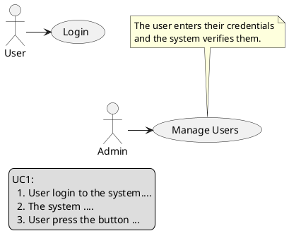
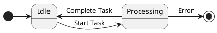
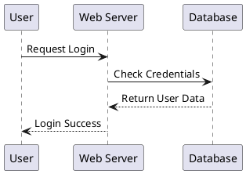
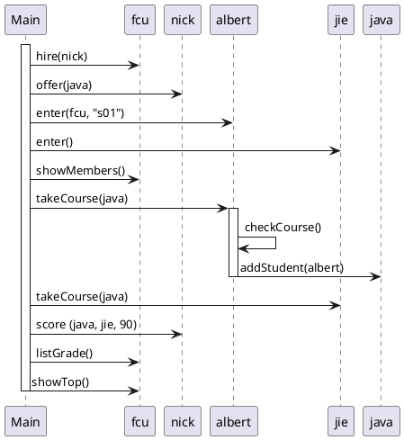
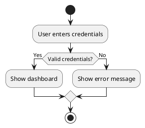

###### tags: `OOSE`

# Ch05 動態圖模

## 5.1 功能情境：使用案例圖

使用案例圖可以用來表達系統主要的使用者是誰？他們使用系統的目的為何。

使用案例的目的如下：

- 描述系統與使用者之間的互動情境、案例、順序。
- 了解使用者所需要的系統功能。
- 了解系統整體性的外部行為（不是內部的）。
- 引導系統的設計與測試案例的設計


使用案例圖包含以下的觀念：

- **角色（Actor)** 系統的使用角設，在UML稱為「Actor」。UML之所以把它稱之為 Actor 而非「user」的原因是使用系統的「物體」不一定是「人」，它也可能是另一個系統或外在設備。比方我們設計一個公司的薪水管理系統，與這個互動的外在物體除了會計人員以外，銀行系統也是其一。在這種情況下，會計人員與銀行系統都是角色。另外要特別注意的是使用者是以使用系統的「角色」來定位的，而非個體。例如John在公司中同時是會計人員與公司員工，在薪水管理系統中我們找出的使用者是「會計人員」與「公司員工」兩個使用者，而非John一個人。
- **使用案例（Use case）** 描述一個角色使用系統的「互動過程」。說的白話一點就是「人機」之間的你來我往。
- **包含關係（include）** 使用案例之間的關係，圖中的 $UseCase_2$ 包含 $UseCase_1$ 表示 $UseCase_1$ 是部分的互動過程，抽取出來的目的是降低重複的描述。
- **擴充關係（extension）** 使用案例之間的延伸關係，用來表示額外的互動或是例外處理。圖中的 $UseCase_1$ 表達的是一個基本的互動，例外或額外的互動描述在 $UseCase_3$，這樣的好處的不會讓 $UseCase_1$ 顯得複雜而難以閱讀。


使用案例包含「使用案例圖」與每個使用案例的「使用案例描述」。


Actor 的幾種呈現方式


使用案例圖

### 使用案例描述

使用案例描述是用口語的方式來描述。可以採用兩欄式的表達或是結構化的表達方式來提昇可讀性與正確性。

| **使用者動作**            | **系統動作**                                                                                    |
| ------------------------- | ----------------------------------------------------------------------------------------------- |
| 1. 點選「查詢並預借媒體」 | 2.	顯示可能的查詢方式，例如直接輸入媒體代號、輸入關鍵字、或要求列出所有媒體                     |
| 3.要求列出所有媒體        | 4.	系統列出所有媒體，包含媒體名稱、媒體數量、租借狀況等媒體特性。媒體旁有一個「預借」的控制鍵。 |
| 5.按下預借的控制鍵        | 6.	系統檢查使用者可否借此媒體，若可以，則顯現租借成功的訊息。                                   |

### 使用案例描述- 結構的表達方法

使用案例可以用結構化的方式來描述，每一個使用案例有以下的欄位：
- 名稱（name or ID）。
- 參與角色（actor）
- 前置條件（precondition）：執行此使用案例的條件，例如資料必須是被排序的。
- 後置條件（postcondition）：流程後必定滿足的狀態，例如 $X_2 > X_1$。
- 不變條件（invariants）：在流程中不會改變的條件，例如保持 $X=Y^2$。
- 特殊需求：例如效能等。
- 事件流（event flow）：事件的流程。
- 例外（exception）：例外情況的處理流程。
- 變異（variations）: 正常流程的變異。

一個買票的例子：
- **ID**: UC201
- **名稱**: 買票
- **參與角色**: 乘客
- **前置條件**: 
	- 乘客站在售票機器前
	- 乘客準備錢購買票	
- **後置條件**: 乘客取得票
- **事件流**:
	- 乘客選擇要前往的地方
	- 機器顯示需要的金額
	- 乘客投入錢
	- 機器找錢
	- 機器吐出票	
- **特別需求**:
    - 效能: 必須要能在一秒內吐票
	- 正確性：錢幣或紙鈔的便是精準度必須高於 99\%。
- **例外**:
    - 沒有零錢：機器沒有零錢可找，請參考UC201a。
	- 超時：乘客超過一分鐘沒有動作，請參考 UC201b。
	

    

規劃使用案例時注意：
- 使用案例不是流程圖。許多人會把一個使用案例當成一個資料處理，箭頭變成處理的順序，這樣就成了流程圖了。
- 使用案例不是單一功能。使用案例有一個完整的使用目的，不是一個功能。
- 使用案例通常是動詞。
- 從「成功的情境」開始描述使用案例，在逐步的找出可能的例外。

### PlantUML 使用案例圖 

See [PlantUML use case diagram](https://plantuml.com/en/use-case-diagram)

```plaintext
actor User
actor Admin

usecase "Login" as UC1
usecase "Manage Users" as UC2

User -> UC1
Admin -> UC2

legend left
UC1:
  1. User login to the system....
  2. The system .... 
  3. User press the button ...
end legend

note top of UC2
  The user enters their credentials
  and the system verifies them.
end note
```
- `actor` 定義角色
- `usecase` 定義用例
- `-->` 表示關聯

呈現：


### 小節練習

- 使用案例的目的是描述系統的 (1) 類別架構 (2) 系統架構 (3) 系統功能 (4) 操作的情境。
- 關於 YouBike 的租借使用，(1) 找出 actor, 繪製使用案例圖; (2) 針對使用案例圖內的使用案例，應用兩欄式使用案例描述之。
- 關於一個網路連線版的象棋系統，規劃其使用案例圖及使用案例。
- 關於 ATM 提款，應用結構式使用案例描述之。

## 5.2 動態行為：狀態圖

狀態圖是用來描述一個物件的行為。這裡所謂的行為指的是物件如何處理與回應事件。狀態圖主要是由狀態(state)與狀態轉移(transition)所構成的。

### 狀態
大部分的物件都是具備狀態性(stateful)物件。例如電腦可以有開機狀態或關機狀態；汽車有熄火、發動、啟動、前進或後退等狀態；視窗有開啟、關閉隱藏等狀態；滑鼠有移動、靜止等狀態。不同的狀態表現物件不同的反應：當我們在開機狀態下按下 on/off 的按鈕時，電腦會關機；但當電腦在關機狀態下我們同樣的按下 on/off 按扭時它卻會開機。*同樣的事件電腦卻有不同的反應，這是因為電腦對事件的處理取決於其內部的狀態*。狀態在 UML用 圓角方形表示。
 

狀態的特徵：
- **狀態通常經歷一段較長的時間**。例如在電話系統中，「鈴聲響」、「拿起話筒」、「講電話」是接電話的三個基本步驟。其中，「鈴聲響」與「講電話」通常會被當成兩個狀態，因為它們會經歷一段較長的時間，「拿起話筒」是一瞬間的事，應當被表達成一個事件。事件會造成狀態的轉移。又例如執行一個運算在電腦的世界裡是一瞬間的事，通常不會當成一個狀態。

- **狀態必須是對系統有意義的**。例如在媒體租借系統中，一個媒體可以有三種狀態：在圖書館中(in library)、被預借中(reserved)與外借中(borrowed)。從圖的模組中，我們可以清楚的瞭解到媒體的行為：
	- 媒體可以透過「預借」→「外借」或直接「外借」的方式被借出；
	- 除非它在外借中的狀態，否則對它下達歸還的事件是沒有用的。
		
雖然我們只指出三個狀態，這並不表示媒體沒有其它的狀態 -- 比方說「被閱讀中」、「圖書管理員貼條碼中」、「正被某人拿著」等等都是媒體可能處在的狀態，可是這些資訊對圖書管理而言是不重要的，所以不需模組出來。系統模組中的狀態狀態必須具備「對該系統設計有意義」的特性。	
	

    
圖書館裡系統中圖書的狀態圖（簡略表達法）

#### 狀態與屬性
物件的狀態與物件的屬性值有直接且緊密的關係。一個人的狀態可以分為「老」、「中」、「青」是因為這個狀態跟人的「年齡」的屬性相關；在上面的例子中，媒體的狀態可由屬性「借閱狀態」來加以模組。


### 狀態轉移

只有狀態是沒有辦法描述一個物件的行為的，物件會因為收到特定的事件而做了特定的工作而轉移到其它的狀態，這樣的轉移才構成所謂的行為。

轉移用具有方向性的連接線表示。一個轉移具有下面幾個部分：

- **原始狀態**(source state)：此與目的狀態都是狀態轉移必要的元件。原始狀態是轉移前的狀態，當物件在原始狀態收到事件，且滿足轉移條件時就會進行狀態轉移，而進入目的狀況。
- **驅使事件**(event trigger)：驅使物件做狀態轉移的事件稱為驅使事件。在上例中，「解聘」、「雇用」、「大於60歲」等都是驅使事件。在某些時候我們並不特別註明驅使事件：當原始狀態內的活動結束時會自動的驅使物件進入目的狀態，稱為**無驅使轉移**(triggerless transition)。
%圖5.7中物件由「搜尋」到「結果顯現」就是一個無驅使轉移的實例 -- 當搜尋結束後物件直接進入到結果顯現的狀態，而無須有其它的事件驅使。
- **轉移條件**(guard condition)：有時候物件收到驅使事件後不一定會做狀態轉移– 除非它滿足某個條件，這個條件就稱為轉移條件（guard condition; 守衛狀況）。轉移條件以 [condition] 來表示。
- **行動**(action)：「行動」在 UML 的表示方法是緊接在事件之後，用 「/」 區隔開來。「event/action」所代表的意義是「當事件 event 發生後，物件會執行行動 action，而進入到下一個狀態」。比方說發生「掛斷電話」這個事件，會帶出「終止連線」的行動，而導致電話進入「idle」的狀態。
- **目的狀態**(target state)：物件做完狀態轉移後進入的狀態。

簡言之：

> 一個物件在「原始狀態」時，接受到「驅使事件」且滿足「轉移條件」，就會執行「行動」，轉移到「目的狀態」。

### 複雜的狀態描述

完整的狀態包括五個部分：
- **名稱**：以文字的方式描述之。如果是一個「活動狀態」，即以活動名稱來命名。
- **進入行動**(entry action)：表示物件進入此狀態馬上必須進行的活動。圖中的 $op_1$ 即為一個進入行動。
- **離開行動**(exit action)：表示物件離開此狀態前必須要執行的行動。 $op_2$ 即為一個離開行動。
- **狀態活動**(activity)：表示物件在此狀態中一直在進行的作業。在UML中狀態活動是緊接在 $do/$後，如  $op_4$ 為一狀態活動。活動通常需要花一段時間才能完成，這與在狀態轉移上的行動(action)不同；行動通常與事件緊密相關，而且所花的時間非常短。
- **內部轉移**(internal transitions)：當物件在某個狀態時，我們希望能夠模組它收到某個事件時該做的工作，但此工作並不會造成物件狀態的轉移。圖中，物件收到事件i 後會執行 $op_3$ 且不會移到另一個狀態。要特別注意的是內部轉移與自我轉移(self-transition)不同，自我轉移指的是物件在目前的狀態後又重新進入該狀態，所以他會歷經離開行動與重新一次的進入行動，這些都是內部轉移所不會發生的。
- **子狀態**(substate)：狀態內還有狀態稱之為子狀態。關於子狀態會在後面再做說明。
- **延遲的事件**(deferred events)：在本狀態不做處理的事件。物件會將這些事件 queue 起來讓之後的狀態處理。


State transition diagram（完整表達法）

#### Action State
一般的運算或是動作對系統（電腦）來說是時間極短的活動，中間不會有事件造成其中斷，例如計算成績、點下確定鍵、或是接起電話等。但有些動作會經歷一段可觀的時間，可能會有事件造成其轉移，例如轉檔、連線、移動象棋（玩家尚未放子）等，這些動作也可以表達為狀態，稱之為 action state。

### 一般化與合成化

如同UML的物件圖一般，為了使狀態圖更結構化，狀態圖也具有一般化(generalization)與合成化(aggregation)的觀念。狀態的一般化與合成化可以降低狀態圖的複雜度。

#### 狀態的一般化

電腦的「開機狀態」又可細分為「操作狀態」、「休眠狀態」、「待命狀態」或「當機狀態」。

所謂的一般化是指狀態之間具備 **「是一種」**(is-a)的關係，例如車子的狀態分為前進檔、後退檔與空檔，而前進檔又可分為一檔、二擋與三檔；我們可以說一檔是一種 (is-a) 前進檔，或說一檔是前進檔的子狀態。一般化也同時代表著 「或」 的關係，當物件處於父狀態($S$)時它必定處在某一個子狀態中(物件處於 $S_1$ 或 $S_2$ 中，假設 $S_1$ 與 $S_2$ 為 $S$ 的子狀態)。在圖中，車子的變速器處於前進檔時，它必定同時處於一檔或二擋或三檔。由於子狀態之間存在循序的關係，因此子狀態稱為「循序子狀態」(sequential substate)。
 


變速器的狀態圖

循序子狀態包含起始狀態表示當進入此狀態時即立刻進入的狀態。在上述的例子中，當在狀態空檔時發生 $pushF$的事件，物件會立刻進入一檔的狀態，因為它是前進狀態的起始狀態。

狀態的一般化可以解決狀態圖複雜的問題，在圖中可以發現 $S_1$ 與 $S_2$ 有相同的行為–當它們收到事件 $E$ 時都會轉移到狀態 $S_3$。我們可以將之一般化為圖右的情形，可以明顯的看到狀態轉移由三個簡化為兩個。
 
 

狀態一般化

雖然平版狀態（圖左）讀只比巢狀（圖右）的多了一個狀態轉移，可是可讀性明顯降低了很多。當狀態及狀態轉移數量多的時候，巢狀與非巢狀的複雜度就可以明顯的觀察出來。

#### 狀態的合成化

狀態的合成表示一個狀態是由許多的子狀態所合成的。==這種合成是一種「且」的關係，也就是說物件必須「同時」處在合成的子狀態中==。因此這些子狀態稱為並行子狀態(concurrent substate)。圖中 $S_1$ 與 $S_2$ 同為 $S$ 的並行子狀態，這表示當物件在 $S$ 狀態時，它必定同時在 $S_1$ 與 $S_2$ 狀態(回顧一下狀態的一般化，子狀態間的關係是或的關係)。

因為合成化的關係，我們必須用一對或多個狀態-- $(S_1, S_2)$來表示該物件目前的狀態。圖中物件的起使狀態是 $(Z,A)$，受到 $E_2$ 事件驅使後進入 $(X, A)$，若再受到事件 $E_4$ 驅使後則進入 $(X, B)$。請注意即使只有一個子狀態作改變，我們仍須用一對狀態來描述。


狀態合成化
 

狀態一般化與合成化都是有效解決狀態圖複雜的利器，下表比較兩者的不同：

狀態一般化與狀態合成化比較
|                        | 狀態一般化            | 狀態合成化             |
| ---------------------- | --------------------- | ---------------------- |
| 子狀態名稱             | 循序子狀態            | 並行子狀態             |
| 子狀態與父狀態關係     | 是一種 (is-a)、一般化 | 部分 (part-of)、合成化 |
| 子狀態與子狀態間的關係 | 或                    | 且                     |


#### 範例

以下是一個飯店預約系統的狀態圖，請描述之。

> 仔細分析這個狀態圖，它正確嗎？完整嗎？例如在 On waiting list 的狀態中，只會有兩個事件會造成狀態轉移嗎？有沒有可能其他的事件？


飯店預約系統的狀態圖

### PlantUML 狀態圖 

See [PlantUML state diagram](https://plantuml.com/en/state-diagram)

```plaintext
[*] -> Idle
Idle -> Processing: Start Task
Processing -> Idle: Complete Task
Processing -> [*]: Error
```
- `[*]` 表示初始或終止狀態
- `-->` 表示狀態轉換
- `:` 後面可以寫觸發條件


呈現：



### 小節練習


- 狀態圖主要表現系統的 (1) 功能 (2) 操作情境 (3) 行為 (4) 物件結構。
- 考試系統中有以下的狀態：建立考試、設定考題、發佈、考試中、關閉。請畫出狀態圖，做必要的假設以添加狀態。
- 打電話的情境大概如下：拿起電話、撥打電話、接通、開始講話、掛電話。中間有些例外，例如拿起電話太久沒有撥號，就會出現出現錯誤訊息無法打了。以家中電話為例，繪製 完整表達法的狀態圖。
- 以學校的角度來看，選課會經過哪些狀態及狀態轉移？在每個狀態下可做哪些動作？
- 目前 level 2 的智慧駕駛車已幾乎成為標準。請用狀態圖描述自動跟車（包含設定時速）的功能。
- 狀態的合成化與物件的合成有直接的關係。在車子的例子中，假設車子是由變速器、加速器與煞車所構成的，那們車子的狀態恰是由這三個子物件的狀態所構成的，請繪製汽車的合成狀態圖。


## 5.3 物件互動：循序圖

循序圖與合作圖都表示物件交互合作的情形，但它的重點在於訊息傳遞的先後順序上。物件仍是以方形表示，每個物件並且有其**生命線 (lifeline)**，以虛線表示。
 


循序圖可以用來表達物件之間互動的順序。通常是針對一個情境的互動狀況。


- **物件**。參與此活動的物件。在 UML 中以方形來表示，圖中的 $object_1$, $object_2$, $object_3$, $object_4$ 皆為物件。
- **生命線**。物件之間溝通的訊息以垂直的箭頭表示，訊息線的高低代表著訊息產出的先後順序，也因為如此，循序圖不需要以序號來表示其先後的關係。
- **活化段**。物件 A 送訊息給物件 B 因此促發了物件 B 的一段工作，稱之為「活化段」（activation），生命線上的長條方形即為活化段。物件 B 的活化段包含在物件A的活化段之中，代表執行的控制權由 A 轉移到 B，一直到 B 執行結束才將執行權歸還給 A。活化段的長短不表示工作的時間長短。
- **訊息傳遞**。如圖中的 $msg_1$, $msg_2$ 等。產生物件的訊息比較特別，透過 stereotype 來表示。訊息傳遞給物件後，物件會執行相對應的方法，如果有回傳值的話，就以虛線來表示，圖中的 $x$ 表示回傳的值。


繪製循序圖是以完成某一個完成功能或情境為主體，可以幫忙定義物件的方法。


### 象棋系統
下圖是部分的循序圖，描述一個玩家先建立一個棋局遊戲 ChessGame, 接著另一個玩家加入。加入後 ChessGame 會建立 ChessBoard 來呈現整個棋盤，玩家接著對棋盤做互動，互動的事件會由棋盤轉換為對 ChessGame 有意義的指令，ChessGame 每一次做動作都會進行 checkWinner 來檢查是否勝負已定，如果已定就會傳訊息給 ChessBoard, 接著由 ChessBoard 公布訊息給玩家。


### PlantUML 循序圖 
See [PlantUML sequence diagram diagram](https://plantuml.com/en/sequence-diagram)

```plaintext
participant User
participant "Web Server" as Server
participant Database

User -> Server: Request Login
Server -> Database: Check Credentials
Database --> Server: Return User Data
Server --> User: Login Success
```
- `participant` 定義參與者
- `->` 表示同步請求
- `-->` 表示回應
- `as` 可用來給參與者取別名

呈現：

---

### 小節練習

- 繪製循序圖時，可能需要參考其他的圖型，但以下何者不太可能需要參考：(1) 使用案例 (2) 類別圖 (3) 系統配置圖 (4) 活動圖
- 考慮以下的程式，繪製其循序圖

```java
University fcu = new University("FCU");
Teacher nick = new Teacher("Nick");
Student albert = new Student("albert");
Student jie = new Student("jie");

fcu.hire(nick, "t01");
nick.offer(java);
albert.enter(fcu, "s01");
jie.enter(fcu, "s02");
fcu.showMembers();
fcu.showCourses();

albert.takeCourse(java);
jie.takeCourse(java);

nick.score(java, jie, 90);
nick.score(java, albert, 100);

fcu.listGrade();
fcu.showTop();
fcu.showNoPass();
```



- 考慮以下的程式，繪製其循序圖
```java
public class BillingDialog {
   public static void main(String[] args)    {
        Bill yourBill = new Bill( );
        yourBill.inputTimeWorked( );
        yourBill.updateFee( );
        yourBill.outputBill( );
     }
}
public class Bill {
    public static final double RATE = 150.00;     
    private int hours, minutes;
    private double fee;
    public void inputTimeWorked( )     {
        System.out.println("請輸入工作幾小時幾分鐘（空白分開）");
        Scanner keyboard = new Scanner(System.in);
        hours = keyboard.nextInt( );
        minutes = keyboard.nextInt( );
    }
    private double computeFee(int hoursWorked, int minutesWorked)    {
        minutesWorked = hoursWorked*60 + minutesWorked;
        int quarterHours = minutesWorked/15; 
        return quarterHours*RATE;
    }
    public void updateFee( ) {
        fee = computeFee(hours, minutes);
    }
    public void outputBill( )   {
        System.out.println("你工作了" + hours + " 小時" + minutes + " 分鐘");
        System.out.println("共賺 " + fee +" 元");
    }
}
```

- 象棋系統中，Chess, ChessBoard, ChessGame 的循序圖為何？
- 班級活動的籌劃，可能會牽涉班長、活動、旅行社等「物件」，繪製循序圖來完成相關的情境。


## 5.4 流程設計：活動圖

活動圖可以用來表示流程圖。


應用 decision 的活動圖


應用 fork, merge 的活動圖


### PlantUML 活動圖 

See [PlantUML activity diagram](https://plantuml.com/en/activity-diagram-beta)

```plaintext
start
:User enters credentials;
if (Valid credentials?) then (Yes)
  :Show dashboard;
else (No)
  :Show error message;
endif
stop
```
- `start` / `stop` 表示開始與結束
- `:` 定義動作
- `if (條件) then (分支)` 表示條件判斷
- `else (分支)` 定義另一條路徑
- `endif` 結束條件判斷

呈現：


---


## 5.EX 綜合練習

- 一個成績系統，內有類別 `Member, Teacher, Student, GradeBook, Course, University`  等類別。學校可以聘僱老師，老師可以開課，學生可以進入學校、選課，老師可以改分數成績將之紀錄於成績單，學校可以列出所有成績，找出不及格的學生及第一名的學生，學校成員包含老師與學生，都會有姓名與帳號，同時可以查看學校有開哪些課。
	- 繪製此系統的 use case diagram, use cases, class diagram 及 sequence diagram。
	- 此系統中，課程 Course 具備較明顯的狀態變化，請繪製其狀態圖。
	- 完成此系統，觀察程式碼與上述 model 之間的關係。