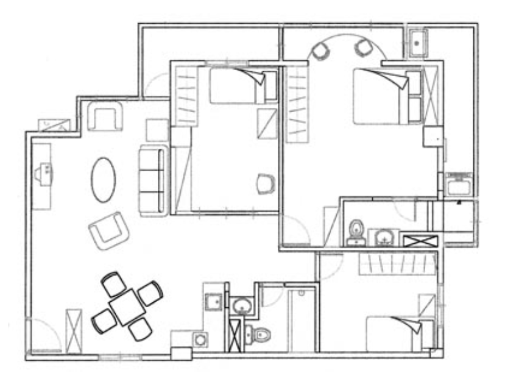
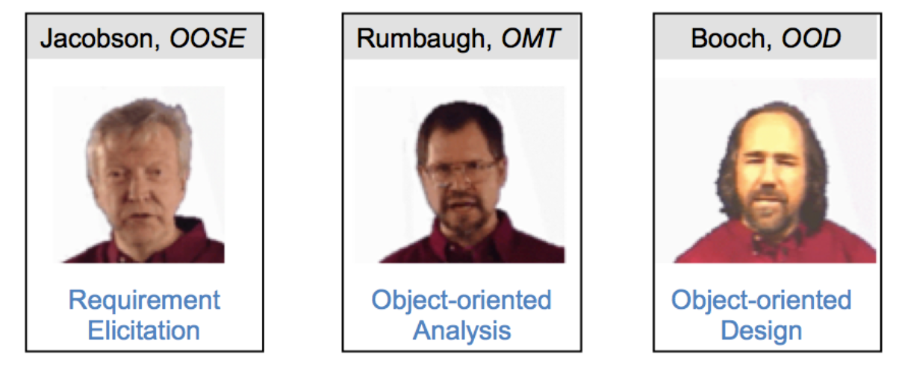
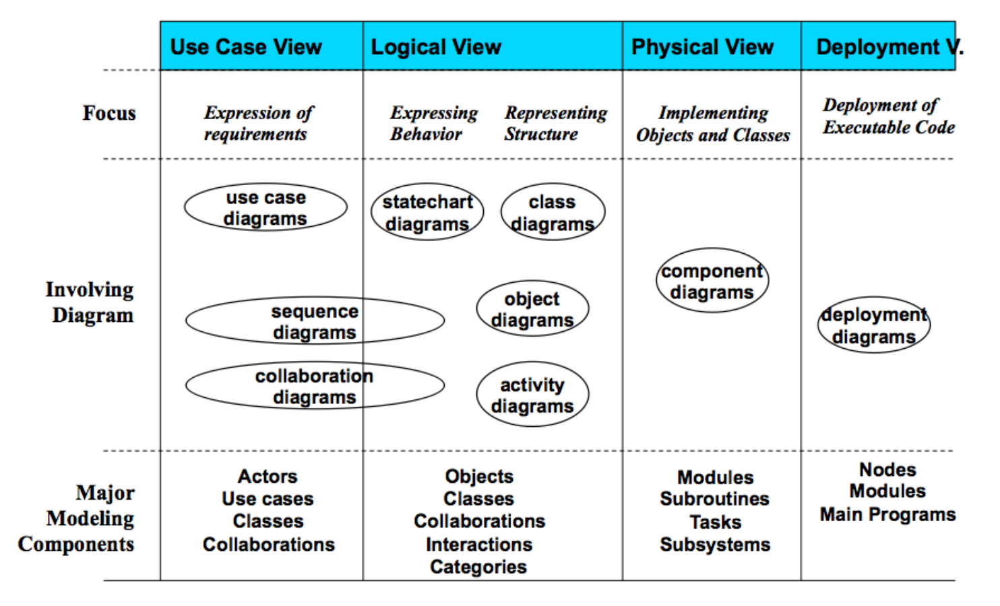
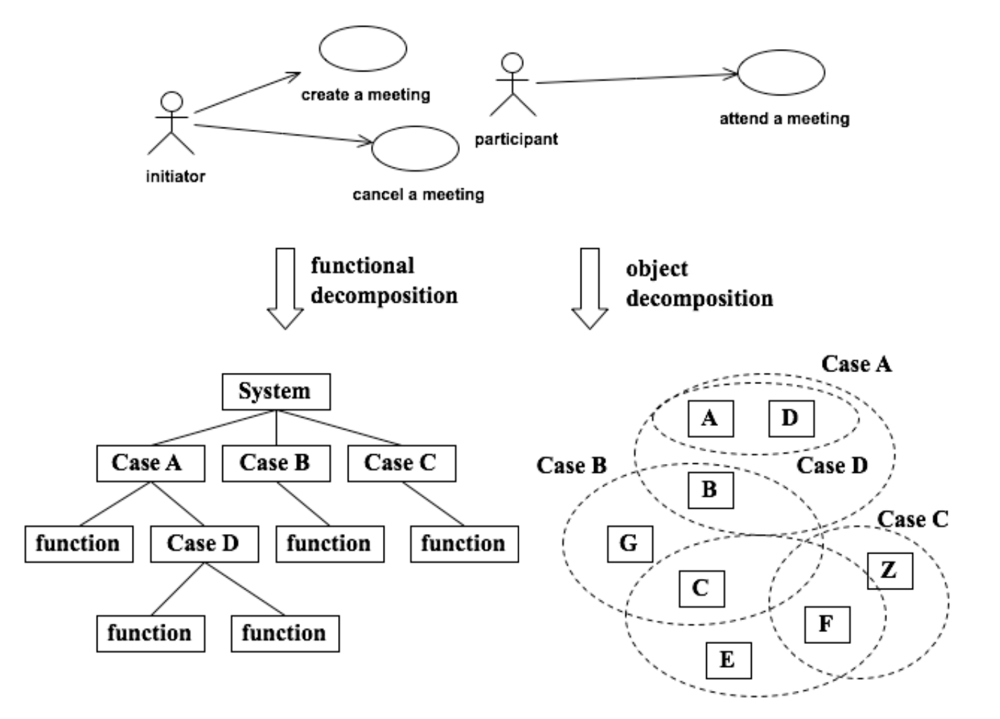

# Ch03 UML 圖模概論

## 3.1 模組

在建構一個大樓前，設計師會先將大樓的藍圖繪製出來，工程師依此藍圖建構大樓；在接待所中大樓的模型也會被建立，作為客戶決定是否購買該樓的參考。藍圖與模型都是一種模組。開發軟體系統前，我們會先建立若干的軟體模組：

-   模組是一種真實的簡化； 模組是系統參與者溝通的媒介橋樑；
-   模組是處理複雜度的工具；
-   模組可以作為系統開發的藍圖或規格書。



畫圖是工程設計很重要的工作

### 模組與符號 (notation)
息息相關。符號可由圖形或文字所構成，用來表達一個模組的語法
(syntax)。對一個模組語言而言，每一個符號都必須有唯一且清楚的意義，稱為語意
(semantic)。例如在UML的類別模組中方塊 (符號) 代表一個類別
(語法)，而類別的意義是一群有相同特色與行為的物件的集合 (語意)。

模組的要素：要成為一個好的模組語言並不容易，一個好的模組語言應該具備以下的條件：

* **抽象力**   模組是真實事物的抽象，它只呈現部分觀看者有興趣的一面，而忽略細節或其它的層面。一個方法論通常提供多個模組並可從不同的抽象來表達系統，例如行為模組，結構模組與功能模組等。
* **理解力**   模組必須能夠容易閱讀，理解，以作為開發者及使用者之間溝通的橋樑，作為日後維護的依據。為了提升理解力，模組通常是圖形化的符號所組成的。
* **正確性**   模組應該能清楚的表達它的語意。模組內每個符號應該有明確的定義。UML的超模組(meta-model)即是用以定義模組語意的模組。具有正確性的模組才能作為系統設計與開發的規格。
* **預測力**   模組必須某個程度的表示未來要開發的軟體系統的形式，結構或行為。
* **低成本**   模組必須是方便建立的，因為它是作為溝通的橋樑，會經常的修改，如果建立它的成本很高，就喪失了模組的作用了。

一個系統或事物，用不同的抽象角度去看，就會得到不同的結果。從物件的抽象角度來看與從功能的角度來看，所得到的模組就完全不同。其他還有各種不同的模組：資料模組、流程模組、狀態模組等。

## 3.2 UML 簡介

物件導向模組語言最早出現在1970年代，當時一些學者為了因應各種不同的物件導向語言與越來越複雜的系統，紛紛提出各種不同的物件導向模組方法。從1989到1994年，物件導向模組方法由十多個增加到近五十個，其中較為出名包括Booch，Jacobson 的OOSE，Rumbaugh 的 OMT，Fusion，Shlaer-Mellor與Coad-Yourdon，每一種方法都有其優缺點。使用者開始對這些不統一的方法論感到無所適從，於是許多人開始思考一個統一的作法。

到了90年代中期，Booch，OOSE與OMT三個方法的主要作者Booch、Jacobson與Rumbaugh開始整合其他方法的優點，希望能夠建立一個統一的模組語言，因此便合力發展了 **Unified Modeling Language** (UML)。值得一提的是，這三個方法正好在物件導向方法中各自佔有其重要的地位，Booch 著重於系統的「設計」及「建構」階段；OMT則對系統「分析」提出精闢的見解；而Jacobson的使用案例 (Use Case) 簡潔而明瞭，對於「需求擷取與分析」有良好的支援。這三個方法在軟體發展生命週期中各佔有不同的角色，由於他們的合作，奠定了UML的基礎，也使得物件導向方法論更趨完整而易於使用。



UML 三位主要提倡者

### UML的目標

-   提供容易使用、表達能力強的圖形化模組工具以建立可互相溝通、有意義的系統模組。
-   提供擴充性並讓開發者可自定其所需要的模組概念 。
-   提供與程式語言(language-independent)無關與發展程序無關(process-independent)的規格語言。
-   提供一個正規(formal)的方式以定義此模組語言 。
-   鼓勵模組工具市場的成長。
-   提倡高階的發展概念，例如元件(component)、合作(collaboration)、框架(framework)、與樣式(pattern)。

有句話說「瞎子摸象」，意思是不同的人去摸瞎子，都以為他所摸到就是象的全貌，但事實是他所認知只是整體的一部份。一個尚未開發完成的系統，對於系統開發人員而言，正如同瞎子摸象一般的困難，因此我們需要從各種不同的角度來看系統，才能正確的表達系統的全貌。

### UML diagrams

UML提供許多模組圖 ，約略可分成靜態與動態2個層面，介紹如下：

-   **類別圖** (Class Diagram)：描述類別屬性、作業員與類別間的關係。
-   **物件圖** (Object Diagram)：描述物件間的關係。
-   **元件圖** (Component Diagram)：描述系統的真實元件(physical
    component)與元件間的關係。
-   **配置圖** (Deployment
    Diagram)：描述系統元件在硬體上的配置，與各硬體間的關係。
-   **使用案例圖** (Use Case Diagram)：從使用者的觀點描述系統的功能。
-   **循序圖** (Sequence Diagram)：以時間的順序為主描述物件的互動。
-   **合作圖** (Collaboration Diagram)：以空間的配置為主描述物件的互動。
-   **狀態圖** (Statechart
    Diagram)：以物件接受到訊息前後狀態的改變來描述物件的行為
-   **活動圖** (Activity Diagram)：主要用途為用來表現活動與活動間的流程。




UML diagrams

### 特性與優點

* **圖形化的模組語言** 不同角色的工程師可以在不同的步驟利用它來視覺化系統、規劃系統、建構系統與製作系統文件。UML是一個模組語言。所謂的「語言」，提供了一群特定的字彙與組合這些字彙的規則來達到溝通的目的。模組語言亦是如此，但它著重於以圖形化的方式表達一個軟體系統的結構或行為。要特別注意的是，模組語言只是一種語言，描述系統的架構與行為，它並沒有規定分析師、程式設計師在什麼階段作什麼事，因為這是屬於系統發展程序的工作。這正也是UML的優點之一：將語言從發展程序中獨立出來，使此模組語言更具彈性。
* **視覺化系統** 由於軟體的不可視性與複雜性，以程式碼來呈現軟體系統的是不可行的方法，圖形化的方式可以大大的提高系統的可閱讀性。
* **可視為規格書** 軟體開發如同建築設計，其過程中也必須將需求、分析、設計、實作、佈署等各項工作流程之構想與結果予以呈現。在軟體的開發過程中，最重要的兩個技術規格書為系統需求規格書(System Requirement Specification；SRS)與系統設計規格書(System Design Description；SDD)。這兩個規格書分別在分析階段與設計階段結束後產出，用已說明需求與設計的內容。UML的模組設計可以放在SRS與SDD中協助描述需求與設計。

### UML 作為需求規格書

**需求規格書**

主要用來定義使用者的需求，當規格書的內容被使用者確定後，開發團隊就可以依照此需求設計系統。下圖為一個設計規格書的樣版，UML
的模組可以被應用在設計規格書中協助定義設計的內容。與需求規格書比較，會發現許多部分所用的圖形是一樣的，差別在於設計規格書所描述的要更仔細。

```
1.  簡介(Introduction)
    1.  系統目的(System Objective)
    2.  系統範圍(System Scope)
    3.  詞語用義(Definition and Acronyms)
    4.  參考文獻(Referenced Documents)
2.  系統作業說明(Proposed System Description)
    1.  系統作業流程(Process Description of Proposed System)
    2.  系統特色及預期效益(System Characteristics and Expected Benefits)
    4.  系統限制(System Constraints)
3.  業務規則(Business Rules)
4.  系統需求說明
    1.  功能性需求(Functional Requirement)
    2.  非功能性需求(Nonfunctional Requirement)
    3.  設計限制(Design Constrains)
5.  系統模組(System Models)
    1.  需求定義 (Requirement Definition):
    2.  案例說明 (Use Cases Description):
    3.  軟體關係圖(Conceptual Data Model)
6.  技術分析(Requirement Analysis)
    1.  靜態結構分析:
    2.  動態行為分析:
7.  系統與軟體驗收準則 (System and Software Acceptance Criteria)
    1.  系統驗收準則 (System Acceptance Criteria)
    2.  軟體驗收準則 (Software Acceptance Criteria)
```

### UML 作為設計規格書

當系統設計規格書完成後，便可以依照此規格書實作。目前許多模組工具，例如IBM
的Rational Rose、Borland的Together與Sybase的Power
Designer等都提供可以從設計規格產生部分程式碼的功能，讓開發者可以很快的從設計階段銜接到實作階段。

```
1.  簡介 (Introduction)
    1.  系統目的 (System Objective)
    2.  系統範圍 (System Scope)
    3.  詞語用義 (Definition and Acronyms)
    4.  參考文獻 (Referenced Documents)
2.  系統架構設計 (Architecture Design)
    1.  系統架構 (System Architecture)：**UML 配置圖**
    2.  軟體架構 (Software Architecture)：**UML 套件圖**
3.  資料庫設計 (Physical Data Model)
4.  GUI設計 (Prototype)
5.  細部設計 (Detailed Design)：**UML - 類別圖; UML - 元件圖; UML -
    循序圖; UML - 狀態圖**
6.  系統整合策略 (Integration Strategy)
7.  建構程序 (Build procedure)
```
## 3.3 物件導向設計



From analysis to design

## 3.4 綜合練習

1️⃣ 以下何者不是模組語言的條件?
- A 抽象力
- B 理解力
- C 執行力
- D 預測力

2️⃣ UML 的全文為？
- A Unified Modeling Language
- B Unique Modeling Language
- C Unified Metadata Language
- D Unique Metadata Language

3️⃣ 以下何者不屬於 UML diagram?
- A 網路配置圖
- B 類別圖
- C 使用案例圖
- D 循序圖

4️⃣ 一個好的軟體設計文件，必須包含哪些內容？UML 能夠扮演什麼角色？

5️⃣ 室內設計圖有沒有什麼標準？用來畫畫你的房間。

6️⃣ 除了軟體工程以外，還有哪些工程也有圖模的概念？試說明之。

---
Ans: 4, 1, 1
