# Ch04 靜態圖模


我們必須在一定的抽象程度下去思考一個系統，用機器語言來思考一個系統是最糟的方式，因為機器語言是給機器看的。高階的語言例如Java等物件導向的語言雖然高階，但仍適合機器看而非人類。物件導向的模組語言提供一個符合人類思考的抽象層級來幫助我們分析設計一個系統。目前最廣為使用的模組語言是 **統一模組語言(Unified Modeling Language；UML)**，它是一種圖形化的模組語言，不同角色的工程師可以在不同的階段利用它來視覺化系統、分析系統、建構系統與製作系統文件。UML是設計樣式的基礎，因為設計樣式在說明解決方式時都是以模組的方式呈現的。

## 4.1 類別圖 I: 類別

結構模組是物件導向系統中最常見的模組，它不僅可以描述問題領域的概念及系統靜態結構，更是物件導向程式設計的基礎。以下介紹類別圖的幾個用途。

### 4.1.1 類別圖的用途

類別圖是物件觀念中一個非常重要的角色，它提供以下的功能：

- 概念模組
- 瞭解軟體系統的設計結構
- 資料庫綱要模組化


**概念模組**

在系統發展生命週期中，概念模組是位於需求擷取之後、物件分析之前，是需求分析一個很重要的步驟。概念模組是一個幫助分析師瞭解、分析問題領域(problem domain)的重要方法，這裡所謂的問題領域是指系統開發所涵蓋的企業規則、專業領域知識及相關概念之間的關係等。例如設計會計系統就必須瞭解會計領域的借貸原則、設備的折舊計算等；設計學術會議管理系統，就必須瞭解學術會議進行的流程與方法。

概念模組後所產生的規格稱為概念圖(conceptual model)，主要由概念與關聯所構成。「概念」是問題領域中所涵蓋的想法、事件、關係、動作或真實的事物，只要它對這個問題領域而言是特別且具意義的，都有可能被模組在概念圖中。分析師可以從使用案例中去尋找概念，通常是文中的名詞。下圖是一個象棋系統的概念模組，Game有一個 ChessBoard 和 Players，一個ChessBoard 有 Chesses，Player 可以 `select` 或 `move` 或 `eat` Chesses，Game和Player之間有 win/lose 的關係，ChessBoard有大小、背景顏色的屬性，Chess則有吃、移動、跳的行為。
 


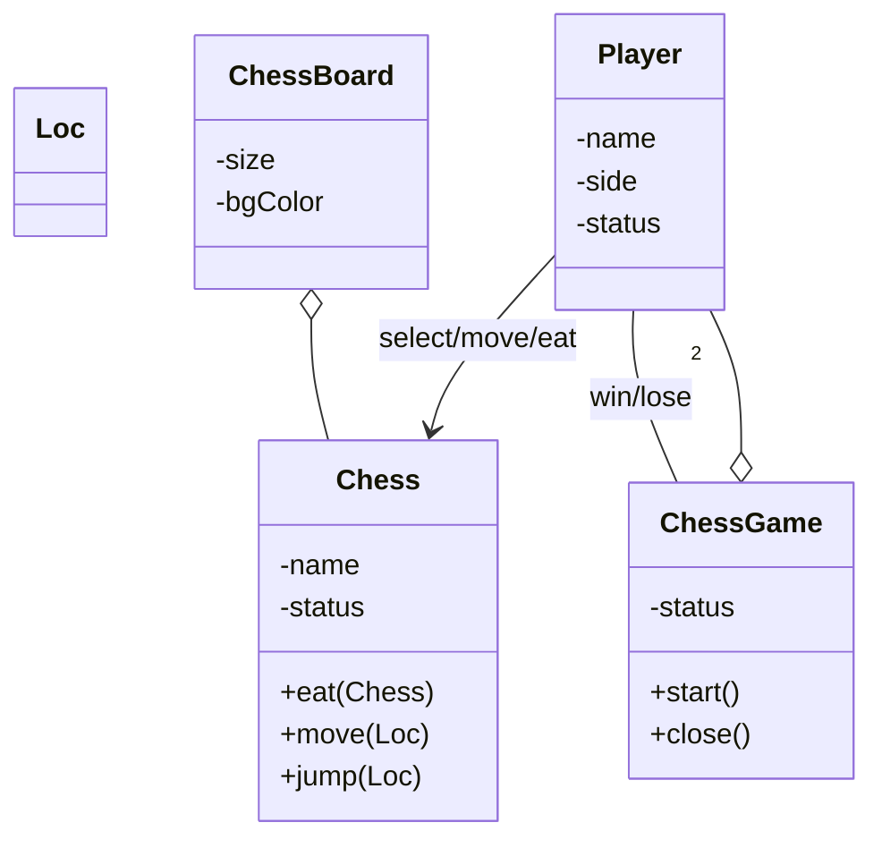

Fig_象棋系統的概念圖
 
**瞭解軟體系統的設計結構**

在物件導向系統中，功能是靠一群物件和其他元素(介面、元件等)共同合作達成的。在類別圖中，我們可以瞭解類別間靜態的合作關係 。在往後談到設計樣式的章節中，我們多以類別圖來表現一個設計樣式的結構，也同時表現該設計樣式的精神。

UML的類別圖不僅可以做為概念圖，也可以作**設計**之用。設計與概念模組的最大差別在於設計模組從軟體系統的角度來看模組，而非概念性的模組。所以，一些軟體特有的觀念，例如屬性的可視性、方法的參數型態及物件間的相依關係等都可以明確的表達出來。

類別圖在整個設計週期中是不斷被修改調整的，初期是作為概念模組，在設計階段時被精鍊 (refine) 為設計模組，最後到實作階段就成了真實存在的物件導向程式，如下表。


|      | 概念模組                               | 設計模組               | 實際程式                 |
| ---- | -------------------------------------- | ---------------------- | ------------------------ |
| 時機 | 分析階段                               | 設計階段               | 實作階段                 |
| 目的 | 瞭解問題領域                           | 物件如何合作以解決問題 | 物件如何實作以解決問題   |
| 重點 | 真實世界的概念，非軟體元素& 架構的討論 | 軟體元素，例如Button   | 真實的語法               |
| 結構 | 屬性、關聯、可不含方法                 | 屬性、關聯、方法       | 屬性、方法、真實的演算法 |


**資料庫綱要模組化**

有了剛剛概念模組的觀念後，其實就不難理解為什麼類別圖也可以分析資料庫的綱要，因為資料庫的綱要分析常常都是從概念模組開始的。由概念模組得到資料庫綱要的原則整理如下：


- 一個概念對應一個資料庫表格。
- 概念內的屬性對應資料庫表格內的欄位。
- 概念圖內的一對一關係與多對一關係對應資料庫表格內的外鍵(foreign key)。
- 概念圖內多對多關係對應一個資料庫表格。


此時類別圖的角色是類似ER圖 (Entity Relationship Diagram) 的，主要差別在於類別是允許有方法，而ER圖中的Entity是沒有方法的。簡單的說，類別圖的表達能力較 ER diagram 強，可以用以設計資料庫。

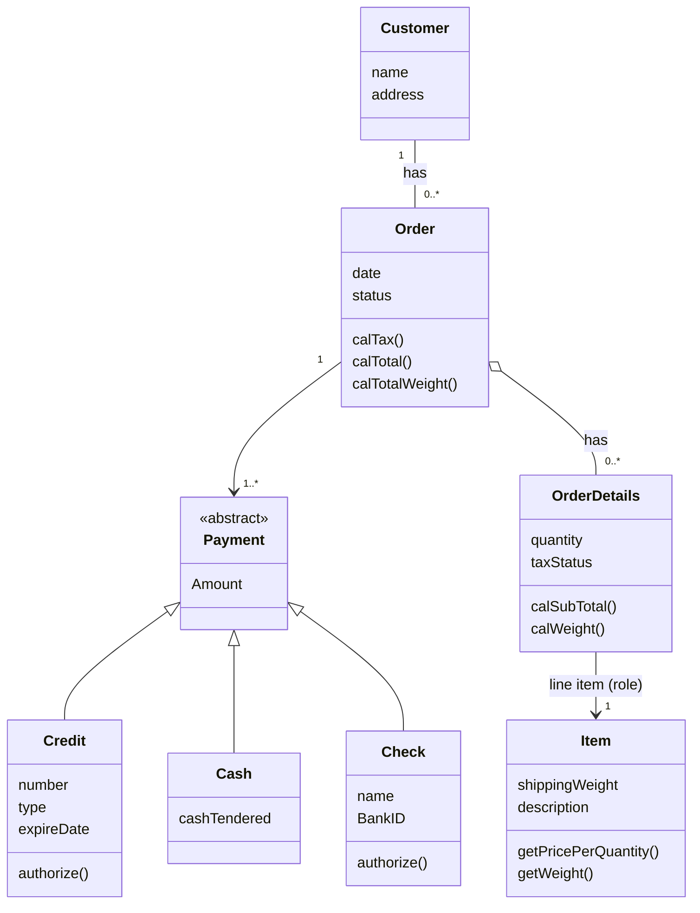
類別圖圖示一覽


### 4.1.2 類別與物件


在物件導向方法論中，物件是所有觀念的核心，因為系統的最基本組成單位是物件。相對於類別，物件是真實存在的事物，而類別是一群具有相同屬性與行為的物件的集合。類別可能是

| 型態 | 範例                                                                                   |
| ---- | -------------------------------------------------------------------------------------- |
| 物體 | 包含真實物體，如電腦、大樓、收據、人等，及抽象物體，如電腦系統內的游標、按鈕、面版等。 |
| 組織 | 如大學、公司、會計部門等。                                                             |
| 角色 | 如執行長、會計師、工程師等。                                                           |
| 概念 | 家族、流程、工作等。                                                                   |
| 事件 | 包含真實事件如選舉、意外等，及抽象事件如電腦系統內的滑鼠移動、鍵盤輸入等。             |


一般而言，類別都是名詞，具有屬性與提供服務，也具有明確定義的自身行為。但也有例外，尤其是在設計階段，為了讓系統更有彈性許多類別的宣告不一定會有屬性。我們會在稍後設計樣式的章節看到這些實例。

**物件是類別的實體**，類別則是物件的概念描述。電腦是一個類別，但你正在使用的電腦 – 一個真實存在的東西 – 是一個物件。同理，「人」是一個概念，抽象的代表一群有頭有手、能動能唱、具有思考能力的動物。人是一個類別，而「張三」，一個具體存在的事物則是人的實例，是一個物件。


Fig_類別物件可以是真實世界物體或觀念的對應


 
**類別**
 
一個類別表示一群具有相同屬性、關聯、方法及相同意義的物件。在UML中，類別用一個矩型表示，可以分為三個區塊。在分析時，並不一定要將三個區塊都劃出來。通常我們會選擇性的隱藏部份的區塊以強調特別的模組特色。每個區塊的說明如下：

- 第一區塊「==類別名稱==」是不可缺少的區塊，它的主要作用是給類別一個清楚並且容易識別的名稱，通常是個名詞，例如汽車、電腦等都是合適的類別名稱。第一區塊除了描述類別名稱外，也可以加入 stereotype 來描述這個類別是屬於哪一類型的類別。
- 第二區塊是「==屬性==」，用以描述該類別的相關屬性，例如汽車具備的屬性就有型號、汽缸數、里程數等相關的屬性。
- 第三區塊描述此類別的「==方法==」，用以描述可以作用在這個類別上的方法或此類別具備的功能。例如汽車具備發動、行駛、轉彎等方法或功能。

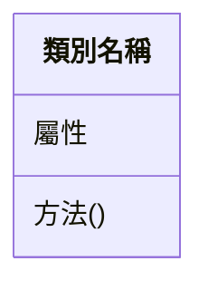
Fig_類別的宣告


**屬性**
描述一個類別的特性。一個類別可以有很多或沒有任何的屬性。一旦你定義了一個類別的屬性，此類別的所有實例將會擁有這個屬性，並遵守這些特性的限制。舉例來說，一款車(類別)有有它的長度、氣缸數、配備、最高速度等，這些都是它的特性，屬於這款車的任何一輛車(實例)都將具備這些特性，但每個特色的值可能不一樣，例如A車的最高速是100mile/hour，B車的最高速是120 mile/hour。

在UML中，屬性描述在第二個區塊。屬性的相關特性可定義如下：

`[可視性] 屬性名稱 [多樣性] [:型態] [=初始值] [{特性字串}]`

說明：在中刮號([])內的表示可有可無，例如可視性、多樣性等。屬性名稱沒有被中刮號刮起來，表示它是必要的。

以下幾個例子說明幾種類別的宣告方式：


| 宣告                    | 意義                       |
| ----------------------- | -------------------------- |
| telphone                | 只有屬性名稱               |
| +telphone               | 屬性名稱、可視性           |
| telphone: String        | 屬性名稱、型態             |
| telphone[2..4]: Port    | 屬性名稱、多樣性、型態     |
| telphone: String= null  | 屬性名稱、型態、預設名稱   |
| telphone[2..4] readOnly | 屬性名稱、多樣性、特性字串 |


在系統分析階段，通常只會有屬性名稱、型態被描述。其他特性，通常到設計階段或實作階段才作規劃。

**可視性**

可視性描述屬性是否能被其它的類別「看」的到(這是一個比較生動的字眼，真正的意義是其他類別使否能夠參考或修改此一屬性的值)。UML定義了四個可視性：


- **私有**(private)：只有該類別本身可以使用此一屬性。UML用 `-`來表示。
- **保護**(protected)：只有該屬性的後代類別(descendant of classes)可以使用此一屬性。UML用`#`來表示。
- **公開**(public)：其他類別都可以使用此屬性。UML用`+`來表示。
- **套件**(package)：同一個套件的類別可以使用此屬性。UML用`~`來表示。


<!--  -->

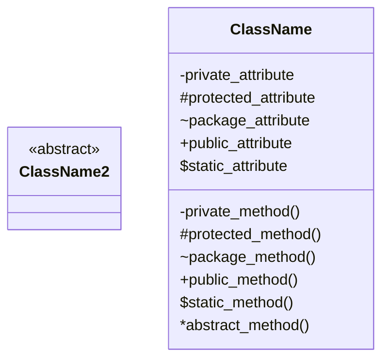

屬性與方法的可視性

 
**多樣性**
多樣性一般用於描述類別間的關聯在數量上的特性，亦可用在屬性上，用以描述一個屬性的數量。上面的範例 `telphone[2..4]` 即表示多樣性。


### 4.1.3 方法

方法用來描述一個類別的行為特性。方法通常都是動詞，代表該類別可以提供的服務。


- **功能**：執行該物件具備的功能。例如 Square 類別具有 `computeArea(int width, int height)`來計算它的面積。
- **查詢**：查詢該物件的狀態，通常以is開頭，例如在 Book 類別中定義 `isBorrowed()`來查詢一本書目前的借閱狀態。
- **狀態設定**：設定物件的值狀態，通常以set 開頭，例如 `setColor()`, `setBackground()`等。


UML中方法的宣告語法如下

`[可視性] 方法名稱 [(參數列)] [: 傳回型態] [(特性字串)]`

| 方法                           | 說明               |
| ------------------------------ | ------------------ |
| display()                      | 只有方法名稱       |
| + display()                    | 方法名稱、可視性   |
| display (i: integer, s:String) | 方法名稱、型態     |
| getPasswd(): String            | 方法名稱、傳回型態 |
| display() \{leaf\}             | 方法名稱、特性字串 |


**可視性**
可視性描述方法是否能被其它的類別「看」得到，亦即，是否可以呼叫此方法。與屬性一樣，UML對方法定義了四個可視性：


- 私有(private)：只有該類別本身可以呼叫此方法。UML用「-」來表示。請注意私有的方法是連子類別也不能呼叫使用的。
- 保護(protected)：只有該類別或其後代類別(descendant of classes)可以呼叫此方法。UML用「\#」來表示。
- 公開(public)：其他類別都可以呼叫此方法。UML用「+」來表示。
- 套件(package)：同一個套件的類別可以呼叫此方法。UML用「$\sim$」來表示。


```java
class TestVisibility {
   void testPrivateAttribute() {
      People p = new People(); //宣告一個People的類別
      p.SSN="S123456789"; //錯誤！SSN是一個私有屬性,不可以直接存取
   }
}
```


<!-- 在類別內的方法區塊中，除了描述一個個的方法外，一樣可以有stereotype來做分類。圖 \ref{fig_stereotype} 中的$\ll$ $\gg$ 表示一個 Stereotype。$\ll$ constructor$\gg$表示 \textit{Book(): void} 與 \textit{Book(name): void} 都是建構子。
 
\begin{figure}[ht]
\begin{center}
\includegraphics[width=0.4\columnwidth]{uml/stereotype.png}
\caption{刻版（Stereotype）}
\label{fig_stereotype}
\end{center}
\end{figure} -->


### 🔍 觀念測驗 4.1

1. 類別圖不能表現一個物件類別的：
    - A. 屬性
    - B. 功能
    - C. 責任
    - D. 演算法

2. 下列何者不是一個屬性的可視性?
    - A. public
    - B. private
    - C. protected
    - D. transparent

3. `+`, `-`, `#`, `~` 分別代表何種可視性？


<details>
<summary>參考解答</summary>

1. **D. 演算法** (類別圖描述靜態結構，演算法屬於動態的行為實作)
2. **D. transparent**
3. `+` (Public), `-` (Private), `#` (Protected), `~` (Package)

</details>


### ✍ 練習 4.1

**4.1.lab01: 第一個類別設計**
- 請使用 UML 設計出一個 `People` 的 class。
- 包含基本的屬性（如：姓名、年紀）與方法（如：說話、走路）。
- 請安裝 [StarUML](http://staruml.io/) 或使用 PlantUML 繪製出此圖。

<details>
<summary>參考解答</summary>

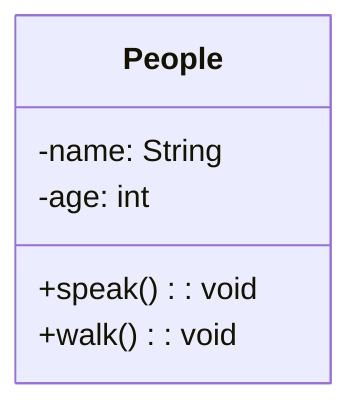

</details>

**4.1.lab02: 資料結構 Stack 的設計**
- 用 UML 描繪一個資料結構中的 **Stack**。
- Stack 具有 **先進後出** (LIFO) 的特性。 
- Stack 的屬性大小有限，通常是固定的（例如使用 `size` 與 `capacity`）。
- 包含以下方法：`Push()`, `Pop()`, `Peek()`, `IsEmpty()`, `IsFull()`。

<details>
<summary>參考解答</summary>

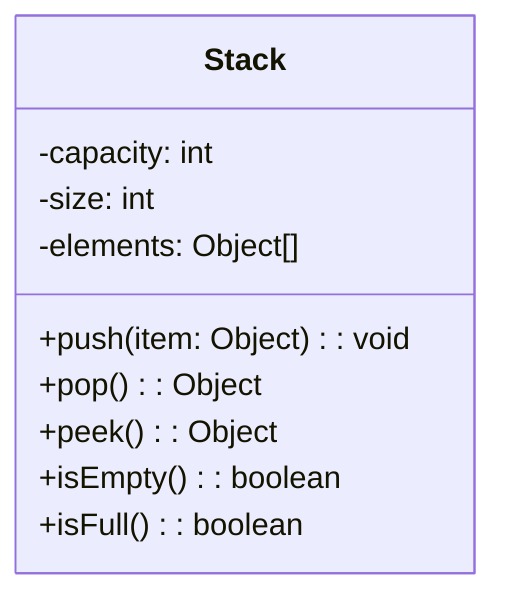

</details>

## 4.2 類別圖 II: 關係

物件不會單獨的存在，它會和系統中的其他物件產生關係。在UML中，關係（relationship）可以分為三大類：一般化關係(generalization)、關聯關係(association)與依靠關係（dependency）。
 
### 4.2.1 一般化關係

一般化關係（generalization）描述一般化事物(general element)與相對特殊事物(specific element)之間的關係。比方說**機車與汽車都是車子的一種，車子即是機車與汽車的一般化，而機車與汽車則相對性的為其特殊化}。我們稱特殊化的類別為一般化類別的子類別(subclass/child class)；反之，一般化類別為特殊化類別的父類別(superclass/parent class)。在UML中，一般化的關係用一個三角形表示，如圖所示。
 
**特殊化關係**

將一群類別共同的特性與行為抽取出來獨立成為一個類別的動作稱為一般化；反之，將一個類別分成許多子類別動作稱為特殊化。下圖中，車子可以分為卡車、腳踏車與汽車就是一種特殊化。從另一個角度來看，卡車、腳踏車與汽車都是車子，這則是一種一般化。一般化與特殊化是一體兩面、共同存在的。

在物件導向的系統設計中，我們可以先建立一個較為抽象的類別，透過特殊化逐步的建立子類別，進而完成一個類別階層(class hierarchy)；亦可以先建立一群較明細的類別並透過一般化來建立類別階層。雙方向並行的方式也是常見的。

> 一般化關係和特殊化關係式一體兩面的。

<!--  -->

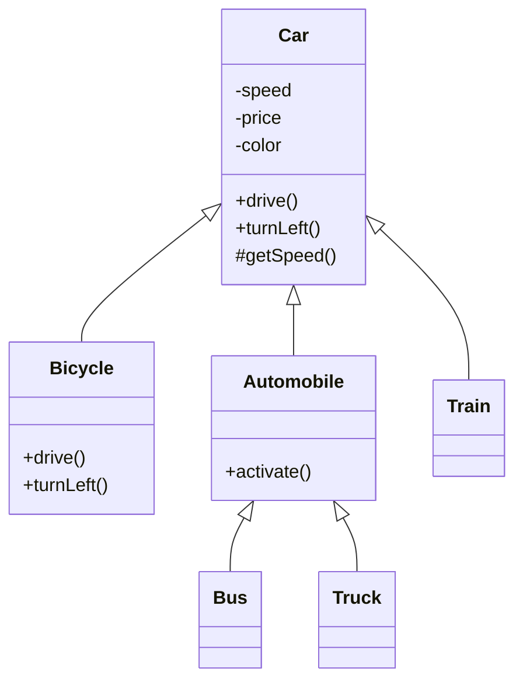

Fig: 汽車的繼承樹

**繼承**

在物件導向技術中，一般化關係伴隨著繼承（**inheritance**）的機制。繼承使得子類別擁有父類別的功能，而不需再實作一次。如汽車的例子中，當我們宣告 Bus 繼承 Vehicle時，Automobile就具備所有 Car 的特色 – 如汽缸數、速度、與價格等；也同時具備所有 VehicleCar 的功能，如啟動、開車、左右轉等。

```java
Bus b = new Bus(); //宣告一個Bus物件 b
b.turnLeft(); //儘管Bus內沒有宣告turnLeft()，它還是此功能。
```

**擴充、修改與限制**

繼承後子類別可以具備父類別的特性，並且擴充、修改或限制其父類別的功能：

- 擴充(extension)：新增功能。例如Bus在繼承Vehicle以後新增了一個 pressStopRing() 的功能。
- 修改(redefinition)：保持功能的介面，但是重新定義實作該功能的實作。例如 Vehicle有預設的 turnLeft() 的方法，但 Bus 重新定義 turnLeft() 的方法，這又稱為方法覆蓋（Override）。
- 限制(restriction)：減少功能。父類別所提供的功能不被繼承，也就是說子類別並沒有該功能。由於限制會產生許多問題，所以目前物件導向程式語言並沒有提供。


**抽象類別**
抽象類別是一種不能產生物件的類別。為什麼要定義一個不能產生物件的類別呢？
1. 我們已經建立完整的分類，所有的物件一定屬於某一類的子類別，所以不應該由父類別生成物件，因此將父類別宣告為抽象的。
2. 抽象類別訂立了其他子類別的基本規格(basic specification)，子類別必須定義部分方法的實作，特別是宣告在抽象父類別中的抽象方法。

在UML中，抽象類別的類別名稱以 `斜體` 呈現，或是加上`{abstract}`的標記。下圖中的Icon被宣告為一個抽象的類別，因為我們不希望它能夠直接生成物件：它必須透過 `RectangleIcon` 或`ImageIcon` 來生成。

<!--  -->

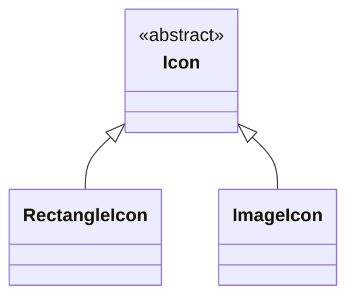

斜體字表示該類別是一個抽象類別

**抽象方法**

在 UML 中抽象方法會以 *斜體* 表示。抽象方法是定義一個沒有實作(implementation)的方法。定義抽象方法的目的是作為一個「規格」讓子類別來依循，一個具有抽象方法的類別必定存在子類別可以實作該方法。例如Car中有定義一個抽象方法`drive()`，其含意在「所有種類的車子應該具備開車功能」，而非「Car定義了drive()的方法，可讓子類別來重用」。UML以斜體字來表示抽象方法，在Car中，`drive()`、`turnLeft()`與`turnRight()`都是抽象方法，其實作留給子類別定義。以下觀念亦請注意：


- 抽象類別不能生成物件
- 具有抽象方法的類別一定是一個抽象類別
- 抽象類別不一定要是具有抽象方法


**多重繼承**

類別通常只有一個父類別，但也允許有多個父類別。在下圖中，汽車與帆船都有兩個父類別，在繼承上稱為多重繼承(multiple inheritance)。同一個類別有兩種以上的分類方式時，可以在分類的符號( )旁寫上分類的基準為何(discriminator)。在此例中，介質與動力為分類交通工具的兩個不同基準。
 

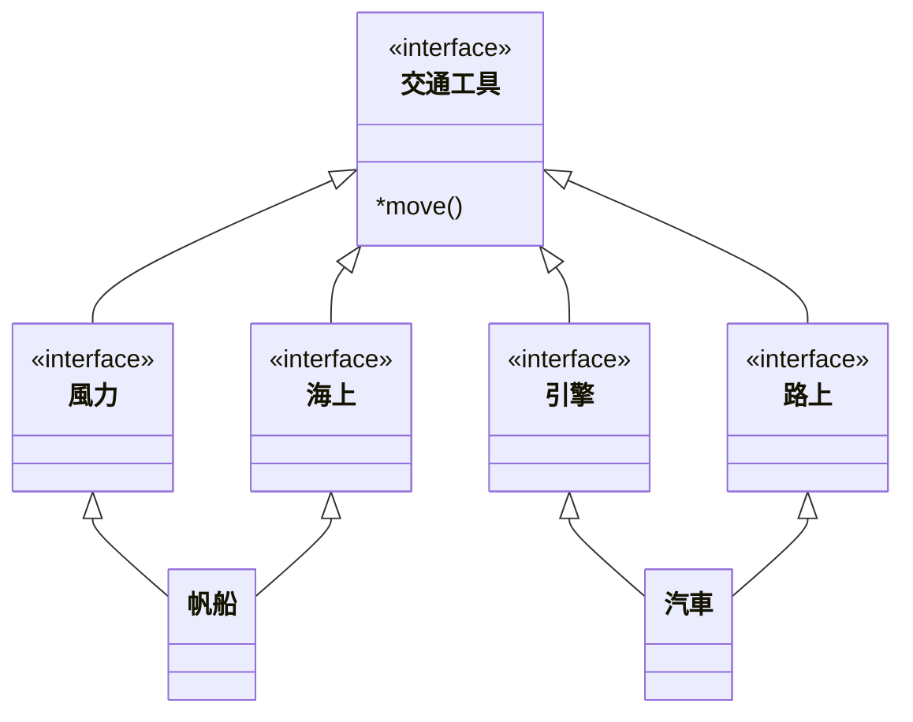

多重繼承

然而，多重繼承卻有時作上的困難。當類別C同時繼承類別A與類別B時，有可能A與B都同時有定義某個方法的實作，如此一來類別C就不知道該依循哪一個類別的實作了。Java因此並沒有直接的支援多重繼承，而是以繼承介面的方式來達到概念上的多重繼承。這是因為介面內並沒有定義實作，所以即使繼承了很多的介面，也不會有混淆的情況發生。

**多型**

多型（polymorphism）表示 many form 的意思。在物件導向的設計裡，多型表示一個方法有多種定義（形式）。多型與Overloading與Overriding 相關。Overloading表示一個相同的方法名稱可以因為參數型態的不同而有不同的定義，例如

```java
getPrice(): void
getprice(String name): void
```

`getPrice()` 有兩種不同的形式–也就是說有兩種定義。Overriding 則表示子類別可以與父類別有相同的方法、相同的參數列與相同的回傳型態（亦即重新定義父類別的方法）。在下圖中`encrypt(String)` 的方法有三種定義，分佈在父類別與子類別之中。`Document` 物件要求 `Encryption` 物件協助加密，在它的`encryptString()` 的方法中，它不需要指明到底加密者是`RSAEncryption` 或 `DesEncryption`，只需說明要送訊息給`Encryption` 的物件： 

```java
EncryptString(Encryption e) {
   result = e.encrypt(source); //加密的方法取決於 e 的型態
   …
}
```

> [!TIP]
> :basketball: Exercise: 不同種類的員工
> People 的例子中，People 分為 Engineer 和 Manager，請繪製 class diagram
> * People 有姓名，身高體重等屬性; 有獲取 bmi 的方法
> * Engineer 有專長的屬性，有加入計畫的方法
> * Manager 有部門的屬性，有加入下屬的方法

### 4.2.2 介面實作

介面定義一個規格，一個多個物件之間彼此溝通的規格，但他僅定義規格，並不描述其實作方法。UML 中的介面可以有幾種表達方式，如下圖 。


 

介面相關的圖示

---


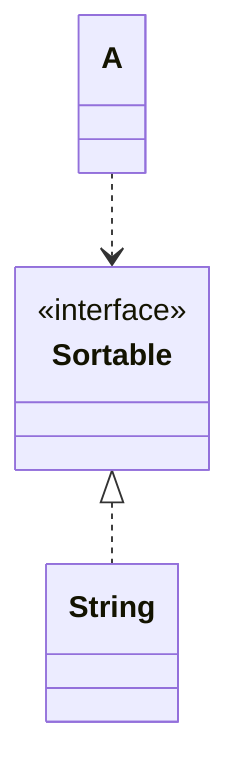

介面的使用用一條虛線的「相依性」來表達，例如 `SortedStringList` 對 `Sortable` 的引用。

### 4.2.3 關聯關係

關聯主要在描述類別間的靜態結構關係。通常關聯都是二位關聯(binary association，表示「兩個」類別間的關係)，用一條線連接兩個類別。
 

當我們用關聯將兩個類別串起來時，代表它們的物件可能在某一段時間內有關係。比方說，「人為公司工作」，人與公司是兩個類別，而「工作」就是一個關聯。


**關聯命名**

一個好的命名可以讓分析師清楚的瞭解各個類別之間的關係，通常有兩個命名的方式，一個是直接對關連命名，另一種是在關連的兩端寫上角色。
   
角色命名可以明確的指出類別在此關聯上的角色。在下圖中，Professor 與 Course 有關聯，而且 Professor 在此關聯上的角色為 instructor，表示他為此關係上的講師身分。

<!--  -->
用「角色」為關聯命名

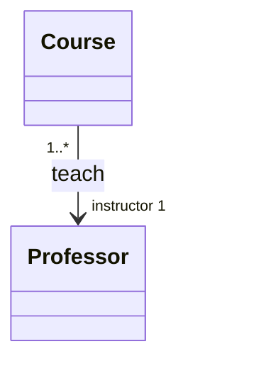

**Multiplicity**

每一個關聯的兩頭都該有一個multiplicity value描述一個物件在此關聯上可以和多少個物件相關。舉例來說，下圖表示Company在此關聯上的 multiplicity value為 0..1，其意義為「任何 Person 只能在一家公司工作，或沒有在公司工作」。Person的multiplicity value為 1..*，表示「任何公司雇用一個以上的員工」。
 
其他 multiplicity value 所代表的意義描述如下：


| 符號 | 意義                         |
| ---- | ---------------------------- |
| 1    | 恰好一個                     |
| 0..1 | 零或一                       |
| M..N | M到N個                       |
| *    | 從零到任何正整數             |
| 0..* | 從零到任何正整數(強調包含零) |
| 1..* | 從一到任何正整數             |


在分析階段考慮物件間的 multiplicity 通常只指出是一對一、多對一或多對多，至於「多」到什麼程度、用何種方式實作都並不重要。在設計階段我們卻必須考慮這些問題，過分的高估 multiplicity value 會造成效率偏低，低估卻會造成執行時的錯誤。

**關聯類別**
有時候關聯本身也有特性需要描寫。在上面的例子中，若我們需要分析每個人在公司的薪水、報到日期和職位時，就可以建立一個關聯類別：
 


**瀏覽**
在一般預設的情形下，關聯的瀏覽是雙向的，亦即關聯上的的任一物件可以「瀏覽」另一物件。但在某些情況下，我們卻希望瀏覽是單向的。在下圖 (c) 中，User 的物件可以找到相對應的 Password 物件，但卻不希望 Password 直接知道其相關的User物件為何。UML用箭頭來表示瀏覽的方向，當沒有箭頭時，則表示該關聯為雙向瀏覽。

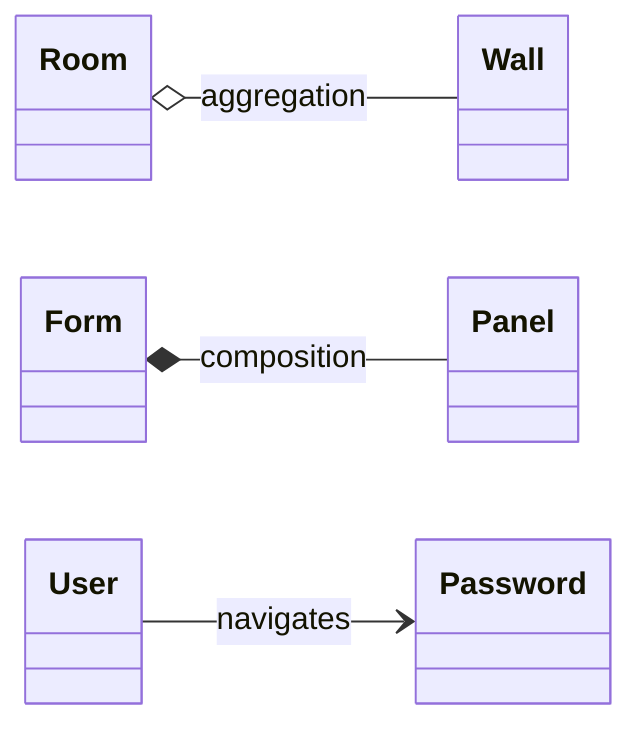

複合、包含、瀏覽關係


**Whole-Part關係**

不論在現實生活中或軟體設計上都常常可以發現「某物體B是A物體的一部份」的例子，例如引擎是車子的一部份，房間是房子的一部份，Panel 是 Form 的一部份等。這種關係過去定義為單純的Whole-Part 關係，UML更進一步的討論，將之分為複合關係（**Aggregation** ）與 包含關係（**Composition**） 關係，是管理軟體複雜性的一種重要機制。

**複合關係** 表示單純的 Whole-Part 或 Ownership (擁有) 關係，一個 Part 可以有很多個 Whole 或 Owner，而且 Part 不會因為 Whole 的消失而消失。Room 與 Wall 就是一個典型的 Aggregation 關係，因為Wall 是 Room 的一部份，但是 Wall 的生命週期並不決定於 Room 的生命週期，一個 Wall 也不僅是 Room 的一部份。
 
**包含關係** 表現一種更強烈的 Whole-Part 關係，一個 Part 僅可以屬於一個 Whole，而且 Part 會隨著 Whole 的消失而消失。例如當我們在一個 Form 中加入一個 Panel 時，就建立一個包含關係，其中 Panel 是 Part，Form 是 Whole。一個 Panel 僅可以屬於一個 Form，而且 Panel 的生命週期是跟著 Form 的。
 
複合與包含在圖形上的差別在於關係上的菱形是否為實心：**實心表示包含，空心表示複合**。他們的差別整理如下：


| 意  義 | Multiplicity                | 生命週期          |
| ------ | --------------------------- | ----------------- |
| 複合   | Part 可屬於一個以上的 Whole | 無關              |
| 包含   | Part 僅屬於一個 Whole       | Part 相依於 Whole |


Navigation、Composition與Aggregation這三個關聯是語意相異但實作相同。因為當這些關係被實作為程式碼後都是一個物件被宣告成另一個物件的屬性，在實作上無法區別他們的不同。這也是為什麼CASE (Computer-Aided Software Engineering，電腦輔助軟體工程)很難從原始碼中畫出物件導向模組的原因。

### 4.2.4 依靠關係 (use)

依靠關係（Dependency）是一種單向關係，當類別A依靠類別B時，表示B的變動可能會影響到A的行為，另一種說法是 A 使用 (`use`) B的規格。依靠關係不僅可以用在類別圖，也可以用在元件圖中表示軟體架構。在UML中，依靠關係是以有箭頭的虛線來表示。下圖表示類別 A 依存於類別 B：
 
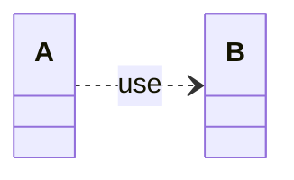

以下用學校的例子來說明依靠關係（Dependency）：

在校園系統中，老師 (`Teacher`) 在上課時需要使用到「投影機 (`Projector`)」。投影機並不是老師固有的屬性，而是老師在執行 `teach(Projector p)` 任務時臨時傳入的參數。這時 `Teacher` 類別就依賴（use）了 `Projector` 類別。

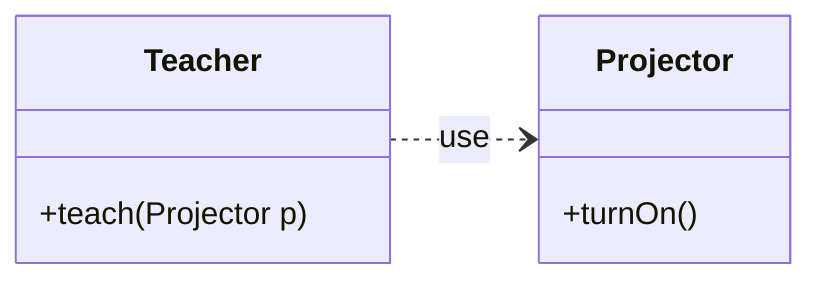

### 🔍 觀念測驗 4.2

1. **以下會印出什麼**   
```java 
public class Game {
  public static void main(String[] args) {
    ChessBoard cb = new LongChessBoard();
    cb.play();
  }
}
class ChessBoard {
   public void play() {
     System.out.println("Play Chess");
   }
}
class LongChessBoard extends ChessBoard {
   public void play() {
     System.out.println("Play LongChess");
   }
}
```

2. **以下會出現什麼訊息？**
```java
class A {
   public A() {
      System.out.println("hi");
   }
}
class B extends A {
   public B() {
      System.out.println("ha");
   }
}
public class Test {
   public static void main(String[] args) {
       B b = new B();
   }
}
```

<details>
<summary>參考解答</summary>

1. **Play LongChess** (因為多型的動態綁定機制，實際執行的會是 `LongChessBoard` 覆寫後的 `play()` 方法。)
2. **hi** 接著印出 **ha** (因為子類別 `B` 的建構子在執行前，會先隱式呼叫父類別 `A` 的對應建構子。)

</details>

### ✍ 練習 4.2

**4.2.lab01: UML 關係繪製**
拿起筆，畫出（或說明）以下的 UML 圖示：
- 繼承
- 抽象類別及抽象方法 
- 介面及介面實作
- 瀏覽關係 
- 複合關係
- 包含關係
- 依靠關係

<details>
<summary>參考解答</summary>

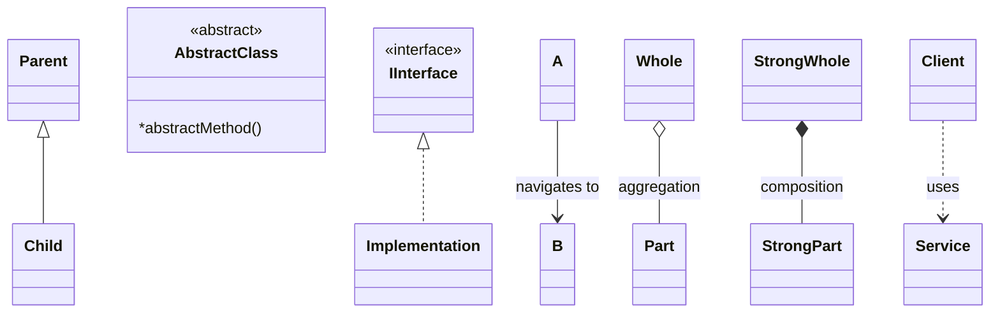

</details>

**4.2.lab02: 建立類別圖**
以 UML 工具繪製 ch02 `NNEntity` 中的類別圖。

<details>
<summary>參考解答</summary>

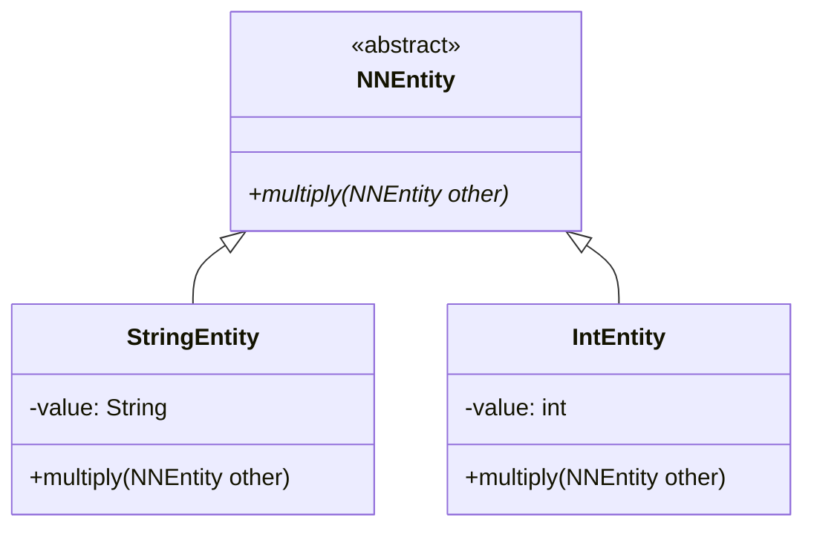

</details>

**4.2.lab03: 學校成員與課程模型**
「老師 `Teacher`」具備姓名、年資、專長等屬性，教書、改作業等方法; 「課程 `Course`」具備名稱、代號、學分數等屬性; 「學生 `Student`」具備姓名、學校、年級等屬性，具備修課、問問題等方法。 	
- 繪製這三個類別，及其屬性、方法。
- 繪製關係，使用角色命名並設定 multiplicity。
- 將老師分為專任教師(`FullTime`)兼任教師(`PartTime`)，並為兼任教師加上「學分數不可大於 6 學分」的設計註解 (Note)。

<details>
<summary>參考解答</summary>

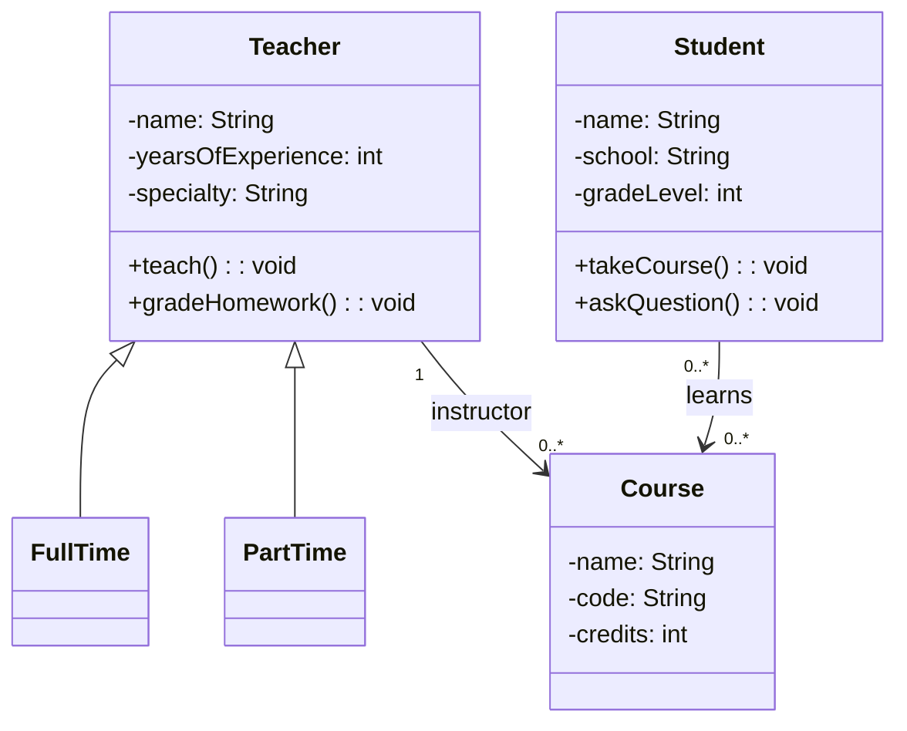

</details>

**4.2.lab04: 擴展專案與部門管理**
- 承接上題概念，加入 `Project` 與 `Department` 等 class。
- `Manager` 可以管理多個 `Project`; 一個 `Project` 只能有一個（也一定要有）`Manager`。
- 一個 `Manager` 可以管一個 `Department`。
- `Engineer` 可以加入多個 `Project`（也可以不加入）。
- 透過 UML association 描述上述敘述。

<details>
<summary>參考解答</summary>

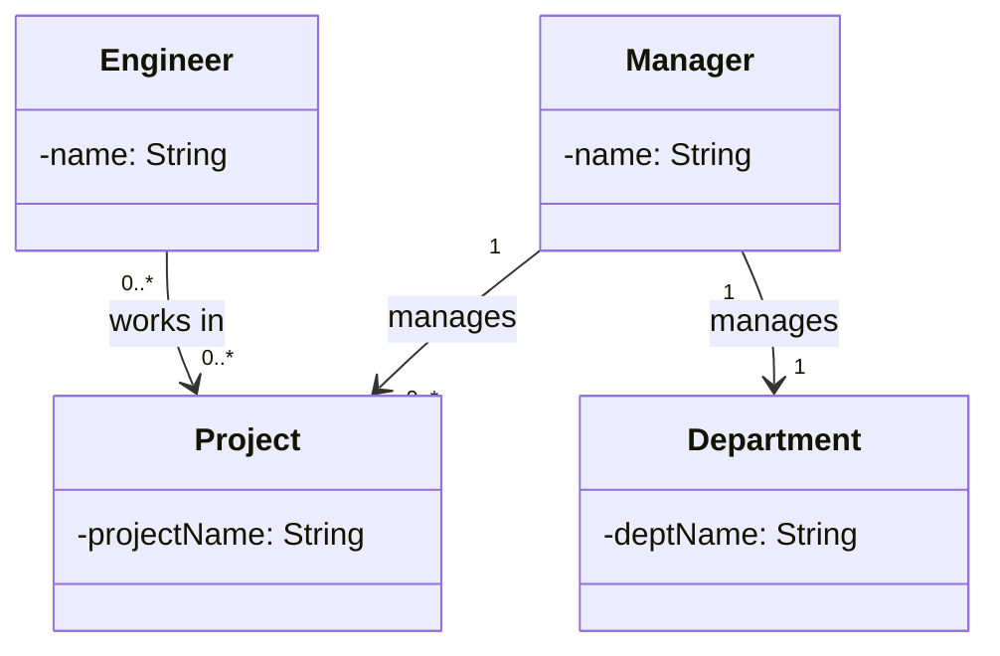

</details>

**4.2.lab05: 引入介面排序**
- 同上，因為常常要看員工和專案資料時需要排序，所以需要宣告一個 `Comparable` 的介面。
- `Project` 依據專案的進度 (progress) 來進行比較。
- `Engineer` 依據生產力來排序。
- `Manager` 依據所帶領的計畫金額來比較。
- 修改 UML 模型，加入上述必要的屬性、方法與介面實作關係。

<details>
<summary>參考解答</summary>

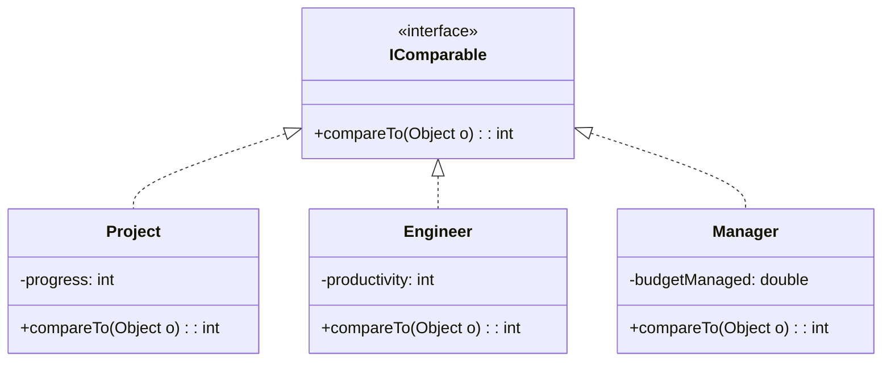

</details>

	
## 4.3 物件圖

**分類與實例化**

將一群物件依照他們的特性、行為的不同而分類分群的動作稱為分類，亦即由一群物件組複合成一個類別。反之，從一個類別生成物件的動作稱為實例化，被生成的物件稱為該類別的實例(instance)。圖中，類別與物件的「實例化」關係，可以用 `instanceOf`  來表達。

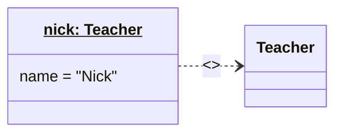

類別與物件的 UML 表示。物件有底線，類別則沒有。冒號表示物件的類別形態。`instanceOf` 表達物件與類別的關係。

### 🔍 觀念測驗 4.3

1. **類別與物件的最大差別是什麼？**
   A. 類別是具體的實例，物件是抽象的概念。
   B. 類別沒有屬性，而物件有屬性。
   C. 類別是抽象的藍圖或概念，物件是根據類別圖生成的具體實例。
   D. 類別不能有方法，物件才有方法。

<details>
<summary>參考解答</summary>

1. **C. 類別是抽象的藍圖或概念，物件是根據類別圖生成的具體實例。**

</details>


### ✍ 練習 4.3

**4.3.lab01: 描繪物件圖實例**
- 假設有一個類別叫做 `Teacher`，另一個類別叫做 `Student`。
- 現在有位名字叫 Nick 的老師，正在教導一位名叫 Albert 的學生。
- 請畫出代表此情境的**物件圖**（非類別圖）。
- 提示：在 PlantUML 中，要繪製物件圖可使用 `object` 關鍵字。

<details>
<summary>參考解答</summary>

```mermaid
classDiagram
    %% mermaid 使用 object 表示物件實例的方法並不直觀，通常以 class 來模擬物件圖
    %% 但在物件名稱上會加上底線，或呈現 "物件名: 類別名" 的形式
    
    class `nick: Teacher` {
        name = "Nick"
    }
    class `albert: Student` {
        name = "Albert"
    }
    
    `nick: Teacher` --> `albert: Student` : teaches
```

*> 備註：在標準 PlantUML 語法中，可以直接宣告 `object "nick: Teacher" as nick` 等形式表達物件圖。*

</details>

## 4.4 UML 繪圖工具比較

繪製 UML 圖的工具有很多種，主要可以分為兩類：**文字驅動（Text-based）** 與 **圖形介面（GUI-based）**。文字驅動工具讓工程師用純文字描述圖形，再自動渲染成 UML 圖，適合嵌入文件或版本控制；圖形介面工具則以拖拉方式繪製，直覺易用。

常見的工具有以下四種：**PlantUML**、**Mermaid**、**StarUML** 與 **draw.io**。

---

### 4.4.1 工具特色比較

| 工具 | 類型 | 語法難度 | 渲染方式 | 適合情境 |
|------|------|----------|----------|----------|
| **PlantUML** | 純文字 | ★★☆ | 需 Java + Graphviz | 完整 UML、HackMD、IntelliJ |
| **Mermaid** | 純文字 | ★☆☆ | 原生網頁 JS 渲染 | Markdown 文件、GitHub、HackMD |
| **StarUML** | 圖形介面 | ★☆☆ | GUI 操作 | 視覺化設計、嚴謹的 UML 繪圖 |
| **draw.io** | 圖形介面 | ★☆☆ | GUI 操作 / 網頁版 | 通用流程圖、視覺化表達、快速分享 |

---

### 4.4.2 Mermaid

Mermaid 是目前最廣泛嵌入 Markdown 的 UML 工具，**GitHub、HackMD、Notion、VS Code** 都原生支援，無需安裝任何外掛或執行環境。

**類別圖語法：**

```
classDiagram
    class Person {
        -name: String
        -age: int
        +getName(): String
        +getAge(): int
    }
    class Student {
        -studentID: String
        +enrollCourse(course)
    }
    class Course {
        -courseName: String
        -credits: int
    }
    Person <|-- Student
    Student "0..*" -> "0..*" Course : enrolls
```

**渲染結果：**

```mermaid
classDiagram
    class Person {
        -name: String
        -age: int
        +getName(): String
        +getAge(): int
    }
    class Student {
        -studentID: String
        +enrollCourse(course)
    }
    class Course {
        -courseName: String
        -credits: int
    }
    Person <|-- Student
    Student "0..*" --> "0..*" Course : enrolls
```

> [!TIP]
> **箭頭方向與版面配置：**
> Mermaid 類別圖預設由上而下（Top-Bottom, `TB`）排列。若想讓箭頭橫向呈現（由左至右），可以在 `classDiagram` 下方加上 `direction LR`。
> 例如：
> ```mermaid
> classDiagram
>     direction LR
>     Student "0..*" --> "0..*" Course : enrolls
> ```

**Mermaid 常用語法整理：**

| 語法 | 意義 |
|------|------|
| `direction LR` | 從左到右排列（預設為 TB） |
| `class Foo { }` | 宣告類別 |
| `-attr: Type` | 私有屬性 |
| `+method(): Type` | 公開方法 |
| `$attr` | 靜態屬性/方法 |
| `*method()` | 抽象方法 |
| `A <\|-- B` | B 繼承 A |
| `A <\|.. B` | B 實作介面 A |
| `A --> B` | A 瀏覽（關聯）B |
| `A o-- B` | 複合（Aggregation） |
| `A *-- B` | 包含（Composition） |
| `A ..> B` | 依靠（Dependency） |

---

### 4.4.3 PlantUML

PlantUML 是功能最完整的文字驅動工具，幾乎支援所有 UML 圖類型（類別圖、循序圖、活動圖、狀態圖等）。語法比 Mermaid 稍複雜，但表達能力更強。

**執行環境需求：**
- Java（JRE）
- Graphviz（用於佈局計算）
- IntelliJ Plugin：`PlantUML Integration`
- VS Code Plugin：`PlantUML`
- HackMD：直接支援（使用 ````plantuml` 區塊）

**相同的類別圖，PlantUML 語法：**

````
```plantuml
@startuml
class Person {
  - name: String
  - age: int
  + getName(): String
  + getAge(): int
}

class Student {
  - studentID: String
  + enrollCourse(course: Course)
}

class Course {
  - courseName: String
  - credits: int
}

Person <|-- Student
Student "0..*" --> "0..*" Course : enrolls
@enduml
```
````

> [!NOTE]
> PlantUML 在 HackMD 上需使用 ` ```plantuml ` 區塊，並且開頭要加 `@startuml`，結尾加 `@enduml`。

**PlantUML vs Mermaid 語法對照：**

| 功能 | PlantUML | Mermaid |
|------|----------|---------|
| 繼承 | `A <\|-- B` | `A <\|-- B` |
| 介面實作 | `A <\|.. B` | `A <\|.. B` |
| 關聯 | `A --> B` | `A --> B` |
| 抽象方法 | `{abstract} method()` | `*method()` |
| 靜態成員 | `{static} attr` | `$attr` |
| 多重性 | `A "1" -- "*" B` | `A "1" --> "*" B` |
| 抽象類別 | `abstract class A` | `class A { <<abstract>> }` |
| 介面 | `interface A` | `class A { <<interface>> }` |

---

### 4.4.4 StarUML

StarUML 是一套圖形化的 UML 建模工具，以拖拉方式操作，適合初學者與需要精確排版的場合。

**安裝與使用：**
- 至 [https://staruml.io/](https://staruml.io/) 下載
- 支援 Windows / macOS / Linux
- 可匯出為 PNG、SVG、PDF

**與文字驅動工具的差異：**

```mermaid
classDiagram
    class 繪圖工具 {
        <<abstract>>
        +drawDiagram()
    }
    class 文字驅動工具 {
        +語法: String
        +渲染()
    }
    class 圖形介面工具 {
        +拖曳操作()
        +匯出圖片()
    }
    class PlantUML {
        +支援全部UML圖型
    }
    class Mermaid {
        +嵌入Markdown
        +原生網頁渲染
    }
    class StarUML {
        +GUI操作
        +匯出多種格式
    }
    class DrawIO {
        +通用繪圖
        +雲端儲存
    }
    繪圖工具 <|-- 文字驅動工具
    繪圖工具 <|-- 圖形介面工具
    文字驅動工具 <|-- PlantUML
    文字驅動工具 <|-- Mermaid
    圖形介面工具 <|-- StarUML
    圖形介面工具 <|-- DrawIO
```

**使用時機建議：**

| 情況 | 建議工具 |
|------|----------|
| 撰寫 Markdown 文件（GitHub/HackMD） | **Mermaid** |
| 需要完整 UML 圖形（循序圖、狀態圖等） | **PlantUML** |
| 初選者、需要嚴謹的 UML 類別設計與精準排版 | **StarUML** |
| 需要畫通用的系統架構圖、流程圖、或非 UML 圖 | **draw.io** |

---

### 4.4.5 draw.io (diagrams.net)

**draw.io** (現改名為 diagrams.net) 是一個非常受歡迎的免費線上繪圖工具，主要優勢在於**不需要安裝**、**極度靈活**。除了標準的 UML 圖外，它還能繪製雲端架構圖、網路拓樸、流程圖等綜合性圖表。

**特色與使用：**
- **網址：** [https://app.diagrams.net/](https://app.diagrams.net/)
- 不需要註冊即可使用，支援將檔案直接存入 Google Drive、OneDrive 或本地端。
- **編輯器整合：** 提供 VS Code 外掛 (`Draw.io Integration`)，讓工程師可以直接在編輯器內畫圖並將其保存為 `.drawio` 或 `.drawio.svg`。值得一提的是，`.drawio.svg` 可以直接像一般圖片一樣顯示在 Markdown 中，但又能用 draw.io 再次開啟並編輯其中的向量結構。
| 與程式碼一起版本控制 | **Mermaid 或 PlantUML** |

---

### 🔍 觀念測驗 4.4

1. **PlantUML 和 Mermaid 最大的差異是什麼？**
    - A. PlantUML 只能畫類別圖，Mermaid 可以畫所有 UML 圖
    - B. Mermaid 可以直接在 Markdown 中渲染，PlantUML 需要 Java 環境
    - C. StarUML 是文字驅動工具
    - D. Mermaid 需要 Graphviz 才能渲染

2. **在 Mermaid 中，`A <|-- B` 代表什麼意思？**
    - A. B 擁有 A（Composition）
    - B. A 是一個介面，B 實作 A
    - C. B 繼承自 A（Generalization）
    - D. A 依賴 B（Dependency）

3. **在 Mermaid classDiagram 中，要表示靜態方法應使用什麼前綴？**
    - A. `@`
    - B. `*`
    - C. `$`
    - D. `&`

<details>
<summary>參考解答</summary>

1. **B. Mermaid 可以直接在 Markdown 中渲染，PlantUML 需要 Java 環境**
2. **C. B 繼承自 A (Generalization)**
3. **C. `$`** （`*` 是抽象方法，`$` 是靜態成員）

</details>


### ✍ 練習 4.4

**4.4.lab01: 用 Mermaid 繪製類別圖**
一個「汽車 (`Car`)」類別，包含私有屬性「廠牌 (`brand`)」、「速度 (`speed`)」，以及公開方法「加速 (`accelerate()`)」與「煞車 (`brake()`)」。
請用 **Mermaid** 語法寫出此類別圖。

<details>
<summary>參考解答</summary>

```mermaid
classDiagram
    class Car {
        -brand: String
        -speed: int
        +accelerate(): void
        +brake(): void
    }
```

</details>

**4.4.lab02: 用 PlantUML 撰寫相同的類別圖**
承上題，改用 **PlantUML** 語法撰寫相同的 `Car` 類別圖。

<details>
<summary>參考解答</summary>

````
```plantuml
@startuml
class Car {
  - brand: String
  - speed: int
  + accelerate(): void
  + brake(): void
}
@enduml
```
````

</details>

## 4. 綜合練習

### 練習 4.1 圖書管理

你受聘於一家圖書管理系統開發公司，負責設計該系統的類別結構。請根據以下需求，繪製 UML 類別圖（Class Diagram），包含適當的**類別（Class）、屬性（Attributes）、方法（Methods）**，以及類別之間的**關係（Relationships）**，例如**關聯（Association）、聚合（Aggregation）、組合（Composition）**，並標明適當的**多重性（Multiplicity）**。

**需求描述**
1. **圖書館（Library）**：
   - 圖書館管理多本書籍，每本書都有唯一的 ISBN 編號、書名、作者、出版年等資訊。
   - 圖書館內的書籍可以被借閱，每本書都有**可借閱的副本數量**。
   - 一個圖書館可以管理多個會員。

2. **會員（Member）**：
   - 會員擁有唯一的會員編號、姓名、聯絡方式等資訊。
   - 會員可以借閱書籍，但**每個會員最多只能借閱 5 本書**。
   - 會員可以查詢自己借閱的書籍清單。

3. **書籍（Book）**：
   - 書籍可以被借閱，每本書可能有多個副本（例如，書《Java Programming》可能有 3 本）。
   - 每本書由一位或多位作者所寫。

4. **借閱紀錄（Loan）**：
   - 當會員借閱書籍時，系統會產生一筆借閱紀錄。
   - 借閱紀錄包含：**借閱日期、歸還期限、是否歸還**等資訊。
   - 每筆借閱紀錄對應一位會員與一本書的副本。

5. **作者（Author）**：
   - 每位作者擁有唯一的 ID、姓名、國籍等資訊。
   - 一本書可以由多位作者共同撰寫。

**要求**
1. **根據以上需求，請繪製 UML Class Diagram，包含以下內容：**
   - **至少 5 個類別（Library、Member、Book、Loan、Author）。**
   - **標明各類別的屬性（Attributes）與方法（Methods）。**
   - **明確表示類別之間的關係（Association、Aggregation、Composition）。**
   - **標示多重性（Multiplicity），例如：1..*、0..1、1..1 等。**

2. **提示：**
   - `Library` 與 `Book` 之間是**聚合（Aggregation）**關係，因為圖書館管理書籍，但書籍本身不屬於某個特定圖書館。
   - `Library` 與 `Member` 之間是**關聯（Association）**關係，因為一個圖書館擁有多個會員。
   - `Book` 與 `Loan` 之間是**組合（Composition）**關係，因為借閱紀錄與書籍副本緊密相關，借閱紀錄不存在時，該關聯的副本也無意義。
   - `Member` 與 `Loan` 之間是**關聯（Association）**，因為會員可以借閱多本書，但最多 5 本。
   - `Book` 與 `Author` 之間是**多對多（Many-to-Many）**關係，因為一本書可以有多位作者，一位作者也可以寫多本書。

請根據上述描述，使用 UML Class Diagram 表示類別之間的關係。


---

### 練習 4.2 ♟️ 西洋棋系統 (Chess Game System)

**需求描述**
1. **棋盤與棋子**：棋盤 (Board) 由 8x8 的格子 (Square) 組成。棋盤上放有不同類型的棋子 (Piece)。
2. **棋子種類**：包含國王 (King)、皇后 (Queen)、城堡 (Rook)、主教 (Bishop)、騎士 (Knight) 與兵 (Pawn)。每種棋子有不同的移動邏輯。
3. **規則校驗**：每種棋子都應具備檢查移動是否合法 (isValidMove) 的能力。
4. **遊戲流程**：系統需記錄玩家 (Player) 的每一手移動 (Move)，並能判斷目前的棋盤狀態。

**思考與討論**

1. **誰該負責驗證移動？** 目前是由 `Piece` 負責 `isValidMove`。但某些規則（如「王車易位 Castling」或「吃過路兵 En Passant」）涉及到多個棋子的位置，這時候邏輯應該放在 `Piece` 還是 `Board` 比較合適？
2. **座標的設計 (Square)** 為什麼要建立 `Square` 類別，而不是直接在 `Board` 用一個二維陣列 `Piece[][]` 存就好？建立 `Square` 物件對「擴充格子屬性」（如格子的顏色、是否被威脅）有什麼幫助？
3. **單一職責原則 (SRP)** `ChessGame` 應該負責判斷「勝負」嗎？還是應該有一個獨立的 `RulesEngine` 類別來執行複雜的裁判邏輯？
4. **不可變性 (Immutability)** 如果我們把 `Move` 設計成不可變物件 (Immutable Object)，對記錄棋局歷史與防止錯誤修改有什麼好處？
5. **多重性的精確度** 圖中 `Board` 包含 `64` 個 `Square`。如果我們要設計其他棋類（如 19x19 的圍棋），我們的類別圖該如何調整以增加重用性？

---

### 練習 4.3 🏫 校園管理系統 (School Management System)

**需求描述**
1. **學校組成**：學校包含多個系所，系所下有老師與課程。
2. **成員管理**：所有成員（學生、老師）都有 ID、姓名與加入日期，且能以統一的介面顯示資訊。
3. **授課與選課**：老師可以開設多門課程，學生可以選修多門課程。
4. **成績系統**：老師負責為學生打分數，成績物件記錄了分數及其所屬的課程。

**思考與討論**

1. **關聯 vs. 屬性 (Association vs. Attribute)** 為什麼 `Teacher` 不直接把 `department` 當成一個 `String` 屬性，而要建立跟 `Department` 類別的關聯？這對系統的靈活性（例如統計系上老師人數）有什麼影響？
2. **多重性 (Multiplicity) 的抉擇** 在圖中，一個課程可以有多少學生？如果我們想規定「每門課最少 5 人，最多 50 人」，UML 該如何標示？
3. **介面的擴充性 (Interface)** 如果未來我們加入「校園設備 (Equipment)」（如投影機、冷氣），它們也需要被管列並顯示資訊，我們該如何運用現有的 `Displayable` 介面？
4. **生命週期的考量 (Lifecycle)** 為什麼 `School` 與 `Department` 之間適合用 **組合 (Composition)**，而 `Department` 與 `Course` 之間用 **聚合 (Aggregation)** 可能更好？這與真實世界的運作邏輯有什麼關聯？
5. **繼承與其副作用** 雖然 `Student` 繼承自 `SchoolMember` 很直觀，但如果一個學生同時也是兼職助教 (TA)，既是學生又是老師，現有的繼承架構會遇到什麼問題？（提示：單一繼承與角色切換的困境）

---

### 練習 4.4 🎮 遊戲戰鬥系統 (Game Combat System)

**需求描述**
1. **角色管理**：系統中有英雄 (Hero) 與怪物 (Monster)。兩者皆具備生命值 (HP) 與等級 (Level)。
2. **戰鬥能力**：所有能參與戰鬥的單位都必須具備「攻擊 (attack)」與「受傷 (takeDamage)」的行為。
3. **武器系統**：英雄可以裝備一種武器 (Weapon)。武器有多種類型（如 Sword, Bow），不同的武器會影響攻擊的方式與傷害。
4. **坐騎與獎勵**：英雄可以選擇帶領一個坐騎 (Mount)，如馬 (Horse) 或巨狼 (Wolf)；當怪物被擊敗時，會掉落獎勵 (Reward)，內含金幣 (Gold) 與掉落物 (Loot)。

**思考與討論**

1. **角色切換的困境** 如果遊戲中有一種「受感染的英雄」，他既有英雄的技能，又像怪物一樣會主動攻擊玩家。在現有的繼承架構下（`Hero` 與 `Monster` 為平級子類別），該如何處理這種「雙重身份」？
2. **多重性的真實含義** 圖中 `Hero` 到 `Weapon` 的多重性是 `0..1`。這代表什麼？如果遊戲允許「雙劍流」，多重性該如何修改？這會對 `Hero.attack()` 的實作產生什麼衝擊？
3. **裝備的相依性** 目前 `Weapon` 是獨立的。如果某些強大的武器只有「等級 > 50」的英雄才能使用，這種「限制」應該寫在 `Weapon` 裡，還是 `Hero` 的 `equip()` 方法裡？為什麼？
4. **坐騎的行為** 現在的 `Mount` 只是英雄的一個屬性。如果坐騎也能升級、甚至能幫忙攻擊（具備 `Combatant` 特性），我們的類別圖該如何調整？
5. **死亡邏輯的設計** 當 `takeDamage` 導致 `hp <= 0` 時，誰該負責觸發 `Reward` 的掉落？是 `Monster` 類別自己，還是外部的 `CombatSystem`？這牽涉到物件的「封裝」與「職責分配 (Responsibility Assignment)」。

### 練習 4.6 其他
選擇以下系統，繪製其類別圖
* Ace 網球會員管理系統
* HappyBear 訂餐系統
* ezGo 旅遊規劃系統
* 喀嚓 相機租借系統
* ShowShow 電影訂位系統
* 逢大 選課系統
