###### tags: `OOSE`

# Ch05 動態圖模

## 5.1 功能情境：使用案例圖

使用案例圖（Use Case Diagram）在軟體工程的功能設計中扮演著極為重要的角色。它的主要目的是從「使用者」的角度出發，釐清系統應該提供哪些價值與功能。

使用案例的目的如下：
- **溝通需求**：幫助開發者與客戶在需求討論階段達成共識。
- **界定邊界**：清楚劃分哪些是系統內部的責任，哪些是外部環境（使用者或設備）。
- **引導開發**：作為後續系統設計與軟體測試案例設計的重要依據。
- **描述互動**：描述系統與使用者之間的互動情境、案例與順序。

以下我們將以「大學選課系統」為貫串本章的主力案例，帶您認識使用案例圖。

### 5.1.1 核心觀念：以大學選課為例

使用案例圖包含以下幾個核心觀念，我們以選課情境來逐一對應：

1. **角色 (Actor)**
   系統的外部參與者，在 UML 稱為 Actor。Actor 不一定是「人」，它也可能是另一個系統或硬體設備。
   要注意 Actor 扮演的是「角色」而非特定個體（例如 John 同時是學生也是職員，在選課時他扮演的是學生角色）。在選課系統中，主要與之互動的角色包含了「學生 (Student)」與「老師 (Teacher)」。
   
   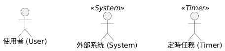
   <br>(圖解：Actor 的幾種常見呈現方式)

   [📄 PlantUML 原始碼](img/actor_types.puml)


2. **使用案例 (Use Case)**
   描述一個角色使用系統所進行的一段「互動過程」或達成的目標。例如老師可以「開課 (Offer Course)」與「評分 (Score)」；學生可以「選課 (Take Course)」與「查詢成績 (List Grade)」。

3. **包含關係 (Include)**
   當多個使用案例有一段共同的必要流程時，我們可以將其獨立成一個使用案例，並使用 `<include>` 指向它，目的是降低重複的描述。例如：無論是「選課」還是「查詢成績」，都必須先經過「判斷登入狀態 (Check Login)」。

4. **擴充關係 (Extension)**
   用來表示在特定條件下才會發生的「額外或例外處理」。例如：學生在「選課」時，如果名額已滿，就會觸發一個延伸的「名額已滿處理 (Handle Full Capacity)」，這樣的好處是不會讓基本的選課順序顯得過度複雜。

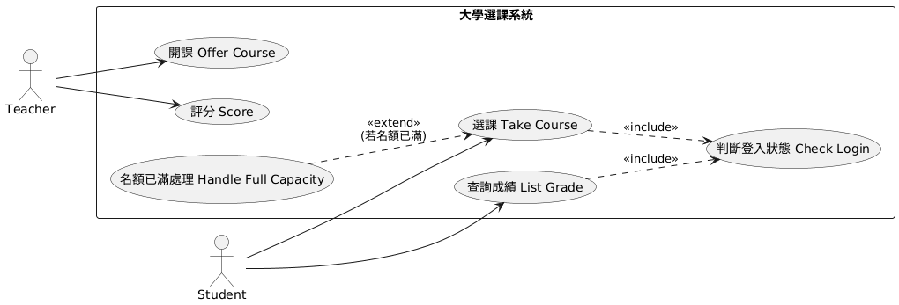
<br>(圖解：大學選課系統使用案例圖)

[📄 PlantUML 原始碼](img/use_case_course.puml)


### 5.1.2 使用案例描述 (Use Case Description)

圖形雖然能讓我們一目了然地看清系統功能，但缺乏了互動的細節。因此在設計中，通常每個圖中的氣泡（Use Case）都會搭配一份「使用案例描述 (Use Case Description)」。

使用案例描述可以用口語或表單文字定義互動的步驟。以下我們以 **選課 (Take Course)** 這個使用案例為例，給出結構化的描述：

- **ID**: UC001
- **名稱**: 選課
- **參與角色**: 學生 (Student)
- **前置條件**: 
	- 目前系統處於開放選課期間。
- **後置條件**: 學生的選課清單中加入該門課程，該課程的選課人數增加。
- **事件流**:
	1. 學生要求系統列出所有開設的課程。
	2. 系統顯示課程列表與目前的選課剩餘名額。
	3. 學生選擇要加入的課程。
	4. (Include) 系統執行 `判斷登入狀態`。
	5. 系統檢查名額是否已滿。
	6. 系統將課程加入學生的清單中。
	7. 系統顯示選課成功訊息。
- **例外**:
    - **名額已滿**：觸發 `名額已滿處理` (Extension)，系統提示名額已滿，拒絕加入。


事件流也可以使用兩欄式的方式表示：

| 系統 (System) | 使用者 (User) |
| :--- | :--- |
| 1. 顯示課程列表與剩餘名額 | 1. 要求系統列出所有開設的課程 |
| 2. 檢查名額是否已滿 | 2. 選擇要加入的課程 |
| 3. 將課程加入選課清單 | 3. 收到選課成功訊息 |

> **💡 規劃使用案例時注意：**
> - 使用案例不是流程圖。許多人會把使用案例圖當成資料處理的先後順序，這是錯誤的。
> - 使用案例不是單一功能，而是一個**具備完整目的的互動情境**。
> - 使用案例名稱通常是**動詞短語**。
> - 從「成功的情境（Happy Path）」開始描述事件流，再逐步找出可能的例外。

### 5.1.3 範例：自動售票機

先描述正常順利的情境，再描述例外狀況。

- **ID**: UC201
- **名稱**: 買票
- **參與角色**: 乘客
- **前置條件**: 乘客站在售票機器前。
- **後置條件**: 乘客取得票。
- **事件流**:
	1. 乘客選擇要前往的地方。
	2. 機器顯示需要的金額。
	3. 乘客投入錢。
	4. 機器找錢。
	5. 機器吐出票。	
- **特別需求**:
    - 效能: 必須要能在一秒內吐票。
	- 正確性：錢幣或紙鈔的辨識精準度必須高於 99\%。
- **例外**:
    - 沒有零錢：機器沒有零錢可找，請參考另一個延伸情境 UC201a。
	- 超時：乘客超過一分鐘沒有動作，請參考另一延伸情境 UC201b。
    - 票券卡紙：機器無法印票，提示維修人員。
    - 信用卡授權失敗：付款失敗，取消交易並退回卡片。
    - 零錢不足：投入金額不足以支付且乘客無後續動作。

透過 `<<extend>>` 畫出例外狀況：
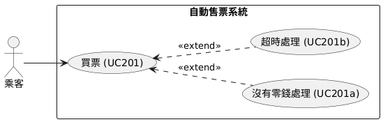
<br>(圖解：自動售票機之擴充關係範例)

[📄 PlantUML 原始碼](img/use_case_ticket.puml)

### 5.1.4 隨堂測驗

1. 在使用案例圖中，哪一項最適合用來代表外部系統或人類使用者？
   (A) 使用案例 (B) 系統邊界 (C) 角色 (D) 關係
   <details><summary>解答與解析</summary>
   **(C) 角色 (Actor)**。Actor 代表與系統互動的實體，有時不一定是人類，也可能是硬體設備或其他系統。
   </details>
2. 使用案例之間的 "include" 關係，主要目的是什麼？
   (A) 降低重複的描述 (B) 表示例外狀況 (C) 定義前置條件 (D) 繪製流程圖
   <details><summary>解答與解析</summary>
   **(A) 降低重複的描述**。將共用的流程抽取出來，被多個使用案例「包含」，以達到流程重用的目的。
   </details>
3. 關於使用案例描述的「例外 (Exception)」條件，下列何者正確？
   (A) 描述基本成功流程 (B) 描述發生錯誤或無法滿足前置條件時的流程 (C) 描述包含關係的流程 (D) 描述系統效能需求
   <details><summary>解答與解析</summary>
   **(B) 描述發生錯誤或無法滿足前置條件時的流程**。例如選課時碰到名額已滿，系統提示並拒絕加入的操作。
   </details>

### 5.1.5 小節練習

- 關於 YouBike 的租借使用，(1) 找出 actor, 繪製使用案例圖; (2) 針對使用案例圖內的使用案例，應用兩欄式使用案例描述之。

## 5.2 動態行為：狀態圖

狀態圖是用來描述「單一物件」的生命週期與行為。這裡所謂的行為，是指物件在不同階段如何處理與回應系統事件。狀態圖主要是由**狀態 (State)** 與**狀態轉移 (Transition)** 所構成。

在系統中，並非所有的物件都需要畫狀態圖。我們通常只針對具備「明顯狀態性 (Stateful)」且行為會依內部狀態不同而改變的物件建立狀態模組。

延續大學選課的案例，我們把焦點放在**「課程 (Course)」**這個物件上。一門課程從無到有，通常會經歷幾個明顯的狀態變化：

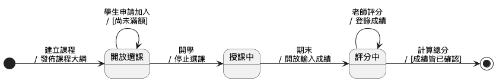
<br>(圖解：大學選課系統中「課程」物件的狀態圖)

[📄 PlantUML 原始碼](img/state_course.puml)

### 5.2.1 狀態 (State)

狀態通常代表物件經歷了一段較長的時間。例如，課程在「授課中」或是「開放選課」通常會經歷數天甚至數週。

- **狀態必須是對系統有意義的**：課程可能還有「老師備課中」、「教室打掃中」等狀態，但這些對軟體的「選課邏輯」並不重要，因此不需被模組出來。
- **狀態與屬性息息相關**：物件的狀態往往可由其中某些屬性值來判定。例如，課程的「開放選課」狀態，可能對應著其物件屬性 `status = "OPEN"`。另外，同樣的「加入選課清單」事件，唯有在課程處於「開放選課」狀態時才會有反應；若在「結業」狀態下發出選課事件則不會被受理。這就是狀態與物件行為的關聯性。狀態在 UML 中用圓角方形表示。

### 5.2.2 狀態轉移 (Transition)

只有狀態是沒辦法完整描述行為的，物件會因為接收到特定的「事件」並做完對應的處理後，轉移到下一個狀態。

> 一個物件在「原始狀態」時，接收到「驅使事件」且滿足「轉移條件」，就會執行「行動」，最後轉移到「目的狀態」。

轉移通常用帶有方向的箭頭表示。以課程進入 `開放選課` 到 `授課中` 的這段轉移為例：
- **原始狀態 (Source State)**：轉移前的狀態（例如：開放選課）。
- **驅使事件 (Event Trigger)**：促使狀態改變的事件（例如：發生了「開學」這件事）。事件發生可以是瞬間的。
- **轉移條件 (Guard Condition)**：以 `[condition]` 表示。必須滿足這個條件，轉移才會成立（例如上述圖中的 `[尚未滿額]` 就是轉移條件，滿足條件才能繼續加選）。
- **行動 (Action)**：在 UML 用 `/` 區隔在事件之後，代表轉換當下執行的瞬間邏輯（例如：停止選課）。
- **目的狀態 (Target State)**：轉移後進入的新狀態（例如：授課中）。

### 5.2.3 隨堂測驗

1. 何者較不適合作為物件的一個「狀態」？
   (A) 閒置中 (B) 授課中 (C) 按下按鈕 (D) 歸檔中
   <details><summary>解答與解析</summary>
   **(C) 按下按鈕（或輸入特定指令）**。這通常是一瞬間發生的「事件(Event)」，而不是會持續一段時間的「狀態(State)」。
   </details>
2. 下列哪一項不是狀態圖中「狀態轉移(Transition)」的必備或常見元素？
   (A) 驅使事件 (B) 轉移條件 (C) 行動 (D) 參與者
   <details><summary>解答與解析</summary>
   **(D) 參與者(Actor)**。狀態轉移通常由「驅使事件、轉移條件、行動、目的狀態」所構成，Actor 是使用案例圖的元素。
   </details>

### 5.2.4 練習題

1. 狀態圖主要表現系統的 (1) 功能 (2) 操作情境 (3) 行為 (4) 物件結構。
2. 考試系統中有以下的狀態：建立考試、設定考題、發佈、考試中、關閉。請畫出狀態圖，做必要的假設以添加狀態。
3. 打電話的情境大概如下：拿起電話、撥打電話、接通、開始講話、掛電話。中間有些例外，例如拿起電話太久沒有撥號，就會出現錯誤訊息無法打了。以家中電話為例，繪製其狀態圖。


## 5.3 物件互動：循序圖

當我們透過使用案例描述了「系統要做什麼」，並在狀態圖中分析了「單一物件的屬性變化」後，下一步往往就是釐清**「多個物件之間是如何透過訊息傳遞合作完成一個使用案例的情境」**。

循序圖（Sequence Diagram）就是用來表達這種動態物件生命週期與訊息順序的最佳工具。

### 5.3.1 核心觀念：以選課互動流程為例

以下是一段操作大學選課系統物件的 Java 程式碼。這段程式碼建立了一所大學，聘用老師、招收學生，進行開課、選課，最後由老師打分數並印出成績：

```java
University fcu = new University("FCU");
Teacher nick = new Teacher("Nick");
Student albert = new Student("albert");
Student jie = new Student("jie");

fcu.hire(nick, "t01");
nick.offer(java);
albert.enter(fcu, "s01");
jie.enter(fcu, "s02");
fcu.showMembers();
fcu.showCourses();

albert.takeCourse(java);
jie.takeCourse(java);

nick.score(java, jie, 90);
nick.score(java, albert, 100);

fcu.listGrade();
fcu.showTop();
fcu.showNoPass();
```

如果我們要將上述這段程式碼的執行順序進行視覺化拆解，我們可以畫出以下的循序圖：

以下先以類別圖呈現本範例的物件結構，再對應查看循序圖中各物件的互動關係：

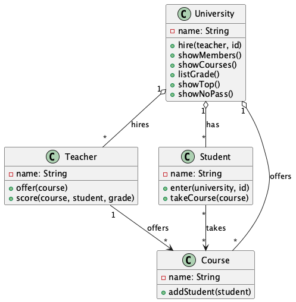
<br>(圖解：選課系統類別圖——對照循序圖中各物件的角色)

[📄 PlantUML 原始碼](img/class_course.puml)

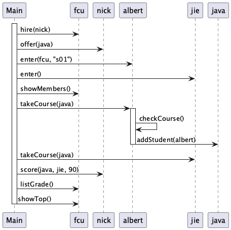
<br>(圖解：選課系統物件互動循序圖)

[📄 PlantUML 原始碼](img/sequence_course.puml)

在這張圖中，我們可以看到循序圖的幾個核心元素：

- **參與物件 (Participant / Object)**：位於圖表最上方，參與此流程的個體。在圖中有 `Main`, `fcu`, `albert`, `java` 等物件。
- **生命線 (Lifeline)**：從物件下方垂直延伸的虛線，代表該物件在一段時間內的生命歷程。循序圖是「由上往下」沿著生命線閱讀的，高度落差代表著訊息發生的先後順序，因此不需要額外標示 1, 2, 3 等數字序號。
- **訊息傳遞 (Message)**：水平的箭頭線段代表著物件間的方法呼叫。實線往往是「發送訊息 (呼叫函數)」，向後折返的虛線則通常代表「回傳值 (Return Data)」。
- **活化段 (Activation)**：生命線上長方形的條塊。當 `Main` 呼叫 `albert.takeCourse(java)` 時，圖上畫出了一塊 `albert` 的活化段，這代表執行權移交給了 `albert`；直到 `albert` 處理完 `checkCourse()` 與對 `java` 發出 `addStudent` 後，活化段才結束，代表將控制權交還給 `Main`。請注意，活化段的長短僅代表執行權的轉移順序，並不代表真實執行所花耗的時間長短。

### 5.3.2 範例：象棋系統

下圖是部分象棋系統的循序圖，描述一個玩家先建立一個棋局遊戲 ChessGame, 接著另一個玩家加入。加入後 ChessGame 會建立 ChessBoard 來呈現整個棋盤，玩家接著對棋盤做互動，互動的事件會由棋盤轉換為對 ChessGame 有意義的指令，ChessGame 每一次做動作都會進行 checkWinner 來檢查是否勝負已定，如果已定就會傳訊息給 ChessBoard, 接著由 ChessBoard 公布訊息給玩家。

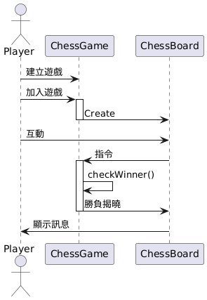
<br>(圖解：象棋系統之物件互動循序圖)

### 5.3.3 隨堂測驗

1. 循序圖主要的目的是用來表達什麼？
   (A) 物件靜態結構 (B) 物件間訊息傳遞先後順序 (C) 單一物件屬性變化 (D) 系統功能需求
   <details><summary>解答與解析</summary>
   **(B) 物件之間訊息傳遞的先後順序**。循序圖透過生命線與箭頭，強調系統的動態互動過程。
   </details>
2. 循序圖中垂直的虛線代表什麼？
   (A) 活化段 (B) 訊息傳遞 (C) 生命線 (D) 物件邊界
   <details><summary>解答與解析</summary>
   **(C) 生命線 (Lifeline)**。用來代表物件在一段時間內的生命週期或參與互動的範圍。
   </details>
3. 若要呈現一個方法有「回傳值」，在 UML 循序圖中通常如何表示？
   (A) 帶有箭頭的虛線 (B) 實線箭頭 (C) 粗實線 (D) 雙箭頭
   <details><summary>解答與解析</summary>
   **(A) 使用帶有箭頭的虛線 (Dashed line with arrow)**。向後帶有箭頭的虛線通常代表 return message。
   </details>

### 5.3.4 小節練習

- 考慮以下的程式，繪製其循序圖
```java
public class BillingDialog {
   public static void main(String[] args)    {
        Bill yourBill = new Bill( );
        yourBill.inputTimeWorked( );
        yourBill.updateFee( );
        yourBill.outputBill( );
     }
}
public class Bill {
    public static final double RATE = 150.00;     
    private int hours, minutes;
    private double fee;
    public void inputTimeWorked( )     {
        System.out.println("請輸入工作幾小時幾分鐘（空白分開）");
        Scanner keyboard = new Scanner(System.in);
        hours = keyboard.nextInt( );
        minutes = keyboard.nextInt( );
    }
    private double computeFee(int hoursWorked, int minutesWorked)    {
        minutesWorked = hoursWorked*60 + minutesWorked;
        int quarterHours = minutesWorked/15; 
        return quarterHours*RATE;
    }
    public void updateFee( ) {
        fee = computeFee(hours, minutes);
    }
    public void outputBill( )   {
        System.out.println("你工作了" + hours + " 小時" + minutes + " 分鐘");
        System.out.println("共賺 " + fee +" 元");
    }
}
```

## 5.4 流程設計：活動圖

活動圖 (Activity Diagram) 主要是用來表達**流程邏輯**。它與常見的流程圖（Flowchart）非常相似，常被用來描述包含循序執行、判斷條件（Decision）、以及並行處理（Fork/Merge）的運作順序。

### 5.4.1 核心觀念：以大學選課流程為例

針對學員選課的「流程」，我們可以使用活動圖來描繪。活動圖極度適合用來表達像「判斷名額是否已滿」這類的商業邏輯運作過程。

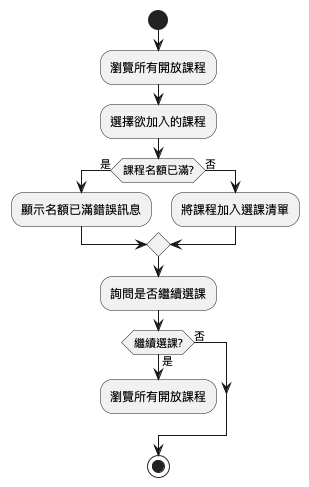
<br>(圖解：選課流程活動圖)

[📄 PlantUML 原始碼](img/activity_course.puml)

在上面的選課流程圖中，展示了活動圖的幾大元素：
- **起始點與終點 (Start / Stop)**：圖中的圓角端點，標示著整個流程的進入點與離開點。
- **處理動作節點 (Action Node)**：圖中的方形節點，如 `[瀏覽所有開放課程]`，代表流程中的一個具體操作。
- **條件判斷 (Decision)**：圖中的菱形節點 `{課程名額已滿?}`。當流程走到此處時，會依據條件分支（通常標示 Yes/No）走入不同的路線。

### 5.4.2 延伸範例與進階觀念

活動圖不僅能處理單一線程的決策，也能處理多線程的**並行活動**。

#### A. 條件判斷 (Decision) 
除了前面的標準選課流程，這裡展示了一個「申請限修課程」的決策邏輯：學生提交申請後，系統會判斷是否為限修課程，若是則需經過人工審核。

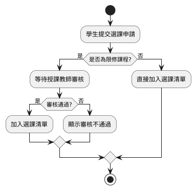
<br>(圖解：選課決策流程活動圖)

[📄 PlantUML 原始碼](img/activity_decision_course.puml)

#### B. 分支與合併 (Fork & Merge)
`Fork` 可以將單一流程切分為多支平行的、同時發生的子流程；`Merge` 則會等待這些平行的流程「全都完成」後，才繼續往後執行。下圖展示了「畢業資格審查」的並行作業：
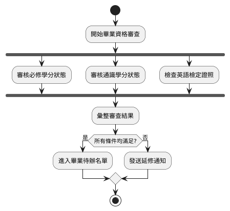
<br>(圖解：並行處理之 Fork 與 Merge 範例)

[📄 PlantUML 原始碼](img/activity_fork_merge_course.puml)

下圖則是結合了泳道（Swimlanes）的「新開課程審核流程」。泳道清楚劃分了授課教師、系辦公室與教務處各自負責的工作，讓跨單元的流程協作一目了然：
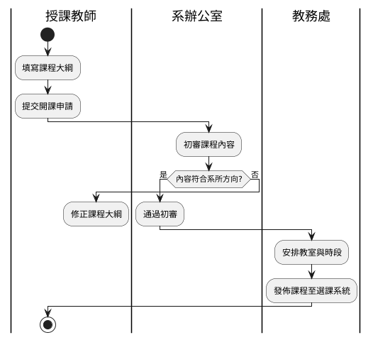
<br>(圖解：跨角色之泳道活動圖)

[📄 PlantUML 原始碼](img/activity_swimlane_course.puml)

---

### 5.4.3 隨堂測驗

1. 活動圖（Activity Diagram）主要是用來表達下列何者？
   (A) 物件靜態結構 (B) 流程邏輯 (C) 訊息傳遞順序 (D) 物件生命週期
   <details><summary>解答與解析</summary>
   **(B) 流程邏輯**。適合用來描述具有判斷邏輯（Decision）或並行處理（Fork/Merge）的運作順序。
   </details>
2. 在 Mermaid 的活動圖（Flowchart）中，菱形 `{ }` 代表什麼意思？
   (A) 起始點 (B) 處理動作 (C) 條件判斷 (D) 終止點
   <details><summary>解答與解析</summary>
   **(C) 條件判斷 (Decision)**。用來判斷不同路線的走向（例如：是否繼續、名額是否已滿）。
   </details>
3. 關於 Fork 與 Merge，下列敘述何者最適當？
   (A) Fork 將流程切分為多個並行活動，Merge 等待並行活動完成後再繼續 (B) Fork 是條件判斷，Merge 是結束點 (C) Fork 會終止流程，Merge 會重啟流程 (D) 兩者皆為循序處理
   <details><summary>解答與解析</summary>
   **(A) Fork 將流程切分為多個並行活動，Merge 等待並行活動完成後再繼續**。
   </details>


## 5.5 綜合

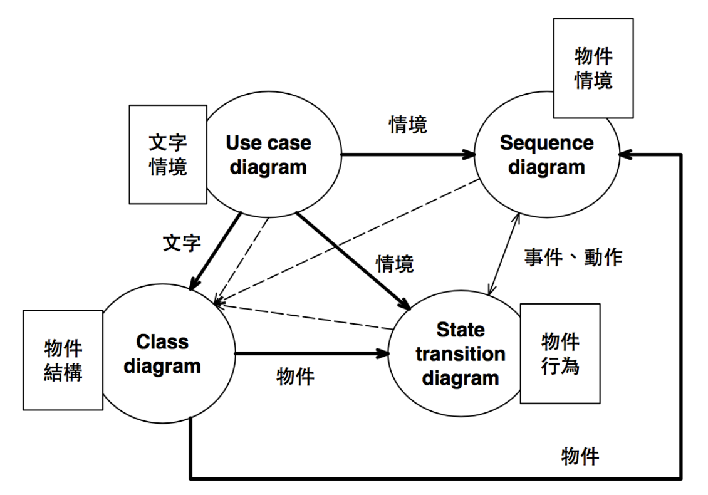
<br>(圖解：動態圖模三劍客之關係總結)
