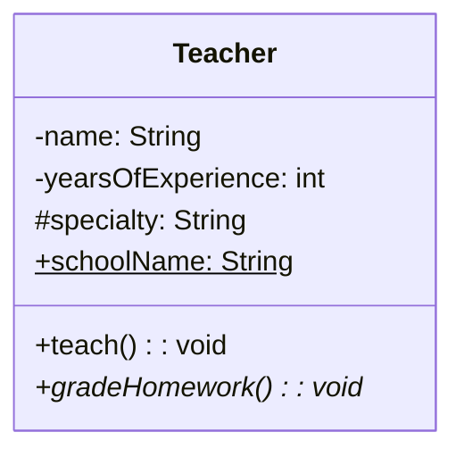
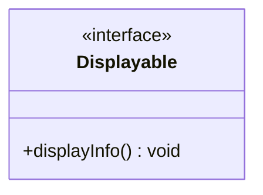
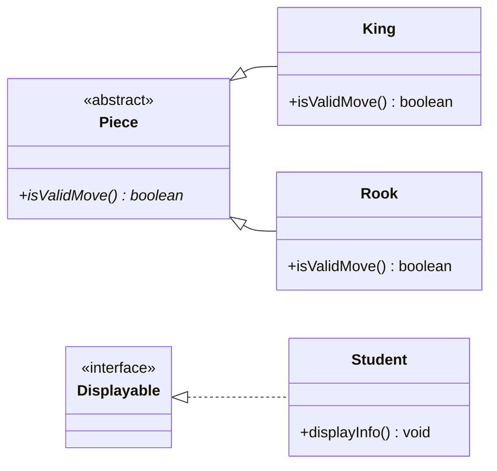
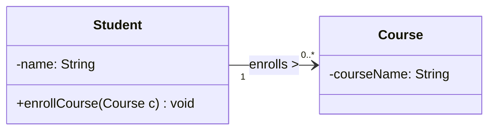
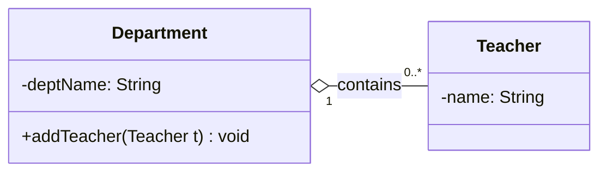
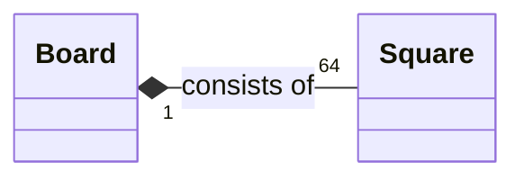
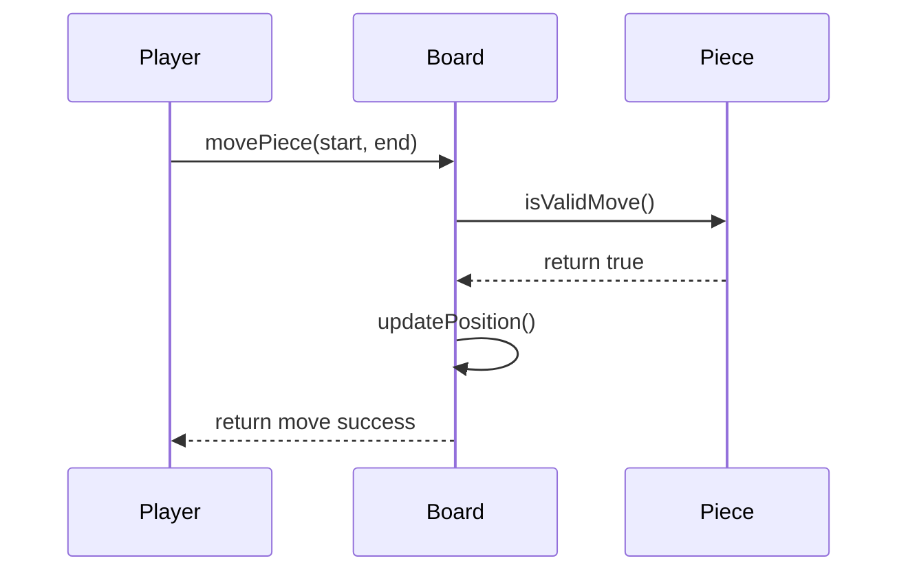

# Ch06 UML 圖與程式碼對應 (Mapping UML to Code)

在物件導向設計中，UML 類別圖與 Java 程式碼之間有著高度的對應關係。本章節我們將以前面的「校園管理系統 (School)」與「西洋棋系統 (Chess)」為例，說明如何將 UML 圖中設計的心血，具體轉換為 Java 程式碼。

---

## 6.1 類別與基本成員 (Class and Basic Members)

類別圖中最基本的元素包含類別名稱、屬性 (Attributes) 與方法 (Methods)。UML 使用特定的符號來表示封裝的存取層級 (Visibility)，以及是否為靜態 (Static) 或抽象 (Abstract)。

### 6.1.1 存取修飾子與靜態/抽象成員

在 UML （以 Mermaid 表示為主）與 Java 的對應如下：

*   `+` 表示 `public` （公開）
*   `-` 表示 `private` （私有）
*   `#` 表示 `protected` （保護）
*   `~` 表示 `package-private` (預設，同一套件內可存取)
*   `$` 表示靜態成員 (`static`)，屬於類別而非物件實例。
*   `*` 表示抽象成員 (`abstract`)，代表方法只有定義而沒有實作。

#### 📌 UML 圖例：教師基本設計


#### 💻 Java 程式碼對應：
```java
public abstract class Teacher {
    // 負號 - 代表 private
    private String name;
    private int yearsOfExperience;
    
    // 井字號 # 代表 protected
    protected String specialty;
    
    // 錢字號 $ 代表 static
    public static String schoolName;
    
    // 正號 + 代表 public
    public void teach() {
        System.out.println("Teacher is teaching...");
    }
    
    // 星號 * 代表 abstract (也要求包含它的類別必須宣告為 abstract)
    public abstract void gradeHomework();
}
```

### 6.1.2 介面 (Interface)

在 UML 中，介面通常以 `<<interface>>` 的標籤 (Stereotype) 來標示。

#### 📌 UML 圖例：可顯示資訊的介面


#### 💻 Java 程式碼對應：
```java
// 介面所有方法預設為 public abstract
public interface Displayable {
    void displayInfo();
}
```

---

## 6.2 類別間的關係與實作 (Relationships and Implementation)

物件導向的核心在於物件之間的互動，這些關係在程式碼中通常會被實作為「參考 (Reference)」或是「集合 (Collection)」。

### 6.2.1 繼承與實作 (Inheritance and Realization)

**繼承 (Generalization / Inheritance)** 使用實線與空心箭頭表示 (`<|--`)；**實作 (Realization)** 則使用虛線與空心箭頭表示 (`<|..`)。

#### 📌 UML 圖例：西洋棋棋子與校園成員繼承關係


#### 💻 Java 程式碼對應：

```java
// ==================== 繼承 (extends) ====================
public abstract class Piece {
    // 定義抽象方法
    public abstract boolean isValidMove();
}

public class King extends Piece {
    @Override
    public boolean isValidMove() {
        // 國王的移動規則實作
        return true;
    }
}

public class Rook extends Piece {
    @Override
    public boolean isValidMove() {
        // 城堡的移動規則實作
        return true;
    }
}

// ==================== 實作 (implements) ====================
public class Student implements Displayable {
    @Override
    public void displayInfo() {
        System.out.println("I am a student currently enrolled.");
    }
}
```

### 6.2.2 關聯與瀏覽 (Association and Navigation)

當兩邊的類別彼此相關，並且我們需要在其中一個類別中「看見」另一個類別的資料時，稱為**瀏覽 (Navigation)**。
我們常會在關聯端點上寫上**角色名稱 (role name)** 與**多重性 (multiplicity)**，這會決定我們在 Java 中是宣告單一變數參考，還是使用陣列/集合。

#### 📌 UML 圖例：學生選修課程 (多對多關聯與單向瀏覽)

*   「學生必須知道自己選了什麼課」，因此箭頭指向 `Course`。單向箭頭表示 `Course` 類別內不存放 `Student` 資料。
*   端點的多重性 `0..*` 表示學生可能選 0 到多門課。



#### 💻 Java 程式碼對應：

因為是 `0..*` 的多重性，實作上我們使用集合 (Collection) 如 `List` 來存放這些參考。

```java
import java.util.ArrayList;
import java.util.List;

public class Student {
    private String name;
    
    // 多重性為 0..*，對應到 List 集合
    private List<Course> courses = new ArrayList<>();
    
    public void enrollCourse(Course c) {
        courses.add(c);
    }
}

public class Course {
    private String courseName;
    // 注意：因為只有單向瀏覽 (Student -> Course)，
    // Course 類別內部並不包含對 Student 的參考 (Student 變數)。
}
```

### 6.2.3 聚合關係 (Aggregation)

聚合是「概念上的包含 (Whole-Part)」，但部分 (Part) 的生命週期與整體 (Whole) 不綁定。當包含者不在，被包含者也不需要被清除。UML 中以空心菱形表示 (`o--`)。

#### 📌 UML 圖例：系所與教師

一個科系擁有多名教師，但如果科系裁撤了，教師不一定會消失（可能轉到別系或有其他職位）。



#### 💻 Java 程式碼對應：

聚合在陣列與變數宣告上與一般關聯一模一樣。他們的差別**展現在生命週期管理上：Teacher 物件不是由 Department 擔任工廠自己建立的**，而是從外部透過傳入 (Dependency Injection 概念)。即使 `Department` 物件被銷毀（或被垃圾回收機制收走），外部的 `Teacher` 物件依然存在。

```java
import java.util.List;
import java.util.ArrayList;

public class Department {
    private String deptName;
    private List<Teacher> teachers = new ArrayList<>();
    
    // 聚合關係：Teacher 物件在外面（如呼叫端）new 出來後，再透過此方法交給 Department
    // 因此他們的生命週期是獨立的。
    public void addTeacher(Teacher t) {
        this.teachers.add(t);
    }
}
```

### 6.2.4 組合關係 (Composition)

組合是比較強烈的 Whole-Part 關係：**當整體 (Whole) 消失，部分 (Part) 也就隨之失去意義並必須跟著銷毀。** UML 中以實心菱形表示 (`*--`)。

#### 📌 UML 圖例：西洋棋盤與棋盤格

一個棋盤 (`Board`) 包含剛好 64 個格子 (`Square`)。一旦這盤棋結束、棋盤物件被銷毀，那 64 個格子也沒有獨立存在的意義了。



#### 💻 Java 程式碼對應：

在強烈關聯的實作中，**Part (被包含者) 通常在 Whole (包含者) 的建構子內生成**，他們的生命週期在建立時就被深深綁定了。如果是 C++，解構子 (Destructor) 中也必須將它們釋放；但在 Java，我們把參考清空，交給垃圾回收器即可。

```java
public class Square {
    // 棋盤格的實作表示
}

public class Board {
    // 組合關係：Square 是被直接管理的
    private Square[][] squares;
    
    public Board() {
        squares = new Square[8][8];
        
        // 【核心差異】：初始化時，由 Board "親自" 建構所有的 Part (Square)
        for (int i = 0; i < 8; i++) {
            for (int j = 0; j < 8; j++) {
                squares[i][j] = new Square();
            }
        }
    }
}
```

---

## 6.3 系統藍圖到動態行為實作 (Dynamic Behavior Mapping)

剛才我們透過類別圖定義了靜態結構與「可以呼叫的公開方法」，但我們還需要動態視圖（如**循序圖**或是**狀態圖**）來定義方法「內」真正的運行邏輯與先後呼叫順序。

### 6.3.1 循序圖與方法呼叫 (Sequence Diagram)

循序圖用來表達物件之間互動的順序。圖上的「訊息傳遞 (Message)」通常會直接轉換為 Java 程式碼中的「方法呼叫 (Method Call)」，它讓我們清楚知道在實作 `movePiece()` 這種複雜行為時，應該委託給哪個物件。

#### 📌 UML 圖例：玩家移動西洋棋子的判斷流程



#### 💻 Java 程式碼對應：

藉由這個循序圖，分析師指引了工程師在實作 `Board.movePiece` 方法時，不要把驗證邏輯全塞在 `Board` 裡，而是應該先問 `Piece` 到底合不合法。

```java
public class Board {
    // 這是在格子上的棋子物件 (簡略表示)
    private Piece targetPiece;
    
    // 對應到 Player 送過來的訊息 Player->>Board: movePiece
    public boolean movePiece(Position start, Position end) {
        
        // 對應到 Board 向 Piece 物件詢問 Board->>Piece: isValidMove
        if (targetPiece.isValidMove()) {
            
            // 對應到自我的內部呼叫 Board->>Board: updatePosition
            updatePosition(start, end);
            
            // 對應到 Board-->>Player: return move success
            return true;
        }
        
        return false;
    }
    
    private void updatePosition(Position start, Position end) {
        // 更新盤面邏輯...
    }
}
```

### 6.3.2 狀態圖與活動圖的實作概念

雖然 UML 的狀態圖 (State Diagram) 與活動圖 (Activity Diagram) 無法像類別圖那樣 1:1 地產生「程式碼架構骨架」，但它們為實作特定演算法或業務邏輯提供了最穩固的指引。

*   **狀態圖 (State Diagram)**：若物件有明確的狀態流轉（例如遊戲角色的「停止」、「跑動」、「攻擊」），實作上常會運用 `enum` 配合 `switch-case` 呈現，或是進一步改寫應用 **State Pattern (狀態模式)**，讓每種狀態自動切換物件的行為。
*   **活動圖 (Activity Diagram)**：可視為高階、跨物件的流程圖。上面的判斷節點（菱形）會成為程式碼內的 `if-else` 或 `switch`，而分叉與會合節點 (Fork/Join) 在 Java 中代表可能會開出多個 `Thread` (執行緒) 或是透過 `CompletableFuture` 來進行非同步的平行處理。
