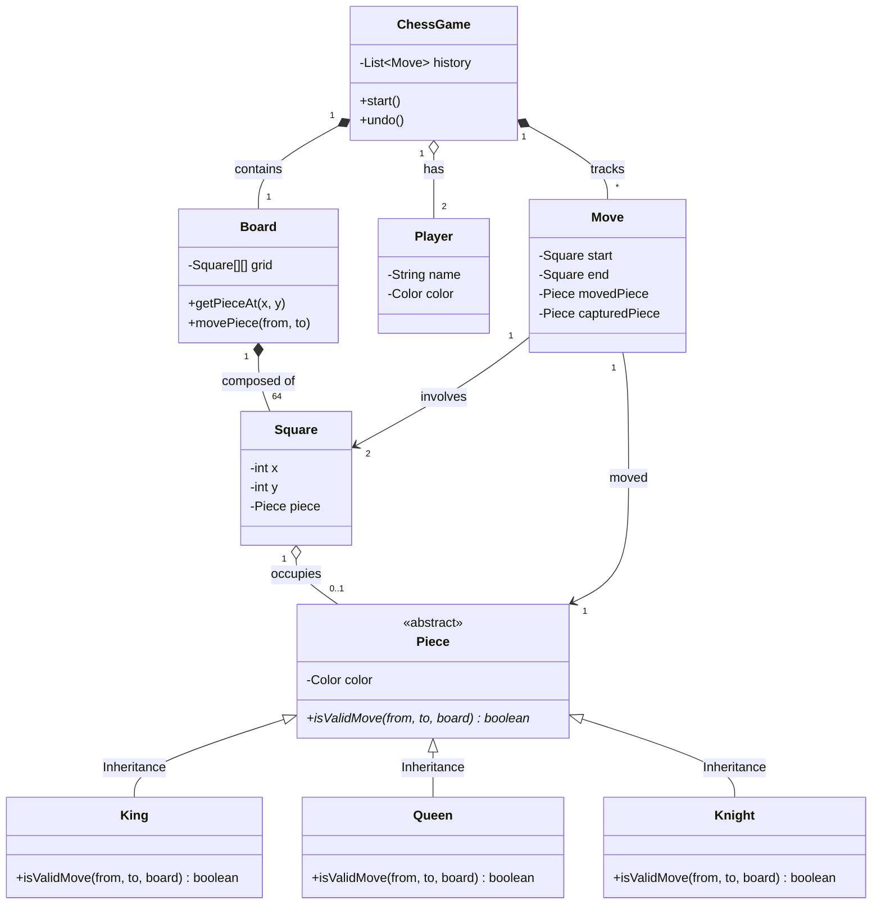

# ♟️ 範例：西洋棋系統 (Chess Game System)

## 📋 需求描述 (Requirement)
請針對西洋棋遊戲設計一個物件導向模型：
1. **棋盤與棋子**：棋盤 (Board) 由 8x8 的格子 (Square) 組成。棋盤上放有不同類型的棋子 (Piece)。
2. **棋子種類**：包含國王 (King)、皇后 (Queen)、城堡 (Rook)、主教 (Bishop)、騎士 (Knight) 與兵 (Pawn)。每種棋子有不同的移動邏輯。
3. **規則校驗**：每種棋子都應具備檢查移動是否合法 (isValidMove) 的能力。
4. **遊戲流程**：系統需記錄玩家 (Player) 的每一手移動 (Move)，並能判斷目前的棋盤狀態。

---

## 🎓 物件導向設計觀念延伸

### 1. 多型 (Polymorphism) 的應用
棋類遊戲是展現多型最直觀的例子。
- **觀念**: `Board` 在移動棋子時，不需要知道它是馬還是兵，只需要呼叫 `piece.isValidMove(...)`。
- **實踐**: 每個具體的棋子類別（如 `Knight`）會根據自己的走法（如 L 型跳躍）來覆寫這個方法。這讓增加新棋子（如特殊規則棋子）變得非常容易。

### 2. 組合 vs 聚合 (Composition vs Aggregation)
- **組合 (Composition, `*--`)**: `Board` 與 `Square`。格子是棋盤物理結構的一部分，棋盤銷毀時，格子也隨之消失。
- **聚合 (Aggregation, `o--`)**: `Square` 與 `Piece`。棋子只是暫時「停留在」某個格子內，它可以移動到另一個格子。棋子與格子的關係是鬆散且動態的。

### 3. 狀態記錄 (Memento/Command Pattern 思考)
`Move` 類別記錄了棋局的變動。
- **好處**: 透過記錄 `Move` 物件，我們可以輕鬆實現「回悔 (Undo)」功能，或是回放整場棋局。

---

## 💬 思考與討論 (Discussion Topics)

1. **誰該負責驗證移動？**
   - 目前是由 `Piece` 負責 `isValidMove`。但某些規則（如「王車易位 Castling」或「吃過路兵 En Passant」）涉及到多個棋子的位置，這時候邏輯應該放在 `Piece` 還是 `Board` 比較合適？

2. **座標的設計 (Square)**
   - 為什麼要建立 `Square` 類別，而不是直接在 `Board` 用一個二維陣列 `Piece[][]` 存就好？建立 `Square` 物件對「擴充格子屬性」（如格子的顏色、是否被威脅）有什麼幫助？

3. **單一職責原則 (SRP)**
   - `ChessGame` 應該負責判斷「勝負」嗎？還是應該有一個獨立的 `RulesEngine` 類別來執行複雜的裁判邏輯？

4. **不可變性 (Immutability)**
   - 如果我們把 `Move` 設計成不可變物件 (Immutable Object)，對記錄棋局歷史與防止錯誤修改有什麼好處？

5. **多重性的精確度**
   - 圖中 `Board` 包含 `64` 個 `Square`。如果我們要設計其他棋類（如 19x19 的圍棋），我們的類別圖該如何調整以增加重用性？
