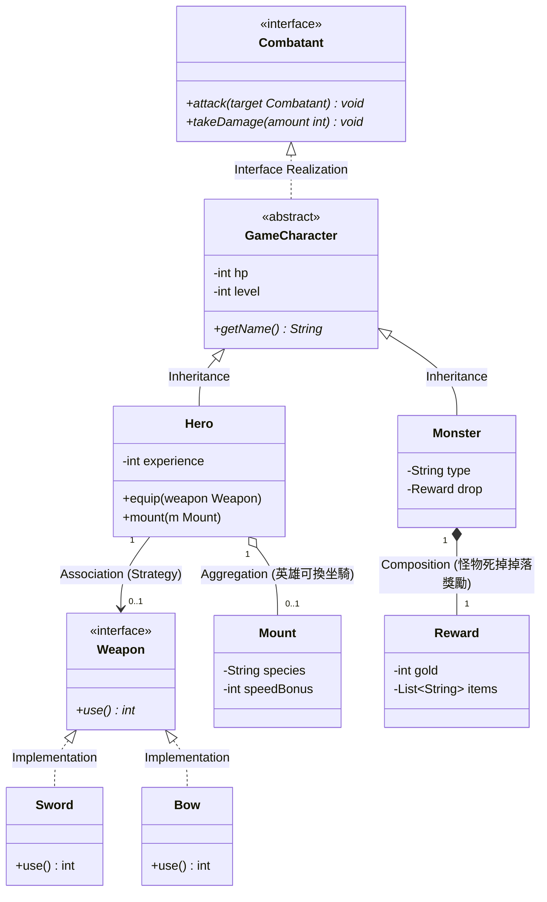

# 🎮 範例：遊戲戰鬥系統 (Game Combat System)

## 📋 需求描述 (Requirement)
請根據以下描述設計一個遊戲戰鬥系統的模型：
1. **角色管理**：系統中有英雄 (Hero) 與怪物 (Monster)。兩者皆具備生命值 (HP) 與等級 (Level)。
2. **戰鬥能力**：所有能參與戰鬥的單位都必須具備「攻擊 (attack)」與「受傷 (takeDamage)」的行為。
3. **武器系統**：英雄可以裝備一種武器 (Weapon)。武器有多種類型（如 Sword, Bow），不同的武器會影響攻擊的方式與傷害。
4. **坐騎與獎勵**：
   - 英雄可以選擇帶領一個坐騎 (Mount)，如馬 (Horse) 或巨狼 (Wolf)。
   - 當怪物被擊敗時，會掉落獎勵 (Reward)，內含金幣 (Gold) 與掉落物 (Loot)。

---

## 🎓 物件導向設計觀念延伸

### 1. 策略模式 (Strategy Pattern)
`Hero` 與 `Weapon` 的關係是策略模式的經典應用。
- **觀念**: `Hero` 類別並不需要知道具體是在用「劍」還是「弓」，它只需要知道它持有的是一個符合 `Weapon` 介面的物件。
- **好處**: 未來若要新增「法杖 (Staff)」，我們只需要擴充 `Weapon` 的實作，完全不需要修改 `Hero` 類別的程式碼（符合 **開閉原則 OCP**）。

### 2. 組合 vs 聚合 (Composition vs Aggregation)
- **聚合 (Aggregation, `o--`)**: `Hero` 與 `Mount`。坐騎可以離開英雄，也可以換給另一個英雄。它們的生命週期是獨立的。
- **組合 (Composition, `*--`)**: `Monster` 與 `Reward`。在這個設計中，獎勵是怪物「自帶」的特性。怪物物件消失時，這筆尚未掉落的預設獎勵物件也會隨之銷毀。

### 3. 介面的威力
為什麼定義 `Combatant` 介面？
- **觀念**: 若有一天我們想讓「自動防禦防禦塔 (Turret)」也能攻擊，防禦塔只需要實作 `Combatant` 介面，就能被納入戰鬥系統中，而不必繼承自 `GameCharacter`（因為防禦塔不是生物）。

---

## 💬 思考與討論 (Discussion Topics)

1. **角色切換的困境**
   - 如果遊戲中有一種「受感染的英雄」，他既有英雄的技能，又像怪物一樣會主動攻擊玩家。在現有的繼承架構下（`Hero` 與 `Monster` 為平級子類別），該如何處理這種「雙重身份」？

2. **多重性的真實含義**
   - 圖中 `Hero` 到 `Weapon` 的多重性是 `0..1`。這代表什麼？如果遊戲允許「雙劍流」，多重性該如何修改？這會對 `Hero.attack()` 的實作產生什麼衝擊？

3. **裝備的相依性**
   - 目前 `Weapon` 是獨立的。如果某些強大的武器只有「等級 > 50」的英雄才能使用，這種「限制」應該寫在 `Weapon` 裡，還是 `Hero` 的 `equip()` 方法裡？為什麼？

4. **坐騎的行為**
   - 現在的 `Mount` 只是英雄的一個屬性。如果坐騎也能升級、甚至能幫忙攻擊（具備 `Combatant` 特性），我們的類別圖該如何調整？

5. **死亡邏輯的設計**
   - 當 `takeDamage` 導致 `hp <= 0` 時，誰該負責觸發 `Reward` 的掉落？是 `Monster` 類別自己，還是外部的 `CombatSystem`？這牽涉到物件的「封裝」與「職責分配 (Responsibility Assignment)」。
