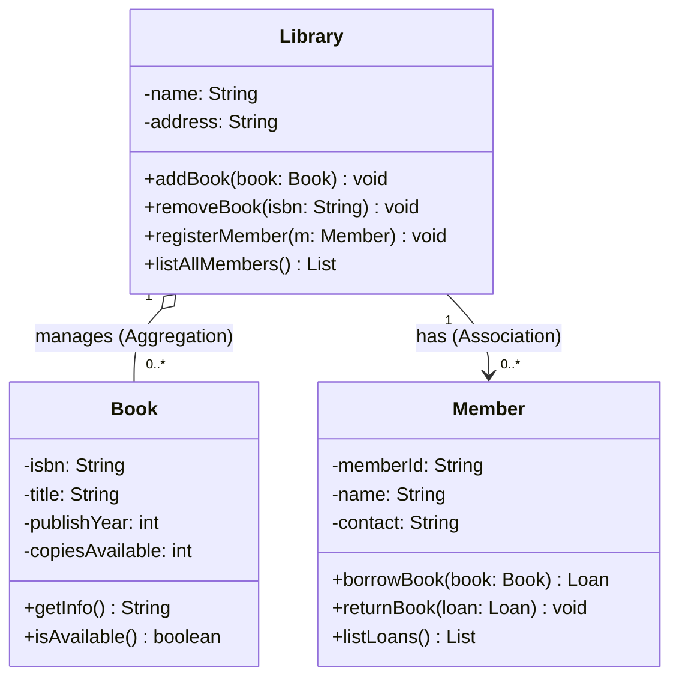
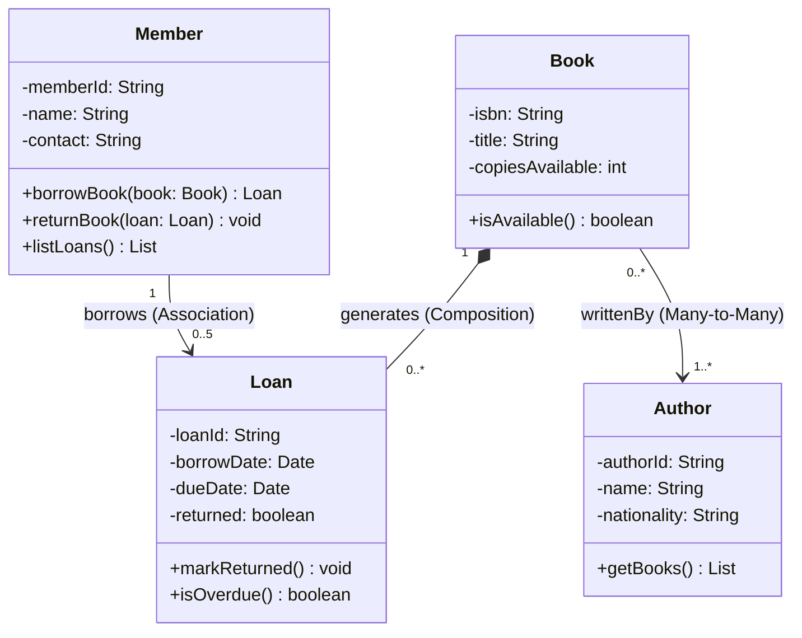

# 📚 範例：圖書管理系統 (Library Management System)

## 📋 需求描述 (Requirement)
請設計一個圖書管理系統模型，滿足以下需求：
1. **圖書館（Library）**：圖書館管理多本書籍，每本書都有唯一的 ISBN 編號、書名、出版年等資訊，並可管理多個會員。
2. **會員（Member）**：會員可以借閱書籍，但**每個會員最多只能借閱 5 本書**，並能查詢自己的借閱清單。
3. **書籍（Book）**：每本書可能有多個副本，且由一位或多位作者所寫。
4. **借閱紀錄（Loan）**：記錄借閱日期、歸還期限與是否已歸還，每筆紀錄對應一位會員與一本書。
5. **作者（Author）**：每位作者有唯一 ID、姓名與國籍，一本書可由多位作者共同撰寫。

---

## 圖一：核心類別（Library、Member、Book）

先建立三個核心類別，確認屬性與方法，再描繪關係。

> `Library` ◇—— `Book`：空心菱形（**Aggregation**），圖書館管理書籍，但書籍可獨立存在於圖書館之外。  
> `Library` ——> `Member`：**關聯**，圖書館持有會員清單。

---

## 圖二：借閱紀錄與作者

加入 `Loan`（借閱紀錄）與 `Author`（作者），補全系統全貌。

> `Book` ◆—— `Loan`：實心菱形（**Composition**），借閱紀錄依附於書籍副本，書籍消失則紀錄無意義。  
> `Member` ——> `Loan`：多重性標示 `0..5`，反映「最多借閱 5 本」的業務規則。  
> `Book` ——> `Author`：**多對多**，一本書可有多位作者，一位作者也可寫多本書。

---

## 🎓 物件導向設計觀念延伸

### 1. 組合 vs 聚合 (Composition vs Aggregation)
在上述模型中，我們可以看到兩種「部分-整體」的關係：
- **聚合 (Aggregation, 空心菱形 `o--`)**: 例如 `Library` 與 `Book`。圖書館管理書籍，但書籍可獨立存在（例如書籍資料轉移至另一家圖書館）。
- **組合 (Composition, 實心菱形 `*--`)**: 例如 `Book` 與 `Loan`。借閱紀錄的生命週期完全依附於對應的書籍副本，書籍副本刪除，該筆借閱紀錄也應一併消滅。

### 2. 多重性 (Multiplicity) 的業務規則
多重性不只是技術選擇，而是業務規則的直接體現：
- `Member "1" --> "0..5" Loan`：直接在 UML 中表達「每位會員最多借 5 本」的規則。
- `Book "0..*" --> "1..*" Author`：一本書至少有一位作者（`1..*`），一位作者可以寫零本或多本書（`0..*`）。

### 3. 多對多關係 (Many-to-Many)
`Book` 與 `Author` 之間是多對多關係。在實作時，資料庫通常需要一張中介表（如 `book_author`）來存放這個關聯。在 UML 中，若這個關聯本身有屬性（如「貢獻比例」），可進一步建立**關聯類別**來承載。

### 4. 方法的歸屬 (Responsibility Assignment)
- `isAvailable()`：由 `Book` 自行判斷是否有剩餘副本，符合**封裝（Encapsulation）**原則。
- `isOverdue()`：由 `Loan` 自行與系統日期比對，避免外部呼叫端需要了解 `Loan` 的內部日期邏輯。

---

## 💬 思考與討論 (Discussion Topics)

1. **關聯 vs. 組合 (Association vs. Composition)**
   - `Member` 與 `Loan` 之間用的是「關聯」而非「組合」。為什麼？如果會員帳號被刪除，其借閱紀錄應該一起消失嗎？從業務角度與技術角度分別討論。

2. **多重性的精確度**
   - `Member` 最多可借 5 本書（多重性 `0..5`）。如果未來規則改為「VIP 會員可借 10 本」，現有的類別圖該如何調整？

3. **書籍副本的設計**
   - 目前 `Book` 用 `copiesAvailable: int` 表示副本數量。如果我們需要追蹤**每一本實體書的獨立狀態**（如某本書破損），是否應該建立一個新的 `Copy`（實體副本）類別？這樣的設計對關係圖會有什麼影響？

4. **借閱期限的擴充**
   - `Loan` 中有 `dueDate`，但沒有「續借」功能。如果會員可以申請續借（延長 `dueDate`），這個動作應該設計成 `Loan` 的方法，還是 `Member` 的方法？為什麼？

5. **Library 作為 Facade**
   - `Library` 類別持有 `Book` 和 `Member` 的引用，扮演「系統入口」的角色。這類似設計樣式中的 **Facade Pattern**。試想：如果系統規模變大，`Library` 是否會成為上帝類別（God Class）？應該如何拆分職責？
