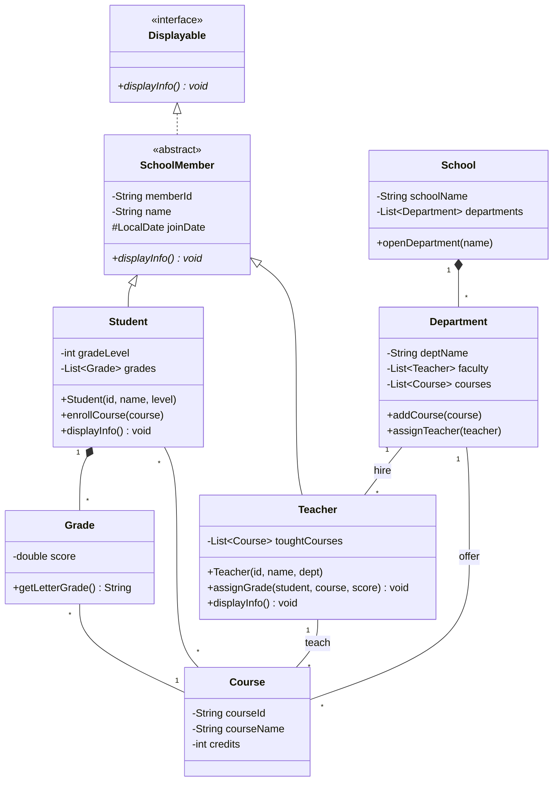

# 🏫 範例：校園管理系統 (School Management System)

## 📋 需求描述 (Requirement)
請設計一個簡單的校園管理系統模型，滿足以下需求：
1. **學校組成**：學校包含多個系所，系所下有老師與課程。
2. **成員管理**：所有成員（學生、老師）都有 ID、姓名與加入日期，且能以統一的介面顯示資訊。
3. **授課與選課**：老師可以開設多門課程，學生可以選修多門課程。
4. **成績系統**：老師負責為學生打分數，成績物件記錄了分數及其所屬的課程。

---



## 🎓 物件導向設計觀念延伸

### 1. 組合 vs 聚合 (Composition vs Aggregation)
在上述模型中，我們可以看到兩種「部分-整體」的關係：
- **組合 (Composition, 實心菱形 `*--`)**: 例如 `School` 與 `Department`。這表示強烈的擁有關係，生命週期同步。如果學校關閉，系所也會隨之消失。
- **聚合 (Aggregation, 空心菱形 `o--`)**: 例如 `Department` 與 `Course`。這表示較弱的擁有關係。即使系所重組，課程資料可能依然存在於系統中。

### 2. 多型 (Polymorphism) 與 動態綁定 (Dynamic Binding)
多型是物件導向最強大的特性之一。在我們的 `School` 類別中，可能會包含一個 `List<SchoolMember>`。
- **概念**: 程式碼在編寫時只需針對 `SchoolMember` 撰寫邏輯，例如：
  ```java
  for (SchoolMember member : members) {
      member.displayInfo(); // 這裡體現了多型
  }
  ```
- **動態綁定**: 當程式執行到這行時，系統會「動態」檢查該 `member` 到底是 `Student` 還是 `Teacher`，並執行對用的 `displayInfo()` 版本。這讓系統極具擴展性——若未來增加「職員 (Staff)」，上述循環代碼完全不需要修改。

### 3. 介面 (Interface) vs 繼承 (Inheritance)
這兩者常被搞混，但其語意差別很大：
- **繼承 (Inheritance, "is-a")**: `Student` **是一種** `SchoolMember`。繼承強調的是「本質」與「屬性的傳承」。子類別自動擁有父類別的所有狀態（如 `memberId`）。
- **介面 (Interface, "can-do")**: `SchoolMember` **具備顯示的能力** (`Displayable`)。介面強調的是「行為特徵」與「契約」。
- **為什麼要分開？**: 一個類別只能有一個父類別（單一繼承），但可以實作多個介面。例如 `Student` 可以同時實作 `Displayable`、`Scorable` (可評分)、`Enrolled` (可選課) 等多個介面，這讓設計更加靈活。

### 4. 里氏替換原則 (Liskov Substitution Principle, LSP)
基於上述的多型概念，LSP 要求：**子類別物件必須能夠替換掉其父類別物件，而不會影響程式的正確性。**
- **實踐**: 如果我們在 `School` 系統中撰寫了一個處理 `SchoolMember` 的函數，它不應該需要知道傳進來的是學生還是老師。如果該函數因為傳入學生而產生錯誤（例如假設所有成員都有 `toughtCourses`），那就違反了 LSP。

### 4. 關聯類別 (Association Class) - 雖然 Mermaid 沒畫出但可思考
目前的 `Grade` 實際上扮演了 `Student` 與 `Course` 之間的橋樑。在更複雜的設計中，`Grade` 可以被視為一個**關聯類別**，記錄了「某個學生」在「某門課」的表現。

---

## 💬 思考與討論 (Discussion Topics)

1. **關聯 vs. 屬性 (Association vs. Attribute)**
   - 為什麼 `Teacher` 不直接把 `department` 當成一個 `String` 屬性，而要建立跟 `Department` 類別的關聯？這對系統的靈活性（例如統計系上老師人數）有什麼影響？

2. **多重性 (Multiplicity) 的抉擇**
   - 在圖中，一個課程可以有多少學生？如果我們想規定「每門課最少 5 人，最多 50 人」，UML 該如何標示？

3. **介面的擴充性 (Interface)**
   - 如果未來我們加入「校園設備 (Equipment)」（如投影機、冷氣），它們也需要被管列並顯示資訊，我們該如何運用現有的 `Displayable` 介面？

4. **生命週期的考量 (Lifecycle)**
   - 為什麼 `School` 與 `Department` 之間適合用 **組合 (Composition)**，而 `Department` 與 `Course` 之間用 **聚合 (Aggregation)** 可能更好？這與真實世界的運作邏輯有什麼關聯？

5. **繼承與其副作用**
   - 雖然 `Student` 繼承自 `SchoolMember` 很直觀，但如果一個學生同時也是兼職助教 (TA)，既是學生又是老師，現有的繼承架構會遇到什麼問題？（提示：單一繼承與角色切換的困境）