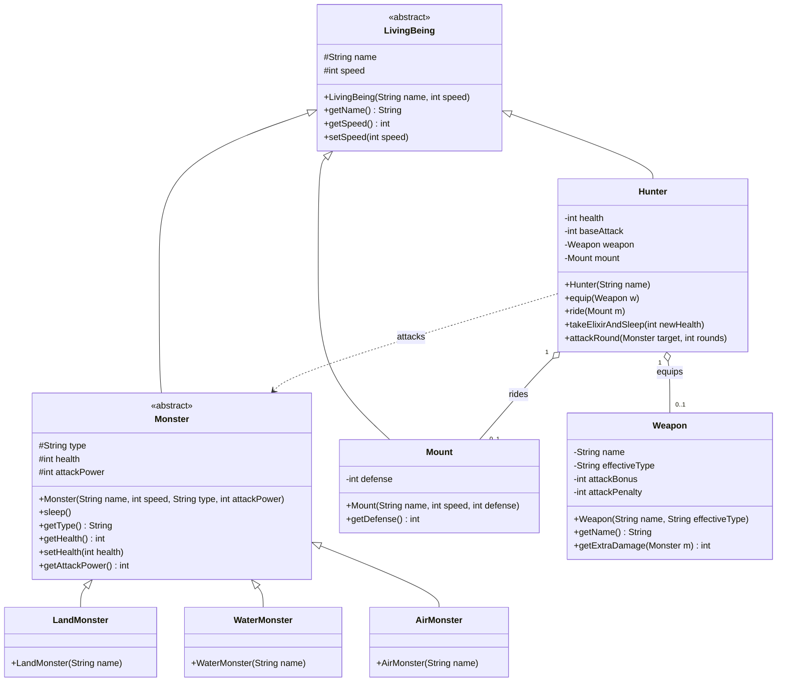

## 題目 1

* Monster 怪物：每個怪物都有一個名稱與描述。除此以外，他們被區分為陸地，水上和空中的型態，不同的型態，攻擊力會有不同，受武器的影響也有所不同。
* Hunter 獵人：專門打怪的獵人。不同獵人有不同的專長，專長會影響他們使用的武器和打怪的效力。
* Mount 坐騎：獵人可以擁有坐騎。不同的坐騎有不同的移動速度。有些坐騎會使 Hunter 的速度加快，有些則會變慢但是防護力增強。喔，除了 Mount 以外當然怪物也會有移動速度。
* Weapon 武器。獵人拿上武器後移動力會降低，武器也有不同的特性，不同的特性對不同的怪物殺傷力有所不同。

還有其他的物件與屬性，可以從情境中獲取。

完成以下情景的 UML 設計與程式碼：

* 建立三樣武器
* 建立兩個坐騎 
* 建立一個 Hunter
* 建立一個怪物
* Hunter 徒手打怪物一回合，血量變成 30，怪物變成 90
* Hunter 吃了仙丹，睡了一覺，血量變成 80
* 怪物睡了一覺，血量變成 100 (Monster.sleep())
* Hunter 騎上坐騎，選其中一個（不適當）武器，再打一回合，血量變成 20, 怪物變成 95
* Hunter 吃了仙丹，睡了一覺，血量變成 70; 怪物睡了一覺，血量變成 100
* Hunter 騎上坐騎，選其中一個（適當）武器，再打三回合，血量變成 50, 怪物變成 0
* Game over

請做適當合理的假設。

* 畫出 UML class diagram (40%)
* 寫出程式碼 (40%)

### 參考解答

#### UML class diagram



#### 程式碼

```java
// 核心戰鬥邏輯與實體類別
abstract class LivingBeing {
    protected String name;
    protected int speed;

    public LivingBeing(String name, int speed) {
        this.name = name;
        this.speed = speed;
    }

    public String getName() { return name; }
    public int getSpeed() { return speed; }
    public void setSpeed(int speed) { this.speed = speed; }
}

abstract class Monster extends LivingBeing {
    protected String type;
    protected int health;
    protected int attackPower;

    public Monster(String name, int speed, String type, int attackPower) {
        super(name, speed);
        this.type = type;
        this.health = 100; // 初始血量
        this.attackPower = attackPower; // 依不同型態有不同攻擊力
    }

    public String getType() { return type; }
    public int getHealth() { return health; }
    public void setHealth(int health) { this.health = health; }
    public int getAttackPower() { return attackPower; }

    public void sleep() {
        this.health = 100;
        System.out.println("  => " + name + " 睡了一覺，血量恢復到 " + this.health);
    }
}

class LandMonster extends Monster {
    public LandMonster(String name) {
        super(name, 10, "陸地", 80);
    }
}

class WaterMonster extends Monster {
    public WaterMonster(String name) {
        super(name, 15, "水上", 70); // 確保測試案例順利運行，維持攻擊力 70
    }
}

class AirMonster extends Monster {
    public AirMonster(String name) {
        super(name, 20, "空中", 60);
    }
}

class Weapon {
    private String name;
    private String effectiveType;
    private int attackBonus;    // 對適當目標的傷害加成
    private int attackPenalty;  // 對不適當目標的傷害懲罰

    public Weapon(String name, String effectiveType) {
        this.name = name;
        this.effectiveType = effectiveType;
        this.attackBonus = 25;   // 適當武器：提升25 (加上基礎10共35)
        this.attackPenalty = -5; // 不適當武器：減去5 (加上基礎10共5)
    }

    public String getName() { return name; }

    public int getExtraDamage(Monster m) {
        // 如果武器剛好剋制怪物的型態，就給予加成
        if (effectiveType.equals(m.getType())) {
            return attackBonus;
        } else {
            return attackPenalty;
        }
    }
}

class Mount extends LivingBeing {
    private int defense;

    public Mount(String name, int speed, int defense) {
        super(name, speed);
        this.defense = defense; // 增強不同的防禦力
    }

    public int getDefense() { return defense; }
}

class Hunter extends LivingBeing {
    private int health;
    private int baseAttack;
    private Weapon weapon;
    private Mount mount;

    public Hunter(String name) {
        super(name, 10); // 預設速度
        this.health = 100;
        this.baseAttack = 10; // 徒手攻擊力
    }

    public void equip(Weapon w) {
        this.weapon = w;
        System.out.println(this.getName() + " 裝備了武器: " + w.getName());
    }

    public void ride(Mount m) {
        this.mount = m;
        this.speed = m.getSpeed(); // 坐騎取代速度
        System.out.println(this.getName() + " 騎上坐騎: " + m.getName() + " (速度更新為 " + this.speed + ")");
    }

    public void takeElixirAndSleep(int newHealth) {
        this.health = newHealth;
        System.out.println("  => " + this.getName() + " 吃了仙丹，睡了一覺，血量變成 " + this.health);
    }

    public void attackRound(Monster target, int rounds) {
        System.out.println(">>> " + this.getName() + " 對 " + target.getName() + " 發起了 " + rounds + " 回合戰鬥 <<<");
        for (int i = 1; i <= rounds; i++) {
            if (this.health <= 0 || target.getHealth() <= 0) break;

            // 1. Hunter 攻擊 Monster
            int hDamage = baseAttack;
            if (weapon != null) {
                hDamage += weapon.getExtraDamage(target);
            }
            int newTargetHealth = target.getHealth() - hDamage;
            if (newTargetHealth < 0) newTargetHealth = 0;
            target.setHealth(newTargetHealth);

            // 2. 若 Monster 存活，則反擊 Hunter
            if (target.getHealth() > 0) {
                int mDamage = target.getAttackPower();
                if (mount != null) {
                    mDamage -= mount.getDefense(); // 坐騎抵銷部分傷害
                }
                if (mDamage < 0) mDamage = 0;
                this.health -= mDamage;
            }
        }
        System.out.println("  -> 戰鬥結束: " + this.getName() + " 血量變成 " + this.health + "，" + target.getName() + " 血量變成 " + target.getHealth());
    }
}

public class Main {
    public static void main(String[] args) {
        // 1. 建立三樣武器
        Weapon stick = new Weapon("木棍", "無");
        Weapon sword = new Weapon("石中劍", "陸地"); // 對水怪不適當
        Weapon harpoon = new Weapon("海神魚叉", "水上"); // 對水怪適當

        // 2. 建立兩個坐騎 (初始化包含速度，例如戰馬 25、烏龜 5)
        Mount horse = new Mount("戰馬", 25, 10);
        Mount turtle = new Mount("裝甲海龜", 5, 60);

        // 3. 建立一個 Hunter
        Hunter hunter = new Hunter("傑洛特");

        // 4. 建立一個怪物 (利用繼承：設定為水怪)
        Monster monster = new WaterMonster("水怪哥吉拉");

        // --- 模擬戰鬥開始 ---

        // 5. Hunter 徒手打怪物一回合
        System.out.println("\n[第一階段]");
        hunter.attackRound(monster, 1);

        // 6. Hunter 吃了仙丹，睡了一覺
        hunter.takeElixirAndSleep(80);

        // 7. 怪物睡了一覺
        monster.sleep();

        // 8. Hunter 騎上坐騎，選其中一個（不適當）武器，再打一回合
        System.out.println("\n[第二階段]");
        hunter.ride(horse);
        hunter.equip(sword); 
        hunter.attackRound(monster, 1);

        // 9. Hunter 吃了仙丹，睡了一覺
        hunter.takeElixirAndSleep(70);

        // 10. 怪物睡了一覺
        monster.sleep();

        // 11. Hunter 騎上坐騎，選其中一個（適當）武器，再打三回合
        System.out.println("\n[第三階段]");
        hunter.ride(turtle);
        hunter.equip(harpoon);
        hunter.attackRound(monster, 3);

        // 12. Game over
        System.out.println("\nGame over");
    }
}
```


## 題目 2

應用 interface Comparable, 來設計一個 「通用型的 getMax」，它可以找出任何陣列內 最大的元素，例如可以找到最 max 的 棒球員 (Player)。目前我們定義 Player 是以他們的打擊率為比較基準，Player 在生成時會帶入安打數 (hits)和打數 (atBat)，打擊率為 hits/atBat。所有述性需要設定為 private。

```java
interface Comparable {
  public int compare(Comparable other);
}
class GeneralMax {
    public static ? getMax(?[] data) {
      ?
  }
}
class Main {
  ?
}
class Player ? {
  ?
}
```

### 解答

```java
interface Comparable {
    public int compare(Comparable other);
}

class GeneralMax {
    // 傳入型態為 Comparable 陣列，回傳亦為 Comparable
    public static Comparable getMax(Comparable[] data) {
        if (data == null || data.length == 0) {
            return null;
        }
        
        Comparable maxElement = data[0];
        for (int i = 1; i < data.length; i++) {
            // 定義：如果物件大於 other，compare 會回傳大於 0 的數值
            if (data[i].compare(maxElement) > 0) {
                maxElement = data[i];
            }
        }
        return maxElement;
    }
}

class Player implements Comparable {
    private String name;
    private int hits;   // 安打數
    private int atBat;  // 打數

    public Player(String name, int hits, int atBat) {
        this.name = name;
        this.hits = hits;
        this.atBat = atBat;
    }

    // 計算打擊率，需轉型為 double 確保小數點精度
    public double getBattingAverage() {
        if (atBat == 0) return 0.0;
        return (double) hits / atBat;
    }

    public String getName() {
        return name;
    }

    @Override
    public int compare(Comparable other) {
        if (other instanceof Player) {
            Player otherPlayer = (Player) other;
            double thisAvg = this.getBattingAverage();
            double otherAvg = otherPlayer.getBattingAverage();
            
            if (thisAvg > otherAvg) {
                return 1;
            } else if (thisAvg < otherAvg) {
                return -1;
            } else {
                return 0;
            }
        }
        return 0; // 若不是 Player 型別，暫停比較
    }

    // 覆寫 toString 方便印出資訊
    @Override
    public String toString() {
        return name + " (打擊率: " + String.format("%.3f", getBattingAverage()) + ")";
    }
}

class Main {
    public static void main(String[] args) {
        Player[] players = {
            new Player("彭政閔", 130, 350), // 打擊率約 0.371
            new Player("大谷翔平", 160, 500), // 打擊率約 0.320
            new Player("鈴木一朗", 262, 704)  // 打擊率約 0.372
        };

        // 呼叫通用方法
        Comparable maxPlayer = GeneralMax.getMax(players);
        
        if (maxPlayer != null) {
            System.out.println("最高打擊率的球員是： " + maxPlayer.toString());
        }
    }
}
```
