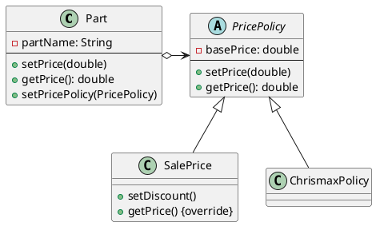

###### tags: `OOSE`

# Ch07 軟體設計原則
   
## 7.1 涇渭分明：模組化原則

> 把問題切割成若干適合管理的單元，再將之組合成需要的功能。

所謂的模組化，就是一種「切割、解決」（==divide and conquer==）的基本想法，也就是說，將一個大問題拆解成若干個小問題之後，透過逐一解決這些小問題，來解決整個大問題。

但要注意也不是切的越小就越好，不斷地拆解下去，會使得系統中的模組數量大幅增加，而一旦數量增加到一定程度之後，其管理與理解的負擔和成本就會隨之升高。

模組化可以帶來許多的好處。例如，模組化可以提昇重用性（reusability），因為，每個獨立的模組都有機會靈活運用到不同的專案中。模組化也可以帶來可擴充性和可測試性。


設計時，需讓模組具備的特質


- **可分解性**（Decomposability）。可以將一個大問題拆解成小問題，並且透過各個小問題的解法來解決大問題，而且在分解之後，可以將這些小問題指派給不同的人獨立去解決。「由上而下分解（top-down decomposition）」即為如此，從高階的抽象化觀點出發，逐漸具體化到可以實作的程度。
- **可合成性**（Composability）。允許設計者將多個模組依自己的意念，組合在一塊。具可合成性的模組提供了重複使用能力，這使得模組可以應用在當初開發模組時的情境以外的其他情境，而且具備相同介面的模組間，還可以互相的抽換。
- **可理解性**（Understandability）。降低理解模組運用情境所需的知識。當一個模組所涉及的其他模組愈少時，那麼它的可理解性就愈高，因為，只需要了解這個模組的特性及行為，就可以了，無需一個牽連一個，使得運用單一模組時，還得同時了解眾多其餘的模組特性及行為。
- **連續性**（Continuity）。當規格有了小幅度的更動時，受到影響的模組的個數要愈少愈好。
- **保護性**（Protection）。保護性指的是，在某個模組內所發生的執行期錯誤，其影響到的模組應該愈少愈好，最好只影響到其本身。


## 7.2 低耦高聚原則

:::success
不同模組之間的相依性（耦合性）應該要儘量的低; 同模組內成員相關性（內聚力）要儘量的高。
:::

#### 耦合性
耦合性可以是低耦合性（或稱為鬆散耦合），也可以是高耦合性（或稱為緊密耦合）。以下列出一些耦合性的分類，從高到低依序排列 ：


- 內容耦合（content coupling，耦合度最高）也稱為病態耦合（pathological coupling）是指一個模組依賴另一個模組的「內部」作業（例如，存取另一個模組的局域變數），因此修改相依模組處理的資料也就影響了原來模組的行為。
- 共用耦合（common coupling）也稱為全局耦合（global coupling）是指二個模組分享同一個「全局變數」，因此修改這個共享的資源也就要更動所有用到此資源的模組。
- 控制耦合（control coupling）是指一個模組藉由傳遞「要做什麼（flag）」的資訊，控制另一個模組的流程。一個模組影響到另一個模組執行的流程的程度。
- 資料耦合（data coupling）是指模組藉由資料參數傳遞來相互合作。和控制耦合不同的是資料耦合並不會影響到決策。
- 無耦合：模組完全不和其他模組交換資訊。


Control Coupling

緊密耦合的系統在開發階段有以下的缺點：

- 一個模組的修改會產生漣漪效應，其他模組也需隨之修改。
- 由於模組之間的相依性，模組的組合會需要更多的精力及時間。
- 由於一個模組有許多的相依模組，模組的可復用性低。


#### 內聚性
內聚性（Cohesion）也稱為內聚力，是一軟體度量，是指機能相關的程式組合成一模組的程度，或是各機能凝聚的狀態或程度。是結構化分析的重要概念之一。

耦合性是一個和內聚性相對的概念。一般而言高內聚性代表低耦合性，反之亦然。內聚性在實務上可減少維護及修改的「好」軟體的特性為基礎。內聚性是指機能相關的程式組合成一模組的程度。應用在物件導向程式設計中，若服務特定型別的方法在許多方面都很類似，則此型別即有高內聚性。在一個高內聚性的系統中，代碼可讀性及復用的可能性都會提高，程式雖然複雜，但可被管理。

以下的情形會降低程式的內聚性：許多方法封裝在一型別內，可以藉由方法供外界使用，但方法彼此類似之處不多，對於內部資料的存取的共同性也很低。

低內聚性的缺點如下：

- 增加理解模組的困難度。
- 增加維護系統的困難度，因為一個邏輯修改會影響許多模組，而一個模組的修改會使得一些相關模組也要修改。
- 增加模組重用困難度，因為大部份的應用程式無法重用一個由許多不一定相關的機能組成的模組。

內聚性的分類如下，由低到高排列：

- 偶然內聚性（Coincidental cohesion，最低）指模組中的各部分只是剛好放在一起，各部分之間唯一的關係是其位在同一個模組中。這是最糟糕的狀況，模組被沒有裡有的放置在一起。
- 邏輯內聚性（Logical cohesion）只要在邏輯上分為同一類，不論各機能的本質是否有很大差異，就將這些機能放在同一模組中。例如一群 read file 的模組被放在一起，只因為他們做相似的工作，而不論讀檔的目的、資料的來源、資料結構的差異等。
- 時間性內聚性（Temporal cohesion）相近時間點執行的程式，放在同一個模組中。例如在捕捉到一個異常後呼叫一函式，在函式中關閉已開啟的檔案、產生錯誤日誌、並告知使用者。或許，更好的處理方式是將這些例外處理集中在一個地方處理，而不是因為時間性的關係聚集在一起。又例如，在程式初始化的動作會執行一些工作就將這些工作都集中在一起。
- 程序內聚性（Procedural cohesion）將一組會依照固定順序執行的程式放在同一個模組中，例如一個函式檢查檔案的權限，之後開啟檔案、讀檔、關檔。
- 聯絡內聚性（Communicational cohesion）聯絡內聚性是指模組中的各部分因為處理相同的資料，因此放在同一個模組中。
- 依序內聚性（Sequential cohesion）依序內聚性是指模組中的各部分彼此的輸入及輸出資料相關，一模組的輸出資料是另一個模組的輸入，類似工廠的生產線。
- 功能內聚性（Functional cohesion）模組被聚集在一起是因為它們都對單一明確定義的任務（功能）有貢獻，亦即：聚集而達到某個特定的功能。
- 物件內聚性（Object cohesion）資料及模組功能因為相同的物件特性而被聚集，模組功能會對這群相同的資料做讀取、修改以達到功能的目的，並且反應物件的狀態。

這些內聚力並沒有「排他性」- 並不會因為具備了某個內聚力就不具備其他內聚力。


### 小節練習


- 模組化原則希望達到一下哪一點？
	- 高耦合力低內聚力。
	- 低耦合力高內聚力。
	- 高耦合力高內聚力。
	- 低耦合力低內聚力。
- 為何使用「介面」可以降低耦合力？
- 一個 Initialization 的模組中，會設定遊戲一開始需要執行的所有功能，他屬於哪一種內聚力


## 7.3 無雙無對：不重複原則

:::success
資料或是計算應該只存在一個地方，不要造成重複。
:::

重複是邪惡的，很容易出錯。例如我們把一筆成績資料存在兩個不同的檔案 $a_1$ 及 $a_2$，分別給 $m_1$ 與 $m_2$ 兩個模組來讀取，當資料修改成績時時必須同時修改 $a_1$ 及 $a_2$ 兩個檔案- 一開始工程師可能還會記得這件事，但時間一久或交接沒有確實，就很容易忘了同步，造成程式的錯誤。不重複原則（==Don't Repeat Yourself Principle; DRY==） 的原則就是不要描述再軟體設計時，不論是資料或是計算，都應該儘量的避免重複。

#### Copy-Paste 程式開發
工程師常有過這樣的經驗：需要某一段演算時，發現過去寫過的一段程式碼可以「再利用」，於是把它 copy 到現有的程式碼中，再修改掉部分不同的地方。但日後發現共同的那部分的設計變了，絕大部分的時間你僅會修改其中的一個，而忽略掉另一個，這時候就造成「計算的不一致」，這是很多程式錯誤的來源。

一些建議：

- 不論多麼匆忙，不要走捷徑（copy paste, 資料重複）;
- 把共同的部份寫成一個方法，讓大家透過呼叫來共用;
- 不要因為方法短，就覺得麻煩或不需要;
- 透過參數化讓你的方法的重用性變高;
- 把你的方法抽象化到父類別。

### Point 範例

Point 是一個座標上的點，裡面儲存 x, y 軸的座標值。

```java=
class Point {
	private double x, y;
	void setX(double x) { this.x = x; }
	void setY(double y) { this.y = y; }
	double getX() { return x; }
	double getY() { return y; }
}
```


如果我們又需要提供極座標（長度及角度）給其他物件，是否讓 Point 多宣告兩個變數來儲存呢？依據「不重複原則」，不要！

**極座標可以由絕對座標計算出來，所以不要在用額外的欄位去儲存**：需要的時候在計算即可。


```java=
private double x, y; //只儲存 x, y

double getRho() { 
    // 由 x, y 算出，不額外儲存 Rho
    return Math.sqrt(x*x + y*y); 
}
double getTheta() { 
    // 由 x, y 算出，不額外儲存 Theta	
    return Math.acos(x / rho); 
}

void setRho(double rho) {
     x = rho * Math.cos(theta);
     y = rho * Math.sin(theta);
}
void setTheta(double theta) {
     x = rho * Math.cos(theta);
     y = rho * Math.sin(theta);
}
```


## 7.4 私財勿露：資訊隱藏原則

:::success
不要公開多餘的資訊與服務。
:::


當系統逐漸變大，資訊隱藏原則能夠幫助我們掌控系統的複雜度。以一個 Client-Server 架構來說明資訊隱藏的概念，Client 根據規格對伺服器提出一個請求，伺服器給予 Client 一個適當的回應，此時伺服器端提供 Client 所需的資訊、知識、或者運算，客戶端不需要知道伺服器端如何執行運算，只要能夠取得它所需的資訊即可，此時伺服器端對客戶端做運算方法的資訊隱藏。

:::success
Each module has a secret design involves a series of decision: for each such decision, wonder who needs to know and who can be kept in the dark.
:::


### Sort 範例

以下程式有何問題？

```java=
public void sort() {
   for (int i=0; i< data.length; i++) 
      for (int j=0; j<data.length-i; j++) 
         if (data[j] > data[j+1]) 
            swap(j, j+1); 
}

public void swap(int x; int y) {
   int temp = data[x];
   data[x] = data[y];
   data[y] = temp;
}
```


## 7.5 生人勿語：迪密特原則

:::success
每個單元只和它的朋友交談，不和陌生單元交談。
:::


> Law of Demter: ``Only talk to your immediate friends"- *Ian Holland*, 1987

迪密特[^LoD]。"原則（**Law of Demeter**; LoD）又稱為最少知識原則（**Principle of Least Knowledge**），或「不要跟陌生人交談」(**Don't Talk to Strangers**)，其意義為

[^LoD]:希臘神話的農業女神，因曾孤獨的尋找其女兒，取其孤獨之意

- 每個單元對於其他的單元只能擁有有限的知識：只是與當前單元緊密聯繫的單元；或
- 每個單元只能和它的朋友交談：不能和陌生單元交談；或
- 只和自己直接的朋友交談。

設計系統時必須注意類別的數量，並且避免製造出太多類別之間的耦合關係。一個簡單的例子是：人可以命令一隻狗行走，但不要命令狗的腿行走。人跟狗有關係，狗跟他的腿有關係，整個系統有兩個關係；若人又跟狗的腿有關係，整個系統就會有三種關係。

```java
class Register {
   private Sale sale;
   public void getAmout() {
      Money amt = sale.getPayment().getTenderedAmount();
   }
} 
```

此上面的設計中，Sale 內有 `getPayment(): Payment` 的方法，透過取得 Payment 物件後，在呼叫 Payment 內的 `getTenderAmount()` 的方法，因此 Register 類別呼叫了 Sale 與 Payment。但比較好的方式是 Register 不要呼叫 Payment，直接透過 `sale.getTenderedAmountOfPayment()` 取得銷售數量。

一個物件儘可能的少知道其他物件，反之，物件本身提供最少訊息給其他物件。也就是說，一個物件本身提供最少的公開方法與公開屬性給外界使用。


## 7.6 不變應萬變：開畢原則

:::success
在不修改程式的情況下擴充或修改程式。
:::

開畢原則（**Open-Closed Principle**的意義即為「擴充程式優於修改程式」。當我們完成一個程式或類別後，日後有很大的可能性要去擴充它的功能，這時候大部分的程式設計師會將原有的程式叫出來修改，修改程式會帶來許多問題：

 
- 修改者對原有程式了解不深，修改後的程式也許能滿足新的功能，舊的功能確有可能被破壞。
- 修改者通常在應急的心態下修改程式，沒有整體性的計劃，出現錯誤的機會高。
- 程式難以元件化或模組化，因此再使用的機會低。我們所希望的是：一個類別有其主要負責的功能，當它被完成時，它可以被封裝成一個元件，以後即使有新增的需求也只要擴充其原有的類別即可，而非去修改它。

> Open-Closed Principle: Open for extension and Close for modification; OCP

把「東西」從程式碼中抽來出來就很容易達到 OCP 的要求，例如資料不要「寫死」在程式碼中，抽離出來到一個檔案或資料庫，執行前只要將資料和程式碼做一個綁定（bind）就可以了，日後抽換資料時，只要換一個檔案就好了。

有許多設計樣式均提供透過物件設計的技巧來擴充程式碼，而不會改變已經存在的程式碼之 OCP 技術，例如 Decorator、Factory Method、Observer、Template Method等。


### Shape 範例

一個繪圖編輯器類別要繪製不同形狀的圖形，呼叫形狀(Shape)抽象類別提供的抽象方法為統一服務介面。設計形狀類別的繼承架構，實作不同形狀的繪製子類別，例如矩形(Rectangle)、圓形(Circle)、或其他形狀。*若要增加需求繪製新的形狀，則設計新的繪製形狀的子類別，達到 OCP 開放原則*；如此並不會修改到原先已經存在的類別程式碼，滿足OCP的關閉原則。其程式碼如下所示。

```java
abstract class Shape {
   abstract public void draw();
}
//draw the Rectangle
class Rectangle extends Shape {
   public void draw() { ...}
}
//draw the Circle
class Circle extends Shape {
   public void draw() { ...}
}
//draw another shape
…..
```

簡單來說，就是透過多型的方式來避免程式的修改。


### Price 範例

假設一個主機板的價格是透過計算每一個零件的總和而得的：

```java
public double totalPrice(Part[] parts) {
   double total = 0.0;
   for (int i=0; i<parts.length; i++) {
      total += parts[i].getPrice();
   }
   return total;
}
```

其中的 part 表示每一總可能的零件，`part.getPrice()` 獲得該零件的價格。這個程式寫的不錯，已經把所有的零件都統一介面，而不是不同的零件取得見前的方式不同。

但是，倘若今天有新的需求變更：主機板必須漲價四成五、記憶體必須調漲兩成七。該如何因應？
	
#### 方案一
直接利用 `instanceOf` 來判斷是不是主機板、記憶體來做判斷因應：

```java
public double totalPrice(Part[] parts) {
	double total = 0.0;
	for (int i=0; i<parts.length; i++) {
		if (parts[i] instanceof Motherboard)
			total += (1.45 * parts[i].getPrice());
		else if (parts[i] instanceof Memory)
			total += (1.27 * parts[i].getPrice());
		else
			total += parts[i].getPrice();
	}
   return total;
}
```

雖然可以解決問題，但 totalPrice() 這個方法就被修改了。這與 OCP 原則相違背。
	
#### 方案二
下述的作法，透過繼承來修改價格。從 `getPrice()` 下手，如要修改價格策略時就修改 `getPrice()` 的內容。這樣的好處是 `totalPrice()` 的方法不需要做任何的修改。

```java
public class Part {
   private double basePrice;
   public void setPrice(double price) {basePrice = price;}
      public double getPrice() { return basePrice;}
   }
}   
public class ConcretePart extends Part {
   public double getPrice() {
      // return (1.45 * basePrice); //Premium
      return (0.90 * basePrice); //Labor Day Sale
   }
}
```

但這樣的方式還是很「髒」，各零件物件不斷的被修改。
	
#### 方案三 
下述的方法把價格策略抽象出來成為一個類別，不同的計價策略（例如打折策略）繼承價格策略後修改 `getPrice()` 的方法。

```java
// 把價格策略封裝為一個類別
public class PricePolicy {
   double basePrice;
   public void setPrice(double price) {
      basePrice = price;
   }
   public double getPrice() { 
      return basePrice;
   }
}

// 不同的價格策略透過擴充來設計，而非修改
public class SalePrice extends PricePolicy{
   private double discount;
   public void setDiscount(double discount){
     this.discount =discount; }
   public double getPrice() { 
      return (basePrice * discount);
   }
}
```

Part 物件在 getPrice() 時，是委由策略物件來做回傳：

```java
public class Part {
  private PricePolicy pricePolicy;
  public void setPricePolicy(PricePolicy policy) {
	pricePolicy =policy;
  }  
  public void setPrice(double price) {
	pricePolicy.setPrice(price);
  }
  public double getPrice() { 
	return pricePolicy.getPrice();
  }  
}
```

下圖為整個方法的架構圖：

<!-- 
 -->



> 價格策略經常波動，我們就將之抽象為一個物件，透過擴充來處理

### 小節練習

- 關於開畢原則何者為是？
	- 檔案開啟後且使用過後一定記得關閉該檔案。
	- 軟體開發專案開始時必須有規劃，結案時必須有統整分析。
	- 系統設計儘量允許開放擴充，避免直接修改。
	- 一個案子必須結束後才能進行下一個案子，以求最好的效能。


## 7.7 防火牆：防護變異原則

「受保護變異」（Protected Variation）是軟體設計原則之一，其核心概念是：

* 隔離變化：
    * 該原則旨在將系統中可能發生變化的部分隔離起來，使其不會影響到其他相對穩定的部分。
    * 換句話說，就是將「易變」的部分與「不易變」的部分進行分離。
* 降低耦合：
    * 通過隔離變化，可以降低系統組件之間的耦合度，使系統更具彈性和可維護性。
    * 當需要修改變化部分時，不會牽一髮而動全身，從而減少了修改帶來的風險和成本。
* 提高可擴展性：
    * 受保護變異原則有助於提高系統的可擴展性。當需要新增或修改功能時，只需修改變化部分，而無需修改整個系統。
* 常見的實踐方式:
    * 使用介面（Interface）或抽象類別（Abstract Class）來定義變化部分的標準。
    * 使用設計模式，例如策略模式（Strategy Pattern）、工廠模式（Factory Pattern）等，來封裝變化。

受保護變異原則的目的是使軟體系統更能應對變化，從而提高其穩定性、可維護性和可擴展性。

### Order 範例

假設我們有一個線上商店系統，其中包含以下類別：

* `Order`（訂單）：代表一個客戶的訂單。
* `PaymentProcessor`（支付處理器）：負責處理訂單的支付。

原始程式碼：

```java
public class Order {
    private String paymentMethod;
    private int amount;

    public Order(String paymentMethod, int amount) {
        this.paymentMethod = paymentMethod;
        this.amount = amount;
    }

    public String getPaymentMethod() {
        return paymentMethod;
    }

    public int getAmount() {
        return amount;
    }
}

public class PaymentProcessor {
    public void processPayment(Order order) {
        if (order.getPaymentMethod().equals("CreditCard")) {
            // 信用卡支付邏輯
            System.out.println("使用信用卡支付：" + order.getAmount());
        } else if (order.getPaymentMethod().equals("PayPal")) {
            // PayPal 支付邏輯
            System.out.println("使用 PayPal 支付：" + order.getAmount());
        } else {
            System.out.println("不支援的支付方式。");
        }
    }
}
```

**問題：**

1.  上述程式碼存在的問題，以及它如何違反了「受保護變異」的原則。
2.  修改上述程式碼，使其符合「受保護變異」的原則。

**提示：**

* 「受保護變異」的原則旨在隔離系統中的變異部分，使其不會影響到其他部分。
* 在程式碼中，支付方式的變化可能會導致 `PaymentProcessor` 類別需要頻繁修改。

**思考方向：**

1.  **存在問題：**
    * `PaymentProcessor` 類別直接依賴於具體的支付方式（信用卡、PayPal）。當新增或修改支付方式時，需要修改 `PaymentProcessor` 類別的程式碼。
    * 這違反了“受保護的變化”原則，因為支付方法屬於高變化部分，這個部分沒有被有效的保護起來，當支付方式變更，會引起 `paymentProcessor` 類別需要被變更。

2.  **修改方案：**
    * 使用介面或抽象類別來定義支付處理的標準，並讓不同的支付方式實現這些介面或繼承這些抽象類別。
    * 修改後範例如下

```java
public class Order {
    private PaymentMethod paymentMethod;
    private int amount;

    public Order(PaymentMethod paymentMethod, int amount) {
        this.paymentMethod = paymentMethod;
        this.amount = amount;
    }

    public PaymentMethod getPaymentMethod() {
        return paymentMethod;
    }

    public int getAmount() {
        return amount;
    }
}

//新增介面
public interface PaymentMethod {
    void processPayment(int amount);
}

//實作介面
public class CreditCardPayment implements PaymentMethod {
    @Override
    public void processPayment(int amount) {
        System.out.println("使用信用卡支付：" + amount);
    }
}

//實作介面
public class PayPalPayment implements PaymentMethod {
    @Override
    public void processPayment(int amount) {
        System.out.println("使用 PayPal 支付：" + amount);
    }
}

public class PaymentProcessor {
    public void processPayment(Order order) {
        order.getPaymentMethod().processPayment(order.getAmount());
    }
}
```

通過以上修改，`PaymentProcessor` 類別不再直接依賴於具體的支付方式，而是依賴於 `PaymentMethod` 介面。這樣，當新增或修改支付方式時，只需新增或修改相應的實現類別，而無需修改 `PaymentProcessor` 類別的程式碼，從而符合了「受保護變異」的原則。

### 常見方法

以下是一些達成「隔離變化」的方法：

* 使用介面（Interface）和抽象類別（Abstract Class）：
    * 透過定義介面或抽象類別，可以建立一個穩定的抽象層。
    * 具體的實現則放在不同的類別中，當需要變更實現時，只需要修改對應的類別，而不需要修改使用這些介面或抽象類別的程式碼。
* 使用設計模式：
    * 工廠模式（Factory Pattern）：用於創建物件，將物件的創建邏輯與使用物件的程式碼分離。當需要更換物件的創建方式時，只需要修改工廠類別。
    * 策略模式（Strategy Pattern）：用於定義一系列的演算法，並將每個演算法封裝起來，使它們可以互相替換。這樣，當需要更換演算法時，只需要替換對應的策略物件。
    * 觀察者模式（Observer Pattern）：定義物件之間的一對多的依賴關係，當一個物件的狀態發生改變時，所有依賴於它的物件都會得到通知並自動更新。
* 使用設定檔（Configuration Files）：
    * 將一些可能變動的參數或配置資訊放在設定檔中。
    * 這樣，當需要修改這些參數時，只需要修改設定檔，而不需要修改程式碼。
* 使用依賴注入（Dependency Injection）：
    * 將物件的依賴關係從物件內部轉移到外部。
    * 這樣，當需要更換物件的依賴物件時，只需要修改依賴注入的配置。
* 模組化設計：
    * 儘可能將軟體系統，依照功能不同區分出不同的模組，讓各模組之間的關聯性降低，提升整體的變動彈性。

透過這些方法，可以有效地將變化隔離在系統的局部範圍內，提高程式碼的可維護性和可擴展性。


## 7.EX 綜合練習

### 選擇題

**題目一：**

哪個軟體設計原則強調將程式碼分解成獨立、可重複使用的部分？

* A) 開閉原則
* B) 資料隱藏原則
* C) 模組化設計
* D) 不重複原則

**題目二：**

哪個軟體設計原則的目標是減少程式碼中的重複，提高程式碼的可維護性？

* A) 開閉原則
* B) 資料隱藏原則
* C) 模組化設計
* D) 不重複原則（DRY原則）

**題目三：**

哪個軟體設計原則強調將資料和操作資料的方法封裝在一個單元中，以防止外部直接存取和修改內部狀態？

* A) 開閉原則
* B) 資料隱藏原則
* C) 模組化設計
* D) 不重複原則

**題目四：**

哪個軟體設計原則指出軟體實體（類別、模組、函數等）應該對擴展開放，對修改關閉？

* A) 開閉原則
* B) 資料隱藏原則
* C) 模組化設計
* D) 不重複原則

**題目五：**

以下哪個選項不是軟體設計原則?

* A) 單一職責原則(SRP)
* B) 里氏替換原則(LSP)
* C) 介面隔離原則(ISP)
* D) 隨機應變原則(ARP)

**解答：**

* 題目一：C) 模組化設計
* 題目二：D) 不重複原則（DRY原則）
* 題目三：B) 資料隱藏原則
* 題目四：A) 開閉原則
* 題目五：D) 隨機應變原則(ARP)

希望這些題目能幫助您更好地理解軟體設計原則。

**題目六：**

系統僅儲存生日資料，而不儲存年齡的目的是

* A) 不重複原則。
* B) 開畢原則。
* C) 最少知識原則。
* D) 防護變異原則。
* E) 模組化原則。	

**題目七：**

說明 StringTokenizer 是如何運作的？我們可以猜測他內部有一個變數在記錄目前位置，每次執行 nextToken() 時他就會 +1, 但為什麼我們不能看這個值？也不能修改這個值？其設計的原則為何？

### 程式題

#### 7.EX.01 資料隱藏

以下 `BankAccount` 類別沒有遵守資訊隱藏原則，請修改程式碼，使其符合資訊隱藏原則。

```java
public class BankAccount {
    public int accountNumber;
    public double balance;

    public BankAccount(int accountNumber, double balance) {
        this.accountNumber = accountNumber;
        this.balance = balance;
    }

    public void deposit(double amount) {
        this.balance += amount;
    }

    public void withdraw(double amount) {
        this.balance -= amount;
    }

    public void displayBalance() {
        System.out.println("帳戶餘額：" + this.balance);
    }
}

public class Main {
    public static void main(String[] args) {
        BankAccount account = new BankAccount(12345, 1000.0);
        // 直接修改帳戶餘額 (違反資訊隱藏)
        account.balance = -500.0;
        account.displayBalance(); // 輸出錯誤的餘額
    }
}
```

**要求：**

1.  修改 `BankAccount` 類別，使用 private 修飾詞隱藏 `accountNumber` 和 `balance` 屬性。
2.  提供公開的 getter 方法（例如 `getBalance()`）來存取私有屬性。
3.  確保只能透過 `deposit()` 和 `withdraw()` 方法修改 `balance` 屬性。
4.  加上對於 withdraw 的金額做驗證，如果餘額不足，需要回傳錯誤訊息。


#### 7.EX.02 OCP

**題目：**

以下 `ShapeDrawer` 類別用於繪製不同形狀，但它違反了開閉原則。請修改程式碼，使其符合開閉原則。

```java
public class ShapeDrawer {

    public void drawShape(String shapeType) {
        if ("Rectangle".equals(shapeType)) {
            System.out.println("繪製矩形");
            // 繪製矩形的程式碼
        } else if ("Circle".equals(shapeType)) {
            System.out.println("繪製圓形");
            // 繪製圓形的程式碼
        } else if ("Triangle".equals(shapeType)) {
            System.out.println("繪製三角形");
        }
        // 如果需要新增其他形狀，必須修改此類別
    }

    public static void main(String[] args) {
        ShapeDrawer drawer = new ShapeDrawer();
        drawer.drawShape("Rectangle");
        drawer.drawShape("Circle");
        drawer.drawShape("Triangle");
    }
}
```

**要求：**

1.  修改 `ShapeDrawer` 類別，使其符合開閉原則。
2.  建立一個 `Shape` 介面，定義 `draw()` 方法。
3.  建立 `Rectangle`、`Circle` 和 `Triangle` 類別，實作 `Shape` 介面。
4.  修改 `ShapeDrawer` 類別，使其接受 `Shape` 物件作為參數，並呼叫其 `draw()` 方法。
5.  在 `Main` 類別中，創建不同形狀的物件，並傳遞給 `ShapeDrawer` 繪製。

**提示：**

* 使用介面（interface）和繼承（inheritance）實現多型（polymorphism）。
* 讓 `ShapeDrawer` 依賴於抽象（`Shape` 介面），而不是具體類別。

#### 7.EX.03 DRY

**題目：**

以下 `ReportGenerator` 類別用於生成不同格式的報告，但它違反了 DRY 原則。請修改程式碼，使其符合 DRY 原則。

```java
public class ReportGenerator {

    public void generateTextReport(String data) {
        System.out.println("--- 文字報告 ---");
        System.out.println("報告數據：" + data);
        System.out.println("報告生成時間：" + java.time.LocalDateTime.now());
        System.out.println("--- 報告結束 ---");
    }

    public void generateCsvReport(String data) {
        System.out.println(",,, CSV 報告 ,,,");
        System.out.println("數據, " + data);
        System.out.println("生成時間, " + java.time.LocalDateTime.now());
        System.out.println(",,, 報告結束 ,,,");
    }

    public void generateJsonReport(String data) {
        System.out.println("{{{ JSON 報告 }}}");
        System.out.println("\"data\": \"" + data + "\"");
        System.out.println("\"time\": \"" + java.time.LocalDateTime.now() + "\"");
        System.out.println("{{{ 報告結束 }}}");
    }

    public static void main(String[] args) {
        ReportGenerator generator = new ReportGenerator();
        String reportData = "測試數據";
        generator.generateTextReport(reportData);
        generator.generateCsvReport(reportData);
        generator.generateJsonReport(reportData);
    }
}
```

**要求：**

1.  修改 `ReportGenerator` 類別，使其符合 DRY 原則。
2.  建立一個通用的 `generateReport()` 方法，接受報告格式和數據作為參數。
3.  將報告的通用邏輯（例如時間戳）提取到 `generateReport()` 方法中。
4.  確保不同格式的報告仍能正確生成。

**提示：**

* 考慮將重複的程式碼提取到一個私有方法中。
* 使用參數化方法來處理不同格式的報告。


### 7.EX.04 Demeter

假設我們有一個汽車零件組裝系統，其中包含以下類別：

* `Car`（汽車）：代表一輛完整的汽車。
* `Engine`（引擎）：代表汽車的引擎。
* `Wheel`（輪胎）：代表汽車的輪胎。
* `Mechanic`（技工）：負責檢查汽車。

原始程式碼（違反迪米特法則）：

```java
public class Car {
    private Engine engine;
    private Wheel wheel;

    public Car(Engine engine, Wheel wheel) {
        this.engine = engine;
        this.wheel = wheel;
    }

    public Engine getEngine() {
        return engine;
    }

    public Wheel getWheel() {
        return wheel;
    }
}

public class Engine {
    public void checkEngineStatus() {
        System.out.println("引擎狀態正常。");
    }
}

public class Wheel {
    public void checkWheelPressure() {
        System.out.println("輪胎胎壓正常。");
    }
}

public class Mechanic {
    public void checkCar(Car car) {
        car.getEngine().checkEngineStatus();
        car.getWheel().checkWheelPressure();
    }
}
```

**問題：**

1.  請說明上述程式碼違反了迪米特法則的原因。
2.  請修改上述程式碼，使其符合迪米特法則。

**提示：**

* 迪米特法則的核心概念是「只與你的直接朋友交談，不與陌生人交談」。
* 「朋友」的定義包括：物件本身、傳入的參數、物件所建立的任何物件，以及物件的直接元件物件。

