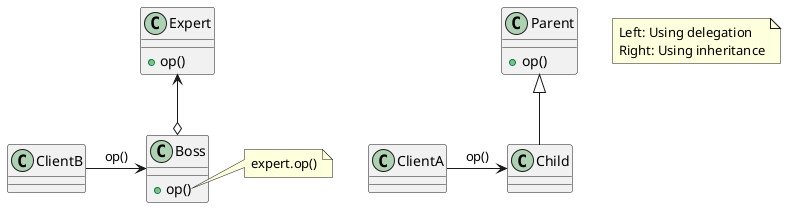
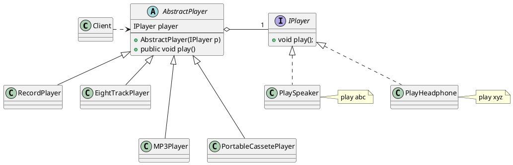
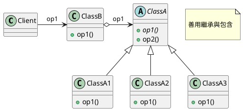
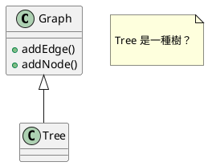
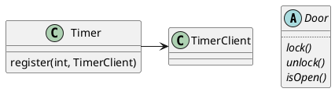
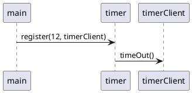
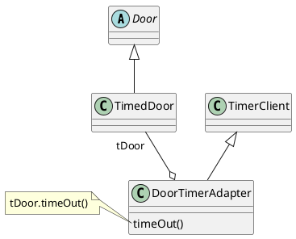
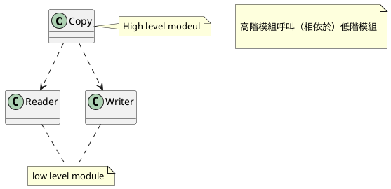
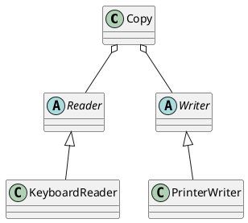
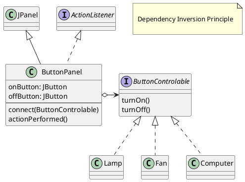

###### tags: `OOSE`

by NL Hsueh

# Ch08 物件導向設計原則

本章介紹物件導向特有的設計原則。

## 8.1 異中求同：一般化原則

> 儘量把相似的類別共同的部份一般化建立為父類別，子類別繼承後增加其特性與功能。


繼承的優點在前面的章節已談過，簡言之：新增功能實作是容易的，因為多半功能以透過繼承來實踐。

## 8.2 委以重任：善用包含/委託


> 善用包含/委託的關係，它可以間接的實踐繼承，而且更有彈性。


下圖左上方是透過繼承的方 ClassB 擁有 `op1()` 的能力; 右下方是相對應透過委託的方式來達成。我們讓 ClassB 包含 ClassA 並「假裝具備」`op1()` 的方法，當 client 請求 `op1()` 時，他就委託給他所包含的 ClassA 物件來執行。

> 委託：delegation

<!-- 

圖：委託取代繼承
 -->


相較於包含，繼承的缺點：

- 白箱重用 (white box reuse)。父類別的內部細節通常可以子類別物件可視，因此造成白箱重用。「包含/委託」較易達成黑箱重用。
- 靜態綁定 (static binding)。子類別繼承自負類別的實作，在執行時無法變動。亦即一旦編譯完成就無法變動。包含為動態綁定，比較有彈性。以下播放器的例子也可以說明動態綁定的好處。

#### 避免程式碼重複
以下說明一個案例，如何透過委託來避免程式碼的重複。

想像一個播放器，其播放的介面都是 `play()`。一開始的 RecordPlayer, EightTrackPlayer 的實作方法都是 `abc`。後來新的兩個播放器 PortableCassettePlayer 與 MP3Player 的播放方式已經改變，實作變成 `xyz`，所以必須進行 override。但 MP3 又不能繼承 PortableCassettePlayer，只好程式碼重複。依據不重複原則，這是不好的設計。

<!--  -->

圖：造成程式碼的重複

可以透過委託的方式來解決這個問題，如圖。



<!--  -->

圖：修改後：使用委託

<!--  -->



## 8.3 空為上：善用介面

> 不要直接呼叫一個實作的類別。請呼叫一個介面，藉此降低模組之間的耦合力。


圖：Loose Coupling


介面的主要目的在定義兩個物件之件溝通的規格。考慮一個 IDE 的介面是電腦主機板與IDE設備如硬碟的溝通橋樑。當 IDE 介面一被定義後，主機板的廠商可以依照此介面去設計他們的主機板，而不需要理會將來的硬碟是 IBM 或 Seagate 或Quantum。相同的，硬碟廠商也可以依照 IDE 介面去設計他們的硬碟，而不需理會將來是哪一種主機板與其溝通
 
軟體的設計亦是相同的道理。兩個模組之間可以先定好一個溝通的介面，而後各模組的負責人就可以依此介面分別去實作，之後在結合即可。這樣的好處除增加系統平行開發的可能之外，亦可以增加系統的彈性：模組A不需要明確的知道與其合作的哪一個模組(假設是模組B)，他只要知道與其合作的介面為何即可(假設為介面I)。將來如果系統作修改或擴充，我們可以用符合介面I的模組B’來取代B，而不需要修改任何模組A的程式碼。

介面內只定義該做的事，而沒有定義如何實作。在Java中，介面只定義了一群方法，卻沒有定義這些方法的實作。例如我們宣告一個交通工具的介面：

```java=
public interface IManeuverable {
  public void left();
  public void right();
  public void forward();
  public void backward ();
  public void setSpeed(double speed);
  public double getSpeed();
}
```


IManeuverable是一個介面，它定義一個『交通工具應有的功能』(能左右轉、前進、後退及設定速度)。此介面是交通管理系統(TrafficManager)與汽機車(Car、Motor)之間溝通的一個橋樑，汽機車實作此介面，且交通管系統使用此介面。


對TrafficManager（介面的使用類別）的開發者而言，不需要知道交通工具的實作，只需要知道要用的介面內有哪些方法可以呼叫即可。其部份的程式碼如下：


```javascript
// TrafficManager 使用交通工具介面
class TrafficManager {
  public void manage (IManeuverable c) {
    c.setSpeed(35.0);
    c.forward();
    c.left();
  }
}
```


在執行時，傳入的參數c可以是任何一個實作 IManeuverable 介面的類別的物件，例如Motor或Car的物件。這與前一節所提及的多型是完全相同的概念。亦即：
若classA實作介面I，則介面I的所有方法可以作用在任何classA的物件，及ClassA的子類別的物件上。

對 Car、Motor（介面的實作類別）等而言，他們必須實作 IManeuverable 所定義的所有方法，而不需要知道TrafficManager如何與其溝通。其部份的程式碼如下：

```java=
public class Car implements IManeuverable{
   ...
}
public Moter implements IManeuverable{
   ...
}
```


### 類別繼承與介面繼承

介面的作用在「將一群具有相同行為的類別抽象出來成為一個介面」，好讓其它的物件針對此抽象作處理，而非一個個的個別類別。這樣的機制所帶來的好處就是多型。我們也提到類別的繼承可以帶來多型，並討論它所可能帶來的困擾。如果類別的繼承也可以帶來多型，那們我們為什麼要介面繼承？

在物件導向中，類別繼承(class inheritance)與介面繼承(interface inheritance)是特性類似卻又目的不同的兩個觀念，常常造成混淆與誤用。這是因為它們提供許多相同的架構與益處，我們用下表區別它們的差別。


|      | 類別繼承                                                                   | 介面繼承                                                                     |
| ---- | -------------------------------------------------------------------------- | ---------------------------------------------------------------------------- |
| 另名 | 實作繼承 (Implementation inheritance)                                      | 行為繼承 (Behavior Inheritance)                                              |
| 目的 | 子類別不需定義自己的實作，而是引用父類別的實作，亦即，再使用父類別的程式碼 | 子類別可以在任何地方取代父類別的工作或角色，亦即，提供一個抽象以做為多型之用 |
| 關係 | 是一種 (is a kind of)                                                      | 支援實作 (is a kind of that support this interface)                          |
| 取代 | 若 B 擴充A，則 B 的物件可以取代A的物件                                     | 若B實作A，則B的物件可以取代A的介面物件                                       |


在類別繼承中的父類別是有實作的，所以子類別繼承父類別的目的是為了擁有像父類別一般的功能。介面繼承的目的不是在擁有介面的能力(事實上，介面根本沒有實作)，而在宣稱此類別將擁有介面內所宣稱的能力，但此能力必須類別自己實作，而非繼承自介面。綜合來說：類別繼承是為了再利用父類別的程式碼，介面繼承卻是為了提供一個抽象以做為多型之用。類別繼承的『附帶』好處是多型，但使用上要小心。

那們介面繼承會不會違反 LSP (see \ref{sec:LSP})？因為介面內沒有任何的實作，行為上絕對不會與子類別相互矛盾或衝突。這點也給我們另一個啟示，如果我們只要一個抽象觀念而非實作上的繼承 -- 用介面繼承，而不要用類別繼承。


## 8.4 代父從軍：Liskov 取代原則

> 引用到父類別的方法必須要能夠在不知道其子類別為何的情形下也能夠套用在子類別上。

Liskov 取代原則 (Liskov Subsitution Principle; ==LSP==) 主要探討的是子類別可否取代父類別的問題。這個問題的基本是物件的多型（polymorphism）。

#### 什麼是多型？
「相同的訊息可以送給不同的類別的物件，每一個物件會依其獨特性作出不同的反應」，或「相同的方法可以作用在不同的物件上」。例如在下例中，Circle 與Rectangle 都是Shape的子類別，所以 Shape 中所定義的方法可以用在 Circle 或Rectangle 中。假設類別 MyApp 的方法 paint 會要求一個 Shape 物件作繪圖的動作，如下： 

```java=
class MyApp {
  public void paint(Shape s) {
    s.draw();
  }
  …
}
```


第二行中的 paint() 的參數為 Shape，代表 MyApp 的物件可以送訊息給Shape、Circle 或 Rectangle的物件（因為這三個類別是Shape的子類別）。亦即，行3中的s物件在執行期間，可能是 Shape、Circle 或 Rectangle 的物件。方法 draw() 可以作用在多個類別 (Shape、Circle或Rectangle) 的物件上，故稱為多型。若從「取代」的角度來看，子類別 (Circle) 是父類別 (Shape) 功能的擴充，*所以由子類別來取代父類別去執行的父類別動作 (draw()) 也沒有問題*。多型的使用可以視為一種子類別的物件取代父類別物件工作的行為。

然而，繼承並非是萬無一失的，如果不小心謹慎的使用多型的技巧，可能會造成問題。以下我們以2個實例來說明不適當的繼承所帶來的問題。

### 正方形是一種矩形嗎﹖

從概念上來看，正方形 (Square) 是一種矩形 (Rectangle)，所以我們很自然的在它們之間宣告一個繼承關係)。以下程式說明 Square 在繼承 Rectangle 以後所作的修改，因為 Square 的寬與高是相同的，所以 Square 必須覆蓋方法 setWidth() 與setHeight() 用以保障長與寬都相同。

```java
class Rectangle {
   private int width, height;
   public Rectangle (int w, int h) {
      width = w;
      height = h;
   }
   public setWidth(int w) {
      width = w;
   }
   public setHeight(int h) {
      height = h;
   }
}

class Square extends Rectangle {
   public Square (int s) { super (s, s); }
   public setWidth(int w) {
      super.setHeight(w); // 順便設定高度
      super.setWidth(w);
   }
   public setHeight(int h) {
      super.setHeight(h);
      super.setWidth(h); // 順便設定寬度
   }
}

class App {
   public void testLSP(Rectangle r) {
      r.setWidth(4);
      r.setHeight(5);
      if (r.getArea() != 20 ) // 4*5=20, 面積應該為 20			   
	      System.out.println( "Error");
   }
   public static void main(String args[]) {
      Rectangle r = new Rectangle(3, 4);
      testLSP(r); // 會印出 Error 嗎？
      Square s = new Square (5);
      testLSP(s); // 會印出 Error 嗎？
   }
}             
```

類別 App 中的方法 testLSP() 傳入Rectangle物件。對 paint() 而言，它所要處理的物件就是一個 Rectangle，所以在設定它的寬度與長度分別為 4 與 5 後，r 的面積就應該是 20(4*5=20)。然而事實並非如此 --- 若傳進的物件是一個 Rectangle 時不會出錯，但若傳進的物件是一個 Square 時就會出錯 (面積會變成25)。為什麼會這樣呢？依照多型的定義，用 Square 的物件來取代 Rectangle 的物件來運作應該不會有問題的呀？

Rectangle 的例子說明這個現象。子類別繼承父類別後會有擴充的屬性及功能，也就是說，物件的功能應該越多。但 Square 繼承 Rectangle 後，**條件/限制卻越來越多了** (Square多了對屬性間的限制)，這時候用 Square 來取代 Rectangle 也會出現問題。

> 除了概念是 is-a-kind-of 的關係外，子類別在行為上也必須能取代父類別，才能有繼承的關係

### Tree是一種Graph？

從數學上來看，樹狀結構 (Tree) 與圖形結構 (Graph) 都是由點 (node) 與線 (edge)所構成的的結構，不同的是 Tree 要求任2點必須相通(直接或間接)，而且任2點只有一個路徑(也就是不可以有迴圈)。Graph可以有迴圈的結構。從概念上及數學上來看樹狀結構(Tree)「是一種」(is a kind of) 圖形結構 (Graph)，依據物件導向分析 ako 的關係，我們讓 Tree 繼承 Graph。


<!--  -->




Graph有 addNode() 與 addEdge() 2個方法，分別用以新增點與線，這在 Graph 中是極為自然的。Tree 因為繼承自 Graph，也順理成章的擁有 addNode 與addEdge() 2種功能，然而問題就出在此處 - Tree 任意的新增與移除點或線後就不是一個 Tree了，這 2 個方法在 Tree 中根本不自然，也不應該。怎麼會這樣呢？Tree 不是一種 Graph 嗎？為什麼繼承後會發生這種問題？

LSP的定義如下：

> 引用到父類別的方法必須要能夠在不知道其子類別為何的情形下也能夠套用在子類別上。*Functions that use references to super classes must be able to use object of subclasses without knowing it!*

相對於Rectangle的例子：

> *Functions (paint) that use references (s) to super classes (Rectangle) must be able to use object of subclasses (Square) without knowing it!*

簡單的說，LSP 要求我們在建立類別階級時也必須同時考慮到他們之間的行為階級 (子類別是否繼承父類別的行為)，若否，則不應建立類別階級。編譯器並不能幫我們檢查這一點，因為，只要程式語言提供多型的功能，用子類別的物件來取代父類別的物件來運作在編譯時是不會發生錯誤的。所以這個問題就必須留給設計者傷腦筋。原則是什麼？子類別的行為不能比父類別少、子類別的限制不能比父類別多、並且多用介面繼承，少用類別繼承。


## 8.4 穠纖合度：介面分割原則

> 介面分離原則（Interface Segregation Principle）採用多個分離的介面，比採用一個通用的涵蓋多個業務方法的介面要好。


在說明此介面分割原則之前，我們先以 Door 實例說明 **介面污染（interface pollution）**。

假設我們有一個抽象類別 Door, 裡面定義了 `lock()}` 與 `unlock()`, `isDoorOpen()` 等方法，分別表示關門，開門，是否開著等功能：

```java
abstract class Door {
    public abstract void lock();
    public abstract void unlock();
    public abstract boolean isDoorOpen();
}
```
	
Timer 是一個專門來做警告的類別，裡面有一個 `register()` 的方法，

```java
class Timer {
    // 時間到就會通知 client
    public void regsiter(int timeout, TimerClient client);
}
class TimerClient {   
    public abstract void timeout (int timeOutId);
}
```

<!-- 

圖：Timer1
 -->





當 timeout 的時間到了，他就會通知 client。如果有一個物件想要被通知，他就可以呼叫 register 來做一個註冊，以便在 timeout 來時被通知。

我們想設計一個 TimedDoor 類別，當門開太久時，他就會警告。TimedDoor 會被通知到。因為 TimedDoor 是 Door 得子類別，我們想把它設計成 TimerClient 的子類別，但 TimedDoor 已經是 Door 的子類別了，在 Java 中我們無法做多重繼承。

因此，==設計者會讓 Door 繼承 TimerClient，如此一來，TimedDoor 自然地成為 TimerClient 的子類別，編譯器與執行上都沒有錯誤==，但這樣的設計造成 「Door 相依於 TimerClient」，這樣的相依性是沒有道理的，也造成了介面污染。假設 TimerClient 內有 `timeout()} 的抽象方法，Door 也需要實作此方法`。 

```java=
class Door extends TimerClient { //錯誤的設計！！
    public abstract void TimeOut (int timeOutId) {
    }   
}
```

一開始的設計者可能知道此方法僅是為了 **「讓編譯器通過」** 的權宜設計，但到了維護期，如果 timeout() 的介面有所更動而需要 Door 重新編寫時，維護者就不一定知道其意義為何，而造成困擾。簡言之，目前的設計錯誤為：

:::info
錯誤設計：TimedDoor 為了要成為一種 TimerClient，但本身又不能繼承 TimerClient，只好讓 Door 去繼承 TimerClient。
:::

:::warning
請畫出上述設計的 UML 類別圖
::: 

其實這個問題我們可以有兩個解決方法

- 把 TimerClient 設計成介面
- TimerDoor 透過委託的方式來呼叫 TimerClient

回到介面分離原則。當我們設計一個介面時，內部所包含的方法必須謹慎的考量，避免設計一個廣用，包含很多方法的大介面。採用通用大介面通常會造成介面污染。當一個類別為了滿足其中一個方法而必須實作該介面時，就同時被迫實作其他的方法，而造成介面污染。

簡單的說，介面分離原則建議：==擁有許多方法的介面應該被分離不同的介面，每一個介面擁有一群緊密相關的方法，被一些特定的客端物件使用==。

:::success
Interface pollution must be broken up into groups of methods, every group serves a different set of client.
:::

<!--  -->



## 8.5 所依皆幻：相依反轉原則

> 高階模組不該相依於一個低階模組。兩者都應該相依於抽象。


> **Dependency Inversion Principle (DIP)**: High level modules should not depend upon low level modules. All should depend on **abstraction**.

1970 年代的軟體開發多遵從結構化分析，倡導由上而下的分解（top down decomposition），這樣的方法論鼓勵一個高階的模組相依於一個低階的模組。然而，高階模組包含著一個應用程式重要的策略決定與企業邏輯，如果它相依於一個低階的模組，那就代表策略的變更會因為低階的執行的不同而變更，這是不是適當的。


#### Copy Program

我們可能會寫出以下的 copy() 模組

```java
void Copy() {
   int c;
   while ((c = ReadKeyboard()) != EOF)
      WritePrinter(c);
}
```
	
<!--  -->



圖：高階模組呼叫（相依於）低階模組

這個程式看起來沒有什麼問題，但 copy 這個高階的動作就相依於 ReadKeyBoard() 這個低階的動作了。例如今天我們要輸出的對象是一個 printer，程式就要做一些修改，如下：	

```java=
void Copy(outputDevice dev) {
   int c;
   while ((c = ReadKeyboard()) != EOF)
   	    if (dev == printer) 
   	       WritePrinter(c);
        else 
           WriteDisk(c);
}
```


> 複製，應該是一個通用的行為，不該相依於 keyboard, disk, printer 等物件

一般來說，所謂的 copy 就是把資料從「來源」複製一份到「目的地」，這樣的政策是不會變的，不該因為目的地是 disk 或 printer 而有所改變。下方是一個符合 DIP 原則的程式：

```java
abstract class Reader {   
	public abstract int Read();   
}
abstract class Writer  {    
	public abstract void Write(char);  
}
//copy 相依於抽象的 Reader, Writer
void copy(Reader r, Writer w)  { 
   int c;
   while((c=r.Read()) != EOF)
   	  w.Write(c);
}
```

<!--  -->



圖：相依於抽象

在這個程式中，copy 所牽涉到的來源與目的地分別是抽象的 Reader 和 Writer, 就不會相依於 Printer, Scanner, Disk 等低階的物件了。若我們今天想要寫道 Disk, 只要讓 Disk 去實作 Writer 再透過 dynamic binding 就可以達到上述的效果。	
	
#### Lamp Program

我們再看一個檯燈開關的例子。

```java
// 檯燈
class Lamp {
    public void TurnOn() {...}
    public void TurnOff() {...}
}
	
// 開關面板
class Button {
    private Lamp lamp;
    public Button(Lamp p) {lamp =p; }
    public void Detect() {
    bool buttonOn = GetPhysicalState();
        
    // 控制檯燈的開關
    if (buttonOn) 
        lamp.TurnOn();
    else 
        lamp.TurnOff();
}
```

這樣的程式不好！Button 相依於 Lamp, 也就是說它只能處理 Lamp 了。想想看我們從五金行買回來的開關面板可是沒有限定只能用來處理檯燈阿！以下的程式則相依於一個抽象。

```java	
class LampDemo {
    public static void main(String args[]) {
        ButtonControlable lamp = new Lamp();
		Button b = new Button(lamp); //開關控制檯燈
		b.turnOn();
		b.turnOff();
		b.turnOn();		

		ButtonControlable ac = new AC();
		b = new Button(ac); //可以換成控制冷氣機
		((AC)ac).setDegree(30);
		b.turnOn();
		b.turnOff();
		((AC)ac).setDegree(21);
		b.turnOn();
	}
}

// 開關按鈕的對象（小家電）
interface ButtonControlable {
    void turnOn();
    void turnOff();
}

// 開關按鈕，Button，相依於一個抽象通用的 ButtonClient
class Button {
    private ButtonControlable  bClient;
    public Button(ButtonControlable b) { //連結真實的 ButtonClient
        bClient = b;
    }
    public void turnOn() {
    	bClient.turnOn();
    }
    public void turnOff() {
    	bClient.turnOff();
    }
}

// Lamp 自己定義開關
class Lamp extends ButtonControlable {
    String state="off";
    public  void turnOn() {
    	state = "on";
    	printState();
    }
    public  void turnOff() {
    	state = "off";
    	printState();    	
    }
    private void printState() {
    	System.out.println("Lamp is " + state);   		
    }
}

// 冷氣機 自己定義開關
class AC implements ButtonControlable {
    int currentDegree = 28;
    String state="off";

    // 高於 28 度才可以開啟
    public  void turnOn() {
    	if (currentDegree > 28) 
    		state = "on";
        printState();
    }
    public  void turnOff() {
    	state = "off";
    	printState();    	
    }
    private void printState() {
    	System.out.println("AC is " + state);   		
    }
    public void setDegree(int d) {
    	this.currentDegree = d;
    }
}
```


> 高階模組不應該依賴低階模組，兩者必須依賴抽象(即抽象層)，抽象不能依賴細節，但細節必須依賴抽象，抽象模組不應該根據低階模組來創造，這就是「依賴反轉原則」的概念。


### 相依注入

::: success
將相依性移除於模組之中，透過相依性注入（dependency injection）的方式來建立相依性。
:::


#### Creation injection

考慮以下的程式 Customer 的物件相依於低階的 SQLServer 物件。

```java
Customer obj = new Customer();
obj.add();
...
class Customer {
	private SQLServer db = new SQLServer(); // 相依於於 SQLServer 了
	public boolearn validate() { ... }
	public void add() {
	   if  (validate())  db.add();
	}   
}
```

這是不好的，應該抽離出來。如下的程式讓 Customer 相依於一個抽象的 DBI 介面，但是何時建立 Customer 與 Oracle 的連接呢？**在建立 Customer 時，我們決定採用 Oracle 這個物件，因此是在「物件建立時」決定這個相依性，稱之為 Creation Injection**。

```java=
Customer obj = new Customer(new Oracle());
obj.add();
...
class Customer {
    private DBI db;
    public Customer (DBI dbi) {
    	db = dbi;
    }
    public boolearn validate() { ... }
    public void add() {
       if  (validate())   db.add();
    }   
}
```

同理，在上一個 Button 的例子中，也是透過 creation injection 來決定相依性。

#### Factory pattern

有時候該相依物件的決定並不是單純的建構子所決定的，而是有另一個物件生成的：

```java
DBFactory dbf = new DBFactory(...);
Customer obj = new Customer(dbf);
..
class Customer {
    private DBI db;
    public Customer (DBFactory dbf) {
    	db = dbFactory.createDB();
    }
    ...
}
```

#### Setter injection

有時候在物件一開始生成之時上無法決定其相依物件，而是透過 setter 方法來設定其相依性，例如：

```java
Customer obj = new Customer();
obj.setDB(new Oracle());
..
class Customer {
    private DBI db;
    ...
    public void setDB(DBI db) { //setter injection
       this.db = db;
    }
}
```

## 8.6 身不由己：控制反轉原則

Inversion of Control (IoC)

> 應用程式（或客製化模組）的控制流程而來自於一個一般性、可重用的框架，而非模組本身。

> Inversion of Control (IoC): Custom-written portions of a computer program receive the flow of control from a generic, reusable framework.

傳統的程式我們控制整個程式的流程，例如

```java
System.out.println("input your name");
String name = scanner.nextLine();
name = processName(name);
System.out.println("input your name");
String address = scanner.nextLine();
address = processAddress(address);
show(name, address);
```

程式會照你所想的一步步的執行：你先輸入你的名字、然後住址，接著呈現出你的名字與住址。

但現今的 window 程式設計，其流程就並非如此，你（programmer）並不會知道使用者會先輸入 name 或是 address，你只要關心使用者按下確定的 button 時應該處理什麼就好了（event driven design）。這是因為流程由上一層的 Window 框架所決定，而非你的程式。

假設我們設計一個書籍閱讀的框架，所有的書籍其閱讀流程都是：openBook, readline, 然後 closeBook，我們把這個流程寫在抽象的 Book 「框架」中。

```java
abstract class Book {
   public void readBook() {
      openBook();
      readLine();
      closeBook();
   }
   abstract void openBook();
   abstract void readLine();
   abstract void closeBook();
}
```

一本小說（Novel）的「閱讀流程」並不是由小說決定的，而是由上層的 Book 所決定的，小說只是去決定其 openBook, readLine 的方法：

```java
class Novel extends Book {
    void openBook() {...}
    void readLine() {...}
    void closeBook() {...}
}
```

對於小說、漫畫、論文而言，Book 就像是一個框架一般，固定（決定了）一些流程。我們在日後會說明 Template 設計樣式就是一種 IoC 的應用。

採用 IoC 的策略可以幫助我們建立一個可重複使用的程式碼框架，讓我們少寫很多的程式碼，並且確保程式一定的品質，在現今複雜應用程式中是不可或缺的。各位常常聽到的許多 Web framework, AP framework 都是應用了繼承與 IoC 的設計原則。

#### 好萊塢原則
有時候 IoC 也會和好萊塢原則一起談，其意義為：「不要叫我們，我們有需要將會叫你」 (Don't call us, we'll call you)」[^hollywood]。你的應用程式不需要關注上層的流程是怎麼做的，寫好你的小程式（模組功能），該到你的流程就會叫你，不需囉嗦煩惱。

[^hollywood]:許多人到好萊塢逐夢，經紀公司會叫你留下名片，叫你不要再打電話了，必要時它會打電話給你。

## 練習

- **ex01** 請將下述程式從繼承改成委託的方式來撰寫

```java
class B {
   public void m1() {
      System.out.println("hello");
   }
}      
class A extends B {   
}
class App {
   public static void main(String args[]) {
      A a = new A();
      a.m1();
   }
}      
```
- **ex02** 只要是交通工具 Vehicle 就必須要能向左轉 (turnLeft) 向右轉 (turnRight) 停止 (stop) 或前進 (forward)。但如何實作 (implementation) 都必須由 Bike 或 Car 來決定。該怎麼設計類別結構？
- **ex03** 同上，VehicleManager 控制所有的交通工具: 紅燈停，綠燈行。
- **ex04** 下面的程式不夠通用，可否用 interface 改寫成更通用些？

```java
void control (Car[] cc) {
  for (Car c: cc) {
    if (isRed()) {
      c.stopCar();
    }
    else (isGreen()) {
      c.driveCar();
    }
  }
}

void controlBike (Bike[] bb) {
  for (Car b: bb) {
      if (isRed()) {
        b.stopBiking();
    }
      else if (isGreen()) {
        c.startBiking();
    }
  }
}
```

- **ex05** 應用 interface `Comparable`, 來設計一個 「通用型的 `getMax`」，它可以找出任何陣列內 最大的元素，例如可以找到最 max 的 People。

```java
interface Comparable {
  public int compare(Comparable other);
}
class GeneralMax {
    public static ? getMax(?[] data) {
       ? 
  }
}
class Main {
   ?
}
class People ? {
   ?
}
```

- **ex06** 應用 DIP 的原則設計一個通用型的開關器 (ButtonPanel)，它可以用來開關所有電器 -- 只要它有 on, off 的介面。注意 ButtonPanel 不能「看到很多」不同型態的電器，這樣偶合力會很高，也違反的 DIP 的原則。這個例子可以作為一個「GUI 元件」設計的練習。參考下圖設計，請完成程式碼。

<!--  -->




- **ex07** 請參考 DIP 原則（Dependency Inversion Principle）設計一個通用型的遙控器 RemoteController, 可以對電視 (TV) 或冷氣 (AirConditioner) 做開、關、上、下（on, off, up, down）等動作。TV 預設的頻道是第七台，上下會在 1-15 間變化。冷氣預設 25 度，會在 20-30 度間變化。使用 Swing 來呈現此遙控器面板。(Hint: `IRemoteControllable`, 參考 [Swing 範例](https://github.com/nlhsueh/OOSE/blob/master/src/swing/SwingApp.java)。

- **ex08** 以下原則何者錯誤？
    - [ ] 設計應該模組化，達到低內聚力，高耦合度
    - [ ] 「相依反轉」說的是，高階的物件不該相依相依於低階，應該都相依於抽象
    - [ ] LSP 告訴我們概念上的一般化，不一定都有繼承關係
    - [ ] 不重複原則，說的是資料和程式碼應該要避免重複


### 解答參考

- ex01 透過委託來改寫如下：
```java
class A {
  B b;
  public A(B b) {
    this.b = b;
  }
  public void m1() {
    b.m1();
  }
}      
```

<!-- \begin{figure}[h]
\begin{center}
\includegraphics[width=0.7\columnwidth]{principle/DIPControllable.png}
\label{fig:dip:controllable}
\end{center}
\end{figure}
 -->
