# Ch08 物件導向設計原則

本章介紹物件導向特有的設計原則。

## 8.1 異中求同：一般化原則

> 儘量把相似的類別共同的部份一般化建立為父類別，子類別繼承後增加其特性與功能。


繼承的優點在前面的章節已談過，簡言之：新增功能實作是容易的，因為多半功能以透過繼承來實踐。

## 8.2 委以重任：善用包含/委託


> 善用包含/委託的關係，它可以間接的實踐繼承，而且更有彈性。


下圖左上方是透過繼承的方式 `ClassB` 擁有 `op1()` 的能力; 右下方是相對應透過委託的方式來達成。我們讓 `ClassB` 包含 `ClassA` 並「假裝具備」`op1()` 的方法，當 `client` 請求 `op1()` 時，他就委託給他所包含的 `ClassA` 物件來執行。

> 委託：`delegation`

<!--  -->

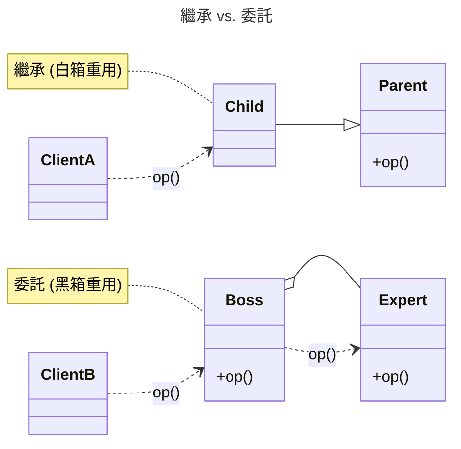

相較於包含，繼承的缺點：

- 白箱重用 (`white box reuse`)。父類別的內部細節通常對於子類別物件可視，因此造成白箱重用。「包含/委託」較易達成黑箱重用。
- 靜態綁定 (`static binding`)。子類別繼承自父類別的實作，在執行時無法變動。亦即一旦編譯完成就無法變動。包含為動態綁定，比較有彈性。以下播放器的例子也可以說明動態綁定的好處。

### 8.2.1 避免程式碼重複
以下說明一個案例，如何透過委託來避免程式碼的重複。

想像一個播放器，其播放的介面都是 `play()`。一開始的 `RecordPlayer`, `EightTrackPlayer` 的實作方法都是 `abc`。後來新的兩個播放器 `PortableCassettePlayer` 與 `MP3Player` 的播放方式已經改變，實作變成 `xyz`，所以必須進行 `override`。但 `MP3` 又不能繼承 `PortableCassettePlayer`，只好程式碼重複。依據不重複原則，這是不好的設計。

 

可以透過委託的方式來解決這個問題，如下圖所示。

 

---

委託與繼承同時使用：

 <!--   -->

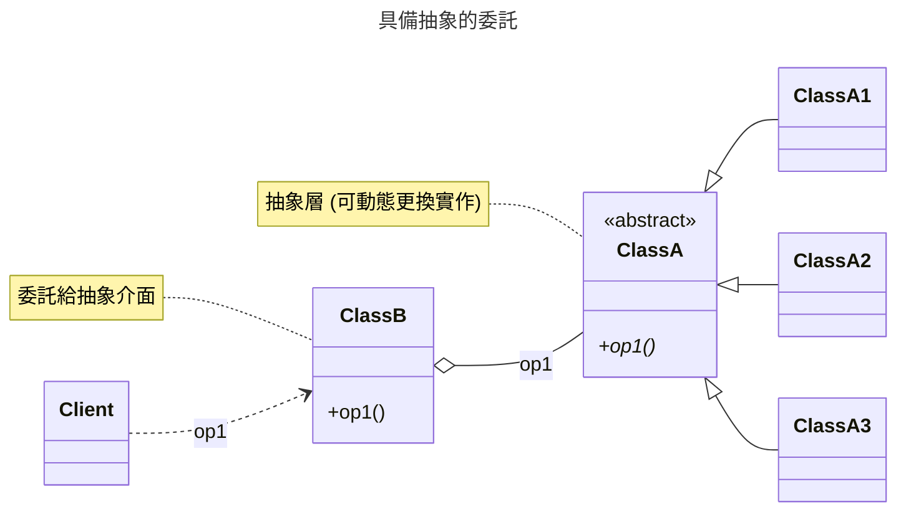

### 💡 8.2.1 隨堂測驗

1️⃣ 為何「委託」被認為比「繼承」在執行時期更有彈性？
- (A) 因為委託是在編譯時期決定的靜態綁定。
- (B) 因為委託可以在執行時期動態更換所包含的物件（動態綁定）。
- (C) 因為委託能直接存取父類別的所有私有屬性。
- (D) 因為委託不需要定義任何實作。

<details>
<summary>解答</summary>
(B)。
說明：繼承通常是靜態綁定，一旦編譯完成就無法在執行時更換父類別實作；而委託（包含）則是動態綁定，可以在執行期間透過 Setter 或建構子抽換內部的實作物件，因此更有彈性。
</details>

---

2️⃣ 下列關於「白箱重用」與「黑箱重用」的敘述何者正確？
- (A) 繼承屬於黑箱重用，因為子類別看不到父類別細節。
- (B) 包含/委託屬於白箱重用，因為外部物件可以看到內部細節。
- (C) 繼承屬於白箱重用，因為父類別的內部細節通常對子類別可視。
- (D) 兩者皆屬於白箱重用。

<details>
<summary>解答</summary>
(C)。
說明：繼承會打破父類別的封裝（子類別常能看到父類別內部的 protected 成員），因此稱為白箱重用；委託則僅透過公有介面進行互動，不需知道內部細節，稱為黑箱重用。
</details>

---

## 8.3 空為上：善用介面

> 不要直接呼叫一個實作的類別。請呼叫一個介面，藉此降低模組之間的耦合力。


圖解：耦合度 1 與 3 的差別

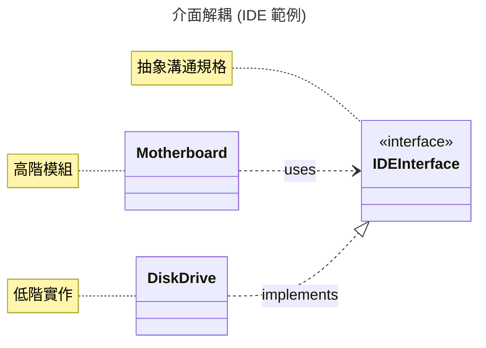

介面的主要目的在定義兩個物件之間溝通的規格。考慮一個 `IDE` 的介面是電腦主機板與 `IDE` 設備如硬碟的溝通橋樑。當 `IDE` 介面一被定義後，主機板的廠商可以依照此介面去設計他們的主機板，而不需要理會將來的硬碟是 `IBM` 或 `Seagate` 或 `Quantum`。相同的，硬碟廠商也可以依照 `IDE` 介面去設計他們的硬碟，而不需理會將來是哪一種主機板與其溝通
 
軟體的設計亦是相同的道理。兩個模組之間可以先定好一個溝通的介面，而後各模組的負責人就可以依此介面分別去實作，之後在結合即可。這樣的好處除增加系統平行開發的可能之外，亦可以增加系統的彈性：模組 `A` 不需要明確的知道與其合作的哪一個模組（假設是模組 `B`），他只要知道與其合作的介面為何即可（假設為介面 `I`）。將來如果系統作修改或擴充，我們可以用符合介面 `I` 的模組 `B'` 來取代 `B`，而不需要修改任何模組 `A` 的程式碼。

介面內只定義該做的事，而沒有定義如何實作。在 `Java` 中，介面只定義了一群方法，卻沒有定義這些方法的實作。例如我們宣告一個交通工具的介面：

```java
public interface IManeuverable {
  public void left();
  public void right();
  public void forward();
  public void backward ();
  public void setSpeed(double speed);
  public double getSpeed();
}
```


`IManeuverable` 是一個介面，它定義一個『交通工具應有的功能』（能左右轉、前進、後退及設定速度）。此介面是交通管理系統 (`TrafficManager`) 與汽機車 (`Car`、`Motor`) 之間溝通的一個橋樑，汽機車實作此介面，且交通管理系統使用此介面。


對 `TrafficManager`（介面的使用類別）的開發者而言，不需要知道交通工具的實作，只需要知道要用的介面內有哪些方法可以呼叫即可。其部分的程式碼如下：


```java
// TrafficManager 使用交通工具介面
class TrafficManager {
  public void manage (IManeuverable c) {
    c.setSpeed(35.0);
    c.forward();
    c.left();
  }
}
```

在執行時，傳入的參數 `c` 可以是任何一個實作 `IManeuverable` 介面的類別的物件，例如 `Motor` 或 `Car` 的物件。這與前一節所提及的多型是完全相同的概念。亦即：
若 `classA` 實作介面 `I`，則介面 `I` 的所有方法可以作用在任何 `classA` 的物件，及 `ClassA` 的子類別的物件上。

對 `Car`、`Motor`（介面的實作類別）等而言，他們必須實作 `IManeuverable` 所定義的所有方法，而不需要知道 `TrafficManager` 如何與其溝通。其部分的程式碼如下：

```java
public class Car implements IManeuverable{
   ...
}
public Moter implements IManeuverable{
   ...
}
```
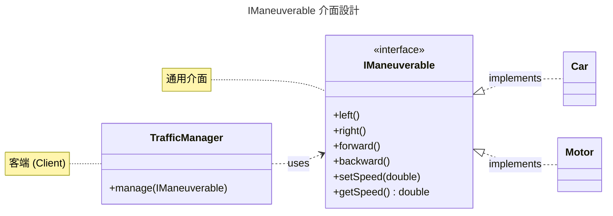

### 8.3.1 類別繼承與介面繼承

介面的作用在「將一群具有相同行為的類別抽象出來成為一個介面」，好讓其它的物件針對此抽象作處理，而非一個個的個別類別。這樣的機制所帶來的好處就是多型。我們也提到類別的繼承可以帶來多型，並討論它所可能帶來的困擾。如果類別的繼承也可以帶來多型，那們我們為什麼要介面繼承？

在物件導向中，類別繼承(class inheritance)與介面繼承(interface inheritance)是特性類似卻又目的不同的兩個觀念，常常造成混淆與誤用。這是因為它們提供許多相同的架構與益處，我們用下表區別它們的差別。


|      | 類別繼承                                                                   | 介面繼承                                                                     |
| ---- | -------------------------------------------------------------------------- | ---------------------------------------------------------------------------- |
| 另名 | 實作繼承 (Implementation inheritance)                                      | 行為繼承 (Behavior Inheritance)                                              |
| 目的 | 子類別不需定義自己的實作，而是引用父類別的實作，亦即，再使用父類別的程式碼 | 子類別可以在任何地方取代父類別的工作或角色，亦即，提供一個抽象以做為多型之用 |
| 關係 | 是一種 (is a kind of)                                                      | 支援實作 (is a kind of that support this interface)                          |
| 取代 | 若 B 擴充A，則 B 的物件可以取代A的物件                                     | 若B實作A，則B的物件可以取代A的介面物件                                       |


在類別繼承中的父類別是有實作的，所以子類別繼承父類別的目的是為了擁有像父類別一般的功能。介面繼承的目的不是在擁有介面的能力（事實上，介面根本沒有實作），而在宣稱此類別將擁有介面內所宣稱的能力，但此能力必須類別自己實作，而非繼承自介面。綜合來說：類別繼承是為了再利用父類別的程式碼，介面繼承卻是為了提供一個抽象以做為多型之用。類別繼承的『附帶』好處是多型，但使用端要小心。

那麼介面繼承會不會違反 `LSP` (see \ref{sec:LSP})？因為介面內沒有任何的實作，行為上絕對不會與子類別相互矛盾或衝突。這點也給我們另一個啟示，如果我們只要一個抽象觀念而非實作上的繼承 -- 用介面繼承，而不要用類別繼承。


### 💡 8.3.2 隨堂測驗

1️⃣ 使用「介面」的主要目的之一是？
- (A) 增加程式碼的執行量。
- (B) 強制子類別必須繼承父類別的實作程式碼。
- (C) 定義物件間溝通的規格，降低模組間的耦合力。
- (D) 加快編譯速度。

<details>
<summary>解答</summary>
(C)。
說明：介面定義了通用的規格，讓使用端不需要知道具體的實作類別，達到鬆散耦合（Loose Coupling）。
</details>

---

2️⃣ 關於「類別繼承」與「介面繼承」的差異，下列敘述何者錯誤？
- (A) 類別繼承是為了再利用父類別的程式碼。
- (B) 介面繼承是為了提供抽象以做為多型之用。
- (C) 介面繼承也會繼承介面內的實作程式碼。
- (D) 類別繼承是 "is a kind of" 的關係，介面繼承則是宣稱具備某種行為。

<details>
<summary>解答</summary>
(C)。
說明：介面本身不包含具體實作，介面繼承（實作介面）是為了宣稱擁有該能力並由該類別自行實作，而非繼承現成代碼。
</details>

---

## 8.4 代父從軍：Liskov 取代原則

> 引用到父類別的方法必須要能夠在不知道其子類別為何的情形下也能夠套用在子類別上。

Liskov 取代原則 (Liskov Subsitution Principle; ==LSP==) 主要探討的是子類別可否取代父類別的問題。這個問題的基本是物件的多型（polymorphism）。

### 8.4.1 什麼是多型？
「相同的訊息可以送給不同的類別的物件，每一個物件會依其獨特性作出不同的反應」，或「相同的方法可以作用在不同的物件上」。例如在下例中，`Circle` 與 `Rectangle` 都是 `Shape` 的子類別，所以 `Shape` 中所定義的方法可以用在 `Circle` 或 `Rectangle` 中。假設類別 `MyApp` 的方法 `paint()` 會要求一個 `Shape` 物件作繪圖的動作，如下： 

```java
class MyApp {
  public void paint(Shape s) {
    s.draw();
  }
  …
}
```


第二行中的 `paint()` 的參數為 `Shape`，代表 `MyApp` 的物件可以送訊息給 `Shape`、`Circle` 或 `Rectangle` 的物件（因為這三個類別是 `Shape` 的子類別）。亦即，行 3 中的 `s` 物件在執行期間，可能是 `Shape`、`Circle` 或 `Rectangle` 的物件。方法 `draw()` 可以作用在多個類別 (`Shape`、`Circle` 或 `Rectangle`) 的物件上，故稱為多型。若從「取代」的角度來看，子類別 (`Circle`) 是父類別 (`Shape`) 功能的擴充，*所以由子類別來取代父類別去執行的父類別動作 (`draw()`) 也沒有問題*。多型的使用可以視為一種子類別的物件取代父類別物件工作的行為。

然而，繼承並非是萬無一失的，如果不小心謹慎的使用多型的技巧，可能會造成問題。以下我們以2個實例來說明不適當的繼承所帶來的問題。

### 8.4.2 正方形是一種矩形嗎﹖

從概念上來看，正方形 (`Square`) 是一種矩形 (`Rectangle`)，所以我們很自然的在它們之間宣告一個繼承關係。以下程式說明 `Square` 在繼承 `Rectangle` 以後所作的修改，因為 `Square` 的寬與高是相同的，所以 `Square` 必須覆蓋方法 `setWidth()` 與 `setHeight()` 用以保障長與寬都相同。

```java
class Rectangle {
   private int width, height;
   public Rectangle (int w, int h) {
      width = w;
      height = h;
   }
   public setWidth(int w) {
      width = w;
   }
   public setHeight(int h) {
      height = h;
   }
}

class Square extends Rectangle {
   public Square (int s) { super (s, s); }
   public setWidth(int w) {
      super.setHeight(w); // 順便設定高度
      super.setWidth(w);
   }
   public setHeight(int h) {
      super.setHeight(h);
      super.setWidth(h); // 順便設定寬度
   }
}

class App {
   public void testLSP(Rectangle r) {
      r.setWidth(4);
      r.setHeight(5);
      if (r.getArea() != 20 ) // 4*5=20, 面積應該為 20			   
	      System.out.println( "Error");
   }
   public static void main(String args[]) {
      Rectangle r = new Rectangle(3, 4);
      testLSP(r); // 會印出 Error 嗎？
      Square s = new Square (5);
      testLSP(s); // 會印出 Error 嗎？
   }
}             
```
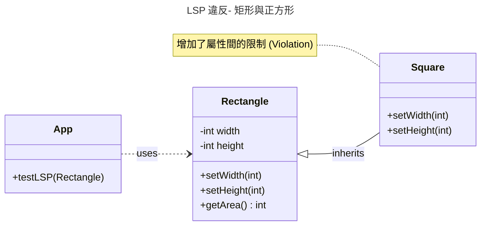


類別 `App` 中的方法 `testLSP()` 傳入 `Rectangle` 物件。對於 `paint()` 而言，它所要處理的物件就是一個 `Rectangle`，所以在設定它的寬度與長度分別為 4 與 5 後，`r` 的面積就應該是 20 (4*5=20)。然而事實並非如此 --- 若傳進的物件是一個 `Rectangle` 時不會出錯，但若傳進的物件是一個 `Square` 時就會出錯（面積會變成 25）。為什麼會這樣呢？依照多型的定義，用 `Square` 的物件來取代 `Rectangle` 的物件來運作應該不會有問題的呀？

`Rectangle` 的例子說明這個現象。子類別繼承父類別後會有擴充的屬性及功能，也就是說，物件的功能應該越多。但 `Square` 繼承 `Rectangle` 後，**條件/限制卻越來越多了** (`Square` 多了對於屬性間的限制)，這時候用 `Square` 來取代 `Rectangle` 也會出現問題。

> 除了概念是 `is-a-kind-of` 的關係外，子類別在行為上也必須能取代父類別，才能有繼承的關係

### 8.4.3 Tree 是一種 Graph？

從數學上來看，樹狀結構 (`Tree`) 與圖形結構 (`Graph`) 都是由點 (`node`) 與線 (`edge`) 所構成的的結構，不同的是 `Tree` 要求任 2 點必須相通（直接或間接），而且任 2 點只有一個路徑（也就是不可以有迴圈）。`Graph` 可以有迴圈的結構。從概念上及數學上來看樹狀結構 (`Tree`) 「是一種」 (`is a kind of`) 圖形結構 (`Graph`)，依據物件導向分析 `ako` 的關係，我們讓 `Tree` 繼承 `Graph`。


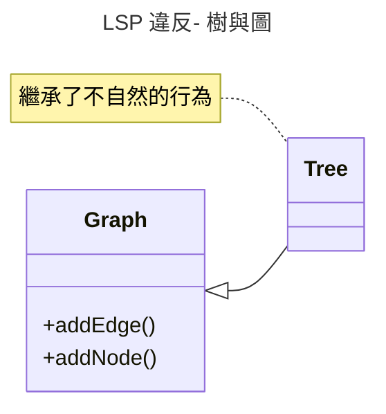


`Graph` 有 `addNode()` 與 `addEdge()` 2 個方法，分別用以新增點與線，這在 `Graph` 中是極為自然的。`Tree` 因為繼承自 `Graph`，也順理成章的擁有 `addNode()` 與 `addEdge()` 2 種功能，然而問題就出在此處 - `Tree` 任意的新增與移除點或線後就不是一個 `Tree` 了，這 2 個方法在 `Tree` 中根本不自然，也不應該。怎麼會這樣呢？`Tree` 不是一種 `Graph` 嗎？為什麼繼承後會發生這種問題？

LSP的定義如下：

> 引用到父類別的方法必須要能夠在不知道其子類別為何的情形下也能夠套用在子類別上。*Functions that use references to super classes must be able to use object of subclasses without knowing it!*

相對於 `Rectangle` 的例子：

> *Functions (`paint()`) that use references (`s`) to super classes (`Rectangle`) must be able to use object of subclasses (`Square`) without knowing it!*


簡單的說，`LSP` 要求我們在建立類別階級時也同時考慮到他們之間的行為階級 (子類別是否繼承父類別的行為)，若否，則不應建立類別階級。編譯器並不能幫我們檢查這一點，因為，只要程式語言提供多型的功能，用子類別的物件來取代父類別的物件來運作在編譯時是不會發生錯誤的。所以這個問題就必須留給設計者傷腦筋。原則是什麼？子類別的行為不能比父類別少、子類別的限制不能比父類別多、並且多用介面繼承，少用類別繼承。


### 💡 8.4.4 隨堂測驗

1️⃣ Liskov 取代原則（LSP）的核心要求是？
- (A) 子類別一定要比父類別擁有更多的屬性。
- (B) 引用父類別的方法必須能在不知道子類別為何的情況下套用於子類別。
- (C) 子類別可以隨意覆寫父類別行為，即使邏輯矛盾也沒關係。
- (D) 優先使用類別繼承，而非介面繼承。

<details>
<summary>解答</summary>
(B)。
說明：LSP 要求子類別在行為上必須能完全取代父類別，而不破壞原本程式的正確性，常用來檢查繼承關係是否合理。
</details>

---

## 8.5 穠纖合度：介面分割原則

> 介面分離原則（Interface Segregation Principle; ISP）採用多個分離的介面，比採用一個通用的涵蓋多個業務方法的介面要好。

簡單來說，當我們設計介面時，與其設計一個包含所有功能的「大雜燴介面」，不如將其拆分成多個小而專精的介面。這樣，實作這些介面的類別就只需要專注於它們真正感興趣的功能。

### 8.5.1 介面污染

介面污染是違反 ISP 原則後產生的直接結果。當一個介面包含了太多不相關、或者只有少數實作類別才需要的方法時，我們就說這個介面被「污染」(`interface pollution`)了。有時候繼承的一個不該繼承的介面，也是一種介面污染。

`Timer` 是一個專門來做警告的類別，裡面有一個 `register()` 的方法，

```java
class Timer {
    // 時間到就會通知 client
    public void regsiter(int timeout, TimerClient client);
}
class TimerClient {   
    public abstract void timeout (int timeOutId);
}
```

 <!--  -->


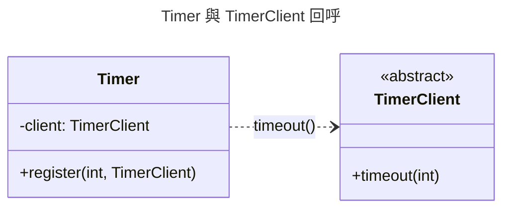


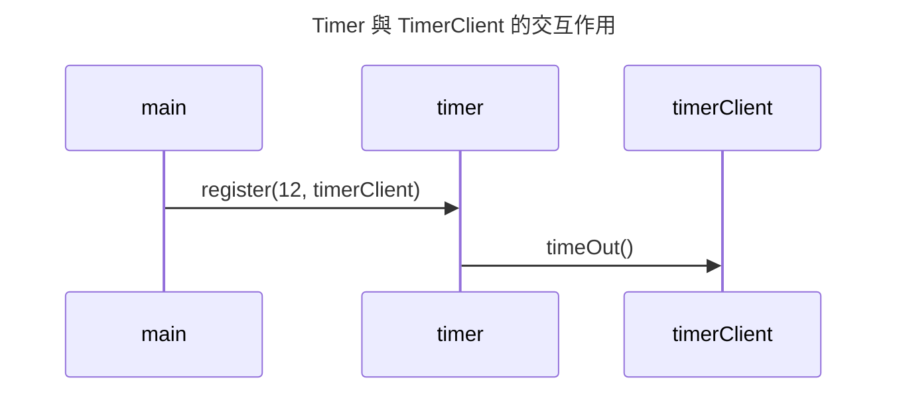

當 `timeout` 的時間到了，他就會通知 `client`。如果有一個物件想要被通知，他就可以呼叫 `register()` 來做一個註冊，以便在 `timeout` 來時被通知。

### 8.5.2 Door 與 TimedDoor

假設我們有一個抽象類別 `Door`，裡面定義了 `lock()` 與 `unlock()`、`isDoorOpen()` 等方法，分別表示關門，開門，是否開著等功能：

```java
abstract class Door {
    public abstract void lock();
    public abstract void unlock();
    public abstract boolean isDoorOpen();
}
```

我們想設計一個 `TimedDoor` 類別，當門開太久時，他就會警告。`TimedDoor` 會被通知到。因為 `TimedDoor` 是 `Door` 的子類別，我們想把它設計成 `TimerClient` 的子類別，但 `TimedDoor` 已經是 `Door` 的子類別了，在 `Java` 中我們無法做多重繼承。

因此，設計者可能會做一個錯誤設計：讓 `Door` 繼承 `TimerClient`，如此一來，`TimedDoor` 自然地成為 `TimerClient` 的子類別，編譯器與執行上都沒有錯誤，但這樣的設計造成 「`Door` 相依於 `TimerClient`」，這樣的相依性是沒有道理的，也造成了介面污染。假設 `TimerClient` 內有 `timeout()` 的抽象方法，`Door` 也需要實作此方法。 

```java
class Door extends TimerClient { //錯誤的設計！！
    public abstract void timeout () {
    }   
}
```

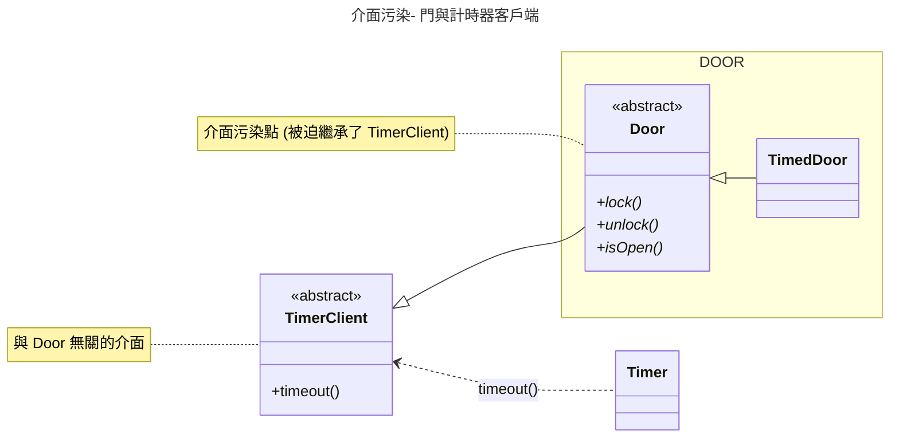

一開始的設計者可能知道此方法僅是為了 **「讓編譯器通過」** 的權宜設計，但到了維護期，如果 `timeout()` 的介面有所更動而需要 `Door` 重新編寫時，維護者就不一定知道其意義為何，而造成困擾。簡言之，目前的設計錯誤為：

> [!NOTE]
> 錯誤設計：`TimedDoor` 為了要成為一種 `TimerClient`，但本身又不能繼承 `TimerClient`，只好讓 `Door` 去繼承 `TimerClient`。

其實這個問題我們可以有兩個解決方法：

- 把 `TimerClient` 設計成介面
- `TimedDoor` 透過委託的方式來呼叫 `TimerClient`

回到介面分離原則。當我們設計一個介面時，內部所包含的方法必須謹慎的考量，避免設計一個廣用，包含很多方法的大介面。採用通用大介面通常會造成介面污染。當一個類別為了滿足其中一個方法而必須實作該介面時，就同時被迫實作其他的方法，而造成介面污染。

簡單的說，介面分離原則建議：==擁有許多方法的介面應該被分離不同的介面，每一個介面擁有一群緊密相關的方法，被一些特定的客端物件使用==。

> [!TIP]
> Interface pollution must be broken up into groups of methods, every group serves a different set of client.

<!--  -->

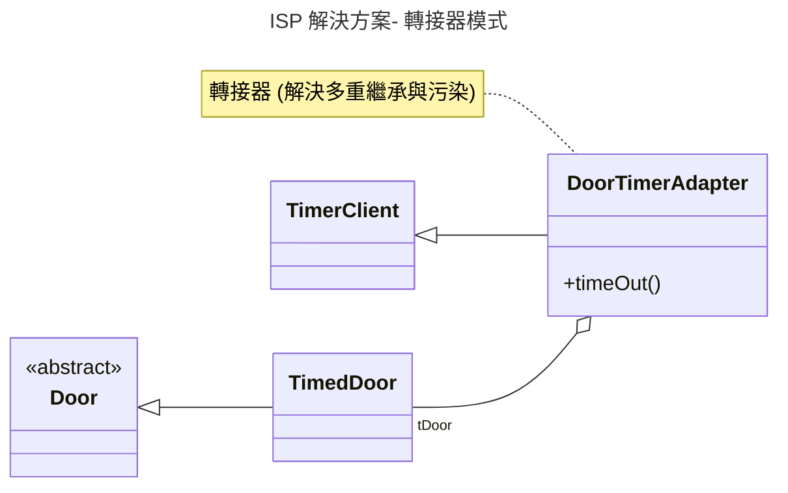

圖中的設計透過 `DoorTimerAdapter` 讓 `TimedDoor` 可以滿足 `TimerClient` 的需求，而不需要讓 `Door` 去繼承 `TimerClient`。

---

當一個類別繼承（實作）了一個它「不該繼承」的介面時，該介面的方法對這個類別而言就是垃圾代碼。

* 強迫實作： 根據 Java 語法，除非是抽象類別，否則你必須實作介面中的所有方法。
* 空殼方法： `public void method() { /* 沒事發生 */ }`。
* 語意破壞： 介面本應代表一種「契約」或「能力」。如果一個 `Bird` 介面包含了 `fly()`，而 `Ostrich` (鴕鳥) 強行實作它，那麼這個 `fly()` 對鴕鳥來說就是一種污染，因為鴕鳥根本不具備這種能力。

### 8.5.3 WindowListener

在 Java 的早期設計中，`WindowListener` 也是一個經典的例子。如果你想監聽視窗關閉的事件，你必須實作 `WindowListener` 介面：

```java
public interface WindowListener extends EventListener {
    public void windowOpened(WindowEvent e);
    public void windowClosing(WindowEvent e);
    public void windowClosed(WindowEvent e);
    public void windowIconified(WindowEvent e);
    public void windowDeiconified(WindowEvent e);
    public void windowActivated(WindowEvent e);
    public void windowDeactivated(WindowEvent e);
}
```

如果你只想處理 `windowClosing`，你也必須提供另外 6 個空的方法實作，這就是典型的介面污染。為了解決這個困擾，Java 提供了 `WindowAdapter` 類別，它是一個抽象類別，並且預先實作了 `WindowListener` 的所有方法（皆為空實作）。

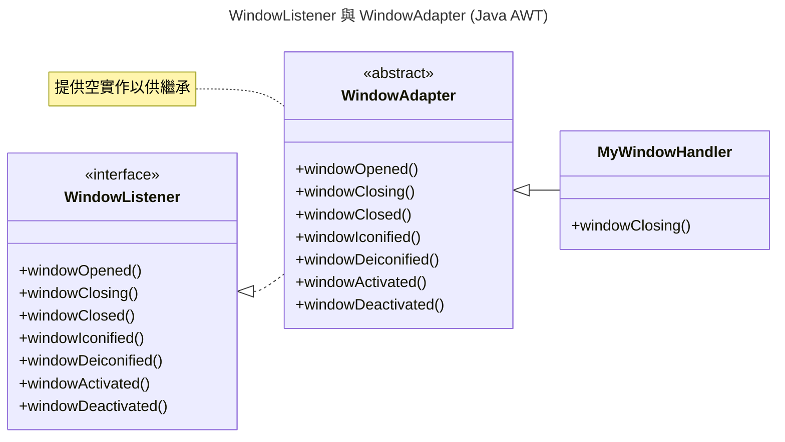

透過繼承 `WindowAdapter`，`MyWindowHandler` 只需要覆寫它感興趣的 `windowClosing` 方法即可，而不需要理會其他的方法。雖然這在語法上透過繼承解決了「寫空方法」的痛苦，但從設計的角度來看，`WindowListener` 這個介面本身確實太過臃腫，違反了 ISP 原則。


### 💡 8.5.4 隨堂測驗

1️⃣ 什麼是「介面污染」（Interface Pollution）？
- (A) 介面中定義了過多與特定客戶端無關的方法，迫使實作類別必須實作不需要的方法。
- (B) 介面內包含了過多的實作代碼。
- (C) 介面名稱取錯了。
- (D) 介面被多個類別實作。

<details>
<summary>解答</summary>
(A)。
說明：當一個介面包含很多不相關的業務方法時，會導致實作類別被迫實作不需要的方法，這就是介面污染。應將其拆分為多個專門的小介面。
</details>

---

2️⃣ 考慮下圖的設計，`SmartDevice` 介面包含了多種功能。若我們有一個 `SimpleLamp` 類別只想實作「開關燈」功能，根據介面分割原則（ISP），下列敘述何者正確？

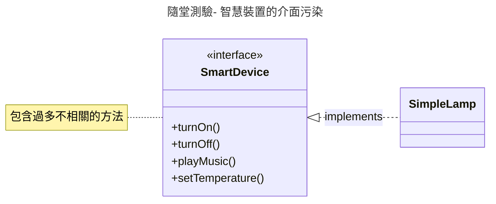

- (A) `SimpleLamp` 不需要實作 `playMusic()` 和 `setTemperature()`，因為它用不到。
- (B) 此設計符合 ISP，因為 `SmartDevice` 整合了所有智慧裝置的功能。
- (C) 此設計存在介面污染，應將 `SmartDevice` 拆分為 `Switchable`、`MusicPlayable` 等更小的介面。
- (D) `SimpleLamp` 應該繼承 `SmartDevice` 的所有實作代碼。

<details>
<summary>解答</summary>
(C)。
說明：由於 `SimpleLamp` 只需要開關功能，但目前的 `SmartDevice` 強迫它也必須提供音樂與溫控的實作（即便只是空實作），這就是典型的「介面污染」。根據 ISP，應該將介面拆分，讓 `SimpleLamp` 只實作其所需的 `Switchable` 介面。
</details>

---


## 8.6 所依皆幻：相依反轉原則

> 高階模組不該相依於一個低階模組。兩者都應該相依於抽象。


> **Dependency Inversion Principle (DIP)**: High level modules should not depend upon low level modules. All should depend on **abstraction**.

1970 年代的軟體開發多遵從結構化分析，倡導由上而下的分解 (top down decomposition)，這樣的方法論鼓勵一個高階的模組相依於一個低階的模組。然而，高階模組包含著一個應用程式重要的策略決定與企業邏輯，如果它相依於一個低階的模組，那就代表策略的變更會因為低階的執行的不同而變更，這是不適當的。


### 8.6.1 Copy Program

我們可能會寫出以下的 `Copy()` 模組：

```java
void Copy() {
   int c;
   while ((c = ReadKeyboard()) != EOF)
      WritePrinter(c);
}
```
	
<!--  -->
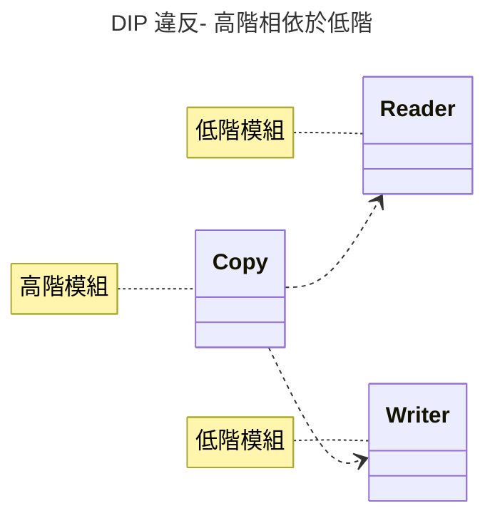

這個程式看起來沒有什麼問題，但 `copy` 這個高階的動作就相依於 `ReadKeyboard()` 這個低階的動作了。例如今天我們要輸出的對象是一個 `printer`，程式就要做一些修改，如下：

```java
void Copy(outputDevice dev) {
   int c;
   while ((c = ReadKeyboard()) != EOF)
   	    if (dev == printer) 
   	       WritePrinter(c);
        else 
           WriteDisk(c);
}
```


> 複製，應該是一個通用的行為，不該相依於 keyboard, disk, printer 等物件

一般來說，所謂的 `copy` 就是把資料從「來源」複製一份到「目的地」，這樣的政策是不會變的，不該因為目的地是 `disk` 或 `printer` 而有所改變。下方是一個符合 `DIP` 原則的程式：

```java
abstract class Reader {   
	public abstract int Read();   
}
abstract class Writer  {    
	public abstract void Write(char);  
}
//copy 相依於抽象的 Reader, Writer
void copy(Reader r, Writer w)  { 
   int c;
   while((c=r.Read()) != EOF)
   	  w.Write(c);
}
```

<!--  -->

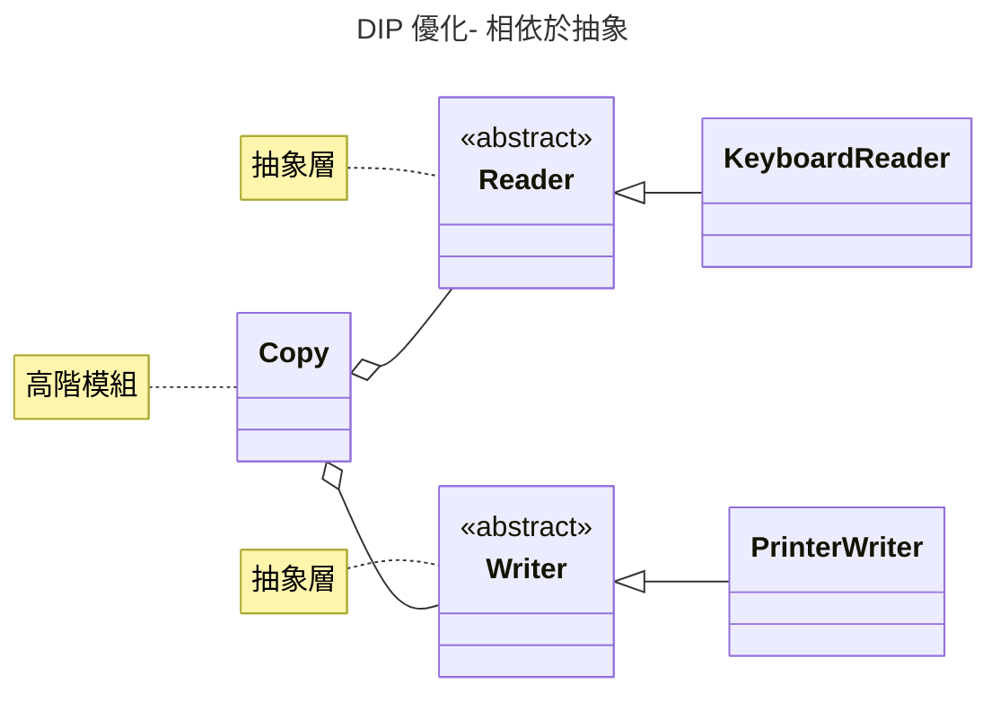

在這個程式中，`copy` 所牽涉到的來源與目的地分別是抽象的 `Reader` 和 `Writer`，就不會相依於 `Printer`, `Scanner`, `Disk` 等低階的物件了。若我們今天想要寫到 `Disk`，只要讓 `Disk` 去實作 `Writer` 再透過 `dynamic binding` 就可以達到上述的效果。	
	
### 8.6.2 Lamp Program

我們再看一個檯燈開關的例子。

```java
// 檯燈
class Lamp {
    public void TurnOn() {...}
    public void TurnOff() {...}
}
	
// 開關面板
class Button {
    private Lamp lamp;
    public Button(Lamp p) {lamp =p; }
    public void Detect() {
    bool buttonOn = GetPhysicalState();
        
    // 控制檯燈的開關
    if (buttonOn) 
        lamp.TurnOn();
    else 
        lamp.TurnOff();
}
```

這樣的程式不好！`Button` 相依於 `Lamp`，也就是說它只能處理 `Lamp` 了。想想看我們從五金行買回來的開關面板可是沒有限定只能用來處理檯燈啊！以下的程式則相依於一個抽象。

```java	
class LampDemo {
    public static void main(String args[]) {
        ButtonControlable lamp = new Lamp();
		Button b = new Button(lamp); //開關控制檯燈
		b.turnOn();
		b.turnOff();
		b.turnOn();		

		ButtonControlable ac = new AC();
		b = new Button(ac); //可以換成控制冷氣機
		((AC)ac).setDegree(30);
		b.turnOn();
		b.turnOff();
		((AC)ac).setDegree(21);
		b.turnOn();
	}
}

// 開關按鈕的對象（小家電）
interface ButtonControlable {
    void turnOn();
    void turnOff();
}

// 開關按鈕，`Button`，相依於一個抽象通用的 `ButtonControlable`
class Button {
    private ButtonControlable  bClient;
    public Button(ButtonControlable b) { //連結真實的 ButtonControlable
        bClient = b;
    }
    public void turnOn() {
    	bClient.turnOn();
    }
    public void turnOff() {
    	bClient.turnOff();
    }
}

// `Lamp` 自己定義開關
class Lamp extends ButtonControlable {
    String state="off";
    public  void turnOn() {
    	state = "on";
    	printState();
    }
    public  void turnOff() {
    	state = "off";
    	printState();    	
    }
    private void printState() {
    	System.out.println("Lamp is " + state);   		
    }
}

// 冷氣機 自己定義開關
class AC implements ButtonControlable {
    int currentDegree = 28;
    String state="off";

    // 高於 28 度才可以開啟
    public  void turnOn() {
    	if (currentDegree > 28) 
    		state = "on";
        printState();
    }
    public  void turnOff() {
    	state = "off";
    	printState();    	
    }
    private void printState() {
    	System.out.println("AC is " + state);   		
    }
    public void setDegree(int d) {
    	this.currentDegree = d;
    }
}
```

> [!TIP]
> 讀完上述範例後，請前往 [8.6.4 隨堂測驗](#-864-隨堂測驗) 進行練習，以加深對相依反轉原則（DIP）的理解。

> 高階模組不應該依賴低階模組，兩者必須依賴抽象(即抽象層)，抽象不能依賴細節，但細節必須依賴抽象，抽象模組不應該根據低階模組來創造，這就是「依賴反轉原則」的概念。


### 8.6.3 相依注入

> [!TIP]
> 將相依性移除於模組之中，透過相依性注入（dependency injection）的方式來建立相依性。


相依注入主要有以下幾種方式：

- **Creation injection (Constructor injection)**：在物件建立之初，透過建構子傳入相依物件。例如：`new Customer(new Oracle())`。
- **Factory pattern**：相依物件的決定並非單純由建構子決定，而是由另一個專門生成的工廠物件（Factory）來提供。
- **Setter injection**：在物件生成後，透過 `setter` 方法來動態設定其相依性。例如：`obj.setDB(new Oracle())`。

### 💡 8.6.4 隨堂測驗

1️⃣ 相依反轉原則（DIP）建議「高階模組」與「低階模組」都應該相依於？
- (A) 低階模組的具體實作。
- (B) 資料庫。
- (C) 抽象（Abstraction）。
- (D) 高階模組。

<details>
<summary>解答</summary>
(C)。
說明：DIP 要求高低階模組都相依於抽象（如介面），避免高階的政策決定受到低階實作細節變動的影響。
</details>

---

2️⃣ 針對上述 8.6.2 節優化後的「檯燈與按鈕」程式碼，請試著畫出其 UML 類別圖，並標記出哪些是高階模組、哪些是低階模組、以及抽象層在何處。

<details>
<summary>解答</summary>

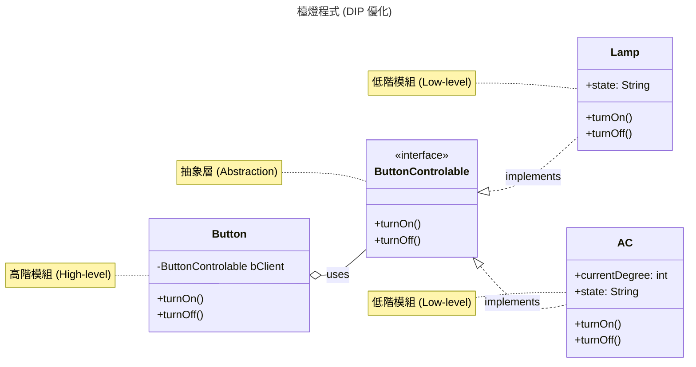

**說明**：
1. **高階模組**：`Button` (它負責整體的開關邏輯，但不依賴具體的電器)。
2. **抽象層**：`ButtonControlable` 介面 (定義了溝通規格)。
3. **低階模組**：`Lamp` 與 `AC` (具體的細節實作，它們依賴於抽象介面來與外界對接)。
</details>

---


## 8.7 身不由己：控制反轉原則

Inversion of Control (IoC)

> 應用程式（或客製化模組）的控制流程而來自於一個一般性、可重用的框架，而非模組本身。

> Inversion of Control (IoC): Custom-written portions of a computer program receive the flow of control from a generic, reusable framework.

傳統的程式中，主程式（你寫的程式碼）掌控了整個系統的執行流程。但在使用框架（Framework）時，這種控制權會發生反轉。

### 8.7.1 庫 (Library) vs. 框架 (Framework)

這是理解 IoC 最簡單的方式：
- **當你使用庫時**：你掌控流程。你決定什麼時候呼叫庫裡的方法，庫只是你的工具。
- **當你使用框架時**：框架掌控流程。框架定義好了一個骨架，在適當時機「回頭」呼叫你寫的擴充邏輯。

### 8.7.2 實例：JUnit 測試框架

在沒有框架的情況下，你必須自己寫一個 `main` 方法，並決定手動執行哪些測試：

```java
// 你寫的程式碼主導了流程
public class MyManualTest {
    public static void main(String[] args) {
        UserTest test = new UserTest();
        test.testLogin();     // 你決定呼叫這個
        test.testPassword();  // 你決定呼叫這個
    }
}
```

但在使用 **JUnit** 框架時，控制權反轉了。你不再需要寫 `main` 方法，也不需要決定誰先執行。你只需要在方法上加上 `@Test` 標記，框架會自動找到你的程式，並在適當的時間點執行它：

```java
// 框架主導流程，它負責找到並執行標記為 @Test 的方法
public class MyJUnitTest {
    @Test
    public void testLogin() { ... }

    @Test
    public void testPassword() { ... }
}
```

採用 IoC 的策略可以幫助我們建立一個可重複使用的程式碼框架，讓我們少寫很多重複的流程控制碼（例如管理物件生命週期、處理請求的分發），並且確保程式品質。各位聽過的 Web 框架（如 Spring, Vue, React）都是 IoC 的典型應用。

### 8.7.3 實例：手機 App 的生命週期

手機 App 開發也是 IoC 的典型案例。無論是 Android 或 iOS，開發者都無法主動掌控程式的「開始」或「結束」。

在 Android 中，一個畫面（Activity）有其嚴密的生命週期。你不需要寫程式去主動運行它，而是由 Android 系統根據使用者的操作來觸發：
- **系統決定** 何時呼叫 `onCreate()`（畫面建立）。
- **系統決定** 當有來電或使用者切換 App 時呼叫 `onPause()`（畫面暫停）。
- **系統決定** 當使用者按下返回鍵時呼叫 `onDestroy()`（畫面銷毀）。

開發者要做的，只是實作這些「回呼方法（Callbacks）」，在特定的時間點填入對應的邏輯（如：讀取資料、儲存狀態）。控制權完全在行動作業系統手上。

### 8.7.4 好萊塢原則
有時候 IoC 也會和好萊塢原則一起談，其意義為：「不要叫我們，我們有需要將會叫你」 (Don't call us, we'll call you)」[^hollywood]。你的應用程式不需要關注上層的流程是怎麼做的，寫好你的小程式（模組功能），該到你的流程就會叫你，不需囉嗦煩惱。

[^hollywood]:許多人到好萊塢逐夢，經紀公司會叫你留下名片，叫你不要再打電話了，必要時它會打電話給你。

### 💡 8.7.5 隨堂測驗

1️⃣ 「好萊塢原則」（Hollywood Principle）的精髓為何？
- (A) 盡量主動呼叫上層框架。
- (B) 定期檢查系統狀態。
- (C) 不要叫我們，我們有需要將會叫你（Don't call us, we'll call you）。
- (D) 程式流程必須由子類別完全主導。

<details>
<summary>解答</summary>
(C)。
說明：這意味著程式流程由上層框架控制，架構會在適當時間呼叫你的模組功能（Callback），而非由你的模組去主導整體的流程架構。
</details>

---

2️⃣ 下列關於「框架 (Framework)」與「庫 (Library)」在控制流程上的差異，何者敘述正確？
- (A) 使用「庫」時，系統的控制權在於庫本身，開發者處於被動地位。
- (B) 使用「框架」時，發生了控制反轉（IoC），由框架主導流程並在適當時機呼叫開發者的程式。
- (C) 兩者唯一的差別在於程式碼量的多寡，控制權皆由開發者掌控。
- (D) 「庫」通常會定義一個完整的生命週期（Lifecycle），強迫開發者遵循其流程。

<details>
<summary>解答</summary>
(B)。
說明：這是 IoC 的核心。在使用庫時，開發者是主動方；在使用框架時，開發者是供應方，由框架負責排程與執行。
</details>

---

3️⃣ 請參考 8.7.3 節「手機 App 生命週期」的描述，嘗試畫出其類別設計的 UML 圖。圖中應包含 `AndroidSystem` (系統框架)、`Activity` (抽象類別/定義) 與 `MainActivity` (具體實作)，並標示出「控制權」的回呼方向。

<details>
<summary>解答</summary>

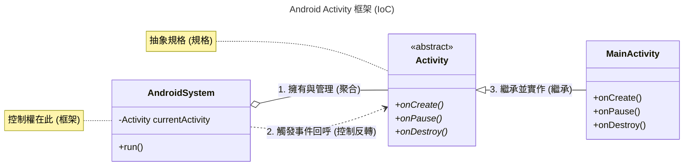

**說明**：透過將 `Activity` 抽象化，`AndroidSystem` 只需要針對 `Activity` 介面進行通用的流程控制（如呼叫 `onCreate`），而不需要知道具體是哪一個 App 頁面在執行，這就是典型的 IoC 應用。
</details>

---

## 8.8 練習

1️⃣ 請將下述程式從繼承改成委託的方式來撰寫。

```java
class B {
   public void m1() {
      System.out.println("hello");
   }
}      
class A extends B {   
}
class App {
   public static void main(String args[]) {
      A a = new A();
      a.m1();
   }
}      
```

<details>
<summary>解答</summary>

```java
class A {
    private B b = new B(); // 包含
    public void m1() {
        b.m1();             // 委託
    }
}
```
**說明**：透過在 `A` 類別中建立 `B` 的實作物件，並將請求轉發給該物件，可以避免繼承帶來的強耦合，同時達到相同的行為效果。
</details>

---

2️⃣ 只要是交通工具 `Vehicle` 就必須要能向左轉 (`turnLeft`)、向右轉 (`turnRight`)、停止 (`stop`) 或前進 (`forward`)。但如何實作 (`implementation`) 都必須由 `Bike` 或 `Car` 來決定。該怎麼設計類別結構？

<details>
<summary>解答</summary>

```java
interface Vehicle {
    void turnLeft();
    void turnRight();
    void stop();
    void forward();
}

class Bike implements Vehicle {
    public void turnLeft() { /* Bike implementation */ }
    public void turnRight() { /* Bike implementation */ }
    public void stop() { /* Bike implementation */ }
    public void forward() { /* Bike implementation */ }
}

class Car implements Vehicle {
    public void turnLeft() { /* Car implementation */ }
    public void turnRight() { /* Car implementation */ }
    public void stop() { /* Car implementation */ }
    public void forward() { /* Car implementation */ }
}
```
**說明**：使用介面（Interface）來定義「行為契約」，讓不同的交通工具根據自身特性實作具體細節，這體現了「行為一般化」與「多型」的概念。
</details>

---

3️⃣ 同上題，請設計一個 `VehicleManager` 來控制所有的交通工具：紅燈時停止（`stop`），綠燈時前進（`forward`）。

<details>
<summary>解答</summary>

```java
class VehicleManager {
    public void control(Vehicle v, boolean isRedLight) {
        if (isRedLight) {
            v.stop();
        } else {
            v.forward();
        }
    }
}
```
**說明**：`VehicleManager` 只需要與 `Vehicle` 介面互動，這符合了「相依於抽象」的原則，使其能處理任何實作了 `Vehicle` 介面的物件。
</details>

---

4️⃣ 下面的程式不夠通用，因為它分別為 `Car` 與 `Bike` 撰寫了兩套邏輯。請用 `interface` 改寫成更通用的版本。

```java
void control (Car[] cc) {
  for (Car c: cc) {
    if (isRed()) {
      c.stopCar();
    }
    else (isGreen()) {
      c.driveCar();
    }
  }
}

void controlBike (Bike[] bb) {
  for (Car b: bb) {
      if (isRed()) {
        b.stopBiking();
    }
      else if (isGreen()) {
        c.startBiking();
    }
  }
}
```

<details>
<summary>解答</summary>

```java
void control(Vehicle[] vehicles) {
    for (Vehicle v : vehicles) {
        if (isRed()) {
            v.stop();
        } else if (isGreen()) {
            v.forward();
        }
    }
}
```
**說明**：透過讓 `Car` 與 `Bike` 統一實作 `Vehicle` 介面，我們可以使用單一方法來處理包含不同交通工具的陣列，大幅減少代碼重複並提高系統彈性（LSP 與 DIP 的綜合應用）。
</details>

5️⃣ 應用 `interface` `Comparable`，來設計一個「通用型的 `getMax`」，它可以找出任何陣列內最大的元素，例如應能找到 `max` 的 `People` 物件。

```java
interface Comparable {
  public int compare(Comparable other);
}
class GeneralMax {
    public static Comparable getMax(Comparable[] data) {
       // 請實作此處
  }
}
class Main {
   // 測試程式碼
}
class People implements Comparable {
   // 實作 compare 方法
}
```

<details>
<summary>解答</summary>

```java
class GeneralMax {
    public static Comparable getMax(Comparable[] data) {
        if (data == null || data.length == 0) return null;
        Comparable max = data[0];
        for (int i = 1; i < data.length; i++) {
            if (data[i].compare(max) > 0) {
                max = data[i];
            }
        }
        return max;
    }
}

class People implements Comparable {
    int age;
    public int compare(Comparable other) {
        return this.age - ((People)other).age;
    }
}
```
**說明**：透過讓 `getMax` 相依於 `Comparable` 介面（DIP），此方法就能處理任何實作了該介面的類別，而不需針對 `People`、`Student` 等具體類別重複撰寫邏輯。
</details>

---

6️⃣ 應用 `DIP` 的原則設計一個通用型的開關器 (`ButtonPanel`)，它可以用來開關所有電器 -- 只要它有 `on`, `off` 的介面。注意 `ButtonPanel` 不能「看到很多」不同型態的電器，這樣耦合度會很高，也違反了 `DIP` 的原則。這個例子可以作為一個「`GUI` 元件」設計的練習。參考下圖設計，請完成程式碼。

<!--  -->

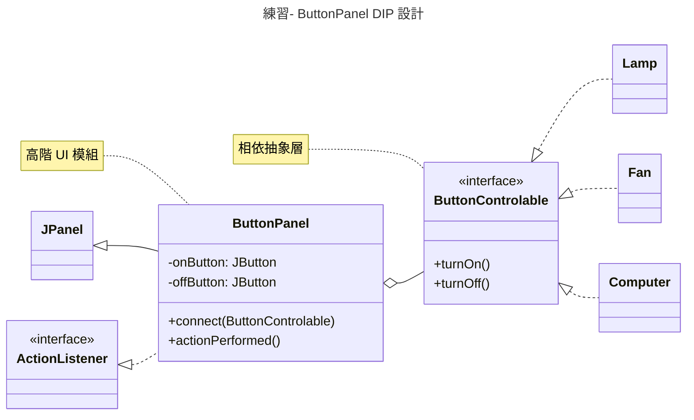

<details>
<summary>解答</summary>

```java
class ButtonPanel extends JPanel implements ActionListener {
    private JButton onButton, offButton;
    private ButtonControlable device;

    public void connect(ButtonControlable bc) {
        this.device = bc;
    }

    @Override
    public void actionPerformed(ActionEvent e) {
        if (e.getSource() == onButton) {
            device.turnOn();
        } else if (e.getSource() == offButton) {
            device.turnOff();
        }
    }
}
```
**說明**：`ButtonPanel` 作為高階 UI 模組，不直接引用 `Lamp` 或 `Fan`，而是透過 `ButtonControlable` 介面與具體電器互動，這使得它具備極高的重用性，只需透過 `connect` 即可掛載不同設備。
</details>

---

7️⃣ 請參考 `DIP` 原則 (`Dependency Inversion Principle`) 設計一個通用型的遙控器 `RemoteController`，可以對電視 (`TV`) 或冷氣 (`AirConditioner`) 做開、關、上、下 (`on`, `off`, `up`, `down`) 等動作。`TV` 預設的頻道是第七台，上下會在 1-15 間變化。冷氣預設 25 度，會在 20-30 度間變化。使用 `Swing` 來呈現此遙控器面板。

<details>
<summary>解答</summary>

**設計核心：介面定義**
```java
interface IRemoteControllable {
    void on();
    void off();
    void up();
    void down();
}
```

**類別實作 (以 TV 為例)：**
```java
class TV implements IRemoteControllable {
    int channel = 7;
    public void up() { if(channel < 15) channel++; }
    public void down() { if(channel > 1) channel--; }
    // ... on/off 實作
}
```
**說明**：`RemoteController` 類別內部擁有一位 `IRemoteControllable`成員。當按下按鈕時呼叫 `client.on()` 等方法，從而實現對不同家電的控制。
</details>

---

8️⃣ 下列關於軟體設計原則的敘述，何者**錯誤**？

- (A) 設計應該模組化，以達到低耦合度（Low Coupling）與高內聚力（High Cohesion）。
- (B) 「相依反轉原則（DIP）」指的是高階物件不應相依於低階物件，兩者皆應相依於抽象。
- (C) Liskov 取代原則（LSP）告訴我們，只要概念上具備「一般化」關係，就應該建立繼承。
- (D) 不重複原則（DRY）主張知識的呈現（包含程式碼與邏輯）在系統中應該是唯一且明確的。

<details>
<summary>解答</summary>

(C)。
**說明**：LSP 強調的是「行為上的取代性」。即便概念上是繼承關係（如正方形之於矩形），若子類別行為會限制或破壞父類別原本的約定，則不應建立繼承關係。
</details>


