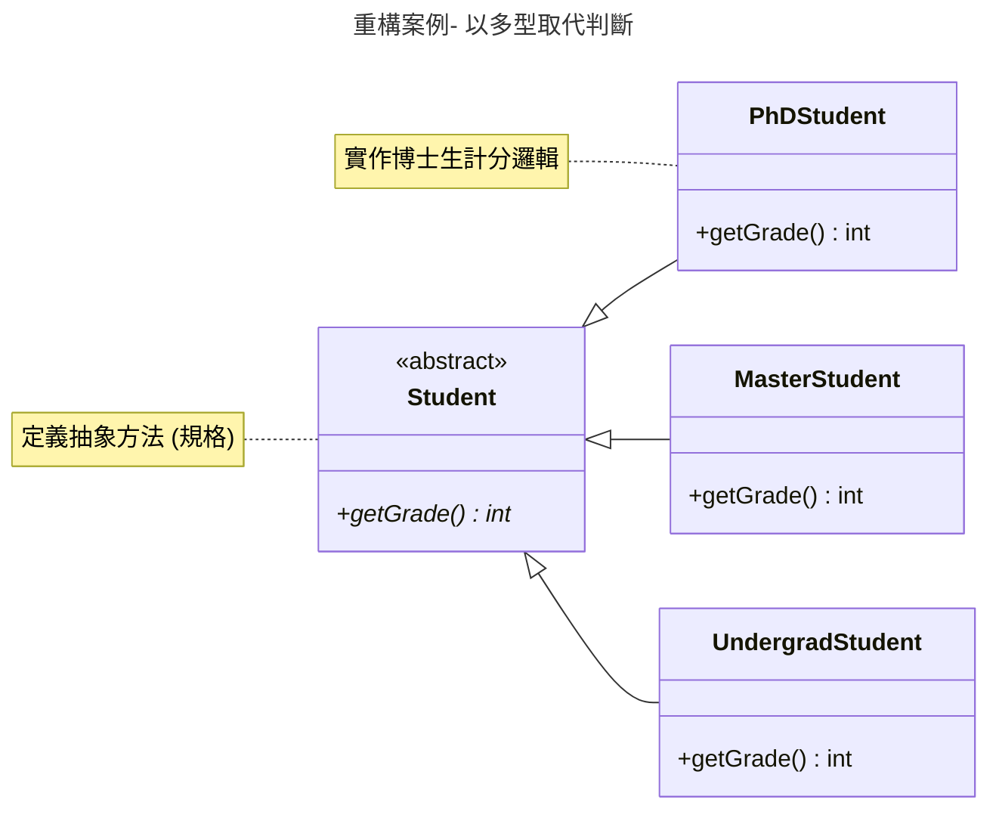
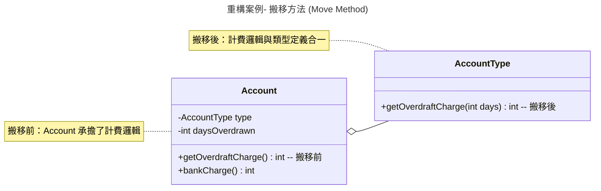

###### tags: `OOSE`

# Ch09 把脈清毒：程式碼重構

Martin Fowler 在其經典著作 *Refactoring: Improving the Design of Existing Code* 中介紹了「程式壞味道」（Bad Smell）與「重構」（Refactoring）方法。前者代表程式中存在的不良現象，後者則是具體的解決之道。

> [!TIP]
> 這些壞味道與重構方法是「設計樣式」（Design Patterns）的基本元素。一個具備設計感的程式系統往往包含若干個重構步驟，用以消除特定的程式壞味道。

## 9.1 把脈：程式壞味道

Martin Fowler 共提到了 21 個典型的程式壞味道，以下介紹其中最常見的部分：

- **重複的程式碼 (Duplicated Code)**：相同的程式結構出現在多處。應將其萃取出並集中在單一類別或方法中（如 `Extract Method`）。重複代碼會大幅降低維護性，導致「改了這、忘了那」的困境。
- **冗長的方法 (Long Method)**：方法過長（例如超過 100 行）會極難閱讀與維護。方法應代表單一的處理流程或演算法，當過於複雜時，應透過抽象化將其拆分。
- **大類別 (Large Class)**：一個類別承擔過多責任，包含過多屬性與方法。應將責任分割，交給不同的類別處理（如 `Extract Class`）。
- **太長的參數列 (Long Parameter List)**：參數過多（如超過 5 個）會增加理解難度並容易導致呼叫錯誤。可考慮將相關參數封裝成物件（如 `Introduce Parameter Object`）。
- **發散變更 (Divergent Change)**：一個類別因為過多不相關的變動原因而需要修改。這代表內聚力差，應確保一個類別僅負責一個專一的功能。
- **散彈槍手術 (Shotgun Surgery)**：每當進行一個變更，都需要修改許多不同的模組（跨多個類別）。這會導致修改風險極高，理想情況下應將變動點集中。
- **依戀情結 (Feature Envy)**：一個類別的方法頻繁存取另一個類別的屬性。這通常代表該方法應該屬於被存取的那個類別。
- **資料泥團 (Data Clumps)**：某些資料總是一起出現（如：郵遞區號、城市、街道），卻沒有被封裝成類別。應將其抽象化為一個物件（如 `Address`）。
- **基本型別偏執 (Primitive Obsession)**：堅持只用基本型別（如 `int`, `String`）而抗拒使用小類別。例如「幣值」應由 `Money` 類別表示，而非僅用 `int` 加 `String`。
- **Switch 敘述句 (Switch Statements)**：過度使用 `switch-case` 而非多型。當需要新增選項時必須修改程式碼，違反開閉原則 (OCP)。
- **平行繼承體系 (Parallel Inheritance Hierarchies)**：當你為類別 A 增加子類別時，也必須為類別 B 增加子類別。這是「散彈槍手術」的一種特例。
- **不實用的一般性 (Speculative Generality)**：為了「未來可能的擴充」而預留了過多複雜的設計，但實際上卻從未用到。
- **暫時欄位 (Temporary Field)**：某些屬性僅在特定演算法執行時才有用，其餘時間皆為空值，這會增加類別理解的難度。
- **過度的訊息串 (Message Chains)**：`a.getB().getC().getD()`。過長的呼叫鏈表示類別導航過於透明，違反迪米特法則。
- **過度的中間人 (Middle Man)**：一個類別過多方法都只是在轉發 (Delegate) 請求設計。應考慮務必移除中間人，讓 Client 直接與目標物件溝通。
- **狎暱關係 (Inappropriate Intimacy)**：類別之間存取過於頻繁的內部私有細節。應透過重構降低其依賴程度或重新分配職責。
- **同功能不同介面 (Alternative Classes with Different Interfaces)**：兩個類別的功能幾乎相同，但方法名稱或介面卻不同。
- **資料類別 (Data Class)**：類別僅包含欄位與 `getter/setter`，缺乏行為。應思考將相關邏輯移入此類別中。
- **防臭的註解 (Comments)**：當程式碼寫得太差時，工程師被迫加上大量註解。應透過改善命名與重構來讓程式碼「自我解釋」。

### ✏️ 隨堂測驗

1️⃣ **辨識壞味道**：下列程式碼片段最可能存在什麼「壞味道」？
```java
void printUserInfo(String name, String age, String address, String email, String phone, String zip) {
    // ... 直接印出資訊 ...
}
```
- (A) 冗長的方法 (Long Method)
- (B) 太長的參數列 (Long Parameter List)
- (C) 散彈槍手術 (Shotgun Surgery)
- (D) 依戀情結 (Feature Envy)

<details>
<summary>解答</summary>

**解答：(B)**
**說明：** 方法參數超過 5 個，且這些參數（如 address, zip）彼此相關，建議重構為 `Introduce Parameter Object` 或封裝成 `ContactInfo` 物件。
</details>

---

## 9.2 清毒：程式碼重構

重構方法一共有六大類，包含 25 種形式與 70 多個具體方法：

1. **方法組裝 (Composing Methods)**：重組方法內的語句。
2. **特性移動 (Moving Features Between Objects)**：在物件之間移動屬性或方法。
3. **資料組織 (Organizing Data)**：改善資料結構的處理方式。
4. **條件簡化 (Simplifying Conditional Expressions)**：簡化複雜的邏輯判斷。
5. **呼叫簡化 (Making Method Calls Simpler)**：讓介面與方法調用更清晰。
6. **一般化處理 (Dealing with Generalization)**：處理類別架構中的繼承關係。

> [!IMPORTANT]
> 重構方法著重在「動作」，沒有絕對的對錯，有些方法甚至恰好對立（如 `Extract Method` 與 `Inline Method`），應根據具體情境靈活應用。

### 9.2.1 方法組裝

- **Extract Method**：把功能萃取出來，形成另一個獨立方法。
- **Inline Method**：直接使用該方法的功能，減少不必要的包裝。

```java
// Inline Method 範例
class Student {
   boolean pass() {
      return isGoodGrade()? true: false;
   }
   boolean isGoodGrade() {
      return grade > 60
   }   
}
// 使用 inline method 重構後
class Student {
   boolean pass() {
      return grade > 60? true: false;
   }
}
```

- **Introduce Explaining Variables**：導入有意義的變數名稱，取代複雜的表示式（特別是條件判斷）。

```java
class Student {
   boolean getScholarship() {
      if (sType == "M" && g1 > 60 && g2 > 70)
         return true;
    }
}
// introduce explaining variable 重構後
class Student {
   boolean getScholarship() {
      boolean isMasterStudent = (sType == "M");
      boolean allPass = (g1 > 60 && g2 > 70);
      if (isMasterStudent && allPass) 
         return true;
    }     
}  
```

- **Inline Temp**：不宣告暫時變數，直接使用表達式。
- **Split Temporary Variable**：不共用同一個暫時變數來儲存不同的計算意義。

### 9.2.2 特性移動

- **Move Method / Field**：將方法或屬性移至更合適的類別。
- **Extract Class**：將責任過重的類別拆分為多個專一的小類別。
- **Inline Class**：將過於簡單的類別併入另一個類別中。
- **Remove Middle Man**：移除轉發層，讓物件直接溝通。

### 9.2.3 資料組織

- **Replace Data Value with Object**：將單純的字串或數值封裝為具有行為的物件。
- **Replace Array with Object**：將存有不同型態資料的陣列改為明確的物件（類別）。

```java
// Before: String student [] = {"Nick", "P1010", "Master"}
// After:
class Student {
   String name;
   String id;
   String degree;
}    
```

- **Encapsulate Field**：將公開屬性改為私有，並提供 `getter / setter`。
- **Encapsulate Collection**：對集合物件不提供直接的 setter，而是提供 `add / remove` 方法。

```java
// Before
class Student {
   getCourse(): Set;
   setCourse(Set); 
}
// Encapsulate Collection 範例
class Student {
   private Set courses = new HashSet();
   
   public void addCourse(Course course) { courses.add(course); }
   public void removeCourse(Course course) { courses.remove(course); }
   public Set getCourses() { return Collections.unmodifiableSet(courses); }
}   
```

- **Replace Subclass with Fields**：當子類別差異過小時，改用欄位區分即可，不需建立子類別。

### 9.2.4 條件簡化

- **Consolidate Duplicate Conditional Fragments**：將所有路徑中重複出現的程式片段抽離出條件句。
- **Replace Nested Conditional with Guard Clauses**：避免深層巢狀，使用 Guard Clauses（衛句）提早回傳。

```java
boolean isPass() {
   boolean result;
   if (isPhD) 
      result = computePhDGrade();
   else 
      if (isPartTimeMaster)    
         result = computePartTimeMasterGrade()
      else
         if (isMaster)
            result = computeMasterGrade()
   result = computeGrade()
   return result;
}
//重構後
boolean isPass() {
   if (isPhD)
      return computePhDGrade();
   if (isPartTImeMaster)
      return computePartTimeMasterGrade()
   if (isMaster)
      return computeMasterGrade()
   return computeGrade();
}    
```

- **Replace Conditional with Polymorphism**：以「多型」取代複雜的 `switch-case` 或 `if-else`。


Code: 
```java
class Student {
   int getGrade() {
      swith (type) {
         case PHD:
             return getQualityExam();
         case MASTER:
             return exam*0.5 + report*0.5;
         case UNDER:
             return exam*0.7 + report*0.3;        
      }
   }   
}
//重構後
class PhDStudent extends Student {
   int getGrade() {
      return getQualityExam();
   }   
}
class MasterStudent extends Student {
   int getGrade() {
      return exam*0.5 + report*0.5;
   }   
}
...
```

### 9.2.5 呼叫簡化

- **Separate Query from Modifier**：將讀取資料與修改資料的方法分開。
- **Replace Parameter with Explicit Methods**：與其用參數控制方法行為，不如拆分為明確命名的多個方法。

```java
setValue(String title, int v} {
   if (title == "grade")
      grade = v;
   else if (title == "level") 
      level = v;
}
// 重構後
setGrade(int grade) {grade = g;}
setLevel(int lv) { level = lv;}  
```  

- **Introduce Parameter Object**：將過長的參數列封裝成單一物件。
- **Replace Error Code with Exception**：不回傳錯誤代碼（如 `-1`），改以拋出例外。

```java
int computeGrade() {
   ....
   if (grade >100 || grade < 0)
      return -1;
   return 0;
}
// 重構後
void computeGrade() throws Exception {
   ...
   if (grade > 100 || grade < 0) 
      throw new Exception("Error grade");
   ...
}         
```

### 9.2.6 一般化處理

- **Pull Up Method / Field**：將共通的方法或屬性移至父類別。
- **Push Down Method / Field**：將僅子類別需要的方法或屬性移至該子類別。
```java
class Student {
   void attendOralDefense() {...}
}
// 重構後
class MasterStudent extends Student {
   void attendOralDefense() {...}
   ...
}
class UnderGraduateStudent extens Student {
   ...
}
```
- **Extract Superclass**：為具備相似行為的類別提取出共通的父類別。
- **Replace Inheritance with Delegation**：子類別若僅需父類別的部分功能，改用「委託」而非「繼承」。

### ✏️ 隨堂測驗

1️⃣ **概念辨析**：當你發現一個子類別只使用了父類別的一部分功能，且繼承關係並不符合 IS-A 原則時，最適合的重構方法是？
- (A) Pull Up Method
- (B) Push Down Method
- (C) Replace Inheritance with Delegation
- (D) Extract Superclass

2️⃣ **小規模重構練習**：請觀察以下程式碼，思考其結構上的問題，並將其重構為好的設計。

**問題說明**：`printOwing` 方法同時承擔了「計算欠款」與「列印詳情」兩個職責，且邏輯混在一起，缺乏結構化。當方法內容增加時會變得難以維護。建議使用 `Extract Method` 將邏輯拆分。

**重構前：**
```java
void printOwing() {
    printBanner();
    // 計算欠款
    double outstanding = 0.0;
    for (Order o : orders) {
        outstanding += o.getAmount();
    }
    // 列印詳情
    System.out.println("name: " + name);
    System.out.println("amount: " + outstanding);
}
```

<details>
<summary>解答</summary>

**應用方法：** `Extract Method`
**重構後：**
```java
void printOwing() {
    printBanner();
    double outstanding = getOutstanding();
    printDetails(outstanding);
}

double getOutstanding() {
    double result = 0.0;
    for (Order o : orders) {
        result += o.getAmount();
    }
    return result;
}

void printDetails(double outstanding) {
    System.out.println("name: " + name);
    System.out.println("amount: " + outstanding);
}
```
</details>

3️⃣ **邏輯重構練習**：請使用 `Introduce Explaining Variables` (引入解釋變數) 來優化以下複雜的條件判斷。

**問題說明**：這段程式碼的 `if` 判斷式過於冗長且包含多個子條件（作業系統、瀏覽器、縮放層級），一眼望去難以直覺理解其過濾邏輯。建議將各個判斷邏輯拆解成具備明確命名的布林變數。

**重構前：**
```java
if ((platform.toUpperCase().indexOf("MAC") > -1) &&
    (browser.toUpperCase().indexOf("SAFARI") > -1) &&
    wasInitialized() && resize > 0) {
  // 執行特定縮放邏輯
}
```

<details>
<summary>解答</summary>

**重構後：**
```java
final boolean isMacOs = platform.toUpperCase().indexOf("MAC") > -1;
final boolean isSafari = browser.toUpperCase().indexOf("SAFARI") > -1;
final boolean wasResized = wasInitialized() && resize > 0;

if (isMacOs && isSafari && wasResized) {
  // 執行特定縮放邏輯
}
```
</details>

4️⃣ **資料結構重構練習**：請將以下使用陣列存取混雜資料的程式碼，重構為使用物件 (Object)。

**問題說明**：使用 `String[]` 陣列來存取不同意義的資料（姓名、學號等）非常危險，因為開發者必須死背 `[0]` 或 `[1]` 代表什麼。這種「基本型別偏執」應改為建立一個專屬類別來管理這些資訊。

**重構前：**
```java
// 建立一個錄音室預約資料，陣列序號分別代表：[0]姓名, [1]預約人數
String[] row = new String[2];
row[0] = "Nick";
row[1] = "15";
```

<details>
<summary>解答</summary>

**重構後：**
```java
class Reservation {
  private String name;
  private String memberCount;
  
  public void setName(String arg) { name = arg; }
  public void setMemberCount(String arg) { memberCount = arg; }
}

Reservation res = new Reservation();
res.setName("Nick");
res.setMemberCount("15");
```
</details>

---

## 9.3 核心重構案例詳解

本節針對實務中最常見的三個重構方法進行深度解析，透過對比重構前後的代碼與架構，幫助理解「壞味道」的消除過程。

### 9.3.1 搬移方法

當一個類別的方法頻繁存取另一個類別的屬性時（依戀情結），該方法應搬移至目標類別。



*   **重構前**：`Account` 類別內具備 `getOverdraftCharge()` 方法，但讀取的資料幾乎都來自於 `AccountType`。
*   **重構後**：將方法移至 `AccountType`，`Account` 僅需呼叫 `type.getOverdraftCharge(daysOverdrawn)`。

### 9.3.2 提煉類別

當一個類別因職責過多而變得龐大（大類別）時，應將其部分屬性與行為提煉至新的類別中。

```java
// 重構前：Person 類別包含了所有的辦公室電話資訊
class Person {
    private String name;
    private String officeAreaCode;
    private String officeNumber;

    public String getTelephoneNumber() {
        return "(" + officeAreaCode + ") " + officeNumber;
    }
}

// 重構後：提煉出 TelephoneNumber 類別
class TelephoneNumber {
    private String areaCode;
    private String number;
    public String getTelephoneNumber() {
        return "(" + areaCode + ") " + number;
    }
}

class Person {
    private String name;
    private TelephoneNumber officeTelephone = new TelephoneNumber();
}
```

*   **好處**：降低了 `Person` 類別的複雜度，且 `TelephoneNumber` 未來可被其他類別復用。

### 9.3.3 以衛句取代巢狀判斷

當條件判斷過於深層（巢狀）時，會增加閱讀的認知負荷。應使用「衛句」提早退出方法。

```java
// 重構前：深層巢狀邏輯
double getPayAmount() {
    double result;
    if (isDead) result = deadAmount();
    else {
        if (isSeparated) result = separatedAmount();
        else {
            if (isRetired) result = retiredAmount();
            else result = normalPayAmount();
        }
    }
    return result;
}

// 重構後：使用衛句 (Guard Clauses) 扁平化邏輯
double getPayAmount() {
    if (isDead) return deadAmount();
    if (isSeparated) return separatedAmount();
    if (isRetired) return retiredAmount();
    return normalPayAmount();
}
```

*   **核心理念**：若條件判斷是「非正常情況」的特殊處理，應在判斷後立即回傳，讓「正常情況」的邏輯保持在最外層，提高清晰度。

### 9.3.4 發散變更

當一個類別因為不同的原因頻繁需要修改時，代表其內聚力不足，違反了「單一職責原則 (SRP)」。

```java
// 重構前：一個 Order 類別負責了訂單資料、資料庫操作與 XML 出報表
class Order {
    // 訂單資訊
    public void calculateTotal() { ... }
    
    // 變動原因 1：資料庫 Schema 改變
    public void saveToDatabase() { ... }
    
    // 變動原因 2：匯出格式或客戶需求改變
    public void exportAsXML() { ... }
}
```

```java
// 重構後：將不同職責拆分到專屬類別
class Order {
    public void calculateTotal() { ... }
}

class OrderRepository {
    public void save(Order order) { ... }
}

class OrderExporter {
    public void exportAsXML(Order order) { ... }
}
```

*   **改善點**：
    *   **高內聚**：每個類別只有一個變動原因。修改資料庫邏輯不會影響到 XML 匯出。
    *   **易維護**：開發者可以快速定位需要修改的程式碼，降低改錯的風險。

### ✏️ 隨堂測驗

1️⃣ **概念辨析**：如果一個類別中有太多的欄位和方法都是在處理「電話號碼」的細節，且這部分邏輯在其他類別也可能用到，最適合的重構方法是？
- (A) Move Method
- (B) Extract Method
- (C) Extract Class
- (D) Replace Type Code with Subclasses

2️⃣ **重構實作練習**：請將以下具備深層巢狀結構的程式碼，改寫為具備衛句 (Guard Clauses) 的扁平結構。

**問題說明**：深層的巢狀 `if` 語句會增加閱讀時的認知負擔（Cognitive Load），開發者必須記住多層條件才能理解核心邏輯。透過衛句提早退出 (Early Exit)，可以讓主線邏輯保持在最外層。

**重構前：**
```java
public double getAdjustedCapital() {
  double result = 0.0;
  if (capital > 0.0) {
    if (intRate > 0.0 && duration > 0.0) {
      result = (income / duration) * ADJ_FACTOR;
    }
  }
  return result;
}
```

<details>
<summary>解答</summary>

**重構後：**
```java
public double getAdjustedCapital() {
  if (capital <= 0.0) return 0.0;
  if (!(intRate > 0.0 && duration > 0.0)) return 0.0;
  
  return (income / duration) * ADJ_FACTOR;
}
```
</details>

3️⃣ **搬移方法實作練習**：請將以下程式碼中的計費邏輯，搬移至最適當的類別中。

**問題說明**：`Account` 類別中的 `getOverdraftCharge` 方法，其邏輯完全取決於 `AccountType` 的不同類型。這是一種典型的「依戀情結 (Feature Envy)」，應該將此方法搬移到 `AccountType` 類別中，並讓 `Account` 委託 (Delegate) 給它。

**重構前：**
```java
class Account {
  private AccountType type;
  private int daysOverdrawn;

  double getOverdraftCharge() { // 此方法應被搬移
    if (type.isPremium()) {
      double result = 10.0;
      if (daysOverdrawn > 7) result += (daysOverdrawn - 7) * 0.85;
      return result;
    }
    else return daysOverdrawn * 1.75;
  }
}
```

<details>
<summary>解答</summary>

**重構後：**
```java
class Account {
  private AccountType type;
  private int daysOverdrawn;

  double getOverdraftCharge() {
    return type.getOverdraftCharge(daysOverdrawn); // 委託給型別類別
  }
}

class AccountType {
  double getOverdraftCharge(int daysOverdrawn) {
    if (isPremium()) {
      double result = 10.0;
      if (daysOverdrawn > 7) result += (daysOverdrawn - 7) * 0.85;
      return result;
    }
    else return daysOverdrawn * 1.75;
  }
}
```
</details>

4️⃣ **壞味道辨析**：下列關於「發散變更 (Divergent Change)」與「散彈槍手術 (Shotgun Surgery)」的敘述，何者正確？ (單選)
- (A) 發散變更指的是「一個變動需要修改多個類別」，散彈槍手術則是「一個類別有多個變動原因」。
- (B) 發散變更指的是「一個類別有多個變動原因」，散彈槍手術則是「一個變動需要針對多個類別進行小修改」。
- (C) 兩者都是指同一個類別內聚力太高。
- (D) 解決發散變更的方法通常是 `Move Method`，解決散彈槍手術的方法通常是 `Extract Class`。

<details>
<summary>解答</summary>

**解答：(B)**
**說明：**
- **發散變更 (Divergent Change)**：指的是單一類別內包含太雜的職責，導致不同原因的需求變動都要改同一個地方。解決方法通常是 `Extract Class`。
- **散彈槍手術 (Shotgun Surgery)**：指的是邏輯太過分散，改一個需求要跑很多個類別。解決方法通常是 `Move Method` 或 `Inline Class` 將變動點集中。
</details>

---

## 9.4 工具的使用

在現代軟體開發中，重構不再僅依賴手動修改，成熟的 IDE 工具與生成式 AI (LLM) 能大幅提升重構的效率與安全性。

### 9.4.1 IntelliJ IDEA 重構功能

IntelliJ IDEA 提供了一系列強大的自動化重構工具，可以確保在修改過程中不會遺漏引用處：

*   **Refactor 選單**：在程式碼上按下右鍵，選擇 `Refactor` 即可看到所有可用的重構動作。
*   **常用快捷鍵**：
    *   **重新命名 (Rename)**：`Shift + F6`。自動修改所有呼叫該變數、方法或類別的地方。
    *   **提取方法 (Extract Method)**：`Cmd + Option + M` (Mac) / `Ctrl + Alt + M` (Win)。將選中的程式碼區塊快速轉換為獨立方法。
    *   **重構導航 (Refactor This)**：`Ctrl + T` (Mac) / `Ctrl + Alt + Shift + T` (Win)。開啟重構清單，快速選擇如「搬移」(Move)、「提取層次」(Pull Up/Push Down) 等動作。

### 9.4.2 生成式 AI 協助重構

生成式 AI（如 ChatGPT, Claude, GitHub Copilot）是找出「壞味道」與建議重構方案的極佳夥伴。

**推薦的 Prompt 下法：**

1.  **辨識壞味道**：
    > 「請分析以下 Java 程式碼中存在哪些『程式壞味道 (Code Smells)』，並說明違反了哪些設計原則？」
2.  **特定的重構建議**：
    > 「這段程式碼有深層的巢狀判斷，請使用『衛句 (Guard Clauses)』來改寫它，使其邏輯扁平化。」
3.  **模式轉換**：
    > 「這段程式碼使用了複雜的 switch-case，請幫我用『多型 (Polymorphism)』或『策略樣式 (Strategy Pattern)』來重構它。」

> [!CAUTION]
> **AI 輔助重構的注意事項**：
> 雖然 AI 能快速提供建議，但務必在重構後執行 **單元測試 (Unit Tests)**，確保程式碼的外部行為並未改變。

---

## 9.5 綜合練習

本小節提供互動式練習，請思考重構的原則並核對解答。

---

1️⃣ **觀念辨析：軟體重構的目的**
軟體重構之後，會改善其功能（外部行為）嗎？為什麼？

<details>
<summary>解答</summary>

**不會。**
**說明：** 重構的定義是在「不改變軟體外部行為」的前提下，改善其內部的程式結構。目的是提高可讀性、維護性與擴展性，而非增加新功能或修正 Bug（雖然重構過程中常會發現潛在的 Bug）。
</details>

---

2️⃣ **壞味道辨識：散彈槍手術 (Shotgun Surgery)**
下列何者為散彈槍手術的概念？ (單選)
- (A) 一個類別因為過多的需求變動而頻繁修改
- (B) 每當一個變動，你必須在許多不同的類別中同時做出修改
- (C) 相關聯的資料總是一起出現卻沒有封裝成類別
- (D) 一個計算邏輯需要從許多其他類別中取得資料

<details>
<summary>解答</summary>

**解答：(B)**
**說明：** 散彈槍手術是指一種變更散佈在多個類別中（像散彈一樣散開）。(A) 對應的是「發散變更」(Divergent Change)。
</details>

---

3️⃣ **重構方法：重複程式碼**
關於解決「重複程式碼」的方法，下列敘述何時有誤？ (單選)
- (A) 若在同一個類別中，可透過 `Extract Method` 萃取。
- (B) 若在不相干類別中，可透過 `Extract Class` 先將重複部分抽取出來。
- (C) 若在兩個具備相同父類別的子類別中，應使用 `Push Down Method` 處理。
- (D) 若部分相似但不完全相同，仍可萃取出相同部分。

<details>
<summary>解答</summary>

**解答：(C)**
**說明：** 若子類別有重複代碼，應使用 `Pull Up Method` 將其往上移至父類別，而非往下的 `Push Down`。
</details>

---

4️⃣ **實作應用：重構錯誤處理**
以下程式碼存在什麼問題？應如何重構？
```java
int computeGrade() {
   // ... 運算邏輯 ...
   if (grade > 100 || grade < 0) return -1;
   return 0;
}
```

<details>
<summary>解答</summary>

**問題：** `Replace Error Code with Exception`
**說明：** 應拋出明確的例外（Exception）而非回傳特殊碼（-1）。
**重構建議：**
```java
void computeGrade() throws GradeException {
   if (grade > 100 || grade < 0) throw new GradeException("成績區間錯誤");
}
```
</details>

---

5️⃣ **實作應用：集合封裝**
以下設計可能違反了什麼原則？該如何改善？
```java
class Student {
   Set getCourse() { return courses; }
   void setCourse(Set c) { this.courses = c; }
}
```

<details>
<summary>解答</summary>

**問題：** `Encapsulate Collection`
**說明：** 直接提供 setter 會讓外部可以隨意替換整個集合，破壞封裝。
**重構建議：** 移除 `setCourse`，改提供 `addCourse` 與 `removeCourse`，並讓 `getCourse` 回傳不可變的 View。
</details>

---

6️⃣ **實作應用：取代複雜條件句**
若類別中出現繁雜的 `switch (studentType)` 來計算成績，最建議的重構手法是？

<details>
<summary>解答</summary>

**解答：** `Replace Conditional with Polymorphism` (以多型取代判斷)
**說明：** 建立 `Student` 抽象父類別，並讓不同類身份的子類別實作各自的 `getGrade()` 方法，符合 OCP 原則。
</details>

---

7️⃣ **綜合配對題：壞味道與對應重構方法**
請將左側的「程式壞味道」與右側最適合的「重構方法」進行配對：

| 程式壞味道 (Bad Smells) | 重構方法 (Refactorings) |
| :--- | :--- |
| (A) 重複的程式碼 (Duplicated Code) | 1. 搬移方法 (Move Method) |
| (B) 太長的參數列 (Long Parameter List) | 2. 提煉類別 (Extract Class) |
| (C) 依戀情結 (Feature Envy) | 3. 提煉方法 (Extract Method) |
| (D) 大類別 (Large Class) | 4. 引入參數物件 (Introduce Parameter Object) |

<details>
<summary>解答</summary>

**正確配對：**
- **(A) — 3**：重複程式碼通常透過提煉出共通方法來解決。
- **(B) — 4**：參數過多時應封裝成物件傳遞。
- **(C) — 1**：方法過度依賴他類屬性時，應將該方法搬移過去。
- **(D) — 2**：類別過大代表職責過多，應提煉出新類別分擔。
</details>

---

*本章節旨在引導學生掌握從發現「壞味道」到執行「重構」的流程，轉化不良程式為高品質設計。*
