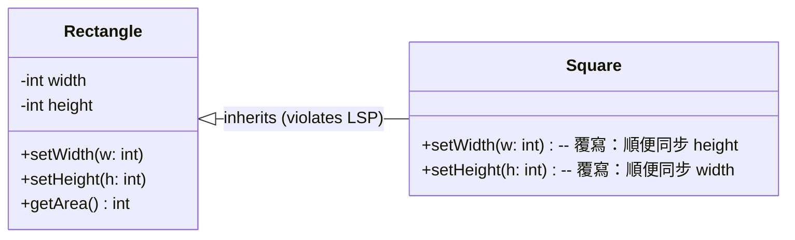
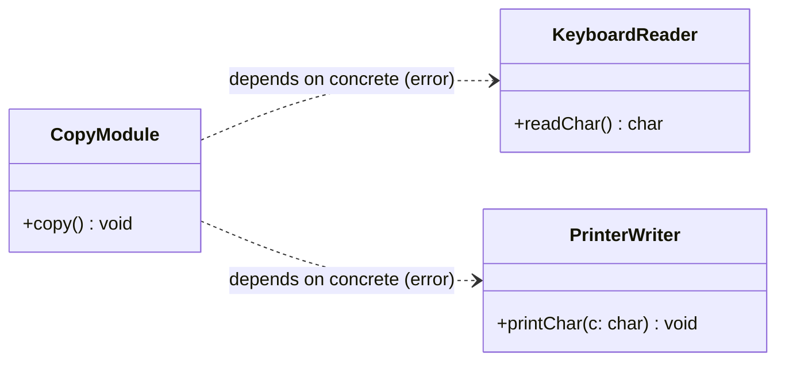
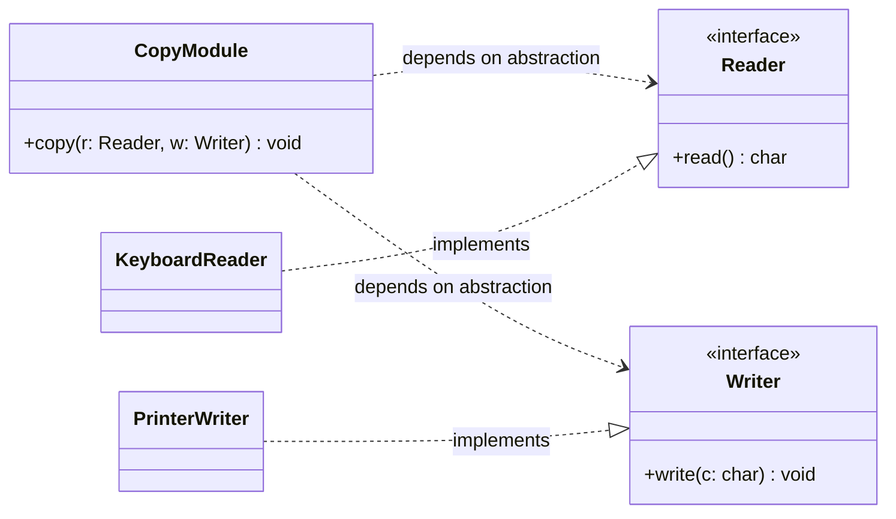
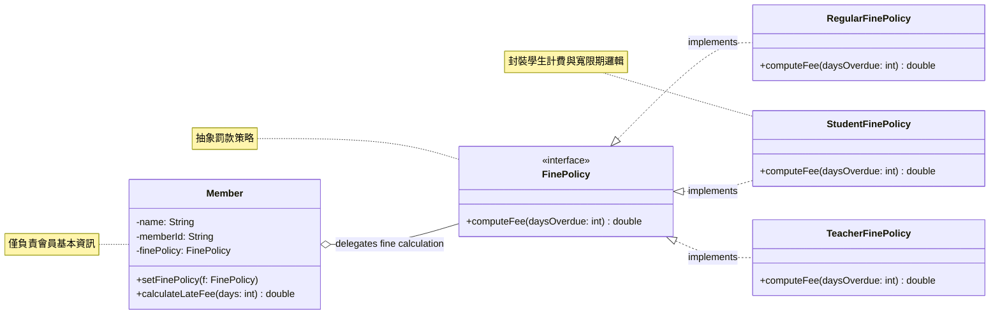

# Part 3 軟體與物件導向設計原則綜合測驗與挑戰

本測驗旨在評估學生對於 **Part 3 軟體與物件導向設計原則**（包含 Ch07 軟體設計原則、Ch08 物件導向設計原則、Ch09 程式碼重構）的理解程度，著重於高內聚低耦合、SOLID 原則、程式壞味道識別以及基礎重構技術的應用。

> [!IMPORTANT]
> **注意：** 本測驗範圍僅限於 Part 3 及其之前的內容，不包含 Part 4 (創建型)、Part 5 (結構型) 與 Part 6 (行為型) 的設計樣式。

---

## 一、 單選與複選題

### Ch07. 軟體設計原則

#### Q1. 軟體設計中常強調「低耦合、高內聚（Low Coupling, High Cohesion）」，下列關於耦合力與內聚力的敘述何者正確？
- A) 內聚力指的是不同模組之間的相依性，耦合力指的是模組內部的緊密關聯程度
- B) 內聚力越高代表模組功能越分散，耦合力越低代表系統越難維護
- C) 高內聚力通常代表低耦合力；高內聚力意味著模組內部的成員高度專注於解決單一任務，低耦合力代表模組間相依性低
- D) 為了提昇效能，我們應該追求高耦合力與低內聚力

<details>
<summary>解答</summary>

**C) 高內聚力通常代表低耦合力；高內聚力意味著模組內部的成員高度專注於解決單一任務，低耦合力代表模組間相依性低**
說明：低耦合降低了模組間的連鎖反應，使得一個模組修改時不易影響其他模組；高內聚則提升了模組的可理解性與重用性。兩者相輔相成，是良好軟體設計的基礎。
</details>

#### Q2. 某個初始化模組 `initSystem()`，內部依序執行了「連接資料庫」、「讀取配置檔」以及「渲染 UI 視窗」。這三個操作僅因為「必須在同一個時間點執行」而被放在同一個方法中。這符合哪一種內聚力類型？
- A) 功能內聚性 (Functional Cohesion)
- B) 時間性內聚性 (Temporal Cohesion)
- C) 依序內聚性 (Sequential Cohesion)
- D) 偶然內聚性 (Coincidental Cohesion)

<details>
<summary>解答</summary>

**B) 時間性內聚性 (Temporal Cohesion)**
說明：當一個模組內的多個任務唯一的共同點在於「它們必須在同一個時間段或時間點執行」時，這種內聚力稱為時間性內聚性。這類設計的關聯度較弱，未來容易隨需求調整而需要分拆。
</details>

#### Q3. 關於迪密特法則（Law of Demeter, LoD / 最少知識原則），下列何者違反了該原則的「不要與陌生人講話」精神？
- A) 呼叫方法傳入之參數物件的方法：`param.doSomething()`
- B) 呼叫物件自身方法：`this.internalHelper()`
- C) 連鎖呼叫取得深層內部物件的方法：`customer.getWallet().getMoney().getBillValue()`
- D) 呼叫在該方法內部自己 new 出來的物件的方法：`new Calculator().compute()`

<details>
<summary>解答</summary>

**C) 連鎖呼叫取得深層內部物件的方法：`customer.getWallet().getMoney().getBillValue()`**
說明：連鎖呼叫（Message Chains）暴露了太多的內部導航與物理結構細節。在該例中，Client 必須知道 Customer 擁有 Wallet，Wallet 擁有 Money，Money 擁有 Bill 值，這與陌生人（Wallet, Money）直接交談，造成了嚴重的緊密耦合。
</details>

#### Q4. 系統中「僅儲存使用者的生日欄位（BirthDate），而在需要年齡時才動態計算出年齡（Age），不額外使用資料庫欄位儲存年齡」的設計，是為了符合哪一個設計原則？
- A) 最少知識原則 (LoD)
- B) 開閉原則 (OCP)
- C) 不重複原則 (DRY)
- D) 防護變異原則 (PV)

<details>
<summary>解答</summary>

**C) 不重複原則 (DRY)**
說明：DRY 原則要求「資料或計算在系統中應該只有單一、明確的來源」。年齡可以由生日與當前時間推算出來，若在資料庫中同時儲存生日與年齡，一旦過了午夜或生日，兩者就會發生資料不一致的邪惡重複問題。
</details>

---

### Ch08. 物件導向設計原則

#### Q5. 關於「類別繼承（白箱重用）」與「組合/委託（黑箱重用）」的對照，下列敘述何者錯誤？
- A) 類別繼承是靜態綁定，在執行期無法動態變更父類別的實作
- B) 包含/委託是動態綁定，可以在執行期透過 setter 動態更換內部實作物件，彈性較高
- C) 類別繼承會打破父類別的封裝性，因為子類別通常可以看到父類別內部的 `protected` 成員
- D) 包含/委託因為直接暴露了內部實作的所有私有變數給 Client，所以稱為白箱重用

<details>
<summary>解答</summary>

**D) 包含/委託因為直接暴露了內部實作的所有私有變數給 Client，所以稱為白箱重用**
說明：D 是錯誤的。包含/委託（Composition/Delegation）僅透過公有介面與持有的物件進行溝通，物件內部的私有細節對外是完全封裝的，因此稱為「黑箱重用」；而繼承則因為子類別能窺探父類別的內部細節，容易打破封裝，因而被稱作「白箱重用」。
</details>

#### Q6. Liskov 取代原則 (LSP) 主要是用來檢驗繼承體系是否合理。根據 LSP，下列敘述何者正確？
- A) 只要概念上是 "is-a-kind-of" 關係，就可以無條件套用類別繼承
- B) 子類別除了在概念上符合繼承外，在「行為上」也必須能完全取代父類別，而不破壞 Client 呼叫端預期的正確性
- C) 子類別繼承父類別後，其限制條件可以比父類別更多、行為可以比父類別更少
- D) 鴕鳥繼承鳥類並覆寫 `fly()` 方法拋出例外，完全符合 LSP 的精神

<details>
<summary>解答</summary>

**B) 子類別除了在概念上符合繼承外，在「行為上」也必須能完全取代父類別，而不破壞 Client 呼叫端預期的正確性**
說明：Client 呼叫 `Bird.fly()` 時預期鳥類能飛。若傳入 `Ostrich`（鴕鳥）物件，執行期卻拋出異常或無法運作，就代表鴕鳥無法代父從軍，違反了 LSP 原則。行為不一致的繼承是不正確的設計。
</details>

#### Q7. 關於介面分割原則 (ISP) 的敘述，下列何者正確？
- A) 設計一個涵蓋所有業務方法的「大雜燴」通用介面，最有利於降低耦合
- B) 應該根據不同客端的需求，將臃腫的介面拆分為多個小而專一的介面，避免「介面污染」
- C) 介面污染是指介面被太多不同的類別繼承
- D) 為了程式安全，介面內不應該包含任何方法宣告

<details>
<summary>解答</summary>

**B) 應該根據不同客端的需求，將臃腫的介面拆分為多個小而專一的介面，避免「介面污染」**
說明：如果一個介面包含了與特定實作類別無關的方法，實作類別會被迫實作無效的「空殼方法」，造成介面污染。ISP 主張「許多小介面優於一個通用的大介面」。
</details>

#### Q8. 相依反轉原則 (DIP) 是 SOLID 的核心之一，其主要要求：
- A) 高階模組應該相依於低階模組的具體實作
- B) 抽象不應相依於細節，細節（具體類別）應該相依於抽象（介面或抽象類別）
- C) 程式碼中不能出現任何繼承關係
- D) 所有的類別都必須宣告為 static 類別

<details>
<summary>解答</summary>

**B) 抽象不應相依於細節，細節（具體類別）應該相依於抽象（介面或抽象類別）**
說明：DIP 要求高階政策（企業邏輯）與低階機制（具體實作，如特定的資料庫或設備）解耦，兩者皆相依於抽象（介面）。這反轉了傳統由上而下相依於具體實作的階層關係。
</details>

---

### Ch09. 程式碼重構

#### Q9. 軟體重構 (Refactoring) 的核心定義是在「不改變軟體哪一方面」的前提下，改善其內部程式碼結構？
- A) 編譯速度
- B) 外部行為與功能
- C) 類別的數量
- D) 程式碼的行數

<details>
<summary>解答</summary>

**B) 外部行為與功能**
說明：重構是在「不改變軟體外部可觀測行為」的前提下改善內部結構，以提高可讀性與維護性。因此，重構時絕不添加新功能，也不該改變單元測試的預期結果。
</details>

#### Q10. 在 Martin Fowler 的程式壞味道中，當你發現「一個類別因為太多不同的變更原因而需要修改（內聚力差）」以及「每當一個小變更，你必須同時修改許多不同類別中的小地方（相依度高）」時，這兩個壞味道分別被稱為什麼？
- A) 發散變更 (Divergent Change)；散彈槍手術 (Shotgun Surgery)
- B) 散彈槍手術 (Shotgun Surgery)；發散變更 (Divergent Change)
- C) 依戀情結 (Feature Envy)；資料泥團 (Data Clumps)
- D) 冗長方法 (Long Method)；大類別 (Large Class)

<details>
<summary>解答</summary>

**A) 發散變更 (Divergent Change)；散彈槍手術 (Shotgun Surgery)**
說明：
* **發散變更**：一個類別承擔太多不同職責，導致多個不同方向的需求變更都要改它（違反 SRP，解決手法通常是 `Extract Class`）。
* **散彈槍手術**：一個邏輯分散在多處，導致修改一個功能時需要去很多個類別小修小改（解決手法通常是 `Move Method` 集中變更點）。
</details>

#### Q11. 分析以下重構前的條件判斷程式碼，最適合套用的重構手法是：
```java
double getPayAmount() {
    double result;
    if (isDead) result = deadAmount();
    else {
        if (isSeparated) result = separatedAmount();
        else {
            if (isRetired) result = retiredAmount();
            else result = normalPayAmount();
        }
    }
    return result;
}
```
- A) Extract Method (提煉方法)
- B) Introduce Explaining Variables (引入解釋變數)
- C) Replace Nested Conditional with Guard Clauses (以衛句取代巢狀判斷)
- D) Replace Conditional with Polymorphism (以多型取代條件句)

<details>
<summary>解答</summary>

**C) Replace Nested Conditional with Guard Clauses (以衛句取代巢狀判斷)**
說明：巢狀的 `if-else` 會增加認知負荷。由於 `isDead`、`isSeparated` 等判斷是「非正常情況下提前退出的邏輯」，使用衛句（Guard Clauses）將其改寫成單層的 `if (condition) return ...;` 能讓程式碼扁平化、清晰易讀。
</details>

#### Q12. 關於重構方法中的「封裝集合 (Encapsulate Collection)」，下列做法何者最符合封裝原則？
- A) 直接提供該集合物件的 `getter` 與 `setter` 方法，讓外部自由替換
- B) 將集合設為 public，方便其他類別直接操作
- C) 移除該集合的 `setter`，改為提供 `add()` 和 `remove()` 方法，且 `getter` 回傳不可變的集合檢視（如 `Collections.unmodifiableSet`）
- D) 不提供任何讀取集合內元素的方法

<details>
<summary>解答</summary>

**C) 移除該集合的 `setter`，改為提供 `add()` 和 `remove()` 方法，且 `getter` 回傳不可變的集合檢視（如 `Collections.unmodifiableSet`）**
說明：直接暴露集合的 reference 會讓外部在不知情下修改集合內容，破壞內部狀態的一致性。封裝集合要求提供受控的 add/remove 管道，且 getter 回傳唯讀視圖，是保護內部資料的標準手法。
</details>

---

## 二、 跨章節與觀念對照 (單選題)

### Q13. 「依戀情結 (Feature Envy)」代表一個類別的方法頻繁地存取另一個類別的屬性以進行計算。這主要違反了哪一個設計原則，且通常使用什麼重構手法解決？
- A) 違反最少知識原則 (LoD)；使用 `Move Method` 將該方法移到它所依戀的類別中
- B) 違反開閉原則 (OCP)；使用 `Pull Up Method` 移至父類別
- C) 違反不重複原則 (DRY)；使用 `Extract Class` 提煉
- D) 違反防護變異原則 (PV)；使用 `Replace Temp with Query`

<details>
<summary>解答</summary>

**A) 違反最少知識原則 (LoD)；使用 `Move Method` 將該方法移到它所依戀的類別中**
說明：依戀情結代表該方法「放錯了地方」，它過度依賴陌生類別的內部欄位進行計算，造成不必要的緊密耦合（違反 LoD）。透過 `Move Method` 將該方法移過去，讓資料與操作該資料的行為封裝在同一個類別中，即可消除 Feature Envy。
</details>

### Q14. 傳統在處理不同身分（例如學生、教師、員工）的薪資計算法時，常使用 `switch-case` 或多層 `if-else`。這會違反何種設計原則，且建議在重構時如何解決？
- A) 違反資訊隱藏原則；使用 `Inline Class` 解決
- B) 違反開閉原則 (OCP)；使用 `Replace Conditional with Polymorphism` (以多型取代判斷) 解決
- C) 違反最少知識原則 (LoD)；使用 `Introduce Explaining Variables` 解決
- D) 違反模組化原則；使用 `Split Temporary Variable` 解決

<details>
<summary>解答</summary>

**B) 違反開閉原則 (OCP)；使用 `Replace Conditional with Polymorphism` (以多型取代判斷) 解決**
說明：若用 switch-case，當未來要新增「兼任教師」身分時，必須修改原有的計費邏輯程式碼，這違反了 OCP。透過將身分抽象化為父類別，並由具體子類別覆寫計費方法，未來新增身分時只需擴充子類別而不需修改既有代碼，此為典型的「以多型取代判斷」。
</details>

### Q15. Kent Beck 提出的「兩頂帽子 (Two Hats)」隱喻，是用來規範軟體開發時的何種行為？
- A) 同時戴著「添加功能」與「重構」帽子，邊寫新代碼邊優化舊結構
- B) 戴著「重構」帽子時，絕對不添加新功能或新測試，只改善結構；戴著「添加功能」帽子時，專注於新增功能與測試，兩者不可混為一談
- C) 在開發前戴著「設計」帽子，開發後戴著「除錯」帽子
- D) 一定要由兩名工程師一起開發

<details>
<summary>解答</summary>

**B) 戴著「重構」帽子時，絕對不添加新功能或新測試，只改善結構；戴著「添加功能」帽子時，專注於新增功能與測試，兩者不可混為一談**
說明：這是重構實務中最重要的紀律。如果邊重構邊寫新功能，一旦程式出錯，你將無法釐清到底是結構改善弄壞了舊代碼，還是新代碼本身有 Bug，這會大幅增加除錯的複雜度。
</details>

---

## 三、 問答題：找出設計圖中的錯誤 (UML 診斷)

### Q16. 診斷下方「Liskov 取代原則 (LSP)」違反而導致設計錯誤的類別圖，並說明其不合理之處與重構建議：


<details>
<summary>解答與診斷說明</summary>

#### 1. 不合理之處（違反 LSP 原則）：
* **概念與行為的不一致**：雖然幾何學上「正方形是一種長方形」，但從物件導向的**行為契約**來看，正方形（`Square`）並不具備與長方形（`Rectangle`）完全一致的行為。
* **行為限制增加**：`Rectangle` 的行為承諾是「可以獨立改變寬度與高度，而不影響另一方」。但 `Square` 繼承後，覆寫了 `setWidth` 與 `setHeight`，強迫寬度與高度必須隨時同步。
* **Client 崩潰**：若 Client 寫了測試邏輯 `test(Rectangle r) { r.setWidth(4); r.setHeight(5); assert(r.getArea() == 20); }`，當傳入 `Square` 時，寬高會被強制改為 5，面積變成 25，這導致 Client 邏輯壞掉。子類別無法在不知道其具體型別的情況下安全地取代父類別，違反了 LSP。

#### 2. 重構建議：
* **不要勉強使用類別繼承**。若兩者行為有衝突，不應使用繼承。
* **方案 A (使用組合/委託)**：`Square` 內部持有並使用 `Rectangle` 來做運算，但不繼承它，兩者沒有 Is-A 關係。
* **方案 B (抽象出共同介面)**：定義一個唯讀的抽象介面 `Shape` 擁有 `getArea()` 方法，讓 `Rectangle` 與 `Square` 分別實作此介面，避免將 `setWidth` 等不相容的行為強加在正方形上。
</mermaid>
</details>

---

### Q17. 診斷下方「相依反轉原則 (DIP)」違反的類別圖，並說明其缺點與重構設計：


<details>
<summary>解答與診斷說明</summary>

#### 1. 設計缺點（違反 DIP 原則）：
* **高階相依於低階**：高階的控制政策 `CopyModule` 直接依賴了底層具體的輸入/輸出設備 `KeyboardReader` 與 `PrinterWriter`。
* **難以擴充與變更**：如果未來我們需要改從「網路（Socket）」讀取資料，或者要將資料寫入「硬碟（Disk）」，我們必須被迫修改高階 `CopyModule` 內部的控制邏輯（例如在 `copy()` 方法內加上各種 `if (device == socket)` 的判斷）。高階邏輯受到低階設備變更的綁架，違反了 OCP 與 DIP。

#### 2. 重構設計：
* 應引入抽象層（介面/抽象類別），將 `CopyModule` 對具體類別的依賴解除，改為相依於抽象介面。
* 修正後的 UML 類別圖應為：

* **好處**：高階政策 `CopyModule` 僅相依於抽象的 `Reader` 與 `Writer`。未來不論新增什麼輸入（如 `NetworkReader`）或輸出（如 `DiskWriter`）設備，高階模組的程式碼完全不需更動，實現了徹底的解耦與開閉原則。
</details>

---

## 四、 問答題：設計與重構對照分析 (申論比較)

### Q18. 請比較「繼承 (白箱重用)」與「組合/委託 (黑箱重用)」的優缺點，並說明在何種情況下應「優先使用組合而非繼承」。

<details>
<summary>解答</summary>

#### 1. 繼承 (白箱重用) 的優缺點：
* **優點**：實作簡單。子類別可以直接復用父類別的程式碼，不需手動編寫轉發方法。
* **缺點**：
  * **打破封裝**：子類別對父類別的內部細節（如 protected 成員）是可見的，造成緊密耦合。父類別的微小改動可能導致子類別壞掉。
  * **靜態編譯綁定**：在編譯期就決定了關係，無法在執行期動態更換所繼承的實作。

#### 2. 組合/委託 (黑箱重用) 的優缺點：
* **優點**：
  * **維護封裝性**：被組合的物件內部細節不可見，只透過公有介面互動，耦合度極低。
  * **動態運行期綁定**：可以在執行期透過 setter 方法隨時抽換持有的具體物件，大幅提升系統彈性。
* **缺點**：需要編寫額外的轉發方法（Delegation methods），將請求手動遞送給內含的物件，會增加類別中的小方法數量。

#### 3. 優先使用組合的實務考量：
* 當類別之間**不符合嚴格的 Is-A 關係**（即行為不完全相容，如正方形與長方形、鴕鳥與鳥）。
* 當我們希望在**執行期動態變更物件的某部分行為**（例如：動態改變播放器的播放格式、動態改變商品的計價折扣策略）。
* 當我們僅需要復用另一個類別的**部分功能**，而不希望繼承其所有無關介面而造成介面污染時。

</details>

---

### Q19. 請比較程式壞味道中的「發散變更 (Divergent Change)」與「散彈槍手術 (Shotgun Surgery)」的成因、表現現象以及重構對治方法的不同。

<details>
<summary>解答</summary>

#### 1. 詳細對比分析：
兩者都是因為職責分配不當而引起的維護惡夢，但兩者的表現方向恰好相反：

| 比較維度 | 發散變更 (Divergent Change) | 散彈槍手術 (Shotgun Surgery) |
| :--- | :--- | :--- |
| **表現現象** | **「一個類別因為多個不同原因而頻繁修改。」**<br>例如：改資料庫 Schema 要改它，改 XML 格式要改它，改薪資計算公式也要改它。 | **「一個需求變更需要針對多個類別進行修改。」**<br>例如：新增一個新欄位，必須同時去修改 10 個類別中各自的一小段代碼。 |
| **主要成因** | **類別的內聚力太低**，一個類別承擔了太多的職責（違反單一職責原則 SRP）。 | **邏輯太過分散**，原本應該凝聚在一起的相依行為被零碎地拆散在各處。 |
| **重構對治方法** | **「拆分 (Split)」**。使用 `Extract Class` (提煉類別) 將不同的職責抽離成獨立的專屬類別（如拆出 `Repository` 與 `Exporter`）。 | **「集中 (Combine)」**。使用 `Move Method` (搬移方法) 與 `Move Field` 將分散的屬性與行為搬到同一個類別中，或使用 `Inline Class` 合併。 |

</details>

---

## 五、 設計與重構實作題 (Scenario-Based Design)

### Q20. 圖書管理系統之逾期罰款重構設計 (Library Fine System)

#### 【情境與原始碼描述】
在一套學校的圖書管理系統中，`Member` 類別內具備一個計算圖書逾期罰款的方法 `calculateLateFee`。然而，這段原始程式碼在維護上面臨極大的擴充瓶頸：
```java
public class Member {
    private String name;
    private String memberId;
    
    // 會員類型：1-一般會員, 2-學生會員, 3-教師會員
    private int memberType; 

    public double calculateLateFee(int daysOverdue) {
        double fee = 0.0;
        switch (memberType) {
            case 1: // 一般會員：無寬限期，每天罰 10 元
                fee = daysOverdue * 10.0;
                break;
            case 2: // 學生會員：寬限期 3 天，超過每天罰 5 元
                if (daysOverdue > 3) {
                    fee = (daysOverdue - 3) * 5.0;
                }
                break;
            case 3: // 教師會員：寬限期 7 天，超過每天罰 2 元
                if (daysOverdue > 7) {
                    fee = (daysOverdue - 7) * 2.0;
                }
                break;
            default:
                fee = daysOverdue * 10.0;
        }
        return fee;
    }
}
```

#### 【重構與設計要求】
1. 分析這段程式碼存在哪些**程式壞味道 (Code Smells)**，並說明違反了哪些**設計原則 (Design Principles)**。
2. 說明應採用何種重構手法，利用物件導向的**「多型」**來改善此處的 `switch-case`。
3. 畫出重構後的系統類別圖 (Class Diagram，使用 Mermaid)。
4. 寫出重構後各類別的程式碼架構。

<details>
<summary>設計解答與架構圖</summary>

#### 1. 程式壞味道與違反原則分析：
* **程式壞味道**：
  1. **Switch 敘述句 (Switch Statements)**：程式依賴魔術數字（1, 2, 3）並使用 `switch` 來針對不同類型做邏輯分支。當未來新增「校友會員」時，必須修改 `calculateLateFee` 內部的 `switch`，違反開閉原則。
  2. **基本型別偏執 (Primitive Obsession)**：使用 `int memberType` 來區分複雜的會員身分與其對應的計費政策。
* **違反的設計原則**：
  1. **開閉原則 (OCP)**：無法在不修改 `Member` 既有代碼的情況下擴充新會員身分的罰款算法。
  2. **單一職責原則 (SRP)**：`Member` 類別除了管理會員基本資料外，還承擔了所有不同會員種類的逾期罰款計算法。

#### 2. 重構對治手法：
採用 **`Replace Conditional with Polymorphism` (以多型取代判斷)** 手法：
1. 建立一個抽象的計費政策基底類別或介面 `FinePolicy`，宣告抽象方法 `double computeFee(int daysOverdue)`。
2. 實作三個具體策略子類別：`RegularFinePolicy`、`StudentFinePolicy`、`TeacherFinePolicy`，各自封裝其計費規則。
3. 在 `Member` 中，移除 `memberType` 欄位，改以組合關係持有 `FinePolicy` 參考，並在 `calculateLateFee` 方法中委託給 `finePolicy.computeFee(daysOverdue)`。

#### 3. Mermaid 重構類別圖設計：


#### 4. 重構後程式碼架構：
```java
// 1. 罰款策略介面
public interface FinePolicy {
    double computeFee(int daysOverdue);
}

// 2. 一般會員策略
public class RegularFinePolicy implements FinePolicy {
    @Override
    public double computeFee(int daysOverdue) {
        return daysOverdue * 10.0;
    }
}

// 3. 學生會員策略
public class StudentFinePolicy implements FinePolicy {
    @Override
    public double computeFee(int daysOverdue) {
        return daysOverdue > 3 ? (daysOverdue - 3) * 5.0 : 0.0;
    }
}

// 4. 教師會員策略
public class TeacherFinePolicy implements FinePolicy {
    @Override
    public double computeFee(int daysOverdue) {
        return daysOverdue > 7 ? (daysOverdue - 7) * 2.0 : 0.0;
    }
}

// 5. Member 類別：擺脫 Switch，符合 SRP 與 OCP
public class Member {
    private String name;
    private String memberId;
    private FinePolicy finePolicy; // 組合 (動態綁定)

    public Member(String name, String memberId, FinePolicy finePolicy) {
        this.name = name;
        this.memberId = memberId;
        this.finePolicy = finePolicy;
    }

    public void setFinePolicy(FinePolicy finePolicy) {
        this.finePolicy = finePolicy;
    }

    public double calculateLateFee(int daysOverdue) {
        // 委託執行，不需知道具體策略是哪一種
        return finePolicy.computeFee(daysOverdue); 
    }
}
```

</details>
