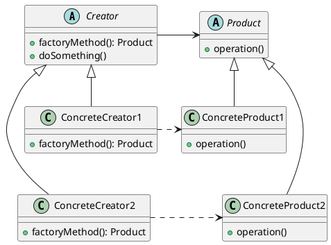

###### tags: `OOSE`

# Ch11 小器晚成：Factory Method

Factory Method (工廠方法)

## 11.1 目的與動機

> 定義一介面以生成物件，但將其生成延遲給子類別來作決定。
>> Define an interface for creating a single object, but let subclasses decide which class to instantiate. Factory Method lets a class defer instantiating to sub classes.

[OpenEdu- Factory Method](https://sec.openedu.tw/courses/course-v1:SEC+DP01+2016_Summer/courseware/7176155c57d24a12bfb7b83bc6e23af5/c1c326071aeb48dca124fd4e8872c2b5/)


### 動機

假設某一個Application物件可以產生Document物件以供其使用完成Application物件的工作。如果直接在Application某方法內生成文件物件，如下

```java=
    class Application {
       void operation1() {
           doc = new Document();
       }
    }
```    

則日後Application物件想建立不同型態的文件物件 (例如HTML文件、Word文件)時，則必須修改 operation1()方法如下：

    doc = new HTMLDocument();
    
or

    doc = new WordDocument();

這樣的缺點是如果我們每一次有新的文件類別產生時就必須修改程式(operation1())一次。我們可以將生成文件的動作抽象為一個方法，當日後有新的文件物件產出時，只要擴充 Application 類別即可，不需要修改文件物件。使用工廠方法的動機即為解決此類問題。下圖為採用此設計樣式後的結構。

<!-- \begin{figure}[h]
\begin{center}
\includegraphics[width=0.9\columnwidth]{dp/FactoryMethodDoc.png}
\caption{Using factory method}
\end{center}
\end{figure}
 -->


### 應用時機
  
- 建立者(Creator)無法預期將產生何種物件，並希望其子類別來決定生產何種物件時。


## 11.2 結構與方法

<!-- \begin{figure}[h]
\begin{center}
\includegraphics[width=0.8\columnwidth]{dp/FactoryMethodStr.png}
\caption{Factory Method 結構}
\label{fig_FM_str}
\end{center}
\end{figure}
 -->





> :question: ConcreteCreator 內的 factoryMethod() 產生的物件，可否是非 Product 的子類別？

#### 參與者

  
- Creator (建立者): 宣告Factory Method，回應一個物件型態的Product。
- ConcreteCreator (實際建立者): 修改Factory Method，回應一個新的ConcreteProduct。與Product的關係為：Creator會建立Product物件。
- Product (產品或零件):  定義物件的Factory Method型態介面。
- ConcreteProduct (實際產品): 實作的Product介面。


本章將 Factory Method 稱為「小器晚成」，因為零件物件 Product 是由 Creator 所建造的物件，故稱之為「小器」。又因為它被延遲到子類別來生成，所以稱之晚成。
     
### 程式樣板 

[Get the code](https://github.com/nlhsueh/OOSE/blob/master/src/factorymethod/FactoryMethodTemplate.java)

```java=
package factorymethod;

abstract class Creator {
	Product p;

	public void doSomething() {
		p = factoryMethod();
		// ...
	}

	public abstract Product factoryMethod();
}

class ConcreteCreator extends Creator {
	public Product factoryMethod() {
		return new ConcreteProduct();
	}
}

abstract class Product {
	abstract void operation();
}

class ConcreteProduct extends Product {
	void operation() {
		// ...
	}
}
```


### 優缺點

- 優：增加程式的擴充性，避免生產特別用途的物件就需要修改程式（符合 OCP 原則）。
- 缺：生產者只為了生產另一個特別的產品時，就必須建立一個子類別，可能會產生過多的子類別而增加管理上的負擔。

### 更多參考

[gugu web site](https://refactoring.guru/design-patterns/factory-method)

## 11.3 範例

### 11.3.1 迷宮範例

接下來以 Gamma 書中的實例說明 Factory Method 的用處。考慮一個迷宮的程式。一個迷宮包含許多房間、牆、門等物件，所以當 MazeGame 在建立時，必須建立一些「零件」物件，如Room、Door、Wall等：

#### 方法1: 未使用設計樣式

```java=
public class MazeGame {
    // 建立一個迷宮
   public Maze createMaze() {
      //產生建立迷宮遊戲的所需零件物件，包括Maze、Door、Room等
      Maze maze = new Maze();
      Room r1 = new Room(1);
      Room r2 = new Room(2);
      Door door = new Door(r1,  r2);
      //建立各子物件之間的關聯
      maze.addRoom(r1);  maze.addRoom(r2);
      r1.setSide(MazeGame.North, new Wall());
      r1.setSide(MazeGame.East, door);
      r1.setSide(MazeGame.South, new Wall());
      r1.setSide(MazeGame.West, new Wall());
      r2.setSide(MazeGame.North, new Wall());
      r2.setSide(MazeGame.East, new Wall());
      r2.setSide(MazeGame.South, new Wall());
      r2.setSide(MazeGame.West, door);
      return maze;
    }
}
```     

程式中的第 5-8 行建立Room、Door等零件物件，第10-18 行則建立這些物件的關係。下圖描述此實例的架構。

<!-- \begin{figure}[h]
\begin{center}
\includegraphics[width=0.4\columnwidth]{dp/FactoryMethodMaze0.png}
\caption{No Factory Method}
\label{fig_FM_maze0}
\end{center}
\end{figure}
 -->

FIG: no factory method


如果現在我們想擴充迷宮的功能，例如擴充迷宮內的房間是具備魔法的房間（enchanted room），我們可以建立一個一個新的類別 EnchantedRoom， 令其繼承Room，如下：

```java=
     class EnchantedRoom extends Room {
        …
     }
```         

而 MazeGame 中的 createMaze 方法也作修改，使其建立的房間是EnchantedRoom，不是Room：

```java=
     Room r1 = new EnchantedRoom(1);
     Room r2 = new EnchantedRoom(2);
```    
     
這樣的程式在執行上並不會有問題，只是它「違背了OCP的原則」-- 我們為了新增的功能而修改了原存在的類別內容。

我們可以使用工廠方法來解決這個問題，將「生產Room的工作」抽象為一個方法：

#### 方法2: 使用設計樣式

```java= 
public class MazeGame {
    // 建立一個迷宮
   public Maze createMaze() {
      //產生建立迷宮遊戲的所需零件物件，包括Maze、Door、Room等
      Maze maze = makeMaze(); // 採用工廠方法
      Room r1 = makeRoom(1); // 採用工廠方法
      Room r2 = makeRoom(2); // 採用工廠方法
      Door door = makeDoor(r1,  r2); //採用工廠方法
      //建立各子物件之間的關聯
      maze.addRoom(r1); maze.addRoom(r2);
      r1.setSide(MazeGame.North, new Wall());
      r1.setSide(MazeGame.East, door);
      r1.setSide(MazeGame.South, new Wall());
      r1.setSide(MazeGame.West, new Wall());
      r2.setSide(MazeGame.North, new Wall());
      r2.setSide(MazeGame.East, new Wall());
      r2.setSide(MazeGame.South, new Wall());
      r2.setSide(MazeGame.West, door);
      return maze;
    }
    public Maze makeMaze() {
       //將生產 Maze 物件的工作封裝成一個方法
       return new Maze();
    }
    public Room makeRoom(int n) {
       //將生產Room物件的工作封裝成一個方法
       return new Room(n);
    }
    public Wall makeWall() {
       return new Wall();
    }
    public Door makeDoor(Room r1,  Room r2)  {
       return new Door(r1, r2);
    }       
}
```

請注意第 5-8 行的目的是在建立 Room、Door 等物件，與上一個程式的第 5-8 行的目的是一樣的，可是我們卻將生產 Door，Room 等工作包成一個方法(makeDoor()、makeRoom()等)，其目的在提供一個子類別覆蓋的機會。21-36 行是 factory method 的設計。請看新版的 EnchantedMazeGame：

```java=
     public class EnchantedMazeGame extends MazeGame {
        public Room makeRoom(int n) {
           return new EnchantedRoom(n);
        }
        public Wall makeWall() {
           return new EnchantedWall();
        }
        public Door makeDoor(Room r1, Room r2)  {
           return new EnchantedDoor(r1, r2);
        }
     }
```    

請將本程式的第 03 行與 solution 2 的第 27 行相比較，前者回傳一個 EnchantedRoom 物件，而後者回傳一個 Room 物件；相同的是 makeRoom 在這兩個程式中的介面都沒有變。所以，EnchantedMazeGame 擴充 MazeGame 後所做的事很單純，就是讓所有生產物件的方法生產新的物件。我們再做兩個觀察：

- OCP 的原則吻合了嗎？是的，我們的功能加強了，但沒有任何程式碼做了修改。我們新增 EnchantedMazeGame 與 EnchantedRoom 等類別。
- makeRoom()的介面有相容嗎？是的，雖然 MazeGame.makeRoom() 的傳回型態是定義為 Room，而 EnchantedMazeGame.makeRoom()是傳回EnchantedRoom物件，但因為 EnchantedRoom 繼承自 Room，因而型態上是相容的。

相對應的UML圖如下：你可以把這些類別內的方法寫上嗎？

<!-- \begin{figure}[h]
\begin{center}
\includegraphics[width=0.5\columnwidth]{dp/FactoryMethodMaze1.png}
\caption{Using Factory Method}
\label{fig_FM_maze}
\end{center}
\end{figure}
 -->

FIG: Using factory method


如上的UML圖：新增類別以擴充功能：EnchantedMazeGame 與 EnchantedRoom

> 心得

我們獲得的心得是：在設計此某物件(MazeGame)時，如果知道它一定會建立某些零件物件(Room)時，為了想保留零件物件的彈性(亦即可以建立零件物件的子類別物件)，我們可以將建立零件物件的功能特別獨立出來成為一個方法(makeRoom())，這個方法就稱為 Factory Method(makeRoom())。

了解Factory Method後，Abstract Factory各位就更容易瞭解了。相較於Factory Method將生產包裝成一個方法，Abstract Factory將生產包裝成一個類別。我們將在下一章節介紹Abstract Factory。


## 11.4 靜態生成工廠

在設計模式中，**工廠方法模式 (Factory Method Pattern)** 屬於創建型模式，其核心思想是定義一個用於創建物件的介面，但讓子類別決定要實例化哪個類別。這意味著物件的創建邏輯被委託給子類別。

**一般工廠方法的特點：**

* 通常是一個**非靜態的方法**，定義在一個抽象的工廠類別或介面中。
* 具體的工廠類別會**繼承或實作**這個抽象工廠，並實作創建特定物件的方法。
* 客戶端需要**選擇一個具體的工廠**來創建所需的物件。

**靜態工廠方法 (Static Factory Method) 的特點：**

* 是一個被宣告為 `**static**` 的方法，**直接存在於類別本身**，而不是在一個單獨的工廠類別中。
* 它會**回傳該類別的一個實例**。
* 客戶端**直接調用類別的靜態方法**來獲取物件，無需顯式地創建工廠物件。

**主要差異表格：**

| 特性         | 一般工廠方法 (Factory Method Pattern) | 靜態工廠方法 (Static Factory Method) |
| ------------ | ------------------------------------- | ------------------------------------ |
| 方法是否靜態 | 通常非靜態                            | **必須是靜態的**                     |
| 定義位置     | 通常在抽象工廠類別或介面中            | **直接在需要創建實例的類別中**       |
| 使用方式     | 需要先創建具體工廠的實例，再調用方法  | **直接透過類別名稱調用方法**         |
| 靈活性       | 透過繼承不同的工廠類別來創建不同物件  | 透過靜態方法內部的邏輯來決定回傳物件 |

**簡單來說，一般工廠方法將物件創建的責任委託給子類別的工廠，而靜態工廠方法則是由類別自身提供一個靜態的入口來創建其實例。**

### 11.4.1 靜態工廠方法的優勢

雖然靜態工廠方法看起來很像 public constructor，但它提供了許多 constructor 無法實現的優勢：

* **可以擁有具描述性的名稱：** constructor 的名稱必須與類別名稱相同，而靜態工廠方法可以根據其創建的物件特性或目的來命名，提高程式碼的可讀性。例如：
    ```java
    // 使用靜態工廠方法
    List<String> emptyList = List.of();
    Set<Integer> singletonSet = Set.of(1);

    // 如果使用 constructor，可能就只是 new ArrayList() 或 new HashSet()，
    // 無法直接表達 "空的" 或 "單例" 的意圖。
    ```

* **每次調用不一定需要創建一個新的物件：** 靜態工廠方法可以回傳預先快取的實例，或者根據不同的輸入參數回傳相同的共享實例。這對於實現 Singleton 模式或管理資源非常有用。例如，`Boolean.valueOf(boolean)` 就會回傳預先存在的 `Boolean.TRUE` 或 `Boolean.FALSE` 實例。

* **可以回傳宣告類別的子類別物件：** constructor 只能回傳宣告它的類別的實例。而靜態工廠方法可以根據不同的條件回傳宣告類別的不同子類的實例，甚至可以在回傳時才決定具體的子類別。這為 API 設計提供了極大的靈活性。

* **回傳的物件所屬的類別在編寫包含該方法的類別時不必存在：** 這個特性使得介面 (interface) 也能擁有實例化的能力。介面可以定義靜態工廠方法，而該方法可以回傳實作該介面的任何類別的實例，即使在編寫介面時，這些實作類別還不存在。這在框架設計和服務提供者機制中非常有用。

### 11.4.2 靜態工廠方法的缺點

如同任何設計模式，靜態工廠方法也有其缺點：

* **如果沒有明顯的命名規則，很難從 API 文件中區分靜態工廠方法和其他靜態方法。** 因此，遵循一些常見的命名慣例很重要，例如 `from` (類型轉換)、`of` (聚合)、`valueOf` (基本類型轉換)、`instance` 或 `getInstance` (通常回傳單例或預設實例)、`newInstance` (每次都回傳新的實例)、`getType` (如同 `getInstance` 但類型不同)、`newType` (如同 `newInstance` 但類型不同)。

* **如果類別沒有 public 或 protected 的 constructor，子類別就無法繼承。** 因為子類別的 constructor 必須調用父類別的 constructor。如果你只提供了靜態工廠方法而沒有可存取的 constructor，就限制了子類別化的能力。

### 11.4.3 Java API 中的範例

Java API 中有許多使用靜態工廠方法的經典案例，讓我們來深入了解 `Calendar.getInstance()` 和 `NumberFormat.getInstance()`：

**`java.util.Calendar.getInstance()`**

`Calendar` 是一個抽象類別，用於處理日期和時間。你不會直接使用 `new Calendar()` 來創建實例。`Calendar.getInstance()` 這個靜態工廠方法負責根據你程式運行的環境（例如時區和地區設定）回傳 `Calendar` 的一個具體子類別的實例，最常見的是 `GregorianCalendar`。

```java
Calendar now = Calendar.getInstance(); // 根據預設時區和地區設定獲取 Calendar 實例
Calendar specificLocale = Calendar.getInstance(Locale.TAIWAN); // 根據台灣的地區設定獲取 Calendar 實例
```

**這個例子展示了靜態工廠方法的以下優勢：**

* **回傳子類別：** 客戶端不需要知道具體的 `Calendar` 實作類別，`getInstance()` 會負責選擇並回傳適當的子類別。
* **支援不同的配置：** 透過不同的重載方法，`getInstance()` 可以根據不同的參數（例如 `Locale` 和 `TimeZone`) 回傳不同配置的 `Calendar` 實例。

**`java.text.NumberFormat.getInstance()`**

`NumberFormat` 也是一個抽象類別，用於格式化和解析數字。同樣地，你會使用靜態工廠方法 `NumberFormat.getInstance()` 來獲取其實例。這個方法會根據預設的地區設定回傳一個合適的 `NumberFormat` 子類別的實例。

```java
NumberFormat formatter = NumberFormat.getInstance(); // 根據預設地區設定獲取 NumberFormat 實例
NumberFormat currencyFormatter = NumberFormat.getCurrencyInstance(Locale.TAIWAN); // 根據台灣的地區設定獲取貨幣格式化器
NumberFormat percentFormatter = NumberFormat.getPercentInstance(); // 獲取百分比格式化器
```

**這個例子進一步展示了靜態工廠方法的優勢：**

* **提供特定類型的格式化器：** 除了通用的 `getInstance()`，`NumberFormat` 還提供了 `getCurrencyInstance()` 和 `getPercentInstance()` 等靜態工廠方法，用於創建特定用途的格式化器，使得 API 更加清晰易用。
* **支援地區設定：** 透過接受 `Locale` 參數的重載方法，可以輕鬆地創建符合不同地區數字格式習慣的 `NumberFormat` 實例。

### 11.4.4 總結

靜態工廠方法是一種強大的物件創建模式，它在可讀性、靈活性和實例控制等方面都優於 public constructor。雖然它也有一些缺點，但在許多情況下，特別是在需要更精細的物件創建控制和 API 設計時，靜態工廠方法都是一個值得考慮的優秀選擇。Java API 中 `Calendar.getInstance()` 和 `NumberFormat.getInstance()` 等經典範例，充分展示了靜態工廠方法在實際開發中的應用價值。

## 11.5 Check

1.  Factory method 的目的
    A) 可以一次產生很多物件
    B) 確保一次只產生一個物件
    C) 把物件生成延遲到子類別
    D) 透過延遲生成物件來轉接物件介面

2.  下方程式碼中，程式 `m2()` 是一個 factory method, 下列何者正確？（選二）
    A) `?1` 為 `A`
    B) `?1` 為 `B`
    C) 若 `?2` 為 `return new C();` 則 `C` 為 `B` 的子類別
    D) `?2` 為 `return new A();`

```java
class A {
  public void m1() {
    ...
    B b = m2();
    ...
  }
  public ?1 m2() {
    ?2
  }
}
```

3.  在迷宮的實例中，以下何者正確
    A) 在採用 factory method 設計樣式後，把生成 `wall` 的方法，改以 `new Wall()` 的方式來產生
    B) `Maze` 的 `createMaze()` 方法是一個 factory method
    C) `EnchantedMazeGame` 中的 `makeWall()` 的回傳型態不可宣告為 `EnchantedWall`
    D) 此設計的目的是確保產生唯一的迷宮物件

4.  說明 Factory Method 的目的

5.  以下程式中，哪一個方法可能是 factory method?

```java
class A {
  public void m1() {
      ...
  }
  public B m2() {
     return new B();
  }
  public int m3() {
     int x = 0;
     for ....
        ...
     return x;
  }
}
```

---

**參考解答**:

1.  **Factory method 的目的**
    **解答：C) 把物件生成延遲到子類別**

    **解說：** Factory Method 模式的主要目的是將物件的實例化延遲到子類別中。父類別定義了建立物件的介面，但將具體要建立哪個類的實例的決定推遲給子類別。這樣做的好處是可以讓父類別的程式碼與具體的子類別解耦，增加了程式碼的彈性和可擴展性。

2.  **下方程式碼中，程式 `m2()` 是一個 factory method, 下列何者正確？**
    **解答：B) `?1` 為 `B`  和 C) 若 `?2` 為 `return new C();` 則 `C` 為 `B` 的子類別**

    **解說：**

    * **B) `?1` 為 `B`：** 因為在 `m1()` 方法中，透過 `B b = m2();` 可以看出 `m2()` 的目的是要產生一個 `B` 類型的物件並賦值給變數 `b`，因此 `m2()` 的回傳型態 `?1` 必須是 `B` 或 `B` 的父類別。最直接的情況下，`?1` 為 `B`。
    * **C) 若 `?2` 為 `return new C();` 則 `C` 為 `B` 的子類別：** Factory Method 的一個重要特性是它可以回傳所宣告回傳型態的子類別實例。如果 `m2()` 內部實作 (`?2`) 是 `return new C();`，為了保證型別安全，`C` 必須是 `B` 的子類別，這樣回傳的 `C` 的實例才能向上轉型為 `B` 並被 `b` 接收。
    * **A) `?1` 為 `A`：** 如果 `m2()` 回傳 `A` 的實例，那麼 `B b = m2();` 就會發生型別不符的錯誤，除非 `B` 是 `A` 的父類別，但在這個程式碼片段中並沒有這樣的資訊，且 Factory Method 通常是為了產生某個特定類別或其子類別的實例。
    * **D) `?2` 為 `return new A();`：** 同樣地，如果 `m2()` 直接回傳 `A` 的新實例，除非 `B` 是 `A` 的父類別，否則 `B b = m2();` 會導致型別不符。此外，Factory Method 的目的通常是產生在類別內部需要使用的關聯物件，而不是產生自身類型的物件。


3.  **在迷宮的實例中，以下何者正確**
    **解答：B) `Maze` 的 `createMaze()` 方法是一個 factory method**

    **解說：** 在迷宮的範例中，`MazeGame` 或其子類別通常會定義一個 `createMaze()` 方法，這個方法負責創建迷宮中的各種組件（例如房間、牆壁、門）。如果這個方法在父類別中定義了創建這些組件的抽象步驟，並允許子類別決定創建具體哪個子類的組件（例如普通的牆壁或魔法牆壁），那麼 `createMaze()` 就是一個 factory method。
    * A 錯誤，Factory Method 的目的是抽象化物件的生成，而不是直接使用 `new` 運算子。
    * C 錯誤，子類別的 factory method 可以回傳更具體的類型。例如，`EnchantedMazeGame` 的 `makeWall()` 可以回傳 `EnchantedWall`，這是 `Wall` 的子類別。
    * D 錯誤，Factory Method 的目的不是為了確保產生唯一的物件，那通常是 Singleton 模式的責任。

4.  **說明 Factory Method 的目的**
    **解答：** Factory Method 模式的主要目的是**定義一個用於創建物件的介面，但讓子類別決定實例化哪個類別。** 它將物件的創建延遲到子類別，從而允許一個類別將其實例化的責任委託給其子類別。

    **更詳細地說，Factory Method 的目的包括：**
    * **將客戶端程式碼與具體類別解耦：** 客戶端只需要依賴抽象介面，而不需要知道具體要創建哪個類別的實例。
    * **提高程式碼的彈性和可擴展性：** 可以很容易地通過新增新的子類別來改變或擴展物件的創建行為，而不需要修改現有的父類別程式碼。
    * **允許子類別選擇物件的具體類型：** 父類別可以定義創建物件的通用邏輯，而子類別可以根據需要選擇創建哪個具體子類的物件。
    * **提供一個創建物件的「鉤子(hook)」：** 子類別可以在物件創建前後執行一些額外的操作。

5.  **以下程式中，哪一個方法可能是 factory method?**
    **解答：`public B m2() { return new B(); }`**

    **解說：** `m2()` 方法符合 factory method 的基本特徵：
    * 它是一個 public 方法。
    * 它的回傳型態是某個類別 (`B`) 或介面。
    * 它的主要作用是創建並回傳該類別的一個新實例。

    雖然這個例子比較簡單，沒有體現出將實例化延遲到子類別的特性，但在更複雜的設計中，`m2()` 可以被設計為一個抽象方法，或者在子類別中被覆寫以創建 `B` 的不同子類別的實例。

    * `m1()` 看起來是一個執行某些操作的普通方法。
    * `m3()` 是一個執行計算並回傳整數的方法，與物件創建無關。


## 11.6 Exercise

### 11.6.1 Notification system

**情境：** 假設你需要開發一個通知系統，這個系統可以發送不同種類的通知，例如郵件通知和簡訊通知。未來可能還會新增其他類型的通知。

**任務：**

1.  定義一個 `Notification` 介面，包含一個 `send()` 方法。
2.  建立 `EmailNotification` 和 `SMSNotification` 兩個類別，它們都實作了 `Notification` 介面，並在 `send()` 方法中模擬發送對應類型的通知。
3.  使用 Factory Method 設計模式，建立一個 `NotificationFactory` 介面，其中包含一個 `createNotification()` 方法，這個方法接收一個字串參數 (例如 "email" 或 "sms")，並根據這個參數創建對應的 `Notification` 物件。
4.  建立 `EmailNotificationFactory` 和 `SMSNotificationFactory` 兩個類別，它們都實作了 `NotificationFactory` 介面，並在 `createNotification()` 方法中分別創建 `EmailNotification` 和 `SMSNotification` 的實例。
5.  編寫一個客戶端程式，該程式可以根據使用者的輸入 (例如 "email" 或 "sms")，使用相應的 Factory 來創建 `Notification` 物件，並調用其 `send()` 方法。

**思考方向：** 如何在不修改客戶端程式碼的情況下，輕鬆地新增新的通知類型？

### 11.6.2 Exam system
在考試系統中，可能進行各種不同的考試，例如小考 (Quiz)、正式考試 (Exam)、隨堂練習 (Practice) 等。AbstractExamApp 這個物件會產生考試物件，並開始進行一連串的活動（產生考卷、進行考試、閱卷）。請應用 factory method 來協助設計，並且降低 ExamApp 與考試類型之間的耦合力。(hint: 你需要設計：AbstractExamApp、QuizApp, ExamApp, PracticeApp, AbstractTest, Quiz, Exam, Practice 等類別)


### 11.6.3 ChessGame
在象棋系統中，可以如何應用 factory method?


<!-- ### 解答參考

- \ref{sel:fm:obj} (C), 定義一介面以生成物件，但將其生成延遲給子類別來作決定。
- \ref{sel:fm:fm} (B)(C), return 的型態為 B, 生成的物件為 B 或 B 的子類別。 
- \ref{short:fm:fm} m2() 。m2() 會生成物件，且型態為 B。m1() 沒有傳回型態故不可能。m3() 的回傳型態為 int, 也不可能。
 -->
