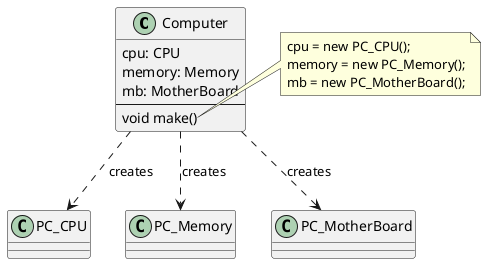
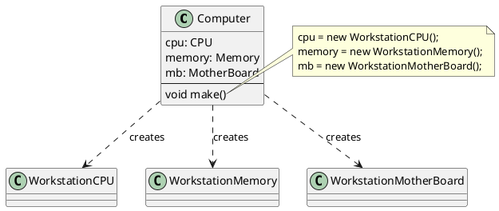

###### tags: `OOSE`

# Ch12 一式多款：Abstract Factory

## 12.1 目的與動機

> 提供一個介面物件以建立一群相關的物件，但卻不明確的指明這些物件的所屬類別，用以增加建立這些物件時的彈性。
>> Provide an interface for creating families of related or dependent objects without specifying their concrete classes.

### 12.1.1 動機

考慮一個 `Computer` 的物件在運作的時候需要用到 `CPU`、`Memory`、`MotherBoard` 等零件物件。如果我們在方法 `make()` 中產生這些零件物件，如下:

```java=
class Computer {
   void make() {
      cpu = new PC_CPU();
      memory = new PC_Memory();
      mb = new PC_MotherBoard();
   }
}
```




則日後 `Computer` 物件想建立不同型態的零件物件(例如工作站 `CPU`、工作站`Memory`、工作站主機板)時，則必須修改 `make()` 方法如下：

```java=
cpu = new WorkStationCPU();
memory = new WorkStationMemory();
mb = new WorkStationMainBoard();
```
這樣的缺點是如果我們每一次有新的電腦類別產生時就必須修改程式(`make()`)一次。我們可以將生成這一群零件物件的的動作抽象為一個**工廠類別**，當日後有新的零件物件產出時，**只要擴充這個工廠類別即可，不需要修改原程式的程式碼**。




### 12.1.2 應用時機

- 當系統的目標是生產具有許多類似的物件時，又有動態配置產品的需求時。
- 當所有生產的產品物件有一種家族系列的關係時（family of product）。

## 12.2 結構與方法


### 12.2.1 結構

抽象生成工廠的特色是系統可以拆解分成幾個家族，每個家族內有一些相近的成員類別。上圖為抽象生成工廠的架構圖，其中 `Factory1` 與 `Factory2` 為兩個不同的家族，每個家族在運作時，都會用到 `ProductA` 與`ProducetB` 等成員物件，但前者會用到 `ProductA1` 與 `ProductB1`，而後者會用到`ProductA2` 與 `ProductB2`。

### 12.2.2 參與者

  - 抽象工廠(`AbstractFactory`)：宣告一個介面，宣告生成零件物件的方法。
  - 實體工廠(`ConcreteFactory`)：實際負責生產的物件。一個實體工廠負責生成一個家族的所有零件物件。
  - 抽象產品(`AbstractProduct`)：宣告某項零件物件的共同性質。
  - 實體產品(`ConcreteProduct`)：實際存在的零件類別。
  - 使用者(`Client`)：使用者。實際需要遇到抽象工廠所產生的零件物件的物件。

### 12.2.3 程式樣板


```java=
public class Main {
  public static void main(String args[]) {
      Client c = new Client();
      // 由主程式決定系列
      Factory1 cf1 = new Factory1();
      c.doSomeThing(cf1);
  }
}

// Client 只會看到 Abstract 的工廠和零件
class Client {
  // 不同的工廠，產生不同系列的零件
  void doSomeThing(AbstractFacotry f) {
    AbstractProductA a = f.createProductA();
    AbstractProductB b = f.createProductB();
    ...
  }
}

//抽象零件 A，定義零件 A 的規格（方法）
abstract class AbstractProductA {
  //零件 A 需要履行的功能
  public abstract void m1(int x); 
}

//系列1 的零件 A
class ProductA1 extends AbstractProductA {
  public abstract void m1(int x) {
     ... // 系列1 的實踐的方法
  }   
}
//系列2 的零件 A
class ProductA2 extends AbstractProductA {
  public abstract void m1(int x) {
     ... // 系列2 的實踐的方法
  }   
}

//抽象零件 B，定義零件 B 的規格（方法）
abstract class AbstractProductB {
  //零件 B 需要履行的功能
  public abstract void doit(int x); 
}

//系列一的零件 B
class ProductA1 extends AbstractProductA {
  public abstract void doit(int x) {
     ... // 系列一的實踐的方法
  }   
}
//系列二的零件 B
class ProductA2 extends AbstractProductA {
  public abstract void doit(int x) {
     ... // 系列二的實踐的方法
  }   
}

// 定義一個工廠所需要產生的產品
interface AbstractFactory {
  public AbstractProductA createProductA();
  public AbstractProductB createProductB();
}

// 系列一的工廠
class Factory1 implements AbstractFactory {
  AbstractProductA createProductA() {
    return new ProductA1();
  }
  AbstractProductB createProductB() {
    return new ProductB1();
  }
}

// 系列二的工廠
class Factory2 implements AbstractFactory {
  AbstractProductA createProductA() {
    return new ProductA2();
  }
  AbstractProductB createProductB() {
    return new ProductB2();
  }
}
```

### 12.2.4 效益

- **DIP 原則**。`Client` 只會看到抽象的物件 `AbstractProductA`, `AbstractProductB`, `AbstractFactory` 等類別，並不會看到比較低階的 `ProductA2`, `ProductB1` 等物件，這大大的降低了 client 與這些物件的耦合力（coupling）。這也體現了「相依倒轉原則（Dependency Inversion Principle; DIP）」。
- **OCP 原則**。當我們有新的一組產品被開發出來，只需要透過繼承產生 `ConcreteFactory3`, `ProductA3`, `ProductB3` 即可，不需要修改 `Client` 中的程式碼。
- 抽象生成工廠最大的好處在於簡化家族間的切換。當系統想要使用某個家族類別時，只要傳入該家族類別的生成工廠即可，整個家族類別所需要的成員類別可以依序建立以供使用。比起Factory Method將生產只是包裝成一個方法，在 Abstract Factory中，則是將生產包裝成一個一個的類別，更能夠表示出一個工廠生產產品的特性。

## 12.2.5 Read more

[gugu web site](https://refactoring.guru/design-patterns/abstract-factory)

## 12.3 範例

AF 可以有很多的應用。在電腦工廠中... 在迷宮系統中，一般型態的迷宮是一個家族、有魔法的迷宮是一個家族。不論是哪一種家族，都需要用到零件物件如牆壁、房間、門等。

在象棋系統中，長棋是一個家族、短棋是一個家族。不論是哪一種家族，都需要用到零件物件如象棋規則、象棋棋盤、棋局管理等。

### 12.3.1 電腦工廠

```java=
class ComputerFactory {
   public CPU makeCPU() {
      return new CPU();
   }
   public Memory makeMemory() {
      return new Memory();
   }
   public MotherBoard makeMotherBoard() {
      return new MotherBoard();
   }
}

class Computer {
   public Computer createComputer(ComputerFactory factory) {
      // 使用 factory 來產生所有的零件物件
      CPU cpu = factory.makeCPU();
      Memory memory = factory.makeMemory();
      MotherBoard mb = factory.makeMotherBoard();
   }
}

class WorkstationFactory extends ComputerFactory {
   public CPU makeCPU() {
      return new WorkstationCPU();
   }
   public Memory makeMemory() {
      return new WorkstationMemory();
   }
   public MotherBoard makeMotherBoard() {
      return new WorkstationMotherBoard();
   }
}
```

請注意 `Workstation` 的各零件是都是 `Computer` 的子類別

```java=
class WorkstationCPU extends CPU {... }
class WorkstationMemory extends Memory {...}
class WorkstationMotherBoard extends MotherBoard {...}
```	

當我們想要生產 workstation 時，只要帶入 `WorkstationFactory` 就好了：

```java=
ComputerFactory factory = new WorkstationFactory();
computer.createComputer(factory);
```

如果要生產 PC，則帶入預設的 `ComputerFactory`;

```java=
ComputerFactory factory = new ComputerFactory();
computer.createComputer(factory);
```

### 12.3.2 迷宮

首先我們以 Gamma一書所提的迷宮程式來做介紹，在之前我們用 Factory Method 的方法去製作另一間`EnchantedRoom`，`EnchantedRoom` 本身必須要有`EnchantedRoom`必須的 `Wall` 和 `Door`。但是當我們希望能夠動態搭配 `Wall` 和 `Door`，這時候 Factory Method 所提供的便不夠了，我們可以改用Abstract Factory 來解決這個問題。

首先我們必須宣告一個 `MazeFactory`，負責去宣告 `makeMaze()`、`makeRoom()`、`makeWall()`、`makeDoor()` 等操作方法的介面：

```java=
class MazeFactory {
   public Maze makeMaze() {
      return new Maze();
   }
   public Room makeRoom(int n) {
      return new Room(n);
   }
   public Wall makeWall() {
      return new Wall();
   }
   public Door makeDoor(Room r1, Room r2) {
      return new Door(r1, r2);
   }
}
```

然後我們製作一個 `MazeGame` 負責去做一個主要操作的描述：

```java=
class MazeGame {
   static String North="north";
   static String East="east";
   static String South="south";
   static String West="west";
   Room r1, r2;
   Door door;
   Wall w1, w2, w3, w4, w5, w6;

   MazeFactory factory;
   public Maze createMaze() {
      // use factory to create all products
      Maze maze = factory.makeMaze();
      r1 = factory.makeRoom(1);
      r2 = factory.makeRoom(2);
      door = factory.makeDoor(r1, r2);
      w1 = factory.makeWall();
      w2 = factory.makeWall();
      w3 = factory.makeWall();
      w4 = factory.makeWall();
      w5 = factory.makeWall();
      w6 = factory.makeWall();

      // communication between products
      maze.addRoom(r1);
      maze.addRoom(r2);
      r1.setSide(MazeGame.North, w1);
      r1.setSide(MazeGame.East, door);
      r1.setSide(MazeGame.South, w2);
      r1.setSide(MazeGame.West, w3);
      r2.setSide(MazeGame.North, w4);
      r2.setSide(MazeGame.East, w1);
      r2.setSide(MazeGame.South, w3);
      r2.setSide(MazeGame.West, door);
      return maze;
   }
}
```

上述的程式應用了『包含』的關係來連接 `MazeGame` 和 `MazeFactory`。我們也可以把 `MazeFactory` 當成參數傳到 `MazeGame` 中，如下：

```java=
class MazeGame {
   ...
   public Maze createMaze(MazeFactory f) {
      ...
   }
}
```

除了`MazeFactory`外，我們亦做了一個`EnchantedMazeFactory`來表示出動態產生的結果。

```java= [caption={透過擴充建立一個新的迷宮遊戲}]
class EnchantedMazeFactory extends MazeFactory {
   public Maze makeMaze() {
      return new EnchantedMaze();
   }
   public Room makeRoom(int n) {
      return new EnchantedRoom(n);
   }
   public Wall makeWall() {
      return new EnchantedWall();
   }
   public Door makeDoor(Room r1, Room r2) {
      return new EnchantedDoor(r1, r2);
   }
}
```

在這個系統的設計中，也許大家發現了一個奇怪的地方，也就是 `MazeFactory` 為何不是抽象的，不是應該抽像一個 `MazeFactory`，讓各種`Maze`的實際生成工廠去引用嗎？在這裡的 `MazeFactory` 其實是扮演了兩個角色，本身是抽象工廠，也同時是負責實際生產的工廠。

對照抽象工廠的架構，程式中的 `MazeFactory` 相當於 `AbstractFacotry`，其他的對應關係如下：

- `AbstractFactory`：`MazeFactory`
- `ConcreteFactory`：`EnchantedMazeFactory`，`MazeFactory`
- `AbstractProduct`：此例中沒有
- `ConcreteProduct`：`Maze`、`Room`、`Wall`、`Door`
- `Client`：`MazeGame`

[Get the code](https://github.com/nlhsueh/OOSE/blob/master/src/abstractfactory/MazeGameDemo.java)

### 12.3.3 熱區與冰區

熱區（Hot spot）表示程式中會經常變動（擴充）的地方，冰區（frozen spot）則是不會變動的地方，也就是可以被重用（reuse）的地方。以上述的例子來看，冰區會是 `MazeGame.createMaze()` 這個方法，也就是說：生成的物件與他們之間關係的建立是不變。

熱區則是 建立 factory 物件的主程式了。

```java=
class GameDemo {
   public void static main(String[] args) {
      //f 可以變動
      MazeFactory f = new AgentMazeFactory();
      MazeGame = new MazeGame(f);
   }
}
```

### 12.3.4 比較

在 Factory Method 中，我們介紹工廠方法將「物件的生成封裝成一個方法」，透過覆寫，我們可以在不需要修改程式碼的情況下讓系統使用新的類別。相較於 Factory Method, Abstract Factory 則是將「物件的生成封裝成一個類別」。

## 12.4 Check

1.  Abstract factory 的目的為何？
    A) 把物件的生成延遲到子類別
    B) 轉接兩個介面不同的物件
    C) 把同一系列的物件群的生成委託給一個物件
    D) 一次只能生成一個物件

2.  在 Abstract factory 設計樣式中，設計階段 client 會與哪些類別關聯
    A) abstract factory
    B) concrete factory
    C) abstract product
    D) concrete product

3.  Abstract factory 樣式中，abstract factory 內宣告 m 個抽象方法，表示
    A) 有 m 個系列
    B) 有 m 個零件

4.  每一個 concrete factory 可以
    A) 產生某一系列的某一個零件
    B) 產生同一系列很多零件
    C) 產生同一零件很多系列

5.  Abstract factory 樣式中，有 n 個 concrete factory，表示
    A) 有 n 個系列
    B) 有 n 個零件

6.  Abstract factory 和 factory method 的異同為何？

7.  不要看講義，畫出 abstract factory 的架構圖。

---

好的，這就為您提供前六題的解答：

1.  **Abstract factory 的目的為何？**
    **解答：C) 把同一系列的物件群的生成委託給一個物件**

    **解說：** Abstract Factory 模式的主要目的是提供一個介面，用於創建一系列相關或相互依賴的物件家族，而無需指定它們的具體類別。它將創建相關產品的責任委託給工廠物件。

2.  **在 Abstract factory 設計樣式中，設計階段 client 會與哪些類別關聯**
    **解答：A) abstract factory 和 C) abstract product**

    **解說：** 在設計階段，客戶端程式碼主要依賴於抽象工廠（Abstract Factory）介面來創建產品，以及抽象產品（Abstract Product）介面來使用這些產品。這樣可以保持客戶端與具體的工廠和產品類別解耦。

3.  **Abstract factory 樣式中，abstract factory 內宣告 m 個抽象方法，表示**
    **解答：B) 有 m 個零件**

    **解說：** 在 Abstract Factory 中，每個抽象方法通常對應於產品族中的一個「零件」或一個類型的產品。因此，`m` 個抽象方法表示該工廠介面定義了創建 `m` 種不同類型產品的方法。

4.  **每一個 concrete factory 可以**
    **解答：B) 產生同一系列很多零件**

    **解說：** 每個具體工廠（Concrete Factory）負責創建一個特定產品族中的所有「零件」。它會實現抽象工廠中定義的創建每個產品的方法，並返回該產品族中對應的具體產品實例。

5.  **Abstract factory 樣式中，有 n 個 concrete factory，表示**
    **解答：A) 有 n 個系列**

    **解說：** 每個具體工廠負責創建一個特定的產品族。因此，`n` 個具體工廠意味著系統可以創建 `n` 個不同的產品系列。

6.  **Abstract factory 和 factory method 的異同為何？**

    **解答：**

    **相同點：**
    * 都是 Creational Design Pattern，用於封裝物件的創建邏輯，使得客戶端不需要知道具體要創建哪個類別的實例。
    * 都旨在將物件的實例化與其使用分離，提高程式碼的彈性和可維護性。

    **不同點：**
    * **Factory Method:** 關注於**創建一個單一產品**的實例，通常將物件的創建延遲到子類別。它通常在一個繼承層次結構中實現。
    * **Abstract Factory:** 關注於**創建一系列相關或相互依賴的產品族**。它提供一個創建多個產品的方法介面，而具體的產品族由具體的工廠來創建。Abstract Factory 通常涉及到多個抽象產品和多個具體產品類別。
    * **範圍：** Factory Method 的範圍通常較小，用於創建單一類型的物件。Abstract Factory 的範圍較大，用於創建一組相關的物件。
    * **實現方式：** Factory Method 可以通過抽象方法在父類別中聲明，並在子類別中實現來決定創建哪個具體產品。Abstract Factory 通常涉及到一個抽象工廠介面和多個實現該介面的具體工廠類別。

## 12.5 Exercise

### 12.5.1 Shoes
鞋子工廠，一定要製造鞋身(shoes body)、鞋帶(shoes strap)、鞋底(shoes bottom)三個零件,不同型態的鞋子,例如運動鞋(sport shoes) 、休閒鞋 (leisure shoes)、皮鞋 (leather shoes) 都會用到不同型態的零件。假設製造鞋子流程都是固定的, 寫在 makeShoes() 方法中,而我們也希望重用這樣的流程,不想因為製造不同的鞋子就換修改到 makeShoes 的程式,因此我們採用 Abstract Factory 來設計。請畫出 UML 架構圖，並寫出此程式。


### 12.5.2 ChessGame

多樣玩法的彈性象棋系統

**目標：** 設計一個彈性的象棋系統框架，能夠支援多種不同的象棋玩法（例如：標準象棋、暗棋）。請使用 Abstract Factory 設計模式來創建不同玩法所需的相關物件（棋子、規則、棋盤設定）。

**情境描述：**

你正在開發一個通用的象棋遊戲平台，該平台需要能夠支援多種不同的象棋玩法。目前你需要實現對以下兩種玩法的支援：

* **標準象棋 (Standard Chinese Chess):** 包含車、馬、象、士、炮、兵/卒等棋子，以及標準的移動和吃子規則，使用 8x8 的棋盤和特定的初始佈局。
* **暗棋 (Blind Chinese Chess):** 棋子背面朝上，玩家翻開後才能移動，部分棋子的吃子規則與標準象棋不同，使用特定的棋盤大小和初始棋子數量。

未來平台可能需要支援更多不同的象棋玩法。你的設計應該能夠容易地擴充新的玩法，而不需要修改現有的核心程式碼。

**設計參考：**

1.  **定義抽象產品介面：**
    * **`ChessPiece` (棋子):** 定義所有棋子都應具備的基本屬性（例如：名稱、顏色、位置）和行為（例如：`getName()`, `getColor()`）。
    * **`ChessRule` (規則):** 定義特定象棋玩法的規則，例如判斷移動是否合法 (`isValidMove()`)。
    * **`BoardConfig` (棋盤設定):** 定義特定象棋玩法的棋盤尺寸和初始棋子佈局 (`getBoardSize()`, `getInitialPlacement()`)。

2.  **實現具體產品類別 (針對每種玩法)：**
    * **標準象棋產品：** 創建標準象棋的具體棋子類別（例如 `StandardRook`, `StandardKnight`），實現 `ChessPiece` 介面。創建 `StandardChessRule` 類別實現標準象棋的規則。創建 `StandardBoardConfig` 類別定義標準象棋的棋盤設定。
    * **暗棋產品：** 創建暗棋的具體棋子類別 (`BlindPiece`)，實現 `ChessPiece` 介面（可能需要額外的屬性來表示是否已翻開）。創建 `BlindChessRule` 類別實現暗棋的規則。創建 `BlindBoardConfig` 類別定義暗棋的棋盤設定。

3.  **定義抽象工廠介面：**
    * **`ChessFactory`:** 定義創建不同產品的方法：`createChessPiece(String name, String color)`, `createChessRule()`, `createBoardConfig()`。

4.  **實現具體工廠類別 (針對每種玩法)：**
    * **`StandardChessFactory`:** 實現 `ChessFactory` 介面，其創建方法返回標準象棋的具體產品物件 (`StandardChessPiece`, `StandardChessRule`, `StandardBoardConfig`)。
    * **`BlindChessFactory`:** 實現 `ChessFactory` 介面，其創建方法返回暗棋的具體產品物件 (`BlindPiece`, `BlindChessRule`, `BlindBoardConfig`)。

5.  **設計遊戲管理器：**
    * 創建一個 `GameManager` 類別，該類別接收一個 `ChessFactory` 物件，並使用該工廠來創建當前玩法的棋子、規則和棋盤設定。

6.  **展示不同玩法的創建：**
    * 在你的程式中展示如何通過使用不同的具體工廠 (`StandardChessFactory` 和 `BlindChessFactory`) 來創建不同玩法的遊戲管理器，並簡要展示如何獲取對應的棋子、規則和棋盤設定。

**提示引導：**

1.  **思考不同玩法的「產品族」：** 標準象棋和暗棋是兩個不同的玩法，它們需要的棋子種類、規則和棋盤設定是不同的。將每個玩法視為一個獨立的「產品族」。
2.  **抽象工廠的角色：** `ChessFactory` 的作用是提供一個統一的介面來創建屬於特定玩法的所有相關物件。它不關心具體創建哪個類別的棋子或規則，只負責提供對應玩法的「產品」。
3.  **具體工廠的責任：** `StandardChessFactory` 和 `BlindChessFactory` 是具體的工廠，它們知道如何創建標準象棋和暗棋的具體棋子類別、規則類別和棋盤設定類別。
4.  **客戶端如何使用工廠：** `GameManager` 是客戶端，它只需要依賴抽象工廠 `ChessFactory`。通過在創建 `GameManager` 時傳入不同的具體工廠實例，就可以讓遊戲管理器適應不同的玩法。
5.  **如何新增新的玩法：** 思考如果未來要新增第三種象棋玩法，例如「三國象棋」，你需要做哪些修改？（答案：創建新的具體產品類別和一個新的具體工廠類別，而不需要修改已有的抽象介面和客戶端程式碼）。
6.  **關注介面而非實作：** 在設計抽象介面（`ChessPiece`, `ChessRule`, `BoardConfig`, `ChessFactory`) 時，重點定義它們的行為，而不需要關心具體的實作細節。具體的實作將在具體產品類別和具體工廠類別中完成。
