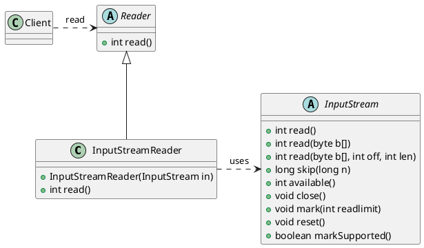

###### tags: `OOSE`


# Ch14 乾坤挪移：Adapter

## 14.1 目的與動機

> 轉換類別的介面成另一個介面所預期的樣式。Adapter 能夠讓不相容的介面，用轉接的方式合作，並且相容。
>> Convert the interface of a class into another interface clients expect. An adapter lets classes work together that could not otherwise because of incompatible interfaces. The enterprise integration pattern equivalent is the translator 

### 14.1.1 動機

各位都有要將三孔插頭插入二孔插座時的困擾吧！怎麼辦呢？除了將多餘的一角拔掉外，我們可以買一個三轉二的轉接器來做調整。在軟體的設計上，我們也常遇到過同樣的問題：

物件A在某個環境下使用介面 $I_1$ 來達成某個功能，但換到另一個環境時，提供相同功能的物件B的介面卻不是 $I_1$，而是另一個不同的 $I_1$。在不修改A物件的呼叫與 B 物件的介面時(正如同我們不願修改插頭與插座)，我們如何能讓物件 A 正確的呼叫到該功能？

有時候我們在引用一些類別介面時，有些功能無法引用，是因為介面不相容，我們可能有原始碼但卻不想更動到它的原始結構，或是我們並不知道它的原始碼，只知道它的操作方式。這時候使用轉接器(Adapter)設計樣式，做一個轉接的代理接口，就能讓兩個原本不相容的介面接合在一起。

### 14.1.2 應用時機

當你想使用手邊已存在的類別時，但它的介面並不相容於你所預期的樣式，或是你想發展一個可以Reuse的類別，讓它能夠和不相容介面相互合作。

## 14.2 結構與方法

### 14.2.1 結構

Adapter所以分為2種，一為`類別轉接器`(class Adapter)，一為`物件轉接器`(object Adapter)。前者使用繼承(inheritance)的技巧，而後者使用委託(delegation)的技巧。


FIG: Adapter Design Pattern- Using Class Inheritance


FIG: Adapter Design Pattern- Using Delegation

### 14.2.2 程式範本

#### class adapter

```java=
package adaptor.classadaptor;
// Adaptee的specificRequest()對應到Target的request()
interface Target {
    public void request(Object arg);
}

class Adaptee {
    public void SpecificRequest(Object arg) {
        //...
    }
}

class Adapter extends Adaptee implements Target {
    public void request(Object arg) {
        this.SpecificRequest(arg);
    }
    
}

class Client {
    // t 可以是一個Target,  或是一個Adapter (實作了Target)
    public void makeRequest(Target t, Object o) {
      t.request(o);
    }
}
```


#### Object adapter

```java=
package adaptor.objectadaptor;

// Adaptee的specificRequest()對應到Target的request()
class Target {
	public void request(Object arg) {
		// ...
	}
}

class Adapter extends Target {
	Adaptee adaptee;

	public Adapter(Adaptee a) {
		this.adaptee = a;
	}

	public void request(Object arg) {
		adaptee.specificRequest(arg);
	}
}

class Adaptee {
	public void specificRequest(Object arg) {
		// ...
	}

}

class Client {
	public void main(String args[]) {
		Target t = new Adapter(new Adaptee());
		t.request(new Integer(1));
	}
}
```

### 14.2.3 更多參考

[gugu web site](https://refactoring.guru/design-patterns/adapter)

## 14.3 範例


### 14.3.1 電源轉接器

假設電腦是慣用的介面是 TwoPin, 但現在都改成 ThreePin 的插座了，請設計一個 2-3 Adapter。

```java=
class TwoPin {
   insert() {...}
}

class ThreePin {
   plugIn() {... }
}
      
public class Adapter extends TwoPin {
    private ThreePin threePin;
    public Adapter(ThreePin pin)  {
        this.threePin = pin;
    }
    public void insert(String str)  {
        threePin.plugIn(str);
    }
}

public class Computer {
    public static void main(String args[])  {
        ThreePin threePin = new ThreePin();

        TwoPin adapter = new Adaptor(threePin);
        (new Computer()).powerOn(adapter);
    }
    
    // 我們不想要改變的程式，電腦的電線都是用 TwoPin 的介面
    public void powerOn (TwoPin pin) {
       pin.insert();
       powerOnComputer();
       ...
    }
}
```


### 14.3.2 Copy

考慮一個 VectorUtility 類別，其提供了一個copy的功能，可以將某個Vector複製到另一個Vector，但前提是Vector內的元素必須符合isCopyable的介面：

```java=
interface Copyable {
    Copyable copy(); // 定義複製方法
    boolean isCopyable(); // 定義判斷是否可複製的方法
}

class VectorUtility {
    public static Vector copy(Vector<? extends Copyable> vin) {
        Vector<Copyable> vout = new Vector<>();
        Enumeration<? extends Copyable> e = vin.elements();
        while (e.hasMoreElements()) {
            Copyable c = e.nextElement();
            if (c.isCopyable()) {
                vout.addElement(c.copy()); // 調用元素的 copy() 方法創建副本
            }
        }
        return vout; // 記得回傳新的 Vector
    }
}
```

例如 Book 符合 Copyable 的介面，則 VectorUtility 就可以複製一個以 Book 建立的 Vector：

```java
class Book implements Copyable {
    private String data;
    private boolean canCopy;

    public Book(String data, boolean canCopy) {
        this.data = data;
        this.canCopy = canCopy;
    }

    public String getData() {
        return data;
    }

    public void setData(String data) {
        this.data = data;
    }

    @Override
    public Book copy() {
        return new Book(this.data, this.canCopy); // 創建並回傳新的 MyObject 實例
    }

    @Override
    public boolean isCopyable() {
        return this.canCopy;
    }
}
```

可以應用 VectorUtity 來複製 Book:

```java
Vector<Book> originalVector = new Vector<>();
originalVector.addElement(new Book("Book 1", true));
originalVector.addElement(new Book("Book 2", false));
originalVector.addElement(new Book("Book 3", true));

Vector<Book> copiedVector = VectorUtility.copy(originalVector);

// 驗證複製結果
System.out.println("Original Vector:");
for (Book obj : originalVector) {
    System.out.println(obj.getData() + " (Copyable: " + obj.isCopyable() + ")");
}

System.out.println("\nCopied Vector:");
for (Book obj : copiedVector) {
    System.out.println(obj.getData() + " (Copyable: " + obj.isCopyable() + ")");
}

// 驗證是否是不同的物件實例
if (!originalVector.isEmpty() && !copiedVector.isEmpty() && originalVector.elementAt(0) != copiedVector.elementAt(0)) {
    System.out.println("\nVector 中的物件已成功複製 (是不同的實例)。");
} else {
    System.out.println("\nVector 中的物件未成功複製 (是相同的實例)。");
}
```

執行結果：
```
Original Vector:
Book 1 (Copyable: true)
Book 2 (Copyable: false)
Book 3 (Copyable: true)

Copied Vector:
Book 1 (Copyable: true)
Book 3 (Copyable: true)
```

若我們要複製的東西是 `Student`，但 `Student` 並不支援 `Copyable` 介面，但提供一個相似的功能介面— `isValid`。如何能讓 `VectorUtility` 也可以來複製學生的 Vector 呢？

```java
class Student {
    private String name;
    private int age;
    private boolean valid; // 類似 Copyable 的 isCopyable 功能

    public Student(String name, int age, boolean valid) {
        this.name = name;
        this.age = age;
        this.valid = valid;
    }

    public String getName() {
        return name;
    }

    public int getAge() {
        return age;
    }

    public boolean isValid() {
        return valid;
    }
}
```

看看 Adapter 如何幫忙吧！

```java
class StudentAdapter implements Copyable {
    private Student student;

    public StudentAdapter(Student student) {
        this.student = student;
    }

    @Override
    public StudentAdapter copy() {
        if (student.isValid()) {
            // 只有在 Student 物件 valid 的情況下才創建副本
            return new StudentAdapter(new Student(student.getName(), student.getAge(), student.isValid()));
        } else {
            // 如果 Student 物件 invalid，則不進行複製，可以返回 null 或拋出異常
            // 這裡選擇返回 null，表示無法複製
            return null;
        }
    }

    @Override
    public boolean isCopyable() {
        return student.isValid(); // 使用 Student 的 isValid() 方法
    }

    // 可以選擇性地提供存取原始 Student 物件的方法
    public Student getStudent() {
        return student;
    }
}
```

其 UML 的結構如下：


FIG: 應用 Adaptor- Copyable


而使用 `VectorUtility` 來 copy 的方式如下：

```java
Vector<StudentAdapter> studentVector = new Vector<>();
studentVector.addElement(new StudentAdapter(new Student("Alice", 20, true)));
studentVector.addElement(new StudentAdapter(new Student("Bob", 22, false)));
studentVector.addElement(new StudentAdapter(new Student("Charlie", 19, true)));

Vector<Copyable> copiedStudentVector = VectorUtility.copy(studentVector);

System.out.println("Original Student Vector:");
for (StudentAdapter adapter : studentVector) {
    Student s = adapter.getStudent();
    System.out.println(s.getName() + " (" + s.getAge() + ", Valid: " + s.isValid() + ")");
}

System.out.println("\nCopied Student Vector:");
for (Copyable copyable : copiedStudentVector) {
    if (copyable instanceof StudentAdapter) {
        StudentAdapter adapter = (StudentAdapter) copyable;
        Student s = adapter.getStudent();
        System.out.println(s.getName() + " (" + s.getAge() + ", Valid: " + s.isValid() + ")");
    }
}
```

### 14.3.3 StreamReader




**背景：** Java 的 I/O 流處理提供了面向位元組 (`InputStream` 和 `OutputStream`) 和面向字元 (`Reader` 和 `Writer`) 的兩種主要的流層次結構。有時候我們需要將位元組流轉換為字元流，或者反過來。

**問題：** `InputStream` 和 `Reader` 是不同的抽象類別，它們的介面方法（例如 `read()`）的參數和返回值類型都不同，因此無法直接互相操作。同樣的情況也發生在 `OutputStream` 和 `Writer` 之間。

**解決方案：** Java 提供了 `InputStreamReader` 和 `OutputStreamWriter` 這兩個類別作為 Adaptor。

**運作方式：**

1.  **Target 介面：** `Reader` 介面（用於字元輸入）和 `Writer` 介面（用於字元輸出）。

    ```java
    public abstract class Reader implements Readable, Closeable {
        // ... 定義了讀取字元的方法
        public abstract int read(char cbuf[], int off, int len) throws IOException;
        // ...
    }

    public abstract class Writer implements Appendable, Closeable, Flushable {
        // ... 定義了寫入字元的方法
        public abstract void write(char cbuf[], int off, int len) throws IOException;
        // ...
    }
    ```

2.  **Adaptee：** `InputStream` 抽象類別（用於位元組輸入）和 `OutputStream` 抽象類別（用於位元組輸出）。

    ```java
    public abstract class InputStream implements Closeable {
        // ... 定義了讀取位元組的方法
        public abstract int read() throws IOException;
        // ...
    }

    public abstract class OutputStream implements Closeable, Flushable {
        // ... 定義了寫入位元組的方法
        public abstract void write(int b) throws IOException;
        // ...
    }
    ```

3.  **Adaptor：**
    * `InputStreamReader` 類別繼承自 `Reader`，並接收一個 `InputStream` 物件作為建構子參數。它將從 `InputStream` 讀取的位元組根據指定的字元編碼轉換為字元，使得客戶端可以像操作 `Reader` 一樣讀取字元資料。

        ```java
        import java.io.InputStream;
        import java.io.InputStreamReader;
        import java.io.IOException;
        import java.nio.charset.Charset;

        public class InputStreamReader extends Reader {
            // ...
            public InputStreamReader(InputStream in) {
                super(in);
                sd = StreamDecoder.forInputStreamReader(in, (Object)this, (String)null);
            }

            public InputStreamReader(InputStream in, String charsetName) throws UnsupportedEncodingException {
                super(in);
                if (charsetName == null)
                    throw new NullPointerException("charsetName");
                sd = StreamDecoder.forInputStreamReader(in, (Object)this, charsetName);
            }
            // ... 覆寫了 Reader 的 read() 方法，內部調用 InputStream 的 read() 並進行轉換
            public int read(char cbuf[], int off, int len) throws IOException {
                return sd.read(cbuf, off, len);
            }
            // ...
        }
        ```

    * `OutputStreamWriter` 類別繼承自 `Writer`，並接收一個 `OutputStream` 物件作為建構子參數。它將寫入的字元根據指定的字元編碼轉換為位元組，然後寫入到 `OutputStream` 中，使得客戶端可以像操作 `Writer` 一樣寫入字元資料。

        ```java
        import java.io.OutputStream;
        import java.io.OutputStreamWriter;
        import java.io.IOException;
        import java.io.UnsupportedEncodingException;
        import java.nio.charset.Charset;

        public class OutputStreamWriter extends Writer {
            // ...
            public OutputStreamWriter(OutputStream out) {
                super(out);
                se = StreamEncoder.forOutputStreamWriter(out, (Object)this, (String)null);
            }

            public OutputStreamWriter(OutputStream out, String charsetName) throws UnsupportedEncodingException {
                super(out);
                if (charsetName == null)
                    throw new NullPointerException("charsetName");
                se = StreamEncoder.forOutputStreamWriter(out, (Object)this, charsetName);
            }
            // ... 覆寫了 Writer 的 write() 方法，內部調用 OutputStream 的 write() 並進行轉換
            public void write(char cbuf[], int off, int len) throws IOException {
                se.write(cbuf, off, len);
            }
            // ...
        }
        ```

4.  **Client：** 我們可以使用 `InputStreamReader` 包裝 `InputStream` 來讀取字元資料，或使用 `OutputStreamWriter` 包裝 `OutputStream` 來寫入字元資料。

    ```java
    import java.io.*;

    public class IODemo {
        public static void main(String[] args) {
            try (FileInputStream fis = new FileInputStream("input.txt");
                 InputStreamReader isr = new InputStreamReader(fis, "UTF-8");
                 BufferedReader br = new BufferedReader(isr);
                 FileOutputStream fos = new FileOutputStream("output.txt");
                 OutputStreamWriter osw = new OutputStreamWriter(fos, "UTF-8");
                 BufferedWriter bw = new BufferedWriter(osw)) {

                String line;
                while ((line = br.readLine()) != null) {
                    System.out.println("讀取到：" + line);
                    bw.write(line);
                    bw.newLine();
                }
                System.out.println("寫入完成！");

            } catch (IOException e) {
                e.printStackTrace();
            }
        }
    }
    ```

**好處：** `InputStreamReader` 和 `OutputStreamWriter` 作為 Adaptor，使得原本面向位元組的流可以方便地轉換為面向字元的流，反之亦然。它們橋接了兩個不同的介面，使得我們可以統一地處理字元資料，而無需直接操作底層的位元組流和字元編碼細節。


### 14.3.4 Window Adaptor

Window adaptor 是另一種特殊的 adaptor.

熟悉 Java GUI 設計的人一定常利用 WindowAdapter 來做 closing 的動作：

```java=
public static void main(String arg[]) {
    Test application = new Test( );
    application.addwindowlistener(
        new WindowAdapter( ){
            public void WindowClosing (WindowEvent event){
                System.exit(0);
            }
    });
}
```

`new WindowAdapter()`將會產生一個匿名類別，其為`WindowAdapter`的子類別，並修改(Override)`WindowAdapter` 的方法 `windowClosing`。`addWindowListener`的參數應該是一個WindowListener的物件，為何會是一個 `WindowAdapter`呢？

其實 `WinAdapter`實作 `WindowListener`：

```java=
class WIndowAdaptor implements WindowListener{
    public void windowActivated(){}
    public void windowClosed(){}
    public void windowClosing(){}
}
```

其實 WindowAdapter 內所有的operation都是空的。為什麼要做一個空的類別？因為如此一來WindowAdapter 的子類別只需要 override 其想修改的 method 即可。倘若上例不用 Adapter 來做，則程式必須如此麻煩：

```java=
application.addWindowListener(
    new WindowListener( ) {
        public void windowActivated(){}
        public void windowClosed(){}
        public void windowClosing(){
            System.exit(0);
        }
    }
);
```

各位注意到了嗎？即使 application 只想處理 windowClosing 而已，但因為它實作 WindowListener 就必須把所有的 event ``照抄” 一次(內容都是空的)。所以，在此例中，WindowAdapter 做為 application 物件與 WindowListener 的轉接器。

### 14.3.5 `Arrays.asList()`

**概念：**

`Arrays.asList()` 這個靜態方法接收一個陣列（可以是基本型別的包裝類別陣列或物件陣列），並返回一個 `List` 介面 (`java.util.List`) 的實作。

**Target 介面：** `java.util.List` 介面，定義了操作列表（集合）的通用方法，例如 `add()`, `remove()`, `get()`, `size()` 等。

**Adaptee：** Java 的陣列 (`T[]`) 是一種固定大小、元素類型固定的資料結構，其操作方式與 `List` 介面定義的方法有所不同。

**Adaptor：** `Arrays.asList()` 方法就像一個配接器，它將底層的陣列「包裝」起來，並提供一個符合 `List` 介面的視圖 (View)。這個返回的 `List` 物件的操作會反映到底層的陣列上（但需要注意的是，這個返回的 `List` 的大小是固定的，不能進行結構性的修改，例如新增或刪除元素）。

**應用：**

* **將陣列轉換為集合以便使用集合框架的功能：** 雖然返回的 `List` 是固定大小的，但你可以將它作為其他接受 `Collection` 或 `List` 介面的方法的輸入，例如在建構 `HashSet` 或進行流 (Stream) 操作時。

    ```java
    String[] colors = {"red", "green", "blue"};
    List<String> colorList = Arrays.asList(colors);

    // 可以用於創建 HashSet
    Set<String> colorSet = new HashSet<>(colorList);

    // 可以用於 Stream 操作
    colorList.stream().forEach(System.out::println);
    ```

* **為接受 `List` 參數的方法提供陣列資料：** 有些方法的參數是 `List` 介面，如果你只有一個陣列，可以使用 `Arrays.asList()` 將其轉換為 `List` 的視圖傳遞給該方法。

### 14.3.6 `HttpServletRequestWrapper`

Servlet API 中的 `HttpServletRequestWrapper` 和 `HttpServletResponseWrapper`

**概念：**

在 Java Servlet API 中，`HttpServletRequest` 和 `HttpServletResponse` 介面分別代表了客戶端的 HTTP 請求和伺服器的 HTTP 回應。有時，我們需要攔截或修改請求和回應的行為，例如添加額外的標頭、修改參數或重導回應。

**Target 介面：** `HttpServletRequest` 和 `HttpServletResponse` 介面，定義了存取和操作 HTTP 請求和回應資訊的方法。

**Adaptee：** 原始的 Servlet 容器提供的請求和回應物件，它們的具體實作通常是容器內部的，我們無法直接修改。

**Adaptor：** Servlet API 提供了 `HttpServletRequestWrapper` 和 `HttpServletResponseWrapper` 這兩個抽象類別。這些 Wrapper 類別實作了 `HttpServletRequest` 和 `HttpServletResponse` 介面的所有方法，並且在預設情況下只是簡單地將方法調用委託給底層原始的請求和回應物件。

**應用：**

* **裝飾請求和回應：** 你可以繼承 `HttpServletRequestWrapper` 或 `HttpServletResponseWrapper`，並覆寫特定的方法來添加自定義的行為。例如，你可以創建一個 `CustomRequestWrapper` 來修改請求的參數，或者一個 `CustomResponseWrapper` 來添加自定義的 HTTP 頭。

    ```java
    import javax.servlet.http.HttpServletRequest;
    import javax.servlet.http.HttpServletRequestWrapper;

    public class CustomRequestWrapper extends HttpServletRequestWrapper {
        public CustomRequestWrapper(HttpServletRequest request) {
            super(request);
        }

        @Override
        public String getParameter(String name) {
            if ("username".equals(name)) {
                return "MODIFIED_USERNAME"; // 修改 username 參數
            }
            return super.getParameter(name); // 其他參數委託給原始請求
        }
    }

    // 在 Servlet 過濾器 (Filter) 中使用
    // public void doFilter(ServletRequest request, ServletResponse response, FilterChain chain)
    // throws IOException, ServletException {
    //     HttpServletRequest httpRequest = (HttpServletRequest) request;
    //     CustomRequestWrapper customRequest = new CustomRequestWrapper(httpRequest);
    //     chain.doFilter(customRequest, response);
    // }
    ```

* **方便的介面擴展：** Wrapper 類別提供了一個方便的方式來擴展請求和回應的功能，而不需要直接修改原始的介面或其底層實作。你只需要覆寫你關心的方法，其他方法可以依賴 Wrapper 提供的預設委託行為。

## 14.4 Check

1.  Adaptor 的目的:
    A) 把兩個介面不相容的物件可以溝通合作
    B) 讓一個類別只能產生一個物件
    C) 讓一個物件可以有很多的觀者者，物件變動時，其觀察者物件可以跟著變動
    D) 提供一個可以修改介面的介面，讓物件可以溝通

2.  在 Adaptor 中，與 client 溝通的物件為
    A) Target
    B) Adaptee

3.  Object Adaptor 運用的技巧為
    A) 讓 Target 包含一個 Adaptor 的物件，轉而呼叫 Adaptee 的方法
    B) 設計一個 Target 的子類別 Adaptor，把 client 呼叫的方法轉而呼叫 Adaptee 的方法
    C) 設計一個 Adaptor 類別，呼叫 Target 與 Adaptee ，等於是作為兩者之間的中介，以降低耦合度

4.  Adaptor 可分為 class adaptor 與 object adaptor。當 target 與 adaptee 都是類別（非介面）時，我們應該用哪一種？
    A) class adaptor
    B) object adaptor

5.  當我們想要把 `A.m1()` 介面轉成 `B.op1()` 介面。回答問號 `?` 的程式碼

```java
class AdaptorA2B extends B {
    A a;
    public Adaptor(A a) {
        ?1
    }
    public void op1() {
        ?2
    }
}
```

6.  說明 物件轉接器 和類別轉接器 的差別

7.  說明 Client, Target, Adaptor, Adaptee 的關係


**參考解答：**

1.  **Adaptor 的目的:**
    **解答：A) 把兩個介面不相容的物件可以溝通合作**

    **解說：** 轉接器模式的主要目的是將一個介面的請求轉換成另一個介面，使得原本由於介面不兼容而不能一起工作的類別可以一起工作。

2.  **在 Adaptor 中，與 client 溝通的物件為**
    **解答：A) Target**

    **解說：** 客戶端（Client）期望與符合 Target 介面的物件進行互動。轉接器（Adaptor）實現了 Target 介面，並在內部封裝了 Adaptee 物件，將客戶端的請求委派給 Adaptee。

3.  **Object Adaptor 運用的技巧為**
    **解答：B) 設計一個 Target 的子類別 Adaptor，把 client 呼叫的方法轉而呼叫 Adaptee 的方法**

    **解說：** 這是 **Class Adaptor** 的描述。**Object Adaptor** 的技巧是讓 Adaptor 包含一個 Adaptee 的物件實例，然後在 Adaptor 的方法中調用 Adaptee 的相應方法。

4.  **Adaptor 可分為 class adaptor 與 object adaptor。當 target 與 adaptee 都是類別（非介面）時，我們應該用哪一種？**
    **解答：B) object adaptor**

    **解說：** 當 Target 和 Adaptee 都是類別時，Class Adaptor 需要使用多重繼承，這在某些語言（例如 Java）中是不被允許的，或者會導致設計上的複雜性。Object Adaptor 通過物件組合的方式，將 Adaptee 物件包含在 Adaptor 內部，提供了更高的靈活性和更低的耦合度。

5.  **當我們想要把 `A.m1()` 介面轉成 `B.op1()` 介面。回答問號 `?` 的程式碼**

```java
class AdaptorA2B implements B { // ?1 應該是 implements B，因為 Adaptor 要扮演 Target (B) 的角色
    A a;
    public AdaptorA2B(A a) { // ?1 修正為 AdaptorA2B
        this.a = a; // ?1 的解答
    }
    public void op1() {
        a.m1(); // ?2 的解答
    }
}
```

    **解答：**
    * `?1` 為 `this.a = a;` (在建構子中將傳入的 `A` 物件賦值給成員變數 `a`)
    * `?2` 為 `a.m1();` (在 `op1()` 方法中呼叫 `A` 物件的 `m1()` 方法，完成介面轉換)

6.  **說明 物件轉接器 和類別轉接器 的差別**

    **解答：**

    * **物件轉接器 (Object Adaptor):**
        * 使用**物件組合 (Object Composition)** 的方式實現。
        * 轉接器類別持有一個 Adaptee 介面的實例。
        * 轉接器的方法調用 Adaptee 實例的相應方法，完成介面轉換。
        * 具有更高的靈活性，因為可以適配不同的 Adaptee 實例，並且可以在運行時動態改變。
        * Adaptee 的任何子類別都可以被適配。

    * **類別轉接器 (Class Adaptor):**
        * 使用**類別繼承 (Class Inheritance)** 的方式實現。
        * 轉接器類別同時繼承 Target 介面和 Adaptee 類別。
        * 轉接器的方法直接調用父類別（Adaptee）的方法。
        * 耦合度較高，因為轉接器與特定的 Adaptee 類別綁定。
        * 在某些不支援多重繼承的語言中無法直接實現。
        * 只能適配特定的 Adaptee 類別，無法適配其子類別（如果轉接器沒有覆寫相關方法）。

7.  **說明 Client, Target, Adaptor, Adaptee 的關係**

    **解答：**

    * **Client (客戶端):** 是需要使用某個功能的角色，它期望與符合 **Target** 介面的物件進行互動。
    * **Target (目標):** 是客戶端期望使用的介面。它定義了客戶端所理解和調用的方法。
    * **Adaptee (被適配者):** 是一個已經存在的類別，它的介面與客戶端期望的 Target 介面不兼容。
    * **Adaptor (轉接器):** 是一個中間件，它實現了 Target 介面，並在內部封裝了 Adaptee 的實例。當客戶端調用 Adaptor 的 Target 介面方法時，Adaptor 會將這個調用轉換成對 Adaptee 相應方法的調用，從而使得客戶端可以使用 Adaptee 的功能，而無需關心其不兼容的介面。

    
## 14.5 Exercise

### 14.5.1 雙向轉換器

請設計一個 `A` 到 `B`, `B` 到 `A` 的雙向 Adaptor

```java=
package demo;

public class DemoAdaptor {
    public static void main(String[] args) {
        A1 a = new AdaptorAB(new BB());
        a.m1();
        
        A1 x = new AA();
        x.m1();
        
        B1 b = new AdaptorAB(new AA());
        b.op1();
        
        B1 y = new BB();
        y.op1();
    }
}

interface A1 {
	public void m1();
}

interface B1 {
	public void op1 () ; 
}

class BB implements B1 {
	public void op1() {
		System.out.println("This is op1 by B1");
	}
}

class AA implements A1 {
	public void m1() {
		System.out.println("This is m1 by A1");
	}
}

class AdaptorAB implements A1, B1 {
    //...	
}
```

### 14.5.2 Grade average
有一類別 School, 內有方法 `getAverage(Iterator<Integer>)`  會把 iterator 內的成績加總平均。有一個 Vector 物件 group 內含一些 Grade，但 Vector 無法回傳 `iterator` 物件，只能回傳 `Enumeration` 物件。我們想用 School 來計算 group 的平均，請利用 adapter 來解決此問題。

Hint
* 誰是 target? `Iterator`
* 誰是 Adaptee? `Enumeration`
* Google java api 了解 `Vector`, `Enumeration`, `Iteration` 如何應用

<!-- [Hint](https://github.com/nlhsueh/oose24/blob/main/demo/src/adapter/School.java) -->

