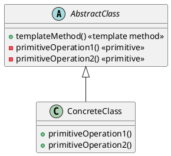
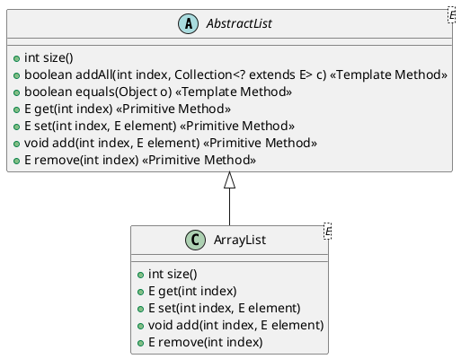
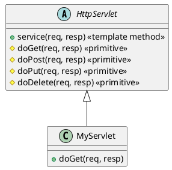
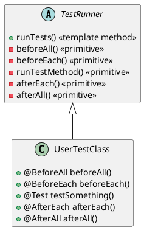

###### tags: `OOSE`

# Ch19 剛中帶柔： `Template Method` 

## 19.1 目的與動機 

> 定義一個演算法的骨幹，把部分的步驟延遲到子類別來決定。
>> To define the skeleton of an algorithm in an operation, deferring some steps to subclasses.

樣板樣式讓子類別重新定義一個演算法的部分細節，但不變更演算法的結構。整體演算法不變是「剛」，部分可以改是「柔」，所以說 `Template Method` 是一個剛中帶柔的方式。多半我們翻譯成樣板，或是樣板方法。


就像我們買了一間毛胚屋，大部分的架構都已經好了：你不需要去擔心電線的位置，馬桶如何連結，你所要考慮的是買怎麼的電燈或電器，選什麼牌子的馬桶，然後將它裝上去。一旦完成，「半成品」的毛胚屋就變成一個成品。


軟體的框架也是如此，框架定義好了固定的骨幹，例如一些複雜的資訊安全問題，或是一些企業規定的演算規則，你（應用程式開發者），只需要繼承這個框架，補充上部分的程式碼，程式就會在框架和應用程式中流動，完成所交辦的任務。這樣的好處是：應用程式開發者少去了很多框架的討論工作，公司也可以確保一定的品質。

[gugu- `Template Method`](https://refactoring.guru/design-patterns/template-method)

## 19.2 架構

### 架構




* `AbstractClass` 定義了一個高階操作 `templateMethod()`，它調用一系列步驟。
* `primitiveOperation1()` 和 `primitiveOperation2()` 是「基本操作」，由子類具體實作。
* `ConcreteClass` 實作這些 primitive operations。

---

### 參與者

| 類別/角色         | 負責內容                                                                   |
| ----------------- | -------------------------------------------------------------------------- |
| **AbstractClass** | 定義 `Template Method` 的結構骨架，並宣告（或實作部分）primitive methods。 |
| **ConcreteClass** | 實作 primitive methods，完成演算法的具體步驟。                             |
| **Client**        | 呼叫 `Template Method`，但不需要知道細節的子步驟實作方式。                 |

## 19.3 應用與實作

### 應用性

* 希望將演算法的共同部分集中在超類中，而將變化的部分延遲到子類中處理。
* 希望子類控制某些步驟，但不改變整體演算法流程。
* 系統需要控制演算法的執行順序，但允許步驟內容有所差異。

### 優點
- `Template Method` 是程式碼重用的基礎技巧。
- `Template Method` 實踐 IoC (Inversion of Control; 控制倒轉) 的設計原則。

### 實作考慮
- `Template Method` 必須宣告為 final, 不可被子類別覆蓋。
- `Template Method` 中的基礎方法（primitive operation）是否宣告為 protected? 如果有子類別呼叫的需求時可宣告為 protected。
- 一定要被覆蓋的基礎方法必須要宣告為抽象

### 程式樣板

```java==
abstract class AbsApp {
    public final void tm() {           // Template Method
        pm01();
        pm02();
        pm03();
    }

    abstract void pm01();              // Primitive Method
    abstract void pm02();              // Primitive Method
    abstract void pm03();              // Primitive Method
}

class App extends AbsApp {
    void pm01() {
        // ...
    }
    void pm02() {
        // ...
    }
    void pm03() {
        // ...
    }
}
```

使用方式：

```java
AbsApp app = new App();
app.tm();
```

## 19.4 範例

### 19.4.1 Open Document
```java=
class DocApp {
   // TEMPLATE METHOD
   final void openDocument (String name) { 
      if (!canOpenDocument(name)) {
          // cannot handle this document return;
      }
      Document doc = doCreateDocument(); 
      if (doc) {
          docs.addDocument(doc); 
          aboutToOpenDocument(doc); 
          doc.open();
          doc.doRead();
       } 
    }
    abstract boolean canOpenDocument(String); // PRIMITIVE METHOD
    abstract aboutToOpenDocument(Document); // PRIMITIVE METHOD
    abstract Document doCreateDocument(); // PRIMITIVE METHOD
}
```


### 19.4.2 Chess Game

設計一個通用的遊戲，`playOneGame()` 是一個 `Template Method`。

```java=
abstract class Game {
   protected int playersCount; 

   // TEMPLATE METHOD
   final void playOneGame(int playersCount) {
      this.playersCount = playersCount; 
      initializeGame();
      int j = 0;
      while (!endOfGame()) {
         makePlay(j);
         j = (j + 1) % playersCount; 
      }
      printWinner(); 
   }
   abstract void initializeGame(); // PRIMITIVE METHOD
   abstract void makePlay(int player); // PRIMITIVE METHOD
   abstract boolean endOfGame();  // PRIMITIVE METHOD
   abstract void printWinner();  // PRIMITIVE METHOD
}
```


大富翁 (`Monopoly`) 或是象棋遊戲 (`ChessGame`) 都繼承 Game, 修改了部分的程式碼。

```java=
class Monopoly extends Game { 
   void initializeGame() {
      // ... 
   }
   void makePlay(int player) { 
      // ...
   }
   boolean endOfGame() {
      // ... 
   }
   void printWinner() { 
      // ...
   } 
}

class ChessGame extends Game { 
   void initializeGame() {
      // ... 
   }
   void makePlay(int player) { 
      // ...
   }
   boolean endOfGame() {
      // ... 
   }
   void printWinner() { 
      // ...
   } 
}
```

### 19.4.3  ArrayList

在 Java 的集合框架中，`ArrayList` 是一個具體類別，而 `AbstractList` 是一個抽象類別，它們都屬於 `java.util` 套件。他們是 `Template Method` 的應用。

在 `AbstractList` 中，**許多公用方法（例如 `addAll()`, `equals()`, `removeRange()`, `indexOf()`, `lastIndexOf()` 等）是 Template Methods**，它們定義了操作的整體流程，但呼叫了其他方法（例如 `get(int index)`, `remove(int index)`），這些方法要由子類實作或覆寫。

舉例：

```java
public boolean addAll(int index, Collection<? extends E> c) {
    boolean modified = false;
    for (E e : c) {
        add(index++, e);  // 調用的是子類實作的 add(int, E)
        modified = true;
    }
    return modified;
}
```

* `addAll` 是 **template method**：定義了「逐個插入」的流程。
* 它呼叫了 `add(int, E)`，這是 **primitive method**，由子類（如 `ArrayList`）提供具體實作。


**Primitive Methods:**

這些通常是子類必須實作的方法（或至少是可以選擇性覆寫的方法）：

* `get(int index)`
* `set(int index, E element)`
* `add(int index, E element)`
* `remove(int index)`
* `size()`

這些方法在 `AbstractList` 中通常是 `abstract` 或只提供簡單的預設實作（如丟出例外），由 `ArrayList` 提供實作。

| 類別         | 範例方法                     | 角色                        |
| ------------ | ---------------------------- | --------------------------- |
| AbstractList | `addAll()`, `equals()`       | `Template Method`           |
| AbstractList | `add()`, `get()`, `set()` 等 | Primitive Method            |
| ArrayList    | 實作了 `get()`, `add()` 等   | Primitive Method 的具體實作 |



---

### 19.4.4 `HttpServlet`

**Template Method：** `service(HttpServletRequest req, HttpServletResponse resp)`

這個方法定義了 Servlet 接收 HTTP 請求時的主要處理流程，會依照請求方法（GET、POST、PUT 等）**自動分派給對應的方法**（例如 `doGet`, `doPost` 等）。

```java
protected void service(HttpServletRequest req, HttpServletResponse resp)
        throws ServletException, IOException {
    String method = req.getMethod();

    if (method.equals("GET")) {
        doGet(req, resp);   // 呼叫 primitive method
    } else if (method.equals("POST")) {
        doPost(req, resp);  // 呼叫 primitive method
    } // 其他類似
}
```

**Primitive Methods（由子類實作）**

* `doGet(HttpServletRequest req, HttpServletResponse resp)`
* `doPost(HttpServletRequest req, HttpServletResponse resp)`
* `doPut(HttpServletRequest req, HttpServletResponse resp)`
* `doDelete(HttpServletRequest req, HttpServletResponse resp)`

開發者只需選擇性地覆寫其中一個，例如：

```java
public class MyServlet extends HttpServlet {
    @Override
    protected void doGet(HttpServletRequest req, HttpServletResponse resp)
            throws ServletException, IOException {
        resp.getWriter().write("Hello GET");
    }
}
```
架構圖：



### 19.4.5 JUnit

JUnit 的 **Life Cycle（生命週期）** 也是經典的 **Template Method 設計模式**應用案例！

JUnit 的運作流程是由 JUnit 框架本身（例如 `Runner` 或 `TestCase` 類別）控制執行流程（template method），而開發者只需實作特定步驟（primitive method），例如測試方法、`@BeforeEach`、`@AfterEach` 等。

JUnit 控制執行順序：

```text
→ BeforeAll → BeforeEach → Test Method → AfterEach → AfterAll
```

這整個流程是由 JUnit 的「template method」定義的，而測試開發者只需實作裡面的「步驟」。

| `Template Method` 模式角色 | JUnit 中的對應             | 說明                           |
| -------------------------- | -------------------------- | ------------------------------ |
| **AbstractClass**          | JUnit 測試執行器（Runner） | 定義測試生命週期的固定流程順序 |
| **templateMethod()**       | 測試執行流程               | 控制整體的呼叫順序（如下）     |
| **Primitive Methods**      | 開發者實作的方法           | 如 `@BeforeEach`、`@Test` 等   |
| **ConcreteClass**          | 使用者寫的測試類別         | 實作具體測試步驟               |




實際範例（JUnit 5）

```java
class MyTest {

    @BeforeAll
    static void setupAll() {
        System.out.println("Before all tests");
    }

    @BeforeEach
    void setup() {
        System.out.println("Before each test");
    }

    @Test
    void testExample() {
        System.out.println("Running test...");
    }

    @AfterEach
    void teardown() {
        System.out.println("After each test");
    }

    @AfterAll
    static void teardownAll() {
        System.out.println("After all tests");
    }
}
```

## 19.5 比較

 `Template Method` 是「框架」的基礎。

> * 比較 `Template Method` 和 `factory method` 的異同
> * 比較 `Template Method` 和 `strategy` 的異同

## 19.CHK

1. `Template Method` 的目的為？
   A) 把兩個介面不相容的物件可以溝通合作
   B) 把物件的生成延遲到子類別
   C) 讓一個物件可以有很多的觀察者，物件變動時，其觀察者物件可以跟著變動
   D) 定義一個演算法的架構，讓細部的做法延遲到子類別做決定

2. 在 `Template Method` 中，`Template Method` 通常宣告為？
   A) final
   B) static
   C) interface
   D) generic type

3. `Template Method` 運用的技巧為？
   A) 把要延遲的程式碼定義為 final，讓子類別去定義
   B) 把要延遲的程式碼包裝成方法，讓子類別去定義
   C) 把要延遲的程式碼定義為 final，不讓子類別修改

4. `Template Method` 和 Factory Method 有點類似，以下哪一項正確？
   A) 前者會生成演算法，後者會生成物件
   B) 前者運用多型，後者運用委託
   C) 兩者都是延遲方法到子類別，前者延遲某方法的細部方法，後者延遲物件生成方法

5. 以下程式哪一個方法可能是 `Template Method`？
   A) `m1()`
   B) `m2()`
   C) `m3()`
   D) `m4()`

```java
class A {
    int a;
    public void m1() {
       ...
       m2();
       ... m3();
       ...
    }
    public abstract void m2();
    public int m3() { return a; }
    public final int m4() { return a*a; }
}
```

---

**答案與簡要說明：**

1. D — `Template Method` 定義演算法骨架，細節交給子類別決定
2. A — 通常設為 final，以避免子類別改變流程順序
3. B — 可變部分設計成可覆寫方法讓子類別提供實作
4. C — 兩者都是延遲到子類別，不同在演算法 vs 物件生成
5. A — m1 是固定流程，包含對抽象方法的呼叫，是 `Template Method`

## 19.EX

### 19.ex01 sort
應用 `Arrays.sort(Object[], Comparator)`  把一群學生（Student）依據他們的身高做排序。討論：`Arrays.sort` 有應用到 Template 樣式嗎？有什麼好處？

### 19.ex02 playGame
某一類遊戲的演法算法大概的邏輯如下。其中第 a, c, f 步驟在每個遊戲略有不同，由遊戲本身定義。請用 `Template Method` 定義 `playGame()` 方法。
    a. 初始化遊戲
    b. 等待玩家加入
    c. 開始玩
    d. 第三步驟一直重複，直到分出勝負
    e. 印出勝利者
    f. 印出遊戲資訊，例如遊戲時間

```java=
public ?1 void playGame() {
   ?
}
```

### 19.ex03 Coffee
煮咖啡囉！咖啡沖泡法：1. 把水煮沸（boilWater）; 2. 用沸水沖泡咖啡（brewCoffeeGrinds）; 3. 把咖啡倒到杯子（pourInCup）; 4. 加糖和奶精（addSugarAndMilk）。茶沖泡法：1. 把水煮沸（）; 2. 用沸水浸泡茶葉（steerTeaBag）; 3. 把茶倒到杯子（pourInCup）; 4. 加檸檬（addLemon）。請利用 `Template Method` 達到重用性的設計。