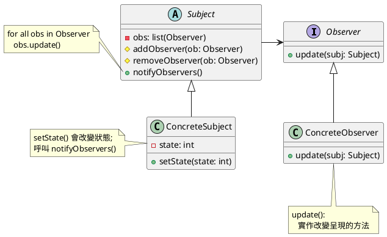

###### tags: `OOSE`

# Ch20 眾觀其變：Observer

## 20.1 目的與動機

> 定義一個「一對多」的相依關係，使得當「一」的物件狀態改變時，所有相依於「一」的「多」物件會被通知到並作適當的修改。

> *Define a one-to-many dependency between objects so that when one changes state, all its dependents are notified and updated automatically*

**動機**

- 當股價變動時，跟著呼叫介面物件做修改。股價的資料屬於資料物件（model），介面物件屬於 view。資料物件直接呼叫介面物件是一種不好的設計，因為介面物件的變動性大，資料物件會因為介面物件的改變而需要做改變。
- 介面物件每隔一段時間去讀取資料物件。問題是：我們無法知道多久該去讀取一次。

### 方案1: Polling 

讓 Viewer 定期的去取得資料的狀態，然後更新。這樣的問題是：我們該多久去取一次？1 秒？10 秒？時間過於密集可能會浪費頻寬、過於鬆散可能取得不正確的資料。

### 方案2: 個別通知

```java=
class Stock {
    price ...;
    public priceChange(int newPrice) {
       this.price = newPrice;

       //三個 view 三個不同的方法。耦合度高，不好的設計
       view1.refesh();
       view2.update();
       view3.reload();
    }
}
```

**方案2** 是直覺的方法，當狀態改變時就叫每一個呈現去修改，但呈現是變動的，不該企業邏輯放在一起。如果我們增加一個新的介面、更換成 Android 或是 HTML 的介面是不是企業邏輯也要跟著修改呢？

如何解決這個問題呢？答案是 `Observer` 設計模式。在 `Observer` 中，像股價等資料通常被稱主體(`Subject`)或被觀察者（`Observable`），而呈現方式則稱為觀察者(`Observer`)。

### 應用時機
- 當後端資料有所變更，有必須即時的更新前端資料呈現。
- 當一個事務有兩個角度，其中一個角度相依於另一個。

## 20.2 結構與方法

<!--  -->
###  20.2.1 結構


FIG: `Observer` Structure

### 20.2.2 參與者
- `Subject` (`Observable`)：定義一個有多個觀察者的資料的基本資料型態與介面。其中的`addObserver()`表示加入一個新的 `observer`，而 `notifyObserver()` 表示要通知所有與其相關的觀察者。
-  `ConcreteSubject` (`ConcreteObservable`)：實際的被觀察者。
-  `Observer`：定義一個觀察者的基本結構與介面，其中的update()給觀察者收到被觀察者資料異動訊息時的處理程序。
-  `ConcreteObserver`：實際的觀察者。

### 20.2.3  程式樣板

Java 已經針對這個設計樣式設計了一個API, 其中 [Observable](https://docs.oracle.com/javase/7/docs/api/java/util/Observable.html) 相對於 Subject, [Observer](\href{https://docs.oracle.com/javase/7/docs/api/java/util/Observer.html) 則名稱不變。

Java 從第九版以後取消了 `Observable` 和 `Observer`, 所以以下程式需要下載 JDK 8 來執行。

```java
package observer;

import java.util.Observable;

public class ObserverTemplate {

  public static void main(String[] args) {
     Subject s = new Subject();

     View1 v1 = new View1();
     View2 v2 = new View2();
     s.addObserver(v1);
     s.addObserver(v2);
  }
}

class Subject extends java.util.Observable {
   int data;

   public Subject() {
     data = 0;
   }

   public void setData(int newValue) {
     data = newValue;
     this.setChanged();
     this.notifyObservers();
   }
}

class View1 implements java.util.Observer {
   public void update(Observable arg0, Object arg1) {
      // update the view
   }
}

class View2 implements java.util.Observer {
   public void update(Observable o, Object arg) {
    // update the view
}
}
```

**優點**

分離了資料模組與呈現模組使得溝通能夠更容易廣泛的被應用，當資料變更不需觀察者做出更新動作才能更新，保持資料呈現的一致性。

## 20.3 範例

### 20.3.1 `Observable` 的應用

```java
// SUBJECT
public class Fruit extends Observable {
    private String name;
    private float price;

    public Fruit(String name, float price) {
       this.name = name;
       this.price = price;
       System.out.println("Fruit created: " + name + " at " + price);
    }

    public String getName() {return name;}
    public float getPrice() {return price;}

    public void setPrice(float price) { //SETSTATE
       this.price = price;
       setChanged();
       notifyObservers(new Float(price)); //NOTIFYOBSERVER()
    }
 }
```

為何需要先 `setChanged()` 再呼叫 `notifyObserver()`? 因為 `notifyObserver` 是 `public` 的，外部物件可以呼叫 `notifyObserver`，但物件的狀態可能沒有變化。`notifyObserver()` 會先檢查是否 `hasChanged()`, 如果有才會呼叫 `update()`。`Fruit` 自己可以確定狀態改變時執行 `setChanged()` 以保證 `update()` 的執行。`notifyObservers()` 內部在執行完 `update()` 後也會呼叫 `clearChanged()`。有時候我們會變更一連串的狀態後才會 `setChanged()`, 允許通知其他的 `Observers`。

接著來看看 `Observer` 這一端：

```java=
public class Monkey implements `Observer` {
    float price;
    public void update(Observable obj, Object newValue) {
       if (newValue instanceof Float) {
           price = ((Float)newValue).floatValue();
           System.out.println("水果價格變成" + price);
        }
     }
}
```

`WineMaker` 也關心價格波動，是另一個觀察者，當價格有變動時，它就會有所反應。

```java
public class WineMaker implements Observer {
    float originalPrice;
    public void update(Observable obj, Object newValue) {
       if (newValue instanceof Float) {
           price = ((Float)newValue).floatValue();
		   if ( (price-originalPrice)/price < -0.1)
		      System.out.println("Can make wine");
		   else
		      System.out.println("too expensive");
        }
     }
}
```

來看看主程式

```java
public class TestObservers {
   public static void main(String args[]) {
      // Create the Subject and Observers.
      Fruit s = new Fruit("Grape", 1.29f);
      Monkey jj = new Monkey();
      WineMaker wm = new WineMaker();

      // Add those Observers!
      s.addObserver(jj);
      s.addObserver(wm);

      //make changes to the Subject.
      s.setPrice(4.57f);
      s.setPrice(9.22f);
   }
}
```

API 中 `Observerable` 是如何設計的？

```java
public class Observable {
   private boolean changed = false;
   private Vector obs;

   public Observable() {
      obs = new Vector();
   }
   
   public synchronized void addObserver(Observer o) {
      if (o == null)  throw new NullPointerException();
      if (!obs.contains(o)) {
          obs.addElement(o);
      }
   }
}
```

`notifyObservers()` 的程式碼：

```java
public void notifyObservers(Object newValue) {
   Object[] arrLocal;
   
   synchronized (this) {
       if (!changed)
          return;
       arrLocal = obs.toArray();
       clearChanged();
    }
 
    for (int i = arrLocal.length-1; i>=0; i--)
        ((Observer)arrLocal[i]).update(this, newValue);
}
```

### 20.3.2 委託的應用 

如果 `ConcreteSubject` 已經有繼承了另一個類別了，無法繼承 `Observable` 那該怎麼辦？我們可以用委託的方式把 `observable` 委託給 `delegatedObservable`。

```java
// 水果是植物
public class Fruit extends Plant {
    private String name;
    private float price;
    private DelegatedOBS observable;

    public Fruit(String name, float price) {
       this.name = name;
       this.price = price;
       System.out.println("Fruit created: " + name + " at " + price);
       observable = new DelegatedOBS();
    }

    public String getName() {return name;}
    public float getPrice() {return price;}

    public void setPrice(float price) {
       this.price = price;
       observable.setChanged();
       observable.notifyObservers(new Float(price));
    }
    public Observable getObservable() {
       return observable;
    }
}    
```

`DelegatedOBS` 是一個 `Observable` 的子類別：

```java=
// A subclass of Observable that allows delegation.
public class DelegatedOBS extends Observable {
    // from PROTECTED to PUBLIC
    public void clearChanged() {
        super.clearChanged();
    }

    // from PROTECTED to PUBLIC
    public void setChanged() {
        super.setChanged();
    }
}
```

大家會不會覺得奇怪，為什麼不直接委給 `Observable`，而是在宣告一個 `DelegatedOBS`, 然後委給 `DelegatedOBS`？原來 `Observable.setChanged()` 被設定為 `protected`，如果沒有透過繼承是無法呼叫的，因此我們將之繼承後再開放為 `public`。

> 想一下：為什麼 setChanged() 要宣告成 protected? 

```java
public class TestObservers2 {
   public static void main(String args[]) {
      // Create the Subject and Observers.
      Fruit s = new Fruit("Grape", 1.29f);
      Monkey jj = new Monkey();
      WineMaker wm = new WineMaker();

      // Add those Observers!
      s.getObservable().addObserver(jj);
      s.getObservable().addObserver(wm);

       //make changes to the Subject.
       s.setPrice(4.57f);
       s.setPrice(9.22f);
    }
 }
```


FIG: `Observer` with delegation

#### 私有漏洞 

各位可以看到第 9-10 行的 `s.getObservable().addObserver(nameObs)`，先透過 `getObservable()` 獲得 `Observable` 物件，再透過它來作 `addObserver` 的動作。這樣的缺點是外界的物件很容易取得 `Observable` 的參考，就有可能拿著這個參考胡作非為（例如 `deleteObserver()`）。為了避免這種狀況，我們新增 `addObserver()` 這個方法，在裡面進行委託；並且移除 `getObservable()` 的方法，避免私有漏洞的可能。

```java
public class Fruit extends Plant {
   ...
   public void addObserver(Observer o) {
       observable.addObserver(o);
   }
   ...
}
```

### 20.3.3 `ActionListener`

JAVA 的 event model 與 Observer 的架構類似。

- AbstractButton => Observable; fireActionListener() => notifyObserver()
- ActionListener => Observer; actionPerformed() => update()

其中的 `AbstractButton` 就相當於 `Observer` 中的 `Observable`，而向它註冊的就是那些監聽事件發生的類別，也就是實作 `ActionListener` 的物件 (Event Handler)。由於 `JButton` 本身已是 `AbstractButton` 的子類別，我們只要直接在 `JButton` 的實作中加入事件監聽者即可：

```java=
public class TestEventModel extends JFrame{
     private JButton b1;
     public TestEventModel() {
        b1 =  new JButton("Button");
        getContentPane().add(b1);

        //相當於 ADDOBSERVER()
        b1.addActionListener(new Listener1());
        b1.addActionListener(new Listener2());
        ...
     }
}

// OBSERVER
class Listener1 implements ActionListener {
    // UPDATE()
    public void actionPerformed(ActionEvent e) {
        System.out.println("Event happen");
    }
}

// OBSERVER
class Listener2 implements ActionListener {
    // UPDATE()
    public void actionPerformed(ActionEvent e) {
        System.out.println("Hello world");
    }
}
```

`AbstractButton` 內的 `fireActionPerformed()` 相當於 `Observable` 內的 `notifyObservers()`，但我們不需要去呼叫它，因為當我們按下 `Button` 時會直接呼叫 `fireActionPerformed()`，進而呼叫所有的 `ActionListener` 內的 `actionPerformed()`。

有時候程式不是很複雜時，事件的發生與處理在同一個類別內，所以常可以看到這樣的程式碼：

```java=
class TestEventModel2 extends JFrame implement ActionListener {
   ...
   b1.addActionListener(this);
   public void actionPerformed(ActionEvent e){
      ...
   }
}
```

此時的 `TestEventModel2` 同時兼具了 event source 與 event listener 的功能，亦即觀察者與被觀察者的雙重身分。

## 20.4 Java Consumer

儘管 `Observable` 和 `Observer` 提供了一個簡單的方式來實現觀察者模式，但是這些類存在一些限制，因此不再建議使用。`Observable` 是一個具體的類別，而不是一個介面。使用起來並不方便。現在更常用的方法是使用介面來實現觀察者模式，而不是繼承 `Observable` 類。例如，你可以使用 Java 8 引入的函數式介面 `Consumer` 來定義觀察者的處理邏輯。

在 Java 中，`Consumer<T>` 是一個函式式介面（functional interface），其定義如下：

```java
@FunctionalInterface
public interface Consumer<T> {
    void accept(T t);
}
```

這個介面接收一個類型為 `T` 的參數，並執行某些動作，沒有回傳值。你可以使用 `Consumer<T>` 來代表每一個「觀察者」的回呼函式（callback function）。假設我們有一個氣象站（WeatherStation）會通知溫度變化，觀察者會收到新的溫度資料。

步驟 1：建立 Subject

```java
import java.util.ArrayList;
import java.util.List;
import java.util.function.Consumer;

public class WeatherStation {
    private List<Consumer<Double>> observers = new ArrayList<>();

    public void addObserver(Consumer<Double> observer) {
        observers.add(observer);
    }

    public void removeObserver(Consumer<Double> observer) {
        observers.remove(observer);
    }

    public void setTemperature(double temperature) {
        System.out.println("Temperature changed to: " + temperature);
        notifyObservers(temperature);
    }

    private void notifyObservers(double temperature) {
        for (Consumer<Double> observer : observers) {
            observer.accept(temperature);
        }
    }
}
```

步驟 2：加入觀察者（Observers）

```java
public class Main {
    public static void main(String[] args) {
        WeatherStation station = new WeatherStation();

        // 加入觀察者 1：印出溫度
        station.addObserver(temp -> System.out.println("Observer A: Temperature is " + temp));

        // 加入觀察者 2：根據溫度做反應
        station.addObserver(temp -> {
            if (temp > 30) {
                System.out.println("Observer B: It's too hot!");
            }
        });

        // 模擬溫度變化
        station.setTemperature(28.5);
        station.setTemperature(35.0);
    }
}
```

## 20.CHK

1. `Observer` 設計樣式主要有兩個物件：`Subject` 與 `Observer`: 
     - 一個 `Subject`，會有多個 `Observer` 與之關聯
     - 一個 `Observer`，會有多個 `Subject` 與之關聯
     - 一個 `Observer` 只能對應一個 `Subject` 
     - `Subject` 與 `Observer` 之間的關聯式多對多的關聯

2. 關於 `Observer` 樣式，何者為真：
    - `Observer` 變動時，`Subject` 被通知 
    - `Observer` 定時查詢 `Subject` 狀態 
    - `Subject` 定期查詢 `Observer` 狀態 
    - `Subject` 變動時，`Observer` 會被通知     

3. java API  中實踐 Subject 的類別為 
    - `Object`
    - `Subject`
    - `Observable`
    - `Observer` 
    
4. Java 的 Swing 架構使用 `Observer`，其中 `ActionListener` 相當於 `Observer` 樣式中的？
    - `Subject `
    - `Observer` 
    - `Concrete Observer`
    - `Concrete Subject`

5. 同上，像 `JButton` 這一類的元件，相當於 `Observer` 樣式的？
    - `Subject`
    - `Observer` 
    - `Concrete Observer` 
    - `Concrete Subject`

6. 請寫出 `java.util.Observer` 此介面。注意參數的正確。

```java=
interface Observer {
  ?
}
```

7. 以下 `View1` 是一個 `Observer`, `?1` 和 `?2` 為何

```java=
class View1 implements Observer {
  public void update(?1 obs, ?2 obj) {
    ...
  }
}
```

8. `Stock` 是一個 `Subject`, 價格改變時會通知所有的 `observer`, 以下 `?` 為何

```java=
class Stock extends Observable {
  public void increasePrice() { 
    price++;
    setChanged();
    ?
  }
}
```

## 20.EX

### 20.ex01a Stock
股票（`Stock`）物件內包含上次價格、現價與成交量三個屬性，現價與成交量每個2秒變動一次（請隨機產生在 7%, 10% 內的價格與成交量），請應用 `Observer` 設計樣式設計以下三個呈現：
   - `CurrentPriceBoard`: 呈現昨日價格 (Y)、目前價格 (C)、及波動百分比 (`(C-Y)/C`)。
   - `AmountBoard`: 呈現現價、成交量。
   - `GreenRedBoard`: 最近三次的價格，如果連三漲，背景設為綠色，如果連三跌，背景設為紅色。否則維持原色（白色）。
	
### 20.ex01b Stock    
延續上一題，
   1. 不要透過繼承 `Observable` 的方式來實踐 `Observer` 設計樣式。透過委託的方式交給 `Observable` 來間接實踐 `Observable` 
   2. 不用 `java.util.Observable`, 將 `Observable` 的功能直接寫在 `Stock` 中，並自己建立一個 `Observer` 的介面。

### 20.ex02 `ChessGame`
假設你設計一個象棋遊戲，遊戲狀態有 `waiting`, `started`, `end` 三個狀態。當狀態改變時會傳給多個介面，如 `PlayerView`, `CustomerView`, `AllGameStatusView` 等三個介面做呈現。
   - 請透過 java 的 `Observable` 來設計此問題。
   - 若 `ChessGame` 本身已經繼承 `Game`, 無法在繼承 `Observable`, 該怎麼辦?

### 20.ex03 Fruit
將 Fruit 的例子，用 `Consumer` 實踐。

<!-- #### 簡答

- as below:
    ```java=
       public void update(Observable obs, Object obj);
    ```
- update()
- as below:
    ```java=
    public void update(Observable obs, Object obj);
    ```
- Observable 只有面對一個介面：Observer，所有的物件都被抽象成 Observer 所以可以降低耦合度。
- 透過委託給一個 Observable 物件的方式來達成。 
- 因為 Observable 內的 setChanged() 是 protected, 外部不能直接呼叫。 
- as below:

```java=
package observer.stock;

import java.awt.GridLayout;
import java.awt.event.ActionEvent;
import java.awt.event.ActionListener;
import java.util.Observable;
import java.util.Random;
import javax.swing.JButton;
import javax.swing.JFrame;
import javax.swing.JLabel;
import javax.swing.JPanel;
import javax.swing.JTextField;

public class ObserverStockDemo extends JFrame implements ActionListener {
	Stock s;
	CurrentPriceBoard priceBoard;

	public ObserverStockDemo() {
		super();

		s = new Stock(100);
		priceBoard = new CurrentPriceBoard();
		s.addObserver(priceBoard);

		this.setLayout(new GridLayout(2, 2));
		add(this.priceBoard);
		JButton startBtn = new JButton("Change");
		startBtn.addActionListener(this);
		add(startBtn);
		setSize(300, 200);
		setDefaultCloseOperation(JFrame.EXIT_ON_CLOSE);
	}

	public void actionPerformed(ActionEvent e) {
		Random r = new Random();
		double diff = (r.nextDouble() * 0.07);
		boolean positive = r.nextBoolean();
		double newPrice;
		if (positive)
			newPrice = s.getPrice() * (1.0 + diff);
		else
			newPrice = s.getPrice() * (1.0 - diff);
		s.setPrice(Math.round(newPrice));
	}

	public static void main(String[] args) {
		ObserverStockDemo demo = new ObserverStockDemo();
		demo.setVisible(true);
	}

}

class Stock extends java.util.Observable {
	double yesdayPrice;
	double currentPrice;
	int currentAmount;

	public Stock(int yesterday) {
		this.yesdayPrice = yesterday;
		this.currentPrice = this.yesdayPrice;
		this.setChanged();
		this.notifyObservers();
	}

	void setPrice(double p) {
		this.currentPrice = p;
		this.setChanged();
		this.notifyObservers();
	}

	double getPrice() {
		return this.currentPrice;
	}

	void setAmount(int a) {
		this.currentAmount = a;
		this.setChanged();
		this.notifyObservers();
	}
}

class CurrentPriceBoard extends JPanel implements java.util.Observer {
	JTextField price = new JTextField(10);

	public CurrentPriceBoard() {
		super();
		add(new JLabel("Current price"));
		add(price);
	}

	public void update(Observable arg0, Object arg1) {
		double p = ((Stock) arg0).getPrice();
		price.setText(Double.toString(p));
	}
}
``` -->