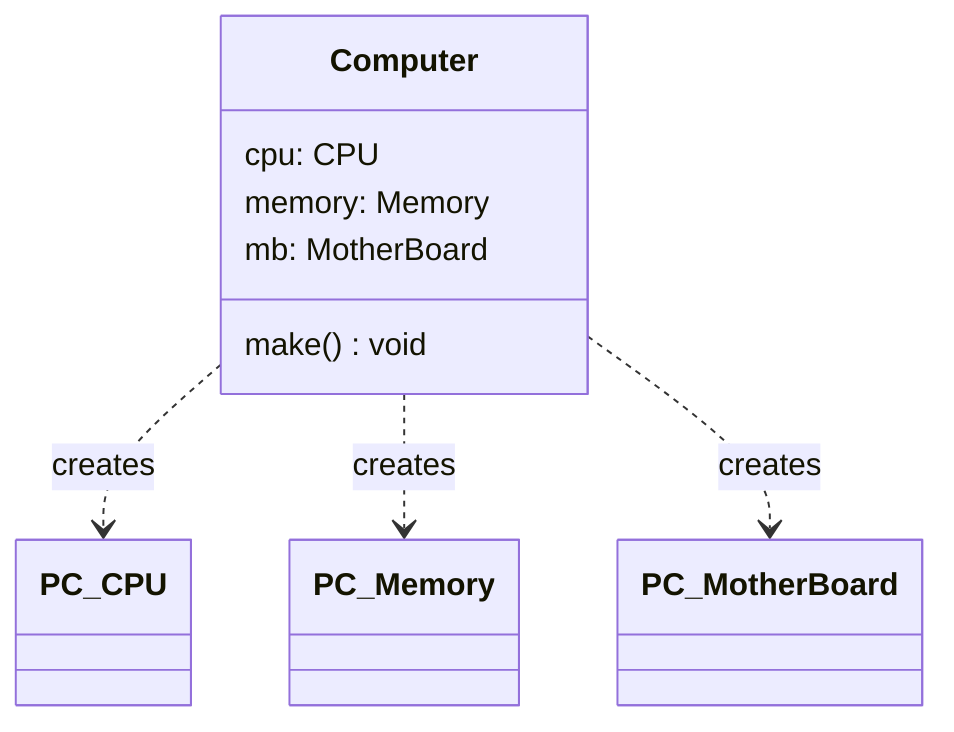
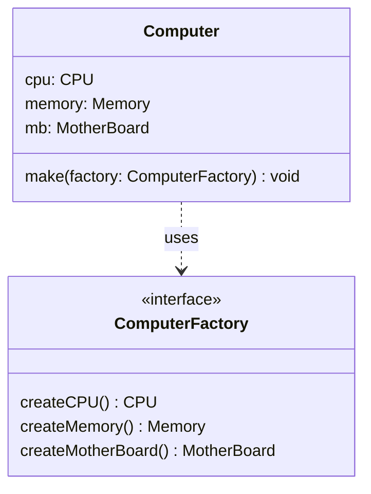
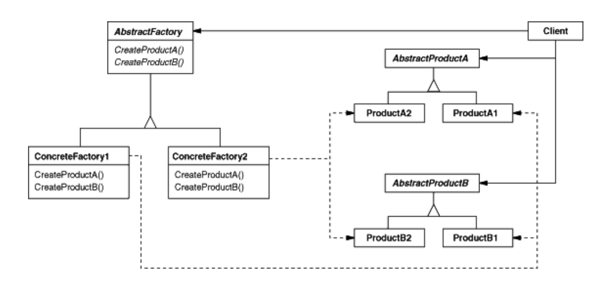
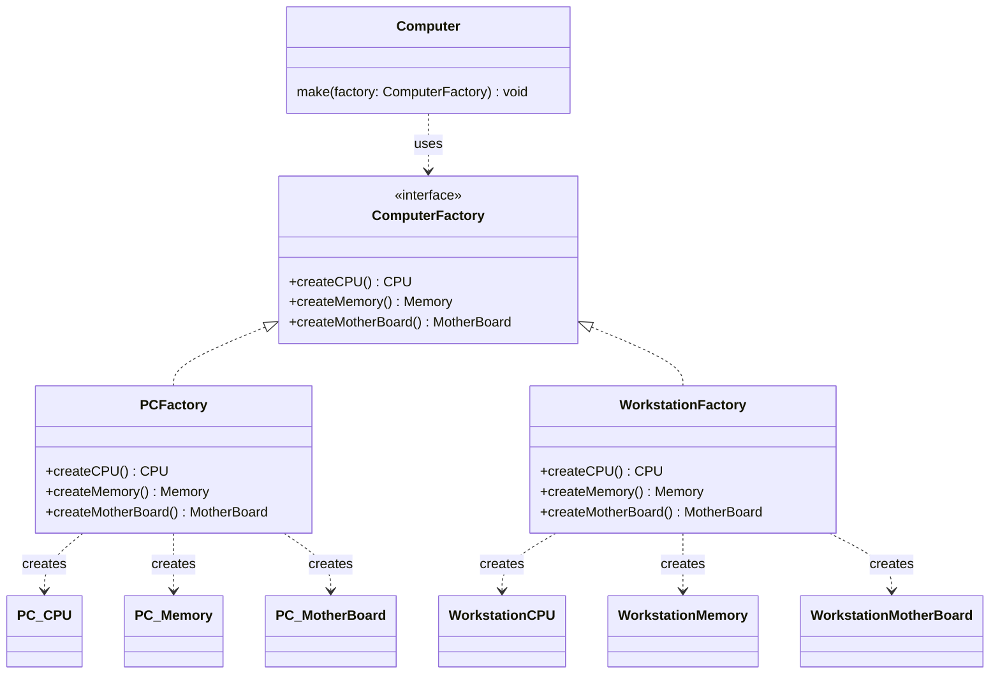
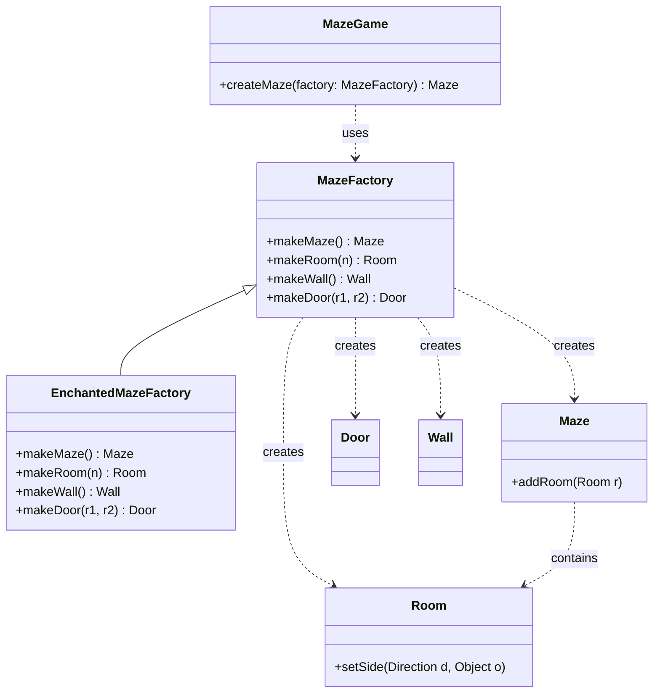

# Ch12 一式多款：Abstract Factory

## 12.1 目的與動機

> 提供一個介面物件以建立一群相關的物件，但卻不明確的指明這些物件的所屬類別，用以增加建立這些物件時的彈性。
>> Provide an interface for creating families of related or dependent objects without specifying their concrete classes.

### 12.1.1 動機

考慮一個 `Computer` 的物件在運作的時候需要用到 `CPU`、`Memory`、`MotherBoard` 等零件物件。如果我們在方法 `make()` 中產生這些零件物件，如下:

```java
class Computer {
   void make() {
      cpu = new PC_CPU();
      memory = new PC_Memory();
      mb = new PC_MotherBoard();
   }
}
```




則日後 `Computer` 物件想建立不同型態的零件物件(例如工作站 `CPU`、工作站 `Memory`、工作站主機板)時，則必須修改 `make()` 方法如下：

```java
cpu = new WorkStationCPU();
memory = new WorkStationMemory();
mb = new WorkStationMainBoard();
```
這樣的缺點是如果我們每一次有新的電腦類別產生時就必須修改程式(`make()`)一次。我們可以將生成這一群零件物件的的動作抽象為一個**工廠類別**，當日後有新的零件物件產出時，**只要擴充這個工廠類別即可，不需要修改原程式的程式碼**。




### 12.1.2 應用時機

- 當系統的目標是生產具有許多類似的物件時，又有動態配置產品的需求時。
- 當所有生產的產品物件有一種家族系列的關係時（family of product）。

## 12.2 結構與方法




### 12.2.1 結構

抽象生成工廠的特色是系統可以拆解分成幾個家族，每個家族內有一些相近的成員類別。上圖為抽象生成工廠的架構圖，其中 `Factory1` 與 `Factory2` 為兩個不同的家族，每個家族在運作時，都會用到 `ProductA` 與 `ProductB` 等成員物件，但前者會用到 `ProductA1` 與 `ProductB1`，而後者會用到 `ProductA2` 與 `ProductB2`。

### 12.2.2 參與者

  - 抽象工廠(`AbstractFactory`)：宣告一個介面，宣告生成零件物件的方法。
  - 實體工廠(`ConcreteFactory`)：實際負責生產的物件。一個實體工廠負責生成一個家族的所有零件物件。
  - 抽象產品(`AbstractProduct`)：宣告某項零件物件的共同性質。
  - 實體產品(`ConcreteProduct`)：實際存在的零件類別。
  - 使用者(`Client`)：使用者。實際需要遇到抽象工廠所產生的零件物件的物件。

### 12.2.3 程式樣板


[src/AbstractFactoryTemplate.java](src/AbstractFactoryTemplate.java) (見 `Main` 與 `Client` 類別)


### 12.2.4 效益

- **`DIP` 原則**。`Client` 只會看到抽象的物件 `AbstractProductA`, `AbstractProductB`, `AbstractFactory` 等類別，並不會看到比較低階的 `ProductA2`, `ProductB1` 等物件，這大大的降低了 client 與這些物件的耦合力（coupling）。這也體現了「相依倒轉原則（Dependency Inversion Principle; DIP）」。
- **`OCP` 原則**。當我們有新的一組產品被開發出來，只需要透過繼承產生 `ConcreteFactory3`, `ProductA3`, `ProductB3` 即可，不需要修改 `Client` 中的程式碼。
- 抽象生成工廠最大的好處在於簡化家族間的切換。當系統想要使用某個家族類別時，只要傳入該家族類別的生成工廠即可，整個家族類別所需要的成員類別可以依序建立以供使用。比起 `Factory Method` 將生產只是包裝成一個方法，在 `Abstract Factory` 中，則是將生產包裝成一個一個的類別，更能夠表示出一個工廠生產產品的特性。

## 12.2.5 Read more

[gugu web site](https://refactoring.guru/design-patterns/abstract-factory)

## 12.3 範例

抽象工廠模式（Abstract Factory）在軟體設計中有許多經典應用。以下我們透過不同層次的範例來深入理解。

### 12.3.1 電腦工廠

[src/ComputerFactorySample.java](src/ComputerFactorySample.java)

請注意 `Workstation` 的各零件是都是 `Computer` 的子類別

```java
class WorkstationCPU extends CPU {... }
class WorkstationMemory extends Memory {...}
class WorkstationMotherBoard extends MotherBoard {...}
```	

當我們想要生產 workstation 時，只要帶入 `WorkstationFactory` 就好了：

```java
ComputerFactory factory = new WorkstationFactory();
computer.createComputer(factory);
```

如果要生產 PC，則帶入預設的 `ComputerFactory`;

```java
ComputerFactory factory = new ComputerFactory();
computer.createComputer(factory);
```



### 12.3.2 迷宮

首先我們以 Gamma 一書所提的迷宮程式來做介紹，在之前我們用 `Factory Method` 的方法去製作另一間 `EnchantedRoom`，`EnchantedRoom` 本身必須要有 `EnchantedRoom` 必須的 `Wall` 和 `Door`。但是當我們希望能夠動態搭配 `Wall` 和 `Door`，這時候 `Factory Method` 所提供的便不夠了，我們可以改用 `Abstract Factory` 來解決這個問題。

首先我們必須宣告一個 `MazeFactory`，負責去宣告 `makeMaze()`、`makeRoom()`、`makeWall()`、`makeDoor()` 等操作方法的介面：

[src/MazeFactorySample.java](src/MazeFactorySample.java)

然後我們製作一個 `MazeGame` 負責去做一個主要操作的描述：

[src/MazeFactorySample.java](src/MazeFactorySample.java) (見 `MazeGame` 類別)

上述的程式應用了『包含』的關係來連接 `MazeGame` 和 `MazeFactory`。我們也可以把 `MazeFactory` 當成參數傳到 `MazeGame` 中，如下：

```java
class MazeGame {
   ...
   public Maze createMaze(MazeFactory f) {
      ...
   }
}
```

除了 `MazeFactory` 外，我們亦做了一個 `EnchantedMazeFactory` 來表示出動態產生的結果。

[src/MazeFactorySample.java](src/MazeFactorySample.java) (見 `EnchantedMazeFactory` 類別)

在這個系統的設計中，也許大家發現了一個奇怪的地方，也就是 `MazeFactory` 為何不是抽象的，不是應該抽像一個 `MazeFactory`，讓各種 `Maze` 的實際生成工廠去引用嗎？在這裡的 `MazeFactory` 其實是扮演了兩個角色，本身是抽象工廠，也同時是負責實際生產的工廠。

對照抽象工廠的架構，程式中的 `MazeFactory` 相當於 `AbstractFactory`，其他的對應關係如下：

- `AbstractFactory`：`MazeFactory`
- `ConcreteFactory`：`EnchantedMazeFactory`，`MazeFactory`
- `AbstractProduct`：此例中沒有
- `ConcreteProduct`：`Maze`、`Room`、`Wall`、`Door`
- `Client`：`MazeGame`

[src/MazeFactorySample.java](src/MazeFactorySample.java)



### 12.3.3 熱區與冰區

熱區（Hot spot）表示程式中會經常變動（擴充）的地方，冰區（frozen spot）則是不會變動的地方，也就是可以被重用（reuse）的地方。以上述的例子來看，冰區會是 `MazeGame.createMaze()` 這個方法，也就是說：生成的物件與他們之間關係的建立是不變。

熱區則是 建立 factory 物件的主程式了。

[src/MazeFactorySample.java](src/MazeFactorySample.java) (見 `GameDemo` 類別)

### 12.3.4 Java API 與框架中的應用

抽象工廠模式在許多成熟的軟體框架中都有廣泛應用，特別是在需要處理「跨平台」或「切換不同實作家族」的情境下：

1. **Java AWT `Toolkit`**：
   `java.awt.Toolkit` 是一個經典的抽象工廠。它提供了一個介面，用來連結 AWT 元件（如 `Button`、`TextField`）到不同作業系統（Windows、macOS、Linux）的本地實作。當你在不同平台上執行 Java 程式時，系統會自動切換到對應的具體工廠實作。

2. **XML 解析器 (`DocumentBuilderFactory`)**：
   在處理 XML 時，`javax.xml.parsers.DocumentBuilderFactory` 允許程式在不指定具體解析類別的情況下，獲取能產生 `DocumentBuilder` 的工廠。這使得開發者可以輕鬆切換不同的 XML 解析引擎（例如 Xerces 或內建解析器）。

3. **Spring 框架中的 `BeanFactory`**：
   Spring 的 `BeanFactory` 容器負責管理並生產各類型的物件 (Beans)。雖然它整合了多種設計模式，但其核心能力——「透過統一介面獲取一系列相關物件而不暴露其具體類別」——正是抽象工廠模式的體現。

4. **資料庫驅動 (JDBC)**：
   JDBC 的 `Connection` 物件針對不同的資料庫（MySQL、Oracle、PostgreSQL）能生產出一系列相互關聯且相容的產品（如 `Statement`、`PreparedStatement`），這也具備了抽象工廠為特定「產品族」提供生產介面的特徵。

### 12.3.5 比較

在 `Factory Method` 中，我們介紹工廠方法將「物件的生成封裝成一個方法」，透過覆寫，我們可以在不需要修改程式碼的情況下讓系統使用新的類別。相較於 `Factory Method`, `Abstract Factory` 則是將「物件的生成封裝成一個類別」。

## 12.4 隨堂測驗

1️⃣ **Abstract factory 的目的為何？**
- (A) 把物件的生成延遲到子類別
- (B) 轉接兩個介面不同的物件
- (C) 把同一系列的物件群的生成委託給一個物件
- (D) 一次只能生成一個物件

<details><summary>解答</summary>
**解答：(C) 把同一系列的物件群的生成委託給一個物件**

**解說：** `Abstract Factory` 模式的主要目的是提供一個介面，用於創建一系列相關或相互依賴的物件家族，而無需指定它們的具體類別。它將創建相關產品的責任委託給工廠物件。
</details>

2️⃣ **在 Abstract factory 設計樣式中，設計階段 client 會與哪些類別關聯？**
- (A) `AbstractFactory`
- (B) `ConcreteFactory`
- (C) `AbstractProduct`
- (D) `ConcreteProduct`

<details><summary>解答</summary>
**解答：(A) `AbstractFactory` 和 (C) `AbstractProduct`**

**解說：** 在設計階段，客戶端程式碼主要依賴於抽象工廠 (`Abstract Factory`) 介面來創建產品，以及抽象產品 (`Abstract Product`) 介面來使用這些產品。這樣可以保持客戶端與具體的工廠和產品類別解耦。
</details>

3️⃣ **Abstract factory 樣式中，abstract factory 內宣告 m 個抽象方法，表示：**
- (A) 有 m 個系列
- (B) 有 m 個零件

<details><summary>解答</summary>
**解答：(B) 有 m 個零件**

**解說：** 在 `Abstract Factory` 中，每個抽象方法通常對應於產品族中的一個「零件」或一個類型的產品。因此，`m` 個抽象方法表示該工廠介面定義了創建 `m` 種不同類型產品的方法。
</details>

4️⃣ **每一個 concrete factory 可以：**
- (A) 產生某一系列的某一個零件
- (B) 產生同一系列很多零件
- (C) 產生同一零件很多系列

<details><summary>解答</summary>
**解答：(B) 產生同一系列很多零件**

**解說：** 每個具體工廠（Concrete Factory）負責創建一個特定產品族中的所有「零件」。它會實現抽象工廠中定義的創建每個產品的方法，並返回該產品族中對應的具體產品實例。
</details>

5️⃣ **Abstract factory 樣式中，有 n 個 concrete factory，表示：**
- (A) 有 n 個系列
- (B) 有 n 個零件

<details><summary>解答</summary>
**解答：(A) 有 n 個系列**

**解說：** 每個具體工廠負責創建一個特定的產品族。因此，`n` 個具體工廠意味著系統可以創建 `n` 個不同的產品系列。
</details>

6️⃣ **Abstract factory 和 factory method 的異同為何？**

<details><summary>解答</summary>
**解答：**

**相同點：**
* 都是 Creational Design Pattern，用於封裝物件的創建邏輯，使得客戶端不需要知道具體要創建哪個類別的實例。
* 都旨在將物件的實例化與其使用分離，提高程式碼的彈性和可維護性。

**不同點：**
* **Factory Method:** 關注於**創建一個單一產品**的實例，通常將物件的創建延遲到子類別。它通常在一個繼承層次結構中實現。
* **Abstract Factory:** 關注於**創建一系列相關或相互依賴的產品族**。它提供一個創建多個產品的方法介面，而具體的產品族由具體的工廠來創建。
* **範圍與實現：** Factory Method 範圍較小，用於單一類型物件；Abstract Factory 範圍較大，用於一組物件。Factory Method 多透過繼承實現，而 Abstract Factory 則透過物件組合提供多個工廠實現。
</details>

7️⃣ **不要看講義，畫出 Abstract Factory 的架構圖。**

<details><summary>提示</summary>
架構圖應包含以下關鍵元素：
1. `Client`
2. `AbstractFactory` (及 `createProductA()`, `createProductB()`)
3. `ConcreteFactory1` & `ConcreteFactory2`
4. `AbstractProductA` & `AbstractProductB`
5. `ProductA1`, `ProductA2`, `ProductB1`, `ProductB2`
及其相互間的繼承（Inheritance）與依賴（Dependency）關係。
</details>

---


## 12.5 課後練習
   
1️⃣ **Shoes Factory**

**情境：** 鞋子工廠必須製造鞋身 (`ShoesBody`)、鞋帶 (`ShoesStrap`)、鞋底 (`ShoesBottom`) 三個零件。不同型態的鞋子（如運動鞋 `SportShoes`、休閒鞋 `LeisureShoes`、皮鞋 `LeatherShoes`）都會用到不同型態的零件。假設製造鞋子的流程是固定的，定義在 `makeShoes()` 方法中，我們希望重用此流程而不需在新增鞋款時修改它。

**任務：**
- 應用 `Abstract Factory` 設計模式來設計此系統。
- 畫出 `UML` 類別圖。
- 撰寫範例程式碼。

---

2️⃣ **Chess System**

**情境：** 設計一個彈性的象棋系統框架，支援多種玩法（如標準象棋、暗棋）。未來可能還會新增「三國象棋」等新規則。

**任務：**
1. **定義抽象產品**：`ChessPiece` (棋子)、`ChessRule` (規則)、`BoardConfig` (棋盤佈局)。
2. **定義抽象工廠**：`ChessFactory` 包含 `createChessPiece()`、`createChessRule()` 與 `createBoardConfig()`。
3. **實作具體家族**：
    - **標準象棋家族**：實作 `StandardChessFactory` 及對應的棋子與規則。
    - **暗棋家族**：實作 `BlindChessFactory` 及對應的棋子與規則。
4. **實作客戶端**：`GameManager` 接收一個 `ChessFactory` 物件，並利用它來初始化遊戲環境。

**思考點：** 當需要新增一種新的象棋玩法時，你只需要做哪些修改？這如何體現了開閉原則 (OCP)？


