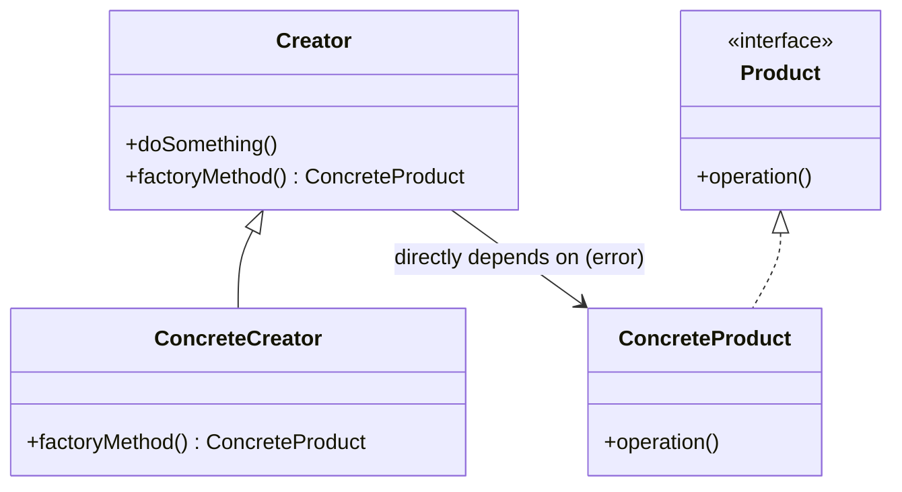
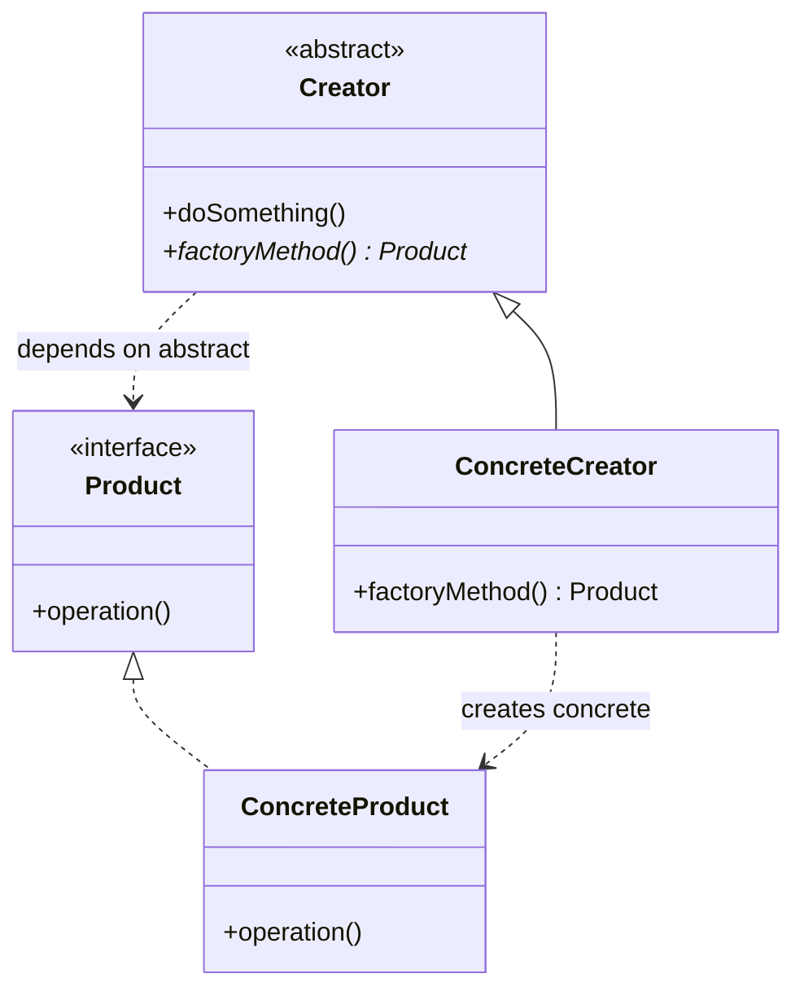
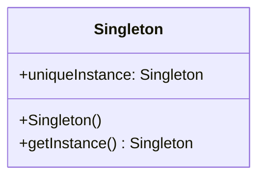
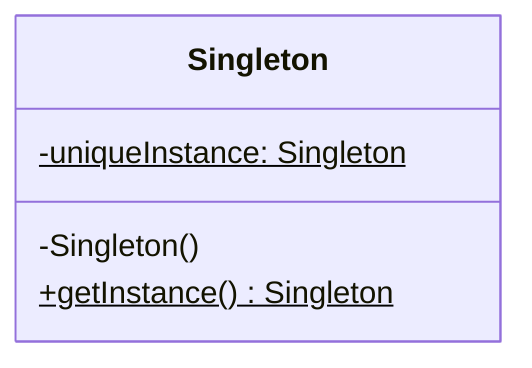
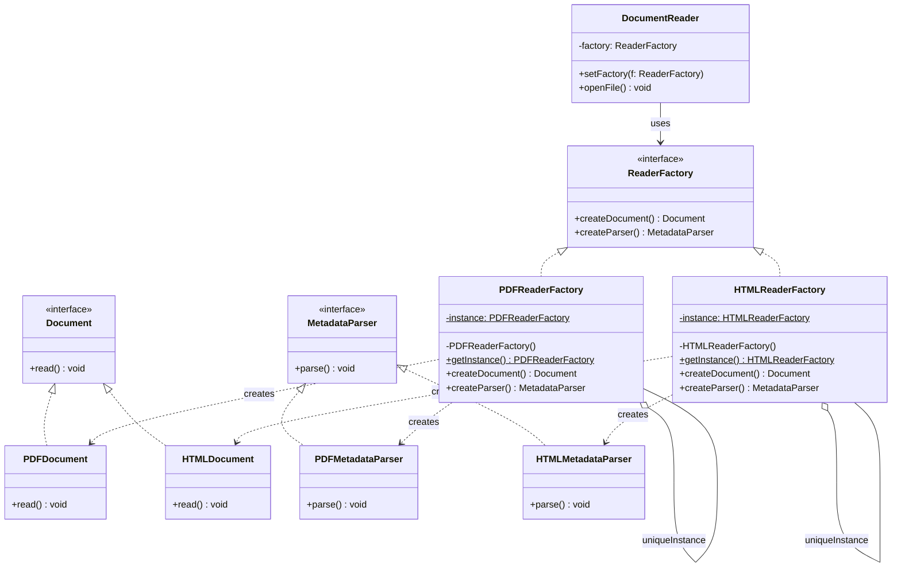

# Part 4 創建型設計樣式綜合測驗與挑戰

本測驗旨在評估學生對於 **Part 4 創建型設計樣式 (Creational Patterns)**（包含 Ch10 設計樣式導論、Ch11 Factory Method、Ch12 Abstract Factory、Ch13 Singleton）的理解程度，並結合物件導向基礎概念與 SOLID 設計原則進行考驗。

> [!IMPORTANT]
> **注意：** 本測驗範圍僅限於 Part 4 及其之前的內容，不包含 Part 5 (結構型) 與 Part 6 (行為型) 的設計樣式。

---

## 一、 單選與複選題

### 10. 設計樣式導論

#### Q1. 1994 年由 Gamma 等四人（GoF）合著的經典書籍中，共定義了多少個基礎設計樣式（Design Patterns）？
- A) 15 個
- B) 23 個
- C) 32 個
- D) 45 個

<details>
<summary>解答</summary>

**B) 23 個**
說明：GoF (Gang of Four) 的經典書籍中共定義了 23 個基礎設計樣式，並分為生成型（Creational）、結構型（Structural）與行為型（Behavioral）三大類。
</details>

#### Q2. 設計樣式的經典定義可以被概括為：「在特定的背景情境（Context）下，針對某個特定問題（Problem）所提出的：」
- A) 唯一硬體解決方案
- B) 通用且可重複套用的軟體設計解決方案 (Solution)
- C) 程式碼自動生成工具
- D) 資料庫正規化指南

<details>
<summary>解答</summary>

**B) 通用且可重複套用的軟體設計解決方案 (Solution)**
說明：設計樣式是前人開發經驗的精鍊與結晶，描述了在特定設計情境下，物件與類別如何組織、交互以解決常見的維護、擴充與重用性問題。
</details>

#### Q3. 關於設計樣式對非功能性需求（NFR）的協助，下列敘述何者最為正確？
- A) 設計樣式只處理功能性需求，與非功能性需求無關
- B) 設計樣式可以藉由改善程式結構品質，提升系統的可維護性（Maintainability）、可擴充性（Extensibility）與可重用性（Reusability）
- C) 採用設計樣式可以無條件地加快程式在 CPU 中的執行速度
- D) 設計樣式是專門用來減少類別數量的工具

<details>
<summary>解答</summary>

**B) 設計樣式可以藉由改善程式結構品質，提升系統的可維護性（Maintainability）、可擴充性（Extensibility）與可重用性（Reusability）**
說明：設計樣式的核心價值在於提升系統架構的彈性。例如：透過抽象化物件生成或引入多型委託，讓系統在需求變更或功能擴充時，只需修改最少量的既有程式碼，甚至只需新增類別，滿足了非功能性的品質屬性。
</details>

---

### 11. Factory Method (工廠方法樣式)

#### Q4. 下列何者最符合 Factory Method 設計樣式的核心目的？
- A) 確保一個類別只會產生唯一的物件實體
- B) 定義一個用於創建物件的介面，但將物件的具體生成延遲到子類別決定
- C) 限制系統中所有產品物件的生命週期
- D) 提供一個統一的門面以簡化子系統的存取

<details>
<summary>解答</summary>

**B) 定義一個用於創建物件的介面，但將物件的具體生成延遲到子類別決定**
說明：Factory Method 模式定義了一個建立產品的抽象方法（工廠方法），讓子類別去覆寫該方法以決定具體要實例化哪一個產品類別，藉此讓建立者類別與具體產品類別解耦。
</details>

#### Q5. 分析以下 Java 程式碼，關於 `m2()` 方法的宣告與使用，下列敘述何者正確？（複選）
```java
abstract class Creator {
    public void execute() {
        Product p = m2();
        p.use();
    }
    public abstract Product m2();
}
```
- A) `m2()` 是一個典型的工廠方法 (Factory Method)
- B) 類別 `Creator` 可以預期並直接實例化所有的具體產品
- C) 子類別 `ConcreteCreator` 可以覆寫 `m2()` 以回傳 `Product` 的具體子類別實例
- D) `m2()` 方法不論何時都必須被宣告為 `static`

<details>
<summary>解答</summary>

**A) `m2()` 是一個典型的工廠方法 (Factory Method) 和 C) 子類別 `ConcreteCreator` 可以覆寫 `m2()` 以回傳 `Product` 的具體子類別實例**
說明：工廠方法通常是抽象的非靜態方法，由子類別負責實作。子類別在覆寫時，可以回傳宣告型別（`Product`）的任何具體子類別實例，達到多型生成的目的。
</details>

#### Q6. 關於「靜態工廠方法 (Static Factory Method)」與 GoF 標準「工廠方法 (Factory Method)」的比較，下列敘述何者錯誤？
- A) 靜態工廠方法是直接定義在類別中的 `static` 方法，直接透過類別名稱調用，不需先實例化工廠物件
- B) 靜態工廠方法可以擁有具描述性的方法名稱，不受建構子名稱必須與類別同名的限制
- C) 靜態工廠方法可以像標準工廠方法一樣，透過類別繼承與子類別覆寫來實現多型生成
- D) Java 中的 `List.of()`、`Calendar.getInstance()` 都是靜態工廠方法的實務應用

<details>
<summary>解答</summary>

**C) 靜態工廠方法可以像標準工廠方法一樣，透過類別繼承與子類別覆寫來實現多型生成**
說明：C 是錯誤的。靜態方法（`static`）屬於類別本身，**無法在子類別中被覆寫（override）**。因此，靜態工廠方法無法透過子類別繼承覆寫來實現多型動態生成，這與 GoF 標準工廠方法（依賴子類別多型覆寫）有本質上的不同。
</details>

---

### 12. Abstract Factory (抽象工廠樣式)

#### Q7. 下列何者最符合 Abstract Factory 設計樣式的適用情境？
- A) 當系統中某個類別不允許任何子類別繼承時
- B) 當系統需要生產一系列相互關聯或相依的產品家族（Product Family）且不想指定其具體類別時
- C) 當系統只需要一個全局唯一的物件時
- D) 當需要將一個複雜的演算法步驟分解為多個子步驟時

<details>
<summary>解答</summary>

**B) 當系統需要生產一系列相互關聯或相依的產品家族（Product Family）且不想指定其具體類別時**
說明：Abstract Factory 強調的是「產品族」的共同生成。它提供了一個包含多個工廠方法的介面，每個方法負責生產該產品族中的一個零件，確保產生的多個零件之間彼此相容。
</details>

#### Q8. 在 Abstract Factory 設計樣式中，如果抽象工廠（`AbstractFactory`）介面中定義了 3 個抽象方法，這通常代表：
- A) 系統可以支援 3 個不同的產品系列
- B) 該產品家族中包含 3 個不同的零件（產品類型）
- C) 系統中最多只能實作 3 個具體工廠類別
- D) 每個零件只能被複製 3 次

<details>
<summary>解答</summary>

**B) 該產品家族中包含 3 個不同的零件（產品類型）**
說明：抽象工廠介面中的每個方法（如 `createCPU()`、`createMemory()`）都代表生產該產品家族中的一個特定零件。若有 3 個方法，代表每個具體工廠都需要負責生產 3 種不同的零件。
</details>

#### Q9. 關於 Abstract Factory 的優點，下列敘述何者最符合「相依反轉原則 (DIP)」？
- A) 客戶端直接使用 `new` 實例化各個具體產品類別
- B) 客戶端只依賴抽象工廠介面與抽象產品介面，完全不需知道具體工廠與具體產品類別的存在
- C) 它能減少系統中類別的總數量
- D) 具體工廠可以直接存取客戶端的所有私有變數

<details>
<summary>解答</summary>

**B) 客戶端只依賴抽象工廠介面與抽象產品介面，完全不需知道具體工廠與具體產品類別的存在**
說明：DIP 要求「高階模組不應相依於低階模組，兩者都應相依於抽象」。客戶端（高階）與具體產品/工廠（低階）完全隔離，兩者都只透過 `AbstractFactory` 與 `AbstractProduct` 介面（抽象）進行關聯，是 DIP 的完美體現。
</details>

---

### 13. Singleton (獨體樣式)

#### Q10. 下列哪一個選項是 Singleton 設計樣式的核心意圖？
- A) 提供一個可以用來複製物件的雛型
- B) 確保一個類別在系統生命週期中只存在一個物件實體，並提供一個全域存取點
- C) 限制一個類別永遠不能被實例化
- D) 允許 Client 隨時建立任意數量的實例

<details>
<summary>解答</summary>

**B) 確保一個類別在系統生命週期中只存在一個物件實體，並提供一個全域存取點**
說明：Singleton 確保一個類別只會有一個 Instance，並透過私有建構子防止外部直接 `new`，再提供一個靜態方法（如 `getInstance()`）返回該唯一實例。
</details>

#### Q11. 在實作標準的 Singleton 樣式時，下列哪一項物件導向技巧是**非必要**的？
- A) 將類別的建構子宣告為 `private`
- B) 類別內部持有一個私有且靜態（`static`）的自身物件參考
- C) 提供一個公共的、靜態（`static`）的方法供外部取得該唯一物件實體
- D) 必須繼承自 `java.lang.Thread` 以確保多執行緒安全

<details>
<summary>解答</summary>

**D) 必須繼承自 `java.lang.Thread` 以確保多執行緒安全**
說明：實作 Singleton 不需要繼承 `Thread`。雖然在多執行緒環境下需要考慮並發存取的安全問題（例如使用雙重鎖定檢查 `Double-Checked Locking` 或靜態內部類別方式），但這並不要求 Singleton 類別本身繼承 `Thread`。
</details>

#### Q12. 在象棋遊戲中，棋盤上紅黑雙方各有兩個「士（Advisor）」。如果我們要設計 `Advisor` 類別，是否適合直接將 `Advisor` 類別套用為標準的 Singleton 模式？
- A) 適合，因為「士」在棋盤上的功能完全相同，且屬於同一類棋子
- B) 不適合，因為棋盤上同時存在四個具體的「士」物件實體（紅方兩隻、黑方兩隻），若宣告為標準 Singleton 將導致整個系統中只能建立一個「士」物件
- C) 適合，但前提是必須先將「將」也設計為 Singleton
- D) 適合，因為象棋遊戲中不需要考慮多執行緒安全

<details>
<summary>解答</summary>

**B) 不適合，因為棋盤上同時存在四個具體的「士」物件實體（紅方兩隻、黑方兩隻），若宣告為標準 Singleton 將導致整個系統中只能建立一個「士」物件**
說明：Singleton 限制的是「整個類別的實例數量上限為 1」。因為棋局中需要多個「士」的實例，所以不能將其類別直接設為 Singleton。
</details>

---

## 二、 跨章節與觀念對照 (單選題)

### Q13. 關於 Factory Method 模式與 Abstract Factory 模式的核心差異，下列敘述何者最為正確？
- A) Factory Method 是利用多型委託來創建物件；Abstract Factory 則是利用繼承來創建物件
- B) Factory Method 通常只專注於生產「單一產品」，其包裝的是一個「工廠方法」；Abstract Factory 則是專注於生產「產品家族」，其包裝的是整個「工廠類別」
- C) Factory Method 必須搭配 Singleton 使用；Abstract Factory 則絕對不行
- D) Factory Method 屬於行為型樣式；Abstract Factory 屬於結構型樣式

<details>
<summary>解答</summary>

**B) Factory Method 通常只專注於生產「單一產品」，其包裝的是一個「工廠方法」；Abstract Factory 則是專注於生產「產品家族」，其包裝的是整個「工廠類別」**
說明：這是創建型模式中最核心的對比。Factory Method 是把「生產」這件事抽象成一個方法，交給子類別覆寫；而 Abstract Factory 則是把「生產一系列相關零件」這件事抽象成一個工廠類別，透過組合工廠物件來生產整個產品族。
</details>

### Q14. 考慮設計原則中的「封裝變化點」，關於 Part 4 各創建型樣式所封裝的「變化點」，下列對照何者最為正確？
- A) Factory Method 封裝了「要使用的具體工廠類別」；Singleton 封裝了「物件的內部狀態結構」
- B) Abstract Factory 封裝了「具體產品家族的生成與搭配」；Factory Method 封裝了「被建立產品的具體子類別」
- C) Singleton 封裝了「演算法的具體執行步驟」
- D) 以上皆非

<details>
<summary>解答</summary>

**B) Abstract Factory 封裝了「具體產品家族的生成與搭配」；Factory Method 封裝了「被建立產品的具體子類別」**
說明：Factory Method 讓 Client 在不知道具體子類別的情況下使用產品，封裝了「產品的具體類別變更」；Abstract Factory 則封裝了「整套產品族零件的切換與搭配」；Singleton 封裝的則是「實例的生成次數與全局存取控制」。
</details>

### Q15. 在軟體架構設計中，我們經常把 Abstract Factory 中的具體工廠（`ConcreteFactory`）實作類別設計為 Singleton，其主要考量是：
- A) 具體工廠物件在系統中通常只需要一份實例，用以統一產出同系列的零件，不需要重複 new 出多個工廠物件造成記憶體浪費
- B) 為了符合開閉原則 (OCP)
- C) 只有把工廠設為 Singleton，它才能產生抽象產品
- D) 為了強迫 Client 不能切換不同的工廠系列

<details>
<summary>解答</summary>

**A) 具體工廠物件在系統中通常只需要一份實例，用以統一產出同系列的零件，不需要重複 new 出多個工廠物件造成記憶體浪費**
說明：工廠類別本身通常是「無狀態（stateless）」的，它只負責執行創建物件的方法。因此，在整個系統生命週期中，每個具體工廠通常只需要一個實例，與 Singleton 模式結合是非常經典的實務設計。
</details>

---

## 三、 問答題：找出設計圖中的錯誤 (UML 診斷)

### Q16. 診斷下方「Factory Method 工廠方法樣式」設計圖的錯誤：


<details>
<summary>解答與診斷說明</summary>

#### 本設計圖存在以下兩大核心結構錯誤：

1. **基類直接依賴具體產品（違反相依反轉原則 DIP）**：
   * **圖中錯誤**：`Creator` 中的 `factoryMethod()` 宣告回傳型別為 `ConcreteProduct`，且有一條依賴線直接指向 `ConcreteProduct` 具體類別。
   * **錯誤後果**：這使得基類 `Creator` 與具體產品強烈耦合。如果日後要新增一個 `ConcreteProductB`，我們必須修改基類 `Creator`，這完全失去了工廠方法模式解耦與擴充的意義。
   * **正確設計**：`Creator` 內部的 `factoryMethod()` 必須宣告回傳抽象產品 `Product` 介面，且 `Creator` 僅能依賴 `Product` 抽象，不應與具體類別 `ConcreteProduct` 產生任何關聯。

2. **工廠方法沒有被定義為可覆寫**：
   * **圖中錯誤**：`Creator` 中的 `factoryMethod()` 沒有標記為抽象（斜體或 `*` 標記）。
   * **正確設計**：在 Creator 中，`factoryMethod()` 應該是抽象的（Abstract）或提供預設實作，以便子類別覆寫。

#### 正確的 UML 結構關係應為：

</details>

---

### Q17. 診斷下方「Singleton 獨體樣式」設計圖的錯誤：


<details>
<summary>解答與診斷說明</summary>

#### 本設計圖存在以下三大核心錯誤，這將導致無法保證「獨體性」與「全域唯一存取」：

1. **建構子權限錯誤（無法防止重複 new）**：
   * **圖中錯誤**：`Singleton()` 建構子前面是 `+` (public)。
   * **錯誤後果**：外部 Client 可以隨時透過 `new Singleton()` 建立任意數量的物件實例，完全無法強制保證系統中只有一個實例。
   * **正確設計**：建構子必須宣告為 `-` (private)。

2. **唯一實例成員變數權限與修飾符錯誤**：
   * **圖中錯誤**：`uniqueInstance` 被宣告為 `+` (public) 且沒有 static 標記（在 UML 中靜態成員應加底線，或在名稱後加 `$` 標記）。
   * **錯誤後果**：若非靜態（static）變數，則該變數屬於物件層級，無法被靜態方法 `getInstance()` 存取；且若為 public，外部可以直接修改此變數，破壞了封裝性。
   * **正確設計**：應宣告為私有且靜態：`-uniqueInstance: Singleton$`。

3. **取得實例方法修飾符錯誤**：
   * **圖中錯誤**：`getInstance()` 沒有 static 標記。
   * **錯誤後果**：非靜態方法必須先建立物件才能呼叫，但 Client 因為無法（或不該）呼叫建構子，將陷入無法取得該物件的邏輯死胡同。
   * **正確設計**：此方法必須是公共且靜態的：`+getInstance(): Singleton$`。

#### 正確的 UML 結構應為：

</details>

---

## 四、 問答題：設計樣式對照分析 (申論比較)

### Q18. 請比較「Factory Method」與「Abstract Factory」的設計意圖、適用場景與物件關係之不同。

<details>
<summary>解答</summary>

#### 1. 核心對比：
* **Factory Method** 重點在於「**一個產品的生成**」，且將其實例化延遲到子類別中決定。
* **Abstract Factory** 重點在於「**一系列相關產品（產品家族）的協同生成**」，不指定具體類別以確保產品間相容。

#### 2. 詳細分析表：
| 比較維度 | Factory Method 工廠方法 | Abstract Factory 抽象工廠 |
| :--- | :--- | :--- |
| **設計意圖** | 定義創建物件的介面，但讓子類別決定實例化哪一個產品。 | 提供一個創建物件家族的介面，不需指定它們的具體類別。 |
| **結構關係** | **依賴繼承（Inheritance-based）**。Creator 基類定義方法，具體生成完全依賴子類別覆寫。 | **依賴組合（Composition-based）**。Client 持有抽象工廠的參考，並在執行期注入具體工廠物件。 |
| **產品維度** | 單一產品（Single Product）。一個工廠方法通常只生產一種抽象產品（Product）。 | 產品家族（Product Family）。一個抽象工廠會定義多個方法來生產多種相關的產品零件。 |
| **擴充新產品** | **非常簡單**。只需新增具體產品類別與對應的具體建立者類別即可，完全符合 OCP。 | **較難**。若要在產品族中新增一種新零件（例如在 CPU、Memory 之外新增 GPU），必須修改整個 `AbstractFactory` 介面及其所有子類別工廠。 |

</details>

---

### Q19. 在 Java 中，我們可以使用「Singleton 模式」來維護唯一物件，也可以將類別內所有成員皆設計為「靜態方法與靜態變數」（即 Static Class，例如 `java.lang.Math`）。請分析這兩種做法的優缺點與實務選擇考量。

<details>
<summary>解答</summary>

#### 1. 比較與分析：
這兩種做法都可以提供全域唯一的存取入口，但其物件導向特性的支援程度截然不同：

| 比較維度 | Singleton 模式 (獨體) | 全靜態類別 (Static Class / Methods) |
| :--- | :--- | :--- |
| **物件導向特性** | **支援**。它是一個真正的物件，可以繼承其他類別、實作介面，也可以被其他類別繼承。 | **不支援**。它僅是靜態方法的集合，無法繼承、無法實作介面，也無法實現多型。 |
| **延遲載入 (Lazy Loading)** | **支援**。可以在第一次呼叫 `getInstance()` 時才實例化，節省系統啟動時的資源。 | **較難控制**。類別被 JVM 載入時，靜態變數就會被初始化，難以靈活控制載入時機。 |
| **測試友善度 (Mocking)** | **高**。在單元測試中，可以輕易透過介面注入 Mock 物件進行測試。 | **極低**。靜態方法難以進行 Mock 與隔離測試，容易造成單元測試的耦合。 |
| **狀態管理 (Stateful)** | 適合管理有狀態的數據。 | 通常只適合作為無狀態的工具類別（如數學運算 `Math`）。 |
| **擴展至多個實例** | 若未來需求變更，要改為「物件池（Object Pool）」或「限制最多 3 個實例」時，**修改極為容易**。 | 幾乎需要重寫所有調用處的程式碼。 |

#### 2. 實務選擇考量：
* **選擇全靜態類別**：當該類別純粹是**無狀態的工具函式**（Utility functions，如 `java.lang.Math`、字串處理工具 `StringUtils`），不涉及複雜的商業邏輯與多型擴充時。
* **選擇 Singleton 模式**：當該類別需要**維護內部狀態**、需要**實作特定介面以供多型調用**（例如作為 Abstract Factory 實作）、需要支援**延遲初始化**，或者未來有需要進行單元測試與擴展彈性時。

</details>

---

## 五、 系統設計實作題 (Scenario-Based Design)

### Q20. 跨平台文件閱讀器系統 (Multi-Platform Document Reader)

#### 【情境與需求描述】
我們需要為一個跨平台的文件閱讀器系統設計一個核心元件生成框架。系統必須支援兩種不同的文件格式：
1. **PDF 格式**：包含 `PDFDocument` (文件物件) 與 `PDFMetadataParser` (元數據解析器)。
2. **HTML 格式**：包含 `HTMLDocument` (文件物件) 與 `HTMLMetadataParser` (元數據解析器)。

#### 【設計需求】
* **需求一 (單一生成)**：閱讀器核心控制器 `DocumentReader` 在執行時，不希望直接使用 `new PDFDocument()` 或 `new HTMLDocument()` 來實例化文件，以避免控制器與具體文件格式強烈耦合。
* **需求二 (家族一致性)**：當系統設定為「PDF 模式」時，所生成的文件物件（`Document`）與解析器物件（`MetadataParser`）必須**絕對保持一致**（即：PDF 只能搭配 PDF 解析器，絕對不能出現 PDF 文件搭配 HTML 解析器的錯誤情況）。
* **需求三 (獨立唯一性)**：為了節省系統資源，每個具體格式的生產工廠物件，在整個系統中應該**只需要一份實例**。

#### 【設計要求】
1. 分析此系統應結合哪些設計樣式來解決上述需求？
2. 畫出系統的類別圖 (Class Diagram，使用 Mermaid)。
3. 說明各個設計樣式在系統中解決了什麼問題。

<details>
<summary>設計解答與架構圖</summary>

#### 1. 採用的設計樣式與分析：
* **Abstract Factory (抽象工廠樣式)**：解決 **需求一** 與 **需求二**。我們將 `Document` 與 `MetadataParser` 視為同一個格式系列（產品家族）。宣告一個抽象工廠 `ReaderFactory`，內含 `createDocument()` 與 `createParser()` 兩個方法。具體工廠 `PDFReaderFactory` 與 `HTMLReaderFactory` 分別負責產出對應系列的產品，確保兩者一致且相容。
* **Singleton (獨體樣式)**：解決 **需求三**。為了避免系統中重複 new 出多個相同的工廠物件，我們將 `PDFReaderFactory` 與 `HTMLReaderFactory` 設計為 Singleton 類別，確保在整個系統中各自只有唯一的工廠實例。

#### 2. Mermaid 系統類別圖設計：


#### 3. 各設計樣式的具體職責：
1. **Abstract Factory 模式**：
   * `DocumentReader` (Client) 僅與抽象的 `ReaderFactory`、`Document` 與 `MetadataParser` 互動。
   * 當需要切換平台或格式時，只需更換傳入的具體工廠（例如傳入 `PDFReaderFactory`），則 `DocumentReader` 在呼叫 `createDocument()` 與 `createParser()` 時，將自動獲取相容的 PDF 物件家族，完美防止了「PDF文件配上HTML解析器」的產品搭配錯誤，同時符合 OCP 與 DIP 原則。
2. **Singleton 模式**：
   * `PDFReaderFactory` 與 `HTMLReaderFactory` 的建構子皆宣告為 `private`。
   * 它們透過 `getInstance()` 方法返回唯一的靜態實例。這確保了系統中只會存在一個 PDF 工廠和一個 HTML 工廠，避免了因為頻繁建立工廠物件而帶來的效能與記憶體開銷。

</details>
