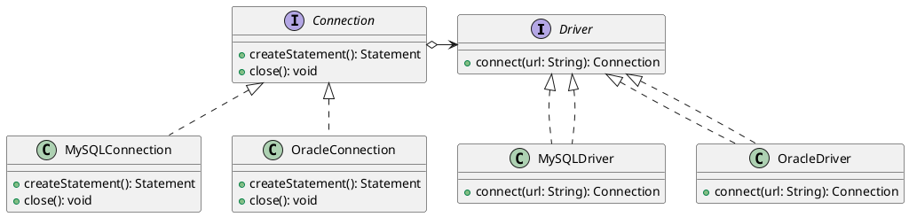

###### tags: `OOSE`

# Ch15 虛實分離 (Bridge)


## 15.1 目的與動機

> 把**抽象**和**實作**抽離開來，使得兩者可以獨立的變化 
>> Decouple an abstraction from its implementation allowing the two to vary independently

子類別的含意到底是什麼？為父類別實踐一個實作？還是表達一種特殊的抽象？如果當兩者都要時，該如何設計？

### 15.1.1 動機

當一個抽象有多個實作時方法時，通常我們會使用繼承來設計：每一個子類別表示一個不同的實作。但有時候這樣的方法沒有彈性。因為該抽象本身也可以分解成其他的類別，形成另外一個繼承結構。

例如，一個視窗可以有兩種不同的實作：`XWindow` 或是 `PMWindow`。當我們要把 `Window` 分成 `IconWindow` 和 `TransientWindow` 兩種不同的類別，那麼我們就需要設計 $2*2$ 個類別。同理，如果當實作方面又多一個 `MacWindow`, 抽象方面又多一個 `SquareWindow`, 那我們就需要 $3*3$ 個類別。類別會越來越多，有沒有可能簡化設計？


FIG: Window 分類：沒有使用 Bridge 樣式


答案就是 Bridge 設計樣式。

### 15.1.2 應用時機

- 當我們想避免抽象和實作永遠的綁在一起時。
%You want to avoid a permanent binding between an abstraction and its implementation. 
- 當抽象和實作都可能透過繼承來擴充時。
%Both the abstractions and their implementations should be extensible by subclassing. 
- 當更改實作時不會對該抽象有影響時。（例如 PMwindow 的實作方法改變了，但這不應該會影響到 IconWindow 的特性)
%Changes in the implementation of an abstraction should have no impact on clients. 

[gugu examples](https://refactoring.guru/design-patterns/bridge)

## 15.2 結構與方法

### 15.2.1 結構


FIG: Bridge Structure

- Abstraction: 問題空間的主要類別，它包含了這個概念主要的功能。operation() 及 m1(), m2() 都是這個概念的主要功能，但 m1(), m2() 這兩個方法是比較細微的方法，它的功能可以會被不同的實作方法來實踐。
- RefinedAbstraction: 上述概念的一個子分類，例如交通工具可以分為摩托車與汽車。這個類別可能會覆寫父類別的 operation()，用來表現這個子類別的特殊化。它的實踐可能是透過執行 m1(), m2() 等方法來實踐的。
- Implementor: 表示所有實踐者的抽象介面，它定義了所有實踐者必須履行的功能（m1(), m2()）。注意 Abstraction 的 m1(), m2() 方法都是直接委託給這個介面下的實體來實踐的。
- ConcreteImplA: 真實的實踐者，例如在上述的例子中，PMWindow 或是 XWindow。


### 15.2.2 程式樣板

```java=
package bridge;

interface Implementor {
	public void m1();
	public void m2();
}

class ConcreteImplA implements Implementor {
	public void m1() {
		// ...
	}

	public void m2() {
		// ...
	}
}

class ConcreteImplB implements Implementor {
	public void m1() {
		// ...
	}

	public void m2() {
		// ...
	}
}

abstract class Abstraction {
	Implementor imp;

	public Abstraction(Implementor imp) {
		this.imp = imp;
	}

	protected void m1() {
		imp.m1();
	}

	protected void m2() {
		imp.m2();
	}

	abstract void operation();
}

class RefinedAbstraction1 extends Abstraction {
	public RefinedAbstraction1(Implementor imp) {
		super(imp);
	}

	// 每個 RefinedAbstraction 執行 operation 的方式可能不同。先 m1() 再 m2()
	void operation() {
		m1();
		m2();
		// ...
	}
}

class RefinedAbstraction2 extends Abstraction {
	public RefinedAbstraction2(Implementor imp) {
		super(imp);
	}

	// 每個 RefinedAbstraction 執行 operation 的方式可能不同。先 m2() 再 m1()
	void operation() {
		m2();
		m1();
		// ...
	}
}
```


[Get the code] (https://github.com/nlhsueh/OOSE/blob/master/src/bridge/BridgeTemplate.java)


> operation() 和 m1(), m2() 的差別是什麼？

## 15.3 範例

### 15.3.1 Shape

```java=
abstract class Shape {
	ShapeImp impl;
	public Shape(ShapeImp impl) {
		this.impl = impl;
	}
	
	abstract void draw();
	
	public void drawLine(int x1, int y1, int x2, int y2) {
		impl.drawLine(x1, y1, x2, y2);
	}	
}	
```


draw() 是由 drawLine() 所組成的方法，而 drawLine 的真實實作是委託給 impl 來做的。Rectangle 和 Triangle 都是形狀，其 draw() 各自不同，但都呼叫了 drawLine()。


完整程式碼：

```java=
public class Draw {
	public static void main(String args[]) {
		System.out.println("Rectangle, 2D");
		Shape r1 = new Rectangle(1,1,2,3, new Draw2D());
		r1.draw();
		System.out.println("Rectangle, 3D");
		Shape r2 = new Rectangle(1,1,2,3, new Draw3D());
		r2.draw();
			
		System.out.println("Triangle, 3D");
		Shape s1 = new Triangle(1,1,2,3,5,10,new Draw3D());
		s1.draw();

		System.out.println("Triangle, 3D");			
		Shape s2 = new Triangle(1,1,2,3,5,10,new Draw2D());
		s2.draw();
	}
}

abstract class Shape {
	ShapeImp impl;
	public Shape(ShapeImp impl) {
		this.impl = impl;
	}
	
	abstract void draw();
	
	public void drawLine(int x1, int y1, int x2, int y2) {
		impl.drawLine(x1, y1, x2, y2);
	}	
}	

//相當於 RefinedAbstraction1
class Rectangle extends Shape { 
	int x, y, w, t;
	
	public Rectangle(int a, int b, int w, int t, ShapeImp imp) {
		super(imp);
		x=a; y=b; this.w=w; this.t=t;		
	}

	//Rectangle 知道如何利用 drawLine 畫出方形。但他並沒有綁真正的實作。
	public void draw() { 
		drawLine(x, y, x+w, y);
		drawLine(x+w, y, x+w, y+t);
		drawLine(x+w, y+t, x, y+t);
		drawLine(x, y+t, x, y);
	}
}

//相當於 RefinedAbstraction2
class Triangle extends Shape {
	int x1, x2, x3, y1, y2, y3;
	
	public Triangle(int x1, int y1, int x2, int y2, int x3, int y3, ShapeImp imp) {
		super(imp);
		this.x1 = x1;
		this.x2 = x2;
		this.x3 = x3;
		this.y1 = y1;
		this.y2 = y2;
		this.y3 = y3;
	}	
	
	public void draw() { 
		drawLine(x1, y1, x2, y2);
		drawLine(x2, y2, x3, y3);
		drawLine(x3, y3, x1, y1);		
	} 
}

interface ShapeImp {
	public void drawLine(int x1, int y1, int x2, int y2);
}

class Draw2D implements ShapeImp {
	public void drawLine(int x1, int y1, int x2, int y2) {
	   System.out.println("2D "+String.valueOf(x1)+","+String.valueOf(y1)+","+String.valueOf(x2)+","+String.valueOf(y2));
	}
}

class Draw3D implements ShapeImp {
	public void drawLine(int x1, int y1, int x2, int y2) {
	   System.out.println("3D"+String.valueOf(x1)+","+String.valueOf(y1)+","+String.valueOf(x2)+","+String.valueOf(y2));
	}	
}
```

- Draw2D 與 Draw3D 針對細微方法 drawLine() 有不同的實作方法; Shape 在繪製 drawLine() 時會委託給 這兩個物件來決定
- 不同形狀的類別：Rectangle 或 Triangle 會有不同的 draw() 方法，但都會應用到 drawLine()
- Reactangle, Triange 等形狀物件在生成時，必須決定其實作的物件-- construction injection!

> 畫出此範例的 UML 圖

### 15.3.2 JDBC

JDBC（Java Database Connectivity）使用了 **Bridge Design Pattern**。其中 **Abstraction** 是高層的 `Connection`、`Statement` 和 `ResultSet` 等類，而 **Implementor** 則是底層的具體資料庫操作（例如對不同資料庫的驅動程式的具體實現）。

JDBC 使得用戶可以將具體的資料庫實現與操作隔離，允許開發者在不改動操作程式碼的情況下切換不同的資料庫實現（例如 MySQL、Oracle、PostgreSQL 等）。

- **Abstraction**: `Connection`、`Statement`、`ResultSet`
- **RefinedAbstraction**: `DriverManager`（具體的資料庫驅動）
- **Implementor**: `Driver`（JDBC 驅動介面）
- **ConcreteImplementor**: 具體的 JDBC 驅動實現，如 `MySQLDriver`、`OracleDriver` 等

**UML design**
以下會出 Connection 的部分，省略 `Statement`, `ResultSet`:



**範例程式**

以下是簡單的 JDBC 示例，顯示如何使用 `DriverManager` 來建立連接，執行查詢，並處理結果。

#### 1. 驅動類（如 MySQL 驅動）

```java
public class MySQLDriver implements Driver {
    @Override
    public Connection connect(String url) {
        try {
            // 模擬 MySQL 連接
            return new MySQLConnection();
        } catch (Exception e) {
            e.printStackTrace();
            return null;
        }
    }
}
```

#### 2. 連接類（如 MySQL 連接）

```java
public class MySQLConnection implements Connection {
    @Override
    public Statement createStatement() {
        return new MySQLStatement();
    }

    @Override
    public void close() {
        System.out.println("Closing MySQL connection");
    }
}
```

#### 3. 語句類（如 MySQL 語句）

```java
public class MySQLStatement implements Statement {
    @Override
    public ResultSet executeQuery(String query) {
        System.out.println("Executing MySQL query: " + query);
        return new MySQLResultSet();
    }
}
```

#### 4. 結果集類（如 MySQL 結果集）

```java
public class MySQLResultSet implements ResultSet {
    private int index = 0;
    private String[] data = {"Row 1", "Row 2", "Row 3"};

    @Override
    public boolean next() {
        if (index < data.length) {
            index++;
            return true;
        }
        return false;
    }

    @Override
    public String getString(String column) {
        return data[index - 1];
    }
}
```

#### 5. 主程式

```java
public class JDBCExample {
    public static void main(String[] args) {
        Driver driver = new MySQLDriver();
        Connection connection = driver.connect("jdbc:mysql://localhost:3306/mydb");
        Statement statement = connection.createStatement();
        ResultSet resultSet = statement.executeQuery("SELECT * FROM users");

        while (resultSet.next()) {
            System.out.println(resultSet.getString("name"));
        }

        connection.close();
    }
}
```

**總結**

- **Bridge Design Pattern** 使得 JDBC 可以在不修改高層介面的情況下，輕鬆地切換不同的資料庫驅動實現。這樣的設計增加了系統的靈活性，並減少了維護成本。
- 透過抽象出來的 `Connection`、`Statement` 和 `ResultSet` 類，我們可以輕鬆地替換底層的資料庫實現，而不會影響到上層的邏輯。

## 15.4 Check

1. Bridge 的目的為
	- 把抽象和實作抽離開來，使得兩者可以獨立的變化
	- 設計一個橋樑，讓兩個不同介面的物件可以相互合作 
	- 設計一平台，使物件可以通過不同的管道重送訊息 
	- 把狀態與介面抽離開來，使兩個物件可以獨立的變化。

2. 依據 Bridge 的架構，以下何者為真（複選）
	- Abstraction 內的 m1() 可以宣告為 protected
	- Abstraction 內的 m1() 可以宣告為 private
	- Client 在生成 RefinedAbstraction1 的物件時，需要指定一個實踐 Implementor 的物件
	- 我們可以把 Abstraction 內的 m1() 宣告為 final 避免子類別的 override
	- 左方 Abstraction 所形成的繼承樹皆是抽象類別，右方 Implentator 所形成的繼承樹都是具體類別。

3. 一個概念可以分為三個子概念，從實作的角度來看有四種實作的方法。若我們不採用 Bridge 方法設計，需要設計幾個具體的類別？若採用 Bridge, 又需要幾個具體類別？
	- 3, 4
	- 12, 7
	- 7, 12
	- 4, 3 

4. 把下圖改用 Bridge 重新設計。


Fig: 未使用 Bridge 的結構

## 15.5 Exercise

### 15.5.1 Shape
Shape 應用 `java.awt.Graphics` 來繪製圖，以下為部分程式碼：

```java
class BridgeSwingExample extends JFrame {

    private Shape square;

    public BridgeSwingExample() {
        super("Bridge Pattern in Swing");
        setDefaultCloseOperation(JFrame.EXIT_ON_CLOSE);
        setSize(300, 300);
        setLocationRelativeTo(null);

        // 創建具體的實現
        ShapeImpl lineDrawer = new LineDrawingShapeImpl();

        // 創建 Refined Abstraction，並將具體實現橋接進來
        square = new Square(lineDrawer, 50, 50, 100); // (50, 50) 為座標, 100 是邊長

        JPanel panel = new JPanel() {
            @Override
            protected void paintComponent(Graphics g) {
                super.paintComponent(g);
                // 繪製正方形
                square.draw(g);
            }
        };
        add(panel);

        setVisible(true);
    }
}
```

其中實線的做法：
```java
class LineDrawingShapeImpl implements ShapeImpl {
    @Override
    public void drawLine(Graphics g, int x1, int y1, int x2, int y2) {
        g.drawLine(x1, y1, x2, y2);
    }
}
```

虛線的實踐方式：
```java
class DashedLineShapeImpl implements ShapeImpl {
    private static final float[] DASH_PATTERN = {5.0f, 5.0f}; // 定義虛線的樣式 (線段長度, 空格長度)
    private static final BasicStroke DASHED_STROKE = new BasicStroke(1.0f, BasicStroke.CAP_BUTT, BasicStroke.JOIN_MITER, 10.0f, DASH_PATTERN, 0.0f);

    @Override
    public void drawLine(Graphics g, int x1, int y1, int x2, int y2) {
        Graphics2D g2d = (Graphics2D) g.create(); // 創建一個 Graphics2D 的副本，避免影響原始 Graphics 物件
        Stroke originalStroke = g2d.getStroke();
        g2d.setStroke(DASHED_STROKE);
        g2d.drawLine(x1, y1, x2, y2);
        g2d.setStroke(originalStroke); // 恢復原始的 Stroke
        g2d.dispose(); // 釋放 Graphics2D 資源
    }
}
```

請完成
1. 實線正方形、虛線正方形
2. 虛線正方形、虛線正方形


### 15.5.2 訊息傳遞系統

請設計一個訊息傳遞系統，訊息傳遞有多種形態：簡單的 (`SimpleNotification`)、緊急的 (`EmergencyNofication`)、排程的（`ScheduledNotification`）。訊息傳遞有多個方法，例如透過 Email（`EmailSender`）或是 即時訊息傳遞（`IMAppSender`），這些傳遞都具備 `send()`, `setTime()`, `setPriority()` 等方法。請透過 `Bridge` 設計樣式來模擬設計此系統，注意緊急的通知是可以設定緊急程度的，排程的通知是可以設定排程週期的。

### 15.5.3 報表系統
請設計一個報表系統，報表可以分為銷售報表、員工績效報表與年度營收報表等; 需要對報表進行格式的轉換以因應不同的用途，可以轉換為 PDF, HTML, 與 Markdown 等格式，這些格式都具備 `convertTable()`, `convertImage()`, `setTitle(int size)` 等功能。銷售報表的 title size 要最大，且先轉 table, 再轉 image。年度營收則 title 小一點，先轉 image 再轉 table。請用 Bridge 來實踐。