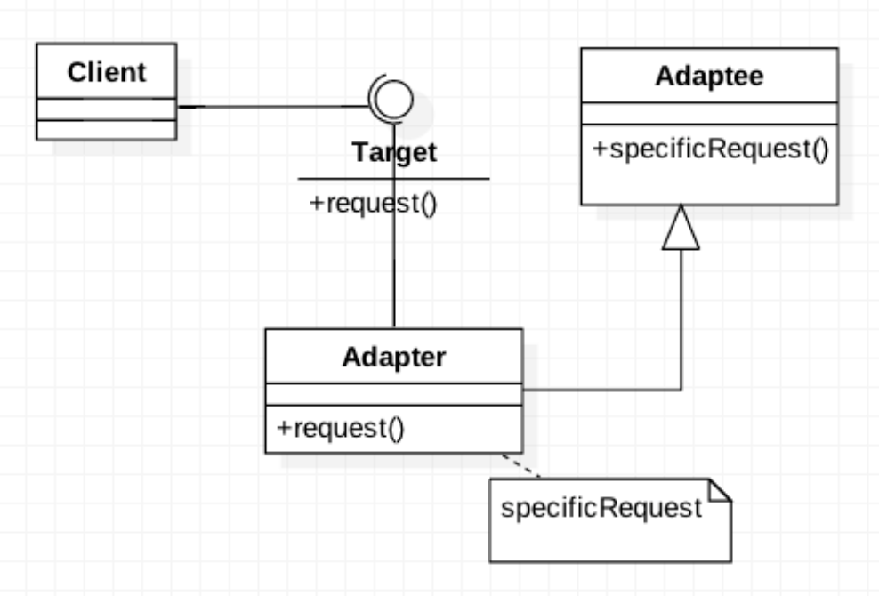
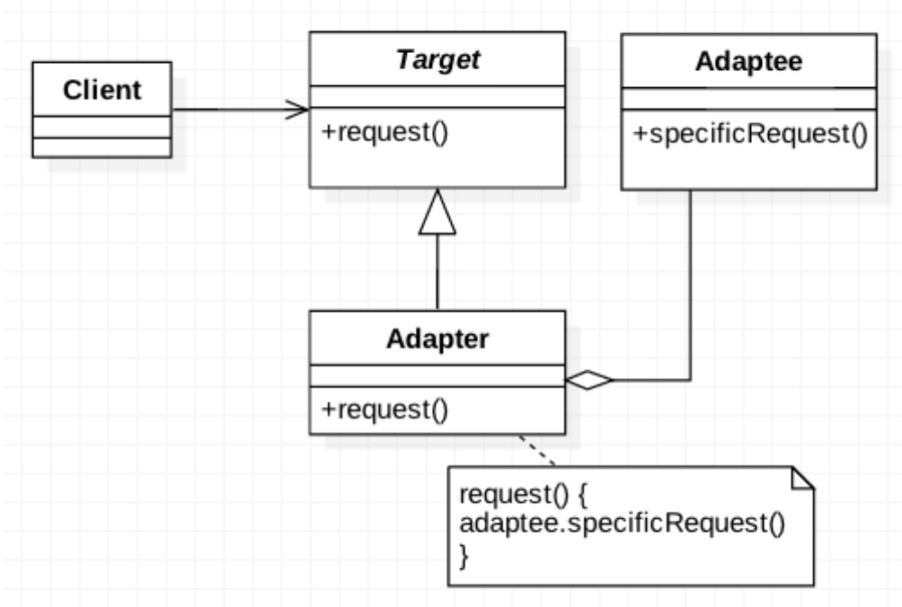
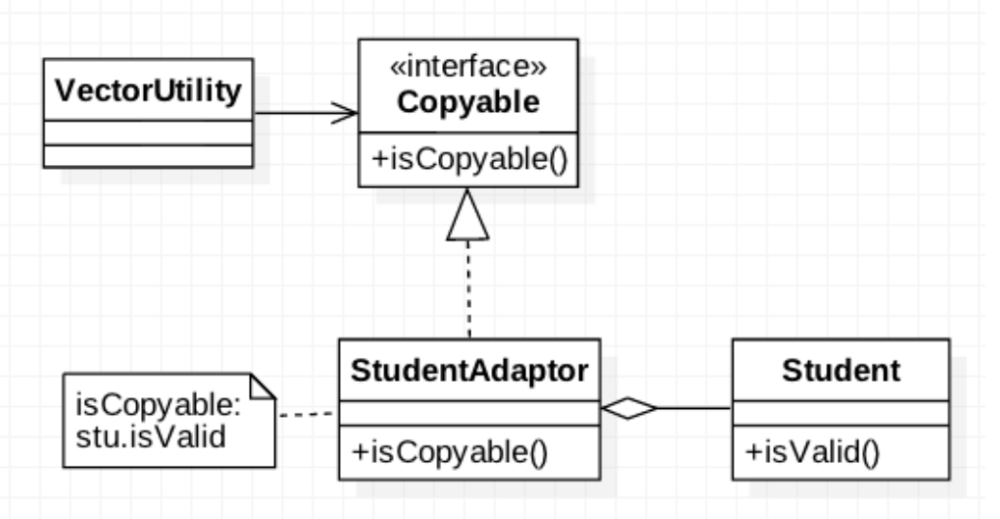
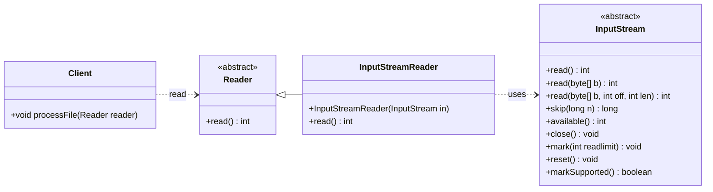

# Ch14 乾坤挪移：Adapter

## 14.1 目的與動機

> 轉換類別的介面成另一個介面所預期的樣式。Adapter 能夠讓不相容的介面，用轉接的方式合作，並且相容。

> Convert the interface of a class into another interface clients expect. An adapter lets classes work together that could not otherwise because of incompatible interfaces. The enterprise integration pattern equivalent is the translator 

### 14.1.1 動機

各位都有要將三孔插頭插入二孔插座時的困擾吧！怎麼辦呢？除了將多餘的一角拔掉外，我們可以買一個三轉二的轉接器來做調整。在軟體的設計上，我們也常遇到過同樣的問題：

物件A在某個環境下使用介面 $I_1$ 來達成某個功能，但換到另一個環境時，提供相同功能的物件B的介面卻不是 $I_1$，而是另一個不同的 $I_1$。在不修改A物件的呼叫與 B 物件的介面時(正如同我們不願修改插頭與插座)，我們如何能讓物件 A 正確的呼叫到該功能？

有時候我們在引用一些類別介面時，有些功能無法引用，是因為介面不相容，我們可能有原始碼但卻不想更動到它的原始結構，或是我們並不知道它的原始碼，只知道它的操作方式。這時候使用轉接器(Adapter)設計樣式，做一個轉接的代理接口，就能讓兩個原本不相容的介面接合在一起。

### 14.1.2 應用時機

當你想使用手邊已存在的類別時，但它的介面並不相容於你所預期的樣式，或是你想發展一個可以Reuse的類別，讓它能夠和不相容介面相互合作。

## 14.2 結構與方法

### 14.2.1 結構

Adapter所以分為2種，一為`類別轉接器`(class Adapter)，一為`物件轉接器`(object Adapter)。前者使用繼承(inheritance)的技巧，而後者使用委託(delegation)的技巧。



FIG: Adapter Design Pattern- Using Class Inheritance



FIG: Adapter Design Pattern- Using Delegation

### 14.2.2 程式範本

#### class adapter

[src/ClassAdapterTemplate.java](src/ClassAdapterTemplate.java)


#### Object adapter

[src/ObjectAdapterTemplate.java](src/ObjectAdapterTemplate.java)

### 14.2.3 更多參考

[gugu web site](https://refactoring.guru/design-patterns/adapter)

## 14.3 範例

### 14.3.1 電源轉接器

假設電腦是慣用的介面是 TwoPin, 但現在都改成 ThreePin 的插座了，請設計一個 2-3 Adapter。

[src/PowerAdapter.java](src/PowerAdapter.java)


### 14.3.2 Copy

考慮一個 VectorUtility 類別，其提供了一個copy的功能，可以將某個Vector複製到另一個Vector，但前提是Vector內的元素必須符合isCopyable的介面：

[src/VectorUtilityExample.java](src/VectorUtilityExample.java)


其 UML 的結構如下：



FIG: 應用 Adaptor- Copyable


而使用 `VectorUtility` 來 copy 的方式如下：

(見 [src/VectorUtilityExample.java](src/VectorUtilityExample.java))


### 14.3.3 StreamReader




**背景：** Java 的 I/O 流處理提供了面向位元組 (`InputStream` 和 `OutputStream`) 和面向字元 (`Reader` 和 `Writer`) 的兩種主要的流層次結構。有時候我們需要將位元組流轉換為字元流，或者反過來。

**問題：** `InputStream` 和 `Reader` 是不同的抽象類別，它們的介面方法（例如 `read()`）的參數和返回值類型都不同，因此無法直接互相操作。同樣的情況也發生在 `OutputStream` 和 `Writer` 之間。

**解決方案：** Java 提供了 `InputStreamReader` 和 `OutputStreamWriter` 這兩個類別作為 Adaptor。

**運作方式：**

1.  **Target 介面：** `Reader` 介面（用於字元輸入）和 `Writer` 介面（用於字元輸出）。

    [src/StreamReaderExample.java](src/StreamReaderExample.java)


**好處：** `InputStreamReader` 和 `OutputStreamWriter` 作為 Adaptor，使得原本面向位元組的流可以方便地轉換為面向字元的流，反之亦然。它們橋接了兩個不同的介面，使得我們可以統一地處理字元資料，而無需直接操作底層的位元組流和字元編碼細節。


### 14.3.4 Window Adaptor

Window adaptor 是另一種特殊的 adaptor.

熟悉 Java GUI 設計的人一定常利用 WindowAdapter 來做 closing 的動作：

[src/WindowAdaptorExample.java](src/WindowAdaptorExample.java)


各位注意到了嗎？即使 application 只想處理 windowClosing 而已，但因為它實作 WindowListener 就必須把所有的 event ``照抄” 一次(內容都是空的)。所以，在此例中，WindowAdapter 做為 application 物件與 WindowListener 的轉接器。

### 14.3.5 `Arrays.asList()`

**概念：**

`Arrays.asList()` 這個靜態方法接收一個陣列（可以是基本型別的包裝類別陣列或物件陣列），並返回一個 `List` 介面 (`java.util.List`) 的實作。

**Target 介面：** `java.util.List` 介面，定義了操作列表（集合）的通用方法，例如 `add()`, `remove()`, `get()`, `size()` 等。

**Adaptee：** Java 的陣列 (`T[]`) 是一種固定大小、元素類型固定的資料結構，其操作方式與 `List` 介面定義的方法有所不同。

**Adaptor：** `Arrays.asList()` 方法就像一個配接器，它將底層的陣列「包裝」起來，並提供一個符合 `List` 介面的視圖 (View)。這個返回的 `List` 物件的操作會反映到底層的陣列上（但需要注意的是，這個返回的 `List` 的大小是固定的，不能進行結構性的修改，例如新增或刪除元素）。

**應用：**

* **將陣列轉換為集合以便使用集合框架的功能：** 雖然返回的 `List` 是固定大小的，但你可以將它作為其他接受 `Collection` 或 `List` 介面的方法的輸入，例如在建構 `HashSet` 或進行流 (Stream) 操作時。

    ```java
    String[] colors = {"red", "green", "blue"};
    List<String> colorList = Arrays.asList(colors);

    // 可以用於創建 HashSet
    Set<String> colorSet = new HashSet<>(colorList);

    // 可以用於 Stream 操作
    colorList.stream().forEach(System.out::println);
    ```

* **為接受 `List` 參數的方法提供陣列資料：** 有些方法的參數是 `List` 介面，如果你只有一個陣列，可以使用 `Arrays.asList()` 將其轉換為 `List` 的視圖傳遞給該方法。

### 14.3.6 `HttpServletRequestWrapper`

Servlet API 中的 `HttpServletRequestWrapper` 和 `HttpServletResponseWrapper`

**概念：**

在 Java Servlet API 中，`HttpServletRequest` 和 `HttpServletResponse` 介面分別代表了客戶端的 HTTP 請求和伺服器的 HTTP 回應。有時，我們需要攔截或修改請求和回應的行為，例如添加額外的標頭、修改參數或重導回應。

**Target 介面：** `HttpServletRequest` 和 `HttpServletResponse` 介面，定義了存取和操作 HTTP 請求和回應資訊的方法。

**Adaptee：** 原始的 Servlet 容器提供的請求和回應物件，它們的具體實作通常是容器內部的，我們無法直接修改。

**Adaptor：** Servlet API 提供了 `HttpServletRequestWrapper` 和 `HttpServletResponseWrapper` 這兩個抽象類別。這些 Wrapper 類別實作了 `HttpServletRequest` 和 `HttpServletResponse` 介面的所有方法，並且在預設情況下只是簡單地將方法調用委託給底層原始的請求和回應物件。

**應用：**

* **裝飾請求和回應：** 你可以繼承 `HttpServletRequestWrapper` 或 `HttpServletResponseWrapper`，並覆寫特定的方法來添加自定義的行為。例如，你可以創建一個 `CustomRequestWrapper` 來修改請求的參數，或者一個 `CustomResponseWrapper` 來添加自定義的 HTTP 頭。

    [src/HttpServletRequestWrapperExample.java](src/HttpServletRequestWrapperExample.java)


* **方便的介面擴展：** Wrapper 類別提供了一個方便的方式來擴展請求和回應的功能，而不需要直接修改原始的介面或其底層實作。你只需要覆寫你關心的方法，其他方法可以依賴 Wrapper 提供的預設委託行為。

## 14.4 隨堂測驗

1.  Adaptor 的目的:
    A) 把兩個介面不相容的物件可以溝通合作
    B) 讓一個類別只能產生一個物件
    C) 讓一個物件可以有很多的觀者者，物件變動時，其觀察者物件可以跟著變動
    D) 提供一個可以修改介面的介面，讓物件可以溝通

<details>
<summary>解答</summary>
    **解答：A) 把兩個介面不相容的物件可以溝通合作**

    **解說：** 轉接器模式的主要目的是將一個介面的請求轉換成另一個介面，使得原本由於介面不兼容而不能一起工作的類別可以一起工作。
</details>


2.  在 Adaptor 中，與 client 溝通的物件為
    A) Target
    B) Adaptee

<details>
<summary>解答</summary>
    **解答：A) Target**

    **解說：** 客戶端（Client）期望與符合 Target 介面的物件進行互動。轉接器（Adaptor）實現了 Target 介面，並在內部封裝了 Adaptee 物件，將客戶端的請求委派給 Adaptee。
</details>


3.  Object Adaptor 運用的技巧為
    A) 讓 Target 包含一個 Adaptor 的物件，轉而呼叫 Adaptee 的方法
    B) 設計一個 Target 的子類別 Adaptor，把 client 呼叫的方法轉而呼叫 Adaptee 的方法
    C) 設計一個 Adaptor 類別，呼叫 Target 與 Adaptee ，等於是作為兩者之間的中介，以降低耦合度

<details>
<summary>解答</summary>
    **解答：B) 設計一個 Target 的子類別 Adaptor，把 client 呼叫的方法轉而呼叫 Adaptee 的方法**

    **解說：** 這是 **Class Adaptor** 的描述。**Object Adaptor** 的技巧是讓 Adaptor 包含一個 Adaptee 的物件實例，然後在 Adaptor 的方法中調用 Adaptee 的相應方法。
</details>


4.  Adaptor 可分為 class adaptor 與 object adaptor。當 target 與 adaptee 都是類別（非介面）時，我們應該用哪一種？
    A) class adaptor
    B) object adaptor

<details>
<summary>解答</summary>
    **解答：B) object adaptor**

    **解說：** 當 Target 和 Adaptee 都是類別時，Class Adaptor 需要使用多重繼承，這在某些語言（例如 Java）中是不被允許的，或者會導致設計上的複雜性。Object Adaptor 通過物件組合的方式，將 Adaptee 物件包含在 Adaptor 內部，提供了更高的靈活性和更低的耦合度。
</details>


5.  當我們想要把 `A.m1()` 介面轉成 `B.op1()` 介面。回答問號 `?` 的程式碼

```java
class AdaptorA2B extends B {
    A a;
    public Adaptor(A a) {
        ?1
    }
    public void op1() {
        ?2
    }
}
```

<details>
<summary>解答</summary>
    * `?1` 為 `this.a = a;` (在建構子中將傳入的 `A` 物件賦值給成員變數 `a`)
    * `?2` 為 `a.m1();` (在 `op1()` 方法中呼叫 `A` 物件的 `m1()` 方法，完成介面轉換)
</details>


6.  說明 物件轉接器 和類別轉接器 的差別

<details>
<summary>解答</summary>
    * **物件轉接器 (Object Adaptor):**
        * 使用**物件組合 (Object Composition)** 的方式實現。
        * 轉接器類別持有一個 Adaptee 介面的實例。
        * 轉接器的方法調用 Adaptee 實例的相應方法，完成介面轉換。
        * 具有更高的靈活性，因為可以適配不同的 Adaptee 實例，並且可以在運行時動態改變。
        * Adaptee 的任何子類別都可以被適配。

    * **類別轉接器 (Class Adaptor):**
        * 使用**類別繼承 (Class Inheritance)** 的方式實現。
        * 轉接器類別同時繼承 Target 介面和 Adaptee 類別。
        * 轉接器的方法直接調用父類別（Adaptee）的方法。
        * 耦合度較高，因為轉接器與特定的 Adaptee 類別綁定。
        * 在某些不支援多重繼承的語言中無法直接實現。
        * 只能適配特定的 Adaptee 類別，無法適配其子類別（如果轉接器沒有覆寫相關方法）。
</details>


7.  說明 Client, Target, Adaptor, Adaptee 的關係

<details>
<summary>解答</summary>
    * **Client (客戶端):** 是需要使用某個功能的角色，它期望與符合 **Target** 介面的物件進行互動。
    * **Target (目標):** 是客戶端期望使用的介面。它定義了客戶端所理解和調用的方法。
    * **Adaptee (被適配者):** 是一個已經存在的類別，它的介面與客戶端期望的 Target 介面不兼容。
    * **Adaptor (轉接器):** 是一個中間件，它實現了 Target 介面，並在內部封裝了 Adaptee 的實例。當客戶端調用 Adaptor 的 Target 介面方法時，Adaptor 會將這個調用轉換成對 Adaptee 相應方法的調用，從而使得客戶端可以使用 Adaptee 的功能，而無需關心其不兼容的介面。
</details>


## 14.5 Exercise

### 14.5.1 雙向轉換器

請設計一個 `A` 到 `B`, `B` 到 `A` 的雙向 Adaptor

[src/BiDirectionalAdapter.java](src/BiDirectionalAdapter.java)


### 14.5.2 Grade average
有一類別 School, 內有方法 `getAverage(Iterator<Integer>)`  會把 iterator 內的成績加總平均。有一個 Vector 物件 group 內含一些 Grade，但 Vector 無法回傳 `iterator` 物件，只能回傳 `Enumeration` 物件。我們想用 School 來計算 group 的平均，請利用 adapter 來解決此問題。

Hint
* 誰是 target? `Iterator`
* 誰是 Adaptee? `Enumeration`
* Google java api 了解 `Vector`, `Enumeration`, `Iteration` 如何應用

<!-- [Hint](https://github.com/nlhsueh/oose24/blob/main/demo/src/adapter/School.java) -->

