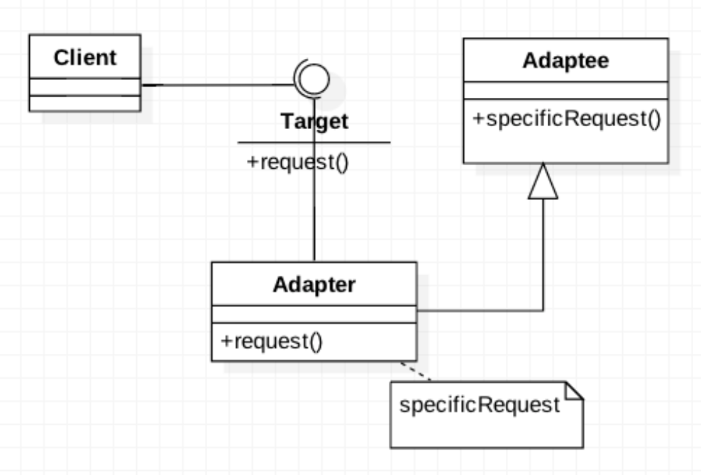
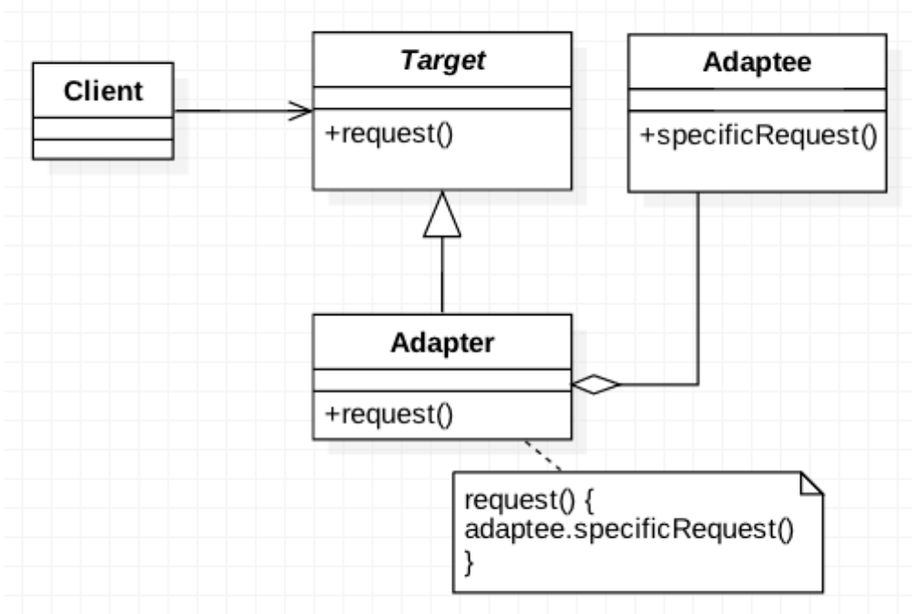
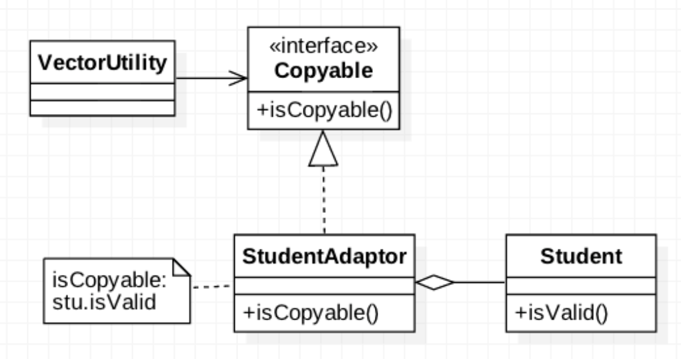
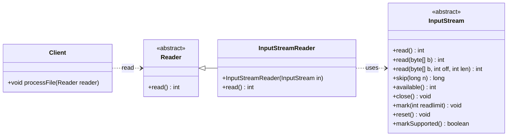

# Ch14 乾坤挪移：Adapter

## 14.1 目的與動機

> 轉換類別的介面成另一個介面所預期的樣式。Adapter 能夠讓不相容的介面，用轉接的方式合作，並且相容。

> Convert the interface of a class into another interface clients expect. An adapter lets classes work together that could not otherwise because of incompatible interfaces. The enterprise integration pattern equivalent is the translator 

### 14.1.1 動機

各位都有要將三孔插頭插入二孔插座時的困擾吧！怎麼辦呢？除了將多餘的一角拔掉外，我們可以買一個三轉二的轉接器來做調整。在軟體的設計上，我們也常遇到過同樣的問題：

物件A在某個環境下使用介面 $I_1$ 來達成某個功能，但換到另一個環境時，提供相同功能的物件B的介面卻不是 $I_1$，而是另一個不同的 $I_1$。在不修改A物件的呼叫與 B 物件的介面時(正如同我們不願修改插頭與插座)，我們如何能讓物件 A 正確的呼叫到該功能？

有時候我們在引用一些類別介面時，有些功能無法引用，是因為介面不相容，我們可能有原始碼但卻不想更動到它的原始結構，或是我們並不知道它的原始碼，只知道它的操作方式。這時候使用轉接器(Adapter)設計樣式，做一個轉接的代理接口，就能讓兩個原本不相容的介面接合在一起。

### 14.1.2 應用時機

當你想使用手邊已存在的類別時，但它的介面並不相容於你所預期的樣式，或是你想發展一個可以Reuse的類別，讓它能夠和不相容介面相互合作。

## 14.2 結構與方法

### 14.2.1 結構

Adapter所以分為2種，一為`類別轉接器`(class Adapter)，一為`物件轉接器`(object Adapter)。前者使用繼承(inheritance)的技巧，而後者使用委託(delegation)的技巧。



FIG: Adapter Design Pattern- Using Class Inheritance



FIG: Adapter Design Pattern- Using Delegation

### 14.2.2 程式範本

#### class adapter

[src/ClassAdapterTemplate.java](src/ClassAdapterTemplate.java)


#### Object adapter

[src/ObjectAdapterTemplate.java](src/ObjectAdapterTemplate.java)

### 14.2.3 更多參考

[gugu web site](https://refactoring.guru/design-patterns/adapter)

## 14.3 範例

### 14.3.1 電源轉接器

假設電腦是慣用的介面是 TwoPin, 但現在都改成 ThreePin 的插座了，請設計一個 2-3 Adapter。

[src/PowerAdapter.java](src/PowerAdapter.java)


### 14.3.2 Copy

考慮一個 VectorUtility 類別，其提供了一個copy的功能，可以將某個Vector複製到另一個Vector，但前提是Vector內的元素必須符合isCopyable的介面：

[src/VectorUtilityExample.java](src/VectorUtilityExample.java)


其 UML 的結構如下：



FIG: 應用 Adaptor- Copyable


而使用 `VectorUtility` 來 copy 的方式如下：

(見 [src/VectorUtilityExample.java](src/VectorUtilityExample.java))

#### 💡 隨堂練習：實作 StudentAdapter

我們有 `VectorUtility.copy()` 可以複製實作了 `Copyable` 的物件。現在我們有 `Student` 類別，它沒有實作 `Copyable`，請利用 **物件轉接器 (Object Adapter)** 的概念，填空完成 `StudentAdapter`：

```java
// 轉接器：讓 Student 也能符合 Copyable 的要求
class StudentAdapter implements ________ { // (1) 填入轉接器需要實作的介面
    private Student student; // 被轉接的對象 (Adaptee)

    public StudentAdapter(Student student) {
        this.student = student;
    }

    @Override
    public StudentAdapter copy() {
        if (student.________()) { // (2) 填入判斷 Student 是否可複製的方法
            // (3) 建立一個新的 Student (深拷貝) 並用 StudentAdapter 包裝起來
            return new StudentAdapter(new Student(________, ________, ________));
        } else {
            return null;
        }
    }

    @Override
    public boolean isCopyable() {
        // (4) 將判斷委託給 Student 的哪個方法？
        return student.________(); 
    }

    public Student getStudent() {
        return student;
    }
}
```

**提示：**
1. `VectorUtility` 要求傳入的物件必須實作 `Copyable` 介面。
2. `Student` 類別中，判斷是否有效的方法是 `isValid()`。
3. `Student` 的建構子為 `Student(String name, int age, boolean valid)`，你可以透過 `student.getName()`, `student.getAge()`, `student.isValid()` 來取得舊物件的資料。


### 14.3.3 StreamReader



```mermaid
classDiagram
    direction LR
    class Client {
        +void processFile(Reader reader)
    }
    class Reader {
        <<abstract>>
        +read() int
    }
    class InputStreamReader {
        +InputStreamReader(InputStream in)
        +read() int
    }
    class InputStream {
        <<abstract>>
        +read() int
        +read(byte[] b) int
        +read(byte[] b, int off, int len) int
        +skip(long n) long
        +available() int
        +close() void
        +mark(int readlimit) void
        +reset() void
        +markSupported() boolean
    }
    Reader <|-- InputStreamReader
    InputStreamReader ..> InputStream : uses
    Client ..> Reader : read
```

**背景：** Java 的 I/O 流處理提供了面向位元組 (`InputStream` 和 `OutputStream`) 和面向字元 (`Reader` 和 `Writer`) 的兩種主要的流層次結構。有時候我們需要將位元組流轉換為字元流，或者反過來。

**問題：** `InputStream` 和 `Reader` 是不同的抽象類別，它們的介面方法（例如 `read()`）的參數和返回值類型都不同，因此無法直接互相操作。同樣的情況也發生在 `OutputStream` 和 `Writer` 之間。

**解決方案：** Java 提供了 `InputStreamReader` 和 `OutputStreamWriter` 這兩個類別作為 Adaptor。

**運作方式：**

1.  **Target 介面：** `Reader` 介面（用於字元輸入）和 `Writer` 介面（用於字元輸出）。

    [src/StreamReaderExample.java](src/StreamReaderExample.java)


**好處：** `InputStreamReader` 和 `OutputStreamWriter` 作為 Adaptor，使得原本面向位元組的流可以方便地轉換為面向字元的流，反之亦然。它們橋接了兩個不同的介面，使得我們可以統一地處理字元資料，而無需直接操作底層的位元組流和字元編碼細節。


### 14.3.4 Window Adaptor

Window adaptor 是另一種特殊的 adaptor.

熟悉 Java GUI 設計的人一定常利用 WindowAdapter 來做 closing 的動作：

[src/WindowAdaptorExample.java](src/WindowAdaptorExample.java)


各位注意到了嗎？即使 application 只想處理 windowClosing 而已，但因為它實作 WindowListener 就必須把所有的 event ``照抄” 一次(內容都是空的)。所以，在此例中，WindowAdapter 做為 application 物件與 WindowListener 的轉接器。

### 14.3.5 `Arrays.asList()`

**概念：**

`Arrays.asList()` 這個靜態方法接收一個陣列（可以是基本型別的包裝類別陣列或物件陣列），並返回一個 `List` 介面 (`java.util.List`) 的實作。

**Target 介面：** `java.util.List` 介面，定義了操作列表（集合）的通用方法，例如 `add()`, `remove()`, `get()`, `size()` 等。

**Adaptee：** Java 的陣列 (`T[]`) 是一種固定大小、元素類型固定的資料結構，其操作方式與 `List` 介面定義的方法有所不同。

**Adaptor：** `Arrays.asList()` 方法就像一個配接器，它將底層的陣列「包裝」起來，並提供一個符合 `List` 介面的視圖 (View)。這個返回的 `List` 物件的操作會反映到底層的陣列上（但需要注意的是，這個返回的 `List` 的大小是固定的，不能進行結構性的修改，例如新增或刪除元素）。

**應用：**

* **將陣列轉換為集合以便使用集合框架的功能：** 雖然返回的 `List` 是固定大小的，但你可以將它作為其他接受 `Collection` 或 `List` 介面的方法的輸入，例如在建構 `HashSet` 或進行流 (Stream) 操作時。

    ```java
    String[] colors = {"red", "green", "blue"};
    List<String> colorList = Arrays.asList(colors);

    // 可以用於創建 HashSet
    Set<String> colorSet = new HashSet<>(colorList);

    // 可以用於 Stream 操作
    colorList.stream().forEach(System.out::println);
    ```

* **為接受 `List` 參數的方法提供陣列資料：** 有些方法的參數是 `List` 介面，如果你只有一個陣列，可以使用 `Arrays.asList()` 將其轉換為 `List` 的視圖傳遞給該方法。

### 14.3.6 `HttpServletRequestWrapper`

Servlet API 中的 `HttpServletRequestWrapper` 和 `HttpServletResponseWrapper`

**概念：**

在 Java Servlet API 中，`HttpServletRequest` 和 `HttpServletResponse` 介面分別代表了客戶端的 HTTP 請求和伺服器的 HTTP 回應。有時，我們需要攔截或修改請求和回應的行為，例如添加額外的標頭、修改參數或重導回應。

**Target 介面：** `HttpServletRequest` 和 `HttpServletResponse` 介面，定義了存取和操作 HTTP 請求和回應資訊的方法。

**Adaptee：** 原始的 Servlet 容器提供的請求和回應物件，它們的具體實作通常是容器內部的，我們無法直接修改。

**Adaptor：** Servlet API 提供了 `HttpServletRequestWrapper` 和 `HttpServletResponseWrapper` 這兩個抽象類別。這些 Wrapper 類別實作了 `HttpServletRequest` 和 `HttpServletResponse` 介面的所有方法，並且在預設情況下只是簡單地將方法調用委託給底層原始的請求和回應物件。

**應用：**

* **裝飾請求和回應：** 你可以繼承 `HttpServletRequestWrapper` 或 `HttpServletResponseWrapper`，並覆寫特定的方法來添加自定義的行為。例如，你可以創建一個 `CustomRequestWrapper` 來修改請求的參數，或者一個 `CustomResponseWrapper` 來添加自定義的 HTTP 頭。

    [src/HttpServletRequestWrapperExample.java](src/HttpServletRequestWrapperExample.java)


* **方便的介面擴展：** Wrapper 類別提供了一個方便的方式來擴展請求和回應的功能，而不需要直接修改原始的介面或其底層實作。你只需要覆寫你關心的方法，其他方法可以依賴 Wrapper 提供的預設委託行為。

## 14.4 隨堂測驗

1. **Adaptor (轉接器) 模式的主要目的為何？** (涵蓋 14.1)
   A) 把兩個介面不相容的物件可以溝通合作
   B) 讓一個類別只能產生一個物件
   C) 讓一個物件可以有很多的觀察者，物件變動時，其觀察者物件可以跟著變動
   D) 提供一個可以修改介面的介面，讓物件可以溝通
   
   <details>
   <summary>解析與答案</summary>
   **答案：A**  
   解析：Adapter 的核心目的就是轉換類別的介面成另一個介面所預期的樣式，讓不相容的介面能夠一起合作。
   </details>

2. **在 Adaptor 模式中，通常代表「Client 預期使用的介面（也就是轉接器要實現的介面）」的是哪一個角色？** (涵蓋 14.2)
   A) Target
   B) Adaptee
   C) Client
   D) SpecificRequest
   
   <details>
   <summary>解析與答案</summary>
   **答案：A**  
   解析：Client 呼叫的是 Target 介面，Adaptor 實作 Target 介面，並在內部呼叫 Adaptee（被轉接者）的實際方法。
   </details>

3. **關於 Object Adaptor (物件轉接器) 與 Class Adaptor (類別轉接器) 的敘述，下列何者正確？** (涵蓋 14.2)
   A) Class Adaptor 使用「組合 (Composition)」的技巧
   B) Object Adaptor 使用「多重繼承 (Multiple Inheritance)」的技巧
   C) Object Adaptor 內部會持有 Adaptee 的實例，並透過「委託 (Delegation)」來達成轉接
   D) Class Adaptor 比 Object Adaptor 更彈性，因為 Java 支援多重繼承
   
   <details>
   <summary>解析與答案</summary>
   **答案：C**  
   解析：Object Adaptor 使用委託（持有一個 Adaptee 物件），而 Class Adaptor 通常使用繼承來達成轉接。
   </details>

4. **在 `VectorUtility` 範例中，我們建立了 `StudentAdapter`。為什麼我們不直接修改 `Student` 類別讓它實作 `Copyable` 介面就好？** (涵蓋 14.3.2)
   A) 因為修改 `Student` 會破壞封裝性
   B) 模擬 `Student` 可能是第三方套件提供的類別，或是我們不想/無法修改其原始碼的情境
   C) 因為 Java 不允許一個類別實作多個介面
   D) 因為 `Student` 類別不能有 `isValid()` 以外的方法
   
   <details>
   <summary>解析與答案</summary>
   **答案：B**  
   解析：Adapter 模式非常適用於「無法修改現有類別原始碼」或「不想為了特定需求而改動穩定類別」的情境。
   </details>

5. **Java 中的 `InputStreamReader` 是轉接器模式的經典應用。它是將什麼轉接為什麼？** (涵蓋 14.3.3)
   A) 將 `Reader` 轉接為 `InputStream`
   B) 將 `InputStream` (Byte Stream) 轉接為 `Reader` (Character Stream)
   C) 將 `File` 轉接為 `Socket`
   D) 將 `String` 轉接為 `Array`
   
   <details>
   <summary>解析與答案</summary>
   **答案：B**  
   解析：`InputStreamReader` 接收一個 `InputStream`，並將其包裝、轉接為 `Reader` 介面，讓 Client 可以用字元流的方式讀取位元流。
   </details>

6. **在 Java AWT 中，`WindowAdapter` 被稱為「預設轉接器 (Default Adapter)」，其主要解決什麼問題？** (涵蓋 14.3.4)
   A) 解決介面不相容的問題
   B) 避免開發者為了實作一個包含多個方法的介面（如 `WindowListener`），而必須寫出一堆空白的 method 實作
   C) 提供視窗元件的深拷貝功能
   D) 負責將滑鼠事件轉換為鍵盤事件
   
   <details>
   <summary>解析與答案</summary>
   **答案：B**  
   解析：`WindowAdapter` 預設空實作了 `WindowListener` 的所有方法，讓開發者只需繼承它並覆寫需要的方法即可，這是一種方便的「介面適配」變體。
   </details>

7. **關於 `Arrays.asList()` 的敘述，下列何者「錯誤」？** (涵蓋 14.3.5)
   A) 它將陣列 (Array) 轉接為 `List` 介面
   B) 透過它產生的 List，其長度是固定的，不能進行 `add` 或 `remove`
   C) 它會建立一個全新的、與原陣列完全獨立的 `java.util.ArrayList` 物件
   D) 修改轉接後的 List 內容，會直接反應到原陣列上
   
   <details>
   <summary>解析與答案</summary>
   **答案：C**  
   解析：`Arrays.asList()` 回傳的是 `Arrays` 內部的私有 `ArrayList` 轉接器，它直接包裹著原陣列，並非獨立複製一份全新的 `java.util.ArrayList`。
   </details>

8. **在 Web 開發中，`HttpServletRequestWrapper` 常用於過濾器（Filter）中，它體現了什麼設計模式的概念？** (涵蓋 14.3.6)
   A) 它是 Wrapper（可視為 Decorator 或 Adapter 的變體），允許我們攔截並修改 Request 的行為（如過濾 XSS），而未覆寫的方法則自動委託給原始 Request
   B) 它純粹是一個 Factory 模式，用來建立 Request
   C) 它是一個 Singleton，確保整個應用程式只有一個 Request
   D) 它是一個 Observer，用來監聽 Request 的屬性變化
   
   <details>
   <summary>解析與答案</summary>
   **答案：A**  
   解析：`HttpServletRequestWrapper` 是一個典型的 Wrapper 應用，透過繼承它並覆寫特定方法（如 `getParameter`），我們可以輕鬆修改輸入內容，其他方法則委託給原 Request。
   </details>


## 14.5 Exercise

### 14.5.1 雙向轉換器

請設計一個 `A` 到 `B`, `B` 到 `A` 的雙向 Adaptor

[src/BiDirectionalAdapter.java](src/BiDirectionalAdapter.java)

### 14.5.2 Grade average
有一類別 School, 內有方法 `getAverage(Iterator<Integer>)`  會把 iterator 內的成績加總平均。有一個 Vector 物件 group 內含一些 Grade，但 Vector 無法回傳 `iterator` 物件，只能回傳 `Enumeration` 物件。我們想用 School 來計算 group 的平均，請利用 adapter 來解決此問題。

[src/GradeAverageExercise.java](src/GradeAverageExercise.java)


