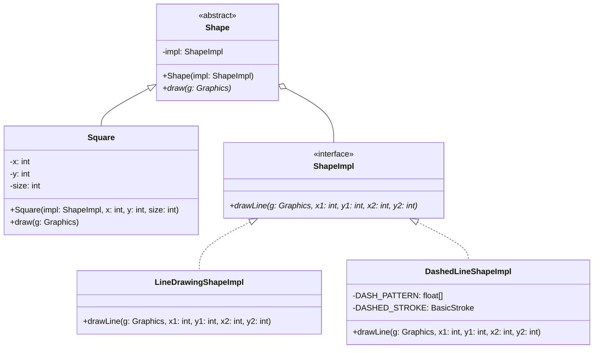
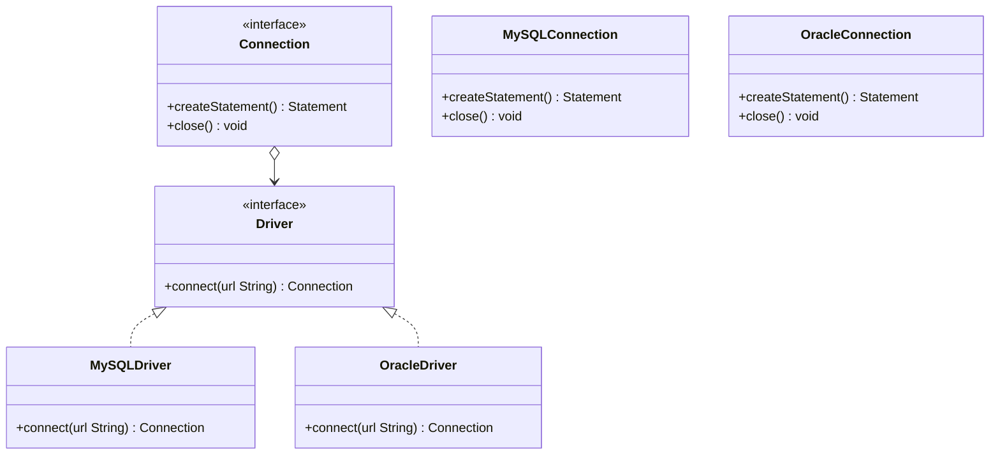

# Ch15 虛實分離 (Bridge)


## 15.1 目的與動機

> 把**抽象**和**實作**抽離開來，使得兩者可以獨立的變化 
>> Decouple an abstraction from its implementation allowing the two to vary independently

子類別的含意到底是什麼？為父類別實踐一個實作？還是表達一種特殊的抽象？如果當兩者都要時，該如何設計？

### 15.1.1 動機

當一個抽象有多個實作時方法時，通常我們會使用繼承來設計：每一個子類別表示一個不同的實作。但有時候這樣的方法沒有彈性。因為該抽象本身也可以分解成其他的類別，形成另外一個繼承結構。

例如，一個視窗可以有兩種不同的實作：`XWindow` 或是 `PMWindow`。當我們要把 `Window` 分成 `IconWindow` 和 `TransientWindow` 兩種不同的類別，那麼我們就需要設計 $2*2$ 個類別。同理，如果當實作方面又多一個 `MacWindow`, 抽象方面又多一個 `SquareWindow`, 那我們就需要 $3*3$ 個類別。類別會越來越多，有沒有可能簡化設計？


FIG: Window 分類：沒有使用 Bridge 樣式


答案就是 Bridge 設計樣式。

### 15.1.2 應用時機

- 當我們想避免抽象和實作永遠的綁在一起時。
%You want to avoid a permanent binding between an abstraction and its implementation. 
- 當抽象和實作都可能透過繼承來擴充時。
%Both the abstractions and their implementations should be extensible by subclassing. 
- 當更改實作時不會對該抽象有影響時。（例如 PMwindow 的實作方法改變了，但這不應該會影響到 IconWindow 的特性)
%Changes in the implementation of an abstraction should have no impact on clients. 

[gugu examples](https://refactoring.guru/design-patterns/bridge)

## 15.2 結構與方法

### 15.2.1 結構


FIG: Bridge Structure

- Abstraction: 問題空間的主要類別，它包含了這個概念主要的功能。operation() 及 m1(), m2() 都是這個概念的主要功能，但 m1(), m2() 這兩個方法是比較細微的方法，它的功能可以會被不同的實作方法來實踐。
- RefinedAbstraction: 上述概念的一個子分類，例如交通工具可以分為摩托車與汽車。這個類別可能會覆寫父類別的 operation()，用來表現這個子類別的特殊化。它的實踐可能是透過執行 m1(), m2() 等方法來實踐的。
- Implementor: 表示所有實踐者的抽象介面，它定義了所有實踐者必須履行的功能（m1(), m2()）。注意 Abstraction 的 m1(), m2() 方法都是直接委託給這個介面下的實體來實踐的。
- ConcreteImplA: 真實的實踐者，例如在上述的例子中，PMWindow 或是 XWindow。


### 15.2.2 程式樣板

[src/BridgeTemplate.java](src/BridgeTemplate.java)


> operation() 和 m1(), m2() 的差別是什麼？

## 15.3 範例

### 15.3.1 Shape


[src/ShapeBridgeExample.java](src/ShapeBridgeExample.java)


### 15.3.2 Swing 上的實作
Shape 應用 `java.awt.Graphics` 來繪製圖，以下為部分程式碼：

[src/ShapeSwingBridge.java](src/ShapeSwingBridge.java)

#### 程式描述

**ShapeSwingBridge** 展示了 Bridge 設計模式在 Swing 圖形繪製中的應用。它將**形狀的定義**（抽象）與**線條的繪製方式**（實現）分離，使得兩者可以獨立變化。

**核心思想**：
- `Square` 類（具體形狀）內部包含 `ShapeImpl` 介面的引用
- 當繪製正方形時，不直接呼叫 Java Graphics，而是透過 `ShapeImpl` 的實現來繪製
- 這樣可以動態選擇用**實線**或**虛線**繪製，無需修改 `Square` 類

**優點**：
- 要增加新的線條樣式（如點線、粗線），只需新增 `ShapeImpl` 的實現類
- 要增加新的形狀（如圓形、三角形），只需新增 `Shape` 的子類
- 兩者獨立擴展，不會互相影響

#### UML 圖



**執行流程示例**：
```java
ShapeImpl impl = new LineDrawingShapeImpl();  // 選擇實線實現
Square square = new Square(impl, 50, 50, 100);
square.draw(graphics);  // 透過橋接調用實線繪製
```

要改用虛線，只需換一行：
```java
ShapeImpl impl = new DashedLineShapeImpl();  // 改為虛線
// 其餘代碼完全不變！
```

### 15.3.2 JDBC

JDBC（Java Database Connectivity）使用了 **Bridge Design Pattern**。其中 **Abstraction** 是高層的 `Connection`、`Statement` 和 `ResultSet` 等類，而 **Implementor** 則是底層的具體資料庫操作（例如對不同資料庫的驅動程式的具體實現）。

JDBC 使得用戶可以將具體的資料庫實現與操作隔離，允許開發者在不改動操作程式碼的情況下切換不同的資料庫實現（例如 MySQL、Oracle、PostgreSQL 等）。

- **Abstraction**: `Connection`、`Statement`、`ResultSet`
- **RefinedAbstraction**: `DriverManager`（具體的資料庫驅動）
- **Implementor**: `Driver`（JDBC 驅動介面）
- **ConcreteImplementor**: 具體的 JDBC 驅動實現，如 `MySQLDriver`、`OracleDriver` 等

**UML design**
以下會出 Connection 的部分，省略 `Statement`, `ResultSet`:



**範例程式**

以下是簡單的 JDBC 示例，顯示如何使用 `DriverManager` 來建立連接，執行查詢，並處理結果。

#### 1. 驅動類（如 MySQL 驅動）

[src/JDBCBridgeExample.java](src/JDBCBridgeExample.java)


**總結**

- **Bridge Design Pattern** 使得 JDBC 可以在不修改高層介面的情況下，輕鬆地切換不同的資料庫驅動實現。這樣的設計增加了系統的靈活性，並減少了維護成本。
- 透過抽象出來的 `Connection`、`Statement` 和 `ResultSet` 類，我們可以輕鬆地替換底層的資料庫實現，而不會影響到上層的邏輯。

## 15.4 隨堂測驗

1. Bridge 的目的為
	- 把抽象和實作抽離開來，使得兩者可以獨立的變化
	- 設計一個橋樑，讓兩個不同介面的物件可以相互合作 
	- 設計一平台，使物件可以通過不同的管道重送訊息 
	- 把狀態與介面抽離開來，使兩個物件可以獨立的變化。

2. 依據 Bridge 的架構，以下何者為真（複選）
	- Abstraction 內的 m1() 可以宣告為 protected
	- Abstraction 內的 m1() 可以宣告為 private
	- Client 在生成 RefinedAbstraction1 的物件時，需要指定一個實踐 Implementor 的物件
	- 我們可以把 Abstraction 內的 m1() 宣告為 final 避免子類別的 override
	- 左方 Abstraction 所形成的繼承樹皆是抽象類別，右方 Implentator 所形成的繼承樹都是具體類別。

3. 一個概念可以分為三個子概念，從實作的角度來看有四種實作的方法。若我們不採用 Bridge 方法設計，需要設計幾個具體的類別？若採用 Bridge, 又需要幾個具體類別？
	- 3, 4
	- 12, 7
	- 7, 12
	- 4, 3 

4. 把下圖改用 Bridge 重新設計。


Fig: 未使用 Bridge 的結構

## 15.5 練習

### 15.5.1 Shape 圖形擴展練習

基於 15.3.2 的 ShapeSwingBridge 範例，請使用 Bridge 設計模式來擴展功能：

在現有的 `Square`（正方形）和 `LineDrawingShapeImpl`（實線）、`DashedLineShapeImpl`（虛線）的基礎上，請完成以下功能：

**第一部分：增加新的形狀**
1. 實作 `Circle` 類（圓形），可用實線或虛線繪製
2. 實作 `Triangle` 類（三角形），可用實線或虛線繪製
3. 新增的形狀應遵循同樣的 Bridge 模式，不修改 `ShapeImpl` 介面

**第二部分：增加新的線條樣式**
1. 實作 `DottedLineShapeImpl`（點線：3.0f 實線間隔，2.0f 空白間隔）
2. 實作 `ThickLineShapeImpl`（粗線：寬度為 3.0f）
3. 驗證可以無縫組合：任意形狀 + 任意線條樣式

**第三部分：整合測試**
1. 建立 ShapeSwingBridge 的改進版本，在同一個 JFrame 中繪製多個圖形：
   - 實線正方形 + 虛線圓形 + 點線三角形
   - 粗線正方形 + 實線三角形
2. 驗證 Bridge 模式的優勢：添加新形狀或新線條樣式時，不需修改現有代碼

**預期結果**

```
圖形種類: Square, Circle, Triangle（3 種）
線條樣式: Solid, Dashed, Dotted, Thick（4 種）
實現類別數量: 3 個形狀 + 4 個線條實現 = 7 個具體類別
（不使用 Bridge 則需要 3 × 4 = 12 個類別）
```

**提示**
- 在 `Circle` 中使用 `g2d.drawOval()` 繪製圓形（視為正方形的外接圓）
- 在 `Triangle` 中使用 `g2d.drawPolygon()` 繪製三角形
- 所有新的 `ShapeImpl` 實現類應包含相同的簽名：`drawLine(Graphics g, int x1, int y1, int x2, int y2)`

### 15.5.2 訊息傳遞系統

請設計一個訊息傳遞系統，訊息傳遞有多種形態：簡單的 (`SimpleNotification`)、緊急的 (`EmergencyNofication`)、排程的（`ScheduledNotification`）。訊息傳遞有多個方法，例如透過 Email（`EmailSender`）或是 即時訊息傳遞（`IMAppSender`），這些傳遞都具備 `send()`, `setTime()`, `setPriority()` 等方法。請透過 `Bridge` 設計樣式來模擬設計此系統，注意緊急的通知是可以設定緊急程度的，排程的通知是可以設定排程週期的。

### 15.5.3 報表系統
請設計一個報表系統，報表可以分為銷售報表、員工績效報表與年度營收報表等; 需要對報表進行格式的轉換以因應不同的用途，可以轉換為 PDF, HTML, 與 Markdown 等格式，這些格式都具備 `convertTable()`, `convertImage()`, `setTitle(int size)` 等功能。銷售報表的 title size 要最大，且先轉 table, 再轉 image。年度營收則 title 小一點，先轉 image 再轉 table。請用 Bridge 來實踐。