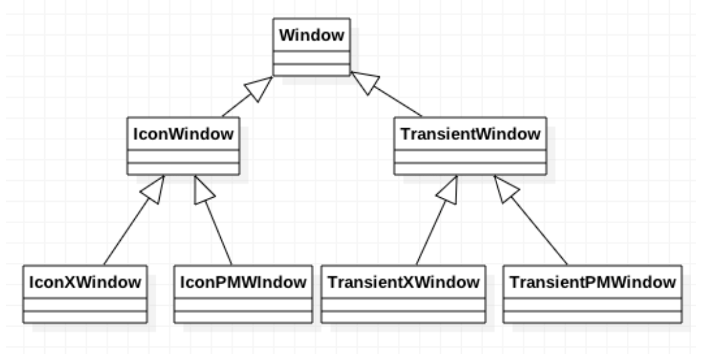
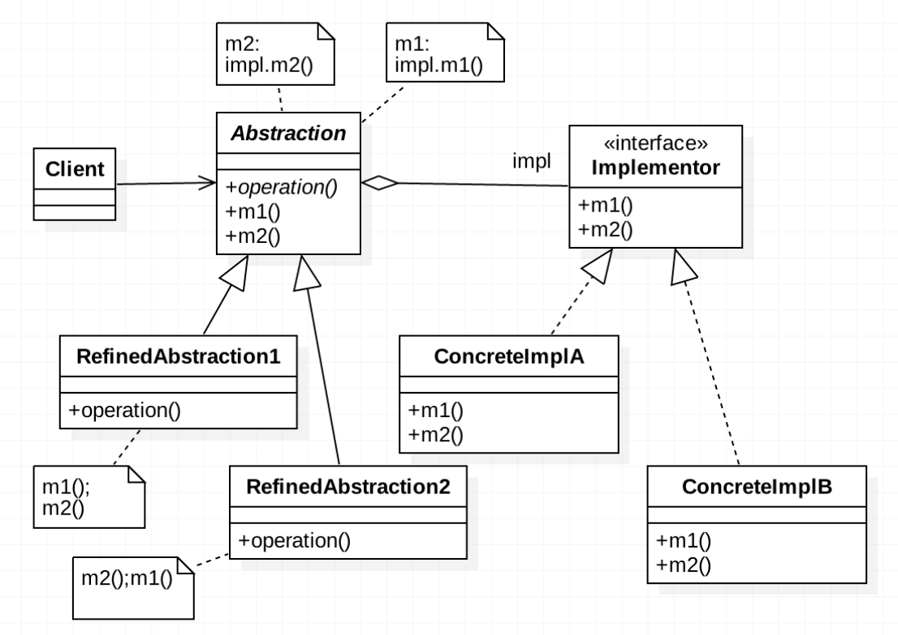
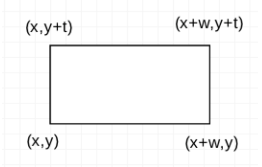
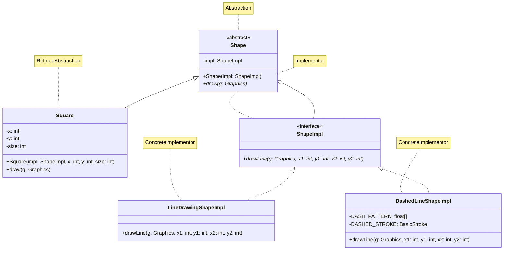
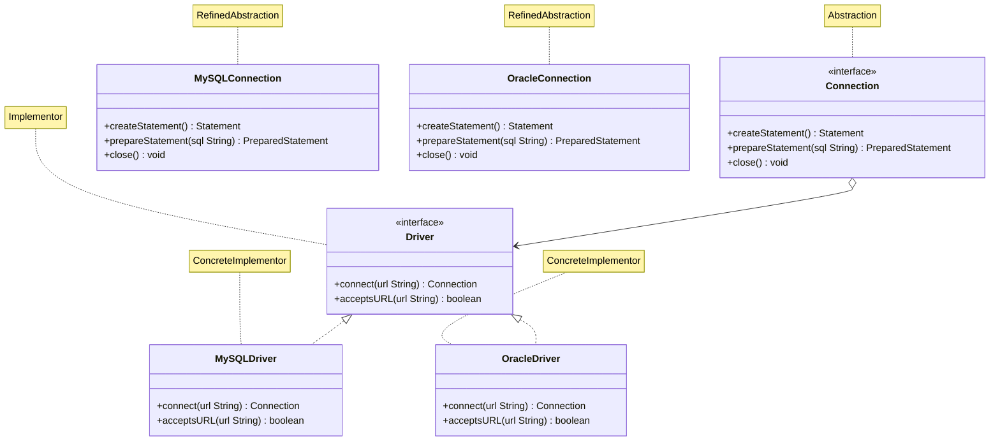
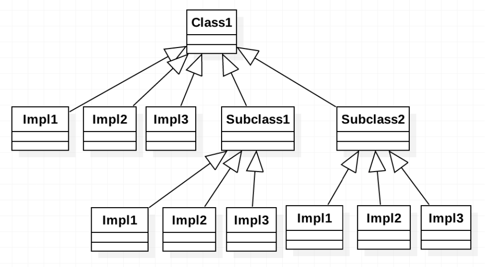

# Ch15 虛實分離 (Bridge)


## 15.1 目的與動機

> 把**抽象**和**實作**抽離開來，使得兩者可以獨立的變化 

> Decouple an abstraction from its implementation allowing the two to vary independently

子類別的含意到底是什麼？為父類別實踐一個實作？還是表達一種特殊的抽象？如果當兩者都要時，該如何設計？

### 15.1.1 動機

當一個抽象有多個實作時方法時，通常我們會使用繼承來設計：每一個子類別表示一個不同的實作。但有時候這樣的方法沒有彈性。因為該抽象本身也可以分解成其他的類別，形成另外一個繼承結構。

例如，一個視窗可以有兩種不同的實作：`XWindow` 或是 `PMWindow`。當我們要把 `Window` 分成 `IconWindow` 和 `TransientWindow` 兩種不同的類別，那麼我們就需要設計 $2*2$ 個類別。同理，如果當實作方面又多一個 `MacWindow`, 抽象方面又多一個 `SquareWindow`, 那我們就需要 $3*3$ 個類別。類別會越來越多，有沒有可能簡化設計？




FIG: Window 分類：沒有使用 Bridge 樣式


答案就是 Bridge 設計樣式。

### 15.1.2 應用時機

- 當我們想避免抽象和實作永遠的綁在一起時。
- 當抽象和實作都可能透過繼承來擴充時。
- 當更改實作時不會對該抽象有影響時。（例如 `PMWindow` 的實作方法改變了，但這不應該會影響到 `IconWindow` 的特性)

[gugu examples](https://refactoring.guru/design-patterns/bridge)

## 15.2 結構與方法

### 15.2.1 結構




FIG: Bridge Structure

- `Abstraction`: 問題空間的主要類別，它包含了這個概念主要的功能。`operation()` 及 `m1()`, `m2()` 都是這個概念的主要功能，但 `m1()`, `m2()` 這兩個方法是比較細微的方法，它的功能可以會被不同的實作方法來實踐。
- `RefinedAbstraction`: 上述概念的一個子分類，例如交通工具可以分為摩托車與汽車。這個類別可能會覆寫父類別的 `operation()`，用來表現這個子類別的特殊化。它的實踐可能是透過執行 `m1()`, `m2()` 等方法來實踐的。
- `Implementor`: 表示所有實踐者的抽象介面，它定義了所有實踐者必須履行的功能（m1(), m2()）。注意 `Abstraction` 的 `m1()`, `m2()` 方法都是直接委託給這個介面下的實體來實踐的。
- `ConcreteImplA`: 真實的實踐者，例如在上述的例子中，`PMWindow` 或是 `XWindow`。


### 15.2.2 程式樣板

[src/BridgeTemplate.java](src/BridgeTemplate.java)


> operation() 和 m1(), m2() 的關係是什麼？

<details>
<summary>解答</summary>
在 Bridge 模式中：
- `operation()` 是 **抽象端 (Abstraction)** 的高層、粗粒度方法，代表系統的核心業務邏輯。
- `m1()` 和 `m2()` 是 **實作端 (Implementor)** 的低層、細粒度方法（Primitive Operations），代表實際具體的底層實踐。
- **關係**：`operation()` 通常是透過組合、呼叫 `m1()` 和 `m2()` 來完成其功能的。這樣做的好處是，高層的 `operation()` 邏輯可以保持穩定，而底層的 `m1()`, `m2()` 可以因應不同的平台或環境而有不同的實現，兩者因此得以解耦並獨立變化。
</details>

## 15.3 範例

### 15.3.1 Shape



[src/ShapeBridgeExample.java](src/ShapeBridgeExample.java)


### 15.3.2 Swing 上的實作
Shape 應用 `java.awt.Graphics` 來繪製圖，以下為部分程式碼：

[src/ShapeSwingBridge.java](src/ShapeSwingBridge.java)

#### 程式描述

**ShapeSwingBridge** 展示了 `Bridge` 設計模式在 `Swing` 圖形繪製中的應用。它將**形狀的定義**（抽象）與**線條的繪製方式**（實現）分離，使得兩者可以獨立變化。

**核心思想**：
- `Square` 類（具體形狀）內部包含 `ShapeImpl` 介面的引用
- 當繪製正方形時，不直接呼叫 Java `Graphics`，而是透過 `ShapeImpl` 的實現來繪製
- 這樣可以動態選擇用**實線**或**虛線**繪製，無需修改 `Square` 類

**優點**：
- 要增加新的線條樣式（如點線、粗線），只需新增 `ShapeImpl` 的實現類
- 要增加新的形狀（如圓形、三角形），只需新增 `Shape` 的子類
- 兩者獨立擴展，不會互相影響

#### UML 圖


```mermaid
classDiagram
    class Shape {
        <<abstract>>
        -impl: ShapeImpl
        +Shape(impl: ShapeImpl)
        +draw(g: Graphics)*
    }
    note for Shape "Abstraction"
    
    class Square {
        -x: int
        -y: int
        -size: int
        +Square(impl: ShapeImpl, x: int, y: int, size: int)
        +draw(g: Graphics)
    }
    note for Square "RefinedAbstraction"
    
    class ShapeImpl {
        <<interface>>
        +drawLine(g: Graphics, x1: int, y1: int, x2: int, y2: int)*
    }
    note for ShapeImpl "Implementor"
    
    class LineDrawingShapeImpl {
        +drawLine(g: Graphics, x1: int, y1: int, x2: int, y2: int)
    }
    note for LineDrawingShapeImpl "ConcreteImplementor"
    
    class DashedLineShapeImpl {
        -DASH_PATTERN: float[]
        -DASHED_STROKE: BasicStroke
        +drawLine(g: Graphics, x1: int, y1: int, x2: int, y2: int)
    }
    note for DashedLineShapeImpl "ConcreteImplementor"
    
    Shape <|-- Square
    Shape o-- ShapeImpl
    ShapeImpl <|.. LineDrawingShapeImpl
    ShapeImpl <|.. DashedLineShapeImpl
```

**執行流程示例**：
```java
ShapeImpl impl = new LineDrawingShapeImpl();  // 選擇實線實現
Square square = new Square(impl, 50, 50, 100);
square.draw(graphics);  // 透過橋接調用實線繪製
```

要改用虛線，只需換一行：
```java
ShapeImpl impl = new DashedLineShapeImpl();  // 改為虛線
// 其餘代碼完全不變！
```

### 15.3.2 JDBC

JDBC（Java Database Connectivity）使用了 **Bridge Design Pattern**。其中 **Abstraction** 是高層的 `Connection`、`Statement` 和 `ResultSet` 等類，而 **Implementor** 則是底層的具體資料庫操作（例如對不同資料庫的驅動程式的具體實現）。

JDBC 使得用戶可以將具體的資料庫實現與操作隔離，允許開發者在不改動操作程式碼的情況下切換不同的資料庫實現（例如 MySQL、Oracle、PostgreSQL 等）。

- **Abstraction**: `Connection`、`Statement`、`ResultSet`
- **RefinedAbstraction**: `DriverManager`（具體的資料庫驅動）
- **Implementor**: `Driver`（JDBC 驅動介面）
- **ConcreteImplementor**: 具體的 JDBC 驅動實現，如 `MySQLDriver`、`OracleDriver` 等

**UML design**
以下會出 Connection 的部分，省略 `Statement`, `ResultSet`:


```mermaid
classDiagram
    class Driver {
        <<interface>>
        +connect(url String) Connection
        +acceptsURL(url String) boolean
    }
    note for Driver "Implementor"
    
    class MySQLDriver {
        +connect(url String) Connection
        +acceptsURL(url String) boolean
    }
    note for MySQLDriver "ConcreteImplementor"
    
    class OracleDriver {
        +connect(url String) Connection
        +acceptsURL(url String) boolean
    }
    note for OracleDriver "ConcreteImplementor"
    
    class Connection {
        <<interface>>
        +createStatement() Statement
        +prepareStatement(sql String) PreparedStatement
        +close() void
    }
    note for Connection "Abstraction"
    
    class MySQLConnection {
        +createStatement() Statement
        +prepareStatement(sql String) PreparedStatement
        +close() void
    }
    note for MySQLConnection "RefinedAbstraction"
    
    class OracleConnection {
        +createStatement() Statement
        +prepareStatement(sql String) PreparedStatement
        +close() void
    }
    note for OracleConnection "RefinedAbstraction"
    
    Driver <|.. MySQLDriver
    Driver <|.. OracleDriver
    Connection o--> Driver
```

**範例程式**

以下是簡單的 JDBC 示例，顯示如何使用 `DriverManager` 來建立連接，執行查詢，並處理結果。

#### 1. 驅動類（如 MySQL 驅動）

[src/JDBCBridgeExample.java](src/JDBCBridgeExample.java)


**總結**

- **Bridge Design Pattern** 使得 JDBC 可以在不修改高層介面的情況下，輕鬆地切換不同的資料庫驅動實現。這樣的設計增加了系統的靈活性，並減少了維護成本。
- 透過抽象出來的 `Connection`、`Statement` 和 `ResultSet` 類，我們可以輕鬆地替換底層的資料庫實現，而不會影響到上層的邏輯。

## 15.4 隨堂測驗

1. **Bridge (橋接) 模式的主要目的為何？** (涵蓋 15.1)
   A) 把抽象和實作抽離開來，使得兩者可以獨立的變化
   B) 設計一個橋樑，讓兩個不同介面的物件可以相互合作 
   C) 設計一平台，使物件可以通過不同的管道重送訊息 
   D) 把狀態與介面抽離開來，使兩個物件可以獨立的變化
   
   <details>
   <summary>解析與答案</summary>
   **答案：A**  
   解析：Bridge 模式的核心宗旨就是將抽象（Abstraction）與實現（Implementation）解耦，使二者可以獨立地變化。
   </details>

2. **依據 Bridge 的架構，以下何者為真？（複選）** (涵蓋 15.2)
   A) `Client` 在生成 `RefinedAbstraction` 的物件時，通常需要指定或注入一個實踐 `Implementor` 的物件
   B) `Abstraction` 內的 `m1()` 可以宣告為 `private`，讓子類別無法存取
   C) 我們可以把 `Abstraction` 內的 `m1()` 宣告為 `final` 避免子類別的 override
   D) 左方 `Abstraction` 所形成的繼承樹著重在業務概念的擴展，右方 `Implementor` 所形成的繼承樹著重在具體技術或平台的實現
   
   <details>
   <summary>解析與答案</summary>
   **答案：A, D**  
   解析：  
   * A 正確，抽象端需要持有實作端的引用，通常在建構子傳入。
   * D 正確，這正是 Bridge 模式將「維度」分開的精髓。
   * B, C 較不符合常理，因為 `Abstraction` 通常需要將方法委託給 `Implementor`，或者留給 `RefinedAbstraction` 使用。
   </details>

3. **一個概念可以分為三個子概念，從實作的角度來看有四種實作的方法。若我們「不採用」Bridge 方法設計，需要設計幾個具體的類別？若「採用」Bridge, 又需要幾個具體類別（含介面）？** (涵蓋 15.1/15.2)
   A) 3, 4
   B) 12, 7 (3 + 4)
   C) 7, 12
   D) 4, 3 
   
   <details>
   <summary>解析與答案</summary>
   **答案：B**  
   解析：  
   * 不採用 Bridge：採用多重繼承或笛卡兒積組合，類別數量為 3 * 4 = 12 個。
   * 採用 Bridge：抽象端 3 個 + 實作端 4 個 = 7 個，大大減少類別爆炸的問題。
   </details>

4. **在本章的 Shape 範例中，若我們想要新增一種「點線 (Dotted Line)」的繪製方式，根據 Bridge 模式的精神，我們應該怎麼做？** (涵蓋 15.3.1/15.3.2)
   A) 繼承 `Shape` 類別，建立一個 `DottedShape` 子類別
   B) 修改 `Square` 類別，加入繪製點線的邏輯
   C) 實作 `ShapeImpl` 介面，建立一個 `DottedLineShapeImpl` 類別，並在繪製時傳給 `Shape` 物件
   D) 修改 `java.awt.Graphics` 類別
   
   <details>
   <summary>解析與答案</summary>
   **答案：C**  
   解析：Bridge 模式中，要增加新的繪製方式（實作端），只需新增 `ShapeImpl` 的實現類，不需修改或增加 `Shape`（抽象端）的類別。
   </details>

5. **關於 JDBC 如何應用 Bridge 模式，下列敘述何者正確？** (涵蓋 15.3.2 JDBC)
   A) `Driver` 介面扮演的是 **Abstraction** 角色
   B) `Connection` 介面扮演的是 **Implementor** 角色
   C) `Connection` (Abstraction) 與 `Driver` (Implementor) 解耦，使得我們切換不同資料庫（如 MySQL 換到 Oracle）時，不需要改動高層的操作程式碼
   D) JDBC 限制一個應用程式同時只能連線到一種資料庫
   
   <details>
   <summary>解析與答案</summary>
   **答案：C**  
   解析：JDBC 中，`Connection` 等高層介面是 Abstraction，而各家廠商提供的 `Driver` 是 Implementor。透過橋接，切換資料庫時只需更換 Driver，應用程式碼不需大改。
   </details>

6. **把下圖改用 Bridge 重新設計。** (涵蓋綜合應用)

   
   
   Fig: 未使用 Bridge 的結構

   <details>
   <summary>思維提示</summary>
   **提示**：將系統切分為兩個維度：
   1. **抽象端**：定義高層概念。
   2. **實作端**：定義具體的底層實現方式。
   兩者透過組合（Composition）關聯起來。
   </details>

## 15.5 練習

### 15.5.1 結構繪製
在不看講義的情況下，應用 UML 的工具畫出該設計樣式的結構。

### 15.5.2 Shape 圖形擴展練習

基於 15.3.2 的 `ShapeSwingBridge` 範例，請使用 Bridge 設計模式來擴展功能：

在現有的 `Square`（正方形）和 `LineDrawingShapeImpl`（實線）、`DashedLineShapeImpl`（虛線）的基礎上，請完成以下功能：

**第一部分：增加新的形狀**
1. 實作 `Circle` 類（圓形），可用實線或虛線繪製
2. 實作 `Triangle` 類（三角形），可用實線或虛線繪製
3. 新增的形狀應遵循同樣的 Bridge 模式，不修改 `ShapeImpl` 介面

**第二部分：增加新的線條樣式**
1. 實作 `DottedLineShapeImpl`（點線：3.0f 實線間隔，2.0f 空白間隔）
2. 實作 `ThickLineShapeImpl`（粗線：寬度為 3.0f）
3. 驗證可以無縫組合：任意形狀 + 任意線條樣式

**第三部分：整合測試**
1. 建立 ShapeSwingBridge 的改進版本，在同一個 JFrame 中繪製多個圖形：
   - 實線正方形 + 虛線圓形 + 點線三角形
   - 粗線正方形 + 實線三角形
2. 驗證 Bridge 模式的優勢：添加新形狀或新線條樣式時，不需修改現有代碼

**預期結果**

```text
圖形種類: Square, Circle, Triangle（3 種）
線條樣式: Solid, Dashed, Dotted, Thick（4 種）
實現類別數量: 3 個形狀 + 4 個線條實現 = 7 個具體類別
（不使用 Bridge 則需要 3 × 4 = 12 個類別）
```

**提示**
- 在 `Circle` 中使用 `g2d.drawOval()` 繪製圓形（視為正方形的外接圓）
- 在 `Triangle` 中使用 `g2d.drawPolygon()` 繪製三角形
- 所有新的 `ShapeImpl` 實現類應包含相同的簽名：`drawLine(Graphics g, int x1, int y1, int x2, int y2)`

### 15.5.3 訊息傳遞系統

請設計一個訊息傳遞系統（UML diagram），訊息傳遞有多種形態：簡單的 (`SimpleNotification`)、緊急的 (`EmergencyNofication`)、排程的（`ScheduledNotification`）。訊息傳遞有多個方法，例如透過 Email（`EmailSender`）或是 即時訊息傳遞（`IMAppSender`），這些傳遞都具備 `send()`, `setTime()`, `setPriority()` 等方法。請透過 `Bridge` 設計樣式來模擬設計此系統，注意緊急的通知是可以設定緊急程度的，排程的通知是可以設定排程週期的。

### 15.5.4 報表系統
請設計一個報表系統(UML diagram)，報表可以分為銷售報表、員工績效報表與年度營收報表等; 需要對報表進行格式的轉換以因應不同的用途，可以轉換為 PDF, HTML, 與 Markdown 等格式，這些格式都具備 `convertTable()`, `convertImage()`, `setTitle(int size)` 等功能。銷售報表的 title size 要最大，且先轉 table, 再轉 image。年度營收則 title 小一點，先轉 image 再轉 table。請用 Bridge 來實踐。