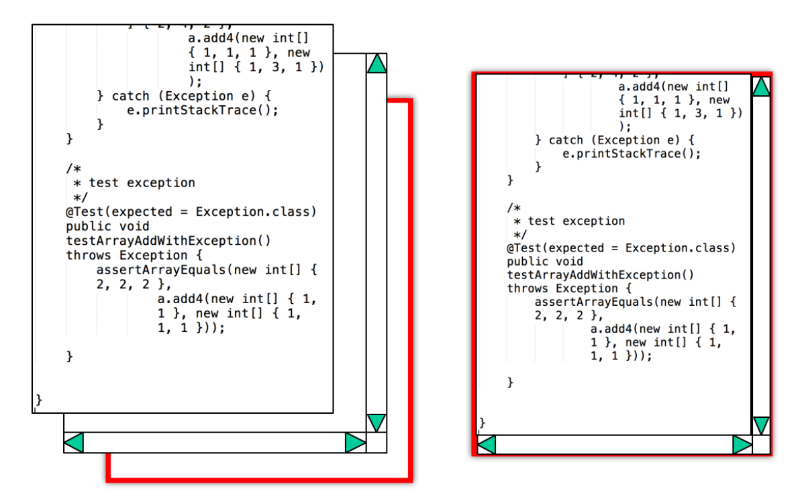
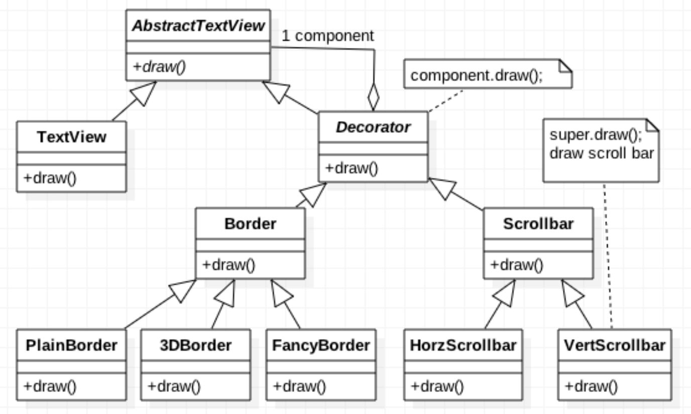
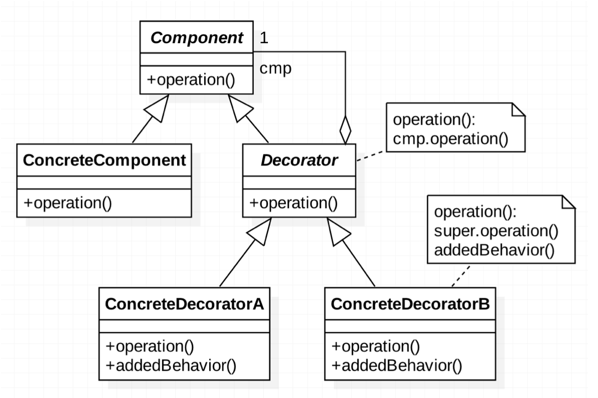
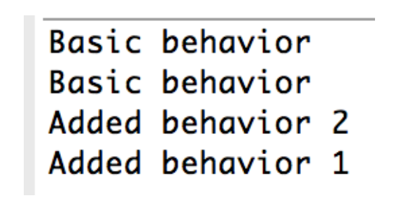
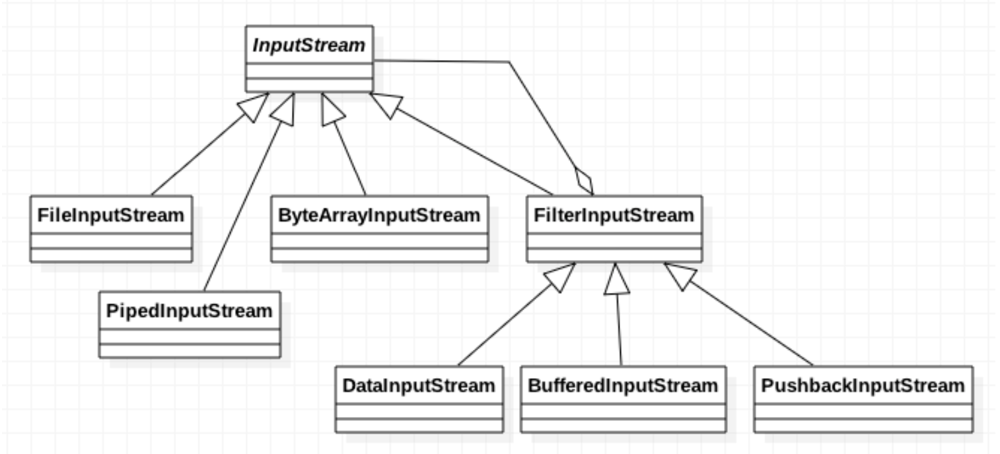

###### tags: `OOSE`

# Ch17 神行百變：Decorator

## 17.1 目的與動機

> 可以動態的為一個物件加上功能(責任)。**Decorator** 提供一種除了繼承以外，有彈性的方法來擴充功能。 

> *Attach additional responsibilities to an object dynamically. Decorators provide a flexible alternative to subclassing for extending functionality*. 

## 17.2 動機

假設我們要做一個文字視窗(`TextView`)，並且提供各種不同的邊框(`border`)與捲軸(`scroll bar`)作為選擇。邊框的型態有：一般型(`Plain`)、3D型或花俏型(`Fancy`)，捲軸的型態有：無捲軸、水平型(`Horizontal`)、垂直型(`Vertical`)與水平垂直型。因此排列組合共有 `3*4=12` 種型別的文字視窗。



FIG: 由框和捲軸而成的 `TextView`

### 17.2.1 方案 1: 繼承樹

為了提供各種可能的`TextView`，我們必須建立12種`TextView`的子類別。這種方法不但繁瑣，無法提供動態的物件生成，甚至連命名都很困難。


|                             |                                      |
| --------------------------- | ------------------------------------ |
| `TextView-Plain`            | `TextView-Plain-Vertical`            |
| `TextView-Plain-Horizontal` | `TextView-Plain-Vertical-Horizontal` |
| `TextView-3D`               | `TextView-3D-Vertical`               |
| `TextView-3D-Horizontal`    | `TextView-3D-Vertical-Horizontal`    |
| `TextView-Fancy`            | `TextView-Fancy-Vertical`            |
| `TextView-Fancy-Horizontal` | `TextView-Fancy-Vertical-Horizontal` |


### 17.2.2 方案 2: Strategy 樣式

我們可以透過 `Strategy` 樣式來解決這個問題，在 `TextView` 建立的時候帶入兩個參數，透過參數的組合來形成各種不同的 TextView。程式碼如下：

[src/TextViewStrategy.java](src/TextViewStrategy.java)


此方法的缺點是缺乏彈性，如果我們在增加新的維度（除了 border, scrollbar 以外的維度），勢必要修該 TextView 的程式碼。

### 17.2.3 方案 3: Decorator 樣式

如果我們使用 `Decorator` 設計樣式一切就會變的容易許多：對 `TextView` 而言，是否增加 `Border` 的功能或捲軸的功能都可以隨意增減，就像是裝飾品一般。新的架構如圖:


FIG: 使用 Decorator 來實作 `TextView`

注意我們將各種`Border`與`Scrollbar`視為一種 `Decorator`，而每一個`Decorator`可包含一個以上的`Component`，如`BorderDecorator`可能可以包含有`3D Border`、`Fancy Border`和`Plain Border`等個別裝飾品物件，而 `ScrollDecorator` 可以包含有垂直、水平的 `Scroll Bar`。這樣的架構方式可以讓動態生成的搭配裝飾更多樣性。讓我們來看`Border Decorator`中 `PlainBorder` 的程式片段：

[src/TextViewDecoratorExample.java](src/TextViewDecoratorExample.java)


`PlainBorder`的建構子將傳入一個 `AbstractTextView` 的變數，透過 `super(c)` 來設定其所包含的元件。在 `draw()` 時呼叫 `super.draw()` 會讓所包含的 `textview` 先做它的 `draw()` 再執行 `PlainBorder` 自身的繪圖。因此，當我們想要建立一個`PlainBorder`的`TextView`只要執行以下的命令：

```java
TextView tv = new TextView ( );
PlainBorder plainTextView = new PlainBorder (tv) ;
```
從「裝飾品」的角度來看，`PlainBorder` 裝飾在 `TextView` 之上，當我們需求 `PlainTV` 繪圖時，它會先要求 `tv` 繪出基本的文字視窗，然後再將邊線繪上。如果我們要繪一個有邊框又有垂直捲軸的文字視窗呢？我們只要在`PlainTextView`上再點綴上一個垂直捲軸即可：

```java 
VerticalScrollBar verticalPlainTextView = new VerticalScrollBar (plainTextView) ;
```	

`VerticalScrollBar` 的建構子為 `VerticalScrollBar(AbstractTextView c)`，所以 `PlainTV` 可以順利的傳入`VerticalScrollBar` 的建構子中。當 `verticalPlainTextView` 繪圖時，其過程：其中(1)繪出一個文字視窗，(2)繪出一個邊框，(3)繪出垂直和水平的Scroll Bar。看完此例，各位應了解Decorator的用途了。我們接著來看Decorator的基本結構吧。

[gugu decorator](https://refactoring.guru/design-patterns/decorator)

## 17.3 結構與方法


FIG: Decorator

### 17.3.1 參與者

- `Component`：系統內元件的配置管理。
- `ConcreteComponet`：系統內主要的功能元件。
- `Decorator`：功能元件的裝飾品管理，管理每一個裝飾品功能物件，使它們能夠動態生成的方式加入到系統中。
- `ConcreteDecoratorA`：實際生成的裝飾品功能物件。

`Decorator` 取名為神行百變，主要是在「百變」上，因為功能可以不斷的附加而改變。「神行」表達這個物件功能的多樣性。插圖中的俠客原有一顆赤子之心，因為行走江湖而不斷的附加許多行頭，例如草帽、臉巾等，但赤子之心仍然不變，象徵著 `Decorator` 的形態都還是 `Component`。

### 17.3.2 優點

透過裝飾品設計樣式，可以讓功能需求像是裝飾品一樣動態的加到系統中，而不會影響到系統本體結構，不會讓架構變的複雜，透過功能包裝成物件的方式可以讓架構更清晰，所屬物件負責工作更明確，進而提昇軟體品質。

### 17.3.3 程式樣板

[src/DecoratorTemplate.java](src/DecoratorTemplate.java)


執行結果如下：




如果我們有 Decorator 子類別 `D1`, `D2`, `D3`, `D4`, decorator 內的功能為 `op()`, 假設每個 `op()` 都是先執行 `super().op()`, 再執行自身的行為（分別為 $f_1-f_4$），ConcreteComponent 的類別為 `CC`。

```java
 Component d = new D2(new D1(new D3(new D4(new CC()))))
```

的生成方式，執行的順序為：`CC.op()`, `f4`, `f3`, `f1`, `f2`。

## 17.4 範例

### 17.4.1 Java I/O

熟悉 JAVA I/O 的讀者對 Decorator 應該有似曾相識的感覺吧！我們先看 Input Stream 的類別圖：


FIG: Java IO- Using Decorator

在 Java I/O 中，`InputStream` 和 `OutputStream` 都有 `BufferedStream`、`DataStream`、`PushbackStream` 的功能需求，其中：

* `BufferedInputStream` 支援緩衝功能。
* `DataInputStream` 支援 Java 基本型態的 I/O。
* `PushbackInputStream` 支援「回復」功能。

但是如果靜態的生成方式必須作出 `2*2*2=8` 種不同搭配的類型，這樣讓系統架構變得很複雜龐大，修改維護上更是麻煩。

的確，Java I/O 的結構使用了裝飾者模式來解決這類型的功能擴充需求。`FilterInputStream` 的角色相當於裝飾者（`Decorator`），而 `BufferedInputStream`、`DataInputStream`、`PushbackInputStream` 等則是 `InputStream` 類別的具體裝飾者（`ConcreteDecorator`）。

以下是一個簡單的 Java 範例，展示如何使用 `FileInputStream` 作為基礎 `InputStream`，並使用 `BufferedInputStream` 和 `DataInputStream` 進行裝飾：

[src/InputStreamDecoratorExample.java](src/InputStreamDecoratorExample.java)


在這個範例中，我們分為兩個部分來展示：

**Part 1: 基礎功能展示**
1. **寫入檔案**：我們使用 `FileOutputStream` 作為基礎，外部包裹了 `BufferedOutputStream` 來提供緩衝功能，最外層再包裹 `DataOutputStream`。這使得我們可以使用 `writeUTF()` 方法直接寫入一個字串 `"I love design pattern"`。
2. **讀取檔案**：同樣地，我們使用 `FileInputStream` 作為基礎，經過 `BufferedInputStream` 裝飾，最後用 `DataInputStream` 包裹。這賦予了我們直接呼叫 `readUTF()` 讀取強型別字串的能力。

**Part 2: 效能對比（展現 Buffered 的威力）**
1. 我們設計了一個迴圈，連續寫入 100,000 筆整數。
2. 在**沒有**使用 `BufferedOutputStream` 的情況下，每次 `writeInt()` 都會直接對硬碟進行 I/O 操作，耗時較長。
3. 在**有**使用 `BufferedOutputStream` 的情況下，資料會先暫存在記憶體緩衝區中，滿了才一次寫入硬碟。執行結果會顯示速度提升了數倍，這真實地展現了 `Buffered` 這個裝飾者所帶來的效能優勢。

透過這種方式，我們將不同的功能（檔案讀寫、緩衝、基本型態讀寫）以裝飾者（Decorator）的方式動態疊加在一起。當我們呼叫最外層的方法時，實際上是觸發了一連串的裝飾者呼叫，最終由最底層的檔案串流完成實際的位元讀寫。


## AOP 與 Decorator 的異同？

在 Java 或 Spring 框架中，我們常看到用 `@` (Annotation，註解) 來標記一個 method（例如 `@Transactional`、`@Log`）。這引出了一個非常經典的問題：**這算不算是 AOP？它與 Decorator 樣式有關嗎？**

答案是：**它們在概念與實現上息息相關！**

### 1. `@` (註解) 與 AOP 的關係
- `@` 本身只是 Java 的 **Metadata (元資料)**，它就像是一個「標籤」，本身並沒有任何程式邏輯。
- **AOP (Aspect-Oriented Programming，剖面導向程式設計)** 則是一套程式典範。在 Spring 中，AOP 引擎會去掃描這些 `@` 標籤。當它發現某個方法被貼上了 `@Transactional` 時，AOP 就會介入，在該方法執行前後加上事務管理的邏輯。
- 所以，`@` 是 AOP 的**觸發條件或標記**，而 AOP 是實際去實現橫切關注點（Cross-cutting concerns）的機制。

### 2. AOP 與 Decorator 的關係
- **AOP 是「概念」，Decorator（或其近親 Proxy）是「實現手法」**。
- 在 Spring 中，AOP 預設是透過 **Dynamic Proxy (動態代理)** 來實現的，而代理模式（Proxy）與裝飾者模式（Decorator）在結構上幾乎是一樣的（都是包裝原物件並共享介面）。
- **傳統 Decorator**：我們手動寫一個 `Decorator` 類別，持有 `Component`，並在方法中疊加功能（如：`BufferedInputStream`）。
- **Spring AOP**：我們只要在方法上加上 `@Transactional`，Spring 就會在**執行期 (Runtime)** 動態為我們生成一個「代理物件（裝飾者）」，把我們的業務物件包起來。當外部呼叫該方法時，實際上是先呼叫了 Spring 的裝飾者（負責開啟事務），裝飾者再去呼叫我們的業務方法，最後裝飾者再負責關閉事務。

### 3. 異同比較

| 特性 | Decorator 模式 | Spring AOP (基於代理模式) |
| :--- | :--- | :--- |
| **本質** | 設計樣式 (Design Pattern) | 程式典範 (Programming Paradigm) |
| **實現時間** | 開發者在程式碼中明確撰寫 (手動包裝) | 執行時期 (Runtime) 由框架動態生成包裝 |
| **侵入性** | 需要建立特定的 Decorator 類別與介面 | 零侵入，只需在方法上貼一個 `@` 標籤 |
| **適用場景** | 針對特定物件、特定維度的功能疊加 | 針對跨多個類別的橫切關注點 (如：權限、日誌、事務) |

**總結**：我們在方法上看到的 `@` 註解，是 AOP 的標記；而 Spring AOP 的底層，正是運用了類似 Decorator 的動態包裝技術，在不修改原程式碼的情況下，為物件「動態加上功能」！符合了 Decorator 的精神。


### 比較

* **Strategy 換骨，Decorator 換皮：**
    * **Strategy 模式** 關注於**演算法或行為的替換**。它允許在執行時改變物件的整個行為或「骨架」。不同的策略提供不同的行為實現，可以完全改變物件的運作方式。
    * **Decorator 模式** 關注於**在不改變物件介面的情況下，動態地增加額外的功能或「裝飾」**。它像給物件穿上不同的「皮膚」，在保持原有功能的基礎上，增加新的功能。核心功能（骨）不變，但外在行為（皮）可以通過裝飾者來增強。

* **Decorator 像洋蔥：**
    * 這個比喻非常貼切。裝飾者模式的結構就像洋蔥一樣，由一層一層的裝飾者包裹著核心的元件（`Component`）。每一層裝飾者都為核心元件添加新的功能。當呼叫最外層裝飾者的操作時，呼叫會層層向內傳遞，直到達到核心元件，然後再層層向外返回，每一層裝飾者在返回的過程中執行其特定的行為。

* **Decorator 像聖誕樹：**
    * 這個比喻也很形象。將核心元件想像成一棵聖誕樹，而每一個裝飾者就像是掛在樹上的裝飾品（例如彩燈、鈴鐺、星星等）。每一個裝飾品都為聖誕樹增添了新的特色和功能，但聖誕樹本身（核心元件）並沒有改變。你可以根據需要自由地添加或移除裝飾者，來組合出不同的功能組合。

這些比喻都強調了裝飾者模式的關鍵思想：**在不改變原有類別結構的基礎上，以組合的方式彈性地擴充物件的功能。**


> Composite 和 Decorator 有何異同？

<details>
<summary>解答</summary>
`Composite` (組合模式) 和 `Decorator` (裝飾者模式) 在結構圖上看起來非常相似（都包含一個指向 Component 介面的關聯），但它們的**目的**與**應用場景**有很大的不同：

**相同點**：
- **共享介面**：兩者都讓包裝者（Composite 或 Decorator）與被包裝的物件實作相同的介面，這使得客戶端可以一致地對待它們。
- **遞迴委託**：兩者都透過組合（Composition）來持有 Component 的引用，並在方法中將請求「委託」給持有的物件。

**不同點**：
1. **設計目的（Intent）**：
   - `Composite`：旨在**表示部分與整體的階層結構**（Part-Whole hierarchies）。例如：檔案系統（資料夾可以包含檔案，也可以包含子資料夾）。
   - `Decorator`：旨在**不改變原類別的情況下，動態地為物件加上新的功能或責任**。
2. **持有的物件數量**：
   - `Composite`：通常會持有**一個集合**（List/Set）的子物件，用來形成樹狀結構。
   - `Decorator`：通常只持有**剛好一個**被裝飾的物件（一對一的包裝），用來形成鏈狀結構（裝飾者鏈）。
3. **加乘效果 vs 樹狀聚合**：
   - `Decorator` 的精神在於「疊加功能」（如：A 包裹 B，B 再包裹 C），每個裝飾者都為核心物件增添一點超能力。
   - `Composite` 的精神在於「一致性處理」，不論是單一樹葉還是整棵樹，操作起來都一樣。
</details>

## 17.5 隨堂測驗

1. **Java 的 I/O 體系中，`FilterInputStream` 在 Decorator 樣式中扮演什麼角色？** (涵蓋 17.4)
   A) Client (客戶端)
   B) Decorator (裝飾者抽象類別)
   C) ConcreteDecorator (具體裝飾者)
   D) Component (抽象元件)
   E) ConcreteComponent (具體元件)
   
   <details>
   <summary>參考解答</summary>
   答案：**B) `Decorator`**  
   解析：在 Java I/O 中，`InputStream` 是 Component，`FileInputStream` 是 ConcreteComponent。而 `FilterInputStream` 繼承自 `InputStream` 且內部持有一個 `InputStream` 的引用，它是所有具體裝飾者（如 `BufferedInputStream`、`DataInputStream`）的父類別，因此它扮演的是 **Decorator** 的角色。
   </details>

2. **在 `TextView` 的例子中，如果我們有 3 種邊框和 4 種捲軸，採用「傳統繼承（Subclassing）」的方式來提供所有組合，會遇到什麼問題？** (涵蓋 17.1/17.2)
   A) 類別爆炸（Class Explosion），需要建立 12 個子類別，且難以維護
   B) 缺乏多型（Polymorphism）支援
   C) 執行時期無法動態生成
   D) 以上皆是
   
   <details>
   <summary>參考解答</summary>
   答案：**A**  
   解析：採用繼承會因為笛卡兒積（3 * 4 = 12）導致類別數量急遽增加，這就是所謂的「類別爆炸」或「組合爆炸」。
   </details>

3. **關於 Decorator pattern，下列何者為錯？** (涵蓋 17.3)
   A) Decorator 可以包含一個 Decorator 物件
   B) Decorator 和 ConcreteComponent 有部分共同的方法，宣告在 Component 中
   C) Decorator 和 ConcreteComponent 都可以包含 Component
   
   <details>
   <summary>參考解答</summary>
   答案：**C) `Decorator` 和 `ConcreteComponent` 都可以包含 `Component`**  
   解析：`ConcreteComponent` 通常是核心元件（裝飾鏈的終點），它負責實作基本行為，不會去包含其他 `Component`。只有 `Decorator` 才會包含一個 `Component` 的參考，以便將請求委派給被裝飾的物件。
   </details>

4. **在 Java I/O 的應用中，若我們連續呼叫 `DataOutputStream.writeInt()` 100,000 次，有包裹 `BufferedOutputStream` 會比沒有包裹快上許多。請問這是因為 `BufferedOutputStream` 發揮了什麼裝飾效果？** (涵蓋 17.4)
   A) 它把資料轉換成人類看得懂的文字
   B) 它在記憶體中開闢了緩衝區，暫存多筆小資料後才一次寫入硬碟，大幅減少了耗時的硬碟 I/O 次數
   C) 它負責將檔案開啟並進行底層的 byte 寫入
   D) 它提供了 `writeInt` 這個方法
   
   <details>
   <summary>參考解答</summary>
   答案：**B**  
   解析：`BufferedOutputStream` 這個裝飾者的唯一職責就是提供緩衝（Buffering），它不改變資料內容，只改變寫入的「效率」。
   </details>

5. **請說明 Strategy 和 Decorator 設計樣式的異同。** (涵蓋 17.2.2)
   
   <details>
   <summary>參考解答</summary>
   * **相同點：** 兩者都提倡「多用組合，少用繼承」，可以在執行時期動態改變物件的行為或功能。
   * **相異點：** 
     * **Decorator (裝飾者模式)：** 著重於**擴充**物件的功能，就像是在物件外面包上一層又一層的包裝。裝飾者和被裝飾者有相同的介面，對客戶端是透明的。
     * **Strategy (策略模式)：** 著重於**替換**物件內部的演算法或邏輯。客戶端需要知道並主動選擇要使用哪一種策略。
   </details>

## 17.練習題

### 17.ex01 多維度功能擴充
有一個物件 A 其基本的功能為 `Basic`，可以從兩方面去擴充，分別為 `X`, `Y`。假設 `X` 方面可以有 `X1`, `X2` 兩種選項，`Y` 有 `Y1`, `Y2`, `Y3` 三種選項。 (1) 若以 Decorator 設計樣式來設計，該如何設計？請畫出 UML 設計圖。(2) 若要產一個具備 `Basic`, `X1`, `Y1` 功能的物件，該如何宣告生成此物件？
- 同上，若以繼承的方法來設計，需要設計多少類別?
- 同上，若改以 Strategy 設計樣式來設計，該如何設計？

### 17.ex02 聖誕樹裝飾

聖誕樹 (`ChrismasTree`) 上面有許多的裝飾品，包含鈴鐺（`Bell`），糖果（`Candy`），與禮物（`Gift`），請用 `Decorator` 樣式設計之。所有的聖誕樹都會支援 `sing()` 的方法：
    - `聖誕樹：I am a Chrismas tree`
    - `有鈴鐺的聖誕樹：I have a bell, I am a Chrismas tree`
    - `有糖果和鈴鐺的聖誕樹：I have a candy, I have a bell, I am a Chrismas tree`

依此類推。請寫出完整可以執行的程式。

### 17.ex03 自訂 FilterWriter

可作輸出，`FilterWriter` 是一個 `Decorator` 的物件。設計以下的 `Filter`:	
- `LowerCaseFilter`:  每個英文字都改成小寫
- `UpperCaseFilter`：每個英文字都改成大寫
- `CommaFilter`: 遇到數字就加上千分號
- `CountFilter`: 在每行字後面加上單字的個數
		
### 17.ex04 咖啡計價系統
泡咖啡了！我們有手工（`HandBlend`）、深度烘胚（`DarkRoast`）、低卡 `Decaf`、`Espresso` 等咖啡，而且每一種咖啡都可以加上 `Milk`, `Mocha`, `Soy`，當然每一個都是額外需要加費的。請用 Decorator 設計樣式設計之，注意 Coffee 是父類別，而我們需要 `cost()` 方法來回傳費用。畫出 UML 圖，寫出程式（請自己假設個別的價格）。

### 17.ex05 象棋系統應用思考
象棋系統中，可否應用 Decorator 設計樣式？試說明之。