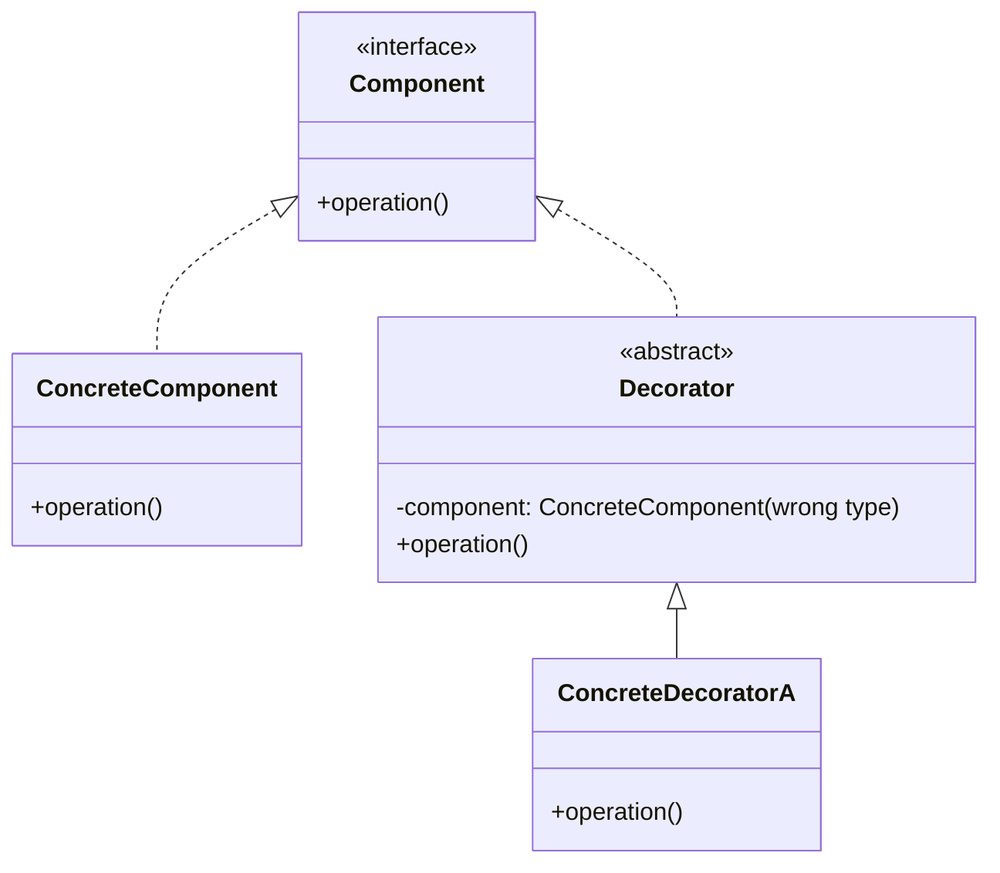
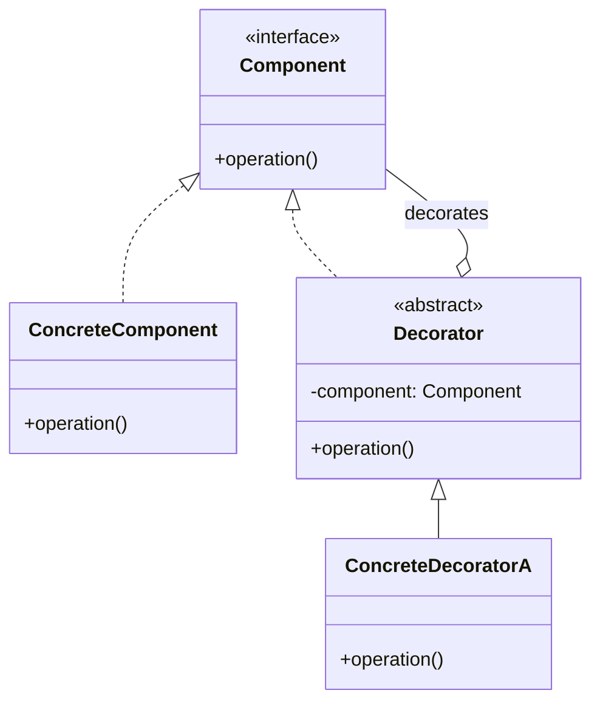
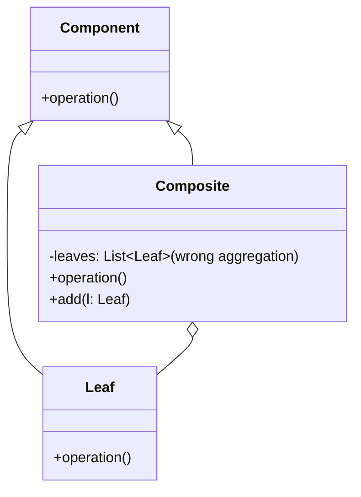
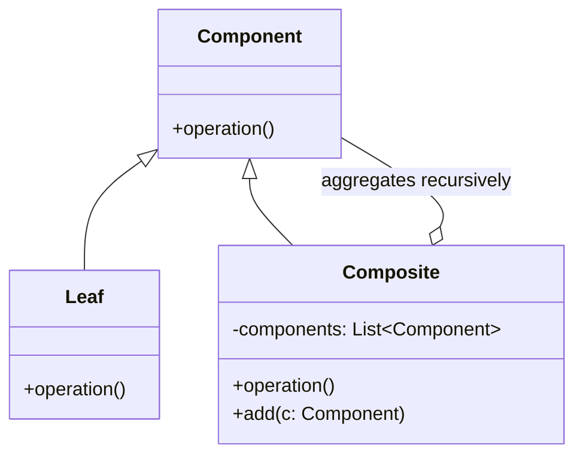
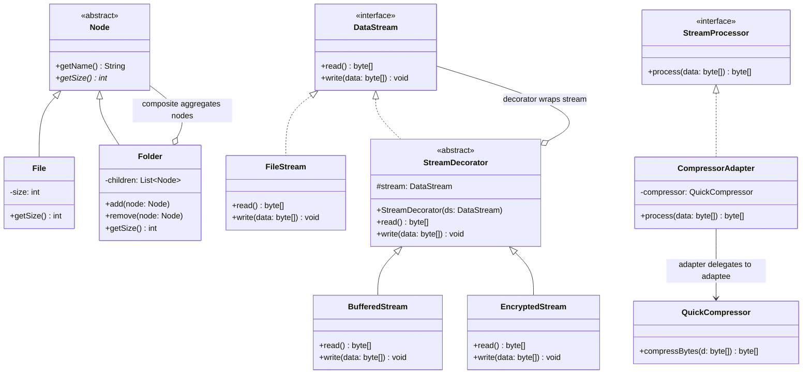

# Part 5 結構型設計樣式綜合測驗與挑戰

本測驗旨在評估學生對於 **Part 5 結構型設計樣式 (Structural Patterns)**（包含 Ch14 Adapter、Ch15 Bridge、Ch16 Composite、Ch17 Decorator）的理解程度，並結合 Part 4 創建型設計樣式進行跨章節對照與觀念辨析。

> [!IMPORTANT]
> **注意：** 本測驗範圍僅限於 Part 4 與 Part 5 及其之前的內容，不包含 Part 6 (行為型) 的設計樣式。

---

## 一、 單選與複選題

### 14. Adapter (轉接器樣式)

#### Q1. 下列何者最符合 Adapter 設計樣式的核心目的？
- A) 將一個類別的介面轉換成客戶端所預期使用的另一個介面，使介面不相容的類別可以協作
- B) 提供一個全域的存取點以保證物件的唯一性
- C) 將一個複雜物件的實作細節與它的高層概念進行虛實分離
- D) 動態地為一個物件加上額外的新職責

<details>
<summary>解答</summary>

**A) 將一個類別的介面轉換成客戶端所預期使用的另一個介面，使介面不相容的類別可以協作**
說明：Adapter 模式扮演「翻譯官」的角色，在不修改既有類別（Adaptee）和預期介面（Target）的前提下，透過一個轉接器（Adapter）來搭起橋樑，使原本不相容的介面能夠協同工作。
</details>

#### Q2. 關於 Object Adapter (物件轉接器) 與 Class Adapter (類別轉接器) 的實現技術對比，下列敘述何者正確？
- A) Class Adapter 內部使用「組合 (Composition)」持有 Adaptee，並透過委託進行轉接
- B) Object Adapter 使用「繼承 (Inheritance)」的技巧，同時繼承 Target 與 Adaptee
- C) Object Adapter 內部會持有 Adaptee 的實例，並透過「委託 (Delegation)」來調用其實作
- D) Java 完美支援 Class Adapter，因為 Java 支援多重類別繼承

<details>
<summary>解答</summary>

**C) Object Adapter 內部會持有 Adaptee 的實例，並透過「委託 (Delegation)」來調用其實作**
說明：Object Adapter 利用組合，將具體的 Adaptee 物件注入到 Adapter 中，並呼叫 Adaptee 的方法完成請求。而 Class Adapter 則利用繼承（通常需要多重繼承），在 Java 中因為不支援多重類別繼承，故 Class Adapter 較難純粹以繼承方式實現，通常多使用 Object Adapter。
</details>

#### Q3. 在 Java SDK 程式庫中，下列何者不是轉接器模式（Adapter）的典型應用？
- A) `java.io.InputStreamReader`（將 `InputStream` 位元流轉接為 `Reader` 字元流）
- B) `java.awt.event.WindowAdapter`（提供 `WindowListener` 介面所有方法的預設空實作）
- C) `java.util.Arrays.asList()`（將陣列轉接為 `List` 介面）
- D) `java.lang.Runtime.getRuntime()`（獲取系統唯一執行環境實例）

<details>
<summary>解答</summary>

**D) `java.lang.Runtime.getRuntime()`**
說明：`Runtime.getRuntime()` 是典型的 **Singleton (獨體模式)** / **Static Factory Method** 應用，並非轉接器模式。其餘三者（A, B, C）皆是 Java 中非常經典的轉接器設計。
</details>

---

### 15. Bridge (橋接樣式)

#### Q4. 下列何者最符合 Bridge 設計樣式的核心目的？
- A) 將一個複合物件組合成樹狀階層結構
- B) 將抽象（Abstraction）與實作（Implementation）解耦，使兩者可以獨立地變化與擴充
- C) 為子系統提供一個統一的門面以簡化外部存取
- D) 當一個物件狀態變更時，自動廣播通知其相依物件

<details>
<summary>解答</summary>

**B) 將抽象（Abstraction）與實作（Implementation）解耦，使兩者可以獨立地變化與擴充**
說明：當一個概念有多個子概念，且有多種具體的底層實現技術時，若使用傳統繼承會導致類別數量爆炸。Bridge 模式透過將「抽象概念維度」與「實作技術維度」分開成兩個獨立的繼承樹，並以組合關係連結（搭橋），達到獨立擴充的目的。
</details>

#### Q5. 一個系統有 3 種不同形狀的繪圖抽象（如 Square, Circle, Triangle），在不採用 Bridge 模式的情況下，若有 4 種不同的線條實作方式（如 Solid, Dashed, Dotted, Thick），共需要設計多少個具體類別？若改用 Bridge 模式，又共需要設計多少個具體類別（含介面）？
- A) 12 個，7 個 (3 + 4)
- B) 7 個，12 個
- C) 34 個，12 個
- D) 12 個，12 個

<details>
<summary>解答</summary>

**A) 12 個，7 個 (3 + 4)**
說明：
* 不使用 Bridge（依賴多重繼承組合）：需要為每種形狀的每種畫法各設計一個具體類別，數量為 $3 \times 4 = 12$ 個。
* 使用 Bridge：抽象端有 3 個形狀，實作端有 4 個線條類別，總共只需 $3 + 4 = 7$ 個類別即可，大幅降低了「類別爆炸」的問題，且未來若新增第 5 種畫法，只需新增 1 個實作類別。
</details>

#### Q6. 在 Java 資料庫連線技術（JDBC）中，`Connection`、`Statement` 等介面與各資料庫廠商提供的具體驅動程式（如 `MySQLDriver`、`OracleDriver`）之間的關係，是哪一個設計樣式的經典應用？
- A) Singleton (獨體樣式)
- B) Composite (合成功效樣式)
- C) Bridge (橋接樣式)
- D) Decorator (裝飾者樣式)

<details>
<summary>解答</summary>

**C) Bridge (橋接樣式)**
說明：JDBC 將「資料庫操作的高層抽象」（`Connection`、`Statement`）與「底層資料庫的具體操作實現」（`Driver` 驅動程式介面與各廠商的 Driver 實現類別）分開。這使得開發人員可以使用統一的 SQL API，在執行期動態抽換資料庫驅動，而不需要修改任何商務邏輯，是 Bridge 模式的典型寫照。
</details>

---

### 16. Composite (合成功效樣式)

#### Q7. 下列關於 Composite 設計樣式之敘述，何者最為正確？
- A) 旨在透過多個代理人過濾對真實物件的存取
- B) 將物件組合成樹狀結構以表示「部分-整體（Part-Whole）」的階層關係，讓 Client 能一視同仁地對待單元物件與複合物件
- C) 限制複合物件中只能容納葉節點，不能容納其他的複合物件
- D) 是為了將物件的生成延遲到執行期決定

<details>
<summary>解答</summary>

**B) 將物件組合成樹狀結構以表示「部分-整體（Part-Whole）」的階層關係，讓 Client 能一視同仁地對待單元物件與複合物件**
說明：Composite 模式將單元物件（Leaf）與容器物件（Composite）抽象化為同一個 `Component` 介面，這使得 Client 在呼叫方法時，不需判斷當前處理的是個別元件還是整個容器，簡化了樹狀結構的尋訪與管理。
</details>

#### Q8. 在 Composite 模式的實作中，關於「通透性 (Transparent)」與「安全性 (Safe)」兩種介面設計方案的對照，下列敘述何者正確？
- A) 安全性方案要求 `Component` 介面必須包含 `add()` 和 `remove()` 方法，使 Leaf 與 Composite 介面完全一致
- B) 通透性方案中，`Component` 僅宣告業務方法，而將 `add()` 和 `remove()` 宣告在 `Composite` 類別中
- C) 通透性方案能讓 Client 完全不需要進行類別向下轉型（Downcasting），對所有節點都有一致的操作介面；但 Leaf 物件被迫擁有無效的 `add()` 等方法
- D) 安全性方案中，Client 呼叫 `add()` 方法時絕對不需要使用 `instanceof` 進行型態檢查

<details>
<summary>解答</summary>

**C) 通透性方案能讓 Client 完全不需要進行類別向下轉型（Downcasting），對所有節點都有一致的操作介面；但 Leaf 物件被迫擁有無效的 `add()` 等方法**
說明：通透性方案（Transparent）將所有管理子節點的方法都放在 `Component` 基底類別，因此所有節點介面統一，但 Leaf 會殘留無意義的 `add()`。安全性方案（Safe）將管理方法僅定義在 `Composite` 中，雖保證了 Leaf 的型別安全，但 Client 操作時必須經常做 `instanceof` 檢查與轉型。
</details>

#### Q9. Java GUI 中的 `java.awt.Container` (如 `JPanel`) 與 `java.awt.Component` (如 `JButton`) 之間的遞迴組合關係，是哪一個設計樣式的體現？
- A) Adapter (轉接器樣式)
- B) Factory Method (工廠方法樣式)
- C) Composite (合成功效樣式)
- D) Bridge (橋接樣式)

<details>
<summary>解答</summary>

**C) Composite (合成功效樣式)**
說明：`Component` 是所有 GUI 元件的基底類別（扮演 Component 角色）；`JButton`、`JLabel` 等是具體基本元件（Leaf 角色）；而 `Container` 繼承自 `Component` 且內部可以容納多個 `Component`（Composite 角色）。當 Container 重新繪製時，會遞迴地要求其內含的所有組件重新繪製，這正是典型的 Composite 應用。
</details>

---

### 17. Decorator (裝飾者樣式)

#### Q10. 下列何者最符合 Decorator 設計樣式的核心目的？
- A) 限制一個類別在整個系統中只有唯一的實體
- B) 將一個類別的介面轉接為不相容的另一個介面
- C) 動態地為一個物件附加額外的功能與職責，提供一種比繼承（Subclassing）更有彈性的擴充替代方案
- D) 將物件組合成樹狀結構並進行遞迴走訪

<details>
<summary>解答</summary>

**C) 動態地為一個物件附加額外的功能與職責，提供一種比繼承（Subclassing）更有彈性的擴充替代方案**
說明：相較於透過繼承在編譯期寫死功能，Decorator 模式利用組合，讓裝飾者與被裝飾物件實作相同介面，並在內部持有被裝飾者。這允許我們像疊洋蔥一樣，在執行期動態為物件套上一層或多層裝飾，靈活擴充其功能。
</details>

#### Q11. 在 Java 的 I/O 體系中，`BufferedInputStream` 能夠為 `FileInputStream` 提供讀取快取緩衝的功能。在此 Decorator 設計中，`FilterInputStream` 扮演了什麼角色？
- A) Component (抽象元件)
- B) ConcreteComponent (具體元件)
- C) Decorator (裝飾者抽象類別)
- D) ConcreteDecorator (具體裝飾者)

<details>
<summary>解答</summary>

**C) Decorator (裝飾者抽象類別)**
說明：在 Java I/O 中，`InputStream` 是 Component，`FileInputStream` 是 ConcreteComponent。而 `FilterInputStream` 繼承自 `InputStream` 且內部持有一個被裝飾的 `InputStream` 屬性，它是所有具體裝飾者（如 `BufferedInputStream`、`DataInputStream`）的共同父類別，因此扮演 Decorator 角色。
</details>

#### Q12. 關於 Decorator 模式的特點，下列敘述何者錯誤？
- A) 裝飾者（Decorator）與被裝飾者（ConcreteComponent）都實作相同的介面，這使得裝飾對 Client 而言是透明的
- B) 我們可以透過多個具體裝飾者層層包裹，為一個核心元件動態疊加多重超能力
- C) 被裝飾者類別（ConcreteComponent）內部必須宣告持有 `Component` 的參考，以便委託給下一個裝飾者
- D) 裝飾者模式可以在不修改核心商務邏輯類別的情況下，為其動態增加例如日誌、快取或權限檢查等附屬功能

<details>
<summary>解答</summary>

**C) 被裝飾者類別（ConcreteComponent）內部必須宣告持有 `Component` 的參考，以便委託給下一個裝飾者**
說明：C 是錯誤的。`ConcreteComponent` 是核心業務元件（即裝飾鏈的終點，如 `TextView` 或 `FileInputStream`），它不需要也**不應該**持有其他 `Component` 的參考。只有裝飾者類別（`Decorator`）才需要持有被裝飾物件的 `Component` 參考。
</details>

---

## 二、 跨章節設計樣式對照分析 (單選題)

### Q13. 關於 Adapter 模式與 Bridge 模式的比較，下列敘述何者正確？
- A) 兩者的類別圖完全相同，且皆在設計初期用來解決相同維度變化問題
- B) Adapter 模式通常是「事後補救型」，用來讓兩個已經存在但介面不相容的類別協作；而 Bridge 模式通常是「事前設計型」，在系統設計初期就將抽象與實作分開，以利獨立變化
- C) Adapter 模式是為了解耦抽象與實作；Bridge 模式是為了進行介面的語言轉換
- D) 兩者都採用多重繼承作為唯一的實作手段

<details>
<summary>解答</summary>

**B) Adapter 模式通常是「事後補救型」，用來讓兩個已經存在但介面不相容的類別協作；而 Bridge 模式通常是「事前設計型」，在系統設計初期就將抽象與實作分開，以利獨立變化**
說明：這兩個模式在結構上都有轉接的意味，但意圖不同。Adapter 是事後適配，為了解決不相容現狀；Bridge 是事前規劃，為了解耦多維度的變化，防止類別爆炸。
</details>

### Q14. 關於 Decorator 模式與 Adapter 模式的比較，下列敘述何者最為正確？
- A) 兩者都會改變被包裹物件的既有介面
- B) Decorator 模式「不改變」物件既有的介面，其目的是動態擴充功能（換皮）；Adapter 模式「會改變」物件的介面，其目的是解決介面不相容（換介面）
- C) Decorator 模式通常只採用繼承實作；Adapter 模式通常只採用工廠方法實作
- D) 兩者都必須限制物件在系統中只能存在一份實例

<details>
<summary>解答</summary>

**B) Decorator 模式「不改變」物件既有的介面，其目的是動態擴充功能（換皮）；Adapter 模式「會改變」物件的介面，其目的是解決介面不相容（換介面）**
說明：Decorator 要求裝飾前後的介面完全一致，這樣 Client 才能在不知情的情況下繼續使用被裝飾後的物件；Adapter 的核心目的則是將一個 Adaptee 的介面轉成另一個 Target 介面，因此介面在轉接後一定會發生改變。
</details>

### Q15. Composite 模式與 Decorator 模式的類別圖結構看起來非常相似（都包含指向 `Component` 的關聯），關於兩者的本質差異，下列敘述何者錯誤？
- A) Composite 模式的目的是為了表達部分與整體的樹狀階層結構
- B) Decorator 模式的目的是為了不改變原類別的情況下動態疊加功能
- C) Composite 物件內部通常會持有「一個集合（List/Set）」的子節點參考；而 Decorator 通常只持有一對一的「單一被裝飾物件」參考
- D) 兩者互相排斥，一個系統如果使用了 Composite，就絕對無法在節點上套用 Decorator 進行裝飾

<details>
<summary>解答</summary>

**D) 兩者互相排斥，一個系統如果使用了 Composite，就絕對無法在節點上套用 Decorator 進行裝飾**
說明：D 是錯誤的。兩者並不排斥，且經常協同工作。例如：在一個 Composite 樹狀檔案系統中，我們可以用 `EncryptDecorator`（裝飾者）包裹某個 `File`（單元物件，Component 的子類別），在不改變檔案讀取介面的前提下，為其動態增加加密讀寫的功能。
</details>

### Q16. 在結合創建型與結構型的設計中，我們若希望動態且彈性地為一個 `Bridge` 模式的抽象端配備合適的實作端（`ConcreteImplementor`），最常與 Bridge 模式結合的創建型設計樣式是：
- A) Singleton (獨體樣式)
- B) Abstract Factory (抽象工廠樣式) - 屬於 Part 4
- C) Prototype (雛型樣式)
- D) Composite (合成功效樣式)

<details>
<summary>解答</summary>

**B) Abstract Factory (抽象工廠樣式)**
說明：Bridge 模式要求抽象端必須聚合一個實作端。為了在執行期動態決定實作端的具體型態並保證相容性，我們通常會使用 `Abstract Factory`。工廠負責生產整套相容的 `ConcreteImplementor` 產品家族，並將其注入給 Bridge 的抽象端。
</details>

---

## 三、 問答題：找出設計圖中的錯誤 (UML 診斷)

### Q17. 診斷下方「Decorator 裝飾者樣式」設計圖的錯誤：


<details>
<summary>解答與診斷說明</summary>

#### 本設計圖存在以下核心結構錯誤，這將導致無法進行「多重裝飾」：

1. **裝飾者內部聚合了「具體元件」而非「抽象元件」**：
   * **圖中錯誤**：`Decorator` 內部宣告的被裝飾對象型別為 `ConcreteComponent`（圖中標記為 `-component: ConcreteComponent`）。
   * **錯誤後果**：這是裝飾者模式中最致命的錯誤。如果 `Decorator` 僅能持有 `ConcreteComponent`，代表它**只能裝飾最核心的原始物件，而無法裝飾其他的裝飾者**。這意味著我們無法進行多重裝飾（例如：無法實現「既有邊框又有捲軸」的 TextView，因為捲軸裝飾者無法包裹邊框裝飾者）。
   * **正確設計**：`Decorator` 內部持有的 component 型別必須是抽象的 `Component`（即 `-component: Component`）。這樣裝飾者才能多型地包裹任何實作了 `Component` 的物件，不論它是原始元件還是另一個裝飾者。

#### 正確的 UML 結構關係應為：

</details>

---

### Q18. 診斷下方「Composite 合成功效樣式」設計圖的錯誤：


<details>
<summary>解答與診斷說明</summary>

#### 本設計圖存在以下核心結構錯誤，這將導致無法表達「樹狀嵌套結構」：

1. **容器只能包含葉節點，無法包含容器（無法形成多層樹狀結構）**：
   * **圖中錯誤**：`Composite` 類別內聚合的是 `Leaf` 類別的列表（`-leaves: List<Leaf>`），且 `add(l: Leaf)` 只接收 `Leaf` 物件。
   * **錯誤後果**：這完全限制了 Composite 模式的能力。這代表容器內部**只能放入單元葉節點，不能放入其他的子容器**（例如：資料夾裡面只能放檔案，不能放子資料夾；JPanel 裡面只能放按鈕，不能放另一個 JPanel）。這使得系統退化成扁平的單層結構，無法表達樹狀的嵌套階層。
   * **正確設計**：`Composite` 內部應該聚合抽象的 `Component` 列表（即 `-components: List<Component>`），其 `add` 方法也應為 `add(c: Component)`。這樣容器內部才能同時放入 Leaf 或是另一個 Composite，形成遞迴的樹狀結構。

#### 正確的 UML 結構關係應為：

</details>

---

## 四、 問答題：設計樣式對照分析 (申論比較)

### Q19. 請比較「Adapter (轉接器樣式)」與「Bridge (橋接樣式)」的相同與相異之處。

<details>
<summary>解答</summary>

#### 1. 相同點：
* **結構類似**：兩者都引入了一個轉接/委託的層次來達到解耦的目的。皆有一個類別去聚合另一個介面的參考，並將呼叫委託給該介面的實作。
* **多用組合**：兩者都實踐了「多用組合，少用繼承」的物件導向設計原則。

#### 2. 相異點：
| 比較維度 | Adapter 轉接器樣式 | Bridge 橋接樣式 |
| :--- | :--- | :--- |
| **主要意圖** | **介面適配**。旨在改變現有類別的介面，使兩個原本不相容而無法協作的介面可以合作。 | **維度解耦**。旨在將高層抽象概念與低層具體實作分離，使兩者可以獨立進行繼承與變化。 |
| **應用時機** | 通常是**事後補救型**。當系統中某些既有類別（或第三方元件）效能良好，但介面與系統規範不合時套用。 | 通常是**事前設計型**。在系統開發初期，預見到抽象概念與實作技術兩個維度都會隨需求獨立擴充時使用。 |
| **介面改變** | **會改變介面**。Adapter 接收 Adaptee 的介面，並將其轉化為符合 Target 規範的新介面。 | **不改變介面（各自獨立）**。抽象端與實作端的介面各自維持獨立的繼承體系，抽象端呼叫實作端的低階介面來組合出高階行為。 |

</details>

---

### Q20. 請比較「Decorator (裝飾者樣式)」與「Adapter (轉接器樣式)」在包裹物件時的設計差異。

<details>
<summary>解答</summary>

#### 1. 核心設計差異：
* **Decorator** 的設計哲學是 **"Do not change interface, but add responsibilities."** (不改變介面，只疊加超能力)。
* **Adapter** 的設計哲學是 **"Change interface to match client expectations."** (改變介面，以符合客戶端期望)。

#### 2. 詳細分析對照：
| 比較維度 | Decorator 裝飾者樣式 | Adapter 轉接器樣式 |
| :--- | :--- | :--- |
| **介面一致性** | **嚴格要求一致**。裝飾者（Decorator）與被裝飾物件（Component）必須實作相同的介面，對 Client 而言是完全透明的。 | **介面一定不一致**。Adapter 負責將 Adaptee 的 A 介面轉換為 Target 的 B 介面以利 Client 呼叫。 |
| **嵌套包裝能力** | **具備無限嵌套能力**。因為介面相同，所以裝飾者可以包裹另一個裝飾者，形成一條長鏈（例如：`new DataInputStream(new BufferedInputStream(new FileInputStream(file)))`）。 | **通常只有單層包裝**。因為介面已經被轉換，通常只是將一個 Adaptee 包裝成 Target 介面後直接使用。 |
| **包裝意圖** | 為了在不修改核心類別的前提下，**動態增添物件的功能或責任**（增強超能力）。 | 為了讓原本因介面不相容而**無法一起工作的類別能夠協同工作**（語言翻譯）。 |

</details>

---

## 五、 系統設計實作題 (Scenario-Based Design)

### Q21. 智慧文件系統與流加密快取架構 (Smart File & Stream System)

#### 【情境與需求描述】
我們需要為一個雲端儲存平台設計一套文件與資料流處理系統。系統有以下核心設計需求：
1. **結構需求一 (樹狀階層)**：文件系統必須支援多層級結構。系統中有兩種基本元素：**檔案 (File)** 與 **資料夾 (Folder)**。資料夾內可以存放檔案，也可以嵌套存放其他的子資料夾。我們希望系統的檔案管理員 `FileManager` 可以使用一致的介面（如 `getSize()`、`read()`）來對待檔案與資料夾，不需區分兩者。
2. **功能需求二 (動態加密與緩衝)**：在讀取或寫入檔案資料串流時，系統必須能根據使用者的設定，動態疊加不同的串流處理功能。例如：
   * 某些檔案在寫入時需要進行**快取緩衝 (BufferedStream)** 以提升效能。
   * 某些檔案需要進行**資料加密 (EncryptedStream)** 以確保安全性。
   * 某些檔案需要**同時進行加密與快取緩衝**。
   我們希望這些功能可以隨意疊加組合，且不影響原始檔案物件的結構。
3. **相容需求三 (第三方壓縮元件整合)**：系統需要導入一個高效的第三方壓縮庫 `QuickCompressor`，但該壓縮庫的介面為 `compressBytes(byte[] data)`，與我們系統自訂的統一資料處理介面 `process()` 完全不相容。我們不能修改該第三方庫的原始碼，但必須讓它能融入我們系統中。

#### 【設計要求】
1. 分析此系統應結合哪些設計樣式（限 Part 4 與 Part 5 範圍）來解決上述需求？
2. 畫出系統的類別圖 (Class Diagram，使用 Mermaid)。
3. 說明各個設計樣式在系統中解決了什麼問題，以及它們如何協同運作。

<details>
<summary>設計解答與架構圖</summary>

#### 1. 採用的設計樣式與分析：
* **Composite (合成功效樣式)**：解決 **結構需求一**。將檔案與資料夾抽象為 `Node` 類別。`File` 扮演 Leaf，`Folder` 扮演 Composite（內部持有 `List<Node>`）。`FileManager` 只要呼叫 `Node.getSize()`，即可多型且遞迴地計算出整個資料夾內所有檔案的總大小，不需區分單一檔案或目錄。
* **Decorator (裝飾者樣式)**：解決 **功能需求二**。將資料流處理抽象為 `DataStream`。檔案原始讀寫為 `FileStream`（ConcreteComponent）。`BufferedStream` 與 `EncryptedStream` 作為具體裝飾者（ConcreteDecorator）。Client 可以透過 `new EncryptedStream(new BufferedStream(new FileStream()))` 自由且動態地為資料流疊加加密與緩衝超能力。
* **Adapter (轉接器樣式)**：解決 **相容需求三**。為了整合不相容的 `QuickCompressor`，我們使用 **Object Adapter**。建立一個 `CompressorAdapter` 類別實作我們系統預期的 `StreamProcessor` 介面，並在內部持有 `QuickCompressor` 實例，將 `process()` 請求委託並轉換為 `compressBytes()` 呼叫，達到完美相容。

#### 2. Mermaid 系統類別圖設計：


#### 3. 各設計樣式的具體協同運作說明：
1. **Composite 模式的遞迴計算**：當 `FileManager` 呼叫 `Folder.getSize()` 時，`Folder` 內部會走訪其 `children` 列表，對每個 `Node` 呼叫 `getSize()`。若子節點是 `File`，則直接回傳檔案大小；若子節點是另一個 `Folder`，則會繼續遞迴向下加總，完美實現了結構的階層管理。
2. **Decorator 模式的動態疊加**：`FileStream` 僅負責基本的磁碟檔案讀寫。當系統需要安全且快速地儲存時，我們在執行期進行包裝：
   ```java
   DataStream secureBufferedStream = new EncryptedStream(new BufferedStream(new FileStream()));
   secureBufferedStream.write(data);
   ```
   呼叫 `write()` 時，請求會先經過 `EncryptedStream` 進行資料加密，接著傳給 `BufferedStream` 寫入暫存緩衝區，最後由 `FileStream` 寫入硬碟。這在不修改 `FileStream` 程式碼的前提下，實現了功能的無限拼裝（符合 OCP）。
3. **Adapter 模式的無縫轉接**：當我們的 `FileStream` 在寫入過程中需要壓縮資料時，它會呼叫統一的 `StreamProcessor.process()` 介面。透過 `CompressorAdapter`，原本介面不相容的第三方元件 `QuickCompressor` 可以被包裝在適配器中傳入系統，適配器內部會自動將 `process(data)` 轉換為 `compressor.compressBytes(data)`，讓第三方庫在不修改原始碼的情況下與我們的資料流系統無縫合作。

</details>
