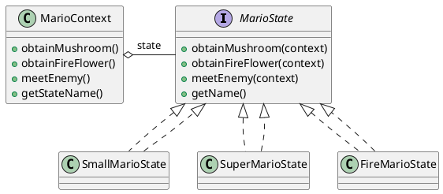

###### tags: `OOSE`

@nlhsueh 

# Ch23 物換星移：State

## 23.1 目的與動機

> 將所有關於狀態的資訊與動作都包裝在一個狀態內，使物件的狀態較易擴充或修改。

> *Allow an object to alter its behavior when its internal state changes. The object will appear to change its class*

**把狀態封裝成一個類別**。改變狀態的動作成為該類別內的方法。物件的行為通常取決於其內部的狀態。也就說，物件在不同的狀態時收到相同的訊息時，有可能會做出不同的動作(即執行不同的operation)。因此，狀態是設計方法時的一種重要考量。在大部分的情況時，狀態的作用只隱含在程式，不會特別的出現在程式的結構。在物件導向的系統分析，我們常常使用狀態來表現物件的行為。不過這也有例外，State設計樣式，就是特別將物件的狀態抽離出來成為一個類別。

假設某個類別 C 有三個狀態 s1、s2，s3，並具備以下的狀態轉移(行為)：

- s1 時收到 op1() 的事件，會移轉到 s2; 收到 op2() 的事件，會移轉到 s3。
s2 時收到 op1() 的事件，會移轉到 s3; 收到 op2() 的事件，會移轉到 s1。
- s3 時收到 op1() 的事件，會移轉到 s1; 收到 op2() 的事件，會移轉到 s2。 

過去我們的寫法會這樣：
```java=
class C {
	int s; //代表狀態的整數
	public void op1( ){
		if (s == s1)
	  		s = s2;
		else if (s == s2)
	  		s = s3;
		else if (s == s3)
	  		s = s1;
	}
	public void op2( ){
		if (s == s1)
	  		s = s3;
		else if (s == s2)
	  		s = s1;
		else if (s == s3)
	  		s = s2;
	}
}
```

這樣的缺點是-- 好多的 if else 判斷，程式因此擴展性不佳。如果新增一個狀態，程式修改的幅度較大。

> :question: 在一個象棋系統中，ChessGame 會有不同的狀態：初始、等待（一人已加入）、開始、勝負決、結束等，這些事件會決定系統對事件的處理，例如點擊棋子的事件。該如何撰寫事件處理？

## 23.2 適用時機 

- 某一個事件處理有大量的條件式，且其判斷都取決於物件的狀態時，可使用此設計樣式。State設計樣式將每一個判斷獨立成一個類別。
- 物件的狀態，及所相關的行為可能會擴充。

## 23.3 結構與方法


FIG: State

## 23.4 程式樣板

```java
// 抽象的狀態物件，規範可能的行為
interface State {
   // handle 是可能會造成狀態改變的行為
   // Context 是擁有狀態的物件
   public void op1(Context c);
   public void op2(Context c);
}

class S1 implements State {
	public void op1(Context c){
	    // change to S2
		c.setState(new S2());
	}
	public void op2(Context c){
	    // change to S3
		c.setState(new S2());
	}	
}

class S2 implements State {
	public void op1(Context c){
		c.setState(new S3());
	}
	public void op2(Context c){
		c.setState(new S1());
	}	
}

class S3 implements State {
	public void op1(Context c){
		c.setState(new S1());
	}
	public void op2(Context c){
		c.setState(new S2());
	}	
}


class Context {
	State s;
	public void request1() {
	    // 把請求委託給 state 來處理
		s.op1(this);
	}
	public void request2() {
	    // 把請求委託給 state 來處理
		s.op2(this);
	}

	public void setState(State s) {
		this.s = s;
	}
}
```

注意 handle 必須包含一個 Context 的參數，這樣狀態轉換時才能呼叫 Context 的 setState() 來改變狀態。

#### 參與者

- State：所有狀態類別的抽象父類別，用以定義狀態能夠接收的事件。
- Context：具有該狀態的物件或情境。
- ContextState：真實的狀態。方法Handle()將會是定義此狀態在執行Handle()後所到達的新狀態。

#### 優點

- 將某個狀態的所有相關行為記錄在一個物件內。
- 可以避免用一大堆的 switch/if 來做狀態行為的轉換。
- 方便修改每一個狀態行為物件。
- 方便動態增加狀態行為物件。
- 更容易瞭解每一個狀態行為的意義。

#### 缺點 

會造成較多的物件去陳述各種狀態行為。


## 23.5 範例

### 23.5.1 TCP/IP
TCP傳輸控制協定的主要工作就是負責傳送與接收網路通訊過程的資料串，當接收到一個傳送資料的命令時，TCP會建立網路要求，並將資料串分割成等長的數據封包，當獲得通訊認可時便將封包逐一傳出，並且監控目前網路狀態，必要的時候會暫停傳輸、重組封包、更換傳輸路徑等。


FIG: TCP with State design pattern


在TCP的連接控制的部分有許多的狀態處理動作，為了描述容易，我們只提出主要的四個狀態做為例子以描述State設計樣式的作用。這四個狀態分別是 Closed, Listen, Sync-Received, Establish，這些狀態會隨著方法的運作而作狀態的切換。對於 server 有三個事件會造成狀態轉移：open、sync, ack，如圖 \ref{fig_state_tcp} 所示，當 TCP 在 Closed 狀態接收到 open 的訊息後會轉移到Listen 的狀態，等待客端的連接；在 Listen 時接收到 sync 訊息後會到 sync-received 的狀態，如果再收到 sync 就會到 Established。我們可以用State設計樣式將每一個狀態判斷獨立成一個個的類別以增加設計的彈性。首先建立建立一個抽象的 TCPState 類別，描述會影響狀態改變的方法，接下來再讓每一個狀態擴充TCPState 以描述各自的轉態轉移。

```java
abstract public class TCPState{
	public abstract void open(TCPConnection c);
	public abstract void sync(TCPConnection c);
	public abstract void ack(TCPConnection c);
}
```

使用State 使其狀態類別可以宣告如下：

```java
public class TCPClosed extends TCPState{

     public void open(TCPConnection c){
        c.setState(new TCPListen());
     }     
      public void sync(TCPConnection c){} // no change
     public void ack(){} //no change

}
public class TCPListen extends TCPState {
     public void open(TCPConnection c){}     
     public void sync(TCPConnection c){
        c.setState(new TCPSyncReceived());
     }
     public void ack(){} //no change
}

public class TCPSyncReceived extends TCPState {
   ...
}

public class TCPEstablished extends TCPState {
   ...
}

```

透過加入State樣式讓每一個狀態獨立，我們便能容易新增或修改每一個狀態本身，而不會因為一個修改的動作而讓系統必須要更改許多地方，甚至發生錯誤。另外，程式碼避免使用過多的 if/else, 也可以避免錯誤。

### 23.5.2 Mario

這個範例使用 **State Design Pattern** 來模擬瑪利歐變身的邏輯，以下是簡單說明：

* **Context**：`MarioContext`: 代表瑪利歐本體，持有當前的狀態（`MarioState`）。

* **State Interface**：`MarioState`: 定義所有狀態應該實作的方法，例如 `obtainMushroom()`、`meetEnemy()`。

* **Concrete States**：
  * `SmallMarioState`：小瑪利歐
  * `SuperMarioState`：吃蘑菇變大的瑪利歐
  * `FireMarioState`：有火焰能力的瑪利歐

| 當前狀態   | 事件             | 新狀態     | 備註               |
| ---------- | ---------------- | ---------- | ------------------ |
| SmallMario | obtainMushroom   | SuperMario | 變大               |
| SmallMario | obtainFireFlower | FireMario  | 直接獲得火焰       |
| SuperMario | meetEnemy        | SmallMario | 被打一次變小       |
| FireMario  | meetEnemy        | SmallMario | 被打失去火焰再變小 |

這樣設計的好處是：

* 將每種狀態的行為封裝在各自的類別中。
* 不需大量 `if-else` 判斷。
* 易於擴充更多狀態（例如：Cape Mario、Ice Mario 等）。

```java
/* State interface */
public interface MarioState {
    void obtainMushroom(MarioContext context);
    void obtainFireFlower(MarioContext context);
    void meetEnemy(MarioContext context);
    String getName();
}

/* Concrete States */
public class SmallMarioState implements MarioState {
    @Override
    public void obtainMushroom(MarioContext context) {
        context.setState(new SuperMarioState());
        System.out.println("Mario grew to Super Mario!");
    }
    @Override
    public void obtainFireFlower(MarioContext context) {
        context.setState(new FireMarioState());
        System.out.println("Mario gained fire power!");
    }
    @Override
    public void meetEnemy(MarioContext context) {
        System.out.println("Mario is small and got hit. Game Over!");
    }
    @Override
    public String getName() { return "Small Mario"; }
}

public class SuperMarioState implements MarioState {
    @Override
    public void obtainMushroom(MarioContext context) {
        System.out.println("Mario is already Super.");
    }
    @Override
    public void obtainFireFlower(MarioContext context) {
        context.setState(new FireMarioState());
        System.out.println("Mario gained fire power!");
    }
    @Override
    public void meetEnemy(MarioContext context) {
        context.setState(new SmallMarioState());
        System.out.println("Mario reverted to Small Mario.");
    }
    @Override
    public String getName() { return "Super Mario"; }
}

public class FireMarioState implements MarioState {
    @Override
    public void obtainMushroom(MarioContext context) {
        System.out.println("Mario is already Fire Mario.");
    }
    @Override
    public void obtainFireFlower(MarioContext context) {
        System.out.println("Mario already has fire power.");
    }
    @Override
    public void meetEnemy(MarioContext context) {
        context.setState(new SmallMarioState());
        System.out.println("Mario lost power and reverted to Small Mario.");
    }
    @Override
    public String getName() { return "Fire Mario"; }
}

/* Context */
public class MarioContext {
    private MarioState state;

    public MarioContext() {
        this.state = new SmallMarioState();
    }

    public void setState(MarioState state) {
        this.state = state;
    }

    public void obtainMushroom() {
        state.obtainMushroom(this);
    }

    public void obtainFireFlower() {
        state.obtainFireFlower(this);
    }

    public void meetEnemy() {
        state.meetEnemy(this);
    }

    public String getStateName() {
        return state.getName();
    }
}

/* Usage example */
public class Game {
    public static void main(String[] args) {
        MarioContext mario = new MarioContext();
        System.out.println(mario.getStateName());      // Small Mario
        mario.obtainMushroom();                        // grow to Super Mario
        System.out.println(mario.getStateName());      // Super Mario
        mario.obtainFireFlower();                      // gain fire
        System.out.println(mario.getStateName());      // Fire Mario
        mario.meetEnemy();                              // hit by enemy
        System.out.println(mario.getStateName());      // Small Mario
    }
}
```



## 23.CHK

1. State 樣式中，保存物件狀態的類別為
	 - Context 
	 - Observer 
	 - Strategy 
	 - Proxy	

2. 為何 State.handle() 需要帶 Context 參數？
	- state 需要觀看 context 物件的值 
	- state 需要設定 context 的新狀態 
	- state 需要讀取 context 的狀態值	

3. 關於 State 樣式，何者錯誤？
	- Context 把改變物件狀態的動作延遲到其子類別
	- State 內所宣告的方法為可能改變狀態的方法 
	- 若有 n 種可能狀態則會宣告 n 個 concrete state 類別 
	- Context 把狀態改變的工作委託給 State 物件

## 23.EX

### 23.ex01
有一個物件 A，當它接受到訊息 request $r$ ，所表現出來的行為取決於他目前的狀態 s1, s2, s3。狀態轉移如下：
    - s1--> s2
    - s2--> s3
    - s3--> s1
(1) 請用 if else 的方式（不要用 state 樣式）來進行狀態的改變; (2) 狀態的個數在日後可能是會變動的，所以我們不想要固定在物件 A 中，請用 State 設計樣式來設計此程式。

- 下圖是物件 Context 的狀態行為，請用 State design pattern 設計之。


