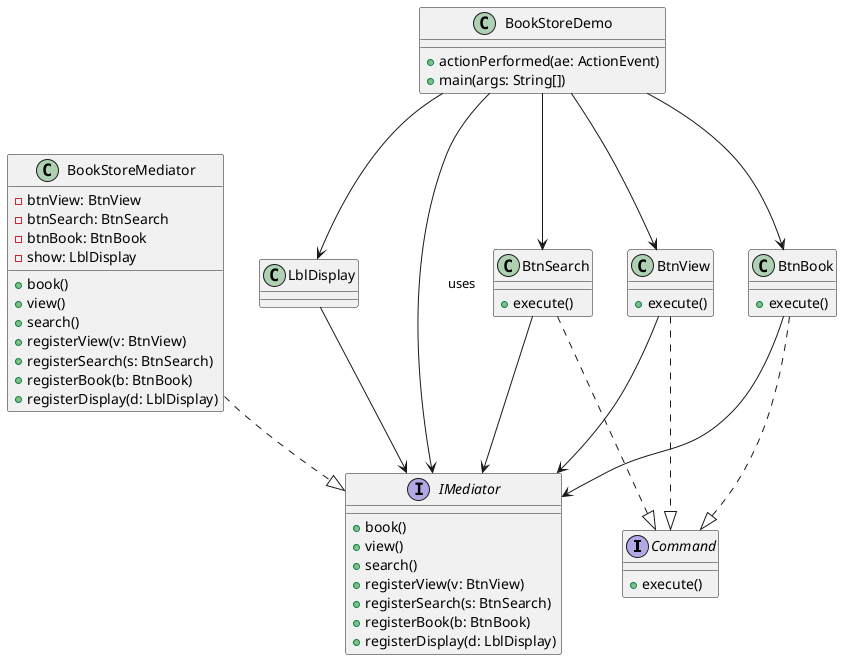

###### tags: `OOSE`
@nlhsueh 

# Ch24 七星聚會：Mediator
## 24.1 目的與動機

> 定義一個物件來封裝物件間的互動，避免讓物件直接對話藉此降低彼此耦合力。

> *Define anobject that encapsulates how a set of objects interact. Mediator promotes loose coupling by keeping objects from referring to each other explicitly, and it lets you vary their interaction independently.*

一群物件，統一透過一個物件來傳話。

## 24.2 應用時機

- 物件間有複雜的溝通行為; 因此，想要重用這些物件變得困難，因為他和其他物間的耦合力太強了。
- 物件間的互動有變化時，方便修改，不會動到個別物件的內部

## 24.3 結構與方法


FIG: Mediator


**參與者**

- Mediator: 抽象中介。定義同儕物件互動的介面
- ConcreteMediator: 實體中介。定義同儕物件間的互動行為
- Colleague: 同儕物件。與中介物件溝通的物件。

## 24.4 程式樣板

```java
package mediator.template;

public class MediatorTemplate {

	public static void main(String[] args) {
		IMediator med = new Mediator();

		// 生成 colleague 時，設定其 Mediator
		Colleague1 c1 = new Colleague1(med);
		Colleague2 c2 = new Colleague2(med);

		// 送訊息給 c1, c2
		c1.m1();
		c2.m2();
	}
}

interface IMediator {
	void m1();

	void m2();

	void registerColleague1(Colleague1 c);

	void registerColleague2(Colleague2 c);
}

class Mediator implements IMediator {
	Colleague1 c1;
	Colleague2 c2;

	// 雖然 m1 是給 Colleague1 的訊息，但會轉給 mediator
	// mediator 來決定會與哪些其他 Colleague 互動
	public void m1() {
		System.out.println("Mediator m1");
		c2.op2();
	}

	public void m2() {
		System.out.println("Mediator m2");
		c1.op1();
	}

	// Mediator 必須識得每一個 Colleague
	public void registerColleague1(Colleague1 c) {
		this.c1 = c;
	}

	public void registerColleague2(Colleague2 c) {
		this.c2 = c;
	}

}

abstract class Colleague {
	protected IMediator med;

	public Colleague(IMediator med) {
		this.med = med;
	}
}

class Colleague1 extends Colleague {
	public Colleague1(IMediator med) {
		super(med);
		med.registerColleague1(this);
	}

	void m1() {
		System.out.println("Colleague1.m1");
		med.m1();
	}

	void op1() {
		System.out.println("Colleague1.op1");
	}
}

class Colleague2 extends Colleague {
	public Colleague2(IMediator med) {
		super(med);
		med.registerColleague2(this);
	}

	void m2() {
		System.out.println("Colleague2.m2");
		med.m2();
	}

	void op2() {
		System.out.println("Colleague2.op2");
	}
}
```


## 24.5 範例

### 24.5.1 BookStore
想像一個 BookStore, 使用者可以上線點擊預定書籍、觀看書籍及搜尋書籍。當我們按下某一個鍵時，其他的元件會改變狀態。


**元件角色對應**

| 角色                               | 類別                                            | 說明                                                                       |
| ---------------------------------- | ----------------------------------------------- | -------------------------------------------------------------------------- |
| **Mediator (中介者介面)**          | `IMediator`                                     | 定義按鈕與顯示元件的協調方法：`book()`、`view()`、`search()`、註冊方法等。 |
| **Concrete Mediator (具體中介者)** | `BookStoreMediator`                             | 負責真正協調各個 GUI 元件的行為與狀態切換。                                |
| **Colleague (同事類別)**           | `BtnView`, `BtnSearch`, `BtnBook`, `LblDisplay` | 每個元件只與 Mediator 溝通，不與彼此直接互動。                             |
| **Client (使用者介面建立者)**      | `BookStoreDemo`                                 | 建立所有元件與中介者的實例，構成系統。                                     |


**狀態變化協調邏輯**

當使用者按下按鈕（例如 `BtnView`）時：

1. 該按鈕觸發事件並呼叫 `execute()` 方法。
2. `execute()` 方法內部呼叫 mediator（`med.view()`）。
3. `BookStoreMediator` 負責執行以下操作：
   * 設定哪些按鈕啟用/停用（如：`btnView.setEnabled(false)`）。
   * 更新顯示文字（如：`show.setText("Viewing...")`）。
   * 確保只有一個操作進行中。

元件之間不需要彼此認識，只需知道 mediator。**

| 優點         | 說明                                                        |
| ------------ | ----------------------------------------------------------- |
| **解耦合**   | 按鈕之間不需彼此知道，只透過 mediator 溝通，程式更模組化。  |
| **集中管理** | 所有邏輯在 `BookStoreMediator` 裡統一管理，便於維護與修改。 |
| **彈性擴充** | 要新增新按鈕或功能，只需修改或擴充 mediator，而非所有按鈕。 |



以下為程式碼

```java
package mediator;

import java.awt.Font;
import java.awt.event.ActionEvent;
import java.awt.event.ActionListener;

import javax.swing.JButton;
import javax.swing.JFrame;
import javax.swing.JLabel;
import javax.swing.JPanel;

public class BookStoreDemo extends JFrame implements ActionListener {
	IMediator med = new BookStoreMediator();

	BookStoreDemo() {
		JPanel p = new JPanel();
		p.add(new BtnView(this, med));
		p.add(new BtnBook(this, med));
		p.add(new BtnSearch(this, med));
		getContentPane().add(new LblDisplay(med), "North");
		getContentPane().add(p, "South");
		setSize(300, 100);
		setVisible(true);
		setDefaultCloseOperation(JFrame.EXIT_ON_CLOSE);
	}

	// 所有的 Colleague 都有統一的介面：Command
	public void actionPerformed(ActionEvent ae) {
		Command comd = (Command) ae.getSource();
		comd.execute();
	}

	public static void main(String[] args) {
		new BookStoreDemo();
	}
}

// Colleague interface
interface Command {
	void execute();
}

```
IMediatro 和 BookStoreMediator 的設計：

```java
// Abstract Mediator, 定義所有 Mediator 的規格
interface IMediator {
	public void book();

	public void view();

	public void search();

	public void registerView(BtnView v);

	public void registerSearch(BtnSearch s);

	public void registerBook(BtnBook b);

	public void registerDisplay(LblDisplay d);
}

// Concrete mediator
class BookStoreMediator implements IMediator {

	BtnView btnView;
	BtnSearch btnSearch;
	BtnBook btnBook;
	LblDisplay show;

	// 註冊後 mediator 才知道 BtnView
	public void registerView(BtnView v) {
		btnView = v;
	}

	public void registerSearch(BtnSearch s) {
		btnSearch = s;
	}

	public void registerBook(BtnBook b) {
		btnBook = b;
	}

	public void registerDisplay(LblDisplay d) {
		show = d;
	}

	// book 時所有需要溝通設定的都在這裡進行
	public void book() {
		btnBook.setEnabled(false);
		btnView.setEnabled(true);
		btnSearch.setEnabled(true);
		show.setText("Booking...");
	}

	// view 時所有需要溝通設定的都在這裡進行
	public void view() {
		btnView.setEnabled(false);
		btnSearch.setEnabled(true);
		btnBook.setEnabled(true);
		show.setText("Viewing...");
	}

	// search 時所有需要溝通設定的都在這裡進行
	public void search() {
		btnSearch.setEnabled(false);
		btnView.setEnabled(true);
		btnBook.setEnabled(true);
		show.setText("Searching...");
	}
}
```

各具體 Colleague 的設計：

```java
// A concrete colleague
class BtnView extends JButton implements Command {
	IMediator med;

	// colleague 也需要知道 mediator
	BtnView(ActionListener al, IMediator m) {
		super("View");
		addActionListener(al);
		med = m;
		med.registerView(this);
	}

	// 轉呼叫 medicator 來處理
	public void execute() {
		med.view();
	}
}

// A concrete colleague
class BtnSearch extends JButton implements Command {
	IMediator med;

	BtnSearch(ActionListener al, IMediator m) {
		super("Search");
		addActionListener(al);
		med = m;
		med.registerSearch(this);
	}

	public void execute() {
		med.search();
	}

}

// A concrete colleague
class BtnBook extends JButton implements Command {
	IMediator med;

	BtnBook(ActionListener al, IMediator m) {
		super("Book");
		addActionListener(al);
		med = m;
		med.registerBook(this);
	}

	public void execute() {
		med.book();
	}

}

class LblDisplay extends JLabel {
	IMediator med;

	LblDisplay(IMediator m) {
		super("Just start...");
		med = m;
		med.registerDisplay(this);
		setFont(new Font("Arial", Font.BOLD, 24));
	}
}
```

## 24.CHK 

1. Medicator 的目的為何？
	- 作為一群物件溝通的橋樑，藉此降低彼此的耦合度
	- Mediator 作為代理物件，藉此降低網路負擔，提昇效能
	- 一群物件不需要特別觀察其他物件的狀態，Mediator 會自動的通知
	- 統整相關物件的介面為唯一，藉此提昇 client 設計的簡潔性		

2. 關於 Medicator 何者正確
	- Medicator 與所有的 Colleague 有 bi-direction 的 navigation 的關係
	- Colleague 彼此的關係是密切的，但透過 Medicator 的仲介，耦合度降低了
	- Medicator 透過委託的方式把訊息傳給其他 Colleague 物件處理事件
	- 塔台的運作可視為是一種 Mediator- 所有的交通工具與塔台溝通，而非彼此相乎溝通。	

3. 如果某個 Medicator 收到訊息後都必須通知其他所有的 Colleague, 那們 Medicator 的角色和 Observer 樣式中的 Observable 是不是一樣？有何差異？ Colleague 和 Observer 有何差異？

4. 在一個專案系統中，客戶、系統分析師、軟體工程師、系統維護工程師、使用者需要常常溝通，但彼此又不知道該與誰溝通，溝通的技巧為何。如何解決這個問題？哪一個設計樣式比較適合解決這個問題？樣式的角色對應為何？

## 24.EX

### 24.ex01 Chess

設計一個象棋操作介面，使用 Mediator 設計模式來協調按鈕與狀態顯示的行為。畫面包含以下元件：

* 按鈕 BtnSelect（選擇棋子）
* 按鈕 BtnMove（移動棋子）
* 按鈕 BtnCancel（取消操作）
* 標籤 StatusLabel（顯示目前狀態）

狀態顯示範例如下：

* "Please select a piece..."
* "Piece selected. Ready to move."
* "Move done."
* "Action cancelled."

**角色與對應類別：**

* Mediator 介面：`IGameMediator`。定義方法：`select()`, `move()`, `cancel()`, 以及註冊各元件的方法
* Concrete Mediator：`ChessMediator`。控制哪些按鈕啟用、顯示哪個訊息
* Colleague（同事類別）：
  * `BtnSelect`、`BtnMove`、`BtnCancel`（三個按鈕）
  * `StatusLabel`（顯示狀態）
* 主畫面類別：`ChessGameUI`
  * 建立畫面、元件與 Mediator，並負責註冊

**實作建議：**

1. 所有按鈕都實作 `Command` 介面，呼叫 Mediator 的對應方法
2. Mediator 根據目前狀態控制按鈕 enable/disable 狀態
3. 用 Java Swing 完成基本 UI（可以參考之前 BookStoreDemo 的結構）

**學習重點：**

* 了解如何用 Mediator 模式解耦各 UI 元件間的互動
* 讓邏輯集中在 Mediator 中，提升可維護性與清晰度

**進階挑戰（可選）：**
* 增加棋盤圖示（非必要）
* 增加 Undo 功能（可結合 Command 模式）

