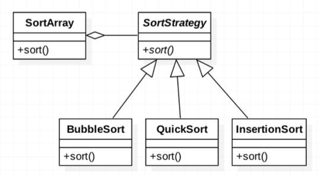
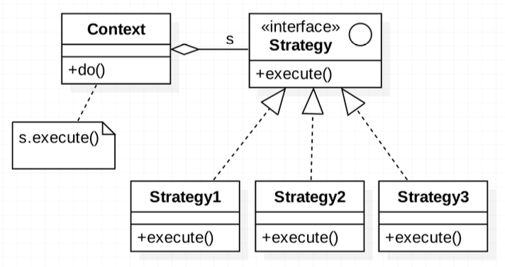
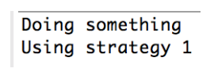

###### tags: `OOSE`

# Ch18 一法萬策：Strategy


## 18.1 目的與動機

> 定義一群演算法，將每一個封裝成一個類別且使之可互換。使用 `Strategy` 讓演算法獨立於使用者。
>> Define a **family of algorithms**, encapsulate each one, and make them **interchangeable**. `Strategy` lets the algorithm vary independently from clients that use it.

### 18.1.1 動機

在很多種情況我們都會用到策略樣式。假設我們開發一個應用程式，其中會對某個陣列做排序。也許我們一開始會用氣泡排序法，且知道以後這個演算法可以改善，例如用 quick sort, selection sort。我們不希望抽換這些排序方法的時候會對其他程式造成影響，也就是說，我們應該符合 OCP 原則。我們該怎麼設計？

Solution: 使用strategy 設計樣式，將各種不同的排序抽象出來：


FIG: `Strategy` 

### 18.1.2 Sort

[src/SortStrategyExample.java](src/SortStrategyExample.java)

[gugu- `Strategy`](https://refactoring.guru/design-patterns/strategy)

## 18.2 結構與方法

### 18.2.1 結構


FIG: `Strategy` Structure


### 18.2.2 程式樣板


[src/StrategyTemplate.java](src/StrategyTemplate.java)

執行結果如下：




#### 優點

- 消除大量的 if-else 等判斷句。過去我們可能用 if 來改變要使用的演算法。採用策略樣式，我們透過多型來達到此目的，避免過多的判斷句。
- 演算法的動態抽換。


#### 缺點

- 此設計會造成比較多的類別。過去用 if 造成一個很大的方法，用 `Strategy` 可以避免這個大方法，但類別就會多一些。
- 所有的演算法必須符合相同的介面。因為有一個抽象的策略類別被繼承，大家都要實作相同的介面。

## 18.3 範例

### 18.3.1 LayoutManager

Java 的 GUI 容器物件也是利用策略設計樣式來改變它的排版的。

[src/LayoutDemo.java](src/LayoutDemo.java)

### 18.3.1 Validator/Verifier

驗證器。各種不同的輸入需要做不同的驗證，我們可以把驗證器獨立於輸入元件，這樣輸入元件就可以客製化的設計驗證器了。例如生日格式的驗證、電話格式的驗證等都需要特別的驗證方式。

```java
myTextField.setInputVerifier(new MyInputVerifier());
```

我們自己擴充 [`InputVerifier`](https://docs.oracle.com/javase/7/docs/api/javax/swing/InputVerifier.html)：

[src/VerifierTest.java](src/VerifierTest.java)

## 18.4 討論

> `Strategy` 是換骨，`Decorator` 是換皮；為什麼？


## 18.CHK

1.  關於 `Strategy` 設計樣式是把策略：
    A) 延遲到子類別決定
    B) 委託給另一個物件
    C) 包裝成一個複合物件
    D) 限制只能產生一份演算法


2.  在 `Strategy` 中，若我們要擴充一個新的演算法：
    A) 新增一個 `Strategy` 介面
    B) 新增一個實踐 `Strategy` 介面的類別
    C) 在方法中新增一個 `Strategy` 參數
    D) 宣告一個 `static` 方法


3.  `Swing` 的排版設計採用了 `Strategy` 的設計，其中 `BorderLayout` 相對於 `Strategy` 樣式中的哪一個角色？
    A) `Context`
    B) `Abstract strategy`
    C) `Concrete strategy`
    D) `execute()`

4.  關於 `InputVerifier`, 以下何者錯誤：
    A) 採用了 `Strategy` 來提升檢查欄位的彈性，降低修改程式的範圍
    B) 透過新增 `InputVerifier` 的子類別來產生新的檢查器
    C) `TextField` 透過 `setInputVerifier()` 來設定不同的檢查器
    D) `TextField` 一旦設定了檢查器，就不可更換

---

參考答案：

1.  關於 `Strategy` 設計樣式是把策略：
    **B) 委託給另一個物件**
    說明：`Strategy` 模式的重點在於將演算法的實作委託給獨立的策略物件，讓 `Context` 物件可以彈性地切換和使用不同的策略。

2.  在 `Strategy` 中，若我們要擴充一個新的演算法：
    **B) 新增一個實踐 `Strategy` 介面的類別**
    說明：擴充新的演算法需要創建一個新的 `Concrete Strategy` 類別，該類別實作了 `Strategy` 介面定義的行為。

3.  `Swing` 的排版設計採用了 `Strategy` 的設計，其中 `BorderLayout` 相對於 `Strategy` 樣式中的哪一個角色？
    **A) Context**
    簡單解釋：`BorderLayout` 就像 `Strategy` 模式中的 `Context`，它持有並使用不同的排版策略（例如 `FlowLayout`、`GridLayout` 等）來管理元件的佈局。

4.  關於 `InputVerifier`, 以下何者錯誤：
    **D) `TextField` 一旦設定了檢查器，就不可更換**
    說明：`JTextField` 的 `setInputVerifier()` 方法可以讓你隨時設定或更換不同的 `InputVerifier` 物件，提供了動態切換驗證策略的能力。


## 18.EX

### 18.ex01 QuizApp
線上考試系統，選擇題的出題方式可以分為 (1) 按照原來項目順序出題 (2) 隨機把項目打亂出題 (3) 依據困難度排序。請問是否適合用 `Strategy` 設計？為什麼？該如何設計？

### 18.ex02 GradeBook
class GradeBook 需要排序，如何應用 `Strategy` 讓排序演算法靈活變更？

```java
class GradeBoook {
   ?    
}

interface ? 

class ?
```

### 18.ex03 SSNVerifier
擴充 Java `InputVerifier` 設計一個台灣身分證的 `SSNVerifier`。並應用這個 `Verifier` 在一個簡單應用程式。

<!-- 
[src/SSNVerifier.java](src/SSNVerifier.java)
 -->