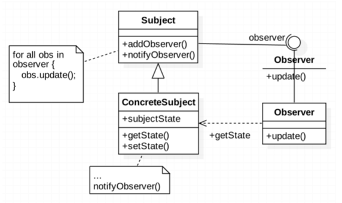
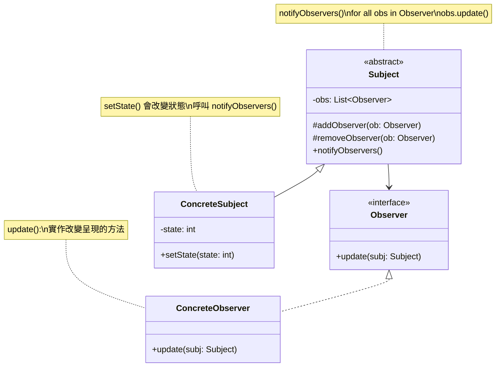
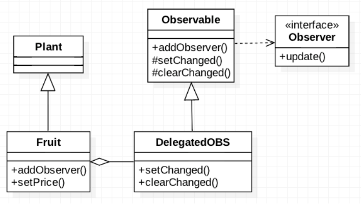
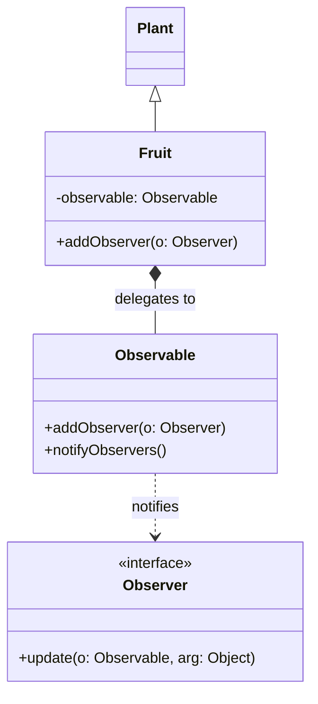
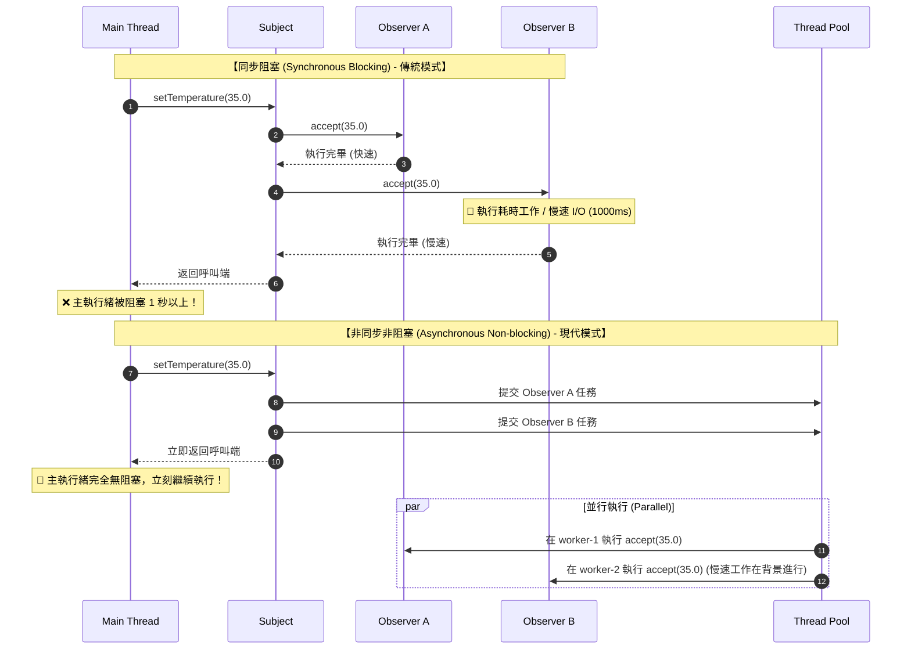
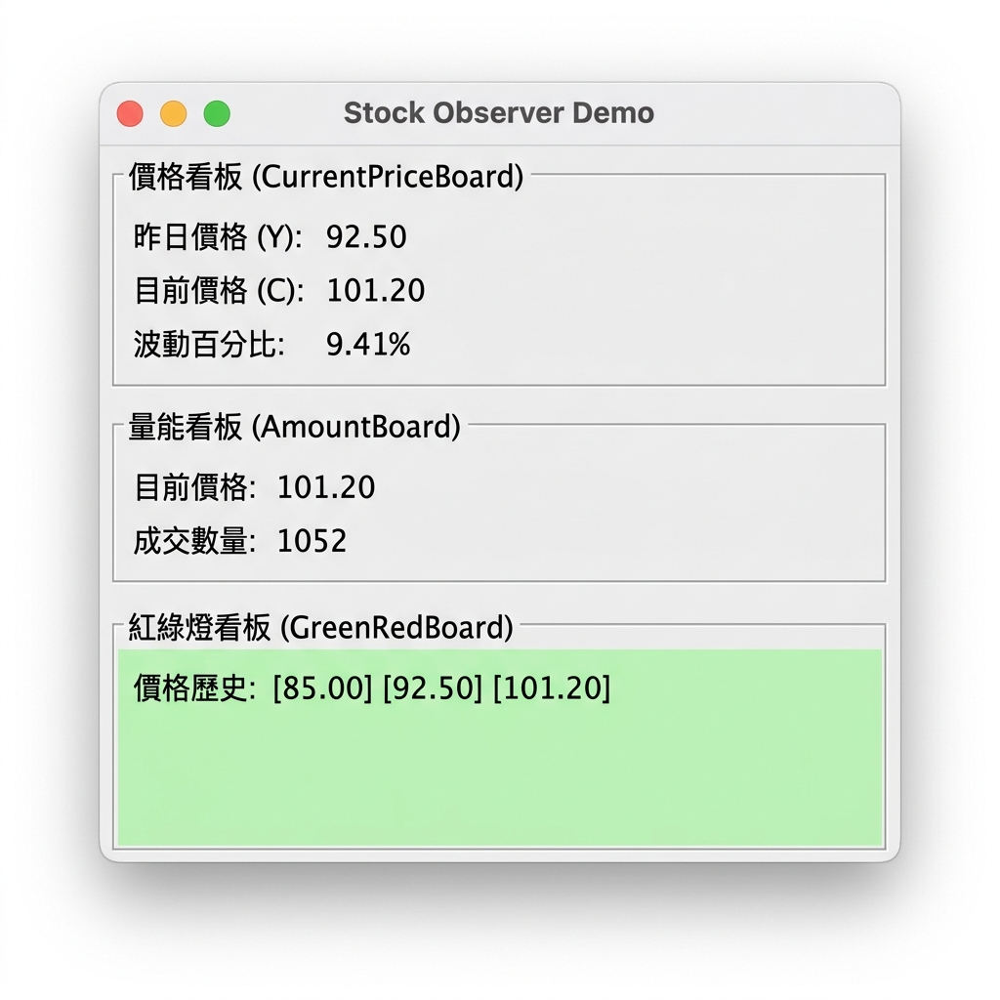

###### tags: `OOSE`

# Ch20 眾觀其變：Observer

## 20.1 目的與動機

> 定義一個「一對多」的相依關係，使得當「一」的物件狀態改變時，所有相依於「一」的「多」物件會被通知到並作適當的修改。

> *Define a one-to-many dependency between objects so that when one changes state, all its dependents are notified and updated automatically*

**動機**

- 當股價變動時，跟著呼叫介面物件做修改。股價的資料屬於資料物件（model），介面物件屬於 view。資料物件直接呼叫介面物件是一種不好的設計，因為介面物件的變動性大，資料物件會因為介面物件的改變而需要做改變。
- 介面物件每隔一段時間去讀取資料物件。問題是：我們無法知道多久該去讀取一次。

### 方案1: Polling 

讓 Viewer 定期的去取得資料的狀態，然後更新。這樣的問題是：我們該多久去取一次？1 秒？10 秒？時間過於密集可能會浪費頻寬、過於鬆散可能取得不正確的資料。

### 方案2: 個別通知

```java
class Stock {
    price ...;
    public priceChange(int newPrice) {
       this.price = newPrice;

       //三個 view 三個不同的方法。耦合度高，不好的設計
       view1.refesh();
       view2.update();
       view3.reload();
    }
}
```

**方案2** 是直覺的方法，當狀態改變時就叫每一個呈現去修改，但呈現是變動的，不該企業邏輯放在一起。如果我們增加一個新的介面、更換成 Android 或是 HTML 的介面是不是企業邏輯也要跟著修改呢？

如何解決這個問題呢？答案是 `Observer` 設計模式。在 `Observer` 中，像股價等資料通常被稱主體(`Subject`)或被觀察者（`Observable`），而呈現方式則稱為觀察者(`Observer`)。

### 應用時機
- 當後端資料有所變更，有必須即時的更新前端資料呈現。
- 當一個事務有兩個角度，其中一個角度相依於另一個。

## 20.2 結構與方法



###  20.2.1 結構


FIG: `Observer` Structure

### 20.2.2 參與者
- `Subject` (`Observable`)：定義一個有多個觀察者的資料的基本資料型態與介面。其中的`addObserver()`表示加入一個新的 `observer`，而 `notifyObserver()` 表示要通知所有與其相關的觀察者。
-  `ConcreteSubject` (`ConcreteObservable`)：實際的被觀察者。
-  `Observer`：定義一個觀察者的基本結構與介面，其中的update()給觀察者收到被觀察者資料異動訊息時的處理程序。
-  `ConcreteObserver`：實際的觀察者。

### 20.2.3  程式樣板

Java 已經針對這個設計樣式設計了一個API, 其中 [Observable](https://docs.oracle.com/javase/7/docs/api/java/util/Observable.html) 相對於 Subject, [Observer](\href{https://docs.oracle.com/javase/7/docs/api/java/util/Observer.html) 則名稱不變。

Java 從第九版以後取消了 `Observable` 和 `Observer`, 所以以下程式需要下載 JDK 8 來執行。

[src/ObserverTemplate.java](src/ObserverTemplate.java)

**優點**

分離了資料模組與呈現模組使得溝通能夠更容易廣泛的被應用，當資料變更不需觀察者做出更新動作才能更新，保持資料呈現的一致性。

[gugu](https://refactoring.guru/design-patterns/observer)

## 20.3 範例

### 20.3.1 `Observable` 的應用

[src/FruitExample.java](src/FruitExample.java)

為何需要先 `setChanged()` 再呼叫 `notifyObserver()`? 因為 `notifyObserver` 是 `public` 的，外部物件可以呼叫 `notifyObserver`，但物件的狀態可能沒有變化。`notifyObserver()` 會先檢查是否 `hasChanged()`, 如果有才會呼叫 `update()`。`Fruit` 自己可以確定狀態改變時執行 `setChanged()` 以保證 `update()` 的執行。`notifyObservers()` 內部在執行完 `update()` 後也會呼叫 `clearChanged()`。有時候我們會變更一連串的狀態後才會 `setChanged()`, 允許通知其他的 `Observers`。

接著來看看 `Observer` 這一端：

```java
public class Monkey implements Observer {
    float price;
    public void update(Observable obj, Object newValue) {
       if (newValue instanceof Float) {
           price = ((Float)newValue).floatValue();
           System.out.println("水果價格變成" + price);
        }
     }
}
```

`WineMaker` 也關心價格波動，是另一個觀察者，當價格有變動時，它就會有所反應。

```java
public class WineMaker implements Observer {
    float originalPrice;
    public void update(Observable obj, Object newValue) {
       if (newValue instanceof Float) {
           price = ((Float)newValue).floatValue();
		   if ( (price-originalPrice)/price < -0.1)
		      System.out.println("Can make wine");
		   else
		      System.out.println("too expensive");
        }
     }
}
```

來看看主程式

```java
public class TestObservers {
   public static void main(String args[]) {
      // Create the Subject and Observers.
      Fruit s = new Fruit("Grape", 1.29f);
      Monkey jj = new Monkey();
      WineMaker wm = new WineMaker();

      // Add those Observers!
      s.addObserver(jj);
      s.addObserver(wm);

      //make changes to the Subject.
      s.setPrice(4.57f);
      s.setPrice(9.22f);
   }
}
```

API 中 `Observerable` 是如何設計的？

```java
public class Observable {
   private boolean changed = false;
   private Vector obs;

   public Observable() {
      obs = new Vector();
   }
   
   public synchronized void addObserver(Observer o) {
      if (o == null)  throw new NullPointerException();
      if (!obs.contains(o)) {
          obs.addElement(o);
      }
   }
}
```

`notifyObservers()` 的程式碼：

```java
public void notifyObservers(Object newValue) {
   Object[] arrLocal;
   
   synchronized (this) {
       if (!changed)
          return;
       arrLocal = obs.toArray();
       clearChanged();
    }
 
    for (int i = arrLocal.length-1; i>=0; i--)
        ((Observer)arrLocal[i]).update(this, newValue);
}
```

### 20.3.2 委託的應用 

如果 `ConcreteSubject` 已經有繼承了另一個類別了，無法繼承 `Observable` 那該怎麼辦？我們可以用委託的方式把 `observable` 委託給 `delegatedObservable`。

[src/FruitDelegationExample.java](src/FruitDelegationExample.java)



<!-- 

-->

FIG: `Observer` with delegation

#### 私有漏洞 

各位可以看到第 9-10 行的 `s.getObservable().addObserver(nameObs)`，先透過 `getObservable()` 獲得 `Observable` 物件，再透過它來作 `addObserver` 的動作。這樣的缺點是外界的物件很容易取得 `Observable` 的參考，就有可能拿著這個參考胡作非為（例如 `deleteObserver()`）。為了避免這種狀況，我們新增 `addObserver()` 這個方法，在裡面進行委託；並且移除 `getObservable()` 的方法，避免私有漏洞的可能。

```java
public class Fruit extends Plant {
   ...
   public void addObserver(Observer o) {
       observable.addObserver(o);
   }
   ...
}
```

### 20.3.3 `ActionListener`

JAVA 的 event model 與 Observer 的架構類似。

- AbstractButton => Observable; fireActionListener() => notifyObserver()
- ActionListener => Observer; actionPerformed() => update()

其中的 `AbstractButton` 就相當於 `Observer` 中的 `Observable`，而向它註冊的就是那些監聽事件發生的類別，也就是實作 `ActionListener` 的物件 (Event Handler)。由於 `JButton` 本身已是 `AbstractButton` 的子類別，我們只要直接在 `JButton` 的實作中加入事件監聽者即可：

[src/EventModelExample.java](src/EventModelExample.java)

`AbstractButton` 內的 `fireActionPerformed()` 相當於 `Observable` 內的 `notifyObservers()`，但我們不需要去呼叫它，因為當我們按下 `Button` 時會直接呼叫 `fireActionPerformed()`，進而呼叫所有的 `ActionListener` 內的 `actionPerformed()`。

有時候程式不是很複雜時，事件的發生與處理在同一個類別內，所以常可以看到這樣的程式碼：

```java
class TestEventModel2 extends JFrame implement ActionListener {
   ...
   b1.addActionListener(this);
   public void actionPerformed(ActionEvent e){
      ...
   }
}
```

此時的 `TestEventModel2` 同時兼具了 event source 與 event listener 的功能，亦即觀察者與被觀察者的雙重身分。

## 20.4 Java Consumer

儘管 `Observable` 和 `Observer` 提供了一個簡單的方式來實現觀察者模式，但是這些類存在一些限制，因此不再建議使用。`Observable` 是一個具體的類別，而不是一個介面。使用起來並不方便。現在更常用的方法是使用介面來實現觀察者模式，而不是繼承 `Observable` 類。例如，你可以使用 Java 8 引入的函數式介面 `Consumer` 來定義觀察者的處理邏輯。

在 Java 中，`Consumer<T>` 是一個函式式介面（functional interface），其定義如下：

```java
@FunctionalInterface
public interface Consumer<T> {
    void accept(T t);
}
```

這個介面接收一個類型為 `T` 的參數，並執行某些動作，沒有回傳值。你可以使用 `Consumer<T>` 來代表每一個「觀察者」的回呼函式（callback function）。假設我們有一個氣象站（WeatherStation）會通知溫度變化，觀察者會收到新的溫度資料。

步驟 1：建立 Subject

[src/WeatherStationConsumer.java](src/WeatherStationConsumer.java)

步驟 2：加入觀察者（Observers）

(見 [src/WeatherStationConsumer.java](src/WeatherStationConsumer.java))

### 多執行緒非同步設計與效能比較

在實際的系統開發中，觀察者（Observer）在收到通知後，往往需要執行較重的任務，例如：
1. 將資料寫入資料庫
2. 呼叫外部的第三方 API
3. 進行複雜的數據運算與分析

如果採用傳統單執行緒的 `Observer` 模式，一旦某個觀察者執行緩慢，將會造成嚴重的**阻塞（Blocking）**，使得後續所有的觀察者都必須排隊等待，甚至拖慢發送通知的主執行緒（例如使用者介面 UI 執行緒）。

使用 Java 8 的 `Consumer` 結合高併發資料結構與執行緒池，可以非常優雅且高效地解決這個問題。

**多執行緒非同步範例**

我們可以將 `WeatherStation` 修改為 `WeatherStationAsync`，將內部的資料結構換成執行緒安全的 `CopyOnWriteArrayList`，並在通知時使用 `CompletableFuture.runAsync()` 將通知任務交由非同步的執行緒池（預設為 `ForkJoinPool.commonPool()`）來執行。

在主程式中，我們模擬一個快速的觀察者 A 與一個需要耗時 1 秒處理的慢速觀察者 B：

[src/WeatherStationConsumerAsync.java](src/WeatherStationConsumerAsync.java)


**執行結果分析：**
```text
[Thread: main] Temperature changed to: 28.5
[Thread: main] Temperature changed to: 35.0
[Thread: main] Main thread continues immediately without waiting for observers!
[Thread: ForkJoinPool.commonPool-worker-1] Observer A (Quick): Temperature is 28.5
[Thread: ForkJoinPool.commonPool-worker-3] Observer A (Quick): Temperature is 35.0
[Thread: ForkJoinPool.commonPool-worker-2] Observer B (Slow) started processing for 28.5°C...
[Thread: ForkJoinPool.commonPool-worker-4] Observer B (Slow) started processing for 35.0°C...
[Thread: ForkJoinPool.commonPool-worker-2] Observer B (Slow) finished processing for 28.5°C.
[Thread: ForkJoinPool.commonPool-worker-4] Observer B (Slow): It's too hot! (35.0°C)
[Thread: ForkJoinPool.commonPool-worker-4] Observer B (Slow) finished processing for 35.0°C.
```
從輸出結果可以清楚看到：
- 主執行緒 `main` 在觸發溫度變更後，**沒有被 Observer B 的 1 秒延遲卡住**，而是立刻印出 `Main thread continues immediately...` 並繼續執行。
- 各個觀察者都是在 `ForkJoinPool` 的非同步工作執行緒（如 `worker-1`, `worker-2`）中**並行（Parallel）執行**，大幅提昇了整體的輸送量（Throughput）。

> 為什麼這個非同步 Consumer 設計比傳統 `Observable` 效能更好？

主要有以下四大核心原因：

| 比較維度 | 傳統 `java.util.Observable` | 現代非同步 `Consumer` (搭配 `CompletableFuture`) |
| :--- | :--- | :--- |
| **執行緒模型** | **同步單執行緒 (Synchronous)**<br>所有 Observer 的 `update` 都在發送端的執行緒中依序（Sequential）執行。 | **非同步多執行緒 (Asynchronous)**<br>利用執行緒池，將通知與具體任務分派至不同工作執行緒並行處理。 |
| **阻塞特性** | **阻塞式 (Blocking)**<br>若其中一個 Observer 發生延遲（如慢速 I/O），會卡死後續所有 Observer 的通知以及發送端主執行緒。 | **非阻塞式 (Non-blocking)**<br>發送端只負責分派任務，任務由執行緒池非同步消化，各 Observer 互不干涉。 |
| **鎖的競爭<br>(Lock Contention)** | **高鎖開銷**<br>內部使用 `Vector`，且 `notifyObservers()` 方法在複製陣列時對整個物件使用 `synchronized (this)` 進行強鎖定，高併發下會造成嚴重執行緒阻塞。 | **低鎖/無鎖讀取**<br>使用 `CopyOnWriteArrayList`。其採「寫時複製」機制，在通知（讀取）時完全不加鎖，極適合「註冊少、通知頻繁」的觀察者場景。 |
| **可擴展性與<br>資源控制** | **極低**<br>無法限制執行緒資源，也沒有線程池重複利用機制，難以適應現代高併發系統。 | **極高**<br>可透過 `CompletableFuture` 靈活指定自訂執行緒池（`Executor`），防止資源耗盡，具備極佳的資源控制力。 |

> 同步 vs. 非同步通知示意圖

下圖直觀地呈現了同步阻塞與非同步非阻塞在執行緒模型與執行流程上的核心差異：




## 隨堂測驗

1. `Observer` 設計樣式主要有兩個物件：`Subject` 與 `Observer`: 
   A) 一個 `Subject`，會有多個 `Observer` 與之關聯
   B) 一個 `Observer`，會有多個 `Subject` 與之關聯
   C) 一個 `Observer` 只能對應一個 `Subject` 
   D) `Subject` 與 `Observer` 之間的關聯式多對多的關聯

   <details>
   <summary>解答</summary>
   
   **A) 一個 `Subject`，會有多個 `Observer` 與之關聯**
   說明：`Observer` 樣式定義了一對多的關係，當 `Subject` 改變時，會通知多個關聯的 `Observer`。
   </details>

2. 關於 `Observer` 樣式，何者為真：
   A) `Observer` 變動時，`Subject` 被通知 
   B) `Observer` 定時查詢 `Subject` 狀態 
   C) `Subject` 定期查詢 `Observer` 狀態 
   D) `Subject` 變動時，`Observer` 會被通知     

   <details>
   <summary>解答</summary>
   
   **D) `Subject` 變動時，`Observer` 會被通知**
   說明：被觀察者（`Subject`）狀態改變時，會主動推播（Push）或通知所有的觀察者（`Observer`）。
   </details>

3. java API  中實踐 Subject 的類別為 
   A) `Object`
   B) `Subject`
   C) `Observable`
   D) `Observer` 
   
   <details>
   <summary>解答</summary>
   
   **C) `Observable`**
   說明：Java API 中使用 `java.util.Observable` 類別來作為被觀察者的基底類別（雖然現在已被標示為 Deprecated）。
   </details>

4. Java 的 Swing 架構使用 `Observer`，其中 `ActionListener` 相當於 `Observer` 樣式中的？
   A) `Subject `
   B) `Observer` 
   C) `Concrete Observer`
   D) `Concrete Subject`

   <details>
   <summary>解答</summary>
   
   **B) `Observer`**
   說明：`ActionListener` 是一個介面，負責接收並處理事件通知，扮演 `Observer` 的角色。
   </details>

5. 同上，像 `JButton` 這一類的元件，相當於 `Observer` 樣式的？
   A) `Subject`
   B) `Observer` 
   C) `Concrete Observer` 
   D) `Concrete Subject`

   <details>
   <summary>解答</summary>
   
   **D) `Concrete Subject`**
   說明：`JButton` 是實際產生事件並通知監聽者的元件，扮演具體被觀察者（`Concrete Subject`）的角色。
   </details>

6. 請寫出 `java.util.Observer` 此介面。注意參數的正確。

```java
interface Observer {
  ?
}
```

   <details>
   <summary>解答</summary>
   
```java
interface Observer {
    void update(Observable o, Object arg);
}
```
   </details>

7. 以下 `View1` 是一個 `Observer`, `?1` 和 `?2` 為何

```java
class View1 implements Observer {
  public void update(?1 obs, ?2 obj) {
    ...
  }
}
```

   <details>
   <summary>解答</summary>
   
   `?1` 是 `Observable`
   `?2` 是 `Object`
   </details>

8. `Stock` 是一個 `Subject`, 價格改變時會通知所有的 `observer`, 以下 `?` 為何

```java
class Stock extends Observable {
  public void increasePrice() { 
    price++;
    setChanged();
    ?
  }
}
```

   <details>
   <summary>解答</summary>
   
   `notifyObservers();` 或 `notifyObservers(price);`
   </details>

## 練習

### EX01 結構繪製
在不看講義的情況下，應用 UML 的工具畫出該設計樣式的結構。

### EX02a Stock
股票（`Stock`）物件內包含上次價格、現價與成交量三個屬性，現價與成交量每個2秒變動一次（請隨機產生在 7%, 10% 內的價格與成交量），請應用 `Observer` 設計樣式設計以下三個呈現：
   - `CurrentPriceBoard`: 呈現昨日價格 (`Y`)、目前價格 (`C`)、及波動百分比 (`(C-Y)/C`)。
   - `AmountBoard`: 呈現現價、成交量。
   - `GreenRedBoard`: 最近三次的價格，如果連三漲，背景設為綠色，如果連三跌，背景設為紅色。否則維持原色（白色）。

執行畫面如下：



<details>
<summary>參考解答</summary>

[src/ObserverStockDemo.java](src/ObserverStockDemo.java)
</details>
	
### EX02b Stock    
延續上一題，
   1. 不要透過繼承 `Observable` 的方式來實踐 `Observer` 設計樣式。透過委託的方式交給 `Observable` 來間接實踐 `Observable` 
   2. 不用 `java.util.Observable`, 將 `Observable` 的功能直接寫在 `Stock` 中，並自己建立一個 `Observer` 的介面。

### EX03 `ChessGame`
假設你設計一個象棋遊戲，遊戲狀態有 `waiting`, `started`, `end` 三個狀態。當狀態改變時會傳給多個介面，如 `PlayerView`, `CustomerView`, `AllGameStatusView` 等三個介面做呈現。
   - 請透過 java 的 `Observable` 來設計此問題。
   - 若 `ChessGame` 本身已經繼承 `Game`, 無法在繼承 `Observable`, 該怎麼辦?

### EX04 Fruit
將 Fruit 的例子，用 `Consumer` 實踐。

<!-- #### 簡答

- as below:
    ```java
       public void update(Observable obs, Object obj);
    ```
- update()
- as below:
    ```java
    public void update(Observable obs, Object obj);
    ```
- Observable 只有面對一個介面：Observer，所有的物件都被抽象成 Observer 所以可以降低耦合度。
- 透過委託給一個 Observable 物件的方式來達成。 
- 因為 Observable 內的 setChanged() 是 protected, 外部不能直接呼叫。 
- as below:

[src/ObserverStockDemo.java](src/ObserverStockDemo.java) -->