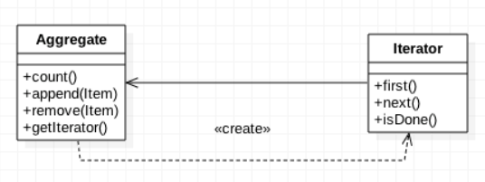
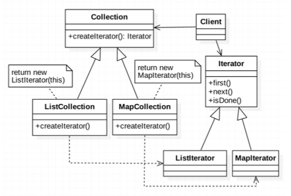
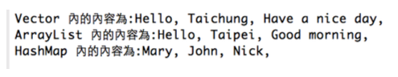

###### tags: `OOSE`

# Ch22 逍遙遊：Iterator

## 22.1 目的與定義

提供一個能夠循序瀏覽某個集合體（Aggregate）的內部資料，而不必去了解其內部結構的方法。

> **設計樣式定義**
> *Provide a way to access the elements of an aggregate object sequentially without exposing its underlying representation.*

透過將「資料走訪與瀏覽」的行為從集合物件（Collection/Aggregate）中抽離出來，封裝到一個獨立的瀏覽物件（Iterator）中，我們可以在保護集合內部結構完整性的同時，提供統一且靈活的走訪介面。

---

## 22.2 動機與核心觀念

在程式設計中，我們經常需要走訪陣列（Array）或集合物件（如 List、Set、Map 等）的內容。然而，基於**資料隱藏（Data Hiding）**與**封裝（Encapsulation）**原則，集合物件的內部儲存結構（例如它是用鏈結串列 LinkedList 還是陣列 ArrayList 實作）應該避免對外公開。

### 22.2.1 傳統設計的痛點
如果我們為了讓其他物件取得集合的元素，而直接將集合物件的參考（Reference）傳過去，或者在集合類別中直接暴露底層的儲存容器，會產生以下問題：
1. **高耦合性**：使用者端（Client）必須知道集合底層的具體資料結構，一旦底層結構更換（例如 ArrayList 改為 LinkedList），所有 Client 程式都必須隨之修改，違反了**開閉原則 (OCP)**。
2. **安全性風險**：直接將底層集合的參考傳出，意味著外部物件可以直接修改集合內容，這違反了資料隱藏原則。
3. **單一職責原則 (SRP) 的違背**：集合物件本應只專注於「資料的儲存與管理」，如果還需要自行提供各種走訪（正向、反向、過濾等）的方法，會使集合類別變得過於臃腫。

> 💡 **核心心法**
> *「只可遠觀，不可褻玩焉」*
> 我們只希望 Client 依序取得資料內容來使用，而不希望 Client 碰觸到資料容器本身的結構。

### 22.2.2 生活實喻：智慧書架與圖書管理員
想像你在圖書館看書：
* 如果沒有 Iterator，你必須親自走進書庫，了解書架的物理排列方式（是按顏色、大小還是注音符號？），然後自己一本一本抽出來讀。如果書架擺放方式變了，你找書的步驟也得跟著變。
* 引入 Iterator 後，**圖書管理員**就是你的 Iterator。你只需對管理員說：「給我下一本書」以及「後面還有書嗎？」。你不必管書架是怎麼排列的，管理員會幫你把書一本本遞到你手上。這就是 Iterator 的精髓。

[gugu- `Iterator`](https://refactoring.guru/design-patterns/iterator)

---

## 22.3 結構與方法

不同結構的 Aggregate 需要不同的 Iterator 來瀏覽，因此可以運用 **Factory Method (工廠方法樣式)**，依據不同型態的複合物件動態產生對應的瀏覽器物件。例如 `MapCollection` 需要的瀏覽器是 `MapIterator`、`ListCollection` 需要的是 `ListIterator`。Collection 本身並不需要決定要產生哪一個具體 Iterator。

這種結構稱為 **Polymorphic Iterator (多型瀏覽器)**，也是實務上最為普遍的設計方式。


*FIG: Iterator 模式基本設計*


*FIG: Polymorphic Iterator (多型瀏覽器) 結構圖*

### 22.3.1 參與者角色與職責

| 角色 | 英文名稱 | 職責與說明 |
| :--- | :--- | :--- |
| **抽象複合物件** | `Aggregate` / `Collection` | 定義建立瀏覽器（Iterator）的介面（例如 `createIterator()` 或 `iterator()`）。此外，也會定義基本的資料管理方法（如 `addElement()`, `removeElement()`）。 |
| **具體複合物件** | `ConcreteAggregate` | 實作建立瀏覽器的介面，回傳與其內部儲存結構相對應的具體 Iterator 實體。此類別負責實質儲存資料元素。 |
| **抽象瀏覽器** | `Iterator` | 定義循序走訪與存取元素的介面，例如 `hasNext()` (是否有下一個元素)、`next()` (取得下一個元素)、`first()` (重設至首位) 等。 |
| **具體瀏覽器** | `ConcreteIterator` | 實作 `Iterator` 介面，並記錄走訪該複合物件時的目前位置（例如指標或索引值），以便在 Client 呼叫 `next()` 時能正確遞移並回傳對應元素。 |

### 22.3.2 運作機制與序列圖
1. **Client** 向 **ConcreteAggregate** 請求一個瀏覽器物件：呼叫 `createIterator()`。
2. **ConcreteAggregate** 建構一個 **ConcreteIterator** 物件，並將自己（或內部資料）傳給它作為參數，隨後將該 Iterator 回傳給 Client。
3. **Client** 以迴圈呼叫 `Iterator` 的 `hasNext()` 與 `next()` 方法。
4. **ConcreteIterator** 內部維護一個走訪指標，每次呼叫 `next()` 時取得元素並遞增指標，直到走訪結束。

### 22.3.3 程式樣板 (Java)

以下呈現最經典的自訂 Iterator 程式架構樣板：

```java
// 1. 抽象瀏覽器介面
interface MyIterator<T> {
    boolean hasNext();
    T next();
}

// 2. 抽象複合物件介面
interface MyCollection<T> {
    MyIterator<T> createIterator();
}

// 3. 具體複合物件
class ConcreteCollection<T> implements MyCollection<T> {
    private T[] items;
    private int size = 0;

    public ConcreteCollection(T[] items) {
        this.items = items;
        this.size = items.length;
    }

    public T getElement(int index) {
        return items[index];
    }

    public int getSize() {
        return size;
    }

    @Override
    public MyIterator<T> createIterator() {
        return new ConcreteIterator<>(this);
    }
}

// 4. 具體瀏覽器
class ConcreteIterator<T> implements MyIterator<T> {
    private ConcreteCollection<T> collection;
    private int cursor = 0; // 記錄目前走訪的位置

    public ConcreteIterator(ConcreteCollection<T> collection) {
        this.collection = collection;
    }

    @Override
    public boolean hasNext() {
        return cursor < collection.getSize();
    }

    @Override
    public T next() {
        if (!hasNext()) {
            throw new NoSuchElementException();
        }
        T val = collection.getElement(cursor);
        cursor++;
        return val;
    }
}
```

**Client 端使用範例：**
```java
ConcreteCollection<String> col = new ConcreteCollection<>(new String[]{"A", "B", "C"});
MyIterator<String> it = col.createIterator();

while (it.hasNext()) {
    String element = it.next();
    System.out.println(element);
}
```

### 22.3.4 效益分析

#### 🟢 優點
* **支援多種走訪方式**：你可以針對同一個集合設計多個不同的 `ConcreteIterator`，例如「正向走訪」、「反向走訪」或「跳躍走訪」，而不必修改集合類別。
* **簡化了 Aggregate 類別**：集合類別不再需要自己提供複雜的走訪方法，符合**單一職責原則 (SRP)**。
* **支援多重同時走訪 (Concurrent Traversal)**：因為走訪狀態（例如 `cursor` 指標）是記錄在各自獨立的 `Iterator` 物件中，所以同一個集合可以同時存在多個正在進行的走訪進度。
* **解耦與多型走訪**：使用者程式只與 `Iterator` 介面耦合，無需關心底層究竟是 Array、List 還是 Tree，符合**依賴倒置原則 (DIP)**。

#### 🔴 缺點
* **類別數量增加**：為每一種集合類別設計對應的 Iterator，會增加系統中類別與介面的數量，使設計略顯複雜。
* **效能開銷**：對於結構極為簡單的集合（例如基本陣列），使用 Iterator 物件會增加方法呼叫與記憶體配置的負擔，直接使用 index 迴圈存取效能更好。

---

## 22.4 實務範例與應用

### 22.4.1 Java Collection Framework 的 Iterator
Java 早已將 Iterator 設計樣式深植於其集合體系中。主要核心為 `java.util.Iterator` 介面與 `java.lang.Iterable` 介面：

* `Iterable<T>`：實作此介面的物件代表「可被迭代走訪」。它僅有一個核心方法需要實作：`Iterator<T> iterator()`。
* `Iterator<T>`：定義了 `hasNext()`, `next()`, 以及選配實作的 `remove()`。

只要一個類別實作了 `Iterable`，我們就可以使用 Java 的**增強型 for 迴圈 (Enhanced for loop)**，這是一種簡潔的語法糖（Syntactic Sugar）：

```java
// 語法糖寫法
for (String name : nameList) {
    System.out.println(name);
}

// 編譯後的真實底層運作方式：
Iterator<String> it = nameList.iterator();
while (it.hasNext()) {
    String name = it.next();
    System.out.println(name);
}
```

### 22.4.2 實務程式演示 (Vector, ArrayList, HashMap)

以下範例展示如何運用統一的 `Iterator` 介面，以相同的方法走訪三種底層結構完全不同的 Java 集合：

[src/IterationDemo.java](src/IterationDemo.java)

```java
package iterator;

import java.util.*;

public class IterationDemo {

	public static void main(String[] args) {
		// 1. Vector（早期的動態陣列，執行緒安全）
		Vector<String> v = new Vector<String>();
		v.addElement(new String("Hello"));
		v.addElement(new String("Taichung"));
		v.addElement(new String("Have a nice day"));
		
		Iterator<String> it1 = v.iterator();
		System.out.print("Vector 內的內容為: ");
		traverse(it1);

		// 2. ArrayList（現代最常用的動態陣列）
		ArrayList<String> v2 = new ArrayList<String>();
		v2.add(new String("Hello"));
		v2.add(new String("Taipei"));
		v2.add(new String("Good morning"));
		
		Iterator<String> it2 = v2.iterator();
		System.out.print("\nArrayList 內的內容為: ");
		traverse(it2);

		// 3. HashMap（雜湊鍵值對，在此迭代其 Key 集合）
		HashMap<String, Integer> v3 = new HashMap<String, Integer>();
		v3.put("John", Integer.valueOf(172));
		v3.put("Mary", Integer.valueOf(168));
		v3.put("Nick", Integer.valueOf(180));
		
		Iterator<String> it3 = v3.keySet().iterator();
		System.out.print("\nHashMap Key 內的內容為: ");
		traverse(it3);
		System.out.println();
	}

	// 💡 多型走訪方法：只依賴抽象 Iterator 介面，不需要知道具體集合類別
	static void traverse(Iterator<String> e) {
		while (e.hasNext()) {
			System.out.print(e.next() + ", ");
		}
	}

}
```


*FIG: 程式執行結果*

[Get the code](\codeURL/iterator/IterationDemo.java)

---

## 22.5 進階討論

### 22.5.1 主動式 vs. 被動式瀏覽器 (External vs. Internal Iterator)
依據「誰來控制迭代迴圈」的權利，Iterator 可以分為兩大類：

#### 1. 主動式瀏覽器 (External / Active Iterator)
* **控制權**：在 **Client 端**。Client 呼叫 `it.next()` 來主動取得下一個元素並決定何時前進。
* **特性**：彈性極大。Client 可以靈活地隨時中斷走訪、同時操作兩個 Iterator 進行資料比對（例如比對兩個排序數組是否相同）。
* **缺點**：Client 必須自己撰寫重複的 `while` 迴圈。

#### 2. 被動式瀏覽器 (Internal / Passive Iterator)
* **控制權**：在 **集合物件本身**。Client 將走訪時要執行的「行為（函數/閉包）」傳入集合中，集合內部自己控制走訪並逐一套用該行為。
* **特性**：程式碼極為精確簡潔，可讀性高。在現代 Java 8+ 的 Lambda 與 Stream API 中被廣泛應用。
* **缺點**：走訪過程中較難執行複雜的控制，例如在特定條件下跳過某個元素或跨多個集合同步走訪。

```java
// Java 8+ 被動式 (Internal) 走訪範例
List<String> list = Arrays.asList("Apple", "Banana", "Cherry");

// 傳入一個 Consumer 函數，走訪過程完全由 list 自行掌控
list.forEach(item -> System.out.println(item));
```

### 22.5.2 Fail-Fast 與 Fail-Safe 迭代機制
在多執行緒或複雜程式中，若我們一邊走訪集合，另一邊又在對該集合進行新增或刪除，會發生什麼事？

#### 1. 快速失敗機制 (Fail-Fast)
* **行為**：在迭代期間，如果偵測到集合的結構被修改（例如呼叫了 `list.add()` 或 `list.remove()`），Iterator 會立即拋出 `ConcurrentModificationException`。
* **原理**：集合物件內部維護一個變更計數器 `modCount`。在產生 Iterator 時會複製此數值（`expectedModCount`）。每次呼叫 `next()` 都會檢查這兩個數值是否一致，若不一致代表集合被外部偷改，立即報錯。
* **典型代表**：`ArrayList`, `HashMap`, `Vector` 的 Iterator。
* **正確做法**：若需要在走訪時刪除元素，應呼叫 **`Iterator.remove()`** 而非集合物件的 `list.remove()`，因為 `Iterator.remove()` 會同步更新 `expectedModCount`。

#### 2. 安全防護機制 (Fail-Safe / Weakly Consistent)
* **行為**：允許在走訪時修改集合，不會拋出異常。
* **原理**：走訪時不是直接操作原始資料結構，而是操作原集合的一份「唯讀複製品」，或者是寫入時複製（Copy-On-Write）的結構。
* **缺點**：無法即時存取到走訪期間所做的新增或修改（弱一致性），且複製品會帶來額外的記憶體與效能開銷。
* **典型代表**：`CopyOnWriteArrayList`, `ConcurrentHashMap`。

---

## 22.6 隨堂測驗

1. 要取得一個集合物件內所有物件，為何不直接從此集合物件取值？還需要先取得其瀏覽物件 (Iterator)？
    - A) 瀏覽物件的功能較為強大
    - B) 瀏覽物件是 View，透過如此可以將 Model 與 View 分離
    - C) 可以避免暴露集合物件內部結構，降低耦合，並保護集合內容
    - D) 避免傳遞過多的資料，速度較快

<details>
<summary>解答</summary>

**C) 可以避免暴露集合物件內部結構，降低耦合，並保護集合內容**
說明：透過 Iterator 可以依序取得集合內的元素，而不必暴露集合物件的內部結構，這樣可以保護集合內的資料不被外部直接存取或損壞，實現了高內聚、低耦合。
</details>
	
2. Polymorphic Iterator (多型瀏覽器) 是結合哪兩個設計樣式？(選兩個)
    - A) Iterator 樣式
    - B) Mediator (中介者) 樣式
    - C) Decorator (裝飾者) 樣式
    - D) Factory Method (工廠方法) 樣式

<details>
<summary>解答</summary>

**A) Iterator 樣式 與 D) Factory Method 樣式**
說明：Polymorphic Iterator 通常會用 Factory Method 模式，讓不同的 ConcreteAggregate (具體複合物件) 動態決定並產生其專屬的 ConcreteIterator。
</details>

3. 下列的程式會計算一群學生的平均成績，你覺得有什麼設計問題？可以怎麼改善？
```java
class Student {
    int score;
    int getScore() { return score;}
}
 ...
class GradeComputer {
     void computeAverage(ArrayList<Student> s) {
        ... 
     }
}
```

<details>
<summary>解答</summary>

**設計缺點**：`computeAverage` 參數直接要求傳入 `ArrayList<Student>`，這讓 `GradeComputer` 與具體的資料儲存結構 `ArrayList` 強烈耦合。若未來因為效能或功能需求，學校資料庫將學生的儲存方式改為陣列（`Student[]`）或鏈結串列（`LinkedList`），這段程式就必須強迫修改。

**改善方案**：將參數型態改為 `Iterator<Student>`。這樣一來，`GradeComputer` 只需要知道「如何從 Iterator 一個個拿到學生」，而完全不需要知道這些學生底層是被存在哪種容器中，從而達成解耦。
</details>

4. 同上，如果我們改用泛型的 `Iterator<Student>` 來實作，以下方法的 `?` 區塊應該如何編寫？
```java
double getAverage(Iterator<Student> iterator) {
     ?
}   
```

<details>
<summary>解答</summary>

```java
    int sum = 0;
    int count = 0;
    while (iterator.hasNext()) {
        sum += iterator.next().getScore();
        count++;
    }
    return count == 0 ? 0.0 : (double) sum / count;
```
</details>

[src/IteratorQuestion.java](src/IteratorQuestion.java)

---

## 22.7 課堂練習與挑戰

### EX01 結構繪製
在不看教材結構圖的情況下，請應用 UML 建模工具畫出 Polymorphic Iterator 設計樣式的完整結構圖，並標明類別間的關聯（繼承、實作、相依等關係）。

### EX02 課程成績瀏覽實作
請實作並補完以下程式，讓 `GradeComputer` 能透過 Iterator 的抽象介面計算一個課程中所有學生的平均成績，徹底與 `Course` 類別內部的儲存容器（`HashMap`）解耦。

[src/CourseIteratorExample.java](src/CourseIteratorExample.java)

```java
import java.util.*;

class Student {
    String name;
    public Student(String name) { this.name = name; }
}

class Course {
    // 儲存所有學生的成績，內部採用 HashMap 結構
    private HashMap<Student, Integer> gradeBook = new HashMap<>();
       
    // 💡 課堂練習提示 1：請實作取得成績瀏覽物件 (Iterator) 的方法
    // 提示：可以利用 Map 的 values() 所得到的 Collection，再呼叫其 iterator() 方法取得。
    public Iterator<Integer> getGradeIterator() {
        // [TODO: 請回傳對應的成績 Iterator]
        return null;
    }  

    public void addGrade(Student s, int grade) {
        gradeBook.put(s, grade);
    }
}

class GradeComputer {
    // 💡 課堂練習提示 2：請應用 Iterator 模式來計算平均成績，不直接相依於 Course 內部的儲存結構 (HashMap)
    public void computeAverage(Course c) {   
        // [TODO: 1. 自 Course 物件中取得成績的 Iterator]
        
        // [TODO: 2. 使用 Iterator 的 hasNext() 與 next() 進行迴圈加總，並計算出平均分數]
        
        // [TODO: 3. 印出計算好的平均分數]
    }
}

public class CourseIteratorExample {
    public static void main(String[] args) {
        Course math = new Course();
        math.addGrade(new Student("Nick"), 90);
        math.addGrade(new Student("Mary"), 85);
        math.addGrade(new Student("John"), 70);
        
        GradeComputer gc = new GradeComputer();
        gc.computeAverage(math);
    }
}
```

<details>
<summary>練習引導提示與參考答案</summary>

#### 引導步驟
1. **實作 `getGradeIterator()`**：
   在 `Course` 類別中，使用 `gradeBook.values()` 取得所有學生成績數值的 Collection，再對該 Collection 呼叫 `.iterator()`：
   ```java
   public Iterator<Integer> getGradeIterator() {
       return gradeBook.values().iterator();
   }
   ```
2. **實作 `computeAverage()`**：
   在 `GradeComputer` 類別中取得迭代器，並透過 `while(iterator.hasNext())` 走訪所有元素：
   ```java
   public void computeAverage(Course c) {   
       Iterator<Integer> it = c.getGradeIterator();
       int sum = 0;
       int count = 0;
       while (it != null && it.hasNext()) {
           sum += it.next();
           count++;
       }
       double average = count > 0 ? (double) sum / count : 0.0;
       System.out.println("Average Grade: " + average);
   }
   ```

</details>

---

### 🏆 EX03 進階挑戰：雙向走訪與過濾迭代器 (Bidirectional & Filtering Iterator)
實務上，有時我們會需要從後往前瀏覽集合（反向走訪），或是唯有符合特定條件的元素才需要挑出來走訪（過濾走訪）。

1. **反向走訪 (Reverse Iterator)**：請為一個自訂的動態陣列（Array-based Collection）實作一個 `ReverseIterator`，其走訪順序是從最後一個元素往第一個元素遞減。
2. **過濾走訪 (Filtering Iterator)**：請實作一個 `FilteringIterator`，它在建構時接受一個原始的 `Iterator` 以及一個條件判定物件（如 Java `Predicate`），並在呼叫 `next()` 時，只回傳符合篩選條件的下一個元素（例如：只瀏覽及格的成績）。這能極大地展示 Iterator 的組合靈活性！