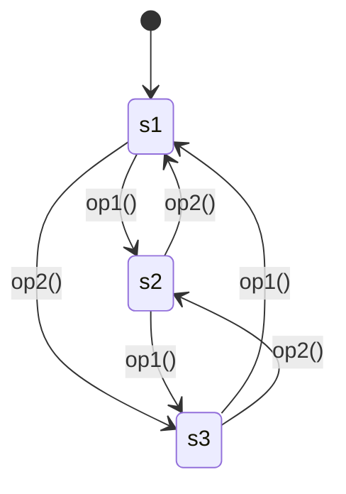
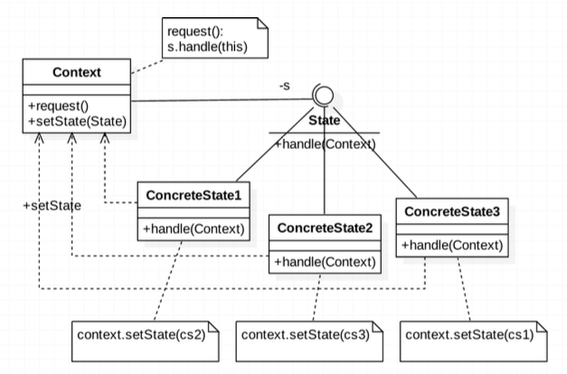
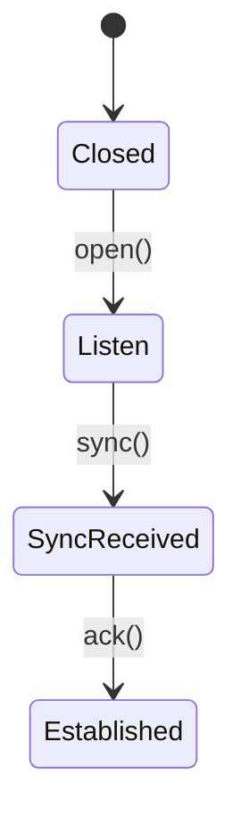
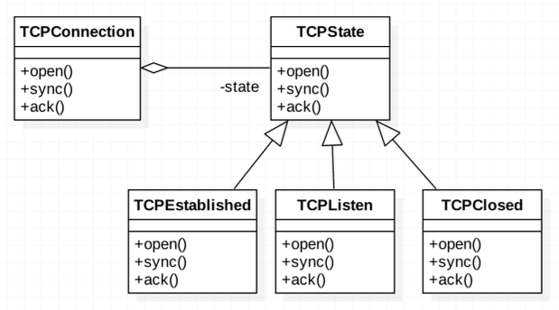
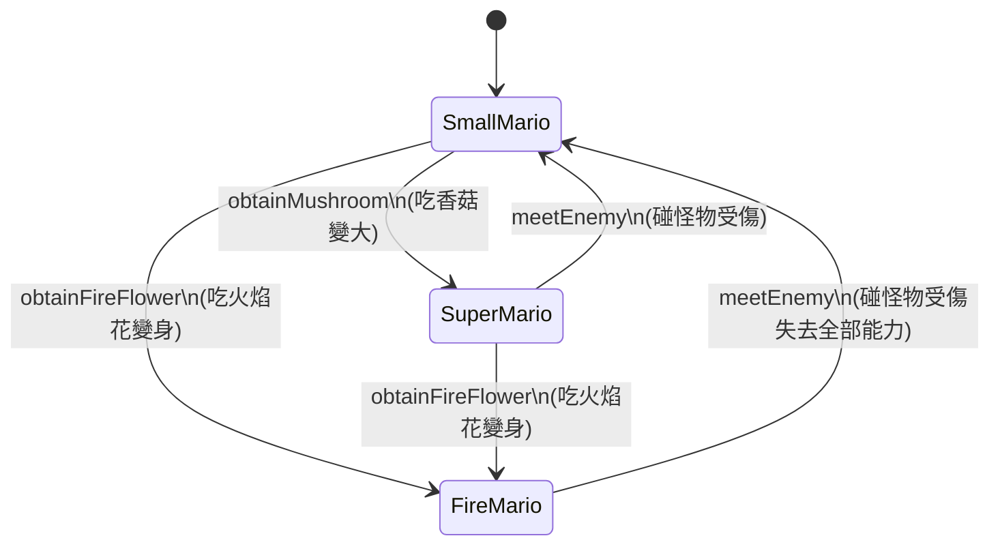
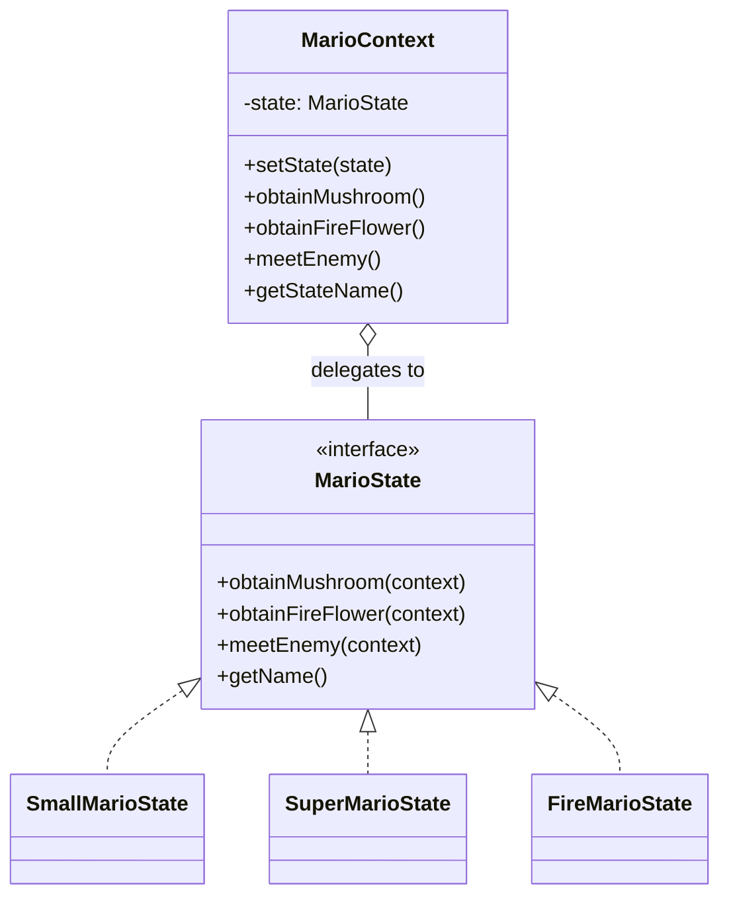
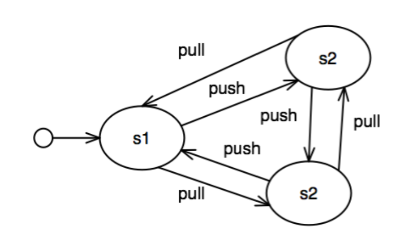

###### tags: `OOSE`

# Ch23 物換星移：State

## 23.1 目的與動機

> 將所有關於狀態的資訊與動作都包裝在一個狀態內，使物件的狀態較易擴充或修改。

> **設計樣式定義**
> *Allow an object to alter its behavior when its internal state changes. The object will appear to change its class.*
> （允許一個物件在其內部狀態改變時改變它的行為。該物件看起來就像是改變了它的類別。）

### 23.1.1 核心思維：把狀態封裝成類別
在物件導向設計中，物件的行為通常取決於其內部的狀態。也就是說，當物件處於不同的狀態時，即使收到相同的訊息（呼叫相同的方法），也有可能會做出截然不同的動作（執行不同的演算法或作業）。

經典的 GoF 定義中提到：**「該物件看起來就像是改變了它的類別（The object will appear to change its class）」**。這是因為：
1. 我們把「與狀態相關的行為」從原本的主類別中抽離，將每一個狀態都封裝成一個獨立的**狀態類別（ConcreteState）**。
2. 主類別（Context）在執行期會動態切換它所持有的狀態類別實體。
3. 當 Client 呼叫 Context 的方法時，Context 會將請求**委託（Delegate）**給當前持有的狀態類別去處理。從外部看來，同一個主類別物件在執行同一個方法時，展現出完全不同的多型行為，就好像它在執行期動態更換了類別一樣。

### 23.1.2 傳統設計的痛點
假設我們設計一個類別 `C`，它有三個狀態：`s1`、`s2`、`s3`，並且具備以下的狀態移轉與行為：
* 在 `s1` 狀態時：收到 `op1()` 會轉移到 `s2`；收到 `op2()` 會轉移到 `s3`。
* 在 `s2` 狀態時：收到 `op1()` 會轉移到 `s3`；收到 `op2()` 會轉移到 `s1`。
* 在 `s3` 狀態時：收到 `op1()` 會轉移到 `s1`；收到 `op2()` 會轉移到 `s2`。

**狀態轉移圖：**



如果使用傳統的結構化思維，我們通常會使用一個整數欄位（如 `int state`）來代表狀態，並在每個行為方法中寫滿條件判斷式：

```java
class C {
    private static final int S1 = 1;
    private static final int S2 = 2;
    private static final int S3 = 3;
    private int s = S1; // 代表狀態的整數

    public void op1() {
        if (s == S1) {
            s = S2;
            System.out.println("Transition from S1 to S2");
        } else if (s == S2) {
            s = S3;
            System.out.println("Transition from S2 to S3");
        } else if (s == S3) {
            s = S1;
            System.out.println("Transition from S3 to S1");
        }
    }

    public void op2() {
        if (s == S1) {
            s = S3;
            System.out.println("Transition from S1 to S3");
        } else if (s == S2) {
            s = S1;
            System.out.println("Transition from S2 to S1");
        } else if (s == S3) {
            s = S2;
            System.out.println("Transition from S3 to S2");
        }
    }
}
```

#### 這樣設計的缺點：
1. **擴展性極差（違反 OCP）**：如果我們要新增一個狀態 `s4`，我們必須修改 `C` 類別內**所有**包含狀態判斷的方法（如 `op1()`, `op2()`），在裡面加上新的 `else if` 分支。這會導致類別極易在修改過程中引入新 Bug。
2. **高複雜度與維護困難**：當狀態與行為方法愈來愈多時，條件判斷式會呈現乘積級的膨脹，程式碼將變得極難閱讀與維護（Spaghetti Code 義大利麵條程式）。
3. **內聚力低下**：狀態轉換的邏輯與主類別的業務邏輯混雜在一起，違反了**單一職責原則 (SRP)**。

---

## 23.2 適用時機 

當系統開發面臨以下情境時，應優先考慮使用 State 設計樣式：
1. **行為隨狀態而變，且伴隨大量條件分支**：某個物件的行為取決於它的內部狀態，並且它必須在執行期根據狀態改變行為，導致方法中充斥著大量的 `if-else` 或 `switch-case` 條件式。
2. **狀態與行為需要頻繁擴充或修改**：物件的狀態種類在未來很有可能增加、刪除或微調，我們不希望每次變動都去動到既有的主類別邏輯。
3. **狀態轉換邏輯複雜但有規律**：將複雜的狀態轉移規則（StateMachine）分散封裝到各個狀態類別中，比集中在一個龐大的控制類別中更容易閱讀、除錯與測試。

> 💡 **課堂思考：**
> 在一個象棋系統中，`ChessGame` 會有不同的狀態：`Initial` (初始)、`Waiting` (等待玩家加入)、`Started` (對局開始)、`GameOver` (勝負已分) 等。這些狀態決定了系統如何回應使用者的點擊棋子事件。如果不用 State 樣式，點擊事件的方法內會堆疊多少層 `if` 判斷？該如何應用 State 樣式優化它？

[gugu- `State`](https://refactoring.guru/design-patterns/state)

---

## 23.3 結構與方法

State 設計樣式透過**多型**來消除繁雜的條件式。它將特定狀態的行為委託給對應的具體狀態物件。


*FIG: State 設計樣式結構圖*

### 23.3.1 參與者角色與職責

| 角色 | 英文名稱 | 職責與說明 |
| :--- | :--- | :--- |
| **環境情境** | `Context` | 1. 定義外部客戶端（Client）所感興趣的介面。<br/>2. 維護一個當前狀態的實體參考（`State`）。<br/>3. 提供設定狀態的方法（`setState()`）。<br/>4. 將與狀態相關的請求委託（Delegate）給當前狀態物件去處理。 |
| **抽象狀態** | `State` | 定義一個抽象介面，用來封裝與 `Context` 的特定狀態相關的行為與事件方法。 |
| **具體狀態** | `ConcreteState` | 實作 `State` 介面。每一個具體狀態類別代表 `Context` 的一種狀態，並實作在該狀態下對應的行為邏輯與狀態移轉規則。 |

---

## 23.4 程式樣板

以下是基於 23.1.2 狀態轉移圖實作的標準 Java 程式樣板。請注意狀態物件在執行行為後，如何呼叫 `Context` 的 `setState()` 來切換狀態。

```java
// 1. 抽象狀態物件，規範在各狀態下可能發生的事件行為
interface State {
    // 💡 注意：方法通常需傳入 Context 參考，以便在行為執行完畢後設定 Context 的新狀態
    void op1(Context c);
    void op2(Context c);
}

// 2. 具體狀態類別 S1
class S1 implements State {
    @Override
    public void op1(Context c) {
        System.out.println("[State S1] 收到 op1 -> 移轉至 S2");
        c.setState(new S2());
    }

    @Override
    public void op2(Context c) {
        System.out.println("[State S1] 收到 op2 -> 移轉至 S3");
        c.setState(new S3());
    }
}

// 3. 具體狀態類別 S2
class S2 implements State {
    @Override
    public void op1(Context c) {
        System.out.println("[State S2] 收到 op1 -> 移轉至 S3");
        c.setState(new S3());
    }

    @Override
    public void op2(Context c) {
        System.out.println("[State S2] 收到 op2 -> 移轉至 S1");
        c.setState(new S1());
    }
}

// 4. 具體狀態類別 S3
class S3 implements State {
    @Override
    public void op1(Context c) {
        System.out.println("[State S3] 收到 op1 -> 移轉至 S1");
        c.setState(new S1());
    }

    @Override
    public void op2(Context c) {
        System.out.println("[State S3] 收到 op2 -> 移轉至 S2");
        c.setState(new S2());
    }
}

// 5. 環境情境類別 Context
class Context {
    private State currentState;

    public Context() {
        // 預設初始狀態為 S1
        this.currentState = new S1();
    }

    // 提供內部或外部變更狀態的介面
    public void setState(State state) {
        this.currentState = state;
    }

    // 客戶端呼叫的業務行為，直接委託給當前的狀態物件處理
    public void request1() {
        currentState.op1(this);
    }

    public void request2() {
        currentState.op2(this);
    }
    
    public State getCurrentState() {
        return currentState;
    }
}
```

### 23.4.1 設計效益分析

#### 🟢 優點
* **符合單一職責原則 (SRP)**：將特定狀態相關的行為局部化在一個獨立的狀態類別中，邏輯高度內聚。
* **符合開閉原則 (OCP)**：新增狀態只需擴充一個新的 `ConcreteState` 子類別，無須修改 `Context` 或其他狀態類別的既有程式碼。
* **消除複雜條件分支**：以多型分派（Polymorphic Dispatch）取代了龐雜難懂的 `if-else / switch-case`。
* **狀態轉移顯式化**：狀態的切換不再是隱含的整數欄位變更，而是物件參考的替換，使狀態機轉換邏輯在程式結構中清晰可見。

#### 🔴 缺點
* **類別數量膨脹**：每一個狀態都需要一個獨立的具體類別，若狀態數量極多，會導致系統中類別數量大幅增加。
* **狀態類別間的相依性**：若由 `ConcreteState` 決定下一個狀態（如樣板所示），則狀態類別之間會需要彼此 `new` 對方，增加了狀態類別之間的相互耦合度（此缺點可透過進階設計來優化，見 Section 23.6）。

---

## 23.5 實務範例

### 23.5.1 TCP/IP 網路連接狀態管理

TCP（傳輸控制協定）通訊過程中，連接的建立與斷開包含複雜的狀態轉換。我們以簡化的四個核心狀態為例：`Closed`、`Listen`、`Sync-Received`、`Established`。

當 TCP 連接在不同狀態下接收到 `open`、`sync`、`ack` 等事件時，其行為與後續狀態會發生移轉：

**TCP 狀態移轉圖：**



透過 State 設計樣式，我們將 TCP 的狀態轉移結構設計如下：


*FIG: TCP 連接狀態之 State 模式設計*

#### 1. 抽象 TCPState
```java
public abstract class TCPState {
    public abstract void open(TCPConnection c);
    public abstract void sync(TCPConnection c);
    public abstract void ack(TCPConnection c);
}
```

#### 2. 具體狀態實作
```java
// Closed 狀態
public class TCPClosed extends TCPState {
    @Override
    public void open(TCPConnection c) {
        System.out.println("Opening connection -> Entering Listen State.");
        c.setState(new TCPListen());
    }
    @Override
    public void sync(TCPConnection c) {
        System.out.println("Error: Cannot sync in Closed state.");
    }
    @Override
    public void ack(TCPConnection c) {
        System.out.println("Error: Cannot ack in Closed state.");
    }
}

// Listen 狀態
public class TCPListen extends TCPState {
    @Override
    public void open(TCPConnection c) {
        System.out.println("Already open and listening.");
    }
    @Override
    public void sync(TCPConnection c) {
        System.out.println("Received SYN packet -> Entering Sync-Received State.");
        c.setState(new TCPSyncReceived());
    }
    @Override
    public void ack(TCPConnection c) {
        System.out.println("Error: Awaiting SYN before ACK.");
    }
}

// SyncReceived 狀態
public class TCPSyncReceived extends TCPState {
    @Override
    public void open(TCPConnection c) {
        System.out.println("Connection already open.");
    }
    @Override
    public void sync(TCPConnection c) {
        System.out.println("Already received SYN. Waiting for ACK.");
    }
    @Override
    public void ack(TCPConnection c) {
        System.out.println("ACK received -> Connection Established!");
        c.setState(new TCPEstablished());
    }
}

// Established 狀態
public class TCPEstablished extends TCPState {
    @Override
    public void open(TCPConnection c) {
        System.out.println("Connection already established.");
    }
    @Override
    public void sync(TCPConnection c) {
        System.out.println("Re-sync ignored. Connection is active.");
    }
    @Override
    public void ack(TCPConnection c) {
        System.out.println("ACK processed in active session.");
    }
}
```

透過將這些狀態的轉移封裝在各狀態類別中，`TCPConnection`（主類別）的設計變得極為乾淨，只需要負責委託即可，大幅降低了維護難度。

---

### 23.5.2 經典遊戲實例：瑪利歐 (Mario) 變身系統

經典遊戲《超級瑪利歐》中，瑪利歐的狀態會隨著吃到的寶物或受到的傷害而發生變身轉換，且不同狀態下的行為（如受到攻擊）有很大不同。

#### 瑪利歐變身狀態移轉表

| 當前狀態 (State) | 觸發事件 (Event) | 目標新狀態 (Next State) | 動作與效果說明 |
| :--- | :--- | :--- | :--- |
| **SmallMario** (小瑪利歐) | `obtainMushroom` | **SuperMario** (大瑪利歐) | 變大，生命力增加。 |
| **SmallMario** (小瑪利歐) | `obtainFireFlower` | **FireMario** (火焰瑪利歐) | 獲得火焰攻擊能力。 |
| **SuperMario** (大瑪利歐) | `meetEnemy` | **SmallMario** (小瑪利歐) | 受傷變小，失去大瑪利歐狀態。 |
| **SuperMario** (大瑪利歐) | `obtainFireFlower` | **FireMario** (火焰瑪利歐) | 升級獲得火焰攻擊能力。 |
| **FireMario** (火焰瑪利歐) | `meetEnemy` | **SmallMario** (小瑪利歐) | 受傷失去所有火焰與大體型能力，降回小瑪利歐。 |

**狀態轉移圖：**



#### 1. State 介面
```java
public interface MarioState {
    void obtainMushroom(MarioContext context);
    void obtainFireFlower(MarioContext context);
    void meetEnemy(MarioContext context);
    String getName();
}
```

#### 2. 具體狀態類別 (Small, Super, Fire)
```java
// 小瑪利歐狀態
public class SmallMarioState implements MarioState {
    @Override
    public void obtainMushroom(MarioContext context) {
        context.setState(new SuperMarioState());
        System.out.println("★ 瑪利歐吃了香菇，變身為 [超級大瑪利歐]！");
    }

    @Override
    public void obtainFireFlower(MarioContext context) {
        context.setState(new FireMarioState());
        System.out.println("★ 瑪利歐吃了火焰花，變身為 [火焰瑪利歐]！");
    }

    @Override
    public void meetEnemy(MarioContext context) {
        System.out.println("💥 小瑪利歐撞到怪物！ Game Over... ☠️");
    }

    @Override
    public String getName() { return "Small Mario"; }
}

// 超級大瑪利歐狀態
public class SuperMarioState implements MarioState {
    @Override
    public void obtainMushroom(MarioContext context) {
        System.out.println("瑪利歐已經是超級狀態，沒有額外變化。");
    }

    @Override
    public void obtainFireFlower(MarioContext context) {
        context.setState(new FireMarioState());
        System.out.println("★ 超級瑪利歐吃了火焰花，升級為 [火焰瑪利歐]！");
    }

    @Override
    public void meetEnemy(MarioContext context) {
        context.setState(new SmallMarioState());
        System.out.println("💥 超級瑪利歐撞到怪物！退化為 [小瑪利歐]！");
    }

    @Override
    public String getName() { return "Super Mario"; }
}

// 火焰瑪利歐狀態
public class FireMarioState implements MarioState {
    @Override
    public void obtainMushroom(MarioContext context) {
        System.out.println("瑪利歐已經有火焰能力，香菇沒有效果。");
    }

    @Override
    public void obtainFireFlower(MarioContext context) {
        System.out.println("瑪利歐已經有火焰能力。");
    }

    @Override
    public void meetEnemy(MarioContext context) {
        context.setState(new SmallMarioState());
        System.out.println("💥 火焰瑪利歐撞到怪物！失去所有能力退化為 [小瑪利歐]！");
    }

    @Override
    public String getName() { return "Fire Mario"; }
}
```

#### 3. MarioContext (環境物件)
```java
public class MarioContext {
    private MarioState state;

    public MarioContext() {
        // 預設初始為小瑪利歐
        this.state = new SmallMarioState();
    }

    public void setState(MarioState state) {
        this.state = state;
    }

    public void obtainMushroom() {
        state.obtainMushroom(this);
    }

    public void obtainFireFlower() {
        state.obtainFireFlower(this);
    }

    public void meetEnemy() {
        state.meetEnemy(this);
    }

    public String getStateName() {
        return state.getName();
    }
}
```

#### 4. 遊戲主程式與類別關係圖
```java
public class Game {
    public static void main(String[] args) {
        MarioContext mario = new MarioContext();
        System.out.println("當前狀態：" + mario.getStateName()); // Small Mario
        
        mario.obtainMushroom();   // 吃香菇
        mario.obtainFireFlower(); // 吃火焰花
        System.out.println("當前狀態：" + mario.getStateName()); // Fire Mario
        
        mario.meetEnemy();        // 碰怪物
        System.out.println("當前狀態：" + mario.getStateName()); // Small Mario
    }
}
```



---

## 23.6 進階討論

### 23.6.1 狀態移轉的決策權：Context 決定 vs. ConcreteState 決定
設計狀態模式時，最核心的問題之一是：**「是誰來決定狀態機的下一個移轉狀態？」**

這有兩種完全不同的架構設計方式，各有優缺點：

#### 方案 A：由具體狀態（ConcreteState）決定轉換規則（如上述範例）
* **做法**：狀態行為方法執行完畢後，由 State 類別主動呼叫 `context.setState(new NextState())`。
* **🟢 優點**：狀態轉換規則分散在各狀態內部，新增狀態與轉換路徑時非常直覺，`Context` 完全不需要知道任何狀態機轉換的細節。
* **🔴 缺點**：**狀態類別之間產生了緊密耦合**。例如 `SmallMarioState` 的程式中必須明文引用 `SuperMarioState`，這使得這些狀態類別無法被獨立重用，且違反了高內聚低耦合的初衷。

#### 方案 B：由環境情境（Context）或資料庫配置決定轉換規則
* **做法**：`State` 類別的方法只負責執行當前狀態的商業邏輯，並回傳一個狀態碼、布林值或事件旗標給 `Context`。由 `Context` 接收回傳結果後，統一決定並執行 `setState()`。
* **🟢 優點**：**狀態類別之間實現了完全解耦**。每一個狀態類別都不知道其他狀態類別的存在，極易被重複利用與單獨測試。
* **🔴 缺點**：當狀態轉換規則非常複雜時，`Context` 會退化成包含大量條件式或查表邏輯的狀態機大類別，維護成本轉嫁回 `Context` 身上。

> 💡 **最佳實踐提示：**
> * 如果狀態移轉規則是**靜態且固定**的，推薦由 `Context` 統一管理轉換以保持狀態類別完全解耦。
> * 如果狀態移轉是**動態、複雜且依賴執行結果**的，則由 `ConcreteState` 管理轉換。為了避免耦合，可結合 **Flyweight 樣式**（見 23.6.3）或利用 `Context` 提供的工廠方法來解耦具體類別建構。

---

### 23.6.2 State 與 Strategy（策略樣式）之深度對比
許多學習者會發現 State 樣式與 Strategy 樣式的類別圖結構幾乎一模一樣（皆為一個 Context 持有一個介面欄位，並有多個具體實作類別）。然而，兩者在設計理念上有本質上的區別：

| 維度 | State 設計樣式 | Strategy 設計樣式 |
| :--- | :--- | :--- |
| **核心意圖 (Intent)** | 封裝**狀態特有的行為與移轉規則**，讓物件的行為隨狀態自動改變。 | 封裝**一組可互換的演算法或商業策略**。 |
| **物件知曉度** | 具體狀態（ConcreteStates）通常**相互知曉**，因為它們必須控制狀態的動態轉換。 | 具體策略（Strategies）彼此**完全獨立、互不知曉**，它們專注於各自的演算法。 |
| **客戶端介入度** | Client 通常只與 Context 互動，**不主動干預或切換狀態**，狀態切換是在執行期自動發生的。 | Client **必須主動選擇並注入** 適合的 Strategy 給 Context 執行。 |
| **生命週期與切換** | 在執行期會隨著事件觸發，進行**頻繁、動態**的狀態參考切換。 | 通常在初始化或特定條件下設定一次，之後**較少頻繁動態切換**。 |

---

### 23.6.3 Stateless State 與記憶體最佳化 (Flyweight 共享狀態)
在標準實作中，如果我們頻繁呼叫 `context.setState(new S1())`，每次狀態轉移都會在 Heap 區產生新的具體狀態物件。這對於遊戲引擎或高併發的網路通訊系統（如 TCP 管理器）而言，會造成嚴重的記憶體碎片與垃圾回收（GC）開銷。

#### 優化方案：享元共享（Flyweight / Singleton）
如果具體狀態類別內部**不含有成員變數**（即 Stateless，只包含行為與狀態轉換程式碼），我們應該將這些狀態設計為**單例模式（Singleton）**，或者由 `Context` 快取這些狀態的單一實體。

```java
// 使用靜態常數共享無狀態的狀態物件，避免頻繁 new 產生記憶體負擔
public class MarioContext {
    // 預先配置好所有的狀態物件實體 (Flyweight)
    public static final MarioState SMALL = new SmallMarioState();
    public static final MarioState SUPER = new SuperMarioState();
    public static final MarioState FIRE = new FireMarioState();

    private MarioState state;

    public MarioContext() {
        this.state = SMALL; // 初始化指向共享實體
    }

    public void setState(MarioState state) {
        this.state = state;
    }
    
    // ...
}
```

如此一來，狀態轉換程式碼只需呼叫 `c.setState(MarioContext.SUPER)`，系統在整個生命週期中只需維護少數幾個狀態物件實體，大幅提昇了執行效能。

---

## 23.7 隨堂測驗

1. 在 State 設計樣式中，主要負責保存當前物件狀態的類別角色是：
    - A) ConcreteState 
    - B) Observer 
    - C) Context 
    - D) Strategy	

	<details>
	<summary>解答</summary>
	
	**C) Context**
	說明：Context 類別負責維護代表當前狀態的 `State` 物件欄位，並在需要時提供 `setState()` 供外部或內部動態變更狀態。
	</details>

2. 為何具體狀態的事件處理方法（例如 `State.op1(Context c)`）通常需要將 Context 物件作為參數傳入？
    - A) State 需要直接讀寫 Context 內所有的私有成員變數
    - B) State 需要在執行完畢後呼叫 Context 的 `setState()` 來設定新的狀態
    - C) State 必須維持對 Client 端的參考以回報進度

	<details>
	<summary>解答</summary>
	
	**B) State 需要在執行完畢後呼叫 Context 的 `setState()` 來設定新的狀態**
	說明：若狀態轉換決策交給 State 物件，State 必須持有 Context 的參考，才能呼叫 `c.setState(newNextState)` 完成狀態移轉。
	</details>

3. 關於 State 設計樣式，下列何者描述**錯誤**？
    - A) Context 把改變物件狀態的具體動作延遲並委託給 State 物件處理
    - B) State 介面中宣告的方法通常為那些「隨狀態不同而有不同表現行為」的方法 
    - C) 為了保護資料，Context 絕不能暴露自己的 setState() 方法給狀態物件呼叫
    - D) 若有 $n$ 種可能狀態，系統中通常會建立 $n$ 個具體的 ConcreteState 類別

	<details>
	<summary>解答</summary>
	
	**C) 為了保護資料，Context 絕不能暴露自己的 setState() 方法給狀態物件呼叫**
	說明：C 是錯誤的。在由 State 決定轉移的方案中，Context 必須提供 `setState()` 方法（通常具有 package 或 public 權限），好讓具體狀態類別能執行狀態切換。
	</details>

---

## 23.8 課堂練習與挑戰

### EX01 結構繪製
在不看教材的情況下，請使用 UML 繪圖工具完整畫出 State 設計樣式的多型結構圖，並明確標記 `Context`、`State` 與 `ConcreteState` 之間的關聯關係（關聯、繼承/實作等）。

---

### EX02 三狀態動態切換系統
有一主類別物件 `A` (即 Context)，它的行為取決於目前擁有的三個狀態：`s1`, `s2`, `s3`。這三個狀態遇到事件行為時的轉移規則如下圖所示：


*FIG: 狀態變更轉移圖*

#### 實作要求
1. **條件式寫法 (非 State 模式)**：請在不使用 State 樣式的情況下，僅用 `if-else` 或 `switch` 在 `A` 類別內實作對應的狀態切換。
2. **State 樣式實作 (可擴充設計)**：考慮到未來狀態個數可能動態增加或改變，請使用 **State 設計樣式**重構此系統。請實作 `State` 介面、`S1State`、`S2State`、`S3State` 類別以及 `Context` 類別，並撰寫一個主程式驗證連續呼叫狀態變更後的轉移結果。

<details>
<summary>練習引導與提示</summary>

#### 步驟指引
1. 定義一個 `AState` 介面，宣告變更行為 `void change(StateContext ctx)`。
2. 實作三個狀態類別：
   - `S1State`：在 `change` 方法中呼叫 `ctx.setState(new S2State())`。
   - `S2State`：在 `change` 方法中呼叫 `ctx.setState(new S3State())`。
   - `S3State`：在 `change` 方法中呼叫 `ctx.setState(new S1State())`。
3. 實作 `StateContext` 類別，維護一個指向當前狀態的參考，並提供一個執行變更的 `request()` 方法（委託給 `state.change(this)`）。
4. 在主測試類別中連續呼叫三次 `request()`，印出每次狀態變更的歷程，確認狀態能正確認著 $s_1 \rightarrow s_2 \rightarrow s_3 \rightarrow s_1$ 循環移轉。

</details>
