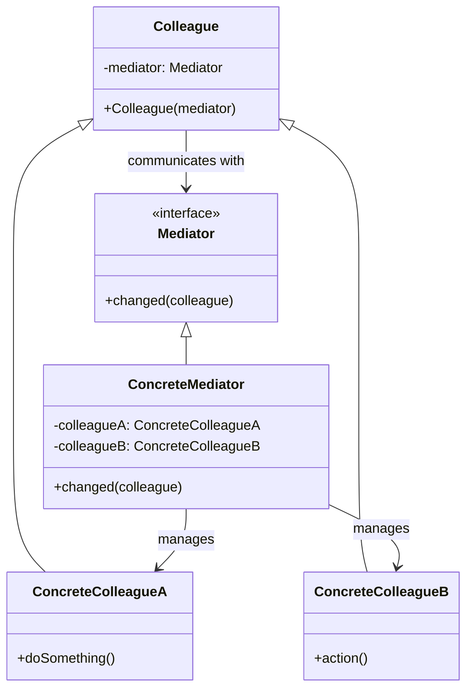
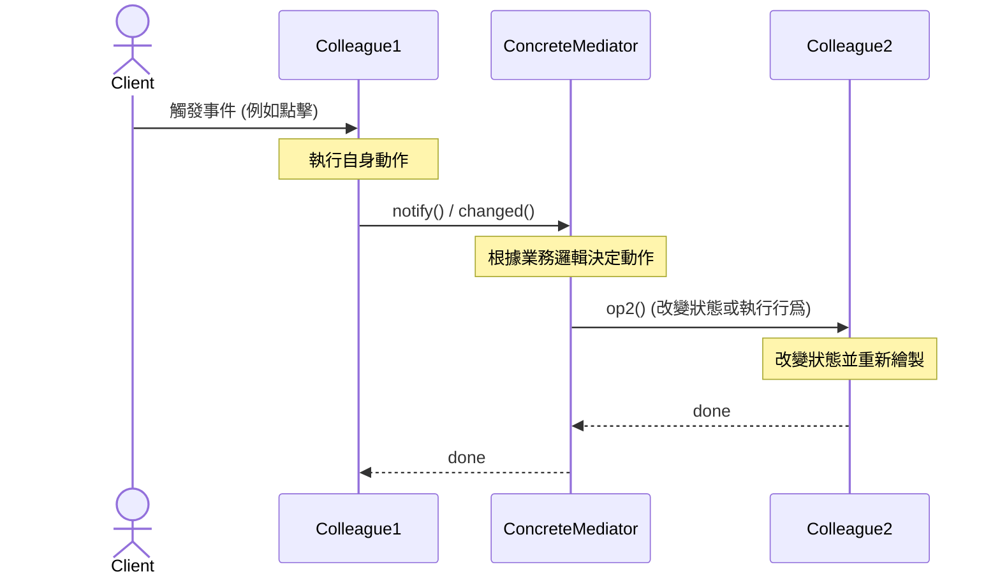
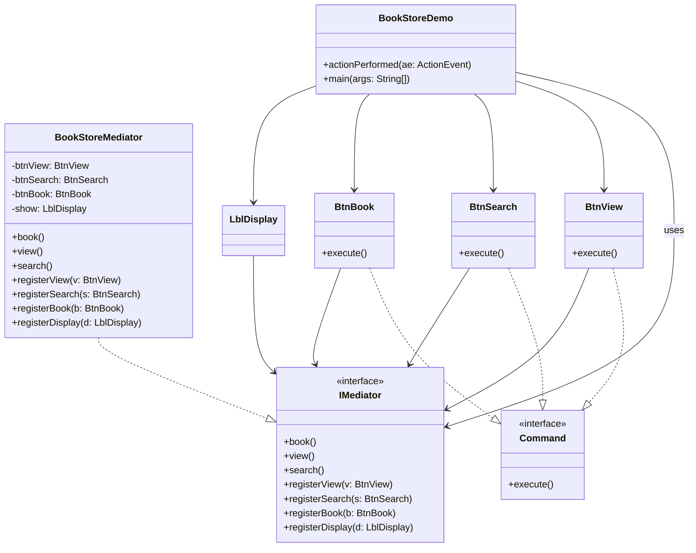

###### tags: `OOSE`

# Ch24 七星聚會：Mediator

## 24.1 目的與定義

> 定義一個物件來封裝一群物件之間的互動，藉此降低彼此之間的直接耦合。

> **設計樣式定義**
> *Define an object that encapsulates how a set of objects interact. Mediator promotes loose coupling by keeping objects from referring to each other explicitly, and it lets you vary their interaction independently.*
> （定義一個用以封裝一組物件如何互動的物件。中介者透過避免物件間顯式地相互引用來促進鬆散耦合，並允許你獨立地改變它們的互動行為。）

### 24.1.1 核心思想：從「網狀多對多」到「星狀一對多」
在複雜的系統設計中，多個物件常需要協同工作。如果讓這些物件直接相互呼叫，會形成混亂的網狀依賴關係（Mesh Network）。

當有 $N$ 個物件時，彼此直接依賴最多會產生 $O(N^2)$ 條溝通線路，這會使系統陷入**「牽一髮而動全身」**的窘境，且各物件無法在其他場景中被單獨重用。

**中介者樣式 (Mediator)** 的核心解決方案是：
1. **斬斷直接關聯**：禁止同儕物件（Colleagues）直接通訊。
2. **星狀集中調度**：引入一個中介者（Mediator）。所有 Colleagues 只與 Mediator 溝通（變成一對多的星狀拓撲，Star Network，關聯線路降為 $O(N)$）。
3. **委託協調行為**：Colleagues 在自身狀態改變或觸發事件時，統一通知 Mediator；再由 Mediator 根據業務邏輯，去改變其他對應 Colleagues 的狀態。

---

## 24.2 動機與生活實喻

### 24.2.1 生活實喻：機場塔台 (Air Traffic Control Tower)
如果沒有機場塔台，在機場起飛與降落的數十架飛機（Colleagues）必須彼此通訊以進行避讓與排隊協調。每位飛行員都需要一邊開飛機，一邊與天空中所有其他飛機確認位置，這是一個極度危險且溝通開銷呈指數級成長的設計。

* **導入塔台（Mediator）後**：所有的飛機只需將自己的高度與位置通報給塔台，並遵照塔台指示的跑道與順序起降。飛機彼此之間**完全不知道對方的存在**，溝通結構瞬間變得極其清晰且安全。

#### 溝通拓撲對比：

```mermaid
graph TD
    subgraph 網狀多對多 (無 Mediator)
        A((飛機 A)) <--> B((飛機 B))
        A <--> C((飛機 C))
        A <--> D((飛機 D))
        B <--> C
        B <--> D
        C <--> D
    end

    subgraph 星狀結構 (有 Mediator)
        F((飛機 A)) <--> T[(( 塔台 Mediator ))]
        G((飛機 B)) <--> T
        H((飛機 C)) <--> T
        I((飛機 D)) <--> T
    end
    
    style T fill:#f9f,stroke:#333,stroke-width:2px
```

---

### 24.2.2 適用時機
* **物件間存在複雜且混亂的交互關係**，導致系統依賴結構混亂、程式可讀性與可維護性低下。
* **想重用一些物件，但因為它們與其他物件強烈依賴而難以抽離**。
* **想要在不修改個別物件內部細節的前提下，靈活調整物件間的協同行為與狀態切換邏輯**（例如 GUI 介面上，點擊某按鈕會同時改變多個輸入框與標籤的啟用狀態）。

---

## 24.3 結構與方法


*FIG: Mediator 設計樣式結構*

### 24.3.1 類別關係圖 (Mermaid)

為了確保在沒有外部圖片加載時文件依然完備，以下是本樣式的通用類別圖：



### 24.3.2 參與者角色與職責

| 角色 | 英文名稱 | 職責與說明 |
| :--- | :--- | :--- |
| **抽象中介者** | `Mediator` | 定義同儕物件（Colleague）之間相互溝通與登記註冊的抽象介面。 |
| **具體中介者** | `ConcreteMediator` | 實作中介者介面。它必須知道並維護各個具體同儕物件（ConcreteColleagues）的參考，並負責協調它們之間的行為與狀態轉移。 |
| **同儕抽象類別** | `Colleague` | 同儕物件的共同基底類別。每個同儕物件都必須持有 `Mediator` 的參考，以便在發生事件時向其報告。 |
| **具體同儕類別** | `ConcreteColleague` | 具體的協作元件。每個同儕物件只專注於自己本身的職責（例如按鈕只負責按鈕的行為），它**絕不與其他同儕物件直接對話**，所有的事件傳遞都統一委託給中介者。 |

### 24.3.3 運作序列圖 (Sequence Diagram)
當一個同儕物件 `Colleague1` 發生狀態改變或被點擊時，它是如何透過中介者影響 `Colleague2` 的：



---

## 24.4 程式樣板

以下呈現最簡潔、結構嚴密且附有注釋的 Java 中介者程式樣板，協助讀者快速掌握物件間的雙向登記註冊與通訊機制。

```java
package mediator.template;

// 1. 抽象中介者介面
interface IMediator {
    void registerColleague1(Colleague1 c);
    void registerColleague2(Colleague2 c);
    
    // 💡 Colleagues 發生事件時呼叫此方法通知中介者
    void changed(Colleague colleague);
}

// 2. 具體中介者實作
class ConcreteMediator implements IMediator {
    private Colleague1 c1;
    private Colleague2 c2;

    @Override
    public void registerColleague1(Colleague1 c) {
        this.c1 = c;
    }

    @Override
    public void registerColleague2(Colleague2 c) {
        this.c2 = c;
    }

    // 💡 集中控制邏輯：在此決定物件間如何影響
    @Override
    public void changed(Colleague colleague) {
        if (colleague == c1) {
            System.out.println("★ 中介者收到 Colleague1 的狀態變更 -> 通知 Colleague2 執行對應動作");
            c2.receiveAction();
        } else if (colleague == c2) {
            System.out.println("★ 中介者收到 Colleague2 的狀態變更 -> 通知 Colleague1 執行對應動作");
            c1.receiveAction();
        }
    }
}

// 3. 抽象同儕基類
abstract class Colleague {
    protected IMediator mediator; // 持有中介者參考

    public Colleague(IMediator mediator) {
        this.mediator = mediator;
    }
}

// 4. 具體同儕 1
class Colleague1 extends Colleague {
    public Colleague1(IMediator mediator) {
        super(mediator);
        mediator.registerColleague1(this); // 主動向中介者註冊
    }

    // 自身發生的業務行為
    public void triggerEvent() {
        System.out.println("Colleague1: 我被觸發了！通知中介者。");
        mediator.changed(this);
    }

    // 由中介者代為調用的聯動行為
    public void receiveAction() {
        System.out.println("Colleague1: 收到中介者通知，更新狀態。");
    }
}

// 5. 具體同儕 2
class Colleague2 extends Colleague {
    public Colleague2(IMediator mediator) {
        super(mediator);
        mediator.registerColleague2(this);
    }

    public void triggerEvent() {
        System.out.println("Colleague2: 我被觸發了！通知中介者。");
        mediator.changed(this);
    }

    public void receiveAction() {
        System.out.println("Colleague2: 收到中介者通知，更新狀態。");
    }
}

// 6. 測試主程式
public class MediatorTemplate {
    public static void main(String[] args) {
        IMediator med = new ConcreteMediator();

        Colleague1 c1 = new Colleague1(med);
        Colleague2 c2 = new Colleague2(med);

        // c1 與 c2 互不知道對方，但動作依然產生了聯動
        c1.triggerEvent();
        System.out.println("-------------------------------------");
        c2.triggerEvent();
    }
}
```

---

## 24.5 實務範例

### 24.5.1 線上書店 GUI 排版協調器 (BookStore)
想像一個線上書店的簡易管理視窗，包含：`View`（觀看）、`Book`（預定）、`Search`（搜尋）三個按鈕與一個顯示狀態文字的 `DisplayLabel`。

這些 GUI 元件的聯動規則極為繁雜：
* 按下 **View** 時：View 自身變為停用（避免重複按），Book 與 Search 啟用，顯示文字變為 `"Viewing..."`。
* 按下 **Book** 時：Book 自身變為停用，View 與 Search 啟用，顯示文字變為 `"Booking..."`。
* 按下 **Search** 時：Search 自身變為停用，View 與 Book 啟用，顯示文字變為 `"Searching..."`。

如果讓按鈕直接呼叫並更新其他按鈕的狀態，這三個按鈕與標籤類別之間會強烈耦合。


*FIG: BookStore GUI 元件架構*

#### 1. 系統類別關係設計
在以下設計中，我們利用 **Command 樣式** 統一了按鈕觸發的介面，並以 `BookStoreMediator` 集中管理所有 GUI 元件的狀態啟用與文字切換：



#### 2. Java Swing 完整程式實作

[src/LayoutDemo.java](src/LayoutDemo.java) (此為 GUI 類似設計，以下為書店具體程式實作範例)

```java
package mediator;

import java.awt.Font;
import java.awt.event.ActionEvent;
import java.awt.event.ActionListener;
import javax.swing.JButton;
import javax.swing.JFrame;
import javax.swing.JLabel;
import javax.swing.JPanel;

// 1. 同事共同介面：Command 樣式
interface Command {
	void execute();
}

// 2. 抽象中介者介面
interface IMediator {
	void book();
	void view();
	void search();
	
	void registerView(BtnView v);
	void registerSearch(BtnSearch s);
	void registerBook(BtnBook b);
	void registerDisplay(LblDisplay d);
}

// 3. 具體中介者：集中控制所有按鈕狀態與標籤更新
class BookStoreMediator implements IMediator {
	private BtnView btnView;
	private BtnSearch btnSearch;
	private BtnBook btnBook;
	private LblDisplay show;

	@Override
	public void registerView(BtnView v) { btnView = v; }
	@Override
	public void registerSearch(BtnSearch s) { btnSearch = s; }
	@Override
	public void registerBook(BtnBook b) { btnBook = b; }
	@Override
	public void registerDisplay(LblDisplay d) { show = d; }

	@Override
	public void book() {
		btnBook.setEnabled(false);
		btnView.setEnabled(true);
		btnSearch.setEnabled(true);
		show.setText("Booking...");
	}

	@Override
	public void view() {
		btnView.setEnabled(false);
		btnSearch.setEnabled(true);
		btnBook.setEnabled(true);
		show.setText("Viewing...");
	}

	@Override
	public void search() {
		btnSearch.setEnabled(false);
		btnView.setEnabled(true);
		btnBook.setEnabled(true);
		show.setText("Searching...");
	}
}

// 4. 各個具體 Colleagues 元件 (只與 Mediator 對話)
class BtnView extends JButton implements Command {
	private IMediator med;

	BtnView(ActionListener al, IMediator m) {
		super("View");
		addActionListener(al);
		med = m;
		med.registerView(this); // 向中介者註冊
	}

	@Override
	public void execute() {
		med.view(); // 委託中介者決定後續動作
	}
}

class BtnSearch extends JButton implements Command {
	private IMediator med;

	BtnSearch(ActionListener al, IMediator m) {
		super("Search");
		addActionListener(al);
		med = m;
		med.registerSearch(this);
	}

	@Override
	public void execute() {
		med.search();
	}
}

class BtnBook extends JButton implements Command {
	private IMediator med;

	BtnBook(ActionListener al, IMediator m) {
		super("Book");
		addActionListener(al);
		med = m;
		med.registerBook(this);
	}

	@Override
	public void execute() {
		med.book();
	}
}

class LblDisplay extends JLabel {
	private IMediator med;

	LblDisplay(IMediator m) {
		super("Just start...");
		med = m;
		med.registerDisplay(this);
		setFont(new Font("Arial", Font.BOLD, 24));
		setHorizontalAlignment(JLabel.CENTER);
	}
}

// 5. Client 視窗主類別
public class BookStoreDemo extends JFrame implements ActionListener {
	private IMediator med = new BookStoreMediator();

	public BookStoreDemo() {
		super("BookStore GUI Mediator");
		JPanel p = new JPanel();
		
		// 建立同事元件並傳入共同的中介者
		p.add(new BtnView(this, med));
		p.add(new BtnBook(this, med));
		p.add(new BtnSearch(this, med));
		
		getContentPane().add(new LblDisplay(med), "North");
		getContentPane().add(p, "South");
		
		setSize(350, 150);
		setLocationRelativeTo(null);
		setVisible(true);
		setDefaultCloseOperation(JFrame.EXIT_ON_CLOSE);
	}

	// 💡 所有按鈕統一在此被攔截，並調用對應 Command 介面
	@Override
	public void actionPerformed(ActionEvent ae) {
		if (ae.getSource() instanceof Command) {
			Command comd = (Command) ae.getSource();
			comd.execute();
		}
	}

	public static void main(String[] args) {
		new BookStoreDemo();
	}
}
```

---

## 24.6 進階討論

### 24.6.1 Mediator 樣式與 Observer（觀察者）樣式的協同與差異
中介者樣式與觀察者樣式在解決「物件解耦」上有很大的相似之處，且在實際大型系統中常常**結合使用**。

#### 1. 協同使用：使用 Observer 實現動體中介者
在 Section 24.4 的程式樣板中，中介者必須硬性寫死各種 `registerView()` 或 `registerSearch()` 等方法，這造成了中介者對具體 Colleague 類別的依賴。
* **解決做法**：可以讓 **`IMediator` 繼承 `Observer` 介面**，而所有的 **`Colleagues` 繼承 `Observable`（主題）**。
* **運作機制**：當同事元件被觸發時，直接呼叫 `notifyObservers()` 通知中介者。中介者收到事件（`update()`）後再做協調。這樣中介者不需要硬性宣告註冊介面，實現了動態的事件訂閱，解耦得更徹底。

#### 2. 本質差異比較：
* **Observer 樣式**：主要解決「**一對多**」的單向通知依賴關係。目標（Subject）不知道是誰在觀察它，只管向所有訂閱者播報狀態更新。
* **Mediator 樣式**：主要解決「**多對多**」的複雜物件雙向交互控制。它封裝了多個同儕物件之間複雜且特定的協同業務邏輯。

---

### 24.6.2 Mediator 樣式與 Facade（門面）樣式的比較
這兩個樣式都是透過「引入一個新物件」來簡化系統結構，但它們的作用完全不同：

| 維度 | Mediator 設計樣式 (中介者) | Facade 設計樣式 (門面) |
| :--- | :--- | :--- |
| **通訊方向** | **雙向 (Bidirectional)** 通訊。中介者協調各同儕物件，同儕物件也知道中介者的存在並主動向其匯報。 | **單向 (Unidirectional)** 通訊。門面只為子系統提供簡化的對外入口，子系統內部類別完全不知道門面的存在。 |
| **核心意圖** | 用於降低多個同儕物件在系統**內部的直接耦合度與交互複雜度**。 | 用於在外部 Client 與龐大子系統之間**提供一層簡化且高階的封裝介面**。 |
| **控制力** | 中介者高度介入子系統內部各元件的狀態流轉。 | 門面通常只做請求的轉發與簡單排序，不控制子系統元件的行為。 |

---

### 24.6.3 中介者的「神之物件 (God Object)」危機與防範
雖然中介者樣式能讓同事物件變得簡單且高重用性，但這背後是有代價的：**「所有的複雜度都轉嫁到了中介者身上。」**

#### 1. 什麼是「神之物件」？
如果系統的聯動業務極多，中介者（`ConcreteMediator`）會漸漸膨脹，裡面塞滿了無數的同事參考、狀態旗標與繁複的判斷分支，最終成為一個體積無比巨大、極難修改與除錯的「大泥球（God Object / Monster Object）」。

#### 2. 防範與優化策略：
1. **合理劃分子系統中介者**：不要在系統中只使用唯一的「超級中介者」。應該根據業務領域，劃分出多個獨立的小中介者（例如將購物流程中介者、GUI排版中介者、日誌發送中介者分開）。
2. **結合其他設計樣式**：
   * 結合 **Strategy (策略樣式)**：將複雜的協調規則封裝在不同的策略類別中，中介者動態替換策略。
   * 結合 **Command (命令樣式)**：將具體業務操作包裝成 Command 物件，中介者只負責分發命令，避免邏輯膨脹。

---

## 24.7 隨堂測驗

1. 下列關於 Mediator 設計樣式核心目的之描述，何者最為正確？
	A) 作為一群物件溝通的集中橋樑，藉此降低彼此直接依賴的耦合度
	B) 作為代理（Proxy）物件，藉此降低網路負擔，提昇快取效能
	C) 透過單向訂閱機制，當主體狀態改變時，自動發出廣播通知
	D) 統整相關物件的介面為唯一，藉此隱藏底層物件的複雜度		

	<details>
	<summary>解答</summary>
	
	**A) 作為一群物件溝通的集中橋樑，藉此降低彼此直接依賴的耦合度**
	說明：Mediator 藉由限制同儕物件間直接進行呼叫，將原本的 $O(N^2)$ 複雜依存網簡化為星狀拓撲（$O(N)$），大幅度降低了物件間的直接耦合度。
	</details>

2. 在 Mediator 設計樣式中，Colleague（同事物件）與 Mediator 之間的導向導航關係通常是？
	A) 單向導航：只有 Mediator 知道 Colleague 們，Colleague 們不知道 Mediator 的存在
	B) 雙向導航：Mediator 維護所有 Colleagues 的參考；Colleagues 也持有 Mediator 參考以便在事件發生時通知它
	C) 互不導航：兩者只透過靜態常數通訊

	<details>
	<summary>解答</summary>
	
	**B) 雙向導航：Mediator 維護所有 Colleagues 的參考；Colleagues 也持有 Mediator 參考以便在事件發生時通知它**
	說明：為了讓同儕物件能向中介者報告事件，且中介者能回頭更新同儕物件的狀態，兩者之間通常建立雙向的參考與註冊關聯。
	</details>

3. 機場的「航管塔台」指揮多架飛機安全起降，這與哪一個設計樣式的架構與思維最為契合？
	A) Observer (觀察者樣式)
	B) Facade (門面樣式)
	C) Mediator (中介者樣式)
	D) Chain of Responsibility (責任鏈樣式)

	<details>
	<summary>解答</summary>
	
	**C) Mediator (中介者樣式)**
	說明：飛機之間不直接聯繫，而是各自與塔台溝通，由塔台（Mediator）統一調度與協調，這正是 Mediator 的核心典型寫照。
	</details>

4. 有關 Mediator（中介者）與 Facade（門面）設計樣式的比較，下列描述何者**錯誤**？
	A) Facade 主要是由外而內提供單向簡化介面；Mediator 則是多個內部同儕元件進行雙向通訊
	B) 子系統內的類別一般不知道 Facade 的存在；但 Colleagues 必須明確知道 Mediator 的存在
	C) 兩者雖然結構不同，但當 Mediator 太過龐大臃腫時，可將其重構為一個簡單的 Facade 樣式

	<details>
	<summary>解答</summary>
	
	**C) 兩者雖然結構不同，但當 Mediator 太過龐大臃腫時，可將其重構為一個簡單的 Facade 樣式**
	說明：C 是錯誤的。Mediator 承載了複雜的雙向狀態同步與協作流程，而 Facade 僅是單向簡化封裝，兩者無法直接等價替換。當 Mediator 太過臃腫時，正確做法是進行中介者拆分（Decomposition），或引入 Command/Strategy 進行重構。
	</details>

---

## 24.8 課堂練習與挑戰

### EX01 結構繪製
在不看教材的情況下，請應用 UML 繪圖工具完整畫出具備多型註冊機制的 Mediator 設計樣式結構圖（包含 `Mediator`、`ConcreteMediator`、`Colleague`、`ConcreteColleague` 及其關聯與依賴箭頭）。

---

### EX02 象棋操作介面狀態協調器 (Chess UI System)
請利用 **Java Swing** 與 **Mediator 設計樣式** 實作一個簡易的象棋操作面板。介面包含以下四個元件：
1. `BtnSelect` 按鈕：用來點選棋子（文字顯示 `"Select Piece"`）。
2. `BtnMove` 按鈕：用來移動棋子（文字顯示 `"Move Piece"`）。
3. `BtnCancel` 按鈕：用來取消當前操作（文字顯示 `"Cancel"`）。
4. `StatusLabel` 標籤：用來展示當前操作狀態。

#### 協調聯動邏輯：
* **初始狀態 / 按下 Cancel 時**：
  * `BtnSelect` 啟用（`Enabled = true`）。
  * `BtnMove` 與 `BtnCancel` 停用（`Enabled = false`）。
  * `StatusLabel` 顯示：`"Please select a piece..."`。
* **按下 Select Piece 時**：
  * `BtnSelect` 停用。
  * `BtnMove` 與 `BtnCancel` 啟用。
  * `StatusLabel` 顯示：`"Piece selected. Ready to move."`。
* **按下 Move Piece 時**：
  * `BtnSelect` 啟用。
  * `BtnMove` 與 `BtnCancel` 停用。
  * `StatusLabel` 顯示：`"Move done successfully!"`。

#### 實作引導與程式框架

請實作並補完以下 Java 程式碼，確保按鈕之間沒有直接呼叫，全部行為與 UI 狀態變更統一委託給中介者協調：

```java
import java.awt.Font;
import java.awt.event.ActionEvent;
import java.awt.event.ActionListener;
import javax.swing.JButton;
import javax.swing.JFrame;
import javax.swing.JLabel;
import javax.swing.JPanel;

// 💡 共同的同事行為介面
interface GameCommand {
    void execute();
}

// 💡 抽象中介者介面
interface IGameMediator {
    void select();
    void move();
    void cancel();
    
    void registerSelect(BtnSelect s);
    void registerMove(BtnMove m);
    void registerCancel(BtnCancel c);
    void registerStatus(StatusLabel l);
}

// 💡 具體中介者：在此實作所有的 UI 按鈕邏輯與狀態通知
class ChessMediator implements IGameMediator {
    private BtnSelect btnSelect;
    private BtnMove btnMove;
    private BtnCancel btnCancel;
    private StatusLabel statusLabel;

    @Override
    public void registerSelect(BtnSelect s) { this.btnSelect = s; }
    @Override
    public void registerMove(BtnMove m) { this.btnMove = m; }
    @Override
    public void registerCancel(BtnCancel c) { this.btnCancel = c; }
    @Override
    public void registerStatus(StatusLabel l) { this.statusLabel = l; }

    @Override
    public void select() {
        // [TODO: 1. 控制按鈕的啟用/停用狀態]
        
        // [TODO: 2. 更新狀態標籤文字]
    }

    @Override
    public void move() {
        // [TODO: 1. 控制按鈕的啟用/停用狀態]
        
        // [TODO: 2. 更新狀態標籤文字]
    }

    @Override
    public void cancel() {
        // [TODO: 1. 控制按鈕的啟用/停用狀態]
        
        // [TODO: 2. 更新狀態標籤文字]
    }
}

// ==================== 具體同事元件實作 ====================

class BtnSelect extends JButton implements GameCommand {
    private IGameMediator med;
    
    public BtnSelect(ActionListener al, IGameMediator m) {
        super("Select Piece");
        addActionListener(al);
        this.med = m;
        med.registerSelect(this);
    }
    @Override
    public void execute() {
        med.select();
    }
}

class BtnMove extends JButton implements GameCommand {
    private IGameMediator med;
    
    public BtnMove(ActionListener al, IGameMediator m) {
        super("Move Piece");
        addActionListener(al);
        this.med = m;
        med.registerMove(this);
    }
    @Override
    public void execute() {
        med.move();
    }
}

class BtnCancel extends JButton implements GameCommand {
    private IGameMediator med;
    
    public BtnCancel(ActionListener al, IGameMediator m) {
        super("Cancel");
        addActionListener(al);
        this.med = m;
        med.registerCancel(this);
    }
    @Override
    public void execute() {
        med.cancel();
    }
}

class StatusLabel extends JLabel {
    private IGameMediator med;
    
    public StatusLabel(IGameMediator m) {
        super("Welcome! Please select a piece...");
        this.med = m;
        med.registerStatus(this);
        setFont(new Font("Arial", Font.BOLD, 18));
        setHorizontalAlignment(JLabel.CENTER);
    }
}

// ==================== 測試視窗主程式 ====================

public class ChessGameUI extends JFrame implements ActionListener {
    private IGameMediator med = new ChessMediator();

    public ChessGameUI() {
        super("Chess Mediator System");
        JPanel panel = new JPanel();
        
        panel.add(new BtnSelect(this, med));
        panel.add(new BtnMove(this, med));
        panel.add(new BtnCancel(this, med));
        
        getContentPane().add(new StatusLabel(med), "North");
        getContentPane().add(panel, "South");
        
        // 初始設定狀態為 cancel / 預設狀態
        med.cancel();

        setSize(400, 150);
        setLocationRelativeTo(null);
        setVisible(true);
        setDefaultCloseOperation(JFrame.EXIT_ON_CLOSE);
    }

    @Override
    public void actionPerformed(ActionEvent ae) {
        if (ae.getSource() instanceof GameCommand) {
            GameCommand cmd = (GameCommand) ae.getSource();
            cmd.execute();
        }
    }

    public static void main(String[] args) {
        new ChessGameUI();
    }
}
```

<details>
<summary>練習參考答案與實作提示</summary>

在 `ChessMediator` 類別中，補完以下三個協調方法：

```java
    @Override
    public void select() {
        btnSelect.setEnabled(false);
        btnMove.setEnabled(true);
        btnCancel.setEnabled(true);
        statusLabel.setText("Piece selected. Ready to move.");
    }

    @Override
    public void move() {
        btnSelect.setEnabled(true);
        btnMove.setEnabled(false);
        btnCancel.setEnabled(false);
        statusLabel.setText("Move done successfully!");
    }

    @Override
    public void cancel() {
        btnSelect.setEnabled(true);
        btnMove.setEnabled(false);
        btnCancel.setEnabled(false);
        statusLabel.setText("Please select a piece...");
    }
```

</details>
