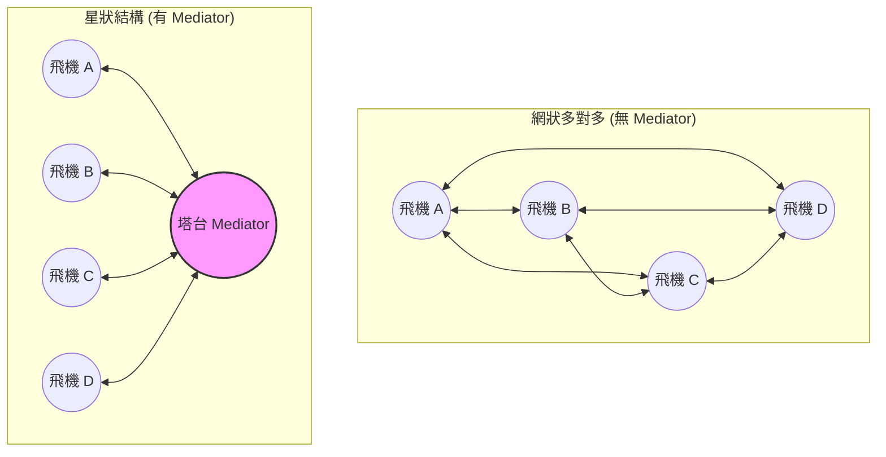
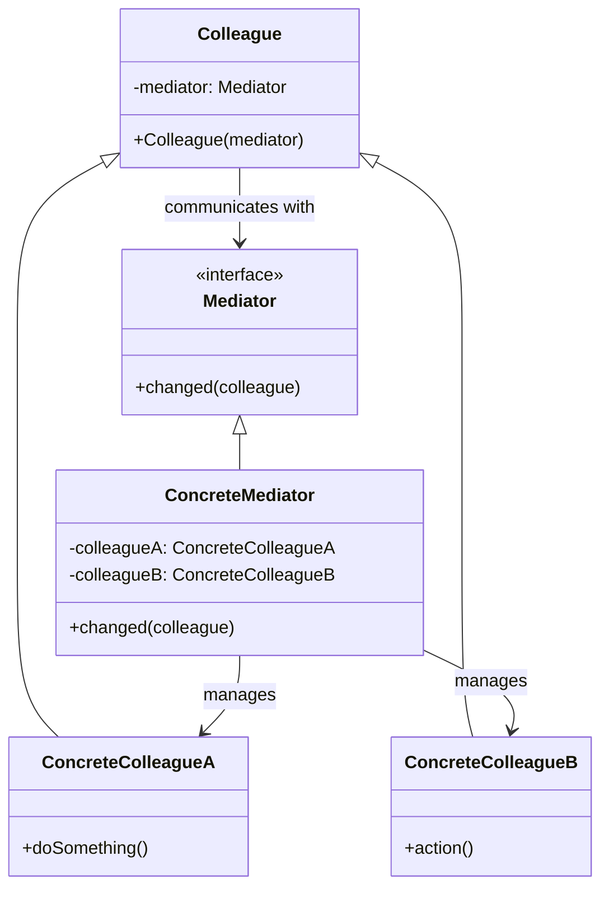
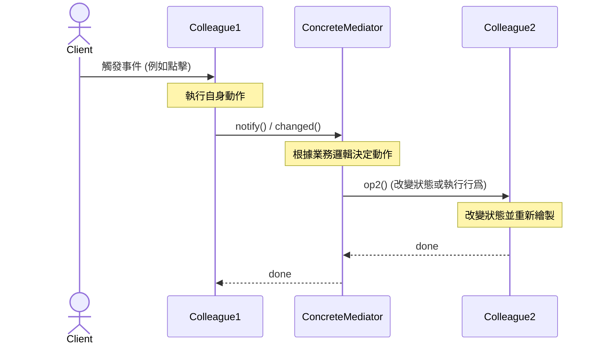
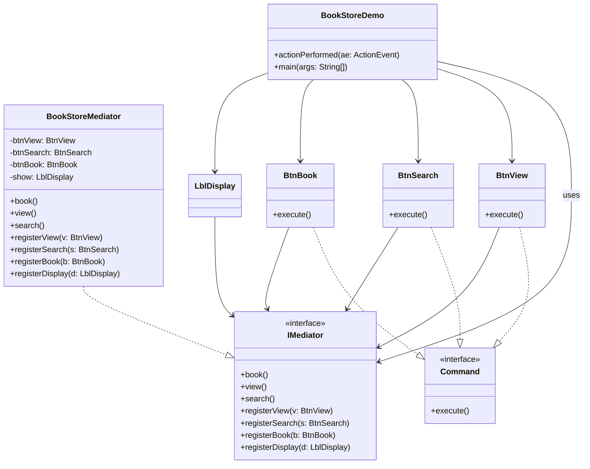
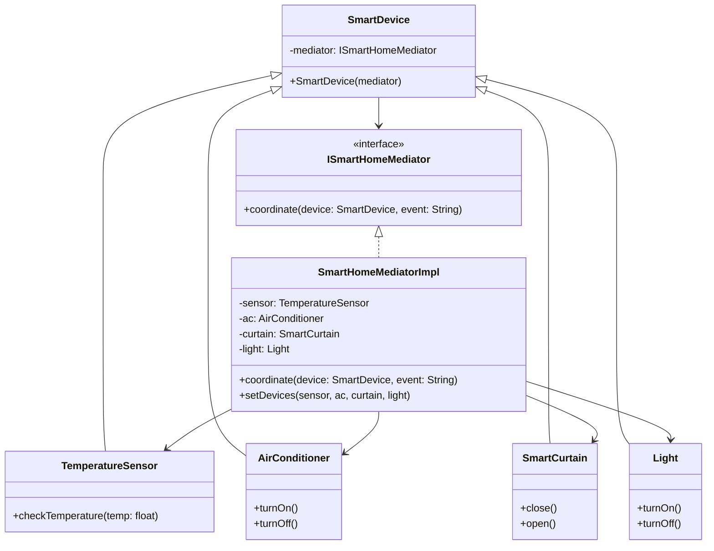

###### tags: `OOSE`

# Ch24 七星聚會：Mediator

## 24.1 目的與定義

> 定義一個物件來封裝一群物件之間的互動，藉此降低彼此之間的直接耦合。

> **設計樣式定義**
> *Define an object that encapsulates how a set of objects interact. Mediator promotes loose coupling by keeping objects from referring to each other explicitly, and it lets you vary their interaction independently.*
> （定義一個用以封裝一組物件如何互動的物件。中介者透過避免物件間顯式地相互引用來促進鬆散耦合，並允許你獨立地改變它們的互動行為。）

### 24.1.1 核心思想：從「網狀多對多」到「星狀一對多」
在複雜的系統設計中，多個物件常需要協同工作。如果讓這些物件直接相互呼叫，會形成混亂的網狀依賴關係（Mesh Network）。

當有 $N$ 個物件時，彼此直接依賴最多會產生 $O(N^2)$ 條溝通線路，這會使系統陷入**「牽一髮而動全身」**的窘境，且各物件無法在其他場景中被單獨重用。

**中介者樣式 (Mediator)** 的核心解決方案是：
1. **斬斷直接關聯**：禁止同儕物件（Colleagues）直接通訊。
2. **星狀集中調度**：引入一個中介者（Mediator）。所有 Colleagues 只與 Mediator 溝通（變成一對多的星狀拓撲，Star Network，關聯線路降為 $O(N)$）。
3. **委託協調行為**：Colleagues 在自身狀態改變或觸發事件時，統一通知 Mediator；再由 Mediator 根據業務邏輯，去改變其他對應 Colleagues 的狀態。

### 24.1.2 傳統設計的痛點：緊密耦合的網狀結構
我們來看一個真實的軟體設計場景。假設我們在設計一個簡單的登入註冊對話框，包含三個元件：`TextBox`（輸入框）、`Button`（送出按鈕）、`Checkbox`（服務條款勾選框）。

它們的互動邏輯如下：
1. 當使用者在 `TextBox` 輸入文字時，如果輸入框為空，`Button` 必須停用；若有字則根據 `Checkbox` 狀態決定是否啟用。
2. 當使用者勾選/取消勾選 `Checkbox` 時，`Button` 的啟用狀態必須隨之更新（只有勾選且 `TextBox` 有文字時，按鈕才能啟用）。
3. 當使用者按下 `Button` 執行登入後，`TextBox` 的文字要清空，且 `Checkbox` 必須取消勾選。

如果使用傳統的直覺式設計，我們會讓這三個元件在內部直接持有並相互呼叫對方：

```java
// 傳統無中介者設計：元件間緊密耦合
class TextBox {
    private Button button;
    private Checkbox checkbox;

    public void setReferences(Button b, Checkbox c) {
        this.button = b;
        this.checkbox = c;
    }

    public void onTextChanged(String text) {
        if (text.isEmpty()) {
            button.setEnabled(false);
        } else if (checkbox.isChecked()) {
            button.setEnabled(true);
        }
    }

    public void clear() {
        System.out.println("TextBox: 清空文字內容");
    }
}

class Checkbox {
    private Button button;
    private TextBox textBox;

    public void setReferences(Button b, TextBox t) {
        this.button = b;
        this.textBox = t;
    }

    public void onCheckedChanged(boolean checked) {
        // 直接存取並操作 Button 的狀態
        if (checked && !button.isTextBoxEmpty()) {
            button.setEnabled(true);
        } else {
            button.setEnabled(false);
        }
    }

    public boolean isChecked() {
        return true; // 簡化模擬
    }

    public void setChecked(boolean checked) {
        System.out.println("Checkbox: 設定勾選狀態為 " + checked);
    }
}

class Button {
    private TextBox textBox;
    private Checkbox checkbox;

    public void setReferences(TextBox t, Checkbox c) {
        this.textBox = t;
        this.checkbox = c;
    }

    public void setEnabled(boolean enabled) {
        System.out.println("Button: 啟用狀態設定為 -> " + enabled);
    }

    public boolean isTextBoxEmpty() {
        return false; // 簡化模擬
    }

    public void onClick() {
        System.out.println("Button: 執行登入程序...");
        // 直接呼叫其他元件進行聯動狀態清除
        textBox.clear();
        checkbox.setChecked(false);
    }
}
```

#### 這樣設計的缺點：
1. **強耦合與高依賴性（違反迪米特法則 / LoD）**：每個元件都必須持有其他所有協作元件的直接參考。`TextBox` 知道 `Button` 與 `Checkbox`；`Checkbox` 知道 `Button` 與 `TextBox`；`Button` 也知道 `TextBox` 與 `Checkbox`。這形成了一個網狀依賴，違反了「只與直接的朋友對話」的設計原則。
2. **重用性極差**：因為 `TextBox` 類別中硬性綁定了 `Button` 與 `Checkbox` 的型態，如果我們想在另一個沒有勾選框的視窗中重用這個 `TextBox`，我們將完全無法抽離它，除非去修改它的原始碼。
3. **擴展與維護的災難（違反 OCP）**：如果未來對話框需要新增一個元件，例如一個提示錯誤的 `Label`，那麼我們必須修改 `TextBox`、`Checkbox` 與 `Button` 的內部程式碼，將 `Label` 的參考傳進去並加上控制邏輯。隨著元件增多，這段程式碼將迅速退化成極難維護的「義大利麵條（Spaghetti Code）」網狀結構。

---

## 24.2 動機與生活實喻

### 24.2.1 生活實喻：機場塔台 (Air Traffic Control Tower)
如果沒有機場塔台，在機場起飛與降落的數十架飛機（Colleagues）必須彼此通訊以進行避讓與排隊協調。每位飛行員都需要一邊開飛機，一邊與天空中所有其他飛機確認位置，這是一個極度危險且溝通開銷呈指數級成長的設計。

* **導入塔台（Mediator）後**：所有的飛機只需將自己的高度與位置通報給塔台，並遵照塔台指示的跑道與順序起降。飛機彼此之間**完全不知道對方的存在**，溝通結構瞬間變得極其清晰且安全。

#### 溝通拓撲對比：



---

### 24.2.2 適用時機
* **物件間存在複雜且混亂的交互關係**，導致系統依賴結構混亂、程式可讀性與可維護性低下。
* **想重用一些物件，但因為它們與其他物件強烈依賴而難以抽離**。
* **想要在不修改個別物件內部細節的前提下，靈活調整物件間的協同行為與狀態切換邏輯**（例如 GUI 介面上，點擊某按鈕會同時改變多個輸入框與標籤的啟用狀態）。

[gugu- `Mediator`](https://refactoring.guru/design-patterns/mediator)

---

## 24.3 結構與方法


*FIG: Mediator 設計樣式結構*

### 24.3.1 類別關係圖 (Mermaid)

為了確保在沒有外部圖片加載時文件依然完備，以下是本樣式的通用類別圖：



### 24.3.2 參與者角色與職責

| 角色 | 英文名稱 | 職責與說明 |
| :--- | :--- | :--- |
| **抽象中介者** | `Mediator` | 定義同儕物件（Colleague）之間相互溝通與登記註冊的抽象介面。 |
| **具體中介者** | `ConcreteMediator` | 實作中介者介面。它必須知道並維護各個具體同儕物件（ConcreteColleagues）的參考，並負責協調它們之間的行為與狀態轉移。 |
| **同儕抽象類別** | `Colleague` | 同儕物件的共同基底類別。每個同儕物件都必須持有 `Mediator` 的參考，以便在發生事件時向其報告。 |
| **具體同儕類別** | `ConcreteColleague` | 具體的協作元件。每個同儕物件只專注於自己本身的職責（例如按鈕只負責按鈕的行為），它**絕不與其他同儕物件直接對話**，所有的事件傳遞都統一委託給中介者。 |

### 24.3.3 運作序列圖 (Sequence Diagram)
當一個同儕物件 `Colleague1` 發生狀態改變或被點擊時，它是如何透過中介者影響 `Colleague2` 的：



---

## 24.4 程式樣板

以下呈現最簡潔、結構嚴密且附有注釋的 Java 中介者程式樣板，協助讀者快速掌握物件間的雙向登記註冊與通訊機制。

```java
package mediator.template;

// 1. 抽象中介者介面
interface IMediator {
    void registerColleague1(Colleague1 c);
    void registerColleague2(Colleague2 c);
    
    // 💡 Colleagues 發生事件時呼叫此方法通知中介者
    void changed(Colleague colleague);
}

// 2. 具體中介者實作
class ConcreteMediator implements IMediator {
    private Colleague1 c1;
    private Colleague2 c2;

    @Override
    public void registerColleague1(Colleague1 c) {
        this.c1 = c;
    }

    @Override
    public void registerColleague2(Colleague2 c) {
        this.c2 = c;
    }

    // 💡 集中控制邏輯：在此決定物件間如何影響
    @Override
    public void changed(Colleague colleague) {
        if (colleague == c1) {
            System.out.println("★ 中介者收到 Colleague1 的狀態變更 -> 通知 Colleague2 執行對應動作");
            c2.receiveAction();
        } else if (colleague == c2) {
            System.out.println("★ 中介者收到 Colleague2 的狀態變更 -> 通知 Colleague1 執行對應動作");
            c1.receiveAction();
        }
    }
}

// 3. 抽象同儕基類
abstract class Colleague {
    protected IMediator mediator; // 持有中介者參考

    public Colleague(IMediator mediator) {
        this.mediator = mediator;
    }
}

// 4. 具體同儕 1
class Colleague1 extends Colleague {
    public Colleague1(IMediator mediator) {
        super(mediator);
        mediator.registerColleague1(this); // 主動向中介者註冊
    }

    // 自身發生的業務行為
    public void triggerEvent() {
        System.out.println("Colleague1: 我被觸發了！通知中介者。");
        mediator.changed(this);
    }

    // 由中介者代為調用的聯動行為
    public void receiveAction() {
        System.out.println("Colleague1: 收到中介者通知，更新狀態。");
    }
}

// 5. 具體同儕 2
class Colleague2 extends Colleague {
    public Colleague2(IMediator mediator) {
        super(mediator);
        mediator.registerColleague2(this);
    }

    public void triggerEvent() {
        System.out.println("Colleague2: 我被觸發了！通知中介者。");
        mediator.changed(this);
    }

    public void receiveAction() {
        System.out.println("Colleague2: 收到中介者通知，更新狀態。");
    }
}

// 6. 測試主程式
public class MediatorTemplate {
    public static void main(String[] args) {
        IMediator med = new ConcreteMediator();

        Colleague1 c1 = new Colleague1(med);
        Colleague2 c2 = new Colleague2(med);

        // c1 與 c2 互不知道對方，但動作依然產生了聯動
        c1.triggerEvent();
        System.out.println("-------------------------------------");
        c2.triggerEvent();
    }
}
```

### 24.4.1 設計效益分析

#### 🟢 優點
* **降低耦合度（促進鬆散耦合）**：將多個同儕物件（Colleague）之間的複雜多對多網狀關係，轉化為一對多的星狀關係。同儕物件之間不再需要直接互相引用，只需與中介者交互，實現了元件間的低耦合。
* **提高元件重用性**：每個同儕物件只專注於自己本身的核心職責（例如按鈕只管按鈕點擊，輸入框只管輸入文字），不需要理會其他同儕物件的變化。這使得同儕物件更容易被抽離並在不同的中介者或視窗系統之下被重複使用。
* **簡化物件協作控制**：將複雜的交互與聯動邏輯集中在中介者內，使得系統的協作行為更容易理解、修改與維護，不再散落在各個分散的類別中。
* **符合開閉原則 (OCP)**：如果需要改變多個物件之間的協調方式，或者要調整事件的聯動規則，我們只需要新增或修改具體中介者即可，同儕物件的原始碼完全不需要變動。

#### 🔴 缺點
* **中介者過於龐大（「神之物件」危機）**：如果同儕物件非常多，且交互聯動邏輯極為複雜，中介者類別（`ConcreteMediator`）會塞滿大量的元件參考與複雜的條件分支，漸漸膨脹成一個異常臃腫且難以維護的「超級物件（God Object / Monster Object）」。
* **單元測試較為困難**：由於中介者集中了所有的交互控制，測試中介者時必須同時模擬或配置大量的同儕物件，增加了單元測試的撰寫難度。

---

## 24.5 實務範例

### 24.5.1 線上書店 GUI 排版協調器 (BookStore)
想像一個線上書店的簡易管理視窗，包含：`View`（觀看）、`Book`（預定）、`Search`（搜尋）三個按鈕與一個顯示狀態文字的 `DisplayLabel`。

這些 GUI 元件的聯動規則極為繁雜：
* 按下 **View** 時：View 自身變為停用（避免重複按），Book 與 Search 啟用，顯示文字變為 `"Viewing..."`。
* 按下 **Book** 時：Book 自身變為停用，View 與 Search 啟用，顯示文字變為 `"Booking..."`。
* 按下 **Search** 時：Search 自身變為停用，View 與 Book 啟用，顯示文字變為 `"Searching..."`。

如果讓按鈕直接呼叫並更新其他按鈕的狀態，這三個按鈕與標籤類別之間會強烈耦合。


*FIG: BookStore GUI 元件架構*

#### 1. 系統類別關係設計
在以下設計中，我們利用 **Command 樣式** 統一了按鈕觸發的介面，並以 `BookStoreMediator` 集中管理所有 GUI 元件的狀態啟用與文字切換：



#### 2. Java Swing 完整程式實作

完整範例程式碼已整理至 [src/BookStoreDemo.java](src/BookStoreDemo.java) 中，您可以直接點擊連結閱讀與編譯執行。

### 24.5.2 實務範例二：智慧家居自動化控制系統 (Smart Home Automation)

在現代智慧家居系統中，有多個智慧家電元件（Colleagues）：`TemperatureSensor`（溫度感測器）、`AirConditioner`（冷氣機）、`SmartCurtain`（智慧窗簾）、`Light`（智慧燈泡）。

這些裝置在自動化情境下，交互作用十分密切。例如：當溫度計感測到室溫過高時，應該自動將冷氣調強，並把拉開的窗簾拉上以遮擋陽光。如果由各個智慧裝置直接去尋找並呼叫其他智慧裝置，則會讓智慧家居的軟體架裝充斥著大量難以維護的網狀耦合。

我們使用 **Mediator 設計樣式**，讓所有裝置只向中央協調器（`SmartHomeMediator`）報告狀態，由協調器統一對其他裝置發號施令。

#### 智慧家居自動化聯動邏輯表

| 觸發元件 (Colleague) | 偵測事件 (Event) | 聯動行為 (Coordinated Actions) |
| :--- | :--- | :--- |
| **TemperatureSensor** (溫度感測器) | 溫度高於 $30^\circ\text{C}$ | 1. 開啟冷氣機（`AirConditioner`）並設為強風模式。<br/>2. 自動拉上窗簾（`SmartCurtain`）遮蔽陽光，以利快速降溫。 |
| **TemperatureSensor** (溫度感測器) | 溫度低於 $22^\circ\text{C}$ | 1. 自動關閉冷氣機，避免過冷與節能。 |
| **SmartCurtain** (智慧窗簾) | 窗簾被拉上 (Closed) | 1. 若室內光線因而不足，自動開啟智慧燈泡（`Light`）。 |
| **SmartCurtain** (智慧窗簾) | 窗簾被拉開 (Opened) | 1. 自動關閉智慧燈泡，充分利用戶外自然光，節約能源。 |

#### 系統類別關係圖 (Mermaid)



#### 完整 Java 程式碼實作

完整範例程式碼已整理至 [src/SmartHomeDemo.java](src/SmartHomeDemo.java) 中，您可以直接點擊連結閱讀與編譯執行。

---

## 24.6 進階討論

### 24.6.1 Mediator 樣式與 Observer（觀察者）樣式的協同與差異
中介者樣式與觀察者樣式在解決「物件解耦」上有很大的相似之處，且在實際大型系統中常常**結合使用**。

#### 1. 協同使用：使用 Observer 實現動體中介者
在 Section 24.4 的程式樣板中，中介者必須硬性寫死各種 `registerView()` 或 `registerSearch()` 等方法，這造成了中介者對具體 Colleague 類別的依賴。
* **解決做法**：可以讓 **`IMediator` 繼承 `Observer` 介面**，而所有的 **`Colleagues` 繼承 `Observable`（主題）**。
* **運作機制**：當同事元件被觸發時，直接呼叫 `notifyObservers()` 通知中介者。中介者收到事件（`update()`）後再做協調。這樣中介者不需要硬性宣告註冊介面，實現了動態的事件訂閱，解耦得更徹底。

#### 2. 本質差異比較：
* **Observer 樣式**：主要解決「**一對多**」的單向通知依賴關係。目標（Subject）不知道是誰在觀察它，只管向所有訂閱者播報狀態更新。
* **Mediator 樣式**：主要解決「**多對多**」的複雜物件雙向交互控制。它封裝了多個同儕物件之間複雜且特定的協同業務邏輯。

---

### 24.6.2 Mediator 樣式與 Facade（門面）樣式的比較
這兩個樣式都是透過「引入一個新物件」來簡化系統結構，但它們的作用完全不同：

| 維度 | Mediator 設計樣式 (中介者) | Facade 設計樣式 (門面) |
| :--- | :--- | :--- |
| **通訊方向** | **雙向 (Bidirectional)** 通訊。中介者協調各同儕物件，同儕物件也知道中介者的存在並主動向其匯報。 | **單向 (Unidirectional)** 通訊。門面只為子系統提供簡化的對外入口，子系統內部類別完全不知道門面的存在。 |
| **核心意圖** | 用於降低多個同儕物件在系統**內部的直接耦合度與交互複雜度**。 | 用於在外部 Client 與龐大子系統之間**提供一層簡化且高階的封裝介面**。 |
| **控制力** | 中介者高度介入子系統內部各元件的狀態流轉。 | 門面通常只做請求的轉發與簡單排序，不控制子系統元件的行為。 |

---

### 24.6.3 中介者的「神之物件 (God Object)」危機與防範
雖然中介者樣式能讓同事物件變得簡單且高重用性，但這背後是有代價的：**「所有的複雜度都轉嫁到了中介者身上。」**

#### 1. 什麼是「神之物件」？
如果系統的聯動業務極多，中介者（`ConcreteMediator`）會漸漸膨脹，裡面塞滿了無數的同事參考、狀態旗標與繁複的判斷分支，最終成為一個體積無比巨大、極難修改與除錯的「大泥球（God Object / Monster Object）」。

#### 2. 防範與優化策略：
1. **合理劃分子系統中介者**：不要在系統中只使用唯一的「超級中介者」。應該根據業務領域，劃分出多個獨立的小中介者（例如將購物流程中介者、GUI排版中介者、日誌發送中介者分開）。
2. **結合其他設計樣式**：
   * 結合 **Strategy (策略樣式)**：將複雜的協調規則封裝在不同的策略類別中，中介者動態替換策略。
   * 結合 **Command (命令樣式)**：將具體業務操作包裝成 Command 物件，中介者只負責分發命令，避免邏輯膨脹。

---

## 24.7 隨堂測驗

1. 下列關於 Mediator 設計樣式核心目的之描述，何者最為正確？
    - A) 作為一群物件溝通的集中橋樑，藉此降低彼此直接依賴的耦合度
    - B) 作為代理（Proxy）物件，藉此降低網路負擔，提昇快取效能
    - C) 透過單向訂閱機制，當主體狀態改變時，自動發出廣播通知
    - D) 統整相關物件的介面為唯一，藉此隱藏底層物件的複雜度		

<details>
<summary>解答</summary>

**A) 作為一群物件溝通的集中橋樑，藉此降低彼此直接依賴的耦合度**
說明：Mediator 藉由限制同儕物件間直接進行呼叫，將原本的 $O(N^2)$ 複雜依存網簡化為星狀拓撲（$O(N)$），大幅度降低了物件間的直接耦合度。
</details>

2. 在 Mediator 設計樣式中，Colleague（同事物件）與 Mediator 之間的導向導航關係通常是？
    - A) 單向導航：只有 Mediator 知道 Colleague 們，Colleague 們不知道 Mediator 的存在
    - B) 雙向導航：Mediator 維護所有 Colleagues 的參考；Colleagues 也持有 Mediator 參考以便在事件發生時通知它
    - C) 互不導航：兩者只透過靜態常數通訊

<details>
<summary>解答</summary>

**B) 雙向導航：Mediator 維護所有 Colleagues 的參考；Colleagues 也持有 Mediator 參考以便在事件發生時通知它**
說明：為了讓同儕物件能向中介者報告事件，且中介者能回頭更新同儕物件的狀態，兩者之間通常建立雙向的參考與註冊關聯。
</details>

3. 機場的「航管塔台」指揮多架飛機安全起降，這與哪一個設計樣式的架構與思維最為契合？
    - A) Observer (觀察者樣式)
    - B) Facade (門面樣式)
    - C) Mediator (中介者樣式)
    - D) Chain of Responsibility (責任鏈樣式)

<details>
<summary>解答</summary>

**C) Mediator (中介者樣式)**
說明：飛機之間不直接聯繫，而是各自與塔台溝通，由塔台（Mediator）統一調度與協調，這正是 Mediator 的核心典型寫照。
</details>

4. 有關 Mediator（中介者）與 Facade（門面）設計樣式的比較，下列描述何者**錯誤**？
    - A) Facade 主要是由外而內提供單向簡化介面；Mediator 則是多個內部同儕元件進行雙向通訊
    - B) 子系統內的類別一般不知道 Facade 的存在；但 Colleagues 必須明確知道 Mediator 的存在
    - C) 兩者雖然結構不同，但當 Mediator 太過龐大臃腫時，可將其重構為一個簡單的 Facade 樣式

<details>
<summary>解答</summary>

**C) 兩者雖然結構不同，但當 Mediator 太過龐大臃腫時，可將其重構為一個簡單的 Facade 樣式**
說明：C 是錯誤的。Mediator 承載了複雜的雙向狀態同步與協作流程，而 Facade 僅是單向簡化封裝，兩者無法直接等價替換。當 Mediator 太過臃腫時，正確做法是進行中介者拆分（Decomposition），或引入 Command/Strategy 進行重構。
</details>

---

## 24.8 課堂練習與挑戰

### EX01 結構繪製
在不看教材的情況下，請應用 UML 繪圖工具完整畫出具備多型註冊機制的 Mediator 設計樣式結構圖（包含 `Mediator`、`ConcreteMediator`、`Colleague`、`ConcreteColleague` 及其關聯與依賴箭頭）。

---

### EX02 大學課程成績與狀態協調器 (University Course Grading System)

請利用 **Java Swing** 與 **Mediator 設計樣式** 實作一個大學課程成績登錄與狀態驗證控制介面。

#### 系統元件與職責說明：
1. `TxtGrade`（成績輸入框）：讓教授輸入學生成績。
2. `BtnCheck`（檢查按鈕）：點擊後向中介者報告，對輸入的成績文字進行合法性檢查。
3. `BtnSubmit`（送出按鈕）：點擊後向中介者報告，正式提交成績並換算最終學術等第。
4. `LblStatus`（狀態提示標籤）：用來展示當前驗證狀態與提交結果。

#### 協調聯動邏輯：
* **初始狀態**：
  * `BtnSubmit` 設為停用（`Enabled = false`）。
  * `LblStatus` 顯示：`"請輸入 0-100 的成績，並點擊 Check 進行檢查。"`。
* **點擊 Check 時**：
  * 中介者會取得 `TxtGrade` 輸入的文字並進行整數轉換與範圍驗證。
  * **若格式合法（在 0 到 100 之間）**：
    * 啟用 `BtnSubmit`（`Enabled = true`）。
    * `LblStatus` 更新為：`"檢查通過！可以提交成績。"`。
  * **若格式不合法（包含非整數文字、小於 0 或大於 100）**：
    * 停用 `BtnSubmit`（`Enabled = false`）。
    * `LblStatus` 更新為錯誤提示，例如：`"錯誤！請輸入 0 到 100 之間的整數。"`。
* **點擊 Submit 時**：
  * 中介者讀取該分數，並將其轉換成學術等第（Grade Letter）：
    * 分數 $\ge 90$：A 等第
    * 分數 $\ge 80$ 且 $< 90$：B 等第
    * 分數 $\ge 70$ 且 $< 80$：C 等第
    * 分數 $\ge 60$ 且 $< 70$：D 等第
    * 分數 $< 60$：F 等第
  * 中介者停用 `BtnSubmit` 與 `BtnCheck`。
  * 中介者將 `TxtGrade` 輸入框設為不可編輯（`setEditable(false)`），防止二度更改。
  * `LblStatus` 顯示最終提交結果，例如：`"成績已成功送出！最終評定為: B"`。

#### 實作引導與程式框架

請閱讀、分析並補完以下 Java 程式碼。請遵循中介者樣式原則，確保所有的同事 UI 元件（Colleagues）不直接呼叫彼此的 API，所有的互動控制邏輯皆集中在中介者（`CourseMediator`）類別中實作。

```java
import java.awt.BorderLayout;
import java.awt.Font;
import java.awt.event.ActionEvent;
import java.awt.event.ActionListener;
import javax.swing.JButton;
import javax.swing.JFrame;
import javax.swing.JLabel;
import javax.swing.JPanel;
import javax.swing.JTextField;

// 💡 共同的同事行為介面（Command 樣式）
interface CourseCommand {
    void execute();
}

// 💡 抽象中介者介面
interface ICourseMediator {
    void check();
    void submit();
    
    void registerGradeField(TxtGrade g);
    void registerCheckButton(BtnCheck c);
    void registerSubmitButton(BtnSubmit s);
    void registerStatusLabel(LblStatus l);
}

// 💡 具體中介者：集中控制所有 UI 元件的啟用狀態、輸入檢查與成績評定
class CourseMediator implements ICourseMediator {
    private TxtGrade txtGrade;
    private BtnCheck btnCheck;
    private BtnSubmit btnSubmit;
    private LblStatus lblStatus;

    @Override
    public void registerGradeField(TxtGrade g) { this.txtGrade = g; }
    @Override
    public void registerCheckButton(BtnCheck c) { this.btnCheck = c; }
    @Override
    public void registerSubmitButton(BtnSubmit s) { this.btnSubmit = s; }
    @Override
    public void registerStatusLabel(LblStatus l) { this.lblStatus = l; }

    @Override
    public void check() {
        // [TODO: 1. 實作成績檢查邏輯]
        // 提示：取得 txtGrade 的文字內容，去除空白後嘗試解析為整數
        // 判斷該整數是否落在 0 至 100 的合理範圍內。
        // 若合格：啟用 btnSubmit 按鈕，更新 lblStatus 為 "檢查通過！可以提交成績。"
        // 若不合格或解析失敗：停用 btnSubmit 按鈕，更新 lblStatus 為對應錯誤提示。
    }

    @Override
    public void submit() {
        // [TODO: 2. 實作成績提交與等第評定邏輯]
        // 提示：解析分數後，依據以下評估規則換算成學術等第 (Grade Letter)
        // >=90 為 A, >=80 為 B, >=70 為 C, >=60 為 D, 60 以下為 F。
        // 換算完成後，將 btnSubmit、btnCheck 按鈕皆停用 (setEnabled(false))，
        // 並將 txtGrade 文字欄位設為不可編輯 (setEditable(false))，避免之後再次更改成績。
        // 最後更新 lblStatus 為 "成績已成功送出！最終評定為: [等第]"
    }
}

// ==================== 具體同事元件 (Colleagues) 實作 ====================

class TxtGrade extends JTextField {
    private ICourseMediator med;

    public TxtGrade(ICourseMediator m) {
        super(10);
        this.med = m;
        med.registerGradeField(this); // 向中介者註冊自己
    }
}

class BtnCheck extends JButton implements CourseCommand {
    private ICourseMediator med;

    public BtnCheck(ActionListener al, ICourseMediator m) {
        super("Check");
        addActionListener(al);
        this.med = m;
        med.registerCheckButton(this);
    }

    @Override
    public void execute() {
        med.check(); // 委託中介者執行檢查行為
    }
}

class BtnSubmit extends JButton implements CourseCommand {
    private ICourseMediator med;

    public BtnSubmit(ActionListener al, ICourseMediator m) {
        super("Submit");
        addActionListener(al);
        this.med = m;
        med.registerSubmitButton(this);
    }

    @Override
    public void execute() {
        med.submit(); // 委託中介者執行提交行為
    }
}

class LblStatus extends JLabel {
    private ICourseMediator med;

    public LblStatus(ICourseMediator m) {
        super("請輸入 0-100 的成績，並點擊 Check 進行檢查。");
        this.med = m;
        med.registerStatusLabel(this);
        setFont(new Font("Microsoft JhengHei", Font.BOLD, 14));
        setHorizontalAlignment(JLabel.CENTER);
    }
}

// ==================== 測試視窗主程式 ====================

public class CourseGradingUI extends JFrame implements ActionListener {
    private ICourseMediator med = new CourseMediator();

    public CourseGradingUI() {
        super("University Course Grading System");
        
        TxtGrade txtGrade = new TxtGrade(med);
        BtnCheck btnCheck = new BtnCheck(this, med);
        BtnSubmit btnSubmit = new BtnSubmit(this, med);
        LblStatus lblStatus = new LblStatus(med);
        
        JPanel inputPanel = new JPanel();
        inputPanel.add(new JLabel("輸入成績: "));
        inputPanel.add(txtGrade);
        inputPanel.add(btnCheck);
        inputPanel.add(btnSubmit);
        
        // 初始狀態
        btnSubmit.setEnabled(false);
        
        getContentPane().add(lblStatus, BorderLayout.NORTH);
        getContentPane().add(inputPanel, BorderLayout.CENTER);
        
        setSize(480, 150);
        setLocationRelativeTo(null);
        setVisible(true);
        setDefaultCloseOperation(JFrame.EXIT_ON_CLOSE);
    }

    @Override
    public void actionPerformed(ActionEvent ae) {
        if (ae.getSource() instanceof CourseCommand) {
            CourseCommand cmd = (CourseCommand) ae.getSource();
            cmd.execute();
        }
    }

    public static void main(String[] args) {
        new CourseGradingUI();
    }
}
```

<details>
<summary>練習參考答案與實作提示</summary>

在 `CourseMediator` 類別中，補完以下兩個協調控制方法的實作程式碼：

```java
    @Override
    public void check() {
        String text = txtGrade.getText().trim();
        try {
            int score = Integer.parseInt(text);
            if (score >= 0 && score <= 100) {
                btnSubmit.setEnabled(true);
                lblStatus.setText("檢查通過！可以提交成績。");
            } else {
                btnSubmit.setEnabled(false);
                lblStatus.setText("錯誤！成績必須在 0 到 100 之間。");
            }
        } catch (NumberFormatException e) {
            btnSubmit.setEnabled(false);
            lblStatus.setText("錯誤！請輸入有效的整數成績。");
        }
    }

    @Override
    public void submit() {
        String text = txtGrade.getText().trim();
        try {
            int score = Integer.parseInt(text);
            String gradeLetter;
            if (score >= 90) gradeLetter = "A";
            else if (score >= 80) gradeLetter = "B";
            else if (score >= 70) gradeLetter = "C";
            else if (score >= 60) gradeLetter = "D";
            else gradeLetter = "F";

            btnSubmit.setEnabled(false);
            btnCheck.setEnabled(false);
            txtGrade.setEditable(false);
            lblStatus.setText("成績已成功送出！最終評定為: " + gradeLetter);
        } catch (NumberFormatException e) {
            lblStatus.setText("提交失敗：無效的輸入分數。");
        }
    }
```

</details>
