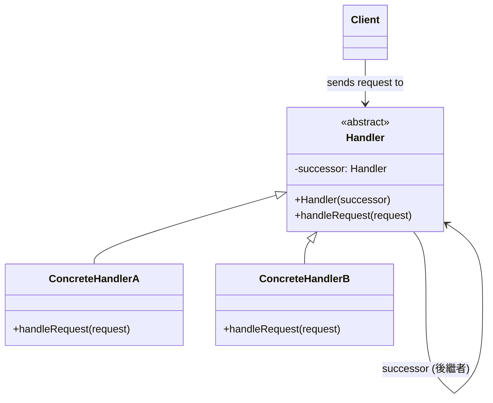
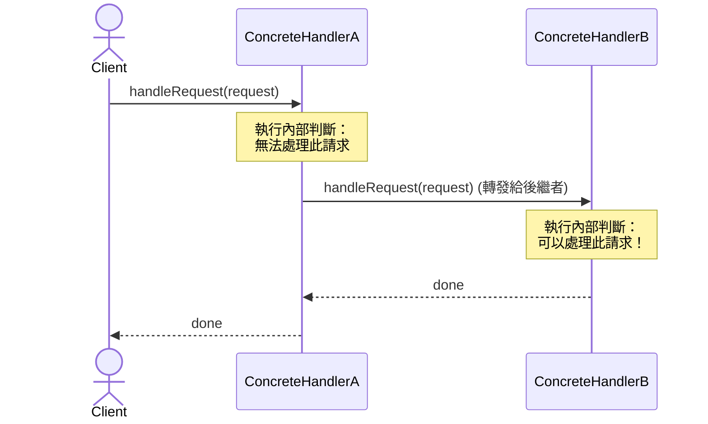
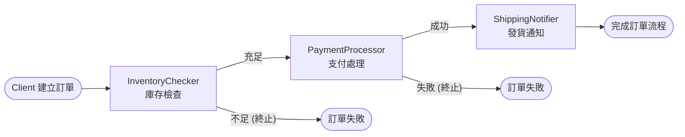

# Ch25 綿綿不絕：Chain of Responsibility

## 25.1 目的與動機

> 為了降低訊息傳送者與接收者之間的耦合力，讓超過一個以上的物件來處理訊息。訊息鏈會把請求訊息一直傳遞下去直到有物件處理它。

> **設計樣式定義**
> *Avoid coupling the sender of a request to its receiver by giving more than one object a chance to handle the request. Chain the receiving objects and pass the request along the chain until an object handles it.*
> （透過給予多個物件處理請求的機會，以避免請求的發送者與接收者之間的緊密耦合。將接收物件連結成一條鏈，並沿著鏈傳遞該請求，直到有物件處理它為止。）

### 25.1.1 核心思維：請求與處理的雙向解耦
在許多應用系統中，客戶端（Client）發送的請求（或事件）可能需要多種不同層級或職責的角色來進行審查或處理。

**責任鏈樣式 (Chain of Responsibility, CoR)** 的核心思想是：
1. **單一入口與鏈式傳遞**：將所有潛在的處理者（Handlers）像「接力棒」一樣串聯成一條鏈。客戶端只需將請求提交給鏈的首端，無須關心後續是哪一個具體處理器執行了該業務。
2. **動態表態與轉發**：鏈上的每一個處理器都包含對「下一個處理器（Successor）」的參考。當請求傳遞到某個處理器時，它會根據自身規則判斷是否能夠處理：
   - 若能處理，則進行處理並決定是否終止傳遞。
   - 若不能處理，則自動將請求傳交給下一個處理器（後繼者）。

### 25.1.2 傳統設計的痛點：龐雜的條件分支與強耦合
我們以一個企業的「費用報支審核系統（Expense Approval System）」為例。不同金額的報支單需要不同級別的主管審核：
* 組長（Manager）：可審核 $\le \$1,000$ 的報支。
* 處長（Director）：可審核 $\le \$5,000$ 的報支。
* 副總（Vice President）：可審核 $\le \$20,000$ 的報支。
* 總經理（CEO）：可審核 $>\$20,000$ 的報支。

如果不使用責任鏈模式，傳統的結構化設計通常會在一處寫滿大量的條件判斷式：

```java
// 傳統無責任鏈設計：發送者與所有接收者強耦合
class ExpenseReport {
    private double amount;
    private String purpose;

    public ExpenseReport(double amount, String purpose) {
        this.amount = amount;
        this.purpose = purpose;
    }

    public double getAmount() { return amount; }
    public String getPurpose() { return purpose; }
}

class ApprovalSystem {
    private Manager manager = new Manager();
    private Director director = new Director();
    private VicePresident vp = new VicePresident();
    private CEO ceo = new CEO();

    public void processReport(ExpenseReport report) {
        double amount = report.getAmount();
        
        // 龐大且難以維護的條件判斷分支
        if (amount <= 1000) {
            manager.approve(report);
        } else if (amount <= 5000) {
            director.approve(report);
        } else if (amount <= 20000) {
            vp.approve(report);
        } else {
            ceo.approve(report);
        }
    }
}
```

#### 這樣設計的缺點：
1. **違反開閉原則 (OCP)**：如果未來公司組織調整，要新增一個審核角色（例如「協理」），或者要調整審核額度限制，我們必須直接修改 `ApprovalSystem` 類別內的 `processReport` 核心判斷邏輯。這極易引入新的錯誤。
2. **高度緊密耦合**：發送者（`ApprovalSystem`）必須明確知道、建立並參考所有的具體接收者類別（`Manager`、`Director` 等）。每個角色的變動都會直接影響到控制中心。
3. **低重用性與職責不清**：審核邏輯與角色派送邏輯混雜在一起，各個主管類別無法被獨立重用，且違反了**單一職責原則 (SRP)**。

---

電腦機房常常會遇到很多異常現象：網路斷線了、Server 掛了、應用系統起不來、資料庫出現問題、被攻擊了等等事件。平時還好，同仁們都在，假日誰應該誰來處理呢？我們於是定下一個規則：通通給值班人員。於是所有的訊息都會到值班人員身上，但他並不是真正處理的人員，很多問題無法處理。當他無法處理時就往上回報給上面的上司，例如說是技術人員，技術人員無法處理時就往上報，可能是組長、然後是技術長、總經理等。

這樣的好處是：每一個人專注於訊息處理的形態與方法，而不用去理會訊息的流程。Java 1.0 對於事件的處理方式就是這樣的模式：

```java
public boolean action(Event event, Object obj) {
  if (event.target == testBtn)
     doTestBtnAction();
  else if (event.target == exitBtn)
     doExitBtnAction();
  else
     return super.action(event, obj);
  return true;  
}
```
其中 super 就成為一個事件處理者的後繼者。

[gugu- `Chain of Responsibility`](https://refactoring.guru/design-patterns/chain-of-responsibility)

## 25.2 結構與方法


*FIG: CoR 設計樣式結構圖*

### 25.2.1 類別關係圖 (Mermaid)

為了確保在沒有外部圖片加載時文件依然完備，以下是責任鏈設計樣式的通用類別圖與運作序列圖：



### 25.2.2 運作序列圖 (Sequence Diagram)

當 `Client` 發送一個請求，而 `ConcreteHandlerA` 無法處理時，請求是如何沿著鏈遞移給 `ConcreteHandlerB` 的：



### 25.2.3 參與者角色與職責

| 角色 | 英文名稱 | 職責與說明 |
| :--- | :--- | :--- |
| **客戶端** | `Client` | 建立請求，並將請求發送給鏈上的第一個具體處理器（`ConcreteHandler`），啟動處理流程。 |
| **抽象處理器** | `Handler` | 定義處理請求的抽象介面。通常在此類別中維護一個指向後繼者（`successor`）的參考，並提供設定與取得後繼者的方法。 |
| **具體處理器** | `ConcreteHandler` | 實作處理器介面。決定自己是否能夠處理該請求：<br/>1. 若可以處理，則進行處理。<br/>2. 若不能處理，則將請求轉發給它的後繼者（`successor`）。 |

基本結構，針對一個問題來處理。


```java
package cor;

import java.util.Random;

public class CoRDemo {

	public static void main(String[] args) {
		Handler h2 = new Handler2(null);
		Handler h1 = new Handler1(h2);

		// 第一個處理者都是 Handler1
		h1.handleRequest(100);
		h1.handleRequest(0);
		h1.handleRequest(10);
	}
}

abstract class Handler {
	Handler successor;

	public Handler(Handler h) {
		successor = h;
	}

	public void handleRequest(int i) {
		if (successor != null)
			successor.handleRequest(i);
		else
			System.out.println("No one can handle it");
	}
}

class Handler1 extends Handler {
	Random rn = new Random();
	public Handler1(Handler h) {
		super(h);
	}

	public void handleRequest(int x) {
		int i = rn.nextInt(2);

		// Handler 依據請求的參數值及自身的狀態來決定是否能夠處理
		if (x > 10 || (i==1))
			System.out.println("Handler 1 will handle");
		else
			// 不能處理時就丟給下一個
			super.handleRequest(x);
	}
}

class Handler2 extends Handler {
	public Handler2(Handler h) {
		super(h);
	}

	public void handleRequest(int x) {
		if (x < 10)
			System.out.println("Handler 2 will handle");
		else
			super.handleRequest(x);
	}
}

### 25.2.4 設計效益分析

#### 🟢 優點
* **降低耦合度**：請求的發送者無須知道是哪一個具體的接收者處理了請求，發送者與多個接收者之間實現了完全解耦。客戶端只需與鏈的首端交互即可。
* **符合開閉原則 (OCP)**：可以在不修改客戶端或既有處理器的情況下，在執行期動態地新增、刪除或重新編排鏈中的處理順序與職責，具備極高的擴充彈性。
* **簡化物件職責（符合 SRP）**：每個具體處理器只需關注自己本身所負責的處理邏輯與邊界，無法處理的直接委託 `super.handleRequest(x)` 轉交給後繼者，維持高度內聚。

#### 🔴 缺點
* **請求不保證被接收**：因為請求是沿著鏈遞移的，如果鏈的末端沒有妥善設定預設處理器（例如 fallback），請求可能會在走完鏈後被直接遺棄（Drop Out），無人處理。
* **效能開銷與資源浪費**：如果鏈非常長，請求在鏈上層層傳遞會帶來一定的方法呼叫開銷。特別是當請求在鏈的最末端才被處理時，前面的節點判斷就形成了無謂的資源開銷。
* **除錯難度較高**：由於控制流分散在各個處理器物件之間，在長鏈中追蹤與除錯請求的流轉路徑相對繁瑣。
```
	
但如果我們要處理的問題型態有很多種呢？該怎麼辦？

#### 方案一：單一介面

一個介面彙總所有的事件處理。

```java
public interface Handler { 
	public void handleHelp(); 
	public void handlePrint(); 
	public void handleFormat(); 
} 

public class ConcreteHandler implements Handler {
  private Handler successor;
  public ConcreteHandler(Handler successor) {
    this.successor = successor;
  }
  public void handleHelp() {
    // 本物件可以處理的。
  }
  public void handlePrint() {
    // 給後繼者處理
    successor.handlePrint();
  }
  public void handleFormat() {
    // 給後繼者處理  
    successor.handleFormat();
  }
}
```

問題：如果有新的問題型態，程式碼不好修改。好處是：強迫每個可能的處理者對問題「表態」。

#### 方案二：多個介面

針對不同的訊息有不同的介面。 

```java
public interface HelpHandler {
  public void handleHelp();
}
public interface PrintHandler {
  public void handlePrint();
}
public interface FormatHandler {
  public void handleFormat();
}
```

每一個處理針對他可能處理的事件進行實作，無法處理的交給他的後繼者。

```java
public class ConcreteHandler  implements HelpHandler, PrintHandler, FormatHandler {
  // 必須記錄每一個後繼者
  private HelpHandler helpSuccessor;
  private PrintHandler printSuccessor;
  private FormatHandler formatSuccessor;

  public ConcreteHandler (HelpHandler helpSuccessor, PrintHandler printSuccessor, FormatHandler formatSuccessor) {
    this.helpSuccessor = helpSuccessor;
    this.printSuccessor = printSuccessor;
    this.formatSuccessor = formatSuccessor;
  }
  public void handleHelp() {
    // 本物件可以處理的。
  }
  public void handlePrint() {
   	 printSuccessor.handlePrint();
  }
  public void handleFormat() {
     formatSuccessor.handleFormat();
  }
} 
```

#### 方案三：參數

只有一個介面，但帶一個參數，透過參數的判斷來決定處理的方式。 

```java
public interface Handler {
  public void handleRequest(String request);
}

public class ConcreteHandler implements Handler {
  private Handler successor;
  public ConcreteHandler(Handler successor) {
    this.successor = successor;
  }
  public void handleRequest(String request) {
    if (request.equals("Help")) {
        // 本物件可以處理的。
    }
    else
      // 丟給後繼者
      successor.handle(request);
  }
}
```

#### 方案四：封裝

把請求封裝成一個物件來處理。（參考 Command 設計樣式）。

```java
public class Request {
  private String type;
  public Request(String type) {
     this.type = type;
  }
  public String getType() {return type;}
  public void execute() {
     // 預設的執行方法
  } 
}

public class ConcreteHandler  implements Handler {
   private Handler successor;
   public ConcreteHandler(Handler successor) {
      this.successor = successor;
   }
   public void handleRequest(Request request) {
      if (request instanceof HelpRequest) {
         // 本物件可以處理         
    }
    else if (request instanceof PrintRequest) 
       request.execute(); //  預設的處理方法
    } else
        successor.handle(request); // pass 給後繼者
    }
}
```

## 範例

### 1. Servlet 過濾器 (Servlet Filters) 

在一個網路應用程式中，**Servlet 過濾器**（Servlet Filters）形成一條鏈。每個過濾器都可以在 HTTP 請求到達 Servlet 之前或 Servlet 處理完請求之後，執行預處理或後處理。

**運作方式：**

* 您在 `web.xml` 或使用註解配置多個過濾器。
* 當請求進來時，網頁容器會將其傳遞給鏈中的第一個過濾器。
* 過濾器執行其邏輯，然後呼叫 `chain.doFilter(request, response)` 將請求傳遞給鏈中的下一個過濾器（如果它是最後一個過濾器，則傳遞給 Servlet）。
* 每個過濾器都充當一個處理器，決定是繼續鏈的執行還是終止它（例如，通過發送錯誤響應）。

**概念範例：**

```java
// 一個假設的過濾器介面 (類似於 javax.servlet.Filter)
interface RequestHandler {
    void handle(Request request, Response response, RequestHandlerChain chain) throws IOException, ServletException;
}

// 一個具體的過濾器
class AuthenticationFilter implements RequestHandler {
    @Override
    public void handle(Request request, Response response, RequestHandlerChain chain) throws IOException, ServletException {
        System.out.println("AuthenticationFilter: 正在驗證請求...");
        if (request.isAuthenticated()) {
            chain.handle(request, response, chain); // 傳遞給鏈中的下一個
        } else {
            response.sendError(HttpServletResponse.SC_UNAUTHORIZED, "未經授權");
        }
    }
}

// 另一個具體的過濾器
class LoggingFilter implements RequestHandler {
    @Override
    public void handle(Request request, Response response, RequestHandlerChain chain) throws IOException, ServletException {
        System.out.println("LoggingFilter: 正在記錄請求詳情...");
        // 預處理
        chain.handle(request, response, chain); // 傳遞給鏈中的下一個
        // 後處理
        System.out.println("LoggingFilter: 請求已處理。");
    }
}

// 鏈本身 (類似於 FilterChain)
class RequestHandlerChain {
    private List<RequestHandler> handlers;
    private int currentHandlerIndex;

    public RequestHandlerChain(List<RequestHandler> handlers) {
        this.handlers = handlers;
        this.currentHandlerIndex = 0;
    }

    public void handle(Request request, Response response, RequestHandlerChain chain) throws IOException, ServletException {
        if (currentHandlerIndex < handlers.size()) {
            RequestHandler handler = handlers.get(currentHandlerIndex);
            currentHandlerIndex++;
            handler.handle(request, response, this);
        } else {
            // 鏈的末端，或者調用實際的 Servlet/資源
            System.out.println("處理器鏈的末端。正在處理實際請求 (例如，Servlet)。");
            // 在實際情況中，這將調用目標資源
        }
    }
}
```

**核心概念：** Servlet 過濾器是責任鏈模式的一個絕佳範例，它展示了請求如何按順序通過一系列處理器，每個處理器執行特定的功能。

---

### 2. 自定義日誌級別 (概念性應用)

儘管 Java 的 `java.util.logging` 或 Log4j/Logback 在其公共 API 名稱中沒有**明確**使用責任鏈模式，但日誌級別和附加器（appenders）的概念可以從類似的角度來思考。一條日誌消息可能會遍歷一系列附加器，每個附加器根據其配置的級別和過濾器決定是否處理（例如，寫入控制台、文件、資料庫）該消息。

**簡化範例：**

```java
// 處理器介面
abstract class LogHandler {
    protected LogHandler nextHandler;
    protected LogLevel level;

    public void setNextHandler(LogHandler nextHandler) {
        this.nextHandler = nextHandler;
    }

    public void logMessage(LogLevel level, String message) {
        if (this.level.ordinal() <= level.ordinal()) {
            writeMessage(message);
        }
        if (nextHandler != null) {
            nextHandler.logMessage(level, message);
        }
    }

    protected abstract void writeMessage(String message);
}

// 具體處理器
class ConsoleLogHandler extends LogHandler {
    public ConsoleLogHandler(LogLevel level) {
        this.level = level;
    }

    @Override
    protected void writeMessage(String message) {
        System.out.println("控制台日誌: " + message);
    }
}

class FileLogHandler extends LogHandler {
    public FileLogHandler(LogLevel level) {
        this.level = level;
    }

    @Override
    protected void writeMessage(String message) {
        System.out.println("文件日誌: " + message); // 模擬寫入文件
    }
}

enum LogLevel {
    INFO, DEBUG, WARNING, ERROR
}

public class LoggerChainExample {
    public static void main(String[] args) {
        LogHandler consoleLogger = new ConsoleLogHandler(LogLevel.INFO);
        LogHandler fileLogger = new FileLogHandler(LogLevel.WARNING);

        consoleLogger.setNextHandler(fileLogger); // 將它們串聯起來

        consoleLogger.logMessage(LogLevel.INFO, "這是一條資訊訊息。");
        consoleLogger.logMessage(LogLevel.WARNING, "這是一條警告訊息。");
        consoleLogger.logMessage(LogLevel.ERROR, "這是一條錯誤訊息。");
    }
}
```

---

### 3. 自定義請求/事件處理 (通用目的)

您可以為任何類型的請求或事件處理構建自己的責任鏈。這在處理事件或消息的框架中是非常常見的模式。

**核心組件：**

* **處理器介面 (Handler Interface)：** 定義處理請求的契約。它通常包含一個處理請求的方法以及設置鏈中下一個處理器的方式。
* **具體處理器 (Concrete Handlers)：** 實現處理器介面，執行其特定的邏輯，並決定是否將請求傳遞給下一個處理器。
* **客戶端 (Client)：** 通過將請求發送給鏈中的第一個處理器來啟動請求。

**範例：訂單處理鏈**

想像一個電子商務系統，其中訂單需要經過幾個處理步驟：庫存檢查、支付處理、發貨通知。

#### 訂單處理流水線示意圖



```java
// 1. 請求/上下文對象
class Order {
    private int orderId;
    private double amount;
    private boolean inventoryChecked;
    private boolean paymentProcessed;
    private boolean shippingNotified;

    public Order(int orderId, double amount) {
        this.orderId = orderId;
        this.amount = amount;
    }

    // Getters 和 setters
    public int getOrderId() { return orderId; }
    public double getAmount() { return amount; }
    public boolean isInventoryChecked() { return inventoryChecked; }
    public void setInventoryChecked(boolean inventoryChecked) { this.inventoryChecked = inventoryChecked; }
    public boolean isPaymentProcessed() { return paymentProcessed; }
    public void setPaymentProcessed(boolean paymentProcessed) { this.paymentProcessed = paymentProcessed; }
    public boolean isShippingNotified() { return shippingNotified; }
    public void setShippingNotified(boolean shippingNotified) { this.shippingNotified = shippingNotified; }

    @Override
    public String toString() {
        return "訂單{" +
               "訂單ID=" + orderId +
               ", 金額=" + amount +
               ", 庫存已檢查=" + inventoryChecked +
               ", 支付已處理=" + paymentProcessed +
               ", 發貨已通知=" + shippingNotified +
               '}';
    }
}

// 2. 處理器介面
interface OrderProcessor {
    void setNextProcessor(OrderProcessor nextProcessor);
    void process(Order order);
}

// 3. 具體處理器
class InventoryChecker implements OrderProcessor {
    private OrderProcessor nextProcessor;

    @Override
    public void setNextProcessor(OrderProcessor nextProcessor) {
        this.nextProcessor = nextProcessor;
    }

    @Override
    public void process(Order order) {
        System.out.println("庫存檢查器: 正在檢查訂單 " + order.getOrderId() + " 的庫存。");
        // 模擬庫存檢查
        if (order.getAmount() < 1000) { // 簡單檢查
            order.setInventoryChecked(true);
            System.out.println("庫存檢查器: 庫存正常。");
            if (nextProcessor != null) {
                nextProcessor.process(order);
            }
        } else {
            System.out.println("庫存檢查器: 庫存不足，訂單金額過大或缺貨。");
            // 不傳遞給下一個處理器，有效終止鏈
        }
    }
}

class PaymentProcessor implements OrderProcessor {
    private OrderProcessor nextProcessor;

    @Override
    public void setNextProcessor(OrderProcessor nextProcessor) {
        this.nextProcessor = nextProcessor;
    }

    @Override
    public void process(Order order) {
        if (order.isInventoryChecked()) { // 只有在庫存檢查通過後才處理
            System.out.println("支付處理器: 正在處理訂單 " + order.getOrderId() + " 的支付。");
            // 模擬支付處理
            order.setPaymentProcessed(true);
            System.out.println("支付處理器: 支付成功。");
            if (nextProcessor != null) {
                nextProcessor.process(order);
            }
        } else {
            System.out.println("支付處理器: 跳過支付，庫存未檢查。");
        }
    }
}

class ShippingNotifier implements OrderProcessor {
    private OrderProcessor nextProcessor; // 如果是最後一個，這可以是 null

    @Override
    public void setNextProcessor(OrderProcessor nextProcessor) {
        this.nextProcessor = nextProcessor;
    }

    @Override
    public void process(Order order) {
        if (order.isPaymentProcessed()) { // 只有在支付處理後才通知
            System.out.println("發貨通知器: 正在通知訂單 " + order.getOrderId() + " 的發貨。");
            // 模擬發貨通知
            order.setShippingNotified(true);
            System.out.println("發貨通知器: 發貨通知已發送。");
        } else {
            System.out.println("發貨通知器: 跳過發貨通知，支付未處理。");
        }
        // 如果這是最後一個處理器，則沒有 nextProcessor，或者可以處理一個「完成」步驟
    }
}

// 4. 客戶端
public class OrderProcessingChainClient {
    public static void main(String[] args) {
        // 創建處理器
        InventoryChecker inventoryChecker = new InventoryChecker();
        PaymentProcessor paymentProcessor = new PaymentProcessor();
        ShippingNotifier shippingNotifier = new ShippingNotifier();

        // 構建鏈
        inventoryChecker.setNextProcessor(paymentProcessor);
        paymentProcessor.setNextProcessor(shippingNotifier);

        // 處理訂單
        System.out.println("--- 處理訂單 1 ---");
        Order order1 = new Order(101, 500.0);
        inventoryChecker.process(order1);
        System.out.println("最終訂單狀態: " + order1);

        System.out.println("\n--- 處理訂單 2 (金額過大) ---");
        Order order2 = new Order(102, 2000.0);
        inventoryChecker.process(order2);
        System.out.println("最終訂單狀態: " + order2);

        System.out.println("\n--- 處理訂單 3 (跳過支付) ---");
        Order order3 = new Order(103, 100.0);
        // 手動設置庫存未檢查，以演示跳過支付
        order3.setInventoryChecked(false);
        inventoryChecker.process(order3); // 啟動鏈，但支付將因訂單狀態而跳過
        System.out.println("最終訂單狀態: " + order3);
    }
}
```

## 隨堂測驗

1. Chain of responsibility 的目的為何？
    - A) 把物件串連起來，生成時一起生成。
    - B) 把事件的請求者與處理者抽離開來，降低彼此的耦合度。
    - C) 把事件處理的責任順序是先定義好，以便後續的層層處理。
    - D) 設定一個事件的代理者，先由代理者處理，無法處理時在由真正的物件處理。

<details>
<summary>解答</summary>

**B) 把事件的請求者與處理者抽離開來，降低彼此的耦合度。**
說明：請求者不需要知道具體是哪個處理者處理了請求，只需將請求發送到鏈上即可。
</details>

2. 關於 CoR 以下何者錯誤？
    - A) 每一個 Handler 生成時都需要指定一個後繼者。
    - B) 所有的 Hanlder 會實作同一個介面。
    - C) 不同型態的 Handler 不可相互成為後繼者。

<details>
<summary>解答</summary>

**C) 不同型態的 Handler 不可相互成為後繼者。**
說明：只要它們實作相同的 Handler 介面，不同型態（具體類別）的 Handler 就可以互相設定為後繼者。
</details>

3. CoR 和 Composite 看起來都一樣，都是有一個繼承、一個包含，兩者有何差異？

    <details>
    <summary>解答</summary>
    
    Composite 有分為 composite 和 leaf 之差別，後者是不能加元素的，CoR 並沒有這樣的差異。Composite 通常包含多個元素，CoR 包含的只有一個後繼者。Composite 只是把動作轉交給所包含的元素去做，包含者本身不做什麼，CoR 則需要做一些判斷後才會決定自己處理或交給後繼者來做。
    </details>

## 練習

### EX01 結構繪製
在不看講義的情況下，應用 UML 的工具畫出該設計樣式的結構。

### EX02 角色審核鏈
公司內有若干不同的角色，當遇到技術問題時解決的順序是：programmer, designer, architect。遇到管理問題的解決順序是：programmer, analyzer, manager, CEO。請利用 chain of responsibility 的方式來解決此問題。

```java
interface handle {
   public void handleTech();
   public void handleMgmt();
}
```

Sample Answer:
```java
public class DemoCoR {

	public static void main(String[] args) {
		// TODO Auto-generated method stub
		Request r = new Request(1, "! 404 !");
		Handler p = new Programmer(new Designer(null, null), new Analyzer(null, null));
		p.handleTech(r);
		
		p.handleTech(new Request(2, "! DB error "));
		
	}
}

class Request {
	int type;
	String desc;
	public Request (int t, String desc) {
		this.type = t;
		this.desc = desc;
	}
}

interface Handler { 
	public void handleTech(Request r); 
	public void handleMgmt(Request r); 
}

class Programmer implements Handler {
  private Handler techSuccessor;
  private Handler mgmtSuccessor;
  
  public Programmer(Handler techSuccessor, Handler mgmtSuccessor) {
    this.techSuccessor = techSuccessor;
    this.mgmtSuccessor = mgmtSuccessor;    
  }
  
  public void handleTech(Request r) {
	  if (r.type==1) {
		  System.out.println(r.desc+ ", is handled by PG");		  
	  }
	  else techSuccessor.handleTech(r);
  }
  
  public void handleMgmt(Request r) {
	  if (r.type==1) {
		  System.out.println(r.desc+ ", is handled");		  
	  }
	  else mgmtSuccessor.handleTech(r);
  }  
}

class Analyzer implements Handler {
	  private Handler techSuccessor;
	  private Handler mgmtSuccessor;
	  
	  public Analyzer(Handler techSuccessor, Handler mgmtSuccessor) {
		    this.techSuccessor = techSuccessor;
		    this.mgmtSuccessor = mgmtSuccessor;    
	  }
	  
	  public void handleTech(Request r) {
		  if (r.type==2) {
			  System.out.println(r.desc+ ", is handled by AN");		  
		  }
		  else techSuccessor.handleTech(r);
	  }
	  
	  public void handleMgmt(Request r) {
		  if (r.type==2) {
			  System.out.println(r.desc+ ", is handled");		  
		  }
		  else mgmtSuccessor.handleTech(r);
	  }
	  
	}

class Designer implements Handler {
	  private Handler techSuccessor;
	  private Handler mgmtSuccessor;
	  
	  public Designer(Handler techSuccessor, Handler mgmtSuccessor) {
		    this.techSuccessor = techSuccessor;
		    this.mgmtSuccessor = mgmtSuccessor;    
	  }
	  
	  public void handleTech(Request r) {
		  if (r.type==1) {
			  System.out.println(r.desc+ ", is handled by DE");		  
		  }
		  else if (techSuccessor != null) 
			  techSuccessor.handleTech(r);
		  else 
			  System.out.println(r.desc+ " ==> no one can Handle");		  			  
	  }
	  
	  public void handleMgmt(Request r) {
		  if (r.type==1) {
			  System.out.println(r.desc+ ", is handled");		  
		  }
		  else mgmtSuccessor.handleTech(r);
	  }
	  
	}
```


<!-- \begin{figure}[h]
\begin{center}
\includegraphics[width=0.6\columnwidth]{dp/CoRCompanyStr.png}
\end{center}
\end{figure} -->