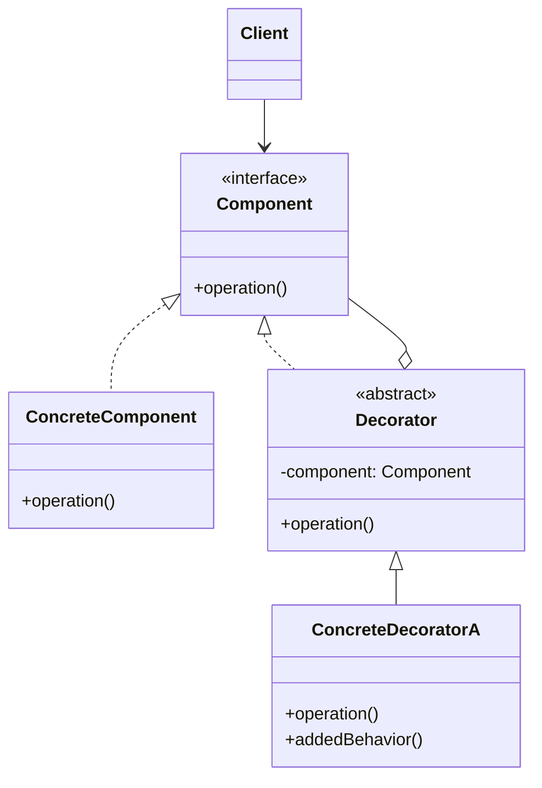
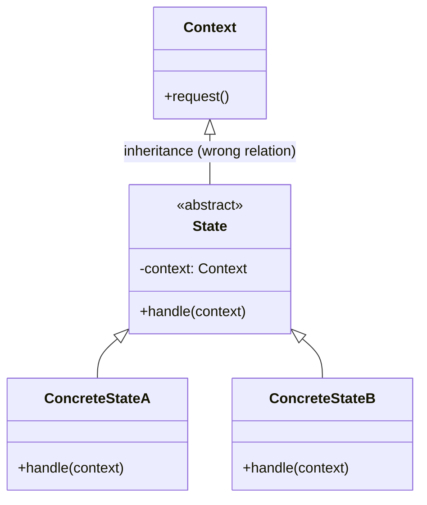
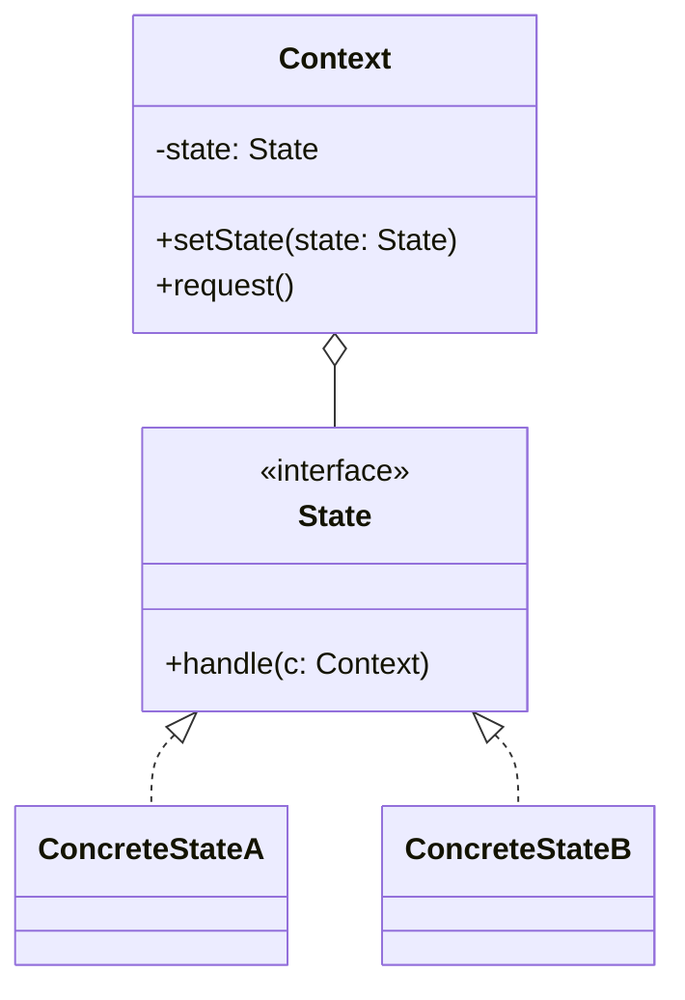
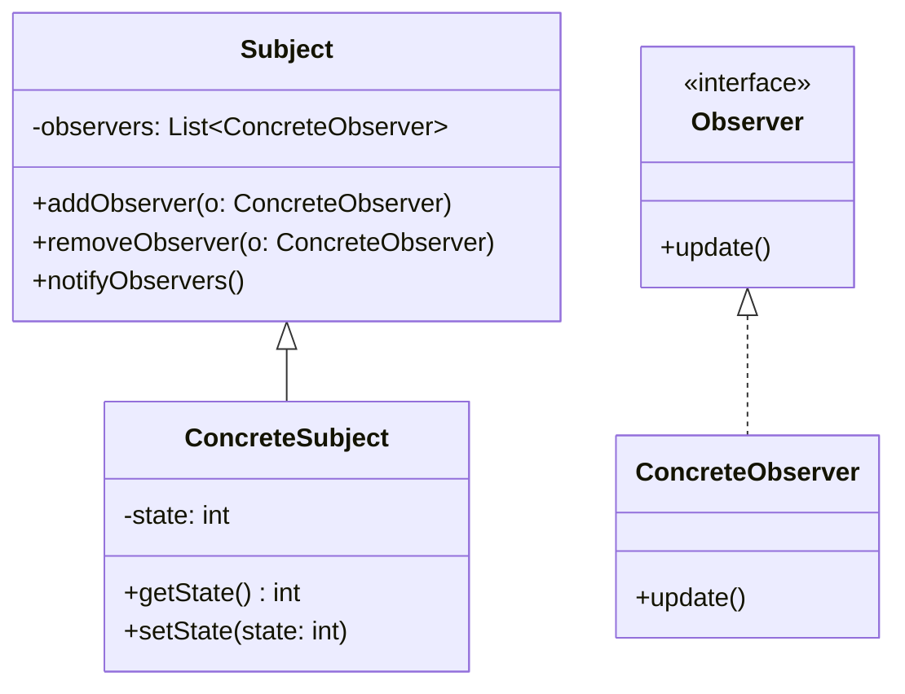
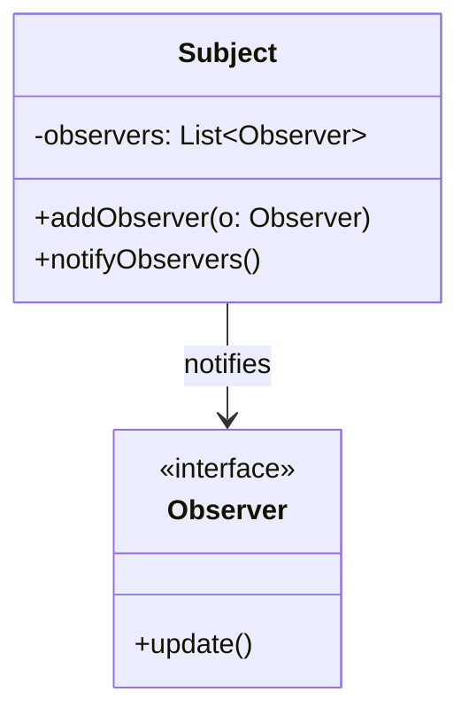
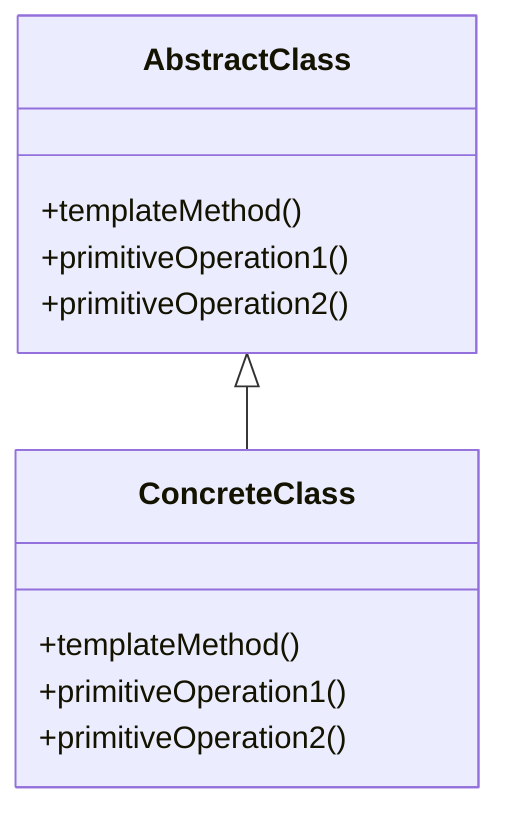
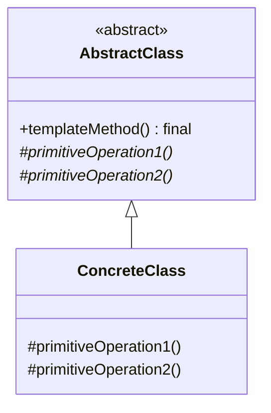
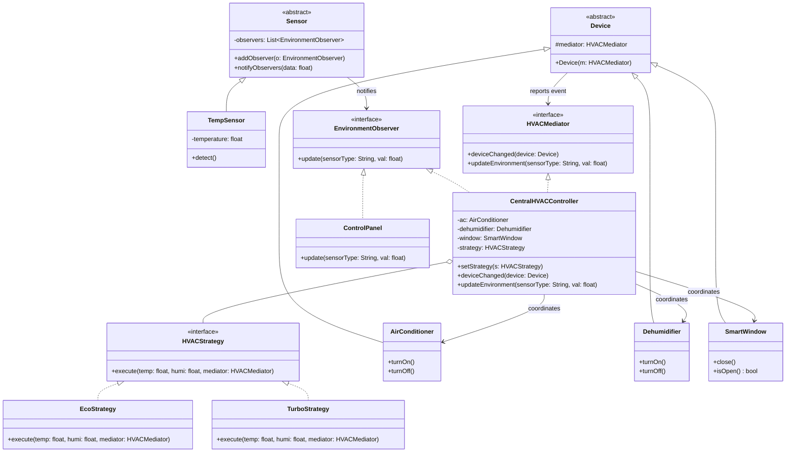
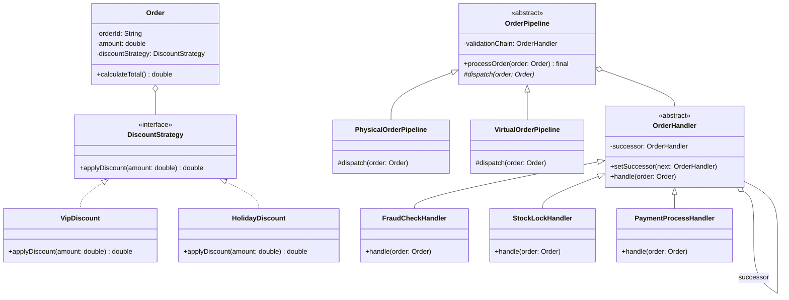

# Part 6 行為設計樣式綜合測驗與挑戰

本測驗旨在評估學生對於 **Part 6 行為設計樣式 (Behavioral Patterns)**（包含 Strategy、Template Method、Observer、MVC、Iterator、State、Mediator、Chain of Responsibility）的理解程度，並加入跨章節（Part 4 創建型、Part 5 結構型）的比較，考驗學生是否能釐清相似樣式之間的本質差異，並具備 UML 結構診斷與系統設計實作的能力。

---

## 一、 單選與複選題

### 18. Strategy (策略樣式)

#### Q1. 關於 Strategy 設計樣式，其核心設計思維是將「可變的演算法」：
- A) 延遲到子類別決定與實作
- B) 委託給獨立的策略物件來處理
- C) 包裝成一個複合樹狀結構
- D) 限制系統中只能產生單一執行個體

<details>
<summary>解答</summary>

**B) 委託給獨立的策略物件來處理**
說明：Strategy 模式的核心在於將各種不同的演算法封裝成獨立的 `ConcreteStrategy` 類別，並讓 `Context` 透過組合（Composition）與委託（Delegation）來使用這些策略，藉此在執行期動態切換演算法。
</details>

#### Q2. 在 Strategy 樣式中，若我們未來需要擴充一個新的演算法，最符合開閉原則 (OCP) 的做法是：
- A) 修改既有的 `Strategy` 介面，新增一個方法
- B) 新增一個實作 `Strategy` 介面的具體類別 (Concrete Strategy)
- C) 在 `Context` 類別中新增一個條件分支 (if-else) 來處理新演算法
- D) 在 `Context` 中宣告一個靜態方法直接呼叫新演算法

<details>
<summary>解答</summary>

**B) 新增一個實作 `Strategy` 介面的具體類別 (Concrete Strategy)**
說明：這正是開閉原則（對擴充開放，對修改封閉）的體現。我們只需新增一個類別實作該介面，完全不需更動既有的 `Context` 或其他策略類別。
</details>

#### Q3. 在 Java Swing 的版面配置中，容器元件 `Container` (如 `JPanel`) 可以透過 `setLayout(LayoutManager mgr)` 設定不同的排版策略。在此設計中，`LayoutManager` 介面扮演了 Strategy 樣式中的何種角色？
- A) Context
- B) Abstract Strategy
- C) Concrete Strategy
- D) Client

<details>
<summary>解答</summary>

**B) Abstract Strategy**
說明：`LayoutManager` 是抽象策略（Abstract Strategy）介面，而具體的排版器如 `BorderLayout`、`FlowLayout`、`GridLayout` 等則是具體策略（Concrete Strategy），`Container` 則是上下文（Context）。
</details>

---

### 19. Template Method (樣板方法樣式)

#### Q4. 下列關於 Template Method 模式目的之描述，何者最為正確？
- A) 將兩個介面不相容的物件進行適配以利協作
- B) 將物件的生成步驟延遲到子類別中決定
- C) 定義一個演算法的骨架，而將部分步驟延遲到子類別中覆寫與實作
- D) 當一個主體狀態改變時，自動通知所有相依的觀察者

<details>
<summary>解答</summary>

**C) 定義一個演算法的骨架，而將部分步驟延遲到子類別中覆寫與實作**
說明：Template Method 使用繼承結構，在超類別中定義好演算法的骨架方法（通常為 `final`），並將變動的細部步驟（Primitive Operations）設計為抽象方法或預設方法，交由子類別去客製化。
</details>

#### Q5. 在 Template Method 中，為了防止子類別惡意或不小心覆寫了演算法的整體骨架與執行順序，該樣板方法通常應宣告為：
- A) `final`
- B) `static`
- C) `abstract`
- D) `synchronized`

<details>
<summary>解答</summary>

**A) `final`**
說明：在 Java 中，將樣板方法宣告為 `final` 可以防止子類別覆寫它，從而確保演算法的執行步驟與結構順序不被破壞。
</details>

#### Q6. 分析以下 Java 程式碼，哪一個方法最可能是 Template Method？
```java
abstract class DataProcessor {
    public final void process() {
        readData();
        parseData();
        writeData();
    }
    protected abstract void readData();
    protected abstract void parseData();
    protected void writeData() {
        System.out.println("Writing data to default console...");
    }
}
```
- A) `readData()`
- B) `parseData()`
- C) `writeData()`
- D) `process()`

<details>
<summary>解答</summary>

**D) `process()`**
說明：`process()` 定義了處理資料的完整固定步驟（讀取 $\rightarrow$ 解析 $\rightarrow$ 寫入），並呼叫了需要被子類別實作的抽象方法，且宣告為 `final`，是典型的 Template Method。
</details>

---

### 20. Observer (觀察者樣式)

#### Q7. 關於 Observer 設計樣式中 Subject (被觀察者) 與 Observer (觀察者) 的關係，下列敘述何者正確？
- A) 一個 Observer 同時只能觀察一個 Subject，不能多對一
- B) 當 Observer 狀態改變時，會主動發出廣播通知 Subject
- C) 定義了一對多的相依關係，當 Subject 狀態改變時，所有相依的 Observers 都會收到通知
- D) Subject 與 Observer 之間存在緊密的強耦合關係，必須知道對方的具體類別

<details>
<summary>解答</summary>

**C) 定義了一對多的相依關係，當 Subject 狀態改變時，所有相依的 Observers 都會收到通知**
說明：Observer 模式旨在建立一對多的解耦關係，由 Subject 維護一個抽象的 `Observer` 列表，當狀態改變時走訪列表呼叫 `update()`。
</details>

#### Q8. 在 Java 傳統的 `java.util.Observable` 設計中，為何在呼叫 `notifyObservers()` 之前，通常必須先呼叫 `setChanged()`？
- A) 為了清除舊的觀察者名單
- B) 為了鎖定執行緒，防止並發寫入
- C) 為了標記狀態已發生實質改變，避免在狀態未變時進行無謂的廣播通知
- D) 為了自動配置觀察者的記憶體空間

<details>
<summary>解答</summary>

**C) 為了標記狀態已發生實質改變，避免在狀態未變時進行無謂的廣播通知**
說明：`notifyObservers()` 內部會先檢查 `changed` 旗標是否為 `true`。若非，則直接 return。這允許開發者在執行一連串複雜狀態更新後，再統一呼叫 `setChanged()` 並發出一次通知，提昇效能並避免多餘的重複渲染。
</details>

#### Q9. Java GUI 的事件處理模型中，按鈕 `JButton` 與事件監聽器 `ActionListener` 分別扮演了 Observer 模式中的什麼角色？
- A) `JButton` 是 Subject；`ActionListener` 是 Observer
- B) `JButton` 是 Observer；`ActionListener` 是 Subject
- C) 兩者皆是 Subject
- D) 兩者皆是 Observer

<details>
<summary>解答</summary>

**A) `JButton` 是 Subject；`ActionListener` 是 Observer**
說明：`JButton` 內部維護註冊的監聽器列表，當按鈕被點擊時（狀態改變），會向所有 `ActionListener` 發送事件（呼叫 `actionPerformed`），因此 `JButton` 是具體被觀察者（Concrete Subject），而 `ActionListener` 扮演觀察者介面（Observer）。
</details>

---

### 21. MVC (模型-視覺-控制器樣式)

#### Q10. 在標準的 MVC 架構中，關於 Model、View 與 Controller 三者之間的相依與溝通關係，下列敘述何者錯誤？
- A) Model 不應該相依於 View 與 Controller
- B) Controller 負責接收使用者的輸入，並將其轉換為對 Model 的修改指令
- C) View 負責資料的呈現，當 Model 狀態變更時，View 會獲得通知並更新畫面
- D) 為了保護資料，Model 必須直接參考並叫用特定的 Controller 進行資料過濾

<details>
<summary>解答</summary>

**D) 為了保護資料，Model 必須直接參考並叫用特定的 Controller 進行資料過濾**
說明：D 是錯誤的。Model 應該保持高內聚與高重用性，不應相依於 Controller 或 View。Model 資料變更後是透過 Observer 模式通知 View，而非透過 Controller。
</details>

#### Q11. 在基於 HTTP 協定的 Web MVC (例如 JSP Model 2) 架構中，無法像桌面端 MVC 那樣實現 Model 主動通知 View 更新，其最主要的原因是：
- A) 瀏覽器不支援 JavaScript
- B) HTTP 協定是基於「請求/回應 (Request/Response)」的無狀態、單向通訊模型
- C) Web 伺服器無法連接資料庫
- D) Servlet 限制了 Observer 模式的註冊

<details>
<summary>解答</summary>

**B) HTTP 協定是基於「請求/回應 (Request/Response)」的無狀態、單向通訊模型**
說明：HTTP 協定中，伺服器無法主動向瀏覽器發送數據。只有在瀏覽器發出請求時，伺服器才能回應。因此，Model 無法在變更時「主動推播」更新給瀏覽器 View，通常需要依靠前端輪詢 (Polling)、SSE 或 WebSocket 來補足。
</details>

#### Q12. 在 JSP Model 2 (Web MVC) 架構中，負責接受客戶端 HTTP 請求、驗證參數，並決定要呼叫哪個商業邏輯組件以及轉發到哪個展示頁面的角色是：
- A) JavaBean (Model)
- B) JSP (View)
- C) Servlet (Controller)
- D) HTML Filter (Proxy)

<details>
<summary>解答</summary>

**C) Servlet (Controller)**
說明：在 Web MVC 中，Servlet 充當 Controller，作為單一入口負責接收 Request、調度 Model 處理商務邏輯，並決定將 Request 轉發 (forward) 給哪一個 JSP 頁面進行渲染輸出。
</details>

---

### 22. Iterator (迭代器樣式)

#### Q13. 在尋訪一個集合物件（如 List 或 Set）時，使用 Iterator 模式的主要好處是：
- A) 能提昇資料讀取的絕對效能
- B) 可以避免暴露集合物件內部的物理結構，達到高內聚與低耦合
- C) 可以自動將集合物件備份到硬碟中
- D) 確保多執行緒在寫入資料時絕對安全

<details>
<summary>解答</summary>

**B) 可以避免暴露集合物件內部的物理結構，達到高內聚與低耦合**
說明：Iterator 模式封裝了走訪集合的細節（不論底層是陣列、串列、樹狀結構還是雜湊表），Client 只需要統一的 `hasNext()` 與 `next()` 介面即可走訪，不需關心其內部實作。
</details>

#### Q14. Polymorphic Iterator (多型迭代器) 允許 Client 使用統一的 Iterator 介面走訪不同的複合物件。這通常是結合了 Iterator 樣式與哪一個設計樣式？
- A) Strategy (策略樣式)
- B) Decorator (裝飾者樣式)
- C) Factory Method (工廠方法樣式)
- D) Observer (觀察者樣式)

<details>
<summary>解答</summary>

**C) Factory Method (工廠方法樣式)**
說明：不同的具體集合類別（ConcreteAggregate）會實作一個工廠方法（例如 `createIterator()`），以動態生成與該集合結構相匹配的具體迭代器（ConcreteIterator）。這正是 Factory Method 的典型應用。
</details>

#### Q15. 關於 Java 集合框架中的 `java.util.Iterator`，下列敘述何者錯誤？
- A) 呼叫 `next()` 取得下一個元素之前，通常應先以 `hasNext()` 檢查是否還有元素
- B) 透過 Iterator 的 `remove()` 方法可以在尋訪過程中安全地移除元素，避免 `ConcurrentModificationException`
- C) 標準的 `Iterator` 介面支援雙向巡訪，即可往後讀取亦可往前讀取
- D) 自訂類別實作 `Iterable` 介面後，即可使用 Java 的 for-each 語法糖進行巡訪

<details>
<summary>解答</summary>

**C) 標準的 `Iterator` 介面支援雙向巡訪，即可往後讀取亦可往前讀取**
說明：C 是錯誤的。Java 標準的 `Iterator` 介面只支援單向（向前）巡訪。若需要雙向巡訪，必須使用針對 List 的 `ListIterator` 介面。
</details>

---

### 23. State (狀態樣式)

#### Q16. 在 State 設計樣式中，主要負責維護「當前狀態物件」參考的類別角色是：
- A) ConcreteState
- B) Context
- C) Strategy
- D) Client

<details>
<summary>解答</summary>

**B) Context**
說明：`Context`（環境情境類別）內部持有代表當前狀態的 `State` 屬性成員，並透過委託將狀態相關的行為轉交給該 `State` 物件執行。
</details>

#### Q17. 在 State 模式中，具體狀態類別的處理方法（例如 `State.handle(Context c)`）經常需要接收 Context 物件作為參數，其最主要的原因是：
- A) 狀態物件需要直接讀寫 Context 的所有私有成員欄位
- B) 狀態物件需要透過呼叫 `c.setState()` 來觸發與執行狀態的移轉
- C) 為了節省記憶體，狀態物件不能自行持有任何屬性
- D) 狀態物件需要向 Client 回報進度

<details>
<summary>解答</summary>

**B) State 需要在執行完畢後呼叫 Context 的 `setState()` 來設定新的狀態**
說明：如果狀態移轉的決策邏輯被封裝在具體狀態類別中，狀態類別就必須取得 `Context` 的參考，才能在特定事件發生後呼叫 `Context.setState(newNextState)` 來變更 Context 的狀態。
</details>

#### Q18. 下列關於 State 樣式的敘述，何者錯誤？
- A) Context 把與狀態相關的具體動作委託給當前的具體狀態物件處理
- B) 當系統的狀態轉換邏輯極為複雜時，State 模式可以消除龐大的 if-else 或 switch 分支
- C) 為了維護物件的封裝性，Context 絕對不能暴露任何 `setState()` 方法給外界或狀態物件呼叫
- D) 若系統有 $n$ 種不同的狀態，通常會實作 $n$ 個對應的具體狀態類別 (ConcreteState)

<details>
<summary>解答</summary>

**C) 為了維護物件的封裝性，Context 絕對不能暴露任何 `setState()` 方法給外界或狀態物件呼叫**
說明：C 是錯誤的。在由 State 物件決定狀態轉換的架構下，`Context` 必須提供 `setState()` 方法（通常設為 package 或 public 權限），以便讓具體狀態物件能夠執行狀態切換。
</details>

---

### 24. Mediator (中介者樣式)

#### Q19. 下列關於 Mediator 設計樣式核心目的之描述，何者最為正確？
- A) 將一個複雜物件的建構過程與其呈現分離
- B) 作為多個同儕物件溝通的集中橋樑，將多對多的網狀依賴降低為一對多的星狀耦合
- C) 允許在不修改既有類別的情況下，動態地為物件增加新職責
- D) 限制一個類別只能產生一個執行個體，並提供全域存取點

<details>
<summary>解答</summary>

**B) 作為多個同儕物件溝通的集中橋樑，將多對多的網狀依賴降低為一對多的星狀耦合**
說明：Mediator 模式的核心思想是限制同儕物件（Colleagues）之間的直接交互，改由一個中介者（Mediator）統一協調，將 $O(N^2)$ 的複雜網狀關係簡化為 $O(N)$ 的星狀關係。
</details>

#### Q20. 在 Mediator 設計樣式中，同儕物件 (Colleague) 與中介者 (Mediator) 之間的導航關係通常是：
- A) 雙向導航：中介者維護同事們的參考；同事們也持有中介者的參考以匯報事件
- B) 單向導航：只有中介者知道同事們，同事們完全不知道中介者的存在
- C) 互不導航：兩者只透過資料庫或靜態常數進行鬆散通訊
- D) 同事之間直接導航，中介者僅做觀察

<details>
<summary>解答</summary>

**A) 雙向導航：中介者維護同事們的參考；同事們也持有中介者的參考以匯報事件**
說明：同事物件在發生狀態變更或 UI 事件時，必須呼叫 `mediator.changed(this)` 通知中介者；而中介者也必須持有各個同事物件的參考，才能回過頭來更新它們的狀態（如啟用/停用）。這是一種典型的雙向關聯。
</details>

#### Q21. 有關 Mediator (中介者) 與 Facade (門面) 設計樣式的比較，下列描述何者錯誤？
- A) Facade 主要是由外而內提供單向簡化介面；Mediator 則是多個內部同儕元件進行雙向通訊
- B) 子系統內的類別一般不知道 Facade 的存在；但 Colleagues 必須明確知道 Mediator 的存在
- C) 當 Mediator 類別因協調邏輯過於龐大臃腫時，最直接且正確的重構方式是將其替換為一個 Facade 樣式
- D) 兩者的共通點在於都引入了一個新的類別來簡化系統結構，但其核心意圖與通訊流向完全不同

<details>
<summary>解答</summary>

**C) 當 Mediator 類別因協調邏輯過於龐大臃腫時，最直接且正確的重構方式是將其替換為一個 Facade 樣式**
說明：C 是錯誤的。Mediator 處理的是複雜的雙向互動，而 Facade 僅是單向簡化轉發，兩者在功能上不等價。當 Mediator 太過龐大（神之物件）時，應進行中介者拆分（Decomposition），或引入 Strategy/Command 模式來分攤職責，而不是改成 Facade。
</details>

---

### 25. Chain of Responsibility (責任鏈樣式)

#### Q22. 關於責任鏈模式 (CoR) 的設計特點與缺點，下列敘述何者錯誤？
- A) 可以動態地在執行期調整鏈中節點的順序與數量，符合開閉原則 (OCP)
- B) 請求發送者不需要知道是哪一個具體節點處理了請求，降低了發送與接收端的耦合
- C) 責任鏈能保證發出的請求一定會被鏈上的某個處理器接收並處理
- D) 若鏈過長且請求多在末端才被處理，層層轉發的方法呼叫會帶來額外的效能開銷

<details>
<summary>解答</summary>

**C) 責任鏈能保證發出的請求一定會被鏈上的某個處理器接收並處理**
說明：C 是錯誤的。責任鏈的缺點之一就是「不保證請求一定會被處理」。如果請求傳遞到鏈的尾端依然沒有節點能處理它，該請求就會被直接遺棄（Drop Out），除非在鏈尾設有 fallback / default 處理器。
</details>

#### Q23. 責任鏈模式中，每個處理器節點 (Handler) 通常會持有下一個處理器節點的參考。這個下一個處理器在模式中通常被稱為：
- A) Decorator (裝飾者)
- B) Successor (後繼者)
- C) Mediator (中介者)
- D) Predecessor (前驅者)

<details>
<summary>解答</summary>

**B) Successor (後繼者)**
說明：每個 Handler 內部會維護一個指向 `successor`（後繼者）的屬性。當自己無法處理解決該請求時，會呼叫 `successor.handleRequest(request)` 將請求轉發下去。
</details>

#### Q24. Servlet 過濾器 (Servlet Filters) 串聯多個過濾器對 HTTP 請求進行預處理，這是責任鏈模式的實務應用。在過濾器中，用來將控制權傳交給鏈中下一個過濾器的核心方法是：
- A) `filter.execute()`
- B) `chain.doFilter(request, response)`
- C) `servlet.service(request, response)`
- D) `response.sendRedirect()`

<details>
<summary>解答</summary>

**B) `chain.doFilter(request, response)`**
說明：過濾器鏈透過 `FilterChain` 物件的 `doFilter()` 方法，將請求與回應傳遞給鏈中的下一個過濾器處理。如果當前過濾器是最後一個，則直接調用目標 Servlet 資源。
</details>

---

## 二、 跨章節設計樣式對照分析 (單選題)

### Q25. 觀察下方 Mermaid 類別圖：

#### 這最符合哪一個設計樣式的典型結構？
- A) Strategy (策略樣式)
- B) Decorator (裝飾者樣式) - 屬於 Part 5 結構型
- C) Proxy (代理樣式) - 屬於 Part 5 結構型
- D) Adapter (適配器樣式) - 屬於 Part 5 結構型

<details>
<summary>解答</summary>

**B) Decorator (裝飾者樣式)**
說明：此圖呈現了 Decorator 模式的經典結構：`Decorator` 與 `ConcreteComponent` 繼承自同一個 `Component` 介面，且 `Decorator` 內部又**聚合（持有參考）**了一個 `Component` 物件，藉此在呼叫 `operation()` 前後動態加上額外的職責（例如 `addedBehavior()`）。
</details>

### Q26. 雖然 State 樣式的類別圖結構與 Strategy 樣式極為相似（皆為 Context 持有抽象介面，多個具體子類別進行多型呼叫），但兩者的「設計意圖」有著本質上的不同。下列描述何者正確？
- A) Strategy 模式的策略物件通常在執行期由狀態物件自動切換
- B) State 模式側重於物件內部狀態的動態轉移，對 Client 而言通常是透明的；而 Strategy 模式通常由 Client 主動選擇並設定具體的演算法策略
- C) Strategy 模式不支援組合關係，只支援繼承關係
- D) State 模式只允許有一個具體狀態類別，不允許多個子類別

<details>
<summary>解答</summary>

**B) State 模式側重於物件內部狀態的動態轉移，對 Client 而言通常是透明的；而 Strategy 模式通常由 Client 主動選擇並設定具體的演算法策略**
說明：State 模式的意圖是「讓物件的行为隨內部狀態改變而改變，看起來就像變更了類別」；而 Strategy 模式則是為了「封裝可互相替換的演算法系列」，讓演算法獨立於 Client。
</details>

### Q27. 關於 Template Method 模式（Part 6）與 Factory Method 模式（Part 4 創建型）的比較，下列敘述何者正確？
- A) Template Method 用於演算法的架構擴充，Factory Method 則是用於將「物件的生成步驟」延遲到子類別決定
- B) 兩者雖然名字相似，但 Template Method 採用委託，Factory Method 採用繼承
- C) Template Method 只能產生抽象類別，而 Factory Method 只能產生介面
- D) Factory Method 是行為設計樣式，而 Template Method 是結構設計樣式

<details>
<summary>解答</summary>

**A) Template Method 用於演算法的架構擴充，Factory Method 則是用於將「物件的生成步驟」延遲到子類別決定**
說明：兩者都是利用「將方法延遲到子類別覆寫」的機制，但 Template Method 延遲的是演算法中的「某個處理步驟」，而 Factory Method 延遲的是「物件的實例化建構方法」。
</details>

### Q28. 關於 Mediator 模式與 Observer 模式在解決「物件間解耦」時的對比，下列敘述何者正確？
- A) Observer 模式會引入一個中心點控制所有觀察者；Mediator 模式則是完全去中心化的
- B) Observer 模式通常用於一對多的單向狀態通知；Mediator 模式則用於協調多對多物件間雙向複雜的業務聯動與狀態控制
- C) 兩者互相排斥，在同一個系統架構中絕不可能並存使用
- D) Mediator 模式的 Colleagues 互不知道對方，但也完全不知道 Mediator 的存在

<details>
<summary>解答</summary>

**B) Observer 模式通常用於一對多的單向狀態通知；Mediator 模式則用於協調多對多物件間雙向複雜的業務聯動與狀態控制**
說明：Observer 模式的 Subject 僅負責在狀態改變時發出通知，並不控制觀察者後續的協作流程。而 Mediator 集中了整個子系統的協作邏輯，負責調配多個同事之間的狀態切換與互動流轉。
</details>

### Q29. 責任鏈模式 (CoR) 與 Part 5 結構型的 Composite (合成功效樣式) 皆具有「遞迴式的呼叫與轉發」關係，兩者之間的主要差異在於：
- A) Composite 模式只有一個物件節點，CoR 模式則擁有多個樹狀分枝
- B) CoR 模式通常是沿著「單一繼承者鏈」將請求向後傳遞，直到被某一個節點處理或中斷；Composite 模式則是將命令傳遞給「整棵樹狀結構」中的所有子節點，進行深度的遞迴處理
- C) CoR 模式用於創建物件，Composite 模式用於行為控制
- D) 兩者結構完全不同，CoR 使用多型的介面，Composite 使用 static 的方法

<details>
<summary>解答</summary>

**B) CoR 模式通常是沿著「單一繼承者鏈」將請求向後傳遞，直到被某一個節點處理或中斷；Composite 模式則是將命令傳遞給「整棵樹狀結構」中的所有子節點，進行深度的遞迴處理**
說明：CoR 模式是在鏈上做「過濾與選擇性處理」，只要有 Handler 處理了，通常就終止傳遞。Composite 則是樹狀結構，其運算通常會遍歷所有的子節點（Leaf 和 Composite）來收集或執行動作。
</details>

### Q30. 關於 Proxy（代理樣式 - Part 5）、Decorator（裝飾者樣式 - Part 5）與 Strategy（策略樣式 - Part 6）的對照，下列敘述何者正確？
- A) 三者皆是行為型設計樣式，主要專注於演算法的替換
- B) Proxy 主要是為了控制對目標物件的存取（如權限、延遲載入）；Decorator 是為了動態增添物件的功能職責；Strategy 則是為了替換物件內部的核心演算法實作
- C) Client 必須自行建立並注入 Proxy 的目標物件，但不需要注入 Decorator 的目標物件
- D) 三者皆是利用類別繼承來在編譯期決定其功能變化，無法在執行期動態抽換

<details>
<summary>解答</summary>

**B) Proxy 主要是為了控制對目標物件的存取（如權限、延遲載入）；Decorator 是為了動態增添物件的功能職責；Strategy 則是為了替換物件內部的核心演算法實作**
說明：這是結構型與行為型中極易混淆的三個樣式。Proxy 著重於「存取控制與代理」，它的介面與真實主體一致；Decorator 著重於「動態功能的疊加與擴充」；Strategy 則是用「組合」來替換物件的核心演算法（換骨）。
</details>

---

## 三、 問答題：找出設計圖中的錯誤 (UML 診斷)

### Q31. 診斷下方「State 狀態樣式」設計圖的錯誤：


<details>
<summary>解答與診斷說明</summary>

#### 本設計圖存在以下兩大核心結構錯誤：

1. **關係顛倒（繼承錯誤）**：
   * **圖中錯誤**：`Context <|-- State` 標記為繼承關係，代表抽象狀態 `State` 繼承了 `Context`。這在概念與設計上是完全錯誤的。
   * **正確設計**：`Context` 與 `State` 之間應該是**關聯（Association）或聚合（Aggregation）關係**，即 `Context o-- State`。`Context` 內部必須持有一個代表當前狀態的 `State` 參考，而不是讓 `State` 繼承 `Context`。
2. **Context 封裝不完整（屬性與方法缺失）**：
   * **圖中錯誤**：`Context` 類別內僅有 `request()` 方法，缺少了維護狀態的核心屬性（例如 `-state: State`）以及供狀態物件動態變更狀態的 `+setState(state: State)` 方法。這將導致 `ConcreteState` 在執行 `handle()` 後無法將新狀態設定回 `Context` 中。

#### 正確的 UML 結構關係應為：

</details>

---

### Q32. 診斷下方「Observer 觀察者樣式」設計圖的錯誤：


<details>
<summary>解答與診斷說明</summary>

#### 本設計圖存在以下核心結構錯誤：

1. **違反相依反轉原則 (DIP) 與強耦合（最嚴重的錯誤）**：
   * **圖中錯誤**：`Subject` 直接依賴了具體類別 `ConcreteObserver`（圖中宣告為 `-observers: List<ConcreteObserver>` 與 `+addObserver(o: ConcreteObserver)`）。
   * **錯誤後果**：這完全破壞了 Observer 模式的目的。一旦 `Subject` 直接與具體的 `ConcreteObserver` 耦合，我們就無法在不修改 `Subject` 的情況下加入其他型態的觀察者。
   * **正確設計**：`Subject` 必須僅依賴抽象介面 `Observer`，即 `-observers: List<Observer>` 與 `+addObserver(o: Observer)`。
2. **缺少 Subject 與 Observer 之間的關聯箭頭**：
   * **圖中錯誤**：圖中缺少了從 `Subject` 指向 `Observer` 介面的關聯線。
   * **正確設計**：應畫出一條 `Subject --> Observer` 的關聯線，代表被觀察者持有並觀察抽象的觀察者群。

#### 正確的 UML 結構關係應為：

</details>

---

### Q33. 診斷下方「Template Method 樣板方法樣式」設計圖的錯誤：


<details>
<summary>解答與診斷說明</summary>

#### 本設計圖存在以下三大結構與權限錯誤：

1. **樣板方法不應被子類別覆寫**：
   * **圖中錯誤**：`ConcreteClass` 內部宣告並覆寫了 `+templateMethod()`。
   * **錯誤後果**：`templateMethod()` 內定義了演算法的整體骨架與執行順序，如果允許子類別覆寫它，子類別就可能會改變整個執行流程，破壞了「框架控制流程」的控制反轉 (IoC) 特性。
   * **正確設計**：在子類別中應該移除 `templateMethod()`。在 Java 中，此方法應宣告為 `final`。
2. **基本步驟（Primitive Operations）曝露給外部**：
   * **圖中錯誤**：`primitiveOperation1()` 和 `primitiveOperation2()` 在 `AbstractClass` 中被標記為 `+` (public)。
   * **錯誤後果**：這意味著外部的 Client 可以繞過 `templateMethod()` 流程，直接呼叫這些底層的子步驟。這破壞了演算法的封裝性。
   * **正確設計**：基本方法通常應宣告為 `#` (protected) 或私有，限制只能由 `templateMethod()` 內部進行調用。
3. **缺少抽象標記**：
   * **圖中錯誤**：`AbstractClass` 類別沒有斜體或 `<<abstract>>` 標記，且基本方法也應是抽象的（若需要子類別強制實作）。

#### 正確的 UML 結構關係應為：

</details>

---

## 四、 問答題：設計樣式對照分析 (申論比較)

### Q34. 請比較「Strategy (策略樣式)」與「State (狀態樣式)」的相同點與相異點。

<details>
<summary>解答</summary>

#### 1. 相同點：
* **結構高度相似**：兩者都利用組合（Composition）與委託（Delegation）機制。皆有一個 Context 類別持有抽象介面（`Strategy` 或 `State`）的參考，並在執行期透過多型呼叫具體子類別（`ConcreteStrategy` 或 `ConcreteState`）的方法。
* **符合設計原則**：兩者都封裝了變化的行為，符合「封裝變化」與開閉原則 (OCP)，能消除 Context 類別中繁複的條件判斷分支（if-else 或 switch）。

#### 2. 相異點：
| 比較維度 | Strategy 策略樣式 | State 狀態樣式 |
| :--- | :--- | :--- |
| **設計意圖** | 旨在封裝一系列**可互換的演算法**，讓演算法能獨立於使用它的 Client。 | 旨在讓物件的行為**隨著其內部狀態的改變而改變**，使物件看起來像是變更了類別。 |
| **狀態轉移** | 策略之間通常是**獨立且平行的**，不存在狀態轉移關係。策略多由 Client 主動選擇並注入給 Context，在執行期較少頻繁動態切換。 | 狀態之間存在**明確的轉移關係（狀態機）**。狀態切換通常是動態且自動發生的，由 Context 或具體狀態類別內部邏輯控制，對 Client 而言通常是透明的。 |
| **與 Context 的關係** | 策略物件通常不需要知道 Context 的存在，它只專注於計算。 | 狀態物件通常需要持有 Context 的參考，以便在事件發生時呼叫 `Context.setState()` 進行狀態切換。 |

</details>

---

### Q35. 請比較「Template Method (樣板方法樣式)」與「Strategy (策略樣式)」在變更演算法行為上的本質差異。

<details>
<summary>解答</summary>

#### 1. 本質差異：
* **Template Method** 採用的是**繼承結構 (Class-scoped)**，在編譯期（Compile-time）決定演算法的可變部分。
* **Strategy** 採用的是**組合/委託結構 (Object-scoped)**，在執行期（Runtime）決定並可動態抽換演算法。

#### 2. 詳細對比：
| 比較維度 | Template Method 樣板方法 | Strategy 策略樣式 |
| :--- | :--- | :--- |
| **實踐機制** | **繼承 (Inheritance)**：子類別繼承超類別，並覆寫其中的基本抽象方法 (Primitive Methods)。 | **組合 (Composition)**：Context 類別聚合一個策略介面，並將工作委託給具體的策略物件。 |
| **控制權** | 演算法的骨架控制權在超類別（框架）中，子類別只負責填補細節。符合**控制反轉 (IoC)** / 好萊塢原則。 | 演算法的控制權在具體策略中，Context 僅負責呼叫策略的介面方法，不限制演算法的骨架。 |
| **粒度差異** | 改變演算法中的**部分步驟**，演算法的整體骨架是固定不變的（柔中帶剛）。 | 改變**整個演算法的實作**，Client 傳入什麼策略，就執行完全不同的演算法（換骨）。 |
| **彈性** | 較低。因為是繼承關係，子類別在編譯期就與超類別綁定，無法在執行期動態改變演算法骨架。 | 較高。Context 可以隨時透過 setter 方法在執行期動態更換策略物件。 |

</details>

---

## 五、 系統設計實作題 (Scenario-Based Design)

### Q36. 智慧空調與環境連動控制系統 (Smart HVAC System)

#### 【情境與需求描述】
我們需要為一棟智慧大樓設計一個空調自動控制系統。系統的核心組件與控制邏輯如下：
1. **溫度感測器 (TempSensor)** 與 **濕度感測器 (HumiditySensor)**：每隔一段時間會偵測環境數據。
2. **連動需求一 (數據推播)**：當溫度或濕度變更時，控制面板（`ControlPanel`）必須即時更新畫面，且冷氣機（`AC`）與除濕機（`Dehumidifier`）也需要獲得新數據。我們希望**感測器本身不與任何特定設備或面板強耦合**，以便未來隨時加入新的感測器或顯示終端。
3. **連動需求二 (模式切換)**：系統有不同的運作模式：**節能模式 (Eco)**、**強力模式 (Turbo)**、**舒適模式 (Comfort)**。在不同模式下，系統對於溫濕度變化的反應決策邏輯完全不同。
4. **連動需求三 (設備協調)**：為了避免各個設備之間發生錯綜複雜的網狀呼叫（例如：冷氣開啟時必須確認風扇是否需要關閉；除濕機開啟時必須確認窗戶是否已關閉以防浪費電力），需要有一個**中央協調器**來集中處理設備間的連動控制。

#### 【設計要求】
1. 分析此系統應結合哪些設計樣式來解決上述需求？
2. 畫出系統的類別圖 (Class Diagram，使用 Mermaid)。
3. 說明各個設計樣式在系統中解決了什麼問題。

<details>
<summary>設計解答與架構圖</summary>

#### 1. 採用的設計樣式與分析：
* **Observer (觀察者樣式)**：解決 **需求一**。將 `TempSensor` 和 `HumiditySensor` 設計為被觀察者（Subject），`ControlPanel`、`AirConditioner` 等設備或控制器設計為觀察者（Observer）。當環境數據變化時，感測器會呼叫 `notifyObservers()` 自動推播更新。
* **Strategy (策略樣式)**：解決 **需求二**。將不同的運作模式設計為 `HVACStrategy` 的具體實作類別（`EcoStrategy`、`TurboStrategy`、`ComfortStrategy`）。中央控制器持有一個 `HVACStrategy` 的參考，在收到溫濕度更新時，委託給當前的策略進行設備開關決策。
* **Mediator (中介者樣式)**：解決 **需求三**。將中央控制器設計為 `HVACMediator`。所有的設備（AC, Dehumidifier, SmartWindow）作為同事物件（Colleague），它們只向 `HVACMediator` 報告狀態改變，設備之間互不通訊，由 `HVACMediator` 統一進行協調（例如：AC 開啟時，Mediator 自動通知 SmartWindow 關閉）。

#### 2. Mermaid 系統類別圖設計：


#### 3. 各設計樣式的具體職責：
1. **Observer 模式**：`TempSensor` 發出溫度更新時，不需要關心誰需要這個數據。它只管通知 `EnvironmentObserver` 列表。`CentralHVACController`（中介者兼觀察者）與 `ControlPanel`（看板觀察者）會自動收到新數值，實現了感測器與控制器的徹底解耦。
2. **Strategy 模式**：`CentralHVACController` 內部的 `HVACStrategy` 可以動態更換。當控制器收到最新的溫度 `28.0` 時，如果當前是 `EcoStrategy`，策略可能決定不開啟冷氣以省電；如果被切換至 `TurboStrategy`，則會立刻開啟冷氣。這讓控制邏輯極易擴充與替換。
3. **Mediator 模式**：當 `AirConditioner` 被開啟時，它會通知 `CentralHVACController`（Mediator），控制器發現 `SmartWindow` 目前是開啟狀態，便會主動呼叫 `window.close()` 關閉窗戶，防止冷氣外洩。設備之間沒有直接參考，全部透過中介者進行星狀通訊，維護了設備的獨立重用性。

</details>

---

### Q37. 電商平台訂單處理流水線系統 (Order Processing Pipeline)

#### 【情境與需求描述】
在一個大型電商平台中，當顧客提交訂單後，訂單必須經過多個嚴格的處理與驗證關卡：
1. **折扣計算 (Discount Calculation)**：計算該訂單適用的折價規則（如：VIP 折扣、節慶活動折扣、無折扣）。折扣規則非常多樣，且行銷活動經常更換。
2. **查核與處理關卡**：包括 **安全查核 (FraudCheck)**（檢查是否為詐騙交易）、**庫存鎖定 (StockLock)**（確認商品是否有庫存並進行鎖定）、**金流扣款 (PaymentProcess)**（向第三方支付請款）。
3. **流水線順序與中斷需求**：這些關卡必須按固定順序執行。如果某個關卡失敗（例如詐騙檢查未通過，或庫存不足），整個處理流程必須立即中斷，並將訂單標記為失敗。
4. **靈活排程需求**：不同的商品類型可能需要經過不同的關卡組合（例如：虛擬電子書不需要「物流發貨」關卡，而實體商品需要）。我們希望各個處理關卡的程式碼能高度重用，且可以靈活地在系統配置中重新排列關卡的順序，而不需要修改核心的訂單處理流程控制器。

#### 【設計要求】
1. 分析此系統應結合哪些設計樣式來解決上述需求？
2. 畫出系統的類別圖 (Class Diagram，使用 Mermaid)。
3. 說明各個設計樣式在系統中解決了什麼問題。

<details>
<summary>設計解答與架構圖</summary>

#### 1. 採用的設計樣式與分析：
* **Strategy (策略樣式)**：解決 **折扣計算的多變性**。將不同的折扣計算法封裝為 `DiscountStrategy` 介面的實作（如 `VipDiscount`、`HolidayDiscount`），Order 在計算總價時委託給設定的折扣策略，方便行銷活動動態更換。
* **Chain of Responsibility (責任鏈樣式)**：解決 **查核關卡的順序、中斷與靈活排程需求**。將安全查核、庫存鎖定、金流扣款等步驟設計為鏈上的處理節點（`OrderHandler`）。每個節點負責自己的驗證，成功則呼叫 `successor.handle(order)` 傳遞給下一個節點，失敗則直接終止傳遞並將訂單設為失敗。這允許隨時更換節點順序或抽換節點。
* **Template Method (樣板方法樣式)**：解決 **不同商品類型的骨架重用**。可以在抽象類別 `OrderPipeline` 中定義訂單處理的 Template Method 骨架（例如：折扣計算 $\rightarrow$ 執行驗證鏈 $\rightarrow$ 配送處理）。其中「配送處理（dispatch）」在虛擬商品（傳送下載連結）與實體商品（通知倉庫出貨）有所不同，可延遲至子類別中實作。

#### 2. Mermaid 系統類別圖設計：


#### 3. 各設計樣式的具體職責：
1. **Strategy 模式**：將計算折扣的演算法抽離，使得 `Order` 不需要寫滿各種 `if (user.isVip())` 或 `if (isChristmas())` 的判斷。`Order` 只需呼叫 `discountStrategy.applyDiscount(amount)`，折扣策略可以隨時在執行期抽換。
2. **Chain of Responsibility 模式**：每個 `OrderHandler`（如 `FraudCheckHandler`、`StockLockHandler`）只專注於單一職責。透過 `setSuccessor()`，我們可以在系統初始化時動態串聯出如 `FraudCheck -> StockLock -> PaymentProcess` 的鏈。若 `StockLock` 發現庫存不足，它會直接 return 終止傳遞，避免執行後續的扣款步驟。這使得關卡順序可被任意調整。
3. **Template Method 模式**：`OrderPipeline.processOrder()` 定義了處理訂單的固定核心骨架方法（宣告為 `final`）。不論是虛擬商品還是實體商品，都必須遵循「計算金額 $\rightarrow$ 進行責任鏈驗證 $\rightarrow$ 配送」的順序。而最後一步 `dispatch()` 則是抽象方法，實體商品子類別會實作「安排貨運」，虛擬商品子類別則實作「發送 Email 下載金鑰」，完美達到程式碼重用與架構擴充。

</details>
