# SpringDemo UML Architecture

本文檔包含了 `SpringDemo` 的軟體架構圖，旨在演示物件導向設計 (OOD) 原則與設計樣式。

## 1. 領域模型與 OO 原則 (Domain Model & OO Principles)
這張圖表重點展示了 **繼承 (Inheritance)**、**介面 (Interface)** 以及 **組合與聚合 (Composition vs Aggregation)**。

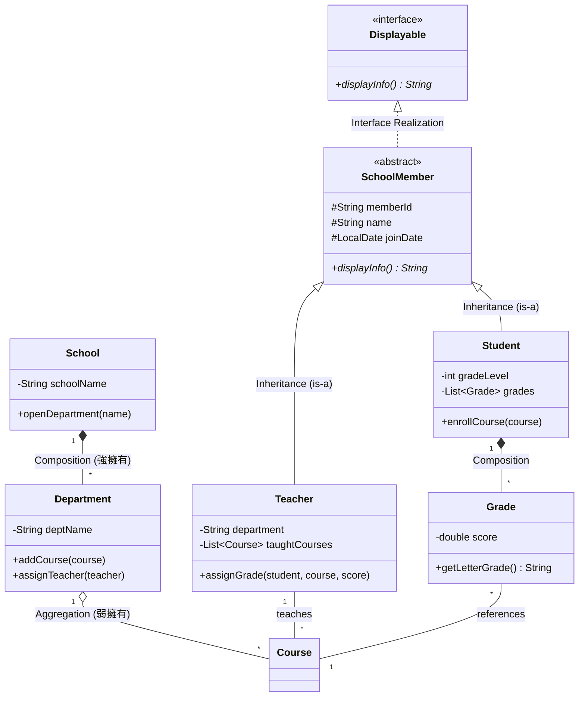

---

## 2. 系統分層架構 (Layered Architecture)
這張圖展示了 **關注點分離 (Separation of Concerns)**，即 Controller、Service 與 Model 之間的調用關係。

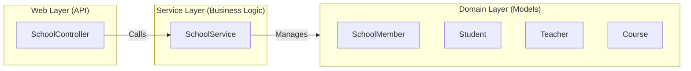

---

## 3. 資料傳輸與封裝 (DTO Pattern)
這張圖解釋了為何要使用 **DTO (Data Transfer Object)** 來保護內部 Domain Model，防止 **隱私洩漏 (Privacy Leak)**。

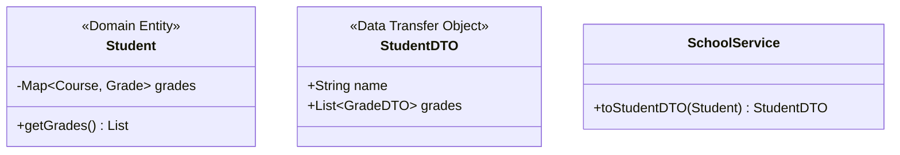

---

## 4. Spring 框架互動流程 (Spring Framework Interaction)
這張時序圖 (Sequence Diagram) 呈現了當使用者點擊「選課」時，Spring 框架如何與我們的領域模型進行互動。

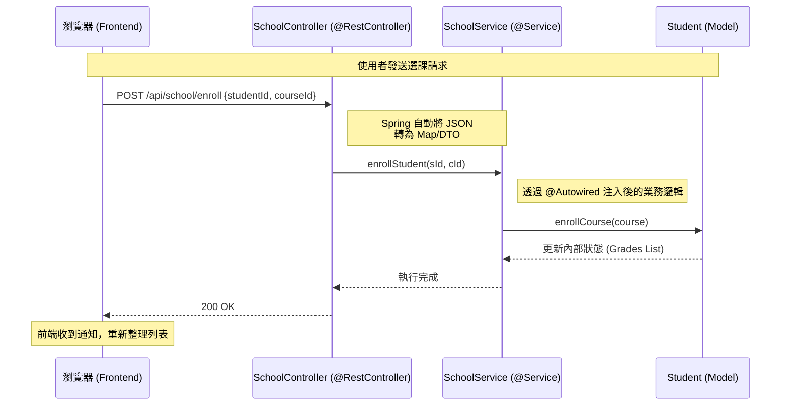

### 設計要點說明：
1.  **依賴注入 (Dependency Injection)**：`SchoolController` 不需要自己建立 `SchoolService`，而是透過 `@Autowired` 由 Spring 容器自動注入單例物件。
2.  **請求映射 (Request Mapping)**：Spring 透過 `@PostMapping` 攔截 HTTP 請求，並利用 `Jackson` 函式庫自動處理物件與 JSON 之間的轉換。
---

## 5. 與 Spring 框架的結構關係 (Framework Structural Integration)
這張類別圖展示了專案代碼與 Spring Framework 之間的結構聯繫。雖然 Spring 提倡 POJO (Plain Old Java Objects)，不強調強制的繼承，但透過 **註解 (Annotations)** 建立了深刻的結構關聯。

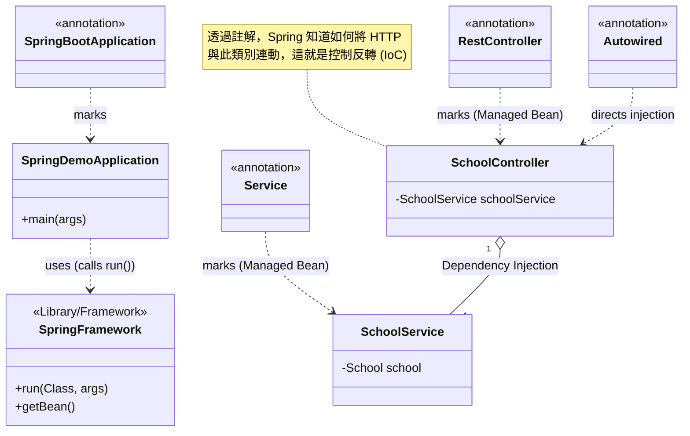

### 關鍵概念說明：
1.  **與框架解耦 (Decoupling)**：注意到我們的 `SchoolService` 與 `SchoolController` 並沒有 `extends` 或 `implements` 任何 Spring 的類別。這展示了 **非侵入式 (Non-invasive)** 框架設計的優點——業務邏輯與框架分離。
2.  **註解即契約 (Annotations as Contracts)**：`@RestController` 與 `@Service` 告訴 Spring：「請幫我管理這個類別的生命週期」。Spring 隨後會透過反射 (Reflection) 機制與這些類別互動。
3.  **控制反轉 (Inversion of Control)**：在傳統程式中，我們會在 Controller 中 `new SchoolService()`；但在 Spring 中，我們僅標註 `@Autowired`，由框架「反向」將服務實例注入到控制器中。

---

## 6. Spring 中的設計模式應用 (Design Patterns in Spring)

從這個框架與應用程式，可以看到以下的設計樣式被應用（以 **大學 University** 系統為例）：

### 1. 單例模式 (Singleton Pattern)
*   **Spring 應用**：Spring 中的 Bean 預設都是單例的（Singleton Scope）。
*   **大學範例**：在一個大學系統中，`RegistrarService`（註冊組服務）只需要一個實例即可處理全校的選課邏輯。

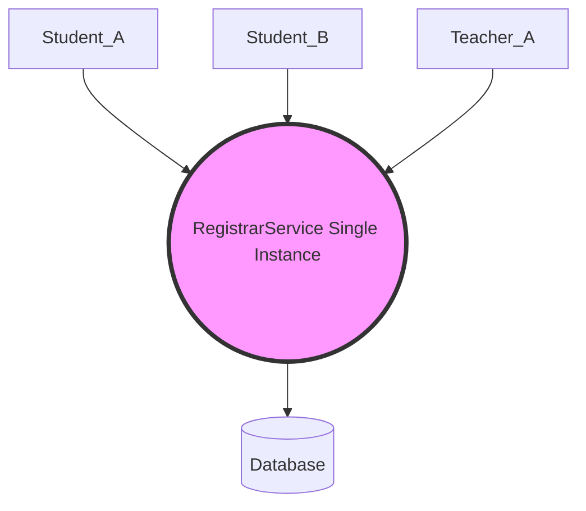

### 2. 工廠模式 (Factory Pattern)
*   **Spring 應用**：`BeanFactory` 與 `ApplicationContext` 是物件的工廠，負責根據配置生產 Bean。
*   **大學範例**：大學的「行政中心」就像工廠，根據學生的需求（例如選修課程類型）產出對應的「課程處理物件」。

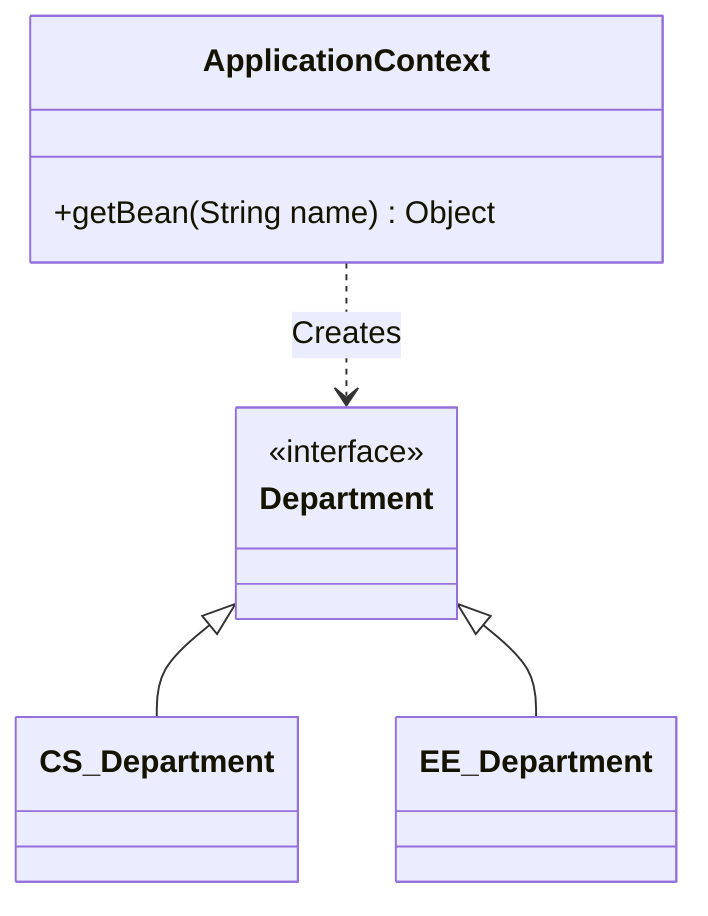

### 3. 代理模式 (Proxy Pattern)
*   **Spring 應用**：這是 Spring AOP 的核心。Spring 會為 Bean 建立代理物件，以實現事務管理、安全檢查等。
*   **大學範例**：當教師評分時，系統會先透過「代理人」確認教師是否有權限，並在完成後自動紀錄 Log。

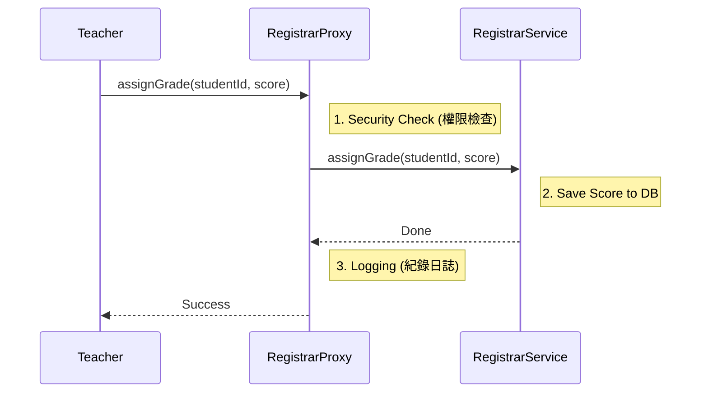

### 4. 範本方法模式 (Template Method Pattern)
*   **Spring 應用**：如 `JdbcTemplate`。定義一個演算法的骨架，而將一些步驟延遲到子類別中。
*   **大學範例**：大學的「入學註冊流程」是固定的模板：填表 -> 審核 -> 發證。但不同身份（新生、轉學生）的「審核」細節不同。

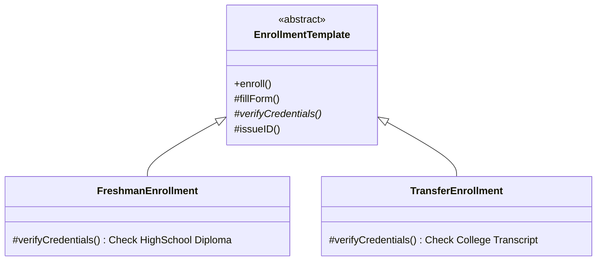

### 5. 觀察者模式 (Observer Pattern)
*   **Spring 應用**：Spring Event 機制。
*   **大學範例**：當一個課程選課人數已滿時，系統會發送通知給相關部門（如教室管理組調整教室）。

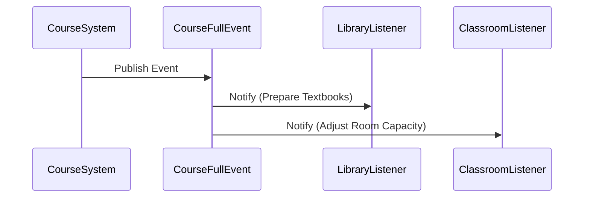

### 6. 策略模式 (Strategy Pattern)
*   **Spring 應用**：例如 Spring Security 中的不同認證策略。
*   **大學範例**：根據不同的課程類型（必修、選修、實驗），採用不同的「評分策略」。

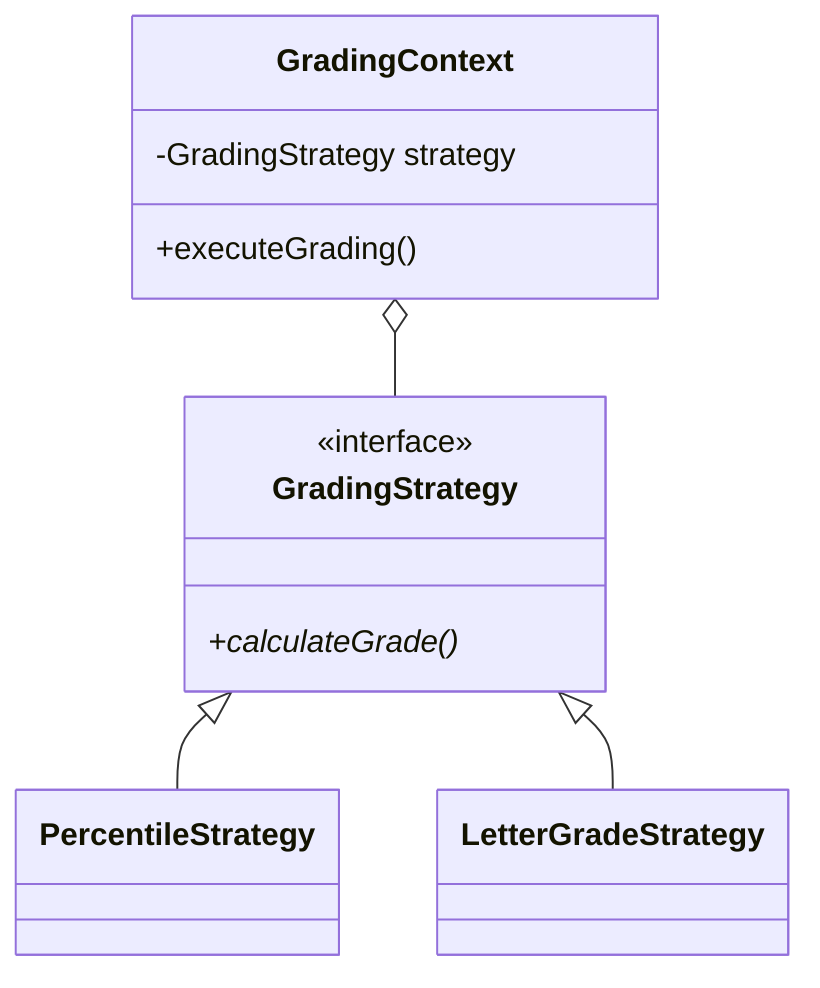

### 7. 裝飾者模式 (Decorator Pattern)
*   **Spring 應用**：Spring 處理 HTTP Request 的各類 Wrapper。
*   **大學範例**：一個基礎的「學生」物件，可以被動態裝飾上「助教」或「社團長」的職責。

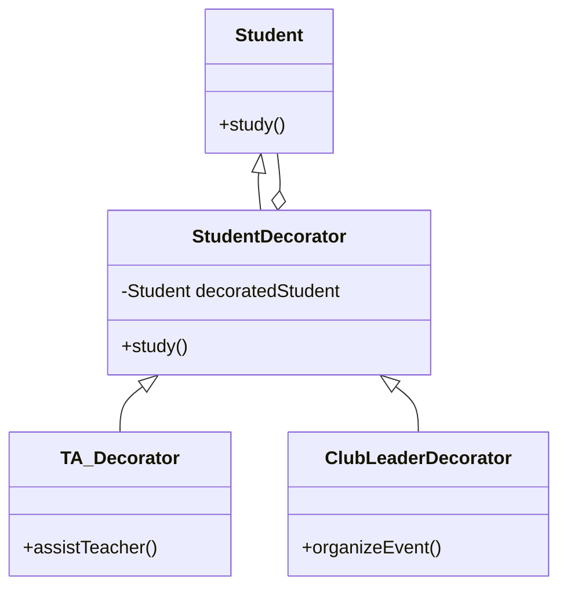

### 8. 轉接器模式 (Adapter Pattern)
*   **Spring 應用**：`HandlerAdapter` 等。
*   **大學範例**：大學系統需要對接「第三方支付」或「外部學術資料庫」。

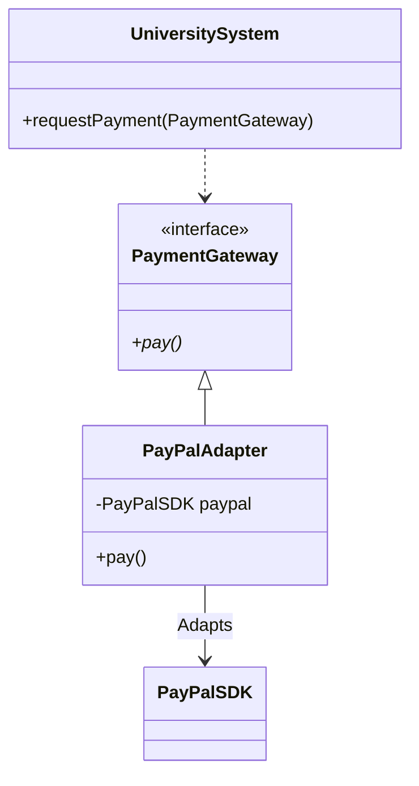